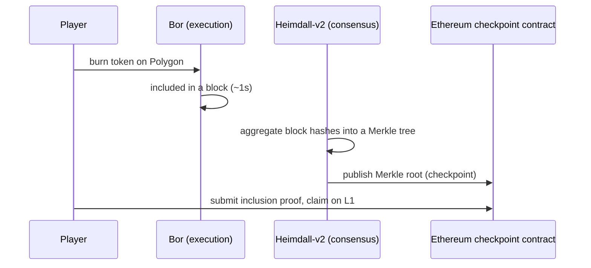

# Polygon and the EVM networks: which chain, and what that choice costs you

Your contract compiles. It will deploy, unchanged, to Ethereum mainnet, to Polygon, to Base, to
Arbitrum, to a chain that did not exist when you started reading this sentence. The bytecode
does not care. Every one of them runs the same EVM and speaks the same JSON-RPC, and in
[level 2](../exercises/solutions/02_read_the_chain.ts) you pointed viem at Polygon Amoy by
changing one import.

So the question is not *can* you deploy there. It is: **what are you buying, and what are you
giving up?** And the answer is not primarily a contract question. It lands on the backend — on
how long you wait before crediting a player, how much you budget per thousand mints, how
deeply you have to handle reorgs, and what happens when your RPC provider has a bad afternoon.

That is why a Tech Lead asks "why Polygon?" in a backend interview. They are not testing your
loyalty to a chain. They are finding out whether you understand that the choice changed their
architecture.

---

## Life on Ethereum mainnet

Start with the chain everything else is measured against, and price a small piece of a game on
it.

A game does many small things. A player claims a reward, equips an item, completes a quest,
trades with another player. Say a thousand of those a day, each one a modest contract call.

On mainnet the arithmetic is unforgiving, and it is worth writing out because the *shape* of it
is what matters. What you pay is gas units multiplied by price per unit multiplied by the price
of ETH. The gas units are fixed by your contract — a straightforward ERC-1155 mint that writes
one storage slot and emits one event is in the tens of thousands of gas, because as
[article 03](03_ethereum_evm_accounts_gas.md) established, the storage write dominates
everything else. The price per unit is a live market that moves with demand from every other
user of the chain, including people doing things far more valuable than your game. And ETH is
priced in the thousands of dollars.

Multiply those three and a single reward claim on mainnet costs something between a coffee and
a meal, depending on the hour. There is no game design that survives that. Not "it's expensive"
— it is categorically the wrong machine, the way an ACH transfer is the wrong machine for
buying a newspaper.

Then there is time. Ethereum produces a block every twelve seconds and finalises after two
thirty-two-slot epochs, which is about thirteen minutes. A player who taps "claim" and is told
to come back in a quarter of an hour has left.

This is the arithmetic that killed the 2021 generation of on-chain games, and it is why the
studio you are interviewing with is on Polygon.

## What Polygon actually is

Most candidates can say "Polygon is cheaper." Very few can say what it *is*, and the difference
between those two answers is most of the credibility available in this question.

Polygon PoS runs as two layers, which the
[Polygon documentation](https://docs.polygon.technology/pos/architecture/) names directly.
**Bor** is the execution layer — a fork of Geth, so it is genuinely the same EVM, which is why
your contract deploys unchanged. **Heimdall-v2** is the consensus layer, built on the Cosmos
SDK and CometBFT, and its job is to validate what Bor produced, aggregate block hashes into
Merkle trees, and periodically publish the Merkle root to a contract on Ethereum mainnet.

That last mechanism is called a **checkpoint**, and it is the load-bearing part of the design.
Polygon is not a rollup: it does not post its transaction data to Ethereum, and Ethereum cannot
re-execute Polygon's blocks to check them. What it posts is a commitment — a root hash saying
"this is what happened" — which is enough to prove, on Ethereum, that a particular withdrawal
was earned. Security therefore rests primarily on Polygon's own validator set, with Ethereum
serving as the settlement and withdrawal anchor.

Block production works in **spans**. Heimdall's validators select which validator produces
blocks for the next span rather than having every validator race, and since the **Rio** upgrade
that selection has narrowed to a single elected producer per span — the model Polygon calls
validator-elected block producer. The practical consequence is the one you can measure: with a
single known producer, two competing blocks at the same height essentially stop happening, and
reorgs become rare rather than routine.

You measured the result in [level 2](../exercises/solutions/02_read_the_chain.ts). Reading Amoy
on 19 September 2026, blocks arrived about one second apart and the gap between the `latest`
and `finalized` tags was two blocks. Two seconds to the point where reversal requires provable
validator misbehaviour, against Ethereum's thirteen minutes. The fee side was equally stark: the
base fee on that block was a rounding error away from zero, measured in billionths of a gwei.

**Say the names right.** The token is **POL**, not MATIC — the migration is essentially
complete and POL has been the gas token since 2024. The testnet is **Amoy**, chain ID **80002**;
Mumbai is shut down. Every tutorial that says otherwise was written before these changes and is
stale in ways that go beyond names.

## The taxonomy, stated as backend consequences

There are four kinds of place to put a contract, and the textbook distinctions are less useful
to you than the operational ones. For each, the question worth asking is not "how does it
achieve security" but "what does it do to my backend?"

| What you care about | Ethereum L1 | Sidechain (Polygon PoS) | Optimistic rollup (Base, Arbitrum) | ZK rollup |
| --- | --- | --- | --- | --- |
| Who guarantees it | Ethereum validators | Its own validator set, checkpointed to Ethereum | Ethereum, after a challenge window | Ethereum, after a validity proof |
| Fees | High and volatile | Fractions of a cent | Low | Low |
| Time to finality | ~13 minutes | Seconds | Seconds to soft-confirm, ~7 days to withdraw | Minutes to withdraw |
| Reorg exposure | Real, shallow | Rare since Rio | Depends on the sequencer | Depends on the sequencer |
| Single point of failure | None | The validator set | Usually a centralised sequencer | Usually a centralised sequencer |

Read the last two rows as your on-call rota. On a rollup with a centralised sequencer, "the
chain is down" is a thing that happens, and your backend needs to survive an RPC endpoint that
accepts transactions and then stops confirming them. On a sidechain, your exposure is the
validator set's health. On mainnet, your exposure is a fee spike pricing you out of your own
product mid-event.

And notice what is *not* in the table: the contract. It is the same everywhere. The differences
are entirely in the operational envelope around it, which is the point.

## Break it on purpose: the same code, the wrong chain

Here is a failure with no error message, which makes it worse than most.

Every EVM chain speaks identical JSON-RPC. An RPC URL for the wrong network answers every
question you ask, fluently and instantly. `getBlockNumber` returns a number. `getBalance`
returns a balance. `readContract` against your contract's address returns... something, or
nothing, depending on what else happens to live at that address on that chain.

Deploy your `GameItems` contract to Amoy at some address. Point a staging backend at Polygon
mainnet by mistake, keeping the same contract address. Now `balanceOf` returns zero for every
player, forever, because there is no code at that address on that chain, and — as
[level 3](../exercises/solutions/03_read_a_contract.ts) demonstrated — a call to an address
with no code returns empty data, which careless decoding reads as zero. Your inventory service
reports that every player owns nothing. Nothing logs an error. Nothing alerts.

Hence the first three lines of [level 2](../exercises/solutions/02_read_the_chain.ts):

```ts
const chainId = await client.getChainId();
if (chainId !== 80002) throw new Error(`expected Amoy, got ${chainId}`);
```

Assert the chain ID at startup, and assert that `getCode` at each contract address is non-empty.
Two lines, and they turn a silent class of failure into a refusal to boot. In an interview, the
instinct to check this is worth more than any fact about Polygon's validator set, because it is
the instinct of somebody who has operated a system rather than built a demo.

The second member of this family is subtler: the addresses that are not yours. Token contracts,
Multicall3, oracles, marketplaces — these have *different addresses on different chains*, and
hard-coding one is how a staging config reaches production. Configuration belongs per chain ID,
in one object, not scattered through the code as constants.

## Trace one withdrawal, and see what checkpoints cost

Most of what your game does stays on Polygon and is fast. One operation is not fast, and
knowing which one separates people who have read the architecture from people who have skimmed
it.

A player wants to move their token from Polygon to Ethereum. They burn it on Polygon, which
takes a second, and the burn is recorded in a Bor block. That block's hash goes into the Merkle
tree Heimdall is assembling. Some time later, Heimdall publishes the checkpoint — the Merkle
root — to the checkpoint contract on Ethereum mainnet. Only then can the player submit a proof
on Ethereum showing that their burn is included under that root, and claim the token.

Nothing about that path is instant, because it is gated on a transaction landing on mainnet,
which is gated on mainnet's own block times and fees. The gap is the price of the sidechain
design: cheap and fast *inside*, deliberate and Ethereum-paced on the way *out*.



For a game backend this matters in exactly one place: if your product lets players move value
out to Ethereum, that flow needs its own pending state, its own monitoring and its own support
story, because it is measured in a different unit of time from everything else you built.

## The choice, stated as you would state it to a Tech Lead

A game needs thousands of cheap, low-value, fast actions, and it needs a player to see a result
before their attention moves. Polygon prices those in fractions of a cent, confirms them in
about a second, finalises them a couple of blocks later, and runs the identical EVM your
contracts already target, so the engineering cost of the choice is close to zero. In exchange
you accept a smaller validator set than Ethereum's, a security model that leans on checkpoints
rather than on re-execution, and slow withdrawals to L1.

For an item economy, that is a good trade and an easy one to defend. For a system holding
millions in a single contract, it is a conversation. Being able to draw that line — and to say
which side this product sits on and why — is what the question is actually asking.

## Interview Angles

**"Why are we on Polygon rather than mainnet or an L2?"**

Lead with the product constraint, not the technology. A game does thousands of small actions
and mainnet prices each one like a bank transfer while making the player wait about thirteen
minutes for finality, so it is simply the wrong machine for this workload. Polygon gives
fractions of a cent per action, roughly one-second blocks, and finality a couple of blocks
behind the head — I measured two blocks on Amoy — while running a Geth-derived EVM, so the
contracts deploy unchanged. The honest cost is the security model: Polygon is a sidechain with
its own validator set that checkpoints Merkle roots to Ethereum rather than a rollup that posts
its data there, so you are trusting that validator set for liveness and correctness, and
withdrawals to L1 are paced by those checkpoints. For an item economy that is a sound trade. If
they push, add that the choice is also visible in the backend: with finality that close to the
head, you can credit players almost immediately instead of maintaining a deep confirmation
policy and a long pending state.

**"What's the difference between a sidechain and a rollup?"**

Keep it to the mechanism rather than the marketing. A rollup publishes its transaction data to
Ethereum and either proves its results with a validity proof or allows anyone to challenge them
during a window, so Ethereum can ultimately verify what happened and the rollup inherits its
security. A sidechain has its own consensus and its own validators, and posts only commitments
— in Polygon's case, Heimdall aggregates Bor's block hashes into a Merkle tree and publishes
the root to a contract on Ethereum, which is enough to prove a withdrawal was earned but not
enough for Ethereum to re-execute anything. The practical difference for me as a backend
engineer is where the trust and the latency sit: with a rollup I am exposed to a sequencer, and
with a sidechain I am exposed to a validator set, and both shape how long I wait before I treat
a transaction as real.

**"If we moved to another chain next quarter, what would you have to change?"**

Very little in the contracts and a specific, short list in the backend, which is the answer they
want to hear because it shows you have thought about configuration rather than code. Chain ID
and RPC endpoints, obviously, and every contract address — including the ones that are not ours,
like the token contracts and Multicall3, which differ per chain and belong in one configuration
object keyed by chain ID rather than scattered as constants. Then the parameters that are really
policy: confirmation depth and reorg tolerance, because a chain with a different finality
profile changes when it is safe to credit a player; the fee strategy, because EIP-1559 behaves
differently where the base fee is effectively zero than where it is contested; and the indexer's
block-range chunking, because providers cap `getLogs` differently. The one thing I would insist
on either way is asserting the chain ID and the presence of contract code at startup, because
pointing a service at the wrong EVM chain fails silently — every call succeeds and returns
plausible nonsense.
