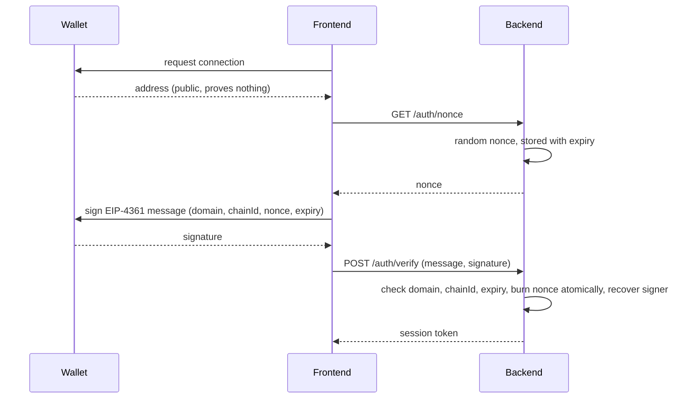

# Wallets, keys and signatures: how a player proves who they are

Your game has a login screen. In every normal product, what happens behind it is that the
player sends you a password, you compare a hash of it against a hash you stored, and you issue
a session cookie. The security of the whole thing rests on a secret that **you** hold a
derivative of, in **your** database.

Now remove the database. The player has no account with you, has never registered, and may be
connecting from a wallet they created ten seconds ago. They have a private key you have never
seen and must never see, and you have to decide whether to let them into an account that holds
items worth real money.

That is the problem this article solves, and it is the part of "wallet integration" that lives
entirely on the server — which means it is the part a backend engineer gets asked about.

---

## Life without a wallet: what you are giving up and gaining

It is worth being clear-eyed about the trade, because the industry is not unanimous and your
interviewer may not be either.

With passwords, you can reset them. A player who loses one emails support, proves who they are
somehow, and gets back in. With keys, there is no reset. A lost key is a lost account and lost
items, permanently, and there is nobody to appeal to. This is not a UX wrinkle to be smoothed
away; it is a property of the design, and every "solution" to it is really a decision about who
holds the key instead.

What you gain is that the player's ownership does not depend on your company existing. The
sword is theirs on a chain you do not control, and they can sell it on a marketplace you did
not build. For a game economy that is the whole pitch.

## The primitive: recovery, not comparison

Start with the mechanism, because everything else is a wrapper around it.

In [level 1](../exercises/solutions/01_hash_and_address.ts) you took a random 32-byte number,
derived the public key from it on the secp256k1 curve, hashed that public key and took the last
twenty bytes. That is the address. Nothing was registered anywhere; you computed an identity.

In [level 4](../exercises/solutions/04_sign_and_recover.ts) you signed a message with the key
and then handed only the *message and the signature* to a function that returned the address.
This is the part that is genuinely different from every auth system you have built:

```ts
const recovered = await recoverMessageAddress({ message, signature });
```

The server holds nothing. There is no stored credential to compare against, no user record to
look up, no shared secret. Given the message and the signature, elliptic-curve mathematics
reconstructs the public key that must have produced it, and the address follows by hashing. You
do not verify a claim of identity — you *derive* it.

An analogy that carries: a password check is a bank comparing your signature against the
specimen card on file. A signature recovery is more like a sealed wax stamp whose imprint could
only have come from one ring — you do not need a copy of the ring, and the bank does not need a
file on you at all.

## The layers, from the key upward

**A private key** is 32 random bytes. That is the whole account.

**A mnemonic** — twelve or twenty-four words — is that randomness encoded so a human can write
it down, defined by BIP-39. The words map to entropy plus a checksum, which is why a mistyped
word is usually caught rather than silently producing a different, empty wallet.

**Hierarchical derivation** (BIP-32, with the path convention from BIP-44) turns one seed into
unlimited keys along a path like `m/44'/60'/0'/0/0`, where `60` is Ethereum's coin type. This
is why one phrase restores every account in a wallet, and why the "account 2" in someone's
MetaMask is not a separate backup.

**An EOA** is the account that key controls, as [article 03](03_ethereum_evm_accounts_gas.md)
described: no code, and the only kind of account that can *start* a transaction.

**A smart account** is a contract that holds assets and decides for itself what authorisation
means — multiple signers, spending limits, session keys, social recovery. It cannot initiate a
transaction on its own, which is the problem the next section is about.

## What gets signed, and why the wrapper matters

There are three things a wallet can sign, and conflating them is where security bugs come from.

**A transaction.** RLP-encoded, containing nonce, gas, recipient, calldata, and since EIP-155
the chain ID. This moves value and costs gas.

**A plain message** (EIP-191 personal sign). The wallet prefixes the message with
`"\x19Ethereum Signed Message:\n"` and its length, hashes that, and signs the hash. You rebuilt
this by hand in level 4 and confirmed it matched. The prefix exists so that a signature given to
a website can never be replayed as a transaction: RLP-encoded transactions cannot begin with
`0x19`, so the two signing domains are structurally disjoint. A site asking you to sign raw
unprefixed bytes is asking for a blank cheque, and wallets warn about it loudly.

**Typed structured data** ([EIP-712](https://eips.ethereum.org/EIPS/eip-712)). Instead of a
string, you sign a struct with named, typed fields, hashed together with a **domain separator**
that pins the application's name, its version, the chain ID and the verifying contract's
address.

That fourfold domain is the entire point, and level 4's last section showed why. A signature
over the plain string `"mint item 42 to 0xf39F…"` is valid on every chain, to every contract,
forever. Nothing in the signed bytes says where it was meant to be used, so a voucher issued on
a testnet can be replayed on mainnet. EIP-712 makes the signature meaningless outside the exact
contract, chain and application it names — and, as a side benefit, gives the wallet something
human-readable to display instead of a hex blob, which is how a user can tell a mint from a
transfer of everything they own.

## Break it on purpose: the login that never expires

You built this failure in level 4 and it deserves restating, because it is the most common
hand-rolled wallet-auth bug and the most likely thing you will be asked to critique.

The naive login: ask the player to sign `"Log me in to Metaspace"`, recover the address, and
issue a session. It works. It also works when an attacker replays the *same signature* an hour
later, a month later, from anywhere. The signature is a bearer token with no expiry, no
audience and no binding to a session. Anyone who finds it in a log file, a proxy, a crash
report or a leaked database is that player forever, without ever touching the key.

Three things fix it, and all three are server-side state, which is the sentence worth
remembering: the server issues a **random nonce** and remembers it; the signed text includes
that nonce plus the **domain** and an **expiry**; and the server **deletes the nonce the moment
it is used**, so a second presentation of the same signature finds nothing to match.

Standardise those three and you have [EIP-4361](https://eips.ethereum.org/EIPS/eip-4361),
Sign-In With Ethereum, which is what [level 5](../exercises/EXERCISES.md) builds as an Express
endpoint. viem ships the message construction and verification — `generateSiweNonce`,
`createSiweMessage`, `verifySiweMessage` — so there is no separate library to add, and the
interesting part of the exercise is not the crypto but the **atomicity**: checking that a nonce
exists and then deleting it in two steps is a race two concurrent requests can both win.

## Trace one login

A player taps "connect."

The wallet asks the player to approve a connection and the frontend learns their address. This
step is not authentication — the address is public information and anyone can claim any address
by typing it. Treating "wallet connected" as "logged in" is a real vulnerability, not a
shortcut.

The frontend asks your backend for a nonce. You generate a random one, store it with a short
expiry, and return it.

The frontend builds an EIP-4361 message containing your domain, the player's address, the chain
ID, an issued-at timestamp, an expiry and that nonce, and asks the wallet to sign it. The
player sees readable text describing what they are signing.

The signature comes back to your backend with the message. You check, in this order: that the
domain is yours, that the chain ID is what you expect, that the message has not expired, that
the nonce exists and is unused — deleting it in the same atomic step — and finally that the
signature recovers to the address the message claims. Only then do you issue your own session
token, which from that point on is an ordinary JWT or session cookie with all the ordinary
rules.



Note what the chain never did: nothing. A wallet login involves no transaction, no gas and no
node. It is pure local cryptography on both sides, which is why it is fast and free, and why it
belongs to the backend rather than to "the blockchain part" of the system.

## The problem this leaves: your players do not have wallets

Everything above assumes a player who has installed a wallet, holds POL for gas, and
understands what signing means. For a mobile RPG that assumption destroys your funnel. The
studio has three ways out, and knowing all three — with their costs — is the mature answer to
"how would you handle onboarding?"

**Custodial.** The studio holds keys on the player's behalf, and the player logs in with an
email like any other game. Onboarding is frictionless and the player owns nothing in the sense
that matters, because you can move their assets. You are now running key management as a core
competency, with hardware security modules or a key-management service, strict separation
between the signing service and everything else, and a very bad day if you are wrong. Whether
this is acceptable is partly a regulatory question, not only an engineering one.

**Sponsored gas with account abstraction.** The player has their own key, but the studio pays
for transactions. Two mechanisms now exist, and they are commonly confused. **ERC-4337** builds
this beside the protocol: user operations go to a separate mempool, a bundler packages them,
and a paymaster contract agrees to pay — no protocol changes required, at the cost of a parallel
infrastructure. **[EIP-7702](https://eips.ethereum.org/EIPS/eip-7702)**, which shipped in
Pectra in May 2025, builds a piece of it into the protocol: an ordinary EOA can sign an
authorisation letting it temporarily execute contract code, so an existing wallet gains
batching and sponsorship without migrating to a new contract account.

**Embedded wallets from a vendor.** A managed service creates and secures a key for the player
behind a familiar login, usually splitting it so no single party holds the whole thing. This is
the pragmatic middle and what most studios of Metaspace's size actually ship. The cost is a hard
dependency on a vendor sitting inside your auth path.

The engineering point to make in the room, whichever they use: **none of this changes your
backend's contract with the chain.** Vouchers are still signed the same way, the indexer still
reads the same events, the relayer still manages nonces. What changes is who holds the key and
who pays the gas. Keeping those concerns behind one internal interface — `signFor(player)` and
`submit(transaction)` — is what makes a wallet strategy swappable instead of load-bearing.

## Interview Angles

**"Walk me through wallet-based login. Where's the vulnerability?"**

Describe the flow and then go straight to the failure, because naming it unprompted is the
signal. The flow is that the server issues a random nonce, the wallet signs an EIP-4361 message
containing that nonce along with the domain, chain ID and an expiry, and the server recovers the
signer from the signature and compares it to the address in the message — no stored credential
anywhere, because recovery reconstructs the public key from the signature itself. The
vulnerability in hand-rolled versions is replay: if the signed text has no nonce and no expiry,
the signature is a bearer token that works forever, so anyone who sees it in a log or a proxy is
that player permanently. And the subtle one, which is where I would actually look in a code
review, is that burning the nonce has to be atomic — if the code reads the nonce, verifies, and
then deletes it, two concurrent requests with the same signature can both pass, so it needs to
be a single conditional delete that returns whether it removed anything.

**"What's EIP-712 and why not just sign a string?"**

Because a string signature says nothing about where it is allowed to be used. If the backend
signs `"mint item 42 to Alice"`, that signature is valid against any contract that checks the
same string, on any chain, forever — so a voucher issued on a testnet can be replayed on
mainnet, and a voucher for one contract works on another. EIP-712 signs a typed struct together
with a domain separator carrying the application name, version, chain ID and verifying contract
address, which binds the signature to exactly one place, and the type hash binds it to exactly
one shape of data so fields cannot be reinterpreted. The secondary benefit is real too: the
wallet can show the user named fields instead of a hex blob, which is the difference between a
user approving a mint and a user approving the transfer of everything they own.

**"Our players won't install MetaMask. What do we do?"**

Lay out the three options with their costs rather than picking one, because the right answer
depends on facts you do not have yet. Custodial wallets give the smoothest onboarding and make
the studio responsible for key management, which is a serious operational and possibly
regulatory commitment. Account abstraction lets the player keep their own key while the studio
sponsors gas — either ERC-4337 with its separate mempool, bundlers and paymasters, or EIP-7702,
which since Pectra lets a plain EOA temporarily execute contract code and gets you batching and
sponsorship without a migration. Embedded wallets from a vendor are the pragmatic middle and
what most studios this size ship, at the cost of a vendor inside the auth path. Then make the
architectural point: whichever they choose, the backend's job does not change — vouchers,
indexing and relaying are identical — so I would put signing and submission behind one internal
interface and keep the wallet strategy replaceable, because this is the layer of the stack most
likely to change in the next eighteen months.
