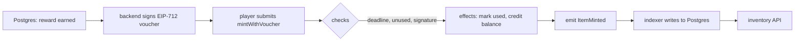

# Solidity from zero: enough to read a contract out loud

You do not need to become a contract engineer in the next week. You need to be able to open
`GameItems.sol` with a Tech Lead watching, read it aloud, and say correct things about why each
line is the way it is — including the lines that are wrong.

That is a lower bar than "write production Solidity" and a much higher bar than "did a
tutorial," and it is reachable, because Solidity is a small language. What makes it hard is not
syntax. It is that **the constraints are unfamiliar**: code you cannot change after deploying,
storage that costs twenty thousand gas a slot, arithmetic on 256-bit words, no clock, no
network, no randomness, and an adversary who reads your source and is paid to break it.

This article builds one contract three times, each version fixing what the last one got wrong.
All three are in [exercises/contracts/src/](../exercises/contracts/src/) and all three compile
clean under Solidity 0.8.37 — `cd exercises/contracts && npm install && node compile.mjs`.

---

## Life without a contract

Your game already has an item ledger. It is a Postgres table: player id, item id, quantity. The
game server is the only thing that writes to it, and that arrangement is excellent — fast,
transactional, free, and fixable at three in the morning.

Its one weakness is the one from [article 02](02_blockchain_from_zero.md): every player has to
trust you not to edit it, and nobody outside your company can check whether you did. If your
studio says a sword is one of ten, there is no way for a buyer on a secondary market to verify
that, and no way for the sword to outlive your servers.

So you move *that one table* to a place where the rules are public and nobody, including you,
can quietly break them. That place is a contract, and a contract is just that table plus the
functions allowed to change it, running somewhere everybody can watch.

## Version one: the table, with nothing protecting it

```solidity
// SPDX-License-Identifier: MIT
pragma solidity ^0.8.28;

contract ItemLedgerV1 {
    mapping(address => mapping(uint256 => uint256)) public balanceOf;

    function mint(address to, uint256 itemId, uint256 amount) external {
        balanceOf[to][itemId] += amount;
    }
}
```

Six lines, and most of what Solidity is appears in them.

The **pragma** fixes the compiler version, and it is not ceremony: compiler releases change code
generation and occasionally semantics, so a contract that does not pin its version is a contract
whose deployed bytecode depends on who built it. The current release is 0.8.37, from 10
September 2026.

The **mapping** is the storage. A mapping is not a hash table in memory; it is a rule for
computing where in the contract's permanent 256-bit-keyed storage a value lives. You cannot
iterate it, you cannot ask its length, and every key that was never set reads as zero rather
than as missing. That last property is used constantly and trips people constantly: there is no
difference between "Alice owns zero swords" and "Alice has never heard of swords."

Declaring it **public** generates a getter function for free. That getter is why
[level 3](../exercises/solutions/03_read_a_contract.ts)'s `balanceOf(address)` exists at all on
an ERC-20 — the standard is often satisfied by a public mapping rather than a hand-written
function.

**`external`** means this function can be called from outside but not internally, which is
marginally cheaper than `public` because arguments can be read straight from calldata. The
visibility keywords — `external`, `public`, `internal`, `private` — are worth knowing precisely,
with one caveat to say out loud in an interview: **`private` hides nothing.** All contract
storage is readable by anyone with an RPC connection. It restricts which *code* may touch the
variable, not who may see it. A "private" key or a hidden loot table in contract storage is
public.

And `+=` on a `uint256` is safe by default. Since Solidity 0.8.0, arithmetic reverts on
overflow, which retired an entire family of exploits and the SafeMath library that used to
prevent them. Old tutorials importing SafeMath are pre-0.8 and everything else in them should be
read with suspicion.

### Break it on purpose

Deploy that contract and anybody can call `mint`. Not a subtle race, not an edge case — a
public function that creates assets, callable by anyone with a wallet, for the cost of the gas.

The reason this matters more here than in a normal codebase is the deployment model. A web
endpoint missing an auth check gets a fix and a deploy. A contract missing an auth check is
**immutable by default**: there is no patch, only a migration — a new contract, a new address,
and a coordinated move of every integration that referenced the old one, while the broken one
keeps running forever because nobody can turn it off.

That asymmetry is the whole cultural difference between contract engineering and the rest of our
profession, and it is worth naming in the interview.

## Version two: authority, events, and errors

```solidity
contract ItemLedgerV2 {
    error NotAuthorised(address caller);
    error ZeroAmount();

    address public immutable gameServer;

    mapping(address => mapping(uint256 => uint256)) public balanceOf;

    event ItemMinted(address indexed to, uint256 indexed itemId, uint256 amount);

    constructor(address gameServer_) {
        gameServer = gameServer_;
    }

    modifier onlyGameServer() {
        require(msg.sender == gameServer, NotAuthorised(msg.sender));
        _;
    }

    function mint(address to, uint256 itemId, uint256 amount) external onlyGameServer {
        require(amount != 0, ZeroAmount());
        balanceOf[to][itemId] += amount;
        emit ItemMinted(to, itemId, amount);
    }
}
```

Four new ideas, each of which is asked about directly.

**`msg.sender`** is the caller — the immediate caller, which is the whole subtlety. If a player
calls contract A and A calls you, then `msg.sender` is A, not the player. Access control built
on `msg.sender` is asking "which contract or account is speaking to me right now," and that is
almost always the right question. Its dangerous cousin `tx.origin` names the EOA that started
the whole call chain, and using it for authorisation is a classic vulnerability: any contract a
user is tricked into calling can then impersonate them to you.

**The constructor runs exactly once**, at deployment, and then its code is not part of the
deployed contract at all. `immutable` variables are set there and afterwards live inside the
bytecode rather than in storage, so reading one costs nearly nothing while reading a normal
storage variable costs 2,100 gas cold. For a value fixed at deployment — a signer address, a
token address, a chain-specific constant — `immutable` is free money.

**A modifier** is code wrapped around a function body, with `_;` marking where the body goes.
Modifiers are how access control is expressed idiomatically, and OpenZeppelin's `onlyOwner` is
exactly this shape.

**Custom errors instead of strings.** `revert NotAuthorised(msg.sender)` encodes a four-byte
selector plus the argument, where `require(cond, "Not authorised")` stores and returns the whole
string — which costs deployment size and gas on every failure. The `require(bool, error)` form
used above arrived in Solidity 0.8.26, so it is new enough that most tutorials still show the
string form or the `if (...) revert Error();` pattern; all three work, and knowing why the
custom error is preferred is a small currency signal.

**The event** is the important one for you, because it is where your backend enters the picture.
`emit ItemMinted(...)` writes a log entry: cheap, as [article 03](03_ethereum_evm_accounts_gas.md)
priced it, and invisible to contracts — no contract can ever read a log. Logs exist purely for
the outside world, which is to say for your indexer.

The `indexed` keyword decides how you can query it. Up to three parameters may be indexed, and
those become **topics** you can filter on at the node; the rest are packed into the data blob
and must be decoded after the fact. Marking `to` and `itemId` indexed means your indexer can ask
"every mint to this player" without downloading everything, which is precisely the query
[level 6](../exercises/EXERCISES.md) writes. Getting this wrong is not fatal but it is
permanent: you cannot add an index to an event after deployment any more than you can change
anything else.

## Version three: the voucher, and the ordering that matters

Version two has a practical problem. The game server is the only minter, so the game server must
send a transaction for every reward, pay the gas, and hold a key that can mint anything at any
moment. Vouchers fix all three: the server *signs* an authorisation off-chain and the player
submits it, so gas is paid by whoever cares, unclaimed rewards cost nothing, and the signing key
authorises one specific mint rather than unlimited minting.

The full contract is
[03_ItemLedgerV3.sol](../exercises/contracts/src/03_ItemLedgerV3.sol); here is its centre.

```solidity
function mintWithVoucher(Voucher calldata voucher, bytes calldata signature) external {
    if (block.timestamp > voucher.deadline) revert VoucherExpired(voucher.deadline);
    if (voucherUsed[voucher.voucherId]) revert VoucherUsed(voucher.voucherId);

    bytes32 structHash = keccak256(
        abi.encode(
            VOUCHER_TYPEHASH,
            voucher.to,
            voucher.itemId,
            voucher.amount,
            voucher.voucherId,
            voucher.deadline
        )
    );
    bytes32 digest = keccak256(abi.encodePacked("\x19\x01", DOMAIN_SEPARATOR, structHash));
    if (_recover(digest, signature) != signer) revert BadSignature();

    voucherUsed[voucher.voucherId] = true;
    balanceOf[voucher.to][voucher.itemId] += voucher.amount;

    emit ItemMinted(voucher.to, voucher.itemId, voucher.amount, voucher.voucherId);
}
```

Read it as the three phases it is, because those phases have a name and the name is the answer
to a security question you will be asked.

**Checks** come first: is it expired, has this voucher been used, is the signature really from
our server. **Effects** come second: mark the voucher used, then credit the balance.
**Interactions** — calls out to other contracts — come last, and here there are none, which is
the safest possible version. This ordering is **checks-effects-interactions**, and it is the
discipline that prevents reentrancy: if you credited the balance and called out *before*
marking the voucher used, a recipient contract could call back into `mintWithVoucher` with the
same voucher and mint again, repeatedly, because the check it would face has not been
invalidated yet.

Note that this version does not call out at all, and yet the ordering is still written
defensively. That is deliberate: the day someone converts this to ERC-1155's `_mint`, which
*does* call back into contract recipients, the ordering is already right.

Three details in the surrounding code repay attention.

`Voucher calldata` rather than `Voucher memory` — **data location is not a style choice**.
`calldata` is the read-only transaction payload and reading from it is cheap; `memory` means
copying it first, which costs gas proportional to size; `storage` is the permanent, expensive
one. For an external function's read-only struct parameter, `calldata` is the right answer, and
knowing why is a very common interview question.

The **type hash** is a hash of the literal string
`"Voucher(address to,uint256 itemId,uint256 amount,uint256 voucherId,uint256 deadline)"`, and it
must match what the backend hashes byte for byte — every field name, every type, in order, no
spaces. This is the failure [level 10](../exercises/EXERCISES.md) is built around, because when
it is wrong nothing tells you: the signature simply does not verify, with no useful error.

The **`0x19 0x01` prefix** on the digest is EIP-712's version of the safety interlock from
[article 05](05_wallets_keys_signatures.md) — it keeps a typed-data signature from being
mistakable for a transaction or for a personal-signed message. And `_recover` rejects any
signature whose `s` value is in the upper half of the curve order, which is the EIP-2
malleability rule: without it, an attacker can flip a valid signature into a second, different,
equally valid signature for the same message — harmless here because the voucher ID is the
replay key, but fatal in any design that uses the signature hash itself as an identifier.

## What the compiler tells you, and the ceiling it enforces

Compiling all three prints their deployed sizes: 397 bytes, 659 bytes and 1,696 bytes.

The number that matters is the one they are compared against.
[EIP-170](https://eips.ethereum.org/EIPS/eip-170) caps a deployed contract at **24,576 bytes**,
and there is no way around it. Large systems respond by splitting logic across contracts,
extracting libraries, or deploying a thin proxy that delegates to an implementation — which is
also how upgradeability is achieved, and which brings its own category of bugs where the proxy's
storage layout and the implementation's disagree. For a game contract you are unlikely to
approach the limit, but "we were at twenty-two thousand bytes and had to split the marketplace
out" is the kind of war story that makes the number real.

## Trace one mint, from the game's database to the player's balance

The player finishes a dungeon and your Postgres row says they earned item 42. Nothing on chain.

They tap claim. Your backend allocates voucher ID 9001, builds the struct, hashes it with the
type hash, hashes that with the domain separator, signs the digest with the server key, and
returns the voucher and signature. Still nothing on chain, and still free.

The player submits `mintWithVoucher`. The EVM decodes the calldata, and the contract checks the
deadline, checks that 9001 is unused, recomputes the struct hash from the *fields it was given*
— which is why a modified voucher produces a different hash and fails — and recovers the signer.
Any tampering, any wrong chain, any wrong contract changes the digest and the recovered address
is somebody else, so the call reverts.

It marks 9001 used, adds to the balance, emits `ItemMinted`. The transaction costs the player a
fraction of a cent.

Seconds later your indexer sees the log and updates the game database. The player's inventory
API — an ordinary Postgres read — shows the sword.



## Interview Angles

**"Read this contract and tell me what's wrong with it."**

The most likely practical exercise, and the method matters more than any single finding. Work
outward in a fixed order so nothing is missed and the interviewer can follow you: first, who can
call each state-changing function, and is that the intended set — a missing access-control
modifier is the most common real bug and the easiest to spot. Second, the ordering inside each
function: are all the checks before all the effects, and does anything call out to an untrusted
address before the state is settled. Third, the arithmetic, which since 0.8 is mostly a question
of whether anything is wrapped in `unchecked` and why. Fourth, the things that are not there —
no event on a state change, so nothing downstream can index it; no deadline on a signed message;
no replay key on a voucher. And if you spot something you are unsure about, say so as a question
rather than a verdict: "is `tx.origin` deliberate here, or should that be `msg.sender`?" is a
strong sentence and a bluff is not.

**"Why are events so important if contracts can't read them?"**

Because the audience for events is never the chain, it is everything outside it, and the pricing
makes that explicit: a storage write is around 20,000 gas while a log is a few hundred plus a
little per byte, so a well-designed contract stores only the state it must enforce on-chain and
emits everything else. That split is exactly what makes an indexer both possible and necessary
— my backend reconstructs a rich, queryable view of the game economy from logs that cost the
contract almost nothing to produce. The design decision to get right at deployment time is which
parameters are `indexed`, since only those become filterable topics, and you cannot change it
afterwards. I would index the player address and the item id, because "what does this player
own" and "who holds this item" are the two queries a game asks constantly.

**"What's the difference between storage, memory and calldata?"**

Storage is the contract's permanent state, persisting between transactions and priced
accordingly — roughly 20,000 gas to set a slot from zero, 2,100 to read one cold. Memory is a
scratchpad that exists only for the duration of a call and is cheap but grows quadratically in
cost if you are careless with it. Calldata is the read-only transaction payload, cheapest of the
three because there is nothing to copy. The practical rule I follow is that external function
parameters that are only read should be `calldata`, anything being built or modified within a
call goes in `memory`, and `storage` is reserved for what genuinely must outlive the
transaction. It is worth adding that the distinction is not merely about gas: assigning a
storage reference to a local variable creates a pointer to the real state, so writing through it
changes the contract permanently, while the same code with `memory` modifies a copy and silently
does nothing. That is a bug I would look for in review.
