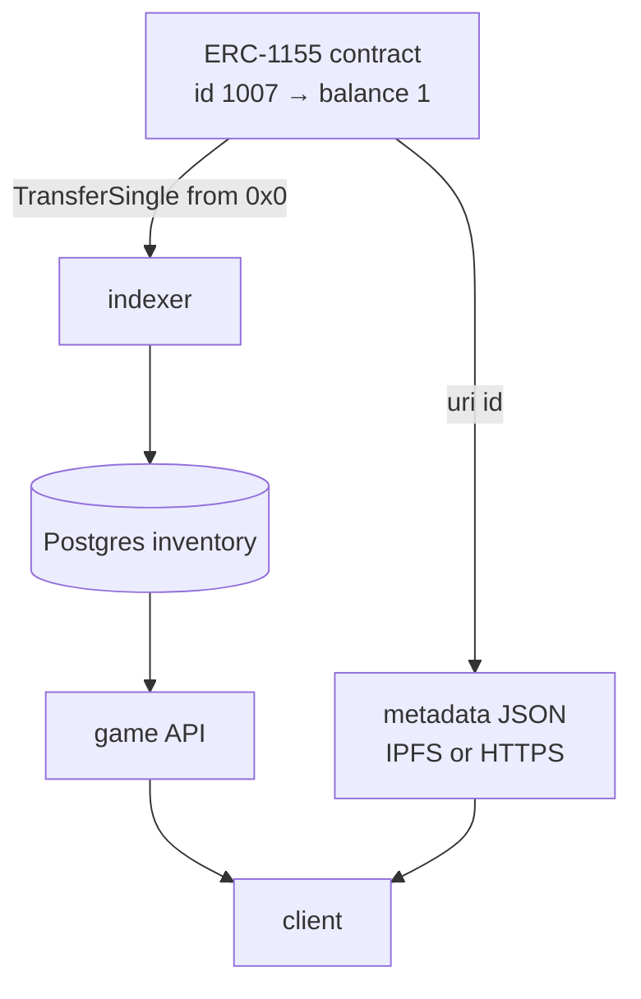

# Token standards: what a digital asset actually is

A "digital asset" sounds like a thing. It is not. There is no file, no object, no record with
your name on it anywhere. What exists is **a number in a mapping inside a contract**, and a set
of rules about who is allowed to change it.

That is the entire substance of a token, and once you see it that way the standards stop being
a taxonomy to memorise and become what they are: agreements about function names, so that a
wallet written in 2019 can display an item minted by a game in 2026 without either having heard
of the other.

This article covers the three standards you will be asked about, why a game uses the third one,
and the two places where the details bite.

---

## Life without a standard

You already wrote the minimal version in [article 06](06_solidity_from_zero.md):

```solidity
mapping(address => mapping(uint256 => uint256)) public balanceOf;
```

Player, item, quantity. It works perfectly. Your game can read it, your contract can update it,
and the ownership is genuinely on chain and genuinely public.

And nothing else in the world can see it. No wallet will display those items, because no wallet
knows to call `balanceOf(address,uint256)` on your particular contract. No marketplace will list
them. No other game can integrate. Your asset is on a public chain and is nonetheless as
isolated as a row in your own database — you have paid all the costs of decentralisation and
received almost none of the benefit.

A token standard is the fix, and it is nothing more than a published list of function
signatures and event shapes. Implement them and every wallet, indexer, explorer and marketplace
can read your contract without being told anything about it. That is all "ERC-20 compliance"
means: you named your functions what everyone else named theirs.

## ERC-20: a balance, and one awkward idea

ERC-20 is fungible tokens — currencies, points, the `$LORD` and `$MLD` of a game economy. One
unit is exactly as good as another, so the state is one number per holder.

The functions are the obvious ones: `totalSupply`, `balanceOf(address)`, `transfer(to, amount)`,
plus `name`, `symbol` and `decimals` for display. You called four of them in
[level 3](../exercises/solutions/03_read_a_contract.ts).

**Decimals are a display convention and nothing more.** The contract stores integers. A token
with 18 decimals showing a balance of 1.5 is storing 1500000000000000000, and that is the number
your database must hold — as a string or a numeric, never a float, because a float cannot
represent it. This is the single most common data-integrity bug in a first Web3 backend, and it
is silent until someone's balance is off by a rounding error nobody can explain.

Then the awkward part, which is asked about constantly: **`approve` and `transferFrom`**.

A contract cannot reach into your wallet and take tokens, and it also cannot be called by your
tokens. So for a marketplace to move your currency when a trade executes, you must first call
`approve(marketplace, amount)` on the token contract, authorising it to move up to that amount
on your behalf. Later the marketplace calls `transferFrom(you, seller, price)`.

Two transactions to do one thing, which is why every Web3 interface makes you click twice the
first time you use it. It is also why unlimited approvals are so common — users approve a huge
number once to avoid repeating the step — and why that habit is dangerous: a compromised or
malicious contract with an unlimited approval can drain that token from your wallet at any
future moment, with no further action from you.

[EIP-2612](https://eips.ethereum.org/EIPS/eip-2612) fixes the ergonomics with `permit`: the user
*signs* an approval off chain and the spender submits it inside the same transaction as the
action. One click, one transaction, no standing approval. It is EIP-712 typed data underneath —
the same machinery as the voucher in [level 10](../exercises/solutions/10_voucher_eip712.ts) —
and recognising that the two are the same pattern is worth saying out loud in an interview.

## ERC-721: uniqueness

ERC-721 is non-fungible tokens. The state is inverted: instead of an address mapping to a
balance, a token ID maps to an owner.

```solidity
mapping(uint256 => address) private _owners;
```

Hence `ownerOf(tokenId)`, which has no ERC-20 equivalent because the question is meaningless for
fungible tokens. Each ID is a distinct thing with its own owner and its own metadata.

This is right for genuinely unique items — a named sword, a plot of land, a character. It is
wrong for most of a game's inventory, and the reason is economic rather than aesthetic.

## ERC-1155: why a game uses this one

Model a real game inventory with ERC-721 and you get a problem immediately. Five hundred health
potions are five hundred token IDs, five hundred rows of storage, five hundred mints. At roughly
20,000 gas per storage slot ([article 03](03_ethereum_evm_accounts_gas.md)), that is absurd.
Model it with ERC-20 instead and you need a separate deployed contract per item type, which is
worse.

[ERC-1155](https://eips.ethereum.org/EIPS/eip-1155) solves both by putting an ID *and* a balance
in one contract — exactly the two-level mapping you wrote by hand:

```solidity
mapping(uint256 => mapping(address => uint256)) private _balances;
```

Each ID can behave as fungible or non-fungible depending on how much of it you mint. Potions are
ID 1 with a balance of 500; the unique sword is ID 42 minted with a supply of one. One contract,
one deployment, one integration, and the distinction between "stackable" and "unique" becomes a
data decision rather than an architectural one.

The features that follow from that design are the ones to name if asked why a studio picks it.
**Batch operations** — `balanceOfBatch` and `safeBatchTransferFrom` — let a player move a whole
loadout in one transaction rather than paying the 21,000-gas base cost per item. **Batch
events**: `TransferBatch` carries arrays, which matters to you because an indexer that only
handles `TransferSingle` silently misses every batched transfer. That is a real bug, and it is
listed as a known gap in [the reference repo's README](../../input/metaspace-prep/README.md) —
volunteering it before it is found is a strong move.

And **one metadata URI for the whole contract**, with a substitution rule.

## Metadata: where the sword's name actually lives

A token contract stores balances. It does not store the item's name, image, or stats — putting
a JPEG on chain at 20,000 gas per slot is not a thing anyone does. What is stored is a URI, and
the content lives somewhere else.

ERC-1155 defines a single `uri(uint256 id)` returning a template containing the literal string
`{id}`, which clients replace with the token ID in lowercase hexadecimal, zero-padded to 64
characters. So one stored string serves every item the game will ever have, which is the whole
point — and note that the substitution is done by the *client*, because the contract has no
string formatting worth using.

That URI usually points at IPFS or at a studio's own HTTPS endpoint, and the choice is a real
trade-off worth having an opinion about. An HTTPS URL is fast, cheap and mutable — which means
the studio can fix a typo in an item description, and equally can change what the "immutable"
asset represents after selling it. IPFS addresses content by its hash, so the metadata cannot
change without the address changing, which is the property buyers actually want — at the cost
that someone must keep pinning it or it disappears.

The honest summary, which is a good thing to say because it is true and most people avoid it:
for the great majority of tokens, the *ownership* is decentralised and the *content* is a URL on
a company's server. If that company stops paying its bill, the token remains and the sword
becomes a broken image.

## Break it on purpose: the approval that is still open

Here is a bug you can cause in your own backend rather than in a contract.

A marketplace flow asks the player to approve the game's marketplace contract for their
currency, then executes a trade. Your backend, reasonably, caches "this player has approved" so
it can skip the approval step next time.

Then the marketplace contract is redeployed at a new address after a fix. Your cache still says
approved. The player clicks buy, your backend skips the approval, the transaction calls
`transferFrom` from a contract that was never approved, and it reverts — burning the player's
gas and producing an error message about an allowance they have never heard of.

The fix is not a better cache. It is to stop treating on-chain state as something you can hold a
private opinion about: read the allowance, or handle the revert, but do not remember a fact that
another system owns and can change without telling you. That principle is the same one behind
the indexer, and it is worth naming as a principle because it generalises far beyond tokens.

## Trace one item, from design to a player's screen

The studio decides potions are stackable and legendary swords are not. Both live in one
ERC-1155 contract: potions are ID 1, sword #7 is ID 1007 with a supply of one.

A player earns sword #1007. Your backend signs an EIP-712 voucher naming the recipient, the ID,
the amount, and a unique voucher ID ([level 10](../exercises/solutions/10_voucher_eip712.ts)).

The player claims. The contract verifies, marks the voucher used, mints, and emits
`TransferSingle(operator, 0x0, player, 1007, 1)` — note the `from` of zero, which is how a mint
is distinguished from a transfer, and which your indexer must special-case.

Your indexer ([level 7](../exercises/solutions/07_indexer.ts)) writes that log, keyed on block
hash, transaction hash and log index so the write is idempotent, and rebuilds the player's
inventory from the log table so that a reorg can unwrite it
([level 8](../exercises/solutions/08_reorg.ts)).

The game asks your API what the player owns. Postgres answers. The client needs a picture, so it
reads `uri(1007)`, substitutes the ID into the `{id}` slot, fetches the JSON, and renders the
sword.



## The economics, which nobody else in their pipeline can discuss

A game with two tokens has an inflation problem on launch day, and this is the one question
where an applied-economics background is a genuine differentiator rather than a footnote.

Every reward is a **faucet** and every cost is a **sink**. If players earn currency faster than
the game destroys it, the supply grows, the price falls, and the reward that motivated players
in month one is worthless in month four — at which point the economy, not the gameplay, is what
churns your users. The 2021 play-to-earn collapse was this arithmetic, not a technology failure.

The mechanisms are all on the sink side: burning currency on crafting, upgrades, repairs and
marketplace fees; capping emissions per player per period; and separating a governance token
with fixed supply from a utility token that is minted and burned freely — which is what a
two-token design like `$LORD` and `$MLD` is usually for.

You do not need to lecture them about this. One precise sentence — that the two-token split is
typically a faucet-and-sink separation, and that you would want to know what the sinks are —
demonstrates more than a paragraph would.

## Interview Angles

**"Why would you use ERC-1155 rather than ERC-721 for game items?"**

Because a game inventory is mostly stackable, and ERC-721 forces every single potion to be a
distinct token ID with its own storage slot and its own mint — at around 20,000 gas per slot
that is a fortune for something a player owns five hundred of. ERC-1155 puts an ID and a balance
in the same contract, so an ID can be fungible or unique depending only on how much of it you
mint: potions are one ID with a large balance, the legendary sword is another ID with a supply
of one. On top of that you get batch transfers and batch balance reads, so moving a whole
loadout is one transaction instead of thirty, and one deployment and one integration instead of
a contract per item type. The thing I would flag on the backend side is that `TransferBatch`
carries arrays rather than scalars, so an indexer written only against `TransferSingle` silently
misses every batched transfer — that is a real bug I would test for explicitly.

**"Where does the metadata live, and does that matter?"**

The contract stores balances and a URI template; the name, image and stats live off chain. For
ERC-1155 there is one `uri(id)` for the whole contract containing a literal `{id}` placeholder
that the client replaces with the lowercase, zero-padded hex token ID. Whether it matters
depends on what you are promising: an HTTPS endpoint the studio controls is fast and fixable,
which also means the studio can change what a sold asset represents, while IPFS addresses
content by hash so the metadata cannot change without the address changing — at the cost that
someone has to keep it pinned. I think it is worth being honest that for most tokens the
ownership is decentralised and the content is a URL on a company's server, so if the goal is a
credible claim about scarcity, the metadata needs content addressing and the pinning needs an
owner.

**"What's the approve/transferFrom pattern and why do users hate it?"**

A contract cannot pull tokens out of your wallet on its own, so ERC-20 splits it in two: you
call `approve` on the token contract to authorise a spender up to some amount, and later the
spender calls `transferFrom` to move it. That is two transactions and two wallet prompts to do
one thing, which is why interfaces feel clunky, and it is why people set unlimited approvals to
avoid repeating it — which leaves a standing authorisation that a compromised contract can use
at any point in the future. The modern answer is EIP-2612 `permit`, where the user signs the
approval as EIP-712 typed data off chain and the spender submits it in the same transaction as
the action: one click, one transaction, no standing allowance. It is the same signed-authorisation
pattern as a mint voucher, just applied to spending rather than minting.
