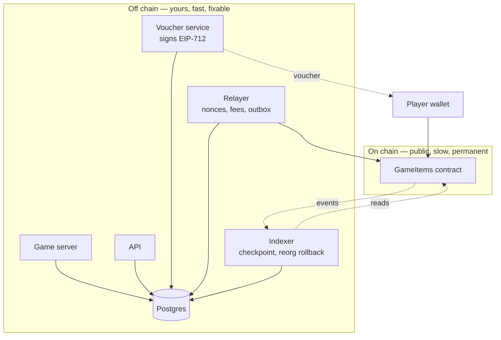

# Backend architecture for a Web3 game: the integration layer, end to end

This is the article that matters most, for a reason worth stating plainly: it is the part of the
job you have already been doing for a decade under different names. Keeping a database
consistent with a source of truth you do not own, ingesting at-least-once delivery without
double-counting, reconciling when the two disagree — that is the work. The vocabulary is new.
The problems are not.

Everything in the ladder converges here. This article is the assembled picture.

---

## Life without an integration layer

Start with the naive architecture, because it is what a competent backend engineer builds on
day one if nobody warns them, and because every piece of the real design is a response to one
of its failures.

```ts
// The whole backend, allegedly.
app.get("/inventory/:address", async (req, res) => {
  const balance = await contract.read.balanceOf([req.params.address, itemId]);
  res.json({ balance });
});

contract.watchEvent.TransferSingle({
  onLogs: (logs) => logs.forEach((log) => creditPlayer(log.args)),
});
```

Read from the chain, listen for events. It works in a demo. It fails in five separate ways in
production, and each failure is a section of this article.

**It is slow and rate-limited.** Every inventory view is an RPC round trip. A thousand players
opening their bags is a thousand calls to a provider who will start refusing you — as the
public endpoint did repeatedly while these exercises were being written.

**You cannot query it.** "Show me the ten rarest items this player owns, sorted by acquisition
date" is a join. The chain has no joins, no sorting, no pagination, and no acquisition dates.

**The subscription has no memory.** Restart the process and the events that arrived meanwhile
are gone — not delayed, *gone*, with no way to know they existed. Deploys become data loss.

**It believes the head of the chain.** Credit the player when the event arrives and a
reorganisation creates items from nothing ([level 8](../exercises/solutions/08_reorg.ts)).

**It has no write path at all.** The moment you need to mint something, you need a key, a
nonce, a fee strategy and a record of what you sent.

## The shape of the real thing



Read the arrows into and out of the contract. There are exactly three: signed vouchers going
out, transactions going in, events coming back. **Everything else is a normal backend**, and
that is the single most useful sentence in this article.

## The read path: an indexer, not an RPC call

The rule is that the game never reads the chain to answer a player's question. It reads
Postgres, which the indexer fills.

The indexer is a loop, and [level 7](../exercises/solutions/07_indexer.ts) is its correct form.
It polls from a stored checkpoint, fetches logs for a bounded range, writes them idempotently,
and moves the checkpoint **in the same transaction as the rows**. That last detail is not
fussiness: if the checkpoint were a separate write, a crash between the two would leave the
database claiming to have processed blocks it never wrote, and those events would be lost
permanently and silently.

The natural key of a log is `(blockHash, transactionHash, logIndex)`. A unique constraint on
that triple converts "have I already processed this?" from a question your code asks into an
invariant the database enforces — which is what makes the whole thing safe to interrupt. Level
7 proves it: crash the indexer halfway through a batch and it leaves zero rows and a zero
checkpoint, then the restart converges on a database with the same fingerprint as a clean run.

Three refinements the exercises make concrete. **Chunk the ranges and halve on failure**
([level 6](../exercises/solutions/06_read_events.ts)) rather than parsing provider error
messages, which differ between providers and are sometimes simply false. **Store block hashes**,
because a reorg is undetectable without them. And **make derived state rebuildable**: the
player's inventory is recomputed from the log table, never incremented in place, because a
counter you incremented cannot be rolled back once its inputs are gone.

How far behind the head to index is a policy decision rather than a technical one. On Polygon
after Rio the finalized tag sits a couple of blocks behind, so the cheapest safe policy —
indexing only finalized blocks — costs seconds. For a cosmetic item you might credit
optimistically at the head and accept the occasional unwind; for anything convertible into real
value, wait for finality and say so.

## The write path: a relayer, not `sendTransaction`

Every write to a chain is an operation you must be able to answer three questions about later:
did it happen, is it still happening, and did it happen twice?

**Nonces are allocated, not discovered.** [Level 9](../exercises/solutions/09_relayer.ts) shows
two concurrent handlers asking the node for the next nonce and receiving the same answer,
because the node reports a fact about the past rather than issuing a reservation. One authority
hands out nonces, once each — an atomic counter in one process, and across replicas a single
statement like `UPDATE relayer_nonce SET next = next + 1 … RETURNING next - 1`. Gaps matter as
much as duplicates, because the chain will not accept N+1 until it has accepted N, so a lost
nonce stalls everything behind it.

**Fees are set with headroom and bumped on a timer.** The base fee moves at most 12.5% per
block, so a ceiling of roughly twice the current base fee plus a tip buys several blocks of
protection, and you are refunded the difference anyway. A transaction priced too low does not
fail — it waits, and the only exit is a replacement at the same nonce with a decisively higher
price, because there is no cancel.

**The outbox is what makes any of this recoverable.** Before broadcasting, write a row: the
business operation, the nonce, the hash, and a status. After broadcasting, update it. Because a
replacement produces a *different hash for the same operation*, the outbox records every hash
you have signed for that nonce and treats them as one operation — exactly one will land.

A separate reconciler asks the question the happy path never asks: which outbox rows have no
matching event, and how old are they? That job is where a Web3 backend's real incidents are
found, and it is the same reconciler you have written for payment files and survey uploads.

## Why vouchers instead of minting directly

The backend *could* hold a key and mint on demand. The signed-voucher pattern
([level 10](../exercises/solutions/10_voucher_eip712.ts)) is better on three independent axes,
and being able to name all three is a strong answer.

**Cost.** Unclaimed rewards cost nothing. Players claim a fraction of what they earn, and
minting eagerly means paying for items nobody wanted.

**Blast radius.** A key that can mint anything, any time, is a catastrophic secret. A signing
key that produces specific, expiring, single-use authorisations is a bad secret to lose but a
survivable one — and rotating the signer address on the contract invalidates every outstanding
voucher at once.

**Liveness.** Claiming is the player's transaction, so your relayer being down delays nothing
the player cares about.

The EIP-712 structure is what makes it safe: the domain separator binds the signature to one
contract on one chain for one application, and the type hash binds it to one shape of data. The
test that matters is the cross-language one — compute the type hash in TypeScript and assert it
matches the contract's. Level 10 does this without deploying anything, by checking that the
bytes appear in the compiled bytecode, and shows the failure it catches: the same type string
with spaces after the commas produces a completely different hash and a signature the contract
silently refuses.

And the half that is not cryptography at all: **a voucher ID is a database uniqueness problem**.
One reward maps to one voucher, forever, enforced by a constraint rather than by a check your
code performs and hopes to have performed first. The contract's own replay protection is a
backstop, not a design — a duplicate caught on chain still wastes the player's gas and still
leaves your records wrong.

## Keys, and who holds them

Three secrets live in this system and they deserve different treatment.

The **voucher signing key** authorises minting. It belongs in a KMS or HSM, reachable only by
the signing service, with the signer address rotatable on the contract.

The **relayer key** pays gas. It holds funds, so it should hold *small* funds, topped up from
somewhere colder, and be monitored for balance as a first-class alert — a relayer that runs out
of gas is an outage that looks like a bug.

**Player keys**, if the studio is custodial, are the serious one: the studio is now a custodian,
with the operational and possibly regulatory weight that carries
([article 05](05_wallets_keys_signatures.md)). Whichever model they use, keep signing and
submission behind one internal interface — `signFor(player)` and `submit(transaction)` — so the
wallet strategy stays replaceable. It is the layer of the stack most likely to change.

## The database, where your real advantage is

Nothing here is Web3-specific, which is precisely the point: this is where you are strongest.

Amounts are `uint256` and belong in `NUMERIC` or `TEXT`, never a float. Every ingestion table
carries the natural key of what it ingested, as a constraint. Derived tables are derived —
rebuildable from the log table, not incremented. The outbox has a status and a timestamp so the
reconciler can find stragglers. Addresses are stored in one case consistently, because
`0xAbC…` and `0xabc…` are the same account and a careless mix produces two rows and a bug
nobody can reproduce.

The constraint I would argue hardest for is the one on indexed logs. It makes an entire class
of duplicate-credit bug structurally impossible rather than merely unlikely, and it costs one
line.

## Trace one claim, with every defence named

This is the thirty-second answer, and [level 12](../exercises/solutions/12_full_loop.ts) runs it
end to end.

The player logs in with SIWE: the server issues a nonce, the wallet signs a message naming the
domain, chain and expiry, and the server burns the nonce **in a single statement** so two
concurrent requests cannot both win.

The player claims a reward. The backend looks for an existing voucher for that reward ID and —
if one exists — returns *the same voucher*, because retries are normal. Otherwise it allocates
a voucher ID, signs the EIP-712 struct, and stores it under a unique constraint.

The player submits the mint. The contract checks the deadline, checks the voucher is unused,
recovers the signer, marks the voucher used **before** minting, and emits `ItemMinted`. Marking
before minting is what stops a contract recipient re-entering through `onERC1155Received` and
minting four items from one voucher — which [level 11](../exercises/solutions/11_reentrancy.ts)
demonstrates by actually doing it.

The indexer sees the event, writes it keyed on its natural identity, and rebuilds the player's
inventory.

The game asks the API what the player owns. Postgres answers. No RPC was called.

Three defences stopped a duplicate item at three layers: the database refused to issue a second
voucher, the contract refused to honour the same voucher twice, and the indexer's primary key
means redelivery moves nothing. You want all three — the first is correctness, the second is
trustlessness, and the third keeps your records honest when the network misbehaves.

## Interview Angles

**"Walk me through what happens when a player claims a reward."**

Use the trace above and keep it to about a minute. The value is in naming the defence at each
step rather than just the step: the nonce burn is one statement so concurrent logins cannot both
succeed; the claim is idempotent on the reward ID so a retry returns the same voucher rather
than issuing a second; the voucher is EIP-712 typed data so it is bound to one contract on one
chain and cannot be replayed elsewhere; the contract marks it used before minting because the
ERC-1155 receiver callback hands control to the recipient; and the indexer writes keyed on block
hash, transaction hash and log index so redelivery is a no-op. Then close with the division of
responsibility — the chain is the source of truth for ownership, the database for speed, the
indexer is the one-way bridge — and point out that the inventory endpoint never calls an RPC.

**"Why not just subscribe to events with `contract.on`?"**

Because a subscription has no memory and no way to tell you what it missed. If the process
restarts, or the websocket drops, or the provider hiccups, the events that arrived in that
window are gone and nothing in the API will ever tell you they existed — so a routine deploy
becomes silent data loss. It also has no notion of reorgs, so anything written from a head block
stays written even when that block is replaced. What you want instead is a polling loop with a
checkpoint stored in the same transaction as the rows it accounts for, idempotent writes keyed
on the log's natural identity, bounded ranges that halve on provider failure, and a parent-hash
check that can roll the checkpoint backwards when history changes. Subscriptions are fine as a
latency optimisation on top of that — a hint to poll sooner — but never as the system of record.

**"Our relayer sometimes sends duplicate transactions. Where would you look?"**

Nonce allocation first, because that is the usual cause: if each request asks the node for the
transaction count, two concurrent requests get the same number, both sign, and only one can land
— so an operation silently disappears, or two operations collide. The fix is a single allocator
that reserves, in one statement, rather than reading a count. Then I would look at whether the
retry path distinguishes "not yet mined" from "failed", because retrying a transaction that is
merely slow, at a new nonce, genuinely does duplicate it. That is what the outbox is for: write
the operation and every hash you have signed for its nonce before broadcasting, treat them as
one operation since exactly one can land, and let the indexer's events — not the receipt — mark
it complete. And I would check whether the business operation itself is idempotent upstream,
because the cheapest place to stop a duplicate mint is the unique constraint on the reward, long
before anything reaches a chain.
