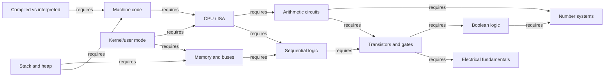
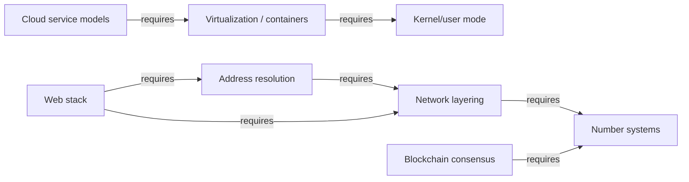

# Computation — knowledge graph

*The physical and logical foundation underneath every other subject in this text: how bits become circuits, circuits become a CPU, a CPU becomes a running program, and a program becomes a node on a network.*

**Nodes:** 18 · **Books:** 1 · **Currency researched:** 2026-08-06
**Feeds:** [`02_os`](../02_os/00_knowledge_graph.md), [`04_sh`](../04_sh/00_knowledge_graph.md)

---

## §1 Source audit

| Book | Year | Documents | Verdict |
|---|---|---|---|
| Matthew Justice, *How Computers Really Work: A Hands-On Guide to the Inner Workings of the Machine* | 2020 | Number systems through electrical circuits, digital logic, CPU internals, machine code, high-level languages, operating systems, networking, the web, and "modern computing" (virtualization, cloud, Bitcoin) | Sound and current on physics and digital-logic fundamentals, which do not date; weakest on anything that moved after 2020 — CPU architecture diversity, DNS encryption, HTTP versioning, container standardization, and blockchain consensus all shifted meaningfully since publication. Written as an introductory hands-on text, not a reference, so several nodes below extend past what the book itself covers. |

---

## §2 Node index

| ID | Node | Type | Depth | Currency |
|---|---|---|---|---|
| `COMP-01` | Number systems and binary encoding | Structure | L3 | `current` |
| `COMP-02` | Boolean logic and digital signals | Model | L3 | `current` |
| `COMP-03` | Electrical fundamentals for digital circuits | Mechanism | L3 | `current` |
| `COMP-04` | Transistors and logic gates | Mechanism | L4 | `current` |
| `COMP-05` | Binary arithmetic circuits | Mechanism | L4 | `current` |
| `COMP-06` | Sequential logic: latches, flip-flops, and clocking | Mechanism | L4 | `current` |
| `COMP-07` | The CPU: instruction sets and the fetch-decode-execute cycle | Mechanism | L4 | `stale-minor` |
| `COMP-08` | Memory hierarchy and system buses | Structure | L4 | `current` |
| `COMP-09` | Machine code and assembly language | Mechanism | L4 | `current` |
| `COMP-10` | Compiled versus interpreted execution models | Mechanism | L4 | `current` |
| `COMP-11` | The call stack and heap memory | Structure | L4 | `current` |
| `COMP-12` | Kernel/user mode and the OS as hardware abstraction | Mechanism | L4 | `stale-minor` |
| `COMP-13` | Network layering models | Model | L3 | `current` |
| `COMP-14` | Address resolution and connectivity services | Mechanism | L4 | `stale-minor` |
| `COMP-15` | The web stack: HTTP, markup, and browser rendering | Mechanism | L4 | `stale-major` |
| `COMP-16` | Virtualization, emulation, and containers | Mechanism | L4 | `stale-minor` |
| `COMP-17` | Cloud computing service models | Model | L3 | `stale-minor` |
| `COMP-18` | Blockchain consensus and proof-of-work | Mechanism | L4 | `stale-major` |

---

## §3 The graph

### Hardware and software fundamentals — from bits to a running program

### Networking, the web, and modern computing

---

## §4 Node records

### `COMP-01` · Number systems and binary encoding
**Type:** Structure · **Depth:** L3
**Covers:** decimal versus binary place value, bits and bytes, binary/decimal/hexadecimal conversion, SI and binary (IEC) prefixes for data quantities
**Sources:** Justice, *How Computers Really Work* ch.1 (2020)
**Currency:** `current`

### `COMP-02` · Boolean logic and digital signals
**Type:** Model · **Depth:** L3
**Covers:** analog versus digital representation, why digital signals resist noise, AND/OR/NOT/XOR, truth tables, digital text and image encoding (ASCII, pixel grids)
**Sources:** Justice, *How Computers Really Work* ch.2 (2020)
**Edges:** `requires` [`COMP-01`] · `contrasts` [`COMP-03`]
**Currency:** `current`

### `COMP-03` · Electrical fundamentals for digital circuits
**Type:** Mechanism · **Depth:** L3
**Covers:** charge, current, voltage, resistance, Ohm's law, Kirchhoff's voltage law, AC versus DC, the water-flow analogy for current
**Sources:** Justice, *How Computers Really Work* ch.3 (2020)
**Edges:** `contrasts` [`COMP-02`]
**Currency:** `current`

### `COMP-04` · Transistors and logic gates
**Type:** Mechanism · **Depth:** L4
**Covers:** the transistor as a voltage-controlled switch, building logic gates from transistors, gate-level circuit design, integrated circuits as gate arrays
**Sources:** Justice, *How Computers Really Work* ch.4 (2020)
**Edges:** `requires` [`COMP-02`, `COMP-03`]
**Currency:** `current`

### `COMP-05` · Binary arithmetic circuits
**Type:** Mechanism · **Depth:** L4
**Covers:** half adders, full adders, ripple-carry addition, two's complement signed representation, unsigned overflow
**Sources:** Justice, *How Computers Really Work* ch.5 (2020)
**Edges:** `requires` [`COMP-01`, `COMP-04`]
**Currency:** `current`

### `COMP-06` · Sequential logic: latches, flip-flops, and clocking
**Type:** Mechanism · **Depth:** L4
**Covers:** the SR latch, feedback and memory in a circuit, JK and T flip-flops, clock signals, edge-triggered counters
**Sources:** Justice, *How Computers Really Work* ch.6 (2020)
**Edges:** `requires` [`COMP-04`]
**Currency:** `current`

### `COMP-07` · The CPU: instruction sets and the fetch-decode-execute cycle
**Type:** Mechanism · **Depth:** L4
**Covers:** instruction set architectures, registers and the datapath, the fetch-decode-execute cycle, clock speed, cores, and cache
**Sources:** Justice, *How Computers Really Work* ch.7 (2020)
**Edges:** `requires` [`COMP-05`, `COMP-06`]
**Currency:** `stale-minor`
**Δ current:** The book's CPU chapter (2020) treats an x86-style architecture as the unstated default backdrop for discussing instruction sets, cores, and cache, written the same year Apple announced its first Apple Silicon Mac (November 2020). Apple completed its Intel-to-ARM transition across the entire Mac lineup by June 2023, discontinuing the Mac Pro as the last Intel-based model, and Apple has stated it will stop shipping macOS security updates for Intel Macs around September 2029. An article on this node should treat ARM as a first-class production desktop and server instruction set alongside x86-64, not as a mobile-only footnote.

### `COMP-08` · Memory hierarchy and system buses
**Type:** Structure · **Depth:** L4
**Covers:** main memory versus secondary storage, the register-cache-RAM-disk hierarchy, input/output devices, bus communication and arbitration
**Sources:** Justice, *How Computers Really Work* ch.7 (2020)
**Edges:** `requires` [`COMP-06`]
**Currency:** `current`

### `COMP-09` · Machine code and assembly language
**Type:** Mechanism · **Depth:** L4
**Covers:** instruction encoding, opcodes and operands, the status/flags register, branching and conditional execution, assembling a factorial routine by hand
**Sources:** Justice, *How Computers Really Work* ch.8 (2020)
**Edges:** `requires` [`COMP-07`]
**Currency:** `current`

### `COMP-10` · Compiled versus interpreted execution models
**Type:** Mechanism · **Depth:** L4
**Covers:** high-level language overview (C and Python contrasted), variables and types at the language level, compilation to machine code versus interpretation, libraries and object-oriented programming as language features
**Sources:** Justice, *How Computers Really Work* ch.9 (2020)
**Edges:** `requires` [`COMP-09`]
**Currency:** `current`

### `COMP-11` · The call stack and heap memory
**Type:** Structure · **Depth:** L4
**Covers:** stack frames and function calls, automatic versus dynamic lifetime, heap allocation, the stack/heap split as a convention rather than a hardware requirement
**Sources:** Justice, *How Computers Really Work* ch.9 (2020)
**Edges:** `requires` [`COMP-08`, `COMP-09`]
**Currency:** `current`

### `COMP-12` · Kernel/user mode and the OS as hardware abstraction
**Type:** Mechanism · **Depth:** L4
**Covers:** dual-mode operation, the "user-mode bubble," system calls, processes and threads at the introductory level, physical versus logical cores, virtual memory (introductory), device drivers, application binary interfaces
**Sources:** Justice, *How Computers Really Work* ch.10 (2020)
**Edges:** `requires` [`COMP-07`, `COMP-08`]
**Currency:** `stale-minor`
**Δ current:** The book (2020) frames every interaction between a user program and the kernel as a syscall trap through the "user-mode bubble." Linux's io_uring interface, merged into kernel 5.1 in May 2019 and matured substantially since, lets a user process submit and reap I/O operations through shared ring buffers without a trap per operation, which changes the syscall-per-operation model this chapter assumes for I/O-heavy code. An article on this node should still teach the trap model as the default case for control-flow-heavy work, then name io_uring as the mechanism that breaks the one-trap-per-operation assumption for I/O.

### `COMP-13` · Network layering models
**Type:** Model · **Depth:** L3
**Covers:** the OSI seven-layer model, the four-layer Internet protocol suite, link/internet/transport/application layers, why two competing layering models coexist
**Sources:** Justice, *How Computers Really Work* ch.11 (2020)
**Edges:** `requires` [`COMP-01`] · `contrasts` [`HTTP-03`]
**Currency:** `current`

### `COMP-14` · Address resolution and connectivity services
**Type:** Mechanism · **Depth:** L4
**Covers:** DHCP lease negotiation, private address space and NAT, the Domain Name System's recursive resolution model
**Sources:** Justice, *How Computers Really Work* ch.11 (2020)
**Edges:** `requires` [`COMP-13`]
**Currency:** `stale-minor`
**Δ current:** The book's DNS treatment (2020) presents resolution as an unencrypted, plaintext exchange with whatever resolver the network hands out via DHCP. RFC 8484 (October 2018) standardized DNS over HTTPS (DoH), and Firefox has shipped DoH enabled by default for US users since 2020, with Windows Server 2022 adding built-in client support and major public resolvers (1.1.1.1, 8.8.8.8, 9.9.9.9) all serving it. An article on this node should present plaintext UDP/53 resolution as the historical baseline and DoH/DoT as the current default path for a growing, but still uneven, share of client traffic.

### `COMP-15` · The web stack: HTTP, markup, and browser rendering
**Type:** Mechanism · **Depth:** L4
**Covers:** URL structure, HTTP request/response exchange, HTML for structure, CSS for styling, JavaScript for behavior, JSON versus XML for data, browser rendering and the user-agent string, basic web-server operation
**Sources:** Justice, *How Computers Really Work* ch.12 (2020)
**Edges:** `requires` [`COMP-13`, `COMP-14`]
**Currency:** `stale-major`
**Δ current:** The book's web chapter (2020) presents HTTP as a single, version-less request/response exchange. HTTP/3, standardized as RFC 9114 in June 2022 and carried over QUIC (RFC 9000) instead of TCP, was finalized after this book's publication; as of May 2026 it accounted for roughly 21% of website requests by one widely cited measurement, trailing HTTP/2 at about 51% and HTTP/1.x at about 28%, with the three-way split now stable rather than still shifting. An article on this node should lead with the three-version landscape (1.1, h2, h3) rather than treating HTTP as version-less, since the version in play changes connection setup, multiplexing, and head-of-line blocking behavior.

### `COMP-16` · Virtualization, emulation, and containers
**Type:** Mechanism · **Depth:** L4
**Covers:** virtualization versus emulation, process virtual machines, hypervisor-based virtualization at the introductory level, application containment
**Sources:** Justice, *How Computers Really Work* ch.13 (2020)
**Edges:** `requires` [`COMP-12`]
**Currency:** `stale-minor`
**Δ current:** The book's coverage of modern computing (2020) mentions container-style "application containment" briefly without naming a governing standard. The Open Container Initiative's runtime and image specifications, established in 2015, are now the de facto standard that Docker, containerd, and Podman all implement, which is what lets an image built by one tool run under another vendor's runtime. An article on this node should name the OCI specification explicitly rather than treating "container" as a single vendor's proprietary technology.

### `COMP-17` · Cloud computing service models
**Type:** Model · **Depth:** L3
**Covers:** the history of remote/timesharing computing, infrastructure-as-a-service, platform-as-a-service, software-as-a-service
**Sources:** Justice, *How Computers Really Work* ch.13 (2020)
**Edges:** `requires` [`COMP-16`]
**Currency:** `stale-minor`
**Δ current:** The book's cloud chapter (2020) organizes cloud computing into the traditional IaaS/PaaS/SaaS taxonomy, which is still standard vocabulary. Function-as-a-service platforms — AWS Lambda, generally available since 2014, and its successors from every major cloud vendor — have become common enough that a fourth category, serverless/FaaS billed per invocation rather than per provisioned resource, is now routinely taught alongside the original three. An article on this node should keep the three-category frame as the base case and add FaaS as the current fourth column rather than folding it silently into PaaS.

### `COMP-18` · Blockchain consensus and proof-of-work
**Type:** Mechanism · **Depth:** L4
**Covers:** cryptographic hashing as a commitment mechanism, Bitcoin wallets and transactions, proof-of-work mining, blockchain as an append-only ledger
**Sources:** Justice, *How Computers Really Work* ch.13 (2020)
**Edges:** `requires` [`COMP-01`]
**Currency:** `stale-major`
**Δ current:** The book's Bitcoin chapter (2020) treats proof-of-work mining as characteristic of how "blockchain" reaches consensus in general, which was a defensible generalization in 2020 when Ethereum was still proof-of-work. Ethereum's Merge, completed September 15, 2022, moved the second-largest blockchain by market capitalization to proof-of-stake, cutting its energy consumption by roughly 99.95% and removing mining from its consensus model entirely, while Bitcoin has not moved off proof-of-work and shows no indication of doing so. An article on this node should treat proof-of-work as one consensus mechanism among several rather than as synonymous with "blockchain," and should use Bitcoin specifically — not blockchain generally — as the proof-of-work example.

---

## §5 Cross-subject edges

This subject was built before most sibling subjects existed, so the edges below were added
after the fact, once the relevant node IDs were fixed. See §6 for connections that remain
prose because the target subject still has no graph.

| From | Edge | To | Why |
|---|---|---|---|
| `COMP-13` | `contrasts` | `HTTP-03` | The general network-layering model compared against TCP mechanics as `HTTP-03` treats them |

---

## §6 Coverage gaps

Nothing here covers the physical layer in any depth beyond "bits travel as electrical or optical signals" — no treatment of signal integrity, encoding schemes (NRZ, Manchester), or the physical/data-link split that a networking-focused subject would need; a networking-specific text would close this.

The book's operating-system chapter (`COMP-12`) is deliberately introductory and stops well short of scheduling, synchronization, virtual memory internals, or file systems; every one of those is a full node in `02_os`, and `COMP-12` should carry a `requires` edge from `02_os`'s foundational node once that graph's IDs are fixed, since the OS subject builds directly on the kernel/user-mode split taught here.

The web stack node (`COMP-15`) stops at "HTTP exists" and does not cover HTTP semantics in depth — caching, content negotiation, or connection reuse — which belongs to a dedicated HTTP subject not yet built in this repository; that subject's connection-management node will need a `requires` edge back to `COMP-15` once it exists.

The shell-programming and SSH subject (`04_sh`) assumes the reader already has `COMP-12`'s process/kernel model in hand — a shell script that forks a child process or an SSH session that authenticates a user both rest on user/kernel separation and process creation as taught here — so `04_sh`'s opening node should carry a `requires` edge to `COMP-12` once cross-subject edges are declared.

Cryptography proper — symmetric versus asymmetric ciphers, hash function properties, key exchange — appears in this subject only glancingly, through Bitcoin's use of hashing (`COMP-18`). The SSH half of `04_sh` needs a real treatment of Diffie-Hellman key exchange and digital signatures; none of that foundational cryptography is covered here and would need either a dedicated node in `04_sh` itself or a short cryptography primer this subject does not currently have room for within its 12–25 node budget.

Nothing here covers number representation beyond integers — no IEEE 754 floating point, despite floating-point behavior being a frequent source of real bugs. A future revision of `COMP-01` or a new node would need to add this; no book in this directory currently covers it in useful depth.

---

← [repo index](../README.md) · [root graph](../KNOWLEDGE_GRAPH.md) · [writing contract](../AGENTS.md)
