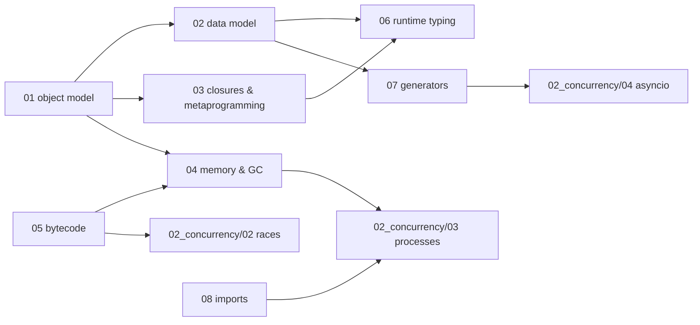

# Python — syllabus

**Modules:** 8 · **Target length:** ~55,000 words · **Ladder target:** L4 across, L5 on the object model
**Prerequisites:** none — this is a root topic
**Feeds:** [`02_concurrency/`](../02_concurrency/00_syllabus.md) (all modules), [`05_typescript/01`](../05_typescript/00_syllabus.md) by analogy, [`07_bigquery/05`](../07_bigquery/00_syllabus.md)
**Measurement status:** fully measurable on `ENV-A` — CPython 3.14.6, 8 cores, plus free-threaded 3.14t via `uv`
**Roles:** Data Engineer ●●● · Fullstack SWE ●●● · Data Analyst ●○○

---

## 1. Competencies

Thirty-four competencies. The **Tell** column is the working definition of the gap this folder exists to close: the shallow answer is what he can already say, and the senior answer is what the module has to produce.

| ID | Competency | L | Probe | Tell | Roles | Module |
|---|---|---|---|---|---|---|
| `PY-01` | Explain the full attribute lookup order for `obj.x`, including where `__getattribute__` and `__getattr__` sit | L4 | "What actually happens when I write `obj.x`?" | Shallow: *"it looks in the instance then the class."* Senior: type's MRO searched for a data descriptor first, then instance `__dict__`, then non-data descriptors and class attributes, then `__getattr__` only on failure — and names why the data-descriptor-first rule exists | DE ● FS ● | `01` |
| `PY-02` | Describe the descriptor protocol and identify it running inside code you already use | L5 | "How does `@property` work?" | Shallow: *"it makes a method look like an attribute."* Senior: `property` is a data descriptor implementing `__get__`/`__set__`/`__delete__`; so are plain functions (via `__get__` returning a bound method) and SQLAlchemy's `Mapped` columns — it is the mechanism behind three things he uses daily | DE ● FS ● | `01` |
| `PY-03` | Distinguish instance `__dict__` from class `__dict__` and predict where a write lands | L3 | "I set `self.x` on one instance and another instance changed too. Why?" | Shallow: *"shared state."* Senior: the attribute was mutated in place on a class-level mutable, so the write went through the instance to the class object — versus rebinding, which creates an instance entry and shadows | DE ● FS ● | `01` |
| `PY-04` | Explain `__slots__`, what it buys, and the three things it costs | L4 | "When would you use `__slots__`?" | Shallow: *"it saves memory."* Senior: replaces the per-instance dict with descriptors over a fixed array, measurably cutting memory on high-cardinality objects — at the cost of no dynamic attributes, no `__weakref__` unless declared, and inheritance rules that surprise people | DE ● | `01` |
| `PY-05` | Compute a C3 linearisation by hand and explain cooperative `super()` | L4 | "What is the MRO and why does Python need C3?" | Shallow: *"the order Python looks up methods."* Senior: C3 preserves local precedence and monotonicity, which is why some hierarchies raise at class-creation time; and `super()` is not "call the parent" but "call the next class in *this instance's* MRO," which is why cooperative multiple inheritance works at all | FS ● | `01` |
| `PY-06` | Explain `__new__` versus `__init__` and when overriding `__new__` is the only option | L4 | "When do you need `__new__`?" | Shallow: *"it creates the object."* Senior: `__new__` allocates and may return an existing or foreign object, which is why immutable subclasses and singleton/interning patterns require it; `__init__` only mutates something already allocated and its return value is ignored | FS ● | `02` |
| `PY-07` | State the `__eq__`/`__hash__` contract and show what breaks in a dict when it is violated | L4 | "What happens if I define `__eq__` without `__hash__`?" | Shallow: *"the object becomes unhashable."* Senior: Python sets `__hash__ = None` deliberately, because equal objects must hash equally — and demonstrates the worse failure of a *mutable* hash: an object that becomes unfindable in the dict that contains it | DE ● FS ● | `02` |
| `PY-08` | Explain the iteration protocol including the `__getitem__` fallback | L3 | "How does a `for` loop work?" | Shallow: *"it iterates over the object."* Senior: `iter()` tries `__iter__`, falls back to the old integer-indexed `__getitem__` protocol, and the loop calls `__next__` until `StopIteration` — which is why a generator can only be consumed once | DE ● | `02` |
| `PY-09` | Explain context manager mechanics including what returning true from `__exit__` does | L4 | "What does `with` guarantee?" | Shallow: *"it closes the file."* Senior: `__enter__`'s return value is what `as` binds; `__exit__` receives the exception triple and **suppresses the exception if it returns truthy** — the accidental-swallow bug — and `contextlib.contextmanager` builds both halves from one generator around its `yield` | DE ● FS ● | `02` |
| `PY-10` | Use `functools.singledispatch` and explain why it is not method overloading | L3 | "Does Python support function overloading?" | Shallow: *"no."* Senior: not by signature, because the name binds once; `singledispatch` dispatches on the first argument's type at call time via the MRO, and `typing.overload` is compile-time-only fiction that emits nothing | DE ● | `02` |
| `PY-11` | Explain duck typing as protocol-slot lookup rather than as a philosophy | L4 | "How does duck typing actually work?" | Shallow: *"if it walks like a duck."* Senior: special methods are looked up on the *type*, not the instance — which is why assigning `obj.__len__` does not make `len(obj)` work, and why `Protocol` with `runtime_checkable` only checks method presence, never signatures | FS ● | `02` |
| `PY-12` | Explain closures via cell objects and inspect `__closure__` | L4 | "What is a closure, mechanically?" | Shallow: *"a function that remembers its scope."* Senior: the compiler marks the variable as a cell; the inner function holds a tuple of cell objects in `__closure__`, and the cell holds a reference to the *variable*, not a copy of its value — which is exactly why the late-binding loop bug happens | FS ● | `03` |
| `PY-13` | Reproduce and fix the late-binding closure bug | L4 | "Why do all my lambdas in this loop return the same value?" | Shallow: *"scoping issue."* Senior: all closures share one cell that holds the loop variable, so they all see its final value; the default-argument fix works because defaults are evaluated at definition time — and names the JavaScript `var`/`let` equivalent | FS ● | `03` |
| `PY-14` | Write a decorator that takes arguments and explain the three-level nesting | L3 | "Write a `@retry(times=3)` decorator." | Shallow: writes it from memory with the nesting slightly wrong. Senior: explains that a parameterised decorator is a function returning a decorator returning a wrapper, and that the `@` syntax calls exactly one level | DE ● FS ● | `03` |
| `PY-15` | State exactly what `functools.wraps` restores and what it cannot | L4 | "Why do you need `functools.wraps`?" | Shallow: *"it preserves the function name."* Senior: copies `__name__`, `__doc__`, `__module__`, `__qualname__`, `__dict__` and sets `__wrapped__` — and notes what stays broken without it: `inspect.signature`, `help()`, and any framework that introspects, which includes FastAPI's dependency resolution | FS ● | `03` |
| `PY-16` | Explain what a metaclass does and name one running in your own code | L5 | "Have you ever written a metaclass?" | Shallow: *"no, they're too magic."* Senior: honest that he has not written one, then explains that SQLAlchemy's declarative base and Pydantic's model machinery are metaclasses collecting class-body attributes at class-creation time — and that `__init_subclass__` and `__set_name__` are the modern answer for most cases a metaclass used to serve | DE ● FS ● | `03` |
| `PY-17` | Choose between a decorator, a class decorator, `__init_subclass__` and a metaclass | L5 | "How would you enforce that every subclass registers itself?" | Shallow: reaches for a metaclass. Senior: `__init_subclass__` is the cheapest correct tool and runs on every subclass with no metaclass conflict risk; escalate only when you need to change class *creation*, not just react to it | FS ● | `03` |
| `PY-18` | Explain reference counting, and why `sys.getrefcount` always reads one high | L3 | "How does Python free memory?" | Shallow: *"garbage collection."* Senior: refcounting handles almost everything immediately and deterministically; the cyclic collector exists only for reference cycles, and `getrefcount` counts its own argument binding | DE ● | `04` |
| `PY-19` | Explain generational GC thresholds and when to tune or disable them | L4 | "When would you call `gc.disable()`?" | Shallow: *"never."* Senior: three generations with survivor promotion; disabling is defensible in a short-lived batch process that allocates heavily and exits, and the cost is that cycles then never get collected — plus the fork-plus-refcount interaction that makes copy-on-write memory sharing fail | DE ● | `04` |
| `PY-20` | Use `weakref` and explain what problem `WeakValueDictionary` solves | L4 | "How do you build a cache that doesn't leak?" | Shallow: *"use an LRU."* Senior: a strong-referencing cache keeps entries alive forever by definition; a `WeakValueDictionary` lets the value die when nothing else holds it, and explains which types cannot be weak-referenced without `__weakref__` | DE ● | `04` |
| `PY-21` | Explain why RSS does not return to the OS after freeing objects | L5 | "We freed the objects but memory didn't drop. Why?" | Shallow: *"a memory leak."* Senior: pymalloc serves small objects from arenas, and an arena returns to the OS only when entirely free — so fragmentation holds RSS high with no leak present; distinguishes this from an actual leak found with `tracemalloc` | DE ● | `04` |
| `PY-22` | Measure the memory difference between a materialised list and a generator | L3 | "You're processing ten million rows. What do you watch?" | Shallow: *"use a generator."* Senior: quotes the measured peak-memory difference, then names the real trade-off — a generator cannot be re-iterated or `len()`'d, and streaming turns one query into many round trips unless you chunk | DE ●● DA ● | `04` |
| `PY-23` | Read `dis` output and explain `LOAD_FAST` versus `LOAD_GLOBAL` | L4 | "Is there a performance difference between a local and a global variable?" | Shallow: *"locals are faster."* Senior: locals are array slots resolved at compile time, globals are dict lookups at runtime with a builtins fallback — and explains the hot-loop idiom of binding a global to a local, with a measured figure | DE ● | `05` |
| `PY-24` | Show that `balance += 1` is multiple bytecodes and connect it to thread safety | L4 | "Is `x += 1` atomic?" | Shallow: *"I think so."* Senior: disassembles it live to show load, add, store as separate instructions with a thread-switch opportunity between them — the direct seed for the lost-update measurement in concurrency | DE ● FS ● | `05` |
| `PY-25` | Explain the 3.11+ specialising adaptive interpreter | L5 | "What has made recent Python versions faster?" | Shallow: *"they optimised it."* Senior: quickening rewrites bytecode into type-specialised forms after observing actual types, with deoptimisation guards when the assumption breaks — the same family of idea as V8's inline caches, which connects to the JavaScript module | DE ● FS ● | `05` |
| `PY-26` | Explain small-integer and string interning, and the identity traps they create | L3 | "Why does `a is b` work for 256 and fail for 257?" | Shallow: *"small ints are cached."* Senior: CPython pre-allocates −5 to 256 and interns compile-time string literals, so identity comparisons appear to work and then fail on runtime-constructed values — which is why `is` is for `None` and sentinels only | FS ● | `05` |
| `PY-27` | Benchmark honestly with `timeit` and name three ways microbenchmarks lie | L4 | "How would you prove this optimisation worked?" | Shallow: *"time it before and after."* Senior: repeat and take the minimum rather than the mean, control for the specialising interpreter warming up, keep the setup out of the timed body, and beware of the compiler optimising away work whose result is unused | DE ● | `05` |
| `PY-28` | Explain what annotations are at runtime and how `from __future__ import annotations` changes them | L4 | "Do type hints do anything at runtime?" | Shallow: *"no, they're just hints."* Senior: they are real objects in `__annotations__` — which is exactly how Pydantic and FastAPI build validation and routing — unless the future import turns them into strings, at which point `get_type_hints` must resolve them and forward references can fail | DE ● FS ● | `06` |
| `PY-29` | Contrast `Protocol` structural typing in Python with nominal ABC inheritance | L4 | "How do you type 'anything with a `read` method'?" | Shallow: *"use `Any`."* Senior: `Protocol` gives structural typing checked statically, ABCs give nominal typing enforced at registration — and connects it to TypeScript's structural model as the same idea arrived at from the opposite direction | FS ● | `06` |
| `PY-30` | Choose between `dataclass`, `attrs`, `TypedDict`, `NamedTuple` and Pydantic, and say where validation belongs | L5 | "Why Pydantic and not a dataclass?" | Shallow: *"Pydantic validates."* Senior: dataclasses generate boilerplate and do not validate; Pydantic v2 validates in a Rust core and costs real time per object, so it belongs at the system boundary and not on every internal structure — and names the cost of validating in a hot loop | DE ● FS ● | `06` |
| `PY-31` | Explain generator mechanics including `send`, `throw` and `close` | L4 | "What is the difference between a generator and an iterator?" | Shallow: *"a generator uses `yield`."* Senior: the generator frame is suspended and resumed with its locals intact, `send` makes it a two-way channel, and `close` raises `GeneratorExit` at the yield point — which is why `try/finally` cleanup in a generator is subtle | DE ● | `07` |
| `PY-32` | Compose an `itertools` pipeline and explain where laziness breaks | L4 | "Build a memory-bounded pipeline over a file too big for RAM." | Shallow: reads it in chunks manually. Senior: composes lazy transforms, then names the stages that force materialisation — `sorted`, `list`, any `len` — and where the pipeline silently loads everything | DE ●● DA ● | `07` |
| `PY-33` | Trace an `import` through finders, loaders, `sys.modules` and `__pycache__` | L4 | "What happens when I write `import pandas`?" | Shallow: *"it loads the module."* Senior: `sys.modules` checked first, then meta-path finders locate a spec, the loader executes the module body **once** and binds the result — which is why import side effects run once and why a partially initialised module is visible during a circular import | DE ● FS ● | `08` |
| `PY-34` | Explain why circular imports fail where they do, and the interaction between `__main__` and `spawn` | L4 | "Why does this circular import fail only sometimes?" | Shallow: *"circular imports are bad."* Senior: the module object exists in `sys.modules` before its body finishes, so the failure depends on *when* the attribute is accessed — module level fails, inside a function succeeds; and connects it to the `if __name__ == "__main__"` guard being mandatory under `spawn` on macOS | DE ● FS ● | `08` |

---

## 2. Prerequisite graph

Module 05 is a prerequisite of module 04 rather than the reverse: the memory discussion needs `dis` to already be readable. Modules 01 and 05 are the two that unlock the most downstream material and are therefore built first.

---

## 3. Module manifest

| # | File | Scope | Words | Competencies | Status | Measurement |
|---|---|---|---|---|---|---|
| 01 | [`01_object_model_and_attribute_lookup.md`](01_object_model_and_attribute_lookup.md) | The full read *and* write resolution order, the descriptor protocol behind `@property` and behind every method, `__slots__` costs measured, C3 linearisation and cooperative `super()`, `__set_name__`/`__init_subclass__` versus metaclasses | 6,400 | `PY-01`–`PY-05` | ✅ **written** | `measured` — 18 IDs (`PY-OBJ-01`–`18`) |
| 02 | `02_the_data_model_and_protocols.md` | Dunders as the real interface: iteration, context managers, the `__eq__`/`__hash__` contract and what it breaks in a dict, `__new__` versus `__init__`, container protocols, `singledispatch`, duck typing as protocol-slot lookup | ~7,000 | `PY-06`–`PY-11` | planned | measured |
| 03 | [`03_closures_decorators_and_metaprogramming.md`](03_closures_decorators_and_metaprogramming.md) | Cell objects and `__closure__`, late binding, decorators with arguments, what `functools.wraps` restores, class decorators versus metaclasses, `__init_subclass__`/`__set_name__`, and the honest case for a metaclass — which is what SQLAlchemy and Pydantic are doing under his own code | ~7,500 | `PY-12`–`PY-17` | ✅ **written** | `measured` — 8 IDs (`PY-CLO-*`) |
| 04 | `04_memory_refcounting_and_gc.md` | Refcounting, the cyclic collector, generational thresholds, `weakref` and `WeakValueDictionary`, `__del__` hazards, pymalloc arenas and why RSS never comes back, a leak found live with `tracemalloc`, ten million rows as list versus generator | ~7,000 | `PY-18`–`PY-22` | planned | measured |
| 05 | [`05_bytecode_and_the_runtime.md`](05_bytecode_and_the_runtime.md) | `dis`, frame objects, the eval loop, `LOAD_FAST` versus `LOAD_GLOBAL`, the 3.11+ specialising adaptive interpreter, `balance += 1` as multiple bytecodes, interning identity traps, honest `timeit` methodology | ~7,000 | `PY-23`–`PY-27` | ✅ **written** | `measured` — 8 IDs (`PY-BYT-*`) |
| 06 | `06_typing_at_runtime.md` | Annotations as objects versus strings, `get_type_hints`, the future import, `Protocol` and structural typing, `TypeVar` and generics, dataclasses versus attrs versus Pydantic v2's Rust core, where validation belongs | ~6,500 | `PY-28`–`PY-30` | planned | measured |
| 07 | `07_iterators_generators_and_lazy_pipelines.md` | Generator mechanics, `yield from`, `send`/`throw`/`close`, `itertools` composition, a chunked file-to-database pipeline with the memory profile measured, generators as the direct ancestor of coroutines | ~6,500 | `PY-31`–`PY-32` | planned | measured |
| 08 | `08_imports_packaging_and_project_reality.md` | `import` traced through finders, loaders, `sys.modules` and `__pycache__`; why circular imports fail at the line they fail at; namespace packages; editable installs and `src/` layout; venv, uv and lockfiles; `__main__` and its interaction with `spawn` | ~6,000 | `PY-33`–`PY-34` | planned | measured |

Three modules — 01, 03 and 05 — are in the Phase 2 core. The other five are specified here so the scope is visible rather than lost to attrition, and are unblocked whenever the phase table in [`README.md`](../README.md) reaches them.

---

## 4. Measurement plan

Every module in this topic is fully measurable on `ENV-A` with no setup beyond the interpreter already installed. That is unusual — most topics need Docker or a cloud account — and it is why Python is a good place to start building the measurement habit.

| Module | Measured | Method |
|---|---|---|
| 01 | Attribute-lookup cost with and without `__slots__`; memory per instance across 100k objects; the data-descriptor precedence rule demonstrated by a class whose `__set__` intercepts an instance write | `timeit`, `tracemalloc`, a hand-built descriptor |
| 02 | The mutable-hash failure: an object placed in a dict, mutated, and then not found by its own key | Live interpreter session, verbatim output |
| 03 | `__closure__` cell identity shown to be shared across loop iterations; `inspect.signature` before and after `functools.wraps` | `inspect`, direct attribute reads |
| 04 | List versus generator peak memory over ten million rows; RSS after freeing a large structure, showing it does not return; a real cycle collected by `gc.collect()` with `gc.set_debug` | `tracemalloc`, `resource.getrusage`, `gc` |
| 05 | Disassembly of `balance += 1` on 3.14 (**re-run of `PY-CONC-03`**, whose archived version predates the 3.11 bytecode changes); `LOAD_FAST` versus `LOAD_GLOBAL` in a hot loop | `dis`, `timeit` |
| 06 | Pydantic v2 validation cost per object against a plain dataclass, to size the "validate at the boundary" argument | `timeit` |
| 07 | Memory profile of a chunked pipeline versus a materialised one | `tracemalloc` |
| 08 | A circular import failing at module level and succeeding when the same access moves inside a function | Two throwaway modules, verbatim traceback |

**Nothing in this topic is unmeasurable.** Any `documented` tag appearing in a Python module is a defect, not a limitation.

The one figure carried in from the old environment is `PY-CONC-03` (`balance += 1` as four bytecodes), and it is on the re-run queue at priority 1 precisely because the specialising interpreter may well have changed the instruction sequence. Quoting a 3.10 disassembly as current would be exactly the kind of stale detail an interviewer catches.

---

← [repo index](../README.md) · [measurement ledger](../MEASUREMENTS.md) · [writing contract](../AGENTS.md)
