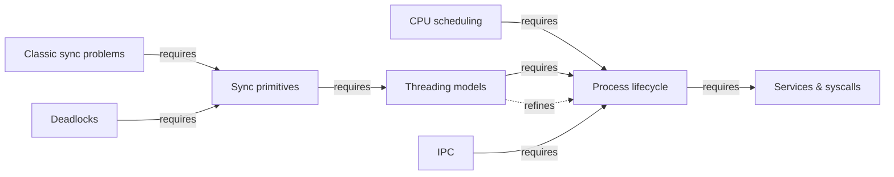
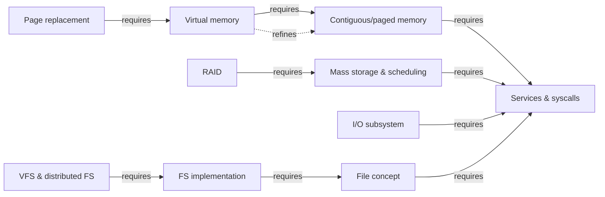
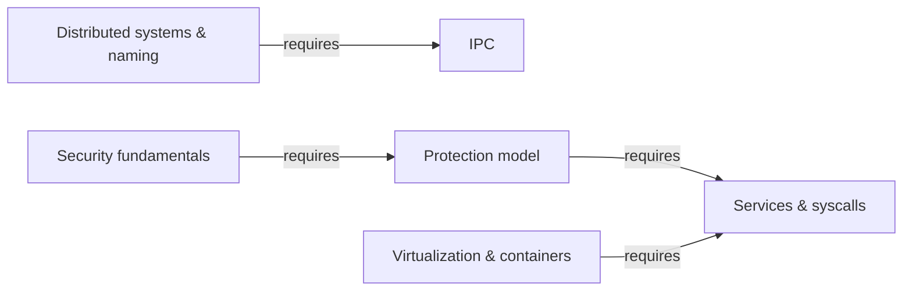

# Operating Systems — knowledge graph

*How a kernel turns one CPU and one bank of memory into the illusion of many, and where that illusion costs something.*

**Nodes:** 21 · **Books:** 1 · **Currency researched:** 2026-08-06
**Requires:** [`01_computation`](../01_computation/00_knowledge_graph.md)
**Feeds:** [`04_sh`](../04_sh/00_knowledge_graph.md)

---

## §1 Source audit

| Book | Year | Documents | Verdict |
|---|---|---|---|
| Abraham Silberschatz, Peter Baer Galvin, Greg Gagne, *Operating System Concepts*, 10th ed. | 2018 | Process/thread model, CPU scheduling, synchronization, deadlocks, memory management and virtual memory, mass storage and I/O, file systems, protection and security, virtual machines, distributed systems, plus Linux/Windows/BSD/Mach case studies | The canonical mechanism-level reference for process, memory, and file-system theory, and that theory is largely timeless — a page table and a semaphore work the same way in 2026 as in 2018. The book is weakest wherever it names a specific current implementation as the example: its Linux scheduler is CFS, its Linux memory-reclaim algorithm is classic LRU approximation, its I/O model has no io_uring, and its authentication chapter is password-centric. Every node below that names a specific kernel mechanism rather than a general algorithm needed a currency check. |

---

## §2 Node index

| ID | Node | Type | Depth | Currency |
|---|---|---|---|---|
| `OS-01` | Operating-system services, structure, and the system-call interface | Mechanism | L4 | `current` |
| `OS-02` | The process abstraction and lifecycle | Structure | L4 | `current` |
| `OS-03` | CPU scheduling algorithms and multiprocessor scheduling | Algorithm | L4 | `stale-minor` |
| `OS-04` | Threads and multithreading models | Mechanism | L4 | `stale-minor` |
| `OS-05` | Interprocess communication: shared memory and message passing | Mechanism | L4 | `current` |
| `OS-06` | Synchronization primitives: locks, semaphores, monitors | Mechanism | L4 | `current` |
| `OS-07` | Classic synchronization problems and language-level concurrency constructs | Practice | L4 | `current` |
| `OS-08` | Deadlock characterization and handling | Mechanism | L4 | `current` |
| `OS-09` | Contiguous and paged memory allocation | Mechanism | L4 | `current` |
| `OS-10` | Virtual memory and demand paging | Mechanism | L4 | `current` |
| `OS-11` | Page replacement and frame allocation | Algorithm | L4 | `stale-minor` |
| `OS-12` | Mass-storage structure and disk scheduling | Mechanism | L4 | `stale-minor` |
| `OS-13` | RAID and redundancy | Structure | L4 | `current` |
| `OS-14` | I/O hardware and the kernel I/O subsystem | Mechanism | L4 | `stale-major` |
| `OS-15` | File concept and directory structures | Structure | L3 | `current` |
| `OS-16` | File-system implementation: allocation and free-space management | Mechanism | L4 | `stale-minor` |
| `OS-17` | Virtual file systems and remote/distributed file systems | Mechanism | L4 | `current` |
| `OS-18` | Protection: access matrices, ACLs, capabilities, and RBAC | Model | L4 | `current` |
| `OS-19` | System security fundamentals | Practice | L4 | `stale-major` |
| `OS-20` | Virtualization and OS-level containment | Mechanism | L4 | `stale-minor` |
| `OS-21` | Distributed systems and naming | Model | L4 | `current` |

---

## §3 The graph

### Process management and concurrency

### Memory and storage

### Protection, security, and system-level composition

---

## §4 Node records

### `OS-01` · Operating-system services, structure, and the system-call interface
**Type:** Mechanism · **Depth:** L4
**Covers:** OS services, command interpreters and GUIs, system calls and the API layer, linkers and loaders, monolithic/layered/microkernel/hybrid structure, kernel modules, system generation and boot, OS debugging and tracing
**Sources:** Silberschatz et al. ch.1–2 (2018)
**Currency:** `current`

### `OS-02` · The process abstraction and lifecycle
**Type:** Structure · **Depth:** L4
**Covers:** process state diagram, the process control block, process creation and termination, context switching, scheduling queues
**Sources:** Silberschatz et al. ch.3 (2018)
**Edges:** `requires` [`OS-01`]
**Currency:** `current`

### `OS-03` · CPU scheduling algorithms and multiprocessor scheduling
**Type:** Algorithm · **Depth:** L4
**Covers:** FCFS, SJF, round-robin, priority scheduling, multilevel feedback queues, multiprocessor load balancing and processor affinity, real-time scheduling (rate-monotonic, earliest-deadline-first)
**Sources:** Silberschatz et al. ch.5 (2018)
**Edges:** `requires` [`OS-02`]
**Currency:** `stale-minor`
**Δ current:** Silberschatz's CPU-scheduling chapter presents the Completely Fair Scheduler (CFS) as Linux's scheduling algorithm (§5.7.1), which was accurate for the kernel series this edition targets. Linux replaced CFS with the Earliest Eligible Virtual Deadline First (EEVDF) scheduler, merged for kernel 6.6 (released October 2023) under Peter Zijlstra's stewardship; EEVDF computes eligibility and virtual deadlines directly rather than relying on CFS's heuristics and tunable knobs, and is documented at docs.kernel.org/scheduler/sched-eevdf.html. An article on this node should teach the general fair-share scheduling problem that both CFS and EEVDF solve, then present EEVDF as Linux's current answer rather than describing CFS as present-tense fact.

### `OS-04` · Threads and multithreading models
**Type:** Mechanism · **Depth:** L4
**Covers:** many-to-one, one-to-one, and many-to-many threading models, thread pools, pthreads, thread-local storage, fork() and exec() interaction with threads
**Sources:** Silberschatz et al. ch.4 (2018)
**Edges:** `requires` [`OS-02`] · `refines` [`OS-02`]
**Currency:** `stale-minor`
**Δ current:** The book presents many-to-one, one-to-one, and many-to-many threading models as live design alternatives, though it already notes that production systems — including Linux via NPTL — had settled on one-to-one kernel threading well before this edition. Java's Project Loom, finalized as virtual threads in JDK 21 (JEP 444, September 2023), reintroduces a many-to-many-style model in a mainstream production runtime by scheduling lightweight virtual threads onto a small pool of OS carrier threads. An article on this node should note that the many-to-many model, which the book frames as mostly of historical interest, is active again in specific modern runtimes rather than fully abandoned.

### `OS-05` · Interprocess communication: shared memory and message passing
**Type:** Mechanism · **Depth:** L4
**Covers:** shared-memory IPC, message-passing IPC (naming, synchronization, buffering), POSIX shared memory, pipes, sockets, remote procedure calls
**Sources:** Silberschatz et al. ch.3 §3.4–3.8 (2018)
**Edges:** `requires` [`OS-02`] · `contrasts` [`AND-15`]
**Currency:** `current`

### `OS-06` · Synchronization primitives: locks, semaphores, monitors
**Type:** Mechanism · **Depth:** L4
**Covers:** the critical-section problem, Peterson's solution, hardware memory barriers and atomic instructions, mutex locks, semaphores, monitors, liveness and priority inversion
**Sources:** Silberschatz et al. ch.6 (2018)
**Edges:** `requires` [`OS-04`]
**Currency:** `current`

### `OS-07` · Classic synchronization problems and language-level concurrency constructs
**Type:** Practice · **Depth:** L4
**Covers:** bounded-buffer, readers-writers, and dining-philosophers problems, POSIX mutexes/semaphores/condition variables, Java monitors and reentrant locks, transactional memory
**Sources:** Silberschatz et al. ch.7 (2018)
**Edges:** `requires` [`OS-06`]
**Currency:** `current`

### `OS-08` · Deadlock characterization and handling
**Type:** Mechanism · **Depth:** L4
**Covers:** necessary conditions for deadlock, resource-allocation graphs, prevention, avoidance via the Banker's algorithm, detection, recovery, livelock
**Sources:** Silberschatz et al. ch.8 (2018)
**Edges:** `requires` [`OS-06`]
**Currency:** `current`

### `OS-09` · Contiguous and paged memory allocation
**Type:** Mechanism · **Depth:** L4
**Covers:** address binding, logical versus physical address space, contiguous allocation and fragmentation, paging, page-table structures (hierarchical, hashed, inverted), the TLB, segmentation
**Sources:** Silberschatz et al. ch.9 (2018)
**Edges:** `requires` [`OS-01`]
**Currency:** `current`

### `OS-10` · Virtual memory and demand paging
**Type:** Mechanism · **Depth:** L4
**Covers:** demand paging, page-fault handling, copy-on-write, the free-frame list
**Sources:** Silberschatz et al. ch.10 §10.1–10.3 (2018)
**Edges:** `requires` [`OS-09`] · `refines` [`OS-09`]
**Currency:** `current`

### `OS-11` · Page replacement and frame allocation
**Type:** Algorithm · **Depth:** L4
**Covers:** FIFO, optimal, and LRU page replacement, LRU-approximation (clock/second-chance) algorithms, frame-allocation policy, thrashing, the working-set model
**Sources:** Silberschatz et al. ch.10 §10.4–10.6 (2018)
**Edges:** `requires` [`OS-10`]
**Currency:** `stale-minor`
**Δ current:** The book's page-replacement chapter presents LRU-approximation algorithms (clock/second-chance) as the practical compromise between true LRU and cheap hardware support. The Multi-Generational LRU (MGLRU), merged into the mainline kernel at version 6.1 (December 2022) and engineered primarily by Google for ChromeOS and Android, replaces the single active/inactive list with page generations tracked by recency and is documented to outperform the classic approximation on memory-constrained systems. As of the most recent public discussion available (LWN, 2026), MGLRU adoption has stalled and it is not enabled by default on many distributions, so an article on this node should present classic LRU approximation as the still-dominant default and MGLRU as an available, Google-driven alternative rather than a universal replacement.

### `OS-12` · Mass-storage structure and disk scheduling
**Type:** Mechanism · **Depth:** L4
**Covers:** HDD and NVM/SSD structure, FCFS/SCAN/C-SCAN disk-scheduling algorithms, swap-space management, drive formatting and partitions
**Sources:** Silberschatz et al. ch.11 §11.1–11.6 (2018)
**Edges:** `requires` [`OS-01`]
**Currency:** `stale-minor`
**Δ current:** The book's disk-scheduling chapter (SCAN, C-SCAN, FCFS) assumes a single dispatch queue per device, which matched the era of classic Linux I/O schedulers such as CFQ and deadline. Linux's multi-queue block layer (blk-mq), which fans I/O across multiple hardware dispatch queues to match NVMe's parallel-queue design, has been the default block layer since the 4.x kernel series, with mq-deadline as its default scheduler. An article on this node should present classic single-queue elevator algorithms as the conceptual foundation and blk-mq's per-queue scheduling as what actually runs against NVMe hardware today.

### `OS-13` · RAID and redundancy
**Type:** Structure · **Depth:** L4
**Covers:** RAID levels 0–6, mirroring versus striping versus parity, RAID-level selection trade-offs, object storage
**Sources:** Silberschatz et al. ch.11 §11.8 (2018)
**Edges:** `requires` [`OS-12`]
**Currency:** `current`

### `OS-14` · I/O hardware and the kernel I/O subsystem
**Type:** Mechanism · **Depth:** L4
**Covers:** memory-mapped I/O, polling, interrupts, direct memory access, blocking versus nonblocking and asynchronous I/O, the kernel I/O subsystem (buffering, caching, spooling, error handling)
**Sources:** Silberschatz et al. ch.12 (2018)
**Edges:** `requires` [`OS-01`]
**Currency:** `stale-major`
**Δ current:** The book's I/O chapter frames asynchronous I/O around the POSIX AIO and readiness-notification (epoll-style) models it lists in §12.3.4. Linux's io_uring interface, merged in kernel 5.1 (May 2019), replaces the syscall-per-operation and readiness-polling patterns with shared submission and completion ring buffers, cutting per-operation overhead substantially. It has also become a meaningful attack surface: Google reported that roughly 60% of kernel exploits submitted to its 2022 bug bounty targeted io_uring, container platforms including Google's and Docker's now disable it by default in hardened configurations, and a 2025 proof-of-concept rootkit ("Curing") demonstrated bypassing syscall-based monitoring entirely through it. An article on this node should present io_uring as the current high-performance mechanism while being explicit that its complexity is a documented, ongoing security liability rather than a settled improvement.

### `OS-15` · File concept and directory structures
**Type:** Structure · **Depth:** L3
**Covers:** file attributes and operations, file types and structure, sequential versus direct access, single-level through acyclic-graph directory structures, basic protection
**Sources:** Silberschatz et al. ch.13 (2018)
**Edges:** `requires` [`OS-01`]
**Currency:** `current`

### `OS-16` · File-system implementation: allocation and free-space management
**Type:** Mechanism · **Depth:** L4
**Covers:** contiguous, linked, and indexed allocation, free-space bitmaps and grouping, journaling and log-structured recovery, the WAFL worked example
**Sources:** Silberschatz et al. ch.14 (2018)
**Edges:** `requires` [`OS-15`]
**Currency:** `stale-minor`
**Δ current:** The book's file-system-implementation chapter uses NetApp's WAFL as its running example of a log-structured, copy-on-write design (§14.8), treating that architecture as a specialized case worth singling out. Copy-on-write filesystems have since become mainstream defaults rather than niche examples: Btrfs has been Fedora's default since Fedora 33 (2020) and openSUSE's for longer, while ext4 remains the default on Debian and Ubuntu and XFS remains Red Hat's default through RHEL 9. An article on this node should present copy-on-write allocation as a mainstream design choice a reader will actually encounter as a distribution default, not only as an enterprise-storage curiosity.

### `OS-17` · Virtual file systems and remote/distributed file systems
**Type:** Mechanism · **Depth:** L4
**Covers:** the VFS abstraction layer, mounting and partitions, consistency semantics (UNIX, session, immutable-shared-files), NFS overview
**Sources:** Silberschatz et al. ch.15 (2018)
**Edges:** `requires` [`OS-16`]
**Currency:** `current`

### `OS-18` · Protection: access matrices, ACLs, capabilities, and RBAC
**Type:** Model · **Depth:** L4
**Covers:** goals and principles of protection, protection rings, domains of protection, the access matrix and its implementations (global tables, ACLs, capability lists), role-based access control, mandatory access control
**Sources:** Silberschatz et al. ch.17 (2018)
**Edges:** `requires` [`OS-01`]
**Currency:** `current`

### `OS-19` · System security fundamentals
**Type:** Practice · **Depth:** L4
**Covers:** program threats (malware, code injection, viruses/worms), network threats, cryptography as a security tool, user authentication, intrusion prevention and auditing
**Sources:** Silberschatz et al. ch.16 (2018)
**Edges:** `requires` [`OS-18`] · `contrasts` [`WS-08`]
**Currency:** `stale-major`
**Δ current:** The book's authentication chapter (§16.5) treats passwords as the default credential, with one-time passwords and biometrics offered as supplementary options. FIDO2/WebAuthn passkeys have since become a mainstream credential type: the FIDO Alliance reported in 2025 that 69% of surveyed users had activated at least one passkey and that 48% of the top 100 websites supported them, and NIST's 2025 guidance mandates phishing-resistant multi-factor authentication, including WebAuthn/FIDO2, for U.S. federal agencies. An article on this node should present password authentication as the legacy baseline it remains in practice, while treating passkeys as the credential a senior engineer is now expected to design toward rather than an exotic addition.

### `OS-20` · Virtualization and OS-level containment
**Type:** Mechanism · **Depth:** L4
**Covers:** trap-and-emulate, binary translation, hardware-assisted virtualization, hypervisor types (0/1/2), paravirtualization, application containment, live migration
**Sources:** Silberschatz et al. ch.18 (2018)
**Edges:** `requires` [`OS-01`]
**Currency:** `stale-minor`
**Δ current:** The book's virtualization chapter covers hypervisor types and "application containment" (§18.5.8) without naming a container standard, consistent with 2018 publication. The Open Container Initiative's runtime specification, and the cgroups v2 unified hierarchy it relies on for resource control, are now the operative standard: cgroups v2 is the default on RHEL 9, Fedora 31 and later, and Ubuntu 21.10 and later, and containerd — OCI-compliant and a graduated CNCF project — is the runtime underneath most production container platforms including Kubernetes. An article on this node should treat containers as OS-level virtualization implemented specifically via namespaces plus cgroups v2, not as an unspecified "lightweight VM."

### `OS-21` · Distributed systems and naming
**Type:** Model · **Depth:** L4
**Covers:** network structure (LAN/WAN), naming and name resolution, communication protocols, distributed file-system design (client-server and cluster-based models), robustness and transparency
**Sources:** Silberschatz et al. ch.19 (2018)
**Edges:** `requires` [`OS-05`]
**Currency:** `current`

---

## §5 Cross-subject edges

This subject was built before most sibling subjects existed, so the edge below was added
after the fact, once the relevant node ID was fixed. See §6 for connections that remain prose
because the target subject still has no graph.

| From | Edge | To | Why |
|---|---|---|---|
| `OS-19` | `contrasts` | `WS-08` | OS-level protection fundamentals compared against browser-enforced Origin/CSP access control in `WS-08` |
| `OS-05` | `contrasts` | `AND-15` | General-purpose interprocess communication mechanisms versus AIDL-based Android IPC in `AND-15` |

---

---

## §6 Coverage gaps

`OS-01` should carry a `requires` edge back to `01_computation`'s kernel/user-mode node once cross-subject edges are declared, since this entire graph assumes the dual-mode CPU operation and system-call trap mechanism that subject introduces at a lower level of detail.

Nothing here covers eBPF, which has become the standard mechanism for extending kernel behavior (tracing, networking, security policy) without writing kernel modules; Silberschatz's kernel-modules coverage (§20.3) predates it entirely, and no book in this directory covers it. A future revision would want a dedicated node, sourced from kernel documentation rather than this book, since the concept postdates every text here.

The concurrency subject not yet built in this repository (`06_concurrency`, already partially written outside the knowledge-graph workflow) will need `requires` edges into `OS-06` and `OS-07` for its synchronization-primitive nodes, since userspace concurrency constructs (mutexes, condition variables, atomics) are implemented in terms of exactly the kernel primitives this graph describes.

The SQL subject's transaction-isolation nodes will eventually want a `contrasts` edge against `OS-08` (deadlock handling), since database deadlock detection is a specialized case of the general resource-allocation-graph technique taught here, solved at a different layer with different recovery costs.

Filesystem-level currency is only partially closed: `OS-16`'s Δ current addresses copy-on-write adoption, but nothing here covers ZFS in any depth (mentioned nowhere in the source book) despite its wide production use for exactly the integrity and snapshotting properties this node discusses; a dedicated storage-systems reference would be needed to do it justice rather than folding it into an already-dense node.

Nothing here covers eventual consistency, CAP-theorem trade-offs, or consensus protocols (Raft, Paxos) in the depth a distributed-systems-focused engineer would need — `OS-21` stays at the textbook's client-server/cluster-based DFS framing, and a dedicated distributed-systems text would be required to go further; none is in this directory.

---

← [repo index](../README.md) · [root graph](../KNOWLEDGE_GRAPH.md) · [writing contract](../AGENTS.md)
