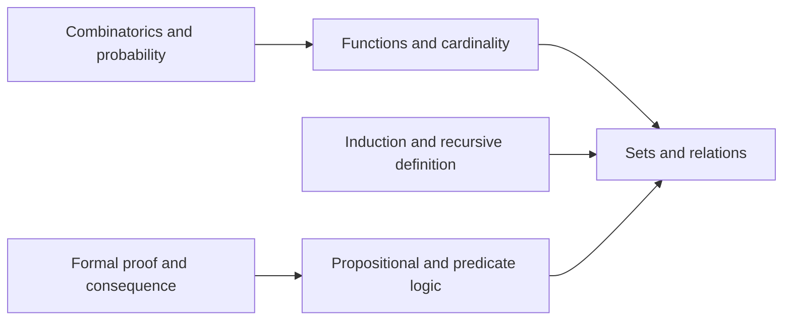
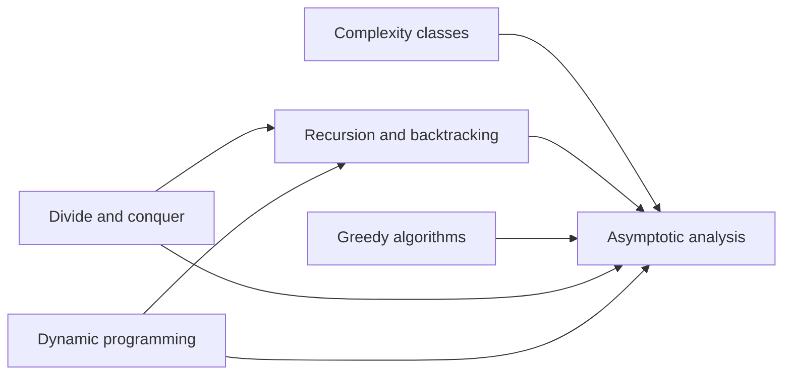
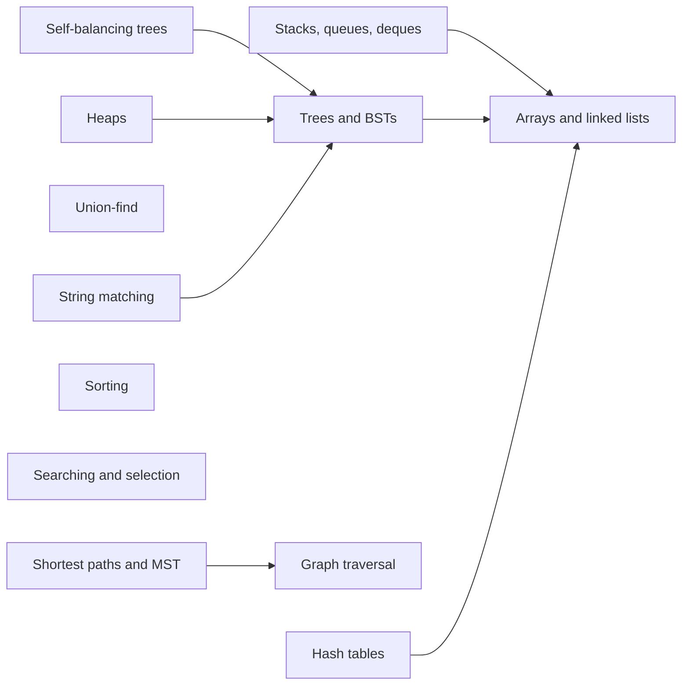

# Data Structures & Algorithms — knowledge graph

*Concrete data structures, algorithm design paradigms, complexity analysis, and the
discrete-mathematics foundations underneath them, at the depth a senior engineer needs to
choose the right structure, bound its cost, and say why an alternative was rejected.*

**Nodes:** 24 · **Books:** 4 · **Currency researched:** 2026-08-06

---

## §1 Source audit

| Book | Year | Documents | Verdict |
|---|---|---|---|
| Karumanchi, *Data Structures and Algorithms Made Easy* | 2016 (5th ed., CareerMonk) | Complexity analysis, recursion/backtracking, linear and tree structures, priority queues, disjoint sets, graph algorithms, sorting, searching, selection, symbol tables, hashing, string algorithms, greedy/divide-and-conquer/dynamic-programming, complexity classes, bit tricks | The broadest single source here and the backbone of this graph's data-structure and algorithm-design nodes; strong on classical mechanisms and interview-style problem catalogues, but silent on the production engineering (SIMD hash tables, non-Timsort sorts, suffix-array indexing) that has since displaced parts of its treatment |
| Miller & Ranum, *Problem Solving with Algorithms and Data Structures Using Python*, 2nd ed. | 2011 | Algorithm analysis, basic linear structures, recursion, sorting/searching, trees and binary heaps, with working Python implementations throughout | Pedagogically the cleanest of the four, and useful for its runnable code and its own empirical timings of Python's built-in structures; the extracted table of contents available for this project stops mid-book at the start of a "JSON" chapter, so this graph does not draw on whatever the printed edition covers after that point (its known graph-algorithms chapter among them) |
| Lew & Mauch, *Dynamic Programming: A Computational Tool* | 2007 | Bellman functional-equation formalism, a catalogue of 47 named classic DP problems, and roughly three-quarters of the book on the gDPS specification language, Bellman-net (Petri-net) modelling, and the DP2PN2Solver code-generation tool | Rigorous and unusually thorough on DP theory and an unmatched problem catalogue; the gDPS/Bellman-net/DP2PN2Solver apparatus that dominates its page count has no discoverable citation trail beyond the authors' own 2006 paper and this 2007 volume, and should be treated as a historical curiosity rather than living practice |
| Makinson, *Sets, Logic and Maths for Computing*, 2nd ed. | 2012 | Sets, relations, functions, induction and recursion as proof techniques, combinatorics, probability, trees as combinatorial objects, propositional and predicate logic, formal proof and consequence relations | The discrete-mathematics backbone underneath the other three books; the subject matter is essentially timeless, since none of set theory, relations, or classical logic carries a version number the way a hash-table implementation does |

---

## §2 Node index

| ID | Node | Type | Depth | Currency |
|---|---|---|---|---|
| `DSA-01` | Asymptotic analysis and recurrence solving | Model | L4 | `current` |
| `DSA-02` | Complexity classes and reductions | Model | L5 | `current` |
| `DSA-03` | Recursion and backtracking as algorithm design | Mechanism | L4 | `current` |
| `DSA-04` | Arrays and linked lists | Structure | L3 | `current` |
| `DSA-05` | Stacks, queues, and deques | Structure | L3 | `current` |
| `DSA-06` | Binary trees, traversal, and binary search trees | Structure | L4 | `current` |
| `DSA-07` | Self-balancing search trees | Structure | L5 | `stale-minor` |
| `DSA-08` | Priority queues and binary heaps | Structure | L4 | `current` |
| `DSA-09` | Disjoint-set (union-find) ADT | Structure | L4 | `current` |
| `DSA-10` | Graph representation and traversal | Algorithm | L4 | `current` |
| `DSA-11` | Shortest paths and minimum spanning trees | Algorithm | L5 | `stale-minor` |
| `DSA-12` | Sorting algorithms | Algorithm | L4 | `stale-minor` |
| `DSA-13` | Searching and order-statistics selection | Algorithm | L4 | `current` |
| `DSA-14` | Hash tables and symbol tables | Structure | L4 | `stale-minor` |
| `DSA-15` | String matching and string-indexing structures | Algorithm | L4 | `stale-minor` |
| `DSA-16` | Greedy algorithms | Algorithm | L4 | `current` |
| `DSA-17` | Divide and conquer | Algorithm | L4 | `current` |
| `DSA-18` | Dynamic programming: formulation and classic problems | Algorithm | L5 | `stale-minor` |
| `DSA-19` | Sets and relations | Model | L4 | `current` |
| `DSA-20` | Functions, cardinality, and the pigeonhole principle | Model | L3 | `current` |
| `DSA-21` | Induction and recursive definition | Model | L4 | `current` |
| `DSA-22` | Combinatorics and discrete probability | Model | L4 | `current` |
| `DSA-23` | Propositional and predicate logic | Model | L4 | `current` |
| `DSA-24` | Formal proof and consequence relations | Model | L5 | `current` |

---

## §3 The graph

### Discrete-mathematics foundations

### Complexity analysis, recursion, and algorithm-design paradigms

### Concrete data structures, graphs, and ordering/string algorithms

---

## §4 Node records

### `DSA-01` · Asymptotic analysis and recurrence solving
**Type:** Model · **Depth:** L4
**Covers:** the abstract-data-type concept as an interface/implementation split, primitive data types as the substrate under every later structure, Big-O/Omega/Theta notation, rate-of-growth comparison, the guess-and-confirm method, the Master theorem for divide-and-conquer and subtract-and-conquer recurrences, amortized analysis (aggregate, accounting, and potential-function arguments), empirical performance comparison of a language's built-in collection operations
**Sources:** Karumanchi ch.1 (5th ed. 2016) · Miller & Ranum, "Algorithm Analysis" ch. (2nd ed. 2011)
**Edges:** `requires` [`DSA-20`]
**Currency:** `current`

### `DSA-02` · Complexity classes and reductions
**Type:** Model · **Depth:** L5
**Covers:** polynomial versus exponential time, decision problems and decision procedures, the definition of a complexity class, P, NP, NP-complete and NP-hard, polynomial-time reductions
**Sources:** Karumanchi ch.20 (5th ed. 2016)
**Edges:** `requires` [`DSA-01`, `DSA-23`]
**Currency:** `current`

### `DSA-03` · Recursion and backtracking as algorithm design
**Type:** Mechanism · **Depth:** L4
**Covers:** the format of a recursive function, recursion's use of the call stack and its memory footprint, recursion versus iteration, backtracking as recursive search over a decision tree, stack-frame visualization, maze-exploration as a worked backtracking example
**Sources:** Karumanchi ch.2 (5th ed. 2016) · Miller & Ranum, "Recursion" ch. (2nd ed. 2011)
**Edges:** `requires` [`DSA-01`] · `contrasts` [`DSA-21`]
**Currency:** `current`

### `DSA-04` · Arrays and linked lists
**Type:** Structure · **Depth:** L3
**Covers:** contiguous versus pointer-based storage, dynamic-array growth, singly/doubly/circular linked lists, memory-efficient (XOR) doubly linked lists, unrolled linked lists, skip lists as a probabilistically balanced linked structure
**Sources:** Karumanchi ch.3 (5th ed. 2016) · Miller & Ranum, "Basic Data Structures" ch. (2nd ed. 2011)
**Edges:** `contrasts` [`DSA-15`]
**Currency:** `current`

### `DSA-05` · Stacks, queues, and deques
**Type:** Structure · **Depth:** L3
**Covers:** stack and queue ADTs, array- and linked-list-backed implementations, circular-buffer queues, deques, the exceptions each ADT must raise on empty/full access
**Sources:** Karumanchi ch.4–5 (5th ed. 2016) · Miller & Ranum, "Basic Data Structures" ch. (2nd ed. 2011)
**Edges:** `requires` [`DSA-04`]
**Currency:** `current`

### `DSA-06` · Binary trees, traversal, and binary search trees
**Type:** Structure · **Depth:** L4
**Covers:** binary and generic n-ary trees, tree vocabulary, the four traversal orders, threaded (stack/queue-less) traversal, expression trees, binary search tree insertion/deletion/lookup, rooted-tree and ordered-tree formalism, binary heaps as a specialization of complete binary trees
**Sources:** Karumanchi ch.6 (5th ed. 2016) · Miller & Ranum, "Trees and Tree Algorithms" ch. (2nd ed. 2011) · Makinson ch.7, "Squirrel Math: Trees" (2nd ed. 2012)
**Edges:** `requires` [`DSA-04`] · `contrasts` [`DSA-19`]
**Currency:** `current`

### `DSA-07` · Self-balancing search trees
**Type:** Structure · **Depth:** L5
**Covers:** AVL trees and their rotation-based rebalancing, height-balance invariants, amortized cost of rebalancing on insert/delete, the design space of alternative self-balancing schemes
**Sources:** Karumanchi ch.6.13–6.14 (5th ed. 2016)
**Edges:** `requires` [`DSA-06`]
**Currency:** `stale-minor`
**Δ current:** Karumanchi devotes the bulk of its self-balancing coverage (pp. 330–362) to AVL trees, with only a passing mention of other variations. General-purpose ordered containers in mainstream standard libraries do not use AVL trees: GCC's libstdc++ implements `std::map`/`std::set` as a red-black tree (`stl_tree.h`), and Java's `TreeMap`/`TreeSet` javadoc states the same, because red-black's looser balance invariant means fewer rotations per insert/delete even at the cost of slightly greater height. More recently, cache-aware designs have moved further still: Abseil's B-tree containers (Google, design note published 2018) and Rust's `std::collections::BTreeMap` (a B-tree since Rust's 1.0 stable release, per its own documentation, chosen explicitly for cache-line locality over a pointer-chasing red-black tree) treat node-per-comparison pointer chasing itself as the thing to eliminate. An article on this node should teach AVL rotations as the clearest worked example of the rebalancing idea, then name red-black trees as what general-purpose libraries actually ship and B-trees as the cache-optimized successor.

### `DSA-08` · Priority queues and binary heaps
**Type:** Structure · **Depth:** L4
**Covers:** the priority-queue ADT, array-based binary heap implementation, heapify/sift operations, heapsort as a heap application
**Sources:** Karumanchi ch.7 (5th ed. 2016) · Miller & Ranum, "Priority Queues with Binary Heaps" ch. (2nd ed. 2011)
**Edges:** `requires` [`DSA-06`]
**Currency:** `current`

### `DSA-09` · Disjoint-set (union-find) ADT
**Type:** Structure · **Depth:** L4
**Covers:** equivalence relations and equivalence classes as the mathematical basis of the ADT, quick-find versus quick-union tradeoffs, union by rank/size, path compression
**Sources:** Karumanchi ch.8 (5th ed. 2016)
**Edges:** `requires` [`DSA-19`] · `composes` [`DSA-11`]
**Currency:** `current`

### `DSA-10` · Graph representation and traversal
**Type:** Algorithm · **Depth:** L4
**Covers:** adjacency-list and adjacency-matrix representation and their space/time tradeoffs, breadth-first and depth-first traversal, topological sort, connectivity
**Sources:** Karumanchi ch.9.2–9.6 (5th ed. 2016)
**Edges:** `requires` [`DSA-19`, `DSA-05`] · `contrasts` [`DS-04`]
**Currency:** `current`

### `DSA-11` · Shortest paths and minimum spanning trees
**Type:** Algorithm · **Depth:** L5
**Covers:** Dijkstra's algorithm, Bellman-Ford, Floyd-Warshall all-pairs shortest paths, Kruskal's and Prim's minimum-spanning-tree algorithms, spanning-tree properties, shortest path as a sequential-decision (dynamic-programming) problem
**Sources:** Karumanchi ch.9.7–9.8 (5th ed. 2016) · Lew & Mauch, problems SPA/APSP/MWST (2007) · Makinson ch.7.6, "Spanning Trees" (2nd ed. 2012)
**Edges:** `requires` [`DSA-10`, `DSA-08`] · `contrasts` [`DSA-18`, `DSA-16`]
**Currency:** `stale-minor`
**Δ current:** Karumanchi presents Dijkstra without naming a specific priority-queue implementation, implying the naive O(V²) or basic-heap O(E log V) bound. The long-standing better bound is Fredman & Tarjan's Fibonacci-heap implementation, O(E + V log V) (Journal of the ACM, 1987) — itself absent from the book. More significantly, Duan, Mao, Mao, Shu & Yin's "Breaking the Sorting Barrier for Directed Single-Source Shortest Paths" (STOC 2025 Best Paper) gives a deterministic O(m log^(2/3) n)-time algorithm for real non-negative edge weights on directed graphs, the first result to beat Dijkstra's implicit O(m + n log n) sorting bound on sparse graphs. This is a genuine theoretical break, not yet a practical one: the search available for this pass turned up an experimental implementation and analysis (arXiv:2511.03007) but no evidence of production adoption, so an article should teach Dijkstra/Bellman-Ford/Floyd-Warshall as what is actually deployed and flag the 2025 result as the current frontier of the underlying theory rather than a replacement engineers reach for today.

### `DSA-12` · Sorting algorithms
**Type:** Algorithm · **Depth:** L4
**Covers:** bubble, selection, insertion, and shell sort, merge sort, quicksort, heapsort, tree sort, the comparison-sort lower bound, counting sort, bucket sort, radix sort, external sorting
**Sources:** Karumanchi ch.10 (5th ed. 2016) · Miller & Ranum, "Sorting" ch. (2nd ed. 2011)
**Edges:** `requires` [`DSA-01`]
**Currency:** `stale-minor`
**Δ current:** Both books teach the classical comparison-sort canon but name none of the algorithms production runtimes actually execute. CPython's `list.sort()` has used Timsort since Python 2.3 (2002), but CPython 3.11 (2022) switched its run-merge heuristic to Munro & Wild's "powersort" strategy — the official 3.11 changelog states the new policy is "provably near-optimal in the entropy of the distribution of run lengths" (`bpo-34561`, merged as `python/cpython#28108`). Rust's `slice::sort_unstable` was pattern-defeating quicksort (Peters, 2015) until 2024, when the standard library replaced it with `ipnsort` and replaced the stable `slice::sort` with `driftsort`, both documented in the `sort-research-rs` writeups by Bergdoll and Peters with 2024 merge dates into `rust-lang/rust`. C++'s `std::sort` remains introsort (quicksort with a heapsort worst-case fallback and an insertion-sort cutoff) across libstdc++, libc++, and MSVC, essentially unchanged since the STL's original design, though C++20 added `constexpr` and ranges-based overloads. An article on this node should keep the books' comparison-based taxonomy as the conceptual layer and then name Timsort/powersort, pdqsort/ipnsort/driftsort, and introsort as what a 2026 runtime actually calls.

### `DSA-13` · Searching and order-statistics selection
**Type:** Algorithm · **Depth:** L4
**Covers:** unordered and ordered linear search, binary search, interpolation search, selection by sorting, partition-based (quickselect) selection, the median-of-medians linear-time selection algorithm, finding the k smallest elements
**Sources:** Karumanchi ch.11.1–11.8, ch.12 (5th ed. 2016) · Miller & Ranum, "Searching" ch. (2nd ed. 2011)
**Edges:** `requires` [`DSA-01`]
**Currency:** `current`

### `DSA-14` · Hash tables and symbol tables
**Type:** Structure · **Depth:** L4
**Covers:** the symbol-table/hash-table ADT, hash functions, load factor, separate chaining, open addressing (linear probing, quadratic probing, double hashing), why hashing achieves expected O(1), problems hash tables are unsuited for, Bloom filters
**Sources:** Karumanchi ch.13–14 (5th ed. 2016)
**Edges:** `requires` [`DSA-04`]
**Currency:** `stale-minor`
**Δ current:** Karumanchi's open-addressing treatment covers linear/quadratic probing and double hashing generically, and adds Bloom filters as a separate probabilistic structure. Production hash tables have since moved to SIMD-accelerated "Swiss table" designs: Google's Abseil (design published 2018) and Rust's `hashbrown` — adopted as the Rust standard library's default `HashMap` since Rust 1.36 (2019), per the `hashbrown` project's own release history — store one byte of metadata per slot and scan probe groups with SIMD instructions, roughly halving per-entry memory overhead versus a chaining design. Separately, Python's `dict` has used a compact, insertion-ordered hash table since CPython 3.6, with the ordering guarantee made a documented part of the language in the Python 3.7 "What's New" release notes, storing a dense key/value array behind a sparse index table rather than the textbook direct-bucket layout. On the probabilistic-membership side, cuckoo filters (Fan, Andersen, Kaminsky & Mitzenmacher, CoNEXT 2014) improved on Bloom filters' space/delete tradeoff, and xor filters (Graf & Lemire, ACM Journal of Experimental Algorithmics, 2020; arXiv:1912.08258) improved on both in space and query speed for static sets. An article should present chaining/open-addressing/load-factor as the conceptual base and then treat SIMD control-byte probing, CPython's compact dict, and xor filters as what a 2026 implementation reaches for.

### `DSA-15` · String matching and string-indexing structures
**Type:** Algorithm · **Depth:** L4
**Covers:** brute-force matching, Rabin-Karp, matching with finite automata, the Knuth-Morris-Pratt algorithm, Boyer-Moore, tries, ternary search trees, suffix trees, the comparative tradeoffs among BSTs, tries, and TSTs for string storage
**Sources:** Karumanchi ch.15 (5th ed. 2016)
**Edges:** `requires` [`DSA-06`] · `contrasts` [`DSA-04`]
**Currency:** `stale-minor`
**Δ current:** Karumanchi treats the suffix tree as the canonical linear-time substring index. In practice, suffix arrays paired with LCP arrays have displaced suffix trees for large-scale indexing: a suffix tree occupies on the order of O(n log n) bits against a suffix array's n log n bits, a gap documented at genome scale by Abouelhoda, Kurtz & Ohlebusch, "Replacing suffix trees with enhanced suffix arrays" (Journal of Discrete Algorithms, 2004), and suffix arrays can be built in linear time by the SA-IS algorithm (Nong, Zhang & Chen, 2009), removing the main reason to prefer a suffix tree's simpler construction. The matching algorithms themselves are still what is taught, though production substring search has moved further still — glibc's `memmem` has used the Crochemore-Perrin two-way string-matching algorithm since glibc 2.9 (2008) for its combination of linear time and constant extra space, rather than plain Boyer-Moore or KMP. An article on this node should teach KMP and Boyer-Moore as the reasoning tools and note that array-based indexes, not pointer-heavy trees, are the default at corpus or genome scale.

### `DSA-16` · Greedy algorithms
**Type:** Algorithm · **Depth:** L4
**Covers:** the greedy strategy, elements that make a greedy algorithm correct, when greedy provably fails, classic greedy applications (activity selection, Huffman coding, fractional knapsack, Dijkstra as a greedy algorithm)
**Sources:** Karumanchi ch.16–17 (5th ed. 2016)
**Edges:** `requires` [`DSA-01`] · `contrasts` [`DSA-11`, `DSA-18`]
**Currency:** `current`

### `DSA-17` · Divide and conquer
**Type:** Algorithm · **Depth:** L4
**Covers:** the divide-and-conquer strategy, when it does and does not apply, recursive decomposition and recombination, the Master theorem as the standard analysis tool, classic applications (merge sort, Karatsuba-style multiplication, closest-pair)
**Sources:** Karumanchi ch.16, 18 (5th ed. 2016)
**Edges:** `requires` [`DSA-01`, `DSA-03`]
**Currency:** `current`

### `DSA-18` · Dynamic programming: formulation and classic problems
**Type:** Algorithm · **Depth:** L5
**Covers:** Bellman's principle of optimality, dynamic-programming functional equations, state-transition graph modelling, memoization versus tabulation, the classic problem catalogue (0/1 and integer knapsack, longest common subsequence, edit distance, matrix-chain multiplication, optimal binary search tree, traveling salesman, assembly-line balancing, and over 40 further named formulations), bit-manipulation idioms used to encode subsets for bitmask DP, the formal gDPS specification language and Bellman-net (Petri-net) modelling used to auto-generate DP solver code
**Sources:** Karumanchi ch.19, ch.21.2 (5th ed. 2016) · Lew & Mauch, chs. 1–12 (2007)
**Edges:** `requires` [`DSA-01`, `DSA-03`] · `contrasts` [`DSA-16`, `DSA-11`]
**Currency:** `stale-minor`
**Δ current:** The core DP mechanism this node teaches — Bellman functional equations, memoization/tabulation, and the classic problem catalogue in both Karumanchi and Lew & Mauch — is exactly how dynamic programming is formulated and taught today; nothing about that part is out of date. What is dated is the roughly three-quarters of Lew & Mauch devoted to the gDPS specification language, Bellman-net (Petri-net) modelling, and the DP2PN2Solver code generator: a search for citations or successors to this 2007 Springer volume and its authors' 2006 *Control and Cybernetics* paper introducing DP2PN2Solver turned up no further adoption or follow-on tooling. An article built on this node should teach the Bellman/memoization formalism as the living content and mention the gDPS/Bellman-net apparatus only as a historical attempt at automatic DP solver generation, not as a technique anyone reaches for in 2026.

### `DSA-19` · Sets and relations
**Type:** Model · **Depth:** L4
**Covers:** the intuitive concept of a set, inclusion, the empty set, Boolean operations on sets, generalized union and intersection, power sets, ordered tuples and Cartesian products, relations as sets of tuples, operations on relations (converse, join, projection, selection, composition, image), reflexivity and transitivity, equivalence relations and partitions, partial and linear orders, transitive closure
**Sources:** Makinson ch.1–2 (2nd ed. 2012)
**Edges:** `contrasts` [`DSA-06`]
**Currency:** `current`

### `DSA-20` · Functions, cardinality, and the pigeonhole principle
**Type:** Model · **Depth:** L3
**Covers:** functions as a special case of relations, domain and range, restriction and composition, inverses, injections, surjections, bijections, equinumerosity and cardinal comparison, the pigeonhole principle, identity/constant/projection/characteristic functions, families and sequences
**Sources:** Makinson ch.3 (2nd ed. 2012)
**Edges:** `requires` [`DSA-19`]
**Currency:** `current`

### `DSA-21` · Induction and recursive definition
**Type:** Model · **Depth:** L4
**Covers:** proof by simple induction on the positive integers, definition by simple recursion, cumulative induction and recursion, structural recursion and induction over defined sets, well-founded sets, proof by well-founded induction, recursive programs as an application of well-founded recursion
**Sources:** Makinson ch.4 (2nd ed. 2012)
**Edges:** `requires` [`DSA-19`] · `contrasts` [`DSA-03`]
**Currency:** `current`

### `DSA-22` · Combinatorics and discrete probability
**Type:** Model · **Depth:** L4
**Covers:** addition and multiplication counting principles, the four ways of selecting k items out of n, permutations and combinations with and without repetition, rearrangements and configured partitions, finite probability spaces, conditional probability, independence, Bayes' theorem, Simpson's paradox, expectation
**Sources:** Makinson ch.5–6 (2nd ed. 2012)
**Edges:** `requires` [`DSA-20`]
**Currency:** `current`

### `DSA-23` · Propositional and predicate logic
**Type:** Model · **Depth:** L4
**Covers:** truth-functional connectives, tautological implication and equivalence, tautologies and contradictions, disjunctive and conjunctive normal form, semantic decomposition trees, the language of quantifiers, free and bound variables, quantifier interchange and distribution, substitutional and variable-assignment semantics, logical implication
**Sources:** Makinson ch.8–9 (2nd ed. 2012)
**Edges:** `requires` [`DSA-19`]
**Currency:** `current`

### `DSA-24` · Formal proof and consequence relations
**Type:** Model · **Depth:** L5
**Covers:** elementary derivations and chaining, consequence relations and the Tarski conditions, conditional proof as a formal rule, disjunctive proof and proof by cases, proof by contradiction, rules for quantifiers, proofs as recursive (second-level and split-level) structures
**Sources:** Makinson ch.10 (2nd ed. 2012)
**Edges:** `requires` [`DSA-23`]
**Currency:** `current`

---

## §5 Cross-subject edges

This subject was built before most sibling subjects existed, so the edge below was added after
the fact, once the relevant node ID was fixed. §6 records the connections this graph still
anticipates once `01_computation`, `09_sql`, `10_mongodb`, `11_redis_caching`, and
`21_dataengineering` gain the rest of their relevant nodes.

| From | Edge | To | Why |
|---|---|---|---|
| `DSA-10` | `contrasts` | `DS-04` | Deterministic graph traversal (BFS/DFS) versus randomized graph traversal via random walks in `DS-04` |

---

## §6 Coverage gaps

None of the four books here formalizes computation itself. Karumanchi's complexity-classes
chapter (`DSA-02`) defines P, NP, and reductions entirely in terms of informal running-time
argument, without ever introducing a Turing machine or another formal model of computation to
make "polynomial time" precise, and none of the other three books touches the question either.
That formal grounding belongs in `01_computation`, and the two nodes should eventually gain a
`requires` edge from `DSA-02` once that subject's graph exists. The same gap applies to a proper
treatment of the Cook-Levin theorem and worked NP-completeness reductions: Karumanchi's chapter
gestures at reductions without carrying one through in full, and a text such as CLRS would be
needed to do that properly.

Randomized algorithm analysis is a second gap. Makinson's probability chapter (`DSA-22`) supplies
the discrete-probability machinery — expectation, independence, conditional probability — but
none of the four books connects it to algorithms: randomized quicksort's expected-case bound,
skip lists' probabilistic balance guarantee (present as a structure in `DSA-04` but never
analyzed probabilistically here), and randomized primality testing all go unaddressed. A text
such as Motwani & Raghavan's *Randomized Algorithms* would close this.

The Miller & Ranum table of contents available for this project ends mid-book, at the start of a
"JSON" chapter; the printed second edition is known to continue with a graph-algorithms chapter
and further material that this graph could not draw on because it was not present in the
extracted outline. If a fuller extraction becomes available, that chapter should be checked
against `DSA-10` and `DSA-11` for anything not already covered from Karumanchi.

Several forward connections to subjects not yet built are worth recording in prose. `DSA-14`
(hash tables) and `DSA-04` (arrays and linked lists, via skip lists) both anticipate
`11_redis_caching`, whose core data structures are exactly a hash table, a skip list, and a
sorted set built on one. `DSA-01` (asymptotic analysis), `DSA-07` (self-balancing trees, via the
B-tree family), `DSA-12` (sorting), and `DSA-14` (hashing) all anticipate `09_sql` and
`10_mongodb`, whose query planners reason in exactly these terms — index scans over B-tree
structures, sort-merge versus hash joins, cost estimates built on the asymptotic vocabulary
`DSA-01` defines. `DSA-11` (shortest paths and MST) and the greedy/DP paradigm nodes (`DSA-16`,
`DSA-18`) anticipate `21_dataengineering`, where DAG scheduling of pipeline stages is a direct
application of graph traversal and topological sort. `DSA-02`, `DSA-19`, `DSA-23`, and `DSA-24`
all anticipate `01_computation` for the formal-language and automata theory that would complete
the complexity-classes picture.

---

← [repo index](../README.md) · [root graph](../KNOWLEDGE_GRAPH.md) · [writing contract](../AGENTS.md)
