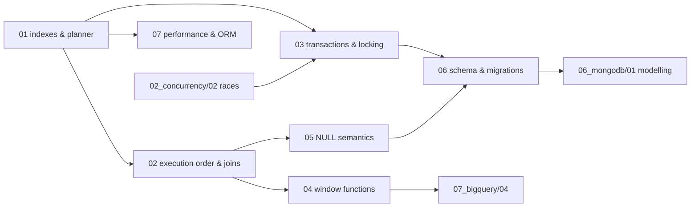

# SQL — syllabus

**Modules:** 7 · **Target length:** ~53,000 words · **Ladder target:** L4 across, L5 on the planner and on isolation
**Prerequisites:** none for modules 01–05; module 07 assumes [`01_python/06`](../01_python/00_syllabus.md) for the ORM half
**Feeds:** [`06_mongodb/`](../06_mongodb/00_syllabus.md) by contrast, [`07_bigquery/04`](../07_bigquery/00_syllabus.md) directly
**Measurement status:** SQLite measurable immediately; Postgres needs the Docker daemon
**Roles:** Data Analyst ●●● · Data Engineer ●●● · Fullstack SWE ●●○

---

## 1. Competencies

Thirty-two competencies. The data-analyst path runs through modules 04 and 05; the data-engineer path through 01, 03 and 07.

| ID | Competency | L | Probe | Tell | Roles | Module |
|---|---|---|---|---|---|---|
| `SQL-01` | Explain a B-tree index as a sorted structure and derive its consequences | L4 | "What is an index?" | Shallow: *"it makes queries faster."* Senior: a sorted copy of selected columns with pointers back to rows — from which everything else follows: it helps only in its own sort order, it costs storage and write amplification, and range queries work because sortedness makes them contiguous | DE ● DA ● FS ● | `01` |
| `SQL-02` | Read `EXPLAIN (ANALYZE, BUFFERS)` and identify the real problem | L4 | "Walk me through this plan." | Shallow: reads the node names aloud. Senior: compares **estimated versus actual rows** first because that gap explains most bad plans, checks buffer reads for cache behaviour, and finds the node where time actually accumulated rather than the one at the top | DE ●● DA ● | `01` |
| `SQL-03` | Explain selectivity and when an index makes a query slower | L5 | "Should I index this column?" | Shallow: *"yes, if you filter on it."* Senior: depends on selectivity — quotes the measured case where an index at 98% selectivity was **slower than a full scan** because random pointer-following beat sequential reading, and notes the planner knows this and will refuse the index | DE ●● DA ● | `01` |
| `SQL-04` | Apply the leftmost-prefix rule and name the skip-scan exception | L4 | "I have an index on (a, b, c). Does it help a query filtering only on b?" | Shallow: *"no."* Senior: not in general, because the index is sorted by `a` first — but a skip scan can still use it when `a` has low cardinality, so the honest answer names the rule and its exception | DE ● | `01` |
| `SQL-05` | Explain covering indexes and index-only scans | L4 | "What is a covering index?" | Shallow: *"an index with more columns."* Senior: one containing every column the query needs, so the heap is never touched; and warns of the measurement trap — testing selectivity using only indexed columns hides the trade-off entirely, because the pointer-following cost disappears | DE ●● | `01` |
| `SQL-06` | Explain why a function on the indexed column defeats the index | L3 | "Why is `WHERE DATE(created_at) = '2026-01-01'` slow?" | Shallow: *"date functions are slow."* Senior: the index stores `created_at`, not `DATE(created_at)`, so it cannot be searched — quotes the measured 35× penalty and gives both fixes: a range predicate on the raw column, or an expression index | DE ●● DA ●● | `01` |
| `SQL-07` | Explain when statistics go stale and what that does to plans | L4 | "The query was fast yesterday and slow today with no code change." | Shallow: *"the data grew."* Senior: the planner optimises against statistics; after a bulk load they describe a database that no longer exists, so it picks a nested loop expecting ten rows and gets a million — fix with `ANALYZE`, find it via estimated-versus-actual | DE ●● | `01` |
| `SQL-08` | State the logical evaluation order and explain what it makes illegal | L3 | "Why can't I use a `SELECT` alias in `WHERE`?" | Shallow: *"SQL doesn't allow it."* Senior: `FROM`, `WHERE`, `GROUP BY`, `HAVING`, `SELECT`, `ORDER BY` — the alias does not exist when `WHERE` runs, which is also why `ORDER BY` *can* use it and why `HAVING` exists at all | DA ●● DE ● | `02` |
| `SQL-09` | Distinguish nested loop, hash and merge joins and say what drives the choice | L4 | "When would the planner choose a hash join?" | Shallow: *"for big tables."* Senior: nested loop wins when the outer side is small and the inner is indexed; hash wins for large unsorted inputs with equality predicates; merge wins when both sides are already sorted — and a nested loop chosen on a bad row estimate is the classic catastrophic plan | DE ●● | `02` |
| `SQL-10` | Diagnose the `LEFT JOIN` condition-in-`WHERE` bug | L4 | "My LEFT JOIN is dropping rows." | Shallow: *"use a different join."* Senior: a condition on the right table in `WHERE` filters after the join, discarding the NULL-extended rows and silently converting it to an inner join — quotes the measured **207,001 to 55,538** row loss; the condition belongs in `ON` | DA ●●● DE ●● | `02` |
| `SQL-11` | Use semi-joins, anti-joins and `LATERAL` appropriately | L4 | "Find customers with no orders." | Shallow: `LEFT JOIN … WHERE x IS NULL`. Senior: writes the anti-join, then notes `NOT EXISTS` is NULL-safe while `NOT IN` is not, and reaches for `LATERAL` when the right side depends on the left — the top-N-per-group case | DA ●● DE ● | `02` |
| `SQL-12` | Explain the CTE optimisation fence and how it changed | L4 | "Are CTEs slower than subqueries?" | Shallow: *"CTEs are just cleaner syntax."* Senior: in PostgreSQL before 12 a CTE was an optimisation fence, materialised and never merged; from 12 it is inlined when referenced once unless you write `MATERIALIZED` — so the answer is version-dependent and both keywords now exist for a reason | DE ●● DA ● | `02` |
| `SQL-13` | State the four isolation levels and the anomaly each one permits | L4 | "What isolation level do you run?" | Shallow: *"the default."* Senior: names the default for the engine in question — Read Committed in Postgres, Repeatable Read in MySQL — and describes dirty read, non-repeatable read, phantom and write skew as the ladder of what each level still allows | DE ●● | `03` |
| `SQL-14` | Explain MVCC and what it costs | L5 | "How do readers avoid blocking writers?" | Shallow: *"row-level locking."* Senior: each transaction reads a snapshot, so readers never block writers; the cost is dead tuples that vacuum must reclaim, and a long-running transaction holds the snapshot horizon back and bloats every table it touches | DE ●●● | `03` |
| `SQL-15` | Reproduce a deadlock and give the fix that actually ships | L4 | "Two transactions deadlocked. What do you do?" | Shallow: *"retry."* Senior: reproduces it live from inconsistent update ordering, explains that the engine detects the cycle and kills one victim, then fixes it with a consistent table access order and shorter transactions — retry is the safety net, not the fix | DE ●●● | `03` |
| `SQL-16` | Explain write skew and why only Serializable prevents it | L5 | "Two transactions each read, check a condition, and write. Both succeed and the invariant is broken." | Shallow: *"add a lock."* Senior: names it as write skew, explains that Repeatable Read cannot see it because neither transaction touched the other's rows, and that Postgres SSI detects dangerous read-write dependencies while MySQL uses gap locks to a different end | DE ●● | `03` |
| `SQL-17` | Choose between optimistic and pessimistic locking | L5 | "How do you stop two users overwriting each other?" | Shallow: `SELECT … FOR UPDATE`. Senior: pessimistic locking serialises and holds locks across think time, which is unacceptable on a web request; optimistic version-column checks fail late but scale — chooses by contention rate and names the cost of each | DE ●● FS ●● | `03` |
| `SQL-18` | Explain window function frames and the `ROWS` versus `RANGE` trap | L5 | "Write a running total." | Shallow: writes `SUM(x) OVER (ORDER BY d)` and stops. Senior: writes it, then names the default frame as `RANGE BETWEEN UNBOUNDED PRECEDING AND CURRENT ROW` — which with duplicate ordering values sums **all peers at once**, giving a running total that jumps; `ROWS` is what most people actually mean | DA ●●● DE ●● | `04` |
| `SQL-19` | Distinguish `ROW_NUMBER`, `RANK` and `DENSE_RANK` and pick correctly | L3 | "Give me the top three products per category." | Shallow: `ORDER BY … LIMIT 3`. Senior: partitioned `ROW_NUMBER` in a subquery filtered outside, and explains why `RANK` would return more than three rows on ties and when that is actually what you want | DA ●●● | `04` |
| `SQL-20` | Use `LAG`/`LEAD` for period-over-period analysis | L3 | "Show month-over-month growth." | Shallow: self-join on a date offset. Senior: `LAG` partitioned appropriately, and notes the gap problem — a missing month makes `LAG` compare the wrong periods unless you generate a complete date spine first | DA ●●● | `04` |
| `SQL-21` | Solve a gaps-and-islands problem | L5 | "Find each user's longest streak of consecutive active days." | Shallow: stalls. Senior: subtracts a `ROW_NUMBER` from the date to produce a constant group key per island, then aggregates — the classic pattern, and being able to derive rather than recall it is the senior signal | DA ●●● | `04` |
| `SQL-22` | Write a cohort retention query | L5 | "Build a retention curve by signup month." | Shallow: describes it verbally. Senior: assigns each user a cohort from first activity, computes period offsets, aggregates into a cohort-by-period grid, and names the censoring problem — recent cohorts have not had time to reach later periods, so the last diagonal must be excluded rather than read as a drop | DA ●●● | `04` |
| `SQL-23` | Use `GROUPING SETS`, `ROLLUP` and `CUBE` and disambiguate their NULLs | L4 | "One query, totals at three levels." | Shallow: three queries with `UNION ALL`. Senior: `GROUPING SETS` in one pass, and uses `GROUPING()` to tell a subtotal NULL apart from a data NULL — the bug that silently corrupts a report | DA ●●● DE ● | `04` |
| `SQL-24` | Explain three-valued logic and where NULL breaks intuition | L4 | "What does `NULL = NULL` return?" | Shallow: *"false."* Senior: **unknown**, not false — then shows the consequences: `NOT IN` with any NULL in the subquery returns no rows at all, `CHECK` constraints pass on unknown, and `UNIQUE` permits multiple NULLs in most engines | DA ●●● DE ●● | `05` |
| `SQL-25` | Distinguish `COUNT(*)`, `COUNT(col)` and `COUNT(DISTINCT col)` | L3 | "What's the difference between `COUNT(*)` and `COUNT(column)`?" | Shallow: *"they're the same."* Senior: `COUNT(col)` skips NULLs — quotes the measured **1,000,000 / 900,000 / 198,662** trio and names this as the single most common silent reporting error | DA ●●● | `05` |
| `SQL-26` | Predict how NULL behaves through joins, `GROUP BY` and aggregates | L4 | "How does `GROUP BY` treat NULLs?" | Shallow: *"it ignores them."* Senior: `GROUP BY` groups NULLs together as one group even though `NULL = NULL` is unknown, while aggregates skip them — the inconsistency is deliberate and it is where reports diverge from expectation | DA ●●● | `05` |
| `SQL-27` | Choose the right numeric type for money and explain the failure | L4 | "What type do you use for currency?" | Shallow: `FLOAT`. Senior: `NUMERIC`/`DECIMAL` or integer minor units, because binary floating point cannot represent 0.1 — the same IEEE-754 issue as JavaScript's `0.1 + 0.2`, arriving in the database as a balance that is off by a cent after enough additions | DE ●● DA ●● | `05` |
| `SQL-28` | Handle time zones correctly | L4 | "Store a timestamp for a global product." | Shallow: `TIMESTAMP`. Senior: `TIMESTAMPTZ`, which stores an instant and renders per session zone, versus `TIMESTAMP` which stores a wall-clock reading with no instant — and notes that "daily" aggregates need an explicit zone or the day boundary is undefined | DE ●● DA ●● | `05` |
| `SQL-29` | Normalise to third normal form and argue for stopping | L5 | "When would you denormalise?" | Shallow: *"for performance."* Senior: names what normalisation buys — one place to update, so no update anomaly — then denormalises deliberately for read-heavy reporting with a stated plan for keeping the copy correct; and notes this is the axis on which the MongoDB comparison turns | DE ●● | `06` |
| `SQL-30` | Design constraints as executable documentation | L4 | "Where do you enforce that a balance can't go negative?" | Shallow: *"in the application."* Senior: a `CHECK` constraint, because application-layer rules are enforced only by the code paths that remember them, while the database enforces against every writer including the migration script and the person in `psql` | DE ●● FS ●● | `06` |
| `SQL-31` | Execute a zero-downtime schema migration | L5 | "Add a non-nullable column to a table with fifty million rows." | Shallow: `ALTER TABLE … NOT NULL`. Senior: the four-step dance — add nullable, backfill in batches, add the constraint as `NOT VALID` then validate, flip the application — plus `CREATE INDEX CONCURRENTLY`, and names the lock each naive step would take | DE ●●● | `06` |
| `SQL-32` | Find and fix N+1 from the ORM side | L4 | "The page makes four hundred queries. Why?" | Shallow: *"the ORM is slow."* Senior: lazy loading fires one query per parent on attribute access; fixes with `selectinload` or `joinedload` and explains when each is right — `joinedload` risks a cartesian blowup on collections, `selectinload` costs a second round trip — and quotes the measured N+1 result | DE ●●● FS ●● | `07` |

---

## 2. Prerequisite graph

Module 01 is the root of the topic. The data-analyst path is 01 → 02 → 04 → 05 and can be read without ever touching 03, 06 or 07.

---

## 3. Module manifest

| # | File | Scope | Words | Competencies | Status | Measurement |
|---|---|---|---|---|---|---|
| 01 | [`01_indexes_and_the_query_planner.md`](01_indexes_and_the_query_planner.md) | B-tree structure and descent, `EXPLAIN (ANALYZE, BUFFERS)`, cardinality and selectivity, leftmost prefix and skip scan, covering and index-only scans, expression and partial indexes, when statistics lie. Postgres and SQLite side by side. *Diagram: B-tree descent for a range predicate* | ~8,000 | `SQL-01`–`SQL-07` | ✅ **written** | `measured` — 7 IDs (`SQL-IDX-*`) |
| 02 | `02_execution_order_and_join_algorithms.md` | Logical evaluation order and why an alias fails in `WHERE`, nested-loop versus hash versus merge, join ordering, the `LEFT JOIN` silent-row-loss bug, semi/anti/lateral joins, the CTE fence before and after PG12 | ~7,500 | `SQL-08`–`SQL-12` | planned | measured |
| 03 | `03_transactions_isolation_and_locking.md` | ACID stated precisely, MVCC snapshots, the four levels, dirty/non-repeatable/phantom/write skew, Postgres SSI versus MySQL gap locks, **a deadlock reproduced live in two `psql` sessions**, long transactions and vacuum bloat, advisory locks | ~8,000 | `SQL-13`–`SQL-17` | **planned** — Phase 3 | measured |
| 04 | [`04_window_functions_and_analytical_sql.md`](04_window_functions_and_analytical_sql.md) | The data-analyst module: frames and the `ROWS` versus `RANGE` trap, partition and order semantics, the ranking family, `LAG`/`LEAD`, running totals, gaps-and-islands, cohort and retention with censoring, `GROUPING SETS`/`ROLLUP`/`CUBE`, percentiles | ~8,000 | `SQL-18`–`SQL-23` | ✅ **written** | `measured` — 3 IDs (`SQL-WIN-*`) |
| 05 | `05_null_semantics_and_correctness.md` | Three-valued logic, `NOT IN` with NULL, the `COUNT` trio, NULL through joins and `GROUP BY`, `DISTINCT ON`, aggregate-before-join versus after, numeric types and money, dates and time zones | ~7,000 | `SQL-24`–`SQL-28` | planned | measured |
| 06 | `06_schema_design_and_migrations.md` | Normal forms and when to stop, surrogate versus natural keys, constraints as executable documentation, slowly-changing dimensions, declarative partitioning, the zero-downtime migration dance, Alembic patterns, `CREATE INDEX CONCURRENTLY` | ~7,500 | `SQL-29`–`SQL-31` | planned | measured |
| 07 | `07_performance_at_scale_and_the_orm_boundary.md` | `pg_stat_statements` by total time, estimated versus actual as the diagnostic, autovacuum and bloat, N+1 from the SQLAlchemy side with `selectinload`/`joinedload` measured, `COPY` versus row-at-a-time `INSERT`, materialised views, and the row-store/column-store contrast that hands off to BigQuery | ~7,000 | `SQL-32` | planned | measured |

Three modules — 01, 03 and 04 — are in the Phase 3 core. They were chosen because 01 defends "advanced SQL," 03 is the standard data-engineer probe, and 04 is the entire data-analyst interview.

---

## 4. Measurement plan

SQLite is available now and needs no setup. Postgres is the better target for three of these modules and needs the Docker daemon.

| Module | Measured | Method | Setup needed |
|---|---|---|---|
| 01 | Index versus no index on a seeded schema (**re-run of `SQL-IDX-05`**, archived on SQLite, better on Postgres); the selectivity crossover where the index loses; the 35× function-on-column penalty; estimated-versus-actual after a bulk load without `ANALYZE` | `EXPLAIN (ANALYZE, BUFFERS)`, seeded 200k/1M schema | **Docker + `postgres:17`** |
| 02 | Planner switching between nested loop and hash as row counts change; the `LEFT JOIN` row-loss count (**re-run of `SQL-IDX-04`**); a CTE inlined versus `MATERIALIZED` | `EXPLAIN ANALYZE` | Docker |
| 03 | **A real deadlock across two `psql` sessions**, with the victim's error message captured verbatim; write skew succeeding under Repeatable Read and failing under Serializable; table bloat measured against an open long transaction | Two terminal sessions, `pg_stat_user_tables` | **Docker + `postgres:17`** |
| 04 | The `RANGE` versus `ROWS` running-total divergence on data with duplicate ordering keys — the trap shown producing wrong numbers before the fix; a cohort grid built end to end | SQLite is sufficient here | none |
| 05 | The `COUNT` trio on a seeded table (**re-run of `SQL-IDX-07`**); `NOT IN` returning zero rows against a NULL-containing subquery; float money drift accumulated over many additions | SQLite is sufficient | none |
| 06 | Lock acquired by a naive `ALTER TABLE` versus the four-step migration, observed in `pg_locks` while a concurrent reader runs | `pg_locks` | Docker |
| 07 | N+1 query count from SQLAlchemy lazy loading, then with `selectinload`; `COPY` versus row-by-row `INSERT` throughput | SQLAlchemy echo, `\timing` | Docker + SQLAlchemy |

**Nothing here is unmeasurable** — every claim in this topic can be produced on a laptop. Modules 04 and 05 need no setup at all and can be written before Docker is ever started, which makes module 04 the natural first SQL module if the daemon stays down.

The one genuinely `documented` claim is the MySQL gap-lock contrast in module 03, since only Postgres will be running locally. It carries the tag inline and is spoken as *"the way MySQL approaches this is…"*.

---

← [repo index](../README.md) · [measurement ledger](../MEASUREMENTS.md) · [writing contract](../AGENTS.md)
