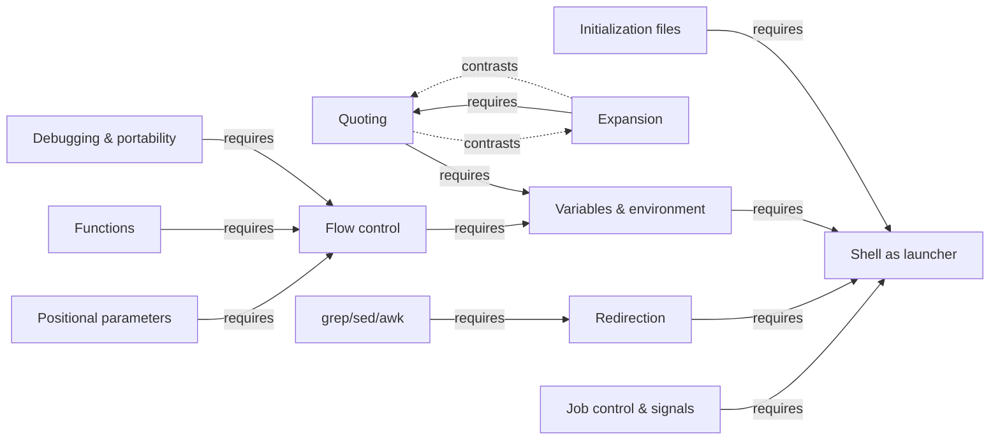
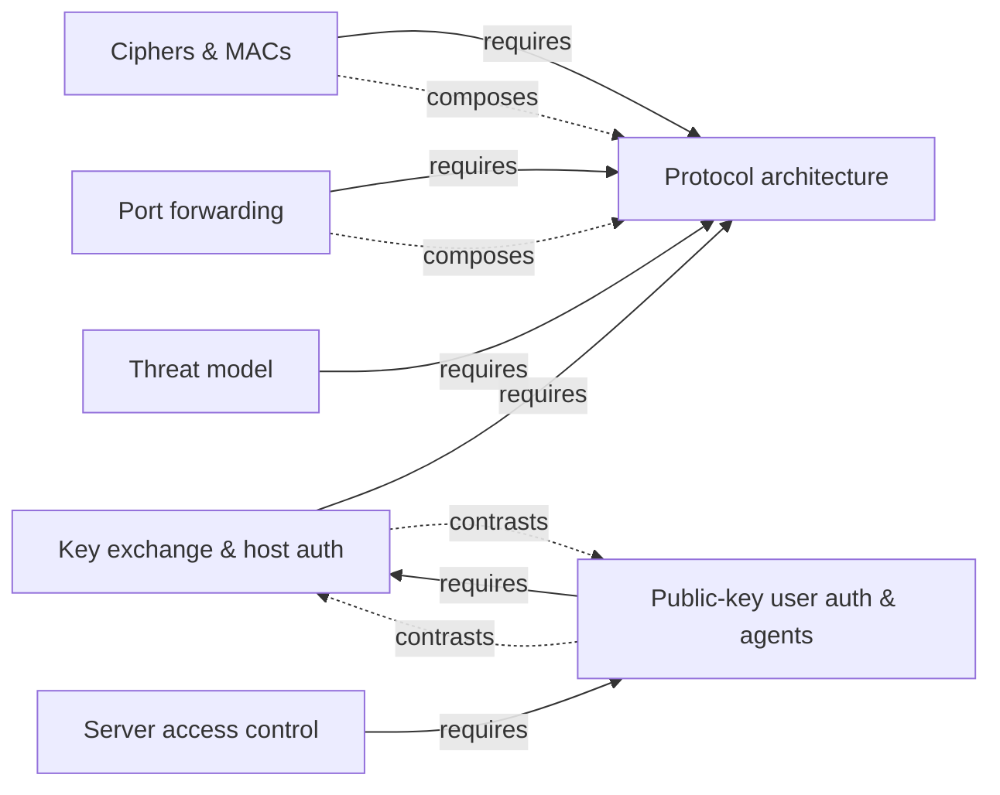

# Shell and SSH — knowledge graph

*Two disciplines under one roof: scripting the command interpreter that runs on the local machine, and the protocol that runs one securely on a machine reachable only over a network.*

**Nodes:** 19 · **Books:** 2 · **Currency researched:** 2026-08-06
**Requires:** [`01_computation`](../01_computation/00_knowledge_graph.md), [`02_os`](../02_os/00_knowledge_graph.md)

---

## §1 Source audit

| Book | Year | Documents | Verdict |
|---|---|---|---|
| Sriranga Veeraraghavan, *Sams Teach Yourself Shell Programming in 24 Hours* | 2002 | Command basics, files and directories, permissions, processes, variables, quoting, flow control, loops, parameters, I/O redirection, functions, `grep`/`sed`/`awk`, signals, debugging, portability across UNIX variants | Sound on the core Bourne-family scripting model — variables, expansion, redirection, and control flow have not changed. Weakest on its portability chapter, which surveys UNIX variants (SunOS, HP-UX, SCO) that are now largely discontinued or niche, while missing the portability question that actually matters on a modern Linux box: `/bin/sh` is frequently not `bash`. |
| Daniel J. Barrett, Richard E. Silverman & Robert G. Byrnes, *SSH, The Secure Shell: The Definitive Guide*, 2nd ed. | 2005 | SSH protocol architecture (transport, authentication, connection layers), SSH-1 versus SSH-2, key management and agents, cipher and MAC algorithm catalog, port and X forwarding, server and client configuration, troubleshooting, alternative implementations | The best available prose explanation of *why* the SSH protocol is layered the way it is — that architecture has not changed. Badly dated on everything OpenSSH has removed or replaced since 2005: SSH-1 protocol support, half its cipher catalog, DSA keys, and SHA-1-based signatures are all gone from a current server, and the book predates FIDO2 hardware keys entirely. |

---

## §2 Node index

| ID | Node | Type | Depth | Currency |
|---|---|---|---|---|
| `SH-01` | The shell as command interpreter and process launcher | Mechanism | L3 | `current` |
| `SH-02` | Shell initialization and configuration files | Mechanism | L3 | `stale-minor` |
| `SH-03` | Variables, scope, and environment | Mechanism | L3 | `current` |
| `SH-04` | Quoting and word splitting | Mechanism | L4 | `current` |
| `SH-05` | Filename and parameter expansion | Mechanism | L4 | `current` |
| `SH-06` | Flow control and looping constructs | Mechanism | L3 | `current` |
| `SH-07` | Positional parameters and option parsing | Practice | L4 | `current` |
| `SH-08` | Redirection and file descriptors | Mechanism | L4 | `current` |
| `SH-09` | Shell functions and code reuse | Mechanism | L3 | `current` |
| `SH-10` | Text-processing pipelines: grep, sed, awk | Tool | L4 | `current` |
| `SH-11` | Job control and signal handling in scripts | Mechanism | L4 | `current` |
| `SH-12` | Debugging and portability across shell dialects | Practice | L4 | `stale-minor` |
| `SH-13` | The SSH protocol architecture: transport, authentication, connection layers | Protocol | L4 | `stale-major` |
| `SH-14` | Key exchange and host authentication | Mechanism | L5 | `stale-minor` |
| `SH-15` | Public-key user authentication and agents | Mechanism | L4 | `stale-minor` |
| `SH-16` | Symmetric ciphers and integrity algorithms used by SSH | Mechanism | L4 | `stale-major` |
| `SH-17` | Port forwarding and tunneling | Mechanism | L4 | `current` |
| `SH-18` | Server-side access control and per-account configuration | Practice | L4 | `stale-minor` |
| `SH-19` | SSH threat model: what it prevents and what it does not | Model | L4 | `stale-minor` |

---

## §3 The graph

### Shell scripting

### SSH protocol

---

## §4 Node records

### `SH-01` · The shell as command interpreter and process launcher
**Type:** Mechanism · **Depth:** L3
**Covers:** what a command is, the shell as a program that reads and executes other programs, `fork`/`exec` at the shell-user level, foreground versus background execution
**Sources:** Veeraraghavan, *Teach Yourself Shell Programming in 24 Hours*, Hour 1–2, Hour 6 (2002)
**Edges:** `contrasts` [`SH-13`]
**Currency:** `current`

### `SH-02` · Shell initialization and configuration files
**Type:** Mechanism · **Depth:** L3
**Covers:** login versus interactive versus non-interactive shells, rc-file load order, setting up the environment at shell startup
**Sources:** Veeraraghavan, *Teach Yourself Shell Programming in 24 Hours*, Hour 2 (2002)
**Edges:** `requires` [`SH-01`]
**Currency:** `stale-minor`
**Δ current:** The book's coverage of shell initialization assumes a Bourne-family shell (`sh`/`bash`/`ksh`) as the default interactive shell. Apple changed the default shell for new user accounts on macOS from `bash` to `zsh` with the release of macOS Catalina in 2019, citing `bash`'s GPLv3 licensing as the reason Apple had stopped shipping newer `bash` versions. An article on this node should note that "the shell" is not a fixed default across platforms, and that zsh's initialization file set (`.zshrc`, `.zprofile`) differs from bash's (`.bashrc`, `.bash_profile`) in both naming and load order.

### `SH-03` · Variables, scope, and environment
**Type:** Mechanism · **Depth:** L3
**Covers:** shell variables versus environment variables, `export`, `unset`, variable scope within a script, special parameters (`$?`, `$$`, `$@`, `$#`)
**Sources:** Veeraraghavan, *Teach Yourself Shell Programming in 24 Hours*, Hour 7 (2002)
**Edges:** `requires` [`SH-01`]
**Currency:** `current`

### `SH-04` · Quoting and word splitting
**Type:** Mechanism · **Depth:** L4
**Covers:** backslash escaping, single quotes versus double quotes, how quoting interacts with word splitting and glob expansion
**Sources:** Veeraraghavan, *Teach Yourself Shell Programming in 24 Hours*, Hour 9 (2002)
**Edges:** `requires` [`SH-03`]
**Currency:** `current`

### `SH-05` · Filename and parameter expansion
**Type:** Mechanism · **Depth:** L4
**Covers:** filename globbing, variable substitution, command substitution, arithmetic substitution, the order in which a shell applies each expansion pass
**Sources:** Veeraraghavan, *Teach Yourself Shell Programming in 24 Hours*, Hour 8 (2002)
**Edges:** `requires` [`SH-04`]
**Currency:** `current`

### `SH-06` · Flow control and looping constructs
**Type:** Mechanism · **Depth:** L3
**Covers:** `if`/`case` conditionals, `while`/`for`/`select` loops, loop control (`break`, `continue`)
**Sources:** Veeraraghavan, *Teach Yourself Shell Programming in 24 Hours*, Hour 10–11 (2002)
**Edges:** `requires` [`SH-03`]
**Currency:** `current`

### `SH-07` · Positional parameters and option parsing
**Type:** Practice · **Depth:** L4
**Covers:** positional parameters, `$0` through `$9` and `shift`, `getopts`-style option parsing, conventions for short and long flags
**Sources:** Veeraraghavan, *Teach Yourself Shell Programming in 24 Hours*, Hour 12 (2002)
**Edges:** `requires` [`SH-06`]
**Currency:** `current`

### `SH-08` · Redirection and file descriptors
**Type:** Mechanism · **Depth:** L4
**Covers:** stdin/stdout/stderr, output and input redirection operators, here-documents, duplicating and closing file descriptors
**Sources:** Veeraraghavan, *Teach Yourself Shell Programming in 24 Hours*, Hour 13 (2002)
**Edges:** `requires` [`SH-01`]
**Currency:** `current`

### `SH-09` · Shell functions and code reuse
**Type:** Mechanism · **Depth:** L3
**Covers:** defining and calling shell functions, passing data between functions, building a reusable function library
**Sources:** Veeraraghavan, *Teach Yourself Shell Programming in 24 Hours*, Hour 14, Hour 21 (2002)
**Edges:** `requires` [`SH-06`]
**Currency:** `current`

### `SH-10` · Text-processing pipelines: grep, sed, awk
**Type:** Tool · **Depth:** L4
**Covers:** regular-expression matching with `grep`, stream editing with `sed`, `awk`'s pattern-action programming model, chaining filters through pipes
**Sources:** Veeraraghavan, *Teach Yourself Shell Programming in 24 Hours*, Hour 15–17 (2002)
**Edges:** `requires` [`SH-08`]
**Currency:** `current`

### `SH-11` · Job control and signal handling in scripts
**Type:** Mechanism · **Depth:** L4
**Covers:** how signals are represented and delivered, `trap`, parent/child process relationships, process groups, killing and backgrounding jobs
**Sources:** Veeraraghavan, *Teach Yourself Shell Programming in 24 Hours*, Hour 6, Hour 19 (2002)
**Edges:** `requires` [`SH-01`]
**Currency:** `current`

### `SH-12` · Debugging and portability across shell dialects
**Type:** Practice · **Depth:** L4
**Covers:** `set -x` tracing, syntax checking, enabling debug output, portability techniques across shell implementations
**Sources:** Veeraraghavan, *Teach Yourself Shell Programming in 24 Hours*, Hour 20, Hour 23 (2002)
**Edges:** `requires` [`SH-06`]
**Currency:** `stale-minor`
**Δ current:** The book's portability chapter surveys differences across UNIX variants including SunOS, HP-UX, and SCO, several of which are now discontinued or niche. The portability question that actually matters on a modern Linux system is that `/bin/sh` is not `bash`: Debian switched its default `/bin/sh` from `bash` to `dash` starting with Debian Squeeze (2011) specifically because `dash` starts faster at boot, and Debian 12 ("bookworm") removed the `debconf` option that previously let administrators switch it back. An article on this node should treat POSIX-`sh`-versus-bashisms as the live portability hazard, rather than the historical SunOS/HP-UX/SCO divergences the book surveys.

### `SH-13` · The SSH protocol architecture: transport, authentication, connection layers
**Type:** Protocol · **Depth:** L4
**Covers:** the three-layer SSH-2 protocol stack (SSH-TRANS, SSH-AUTH, SSH-CONN), protocol version negotiation, channels and requests, the historical SSH-1 architecture
**Sources:** Barrett, Silverman & Byrnes, *SSH, The Secure Shell*, 2nd ed., ch.3 (2005)
**Edges:** `contrasts` [`SH-01`]
**Currency:** `stale-major`
**Δ current:** The book (2005) devotes a full section ("Inside SSH-1," §3.5) to the SSH-1 protocol as one of two protocol families still in active use alongside SSH-2. OpenSSH removed SSH-1 protocol support entirely in release 7.6 (October 3, 2017), along with the `protocol` configuration option that used to select it, and no SSH-1 implementation remains relevant to a current deployment. An article on this node should describe SSH-2 as the only protocol in play today and mention SSH-1 only as dead history explaining why the transport/authentication/connection three-layer split exists in the first place.

### `SH-14` · Key exchange and host authentication
**Type:** Mechanism · **Depth:** L5
**Covers:** Diffie-Hellman key exchange, host keys and `known_hosts`, man-in-the-middle prevention, host-key fingerprints
**Sources:** Barrett, Silverman & Byrnes, *SSH, The Secure Shell*, 2nd ed., ch.3 §3.4.2, ch.6 §6.1 (2005)
**Edges:** `requires` [`SH-13`]
**Currency:** `stale-minor`
**Δ current:** The book presents RSA and DSA as parallel options for host and user keys, and MD5/SHA-1 as viable hash choices, reflecting 2005 cryptographic practice. `ssh-keygen` has defaulted to generating Ed25519 keys rather than RSA for several years, OpenSSH 8.8 (released September 26, 2021) disabled the `ssh-rsa` public-key signature scheme by default specifically because it depends on SHA-1, and DSA (`ssh-dss`) keys — disabled by default since OpenSSH 7.0 (2015) — were removed entirely in OpenSSH 10.0 (2025). An article on this node should present Ed25519 as the default key type and RSA-with-SHA-2 as the compatibility fallback, not as the default the book describes.

### `SH-15` · Public-key user authentication and agents
**Type:** Mechanism · **Depth:** L4
**Covers:** key pairs and passphrases, `ssh-keygen`, `ssh-agent`, loading keys with `ssh-add`, agent forwarding and its risks
**Sources:** Barrett, Silverman & Byrnes, *SSH, The Secure Shell*, 2nd ed., ch.2 §2.4–2.5, ch.6 (2005)
**Edges:** `requires` [`SH-14`]
**Currency:** `stale-minor`
**Δ current:** The book's coverage of identities and agents predates hardware-backed key storage. OpenSSH 8.2 (February 2020) added native support for FIDO2/U2F hardware security keys through the `ecdsa-sk` and `ed25519-sk` key types, where the private key material is split between a key handle stored on disk and a per-device secret that never leaves the hardware token, so a stolen private-key file alone is not sufficient to authenticate. An article on this node should present agent-held software keys as the baseline mechanism the book describes, and hardware-backed `-sk` keys as the current answer to the "stolen private key" failure mode that agents alone do not solve.

### `SH-16` · Symmetric ciphers and integrity algorithms used by SSH
**Type:** Mechanism · **Depth:** L4
**Covers:** symmetric cipher negotiation, MAC algorithm negotiation, compression negotiation, the algorithm-agreement handshake
**Sources:** Barrett, Silverman & Byrnes, *SSH, The Secure Shell*, 2nd ed., ch.3 §3.8 (2005)
**Edges:** `requires` [`SH-13`] · `composes` [`SH-13`]
**Currency:** `stale-major`
**Δ current:** The book catalogs IDEA, DES, Triple-DES, ARCFOUR (RC4), Blowfish, Twofish, and CAST as SSH's available ciphers, with CRC-32, MD5, and SHA-1 as its hash/MAC options. OpenSSH 7.6 (October 3, 2017) removed the `arcfour`, `blowfish`, and `CAST` ciphers along with the `hmac-ripemd160` MAC entirely from the codebase; the current default cipher preference order is `chacha20-poly1305@openssh.com` followed by the AES-GCM and AES-CTR modes, none of which appear in the book's catalog. An article on this node should present the current AEAD-cipher default directly rather than surveying the book's full historical list as though every entry were still offered.

### `SH-17` · Port forwarding and tunneling
**Type:** Mechanism · **Depth:** L4
**Covers:** local forwarding, remote forwarding, dynamic (SOCKS) forwarding, X11 forwarding, bypassing a firewall with a tunnel
**Sources:** Barrett, Silverman & Byrnes, *SSH, The Secure Shell*, 2nd ed., ch.9 (2005)
**Edges:** `requires` [`SH-13`] · `composes` [`SH-13`]
**Currency:** `current`

### `SH-18` · Server-side access control and per-account configuration
**Type:** Practice · **Depth:** L4
**Covers:** `sshd_config`, `authorized_keys` and forced commands, `chroot`-restricted access, per-account overrides of serverwide settings
**Sources:** Barrett, Silverman & Byrnes, *SSH, The Secure Shell*, 2nd ed., ch.5, ch.8 (2005)
**Edges:** `requires` [`SH-15`]
**Currency:** `stale-minor`
**Δ current:** The book documents DSA-based per-account authorization as one of several equally valid key types for `authorized_keys` entries. DSA host and user keys have been disabled by default since OpenSSH 7.0 (2015) and removed entirely in OpenSSH 10.0 (2025), so any `authorized_keys` or host-key configuration the book demonstrates using `ssh-dss` no longer authenticates against a current server. An article on this node should use Ed25519 or RSA-with-SHA-2 in every `authorized_keys` example rather than reproducing the book's DSA-inclusive listings.

### `SH-19` · SSH threat model: what it prevents and what it does not
**Type:** Model · **Depth:** L4
**Covers:** eavesdropping, name-service/IP spoofing, connection hijacking, man-in-the-middle attacks, what SSH does not prevent (password cracking, traffic analysis, covert channels, carelessness)
**Sources:** Barrett, Silverman & Byrnes, *SSH, The Secure Shell*, 2nd ed., ch.3 §3.9–3.11 (2005)
**Edges:** `requires` [`SH-13`]
**Currency:** `stale-minor`
**Δ current:** The book's threat-model chapter (§3.9–3.11) does not anticipate cryptographically relevant quantum computers as a threat category, which was reasonable in 2005. OpenSSH 9.0 (2022) made a hybrid post-quantum key-exchange method (`sntrup761x25519`) the default for key exchange, and OpenSSH 10.4 (July 2026) added an experimental post-quantum signature option on top of that. An article on this node should add "harvest now, decrypt later" against recorded traffic as a threat category the book's list omits, and note that OpenSSH's response to it is already shipping rather than theoretical.

---

## §5 Cross-subject edges

This subject declares no cross-subject edges in this wave, per the instruction to keep all edges internal until sibling subjects' node IDs are fixed. See §6 for the connections that will need edges once `01_computation`, `02_os`, and later subjects exist.

---

## §6 Coverage gaps

`SH-01` should carry a `requires` edge back to `01_computation`'s kernel/user-mode node once cross-subject edges are declared, since a shell launching a command is a direct, visible instance of the fork/exec process-creation model that subject introduces.

`SH-11` (job control and signals) should carry a `requires` edge to `02_os`'s process-lifecycle node, since shell-level signal handling is a thin layer over the same signal-delivery and process-termination mechanisms that subject covers at the kernel level.

`SH-14` (key exchange) rests on public-key cryptography and Diffie-Hellman that neither book in this directory teaches from first principles — Barrett, Silverman & Byrnes explains SSH's *use* of these primitives well but assumes the reader already understands modular exponentiation and the discrete-logarithm problem. No book here covers that; a dedicated cryptography reference would close it, and until one exists this graph treats the primitives as given rather than derived.

Nothing here covers SFTP as a protocol in its own right — both source books treat it as a client feature layered on SSH, not as a specification with its own versioning history (it stalled at draft 6 and was never formally standardized by the IETF, unlike SSH-2 itself). A node covering that history would need a primary source neither book provides.

Shell scripting's interaction with modern CI/CD — running scripts non-interactively inside containers, `set -euo pipefail` as a defensive convention the 1990s-era book predates entirely, and the shebang/interpreter-selection subtleties that matter when a script's assumed shell is not what a container image actually ships — is not covered by either book and would need a current, container-aware source to do justice to a working engineer's actual daily exposure to shell scripts.

The SSH certificate authority model — OpenSSH's own certificate format (distinct from X.509) for signing user and host keys at scale, which is how most large organizations manage SSH trust today rather than distributing individual `authorized_keys` entries — appears in the book only as the older SPKI/X.509-via-Tectia treatment (§11.5.1), which is a different and now much less common mechanism. A current OpenSSH manual-page-level source would be needed to cover `ssh-keygen -s` certificate signing properly; this graph notes the gap on `SH-18` rather than inventing coverage from an outdated model.

---

← [repo index](../README.md) · [root graph](../KNOWLEDGE_GRAPH.md) · [writing contract](../AGENTS.md)
