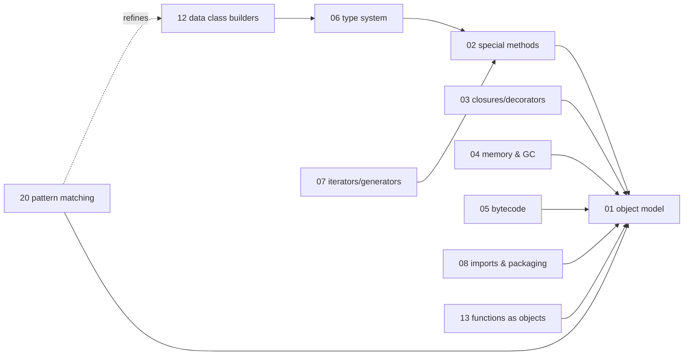
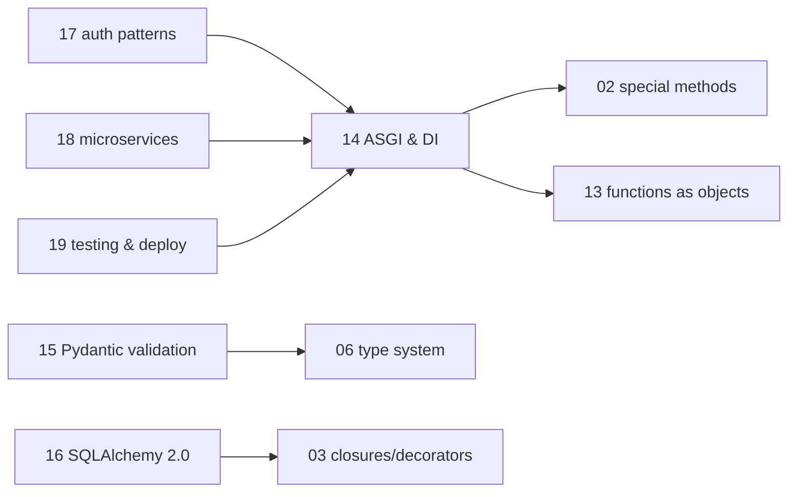
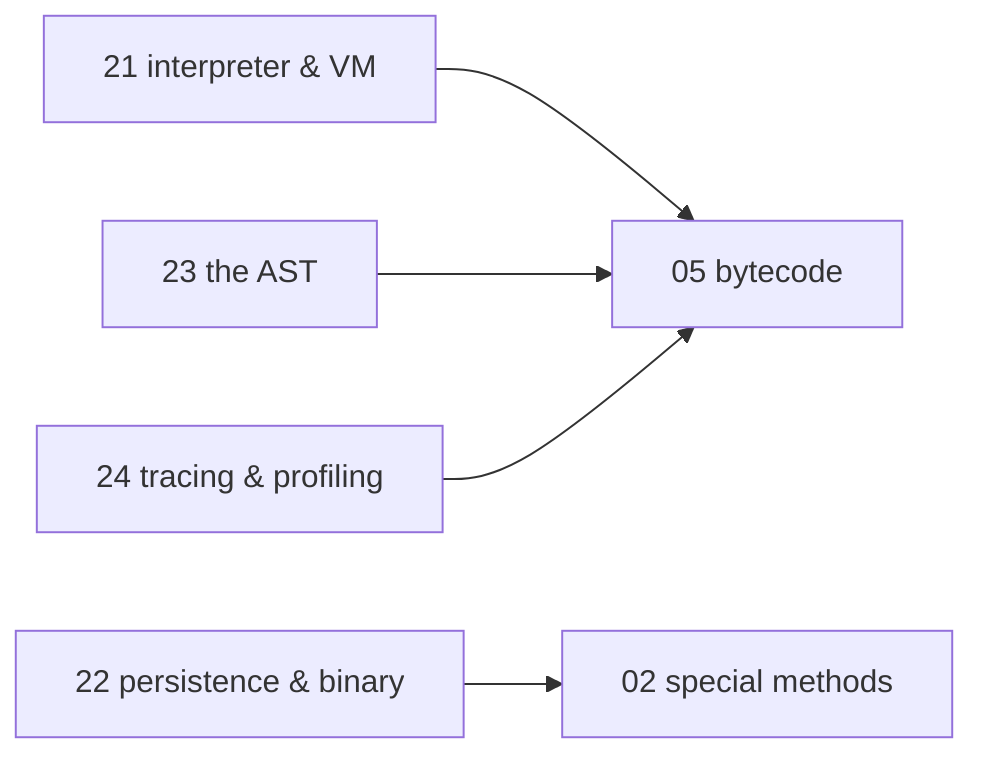

# Python — knowledge graph

*Core-language mechanics — the object model, the runtime, the type system — extended into the
async web-service stack (FastAPI, Pydantic, SQLAlchemy) that most of this repo's other subjects
assume the reader already has.*

**Nodes:** 24 · **Books:** 5 · **Currency researched:** 2026-08-06, extended 2026-08-08
**Requires:** none — this is a root topic
**Feeds:** [`06_concurrency`](../06_concurrency/00_knowledge_graph.md)

---

## §1 Source audit

| Book | Year | Documents | Verdict |
|---|---|---|---|
| Ramalho, *Fluent Python*, 2nd ed. | 2022 | Data model, sequences, dict/set internals, unicode, data class builders, functions as objects, closures/decorators/metaclasses, protocols and ABCs, inheritance and MRO, iterators/generators, pattern matching, and — read for `06_concurrency` rather than for this file — concurrency models, executors, and asyncio (ch.19–21) | The deepest and most reliable source on this shelf for core-language mechanics, solid through Python 3.10. Silent on PEP 695 generics (3.12), PEP 649 lazy annotations (3.14), and free-threading (3.13/3.14), all of which postdate it |
| Beazley, *Advanced Python Mastery* (slide deck) | 2024 | Object model internals, descriptors, closures, decorators, metaclasses, generators, coroutines, the import system — as terse slides, not prose | Current as of publication and a useful second angle on object internals from a different teacher; the slide format leaves no room to develop the free-threading and subinterpreter material that shipped the same year |
| Tragura, *Building Python Microservices with FastAPI* | 2022 | FastAPI fundamentals, dependency injection, five different ORM/ODM layers, authentication (Basic/Digest/OAuth2/JWT/OIDC), coroutines and message-driven transactions, session/CORS/middleware, microservice decomposition and service discovery, deployment | Broad and still the best single source here for microservice architecture patterns. Written against Pydantic v1 and SQLAlchemy 1.x, both since replaced by breaking rewrites — every code sample using `.dict()` or the legacy `Query` object is teaching a superseded API |
| Alheraki, *Mastering FastAPI with Python* | 2025 | FastAPI basics through production deployment, Pydantic validation, async database access with SQLAlchemy, microservice scaling, Docker/AWS/GCP deployment | Recent enough to reflect the current FastAPI/Pydantic v2 surface, but shallow — roughly 135 pages against Tragura's 400+ — and thin on the concurrency internals underneath the framework |
| Wilson, *Software Design by Example* (Python edition) | 2026 | Thirty-one chapters that each build a small working version of a tool programmers use daily: an object system made of dictionaries, a duplicate-file finder, a pattern matcher, a parser, a test runner, a tree-walking interpreter, closures, protocols, an archiver, an HTML validator, a template expander, a linter, a page-layout engine, a profiler, an object-persistence layer, binary encoding, a database, a build manager, a package manager, file transfer, a web server, a file viewer, undo/redo, a register virtual machine, a debugger, and a documentation generator | A different kind of source from the rest of this shelf, and the reason it is worth citing: it is open-licensed, continuously revised, and its most recent commit at the time of this pass is dated 2026-06-23, which makes it the only source here newer than Python 3.10. It teaches by construction rather than by reference, so it is authoritative on *how a mechanism works* and deliberately silent on CPython's actual implementation of the same idea — an object system built from dictionaries is not `PyTypeObject`. Two caveats from reading the repository directly: the "Observers" and "Concurrency" chapters are outline stubs of roughly 75 and 156 words with `FIXME` abstracts, and "Generating Documentation" is partially drafted, so none of the three is cited as a source anywhere below |

---

## §2 Node index

| ID | Node | Type | Depth | Currency |
|---|---|---|---|---|
| `PY-01` | Object model and attribute lookup | Mechanism | L5 | `current` |
| `PY-02` | The special-method protocol: dunders as the real interface | Mechanism | L4 | `current` |
| `PY-03` | Closures, decorators, and metaprogramming | Mechanism | L5 | `current` |
| `PY-04` | Memory management: reference counting, cyclic GC, and weak references | Mechanism | L4 | `stale-minor` |
| `PY-05` | Bytecode and the runtime | Mechanism | L5 | `stale-minor` |
| `PY-06` | The gradual type system: protocols, generics, and static checking | Mechanism | L4 | `stale-minor` |
| `PY-07` | Iterators, generators, and lazy evaluation | Mechanism | L4 | `current` |
| `PY-08` | The import system and packaging | Mechanism | L4 | `stale-minor` |
| `PY-09` | Sequence types and their memory layout | Structure | L4 | `current` |
| `PY-10` | Hash-based collections: dict and set internals | Structure | L4 | `current` |
| `PY-11` | Unicode text versus bytes | Mechanism | L3 | `current` |
| `PY-12` | Data class builders and immutable value objects | Mechanism | L4 | `current` |
| `PY-13` | Functions as first-class objects and functional design patterns | Mechanism | L3 | `current` |
| `PY-14` | ASGI request handling and dependency injection in FastAPI | Mechanism | L4 | `stale-minor` |
| `PY-15` | Pydantic validation: schema design, performance, and the v1-to-v2 rewrite | Mechanism | L4 | `stale-major` |
| `PY-16` | Async database access with SQLAlchemy 2.0 | Mechanism | L4 | `stale-major` |
| `PY-17` | Authentication and authorization patterns in a REST API | Practice | L4 | `stale-minor` |
| `PY-18` | Microservice decomposition and inter-service communication | Practice | L4 | `current` |
| `PY-19` | Testing and deploying a Python web service | Practice | L3 | `stale-minor` |
| `PY-20` | Structural pattern matching and the match statement | Mechanism | L3 | `current` |
| `PY-21` | Building an interpreter and a virtual machine in Python | Mechanism | L5 | `current` |
| `PY-22` | Object persistence and binary serialisation | Mechanism | L4 | `stale-minor` |
| `PY-23` | The abstract syntax tree as a program-analysis surface | Mechanism | L4 | `stale-minor` |
| `PY-24` | Tracing a running program: profilers, debuggers, and `sys.monitoring` | Mechanism | L4 | `stale-major` |

---

## §3 The graph

### Core language mechanics

### The web-service layer

### Programs as data

---

## §4 Node records

### `PY-01` · Object model and attribute lookup
**Type:** Mechanism · **Depth:** L5
**Covers:** `__getattribute__`/`__getattr__` resolution order, the descriptor protocol (data versus non-data descriptors), instance `__dict__` versus class `__dict__`, `__slots__` and its memory and inheritance costs, C3 linearisation, cooperative `super()`, the dictionary-of-methods model that makes all of the above possible
**Sources:** Ramalho ch.1, 11, 13, 14, 22, 23, 24 (2022) · Beazley, *Advanced Python Mastery* §3–4 (2024) · Wilson, *Software Design by Example* ch."Objects and Classes" (2026) — an object system built from bare dictionaries, which is the mechanism stripped of CPython's implementation
**Edges:** `contrasts` [`PY-10`] · `contrasts` [`JS-10`]
**Currency:** `current`
**Article:** [01_object_model_and_attribute_lookup.md](01_object_model_and_attribute_lookup.md)

### `PY-02` · The special-method protocol: dunders as the real interface
**Type:** Mechanism · **Depth:** L4
**Covers:** the iteration protocol as a fallback chain (`__iter__` then legacy `__getitem__`), context managers and `contextlib.contextmanager`, the `__eq__`/`__hash__` contract and what violating it breaks in a dict, `__new__` versus `__init__`, operator overloading, duck typing as protocol-slot lookup on the type rather than the instance, `functools.singledispatch`
**Sources:** Ramalho ch.1, 12, 13, 16, 18, 22 (2022) · Beazley, *Advanced Python Mastery* §3 (2024) · Wilson, *Software Design by Example* ch."Protocols" (2026)
**Edges:** `requires` [`PY-01`]
**Currency:** `current`
**Article:** [02_the_special_method_protocol.md](02_the_special_method_protocol.md)

### `PY-03` · Closures, decorators, and metaprogramming
**Type:** Mechanism · **Depth:** L5
**Covers:** cell objects and `__closure__`, late binding, decorators that take arguments, what `functools.wraps` restores and what stays broken without it, class decorators, `__init_subclass__` and `__set_name__`, metaclasses and where SQLAlchemy's declarative base and Pydantic's model machinery actually use them, introspection-driven discovery of the kind a test runner does when it finds test functions by scanning a namespace
**Sources:** Ramalho ch.9, 10, 24 (2022) · Beazley, *Advanced Python Mastery* §7 (2024) · Wilson, *Software Design by Example* ch."Functions and Closures", ch."Protocols" §Decorators, ch."Running Tests" (2026)
**Edges:** `requires` [`PY-01`] · `contrasts` [`JS-07`]
**Currency:** `current`
**Article:** [03_closures_decorators_and_metaprogramming.md](03_closures_decorators_and_metaprogramming.md)

### `PY-04` · Memory management: reference counting, cyclic GC, and weak references
**Type:** Mechanism · **Depth:** L4
**Covers:** reference counting and why `sys.getrefcount` reads one high, the generational cyclic collector and `gc` thresholds, `weakref` and `WeakValueDictionary`, `__del__` hazards, pymalloc arenas and why RSS does not return to the OS after a large structure is freed, `tracemalloc`, shallow versus deep copy semantics
**Sources:** Ramalho ch.6 (2022) · Beazley, *Advanced Python Mastery* §2 (2024)
**Edges:** `requires` [`PY-01`] · `contrasts` [`JS-14`, `GO-18`]
**Currency:** `stale-minor`
**Δ current:** Ramalho's chapter 6 (2022) and the Beazley deck describe reference counting as an ordinary, non-atomic integer increment protected only by the GIL. Under the free-threaded build — experimental in Python 3.13, promoted to officially supported status in Python 3.14 by PEP 779 (released 7 October 2025) — CPython instead uses biased reference counting with per-object locking, and PEP 683 immortal objects (module-level code and type objects in 3.13, narrowed to interned strings and code constants as of 3.14) skip refcounting entirely. An article on this node should present ordinary refcounting as the default-build behaviour and flag the free-threaded divergence explicitly, with the mechanism itself detailed in [`CONC-05`](../06_concurrency/00_knowledge_graph.md).
**Article:** [04_memory_management_and_the_cyclic_collector.md](04_memory_management_and_the_cyclic_collector.md)

### `PY-05` · Bytecode and the runtime
**Type:** Mechanism · **Depth:** L5
**Covers:** `dis` and frame objects, the eval loop, `LOAD_FAST` versus `LOAD_GLOBAL`, the 3.11+ specialising adaptive interpreter, small-integer and string interning identity traps, honest `timeit` methodology
**Sources:** Beazley, *Advanced Python Mastery* §2 (2024) — thin overlap only, on builtin-object layout rather than bytecode directly · Wilson, *Software Design by Example* ch."A Virtual Machine" (2026) — a stack-free register machine, useful as the contrast that makes CPython's stack machine legible, not as a description of it
**Edges:** `requires` [`PY-01`]
**Currency:** `stale-minor`
**Δ current:** None of the four books on this shelf disassembles CPython bytecode directly; the closest material is Beazley's 2024 sections on builtin-object internals, which do not touch the instruction set. That instruction set changed materially across 3.11 (the specialising adaptive interpreter, PEP 659), 3.12, and 3.13/3.14 (continued Tier 2 optimizer work plus the experimental JIT under PEP 744 — disabled by default in 3.13, enabled via `PYTHON_JIT=1` in 3.14 with results ranging from 10% slower to 20% faster depending on workload). The written article on this node cites PEP 659 for the 3.11+ specialising interpreter and PEP 744 for the 3.14 JIT rather than leaning on a book, which is the only sound approach for a mechanism this shelf does not really cover.
**Article:** [05_bytecode_and_the_runtime.md](05_bytecode_and_the_runtime.md)

### `PY-06` · The gradual type system: protocols, generics, and static checking
**Type:** Mechanism · **Depth:** L4
**Covers:** type hints as runtime objects living in `__annotations__`, gradual typing and mypy strictness levels, `Protocol` and structural typing, ABCs and goose typing, `TypeVar`-based generics and variance, `TypedDict`, `@overload`, PEP 604 `X | Y` unions
**Sources:** Ramalho ch.8, 13, 15 (2022)
**Edges:** `requires` [`PY-02`] · `contrasts` [`TS-01`]
**Currency:** `stale-minor`
**Δ current:** Ramalho's chapters (2022, targeting 3.10) cover `TypeVar`-based generics and PEP 604 unions, both already current in 3.10. Python 3.12 (PEP 695, shipped 2 October 2023) replaced the `TypeVar` boilerplate with native syntax — `class Box[T]:`, `def first[T](xs: list[T]) -> T:`, and a lazily evaluated `type Maybe[T] = T | None` alias — none of which the book shows. Python 3.14 further changed how annotations are evaluated: PEP 649, implemented via PEP 749, makes annotations lazy by default through a new `__annotate__` mechanism, and the `from __future__ import annotations` idiom the book relies on is slated for eventual deprecation once Python 3.13 reaches end of life. An article on this node should lead with PEP 695 syntax and treat the `TypeVar` form as the legacy spelling still required for pre-3.12 compatibility.
**Article:** [09_the_gradual_type_system.md](09_the_gradual_type_system.md)

### `PY-07` · Iterators, generators, and lazy evaluation
**Type:** Mechanism · **Depth:** L4
**Covers:** the iterator protocol and `__next__`/`StopIteration`, generator functions and frame suspension, `yield from` and subgenerator delegation, `send`/`throw`/`close`, `itertools` pipeline composition, classic (pre-`async`) coroutines
**Sources:** Ramalho ch.17 (2022) · Beazley, *Advanced Python Mastery* §8 (2024) · Wilson, *Software Design by Example* ch."Protocols" §Iterators (2026)
**Edges:** `requires` [`PY-02`] · `contrasts` [`JS-11`]
**Currency:** `current`
**Article:** [07_iterators_generators_and_lazy_evaluation.md](07_iterators_generators_and_lazy_evaluation.md)

### `PY-08` · The import system and packaging
**Type:** Mechanism · **Depth:** L4
**Covers:** finders and loaders, `sys.modules` as a cache, why a module body runs exactly once, circular imports and the timing of the failure, namespace packages, the `__main__` guard and its interaction with the `spawn` start method, semantic versioning and dependency resolution as a constraint-satisfaction problem rather than a lookup, why a resolver may need a SAT solver
**Sources:** Beazley, *Advanced Python Mastery* §9 (2024) · Wilson, *Software Design by Example* ch."A Package Manager" (2026)
**Edges:** `requires` [`PY-01`]
**Currency:** `stale-minor`
**Δ current:** Beazley's 2024 deck teaches `venv` plus `pip` for environment and dependency management, which still works but is no longer the fastest or most common path: `uv` (Astral, first released as v0.1.0 in February 2024) reimplements the resolver and installer in Rust and is pitched as a single replacement for `pip`, `pip-tools`, `pipx`, `poetry`, `pyenv` and `virtualenv`; this repository's own tooling assumes it via `uv run`. The import machinery itself — finders, loaders, `sys.modules`, the `spawn`-versus-`fork` interaction — is unchanged; only the packaging layer around it has moved.
**Article:** [08_the_import_system_and_packaging.md](08_the_import_system_and_packaging.md)

### `PY-09` · Sequence types and their memory layout
**Type:** Structure · **Depth:** L4
**Covers:** list over-allocation and amortised growth, tuples as records versus immutable lists, slicing and slice objects, the `array` module, `memoryview` and zero-copy buffer access, `deque` as a double-ended structure, pattern matching over sequences
**Sources:** Ramalho ch.2 (2022) · Beazley, *Advanced Python Mastery* §2 (2024) · Wilson, *Software Design by Example* ch."Performance Profiling" (2026) — row-wise against column-wise storage of the same table, measured
**Edges:** `contrasts` [`PY-10`]
**Currency:** `current`
**Article:** [06_sequences_dicts_and_sets.md](06_sequences_dicts_and_sets.md)

### `PY-10` · Hash-based collections: dict and set internals
**Type:** Structure · **Depth:** L4
**Covers:** open addressing and collision resolution, why `dict` has preserved insertion order as a language guarantee since 3.7, dictionary views as set-like objects, `defaultdict`/`ChainMap`/`Counter`, the practical consequence that dict keys must be hashable and effectively immutable, cryptographic content hashing as a different use of the same word — identity by digest rather than by bucket
**Sources:** Ramalho ch.3 (2022) · Beazley, *Advanced Python Mastery* §2 (2024) · Wilson, *Software Design by Example* ch."Finding Duplicate Files" (2026)
**Edges:** `contrasts` [`PY-09`, `PY-01`]
**Currency:** `current`
**Article:** [06_sequences_dicts_and_sets.md](06_sequences_dicts_and_sets.md)

### `PY-11` · Unicode text versus bytes
**Type:** Mechanism · **Depth:** L3
**Covers:** the `str`/`bytes` split, encoders and decoders, `UnicodeEncodeError`/`UnicodeDecodeError`, BOM handling, Unicode normalisation for reliable comparison, the dual-mode `str`/`bytes` standard-library APIs
**Sources:** Ramalho ch.4 (2022)
**Edges:** `composes` [`PY-14`]
**Currency:** `current`
**Article:** [11_text_bytes_and_object_persistence.md](11_text_bytes_and_object_persistence.md)

### `PY-12` · Data class builders and immutable value objects
**Type:** Mechanism · **Depth:** L4
**Covers:** `dataclass` field options and post-init processing, classic and typed `NamedTuple`, `TypedDict`, positional and keyword pattern matching over class instances, the data-class-as-code-smell critique
**Sources:** Ramalho ch.5 (2022)
**Edges:** `requires` [`PY-06`] · `contrasts` [`PY-15`]
**Currency:** `current`
**Article:** [10_data_classes_and_pattern_matching.md](10_data_classes_and_pattern_matching.md)

### `PY-13` · Functions as first-class objects and functional design patterns
**Type:** Mechanism · **Depth:** L3
**Covers:** the several flavours of callable, user-defined callables via `__call__`, the `operator` module, `functools.partial`, the Strategy and Command patterns implemented with plain functions instead of classes
**Sources:** Ramalho ch.7, 10 (2022) · Beazley, *Advanced Python Mastery* §6 (2024)
**Edges:** `requires` [`PY-01`]
**Currency:** `current`
**Article:** [02_the_special_method_protocol.md](02_the_special_method_protocol.md)

### `PY-14` · ASGI request handling and dependency injection in FastAPI
**Type:** Mechanism · **Depth:** L4
**Covers:** path/query/body parameter declaration and coercion, the `Depends()` dependency graph and its per-request caching, nested and router-scoped dependencies, middleware, CORS, background tasks, session handling, the lifespan context manager
**Sources:** Tragura, *Building Python Microservices with FastAPI* ch.1–3, 9 (2022) · Alheraki, *Mastering FastAPI with Python* (2025)
**Edges:** `requires` [`PY-02`, `PY-13`] · `requires` [`CONC-04`]
**Currency:** `stale-minor`
**Δ current:** Tragura's 2022 chapters use `@app.on_event("startup")`/`"shutdown"` for application lifecycle hooks. FastAPI deprecated that decorator pair starting at release 0.93 in favour of a single `lifespan` async context manager passed to the `FastAPI()` constructor — and setting `lifespan` causes the old event decorators to be silently ignored rather than raising an error, a trap for code migrated chapter by chapter from this book. An article on this node should teach `lifespan` as the only form and mention `on_event` only to name the trap.
**Article:** [15_asgi_request_handling_and_dependency_injection.md](15_asgi_request_handling_and_dependency_injection.md)

### `PY-15` · Pydantic validation: schema design, performance, and the v1-to-v2 rewrite
**Type:** Mechanism · **Depth:** L4
**Covers:** field validators and model config, error reporting shape, serialization with `model_dump`, the measured cost of validating an object versus a plain dataclass, where in a request pipeline validation belongs
**Sources:** Alheraki, *Mastering FastAPI with Python* (2025) · Tragura, *Building Python Microservices with FastAPI* ch.1 (2022)
**Edges:** `requires` [`PY-06`] · `contrasts` [`PY-12`]
**Currency:** `stale-major`
**Δ current:** Tragura's 2022 book is written against Pydantic v1. Pydantic 2.0, released June 2023, is a breaking rewrite that moves validation into `pydantic-core`, a Rust extension built on PyO3, reporting 5–50x faster validation than v1; the v1-style `@validator` decorator is replaced by `@field_validator`, and `.dict()`/`.json()` become `.model_dump()`/`.model_dump_json()`. A book teaching bare `@validator` and `.dict()` is teaching an API that a current FastAPI project — which has pinned Pydantic v2 by default since FastAPI 0.100 — will reject outright. An article on this node must lead with v2 syntax and treat v1 as the migration source, never the target.
**Article:** [16_pydantic_validation.md](16_pydantic_validation.md)

### `PY-16` · Async database access with SQLAlchemy 2.0
**Type:** Mechanism · **Depth:** L4
**Covers:** the async engine and `AsyncSession`, unified 2.0-style `select()`/`Session.execute()` querying across Core and ORM, connection-pool defaults, the declarative base as a metaclass-driven mechanism, transaction and session scope per request
**Sources:** Tragura, *Building Python Microservices with FastAPI* ch.5 (2022)
**Edges:** `requires` [`PY-03`] · `requires` [`CONC-04`] · `contrasts` [`SQL-20`]
**Currency:** `stale-major`
**Δ current:** Tragura's chapter 5 (2022) is written against SQLAlchemy 1.x, teaching a `Session`-bound `Query` object for the ORM layer and treating async support as a separate, not-yet-stable path. SQLAlchemy 2.0.0, released 26 January 2023, unifies Core and ORM behind one `select()` construct executed through `Session.execute()` or `AsyncSession.execute()`, and the async extension moved from beta status in 1.4 to fully supported in 2.0. The legacy `Query` object still works as a thin adapter that internally builds a 2.0-style `select()`, but individual methods such as `Query.get()` are documented as legacy in favour of `Session.get()`. An article on this node should teach 2.0 style as the only form and mention 1.x only to explain what an inherited codebase looks like.
**Article:** [17_async_database_access_with_sqlalchemy.md](17_async_database_access_with_sqlalchemy.md)

### `PY-17` · Authentication and authorization patterns in a REST API
**Type:** Practice · **Depth:** L4
**Covers:** HTTP Basic and Digest authentication, the OAuth2 password flow with `OAuth2PasswordBearer`, JWT issuance and verification, scope-based authorization, the authorization code flow, OpenID Connect integration with an external identity provider
**Sources:** Tragura, *Building Python Microservices with FastAPI* ch.7 (2022)
**Edges:** `requires` [`PY-14`]
**Currency:** `stale-minor`
**Δ current:** Tragura's chapter (2022) presents the OAuth2 password grant — where the client collects the user's username and password directly and exchanges them for a token — as a standard pattern alongside the authorization code flow. The OAuth 2.1 consolidation, which formalises current best practice, drops both the password grant and the implicit flow entirely and makes PKCE mandatory for the authorization code flow for every client type, not only public clients without a client secret. An article on this node should present the password grant only as a legacy pattern to recognise in existing code, never one to write new.
**Article:** [18_authentication_and_authorization.md](18_authentication_and_authorization.md)

### `PY-18` · Microservice decomposition and inter-service communication
**Type:** Practice · **Depth:** L4
**Covers:** the API-gateway and backend-for-frontend patterns, sub-application mounting, service registry and client-side service discovery, the circuit-breaker and retry patterns, synchronous calls with `httpx` versus event-driven messaging
**Sources:** Tragura, *Building Python Microservices with FastAPI* ch.4, 11 (2022) · Fowler, *Python Concurrency with asyncio* ch.10 (2022)
**Edges:** `requires` [`PY-14`]
**Currency:** `current`
**Article:** [19_microservice_decomposition.md](19_microservice_decomposition.md)

### `PY-19` · Testing and deploying a Python web service
**Type:** Practice · **Depth:** L3
**Covers:** FastAPI's `TestClient`, mocking injected dependencies, running under Uvicorn versus Gunicorn-with-Uvicorn-workers, containerising with Docker, OpenAPI schema customisation
**Sources:** Tragura, *Building Python Microservices with FastAPI* ch.9, 11 (2022) · Alheraki, *Mastering FastAPI with Python* (2025)
**Edges:** `requires` [`PY-14`]
**Currency:** `stale-minor`
**Δ current:** Both books recommend running Uvicorn directly or behind Gunicorn without being specific about worker topology. Uvicorn's own deployment documentation now recommends `gunicorn -k uvicorn.workers.UvicornWorker` — or the standalone `uvicorn-worker` package, since the worker class moved out of Uvicorn's own distribution — at roughly 2–4 workers per core behind a reverse proxy as the conservative production choice, while Uvicorn's built-in `--workers` flag offers a comparable multi-process manager built on `spawn` rather than `fork`, relevant on Windows and connected to the `PY-08` import-side-effects discussion. An article on this node should give both paths and name the trade-off rather than asserting one is obsolete.
**Article:** [20_testing_and_deploying_a_python_service.md](20_testing_and_deploying_a_python_service.md)

### `PY-20` · Structural pattern matching and the match statement
**Type:** Mechanism · **Depth:** L3
**Covers:** PEP 634's `match`/`case` syntax, sequence and mapping patterns, positional and keyword class patterns via `__match_args__`, or-patterns, guard clauses, the `else` clause on `for`/`while`/`try` beyond `if`
**Sources:** Ramalho ch.2, 3, 5, 11, 18 (2022)
**Edges:** `requires` [`PY-01`] · `refines` [`PY-12`]
**Currency:** `current`
**Article:** [10_data_classes_and_pattern_matching.md](10_data_classes_and_pattern_matching.md)

### `PY-21` · Building an interpreter and a virtual machine in Python
**Type:** Mechanism · **Depth:** L5
**Covers:** tokenizing and parsing a small language into a tree, tree-walking evaluation against an environment, environments as a chain of dictionaries and what that makes scope mean, first-class functions and closures inside an interpreted language, designing an instruction set, assembling symbolic instructions to numbers, the fetch-decode-execute loop, registers against a stack as the machine's storage model, jumps and labels
**Sources:** Wilson, *Software Design by Example* ch."Parsing Text", ch."An Interpreter", ch."Functions and Closures", ch."A Virtual Machine" (2026)
**Edges:** `requires` [`PY-05`] · `contrasts` [`PY-23`]
**Currency:** `current`
**Article:** [13_building_an_interpreter_and_a_virtual_machine.md](13_building_an_interpreter_and_a_virtual_machine.md)

### `PY-22` · Object persistence and binary serialisation
**Type:** Mechanism · **Depth:** L4
**Covers:** serialising built-in types by dispatching on type, extending the scheme to user-defined classes, the aliasing problem — a shared object written twice becomes two objects on reload, and a cyclic structure never terminates — identity tables as the fix, `pickle` and its `__reduce__`/`__getstate__`/`__setstate__` hooks, `struct` packing and endianness, why a self-describing text format and a compact binary one are different trade-offs, the security position that unpickling untrusted data is arbitrary code execution
**Sources:** Wilson, *Software Design by Example* ch."Object Persistence", ch."Binary Data" (2026) · Ramalho ch.4 (2022) — the bytes side only
**Edges:** `requires` [`PY-02`]
**Currency:** `stale-minor`
**Δ current:** The mechanism — dispatch on type, an identity table for aliases, a length-prefixed binary encoding — is exactly as Wilson builds it and does not date. The standard-library surface around it moved after most of this shelf was written: `pickle` protocol 5 (PEP 574, Python 3.8) added out-of-band buffers so a large array can be transferred without copying it into the pickle stream, and protocol 5 is what `multiprocessing` uses to move arrays between processes, which is why this node connects to `PY-04`'s memory discussion rather than being purely a file-format topic. An article should build the mechanism from scratch as the book does and then map each piece onto the corresponding `pickle` hook.
**Article:** [11_text_bytes_and_object_persistence.md](11_text_bytes_and_object_persistence.md)

### `PY-23` · The abstract syntax tree as a program-analysis surface
**Type:** Mechanism · **Depth:** L4
**Covers:** the `ast` module and what `ast.parse` returns, `NodeVisitor` and `NodeTransformer`, the visitor pattern as a way to separate traversal from action, walking a tree to find duplicate dictionary keys or variables that are assigned and never read, extracting docstrings for generated documentation, source-to-source transformation and `ast.unparse`, why an AST check catches what a regular expression cannot, and the boundary where static analysis stops and running the program starts
**Sources:** Wilson, *Software Design by Example* ch."A Code Linter", ch."An HTML Validator", ch."Generating Documentation" (2026) — the documentation chapter is partially drafted and is cited for its `NodeVisitor` docstring extraction only
**Edges:** `requires` [`PY-05`] · `contrasts` [`PY-21`]
**Currency:** `stale-minor`
**Δ current:** The `ast` module's shape is stable, but the tree it returns is versioned with the language and each new syntax addition changes it — `ast.Match` and its pattern nodes arrived with PEP 634 in Python 3.10, and the PEP 695 type-parameter syntax added `ast.TypeAlias`, `ast.TypeVar`, `ast.ParamSpec` and `ast.TypeVarTuple` in 3.12 — so a visitor written against one version silently ignores constructs from a later one rather than failing. `ast.unparse` itself is only available from Python 3.9. A separate development sits outside CPython: the linting tools most projects actually run are no longer written in Python at all, since Ruff reimplements the analysis in Rust, so an article should present the `ast` module as the way to understand and extend analysis rather than as what a fast production linter uses.
**Article:** [12_the_ast_as_a_program_analysis_surface.md](12_the_ast_as_a_program_analysis_surface.md)

### `PY-24` · Tracing a running program: profilers, debuggers, and `sys.monitoring`
**Type:** Mechanism · **Depth:** L4
**Covers:** what a tracing debugger has to intercept — line, call, return and exception events — single-stepping and the read-eval-print loop around it, breakpoints as a filter on the line event, inspecting frame locals from outside the frame, testing an interactive tool by scripting its input, deterministic profiling against sampling, `cProfile` and what its overhead does to the numbers it reports, `timeit` and why microbenchmarks mislead
**Sources:** Wilson, *Software Design by Example* ch."A Debugger", ch."Performance Profiling" (2026)
**Edges:** `requires` [`PY-05`]
**Currency:** `stale-major`
**Δ current:** Every treatment of this subject written before Python 3.12, including the mechanism Wilson builds, rests on `sys.settrace`, which fires a Python callback on every line of every frame and costs enough that a traced program is often an order of magnitude slower. PEP 669 added `sys.monitoring` in Python 3.12, a per-tool event API that hooks the specialising interpreter's quickening machinery instead, allows a tool to disable an event at a specific code location, and is reported in the PEP's own rationale and in tool-vendor writeups as roughly an order of magnitude cheaper than `settrace` for debugger workloads. The consequence for an article is structural, not cosmetic: `settrace` is still the right thing to build first because it is simple and shows the event model plainly, but the article must not leave the reader thinking it is what a current debugger or coverage tool should use.
**Article:** [14_tracing_a_running_program.md](14_tracing_a_running_program.md)

---

## §5 Cross-subject edges

| From | Edge | To | Why |
|---|---|---|---|
| `PY-14` | `requires` | `CONC-04` | FastAPI's request-handling model is built on coroutines and the event loop; the dependency graph and every `async def` endpoint only make sense once coroutine suspension and the loop that drives it are understood |
| `PY-16` | `requires` | `CONC-04` | `AsyncSession` and 2.0-style async querying are asyncio code; the connection-per-await behaviour requires the asyncio internals node first |
| `PY-01` | `contrasts` | `JS-10` | Attribute lookup via `__getattribute__`/MRO versus prototype-chain delegation are the two dominant answers to "how does a language resolve `obj.x`", reciprocal of `JS-10`'s edge into this node |
| `PY-03` | `contrasts` | `JS-07` | Cell-based closures over an environment by reference, the same idea under different introspection stories in each language; reciprocal of `JS-07`'s edge into this node |
| `PY-04` | `contrasts` | `JS-14` | CPython's deterministic reference counting plus a cyclic collector versus V8's generational, non-deterministic GC produce different leak signatures for the same underlying problem; reciprocal of `JS-14`'s edge into this node |
| `PY-04` | `contrasts` | `GO-18` | Reference counting with a cycle collector against a concurrent tricolour mark-and-sweep collector tuned by `GOGC` and `GOMEMLIMIT` — the two collectors have opposite pause profiles and expose entirely different tuning surfaces; reciprocal of `GO-18`'s edge into this node |
| `PY-06` | `contrasts` | `TS-01` | Runtime-checked structural duck typing (protocols, `isinstance` with `runtime_checkable`) versus TypeScript's compile-time-only structural typing that erases entirely by runtime — the same "shape, not name" idea enforced at opposite ends of the program's lifecycle |
| `PY-07` | `contrasts` | `JS-11` | Both languages implement the same iterator-protocol idea (`__iter__`/`__next__` versus `Symbol.iterator`/`next()`) with generators as sugar over a hand-written iterator in both; reciprocal of `JS-11`'s edge into this node |
| `PY-16` | `contrasts` | `SQL-20` | The ORM-side view SQLAlchemy 2.0's async session model gives N+1 and connection behaviour versus the database-side view `SQL-20` gives the same failure |

---

---

## §6 Coverage gaps

Fluent Python's Part IV (chapters 19 through 21 — concurrency models, concurrent executors, and
asynchronous programming) is deliberately absent from this file as a set of `PY` nodes. That
material belongs wholesale to `06_concurrency`: chapter 19 informs `CONC-01`, chapter 20 is a
primary source for `CONC-09`, and chapter 21 informs `CONC-04`, `CONC-10`, and `CONC-11`. Citing
the same book from both directories rather than duplicating a node was the deliberate choice; see
`06_concurrency`'s own source audit for the shared citation.

Tragura's chapter 6 (non-relational database access via PyMongo, Motor, MongoEngine, Beanie,
ODMantic, and MongoFrames) has no home here. It is squarely `10_mongodb` material — a subject this
repository has not built yet — and forcing it into a Python node would misfile a storage-engine
discussion as a language-mechanics one. The same chapter's driver-comparison structure (five ORMs
against one problem) would make a strong opening for that subject's first module once it exists.

Tragura's chapter 10 (symbolic computation with a computer-algebra library, NumPy/pandas
dataframes, statistical analysis, CSV/XLSX reporting, plotting, BPMN workflow simulation, GraphQL
queries, and a Neo4j graph database) is a grab-bag chapter that does not belong to this subject at
all. Dataframes and statistical analysis are `19_data_analysis`/`20_datascience` material; GraphQL
and graph databases do not yet have an assigned prefix in this repository's subject table. None of
it is Python-language mechanism, so none of it becomes a `PY` node — it is named here rather than
silently dropped, per the rule that every book chapter must land somewhere.

Beazley's *Advanced Python Mastery* sections 0 and 1 (course setup, basic syntax, control flow,
elementary exception handling) sit below the floor this textbook targets. A senior-and-above
reader does not need a module on `for` loops; that material is acknowledged and excluded rather
than stretched into a node it does not deserve.

The type-system node (`PY-06`) and the FastAPI/Pydantic nodes (`PY-14`, `PY-15`) would both be
sharper with a companion module on the HTTP protocol semantics FastAPI sits on top of — status
codes, content negotiation, and the request/response model generally — which belongs to `13_http`.
`PY-14`'s `Covers` line therefore stays scoped to the ASGI/DI layer and does not try to teach HTTP
itself.

*Software Design by Example* contributes four new nodes and citations on eight existing ones, and
eleven of its thirty-one chapters are deliberately left uncited. Three of them are unfinished in the
source repository and cannot be cited by anyone: "Observers" and "Concurrency" are outline stubs of
roughly seventy-five and one hundred and fifty words with `FIXME` abstracts, and "Generating
Documentation" is partially drafted — it is cited on `PY-23` for its `NodeVisitor` docstring
extraction and for nothing else. The concurrency stub is the more consequential of the two, because
a finished version would have been the only treatment on this shelf of greenlet-style cooperative
scheduling, which no other source here covers and which `06_concurrency` approaches from the asyncio
side instead.

The other eight are complete chapters that belong to other subjects. "Matching Patterns" and "A File
Archiver" are algorithm and file-format work rather than language mechanism. "A Build Manager" is a
topological sort over a dependency graph, which is `DSA-10` material written in Python. "Page Layout"
builds a box-model layout engine, and "Serving Web Pages", "Transferring Files" and "A File Cache"
build an HTTP server, a chunked TCP transfer and a cache respectively — all of which belong to
`13_http`, `COMP-13` and `11_redis_caching`, and none of which teaches anything about Python that
`PY-19` does not. "A Database" builds a block-structured file-backed store, which is `09_sql`'s
storage-engine territory. "A Template Expander" and "A File Viewer" are named here for completeness:
the first duplicates the visitor machinery already folded into `PY-23`, and the second is a `curses`
application whose interest is in the terminal API rather than in the language.
