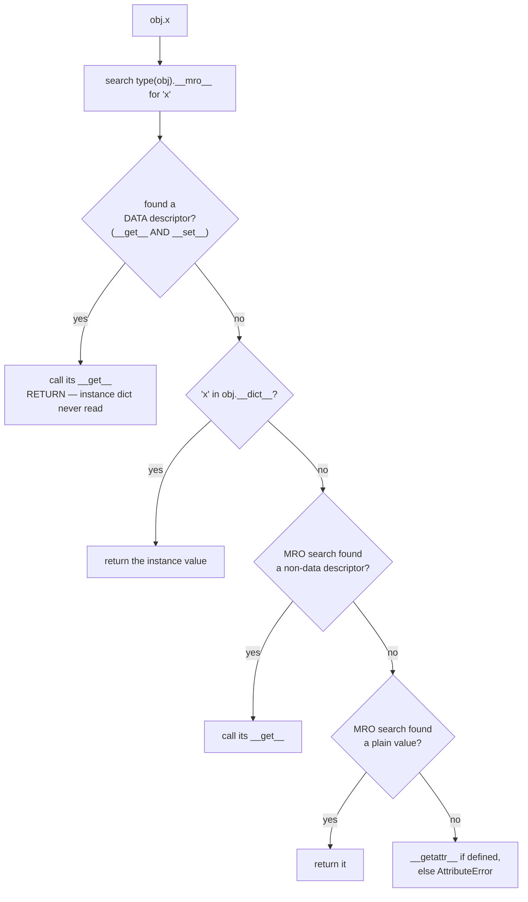

# The object model — what happens when you write `obj.x`

*Descriptors, the resolution order nobody recites correctly, and the broker standing between you and your own data.*

**Level:** L4–L5 · **Prerequisites:** none
**Syllabus:** [`PY-01`–`PY-05`](00_knowledge_graph.md) · **Roles:** DE ● FS ●
**Measurement:** `Measured` — CPython 3.14.6, arm64, 8 cores, macOS 26.5.2. Every number and every traceback below came out of a terminal on this machine. The one exception is the SQLAlchemy internals claim in §3.6, which is tagged `documented` inline because SQLAlchemy is not installed on this machine and I did not inspect it.

---

## 1. The thing you already do

Here is a shape you have written many times.

```python
# Gist: models.py
class Account:
    def __init__(self, owner: str, balance_cents: int):
        self.owner = owner
        self.balance_cents = balance_cents

    @property
    def balance(self) -> float:
        return self.balance_cents / 100

    @balance.setter
    def balance(self, value: float) -> None:
        self.balance_cents = round(value * 100)
```

And here is how it gets used, in an endpoint that looks like every endpoint you have shipped:

```python
# Gist: routes.py
@router.get("/accounts/{account_id}")
async def get_account(account_id: int, session: AsyncSession = Depends(get_session)):
    account = await session.get(Account, account_id)
    return {"owner": account.owner, "balance": account.balance}
```

Two attribute reads on the last line, written identically, doing completely different things. `account.owner` reads a string that was placed in a dictionary during `__init__`. `account.balance` calls a function, divides by a hundred, and returns a number that exists nowhere in memory until you ask for it.

Nothing in the syntax tells you which is which. That is the point of the design — the caller should not have to care whether `balance` is stored or computed, and you can change it from one to the other tomorrow without touching a single call site. This is the single most useful thing about Python's object model and you have been relying on it for years.

Now add the line that makes it a real application:

```python
account.balance = 250.00
```

That assignment does not store `250.00` anywhere. It runs a function, multiplies by a hundred, rounds, and writes an integer to a differently named attribute. An assignment statement — the most basic operation in the language — has been intercepted and rewritten by the class.

You use this. The question is what is doing it.

---

## 2. The questions you cannot answer about it

**What is `@property` actually?** Not what it does — what it *is*. It is not a keyword and it is not compiler magic; it is a plain built-in class that you could write yourself in about fifteen lines. If you can name the protocol it implements, you have the mechanism. If you cannot, you have a habit.

**What happens if you set `self.balance` in `__init__` and there is also a `balance` property?** Both live on the object. One of them wins. Most people guess that the instance wins, because "instance attributes shadow class attributes" is a rule everybody half-remembers. That rule is wrong more often than it is right, and knowing exactly when it is wrong is the difference between an L3 and an L4 answer.

**Why does `super()` work in multiple inheritance?** You have written `super().__init__(...)` a thousand times and you almost certainly believe it means "call my parent class." It does not. There is a hierarchy below where `super()` inside a class calls a method on a class that is not one of that class's base classes at all, and this is not a bug — it is the entire reason cooperative multiple inheritance functions.

**And the one that should bother you.** Add `__slots__` to a class and measure a million instances: total memory drops by **38 megabytes**. Then ask `sys.getsizeof` about a single instance of each and it reports the slotted one as **larger** — 56 bytes against 48.

The optimisation that saves 38 megabytes makes each object bigger, according to the function whose entire job is reporting how big objects are.

If you can answer all four cleanly, skip to §6 and rehearse. Otherwise, section 3 is where the answers are.

---

## 3. What the machine actually does

### 3.1 The analogy: a descriptor is a broker

Hold this image for the rest of the article. When you read `account.owner`, you are opening a drawer and taking out what is inside. When you read `account.balance`, there is a **broker** standing between you and the drawer. You ask for the value; the broker decides what you get, and may compute it, log it, validate it, fetch it from a database, or refuse.

The broker is called a **descriptor**, and the whole of this section is about where brokers stand, which ones outrank which, and how to tell that one is there at all — because from the call site, a broker is invisible.

### 3.2 Where attributes actually live

An ordinary object stores its attributes in a dictionary hanging off the instance. The class has its own, separate dictionary.

```python
# Gist: dicts.py
class Account:
    bank = "Sogebank"                     # class attribute
    def __init__(self, owner):
        self.owner = owner                # instance attribute

a = Account("alexandro")
print(a.__dict__)          # {'owner': 'alexandro'}
print(Account.__dict__['bank'])   # 'Sogebank'
print(a.bank)              # 'Sogebank'  — found on the class, not the instance
```

`a.bank` works even though `bank` is not in `a.__dict__`. Something walked from the instance to its class and found it there. That walk is the subject of this module, and it has more steps than almost anyone recites.

### 3.3 The resolution order, in full

When Python evaluates `obj.x`, it calls `type(obj).__getattribute__(obj, 'x')`. The default implementation does the following, in this exact order:

1. Walk the **MRO** of `type(obj)` looking for `'x'`. Remember what was found, if anything.
2. If what was found is a **data descriptor** — an object defining `__get__` *and* (`__set__` or `__delete__`) — call its `__get__` and **return immediately.** The instance dictionary is never consulted.
3. Otherwise, look in `obj.__dict__`. If `'x'` is there, return it.
4. Otherwise, fall back to what step 1 found. If it is a **non-data descriptor** — `__get__` only — call its `__get__`. If it is a plain value, return it.
5. If nothing was found anywhere, call `type(obj).__getattr__(obj, 'x')` if that exists. Otherwise raise `AttributeError`.



The half-remembered rule — "the instance shadows the class" — is step 3, and it is sandwiched between two steps that can beat it. **A data descriptor on the class outranks the instance dictionary.** That single fact explains why `@property` works at all, and it is the thing most people get backwards.

Here is the proof, run on this machine ([`PY-OBJ-01`, `PY-OBJ-02`](../MEASUREMENTS.md)):

```python
# Gist: m1_lookup_order.py
class Loud:
    def __get__(self, obj, objtype=None):
        return "DATA-DESCRIPTOR __get__"
    def __set__(self, obj, value):
        print(f"  DATA-DESCRIPTOR __set__ intercepted: {value!r}")
        obj.__dict__['x'] = value

class NonData:
    def __get__(self, obj, objtype=None):
        return "NON-DATA-DESCRIPTOR __get__"

class A:
    x = Loud()        # __get__ AND __set__  -> data descriptor
    y = NonData()     # __get__ only         -> non-data descriptor

a = A()
print("1. data descriptor wins even before any instance write:")
print("   a.x =", a.x)
print("\n2. write goes through __set__, which puts 'shadow' in the instance dict:")
a.x = "shadow"
print("   a.__dict__ =", a.__dict__)
print("   a.x =", a.x)
print("\n3. non-data descriptor: class wins until the instance dict has a value:")
print("   a.y =", a.y)
a.y = "shadow-y"
print("   after a.y = 'shadow-y':  a.y =", a.y)
print("   a.__dict__ =", a.__dict__)
```

```text
1. data descriptor wins even before any instance write:
   a.x = DATA-DESCRIPTOR __get__

2. write goes through __set__, which puts 'shadow' in the instance dict:
  DATA-DESCRIPTOR __set__ intercepted: 'shadow'
   a.__dict__ = {'x': 'shadow'}
   a.x = DATA-DESCRIPTOR __get__

3. non-data descriptor: class wins until the instance dict has a value:
   a.y = NON-DATA-DESCRIPTOR __get__
   after a.y = 'shadow-y':  a.y = shadow-y
   a.__dict__ = {'x': 'shadow', 'y': 'shadow-y'}
```

Look at what happened in part 2. The string `'shadow'` **is sitting in the instance dictionary** — you can see it printed — and reading `a.x` still returns the descriptor's value. The instance dictionary was not consulted, because the class held a data descriptor and step 2 returned before step 3 ever ran. The data is there and unreachable.

Part 3 is the contrast that proves the rule is about the descriptor *kind* and not about descriptors generally. `NonData` defines only `__get__`, so it loses to the instance dictionary the moment there is something in it.

This is why `@property` is reliable. `property` is a data descriptor:

```text
property has __get__: True  __set__: True
```

Because it defines both, no instance attribute can ever shadow it. That is not a coincidence — it is the reason `property` defines `__set__` even for read-only properties, where `__set__` exists only to raise `AttributeError`. Defining it is what buys precedence.

### 3.4 Every method you have ever written is a descriptor

The broker is not an exotic device you opt into. It is how ordinary methods work.

```python
# Gist: m3_mro.py (part 3)
class T:
    def method(self): pass

print("  T.__dict__['method']            =", T.__dict__['method'])
print("  has __get__?                    =", hasattr(T.__dict__['method'], '__get__'))
print("  has __set__?                    =", hasattr(T.__dict__['method'], '__set__'))
t = T()
print("  T.method (via class)            =", T.method)
print("  t.method (via instance, bound)  =", t.method)
print("  t.method.__self__ is t          =", t.method.__self__ is t)
print("  manual: T.__dict__['method'].__get__(t, T) ==", T.__dict__['method'].__get__(t, T))
```

```text
  T.__dict__['method']            = <function T.method at 0x10388b530>
  has __get__?                    = True
  has __set__?                    = False   <- non-data
  T.method (via class)            = <function T.method at 0x10388b530>
  t.method (via instance, bound)  = <bound method T.method of <__main__.T object at 0x103880590>>
  t.method.__self__ is t          = True
  manual: T.__dict__['method'].__get__(t, T) == <bound method T.method of <__main__.T object at 0x103880590>>
```

Read the third and fourth lines together. Accessed through the class, `method` is a plain function. Accessed through an instance, it is a **bound method** — a small object pairing the function with `t`. Nothing in your code performed that pairing. The function's own `__get__` did it, invoked by step 4 of the resolution order, and the last line shows you can call it by hand and get exactly the same result.

That is the entire mechanism of `self`. There is no special case in the interpreter for "calling a method on an object." Functions are non-data descriptors, and `__get__` returns a version of the function with the first argument pre-filled. `staticmethod` is a descriptor whose `__get__` returns the function *unmodified*; `classmethod` is one that binds the class instead of the instance. Three different behaviours, one protocol, no compiler support.

Being non-data descriptors is also load-bearing. Because functions define `__get__` but not `__set__`, an instance attribute can shadow a method — which is exactly what makes monkey-patching a single object possible.

### 3.5 The MRO, and why `super()` is not "call the parent"

With multiple inheritance, step 1's phrase "walk the MRO" starts doing real work. The MRO is a linearisation of the inheritance graph computed by the **C3 algorithm**, which guarantees three properties: a class always precedes its parents, the relative order of parents is preserved, and the result is monotonic — a subclass's MRO is consistent with every ancestor's.

```python
# Gist: m3_mro.py (part 1)
class Account:
    def describe(self): return "Account"
class Interest(Account):
    def describe(self): return "Interest -> " + super().describe()
class Fees(Account):
    def describe(self): return "Fees -> " + super().describe()
class Savings(Interest, Fees):
    def describe(self): return "Savings -> " + super().describe()

print("  MRO:", " -> ".join(c.__name__ for c in Savings.__mro__))
print("  Savings().describe():", Savings().describe())
print("  Interest.__bases__ =", tuple(c.__name__ for c in Interest.__bases__))
```

```text
  MRO: Savings -> Interest -> Fees -> Account -> object
  Savings().describe(): Savings -> Interest -> Fees -> Account
  Interest.__bases__ = ('Account',)
```

This is the result to sit with. Inside `Interest.describe`, the call `super().describe()` dispatched to **`Fees`** — and the last line confirms `Fees` is not one of `Interest`'s base classes ([`PY-OBJ-05`](../MEASUREMENTS.md)). `Interest` inherits only from `Account`.

So `super()` cannot mean "call my parent." What it means is *"call the next class after me in the MRO of the object I am actually operating on."* `Interest` was written without any knowledge that `Fees` exists, and at runtime it cooperated with it anyway, because the instance is a `Savings` and `Savings`'s MRO puts `Fees` after `Interest`.

That is what "cooperative" means in cooperative multiple inheritance, and it is why every method in such a hierarchy must call `super()` — one class that skips the call breaks the chain for every class after it. It is also why `Account.describe` runs exactly once rather than twice despite two paths reaching it: the MRO is a linear list, and each class appears in it once.

When no consistent linearisation exists, C3 refuses at class-creation time:

```python
class X: pass
class Y: pass
class A(X, Y): pass
class B(Y, X): pass
class C(A, B): pass
```

```text
  TypeError: Cannot create a consistent method resolution order (MRO) for bases X, Y
```

`A` requires `X` before `Y`; `B` requires `Y` before `X`. No single ordering satisfies both, so the error arrives at import time rather than as mysterious dispatch behaviour in production. This is one of the few places where Python chooses to fail loudly and early, and it is worth knowing that the failure is C3 doing its job rather than a defect.

### 3.6 What this buys you in the frameworks you already use

The broker pattern is the foundation the tools on your CV are built on.

When you write a SQLAlchemy model and read `account.owner`, you are not reading a stored string. You are going through an instrumented attribute that tracks whether the value has been modified, participates in the unit-of-work change detection, and can trigger a lazy load of a relationship that has not been fetched. `account.transactions` firing a `SELECT` at the moment of attribute access — the mechanism behind the N+1 problem — is a descriptor's `__get__` running a query. *(`documented` — SQLAlchemy is not installed on this machine and I did not inspect its source. The mechanism is descriptor-based; the specific class names are from documentation.)*

Rather than assert it, here is the same idea built from scratch, which is the honest way to demonstrate a mechanism you have not inspected:

```python
# Gist: lazy_descriptor.py
class LazyColumn:
    """A data descriptor that loads on first access and caches on the instance."""
    def __set_name__(self, owner, name):
        self.name = name                       # told our own attribute name at class creation

    def __get__(self, obj, objtype=None):
        if obj is None:
            return self                        # accessed on the class, not an instance
        cache = obj.__dict__.setdefault('_loaded', {})
        if self.name not in cache:
            print(f"    SELECT {self.name} FROM accounts WHERE id = {obj.id}")
            cache[self.name] = f"<{self.name} for {obj.id}>"
        return cache[self.name]

    def __set__(self, obj, value):
        obj.__dict__.setdefault('_loaded', {})[self.name] = value

class Account:
    transactions = LazyColumn()
    def __init__(self, id): self.id = id

a = Account(7)
print("  first read: ", a.transactions)
print("  second read:", a.transactions)
```

```text
    SELECT transactions FROM accounts WHERE id = 7
  first read:  <transactions for 7>
  second read: <transactions for 7>
```

Thirty lines, and it has the essential behaviour: reading an attribute issues a query the first time and is free thereafter. Put that read inside a loop over fifty accounts and you have written an N+1 without typing the word `SELECT` once. **The descriptor is why the N+1 problem is invisible at the call site** — the code that triggers fifty queries looks exactly like the code that triggers none.

`__set_name__` in that listing is worth noticing. Python calls it automatically at class-creation time, handing the descriptor the name it was assigned to. Before it existed you had to repeat the name — `transactions = LazyColumn('transactions')` — or reach for a metaclass. It is the modern answer to a whole category of problem that used to require one.

### 3.7 The write path is a different, shorter cascade

Everything so far has been about reading. Assignment goes through a **separate** hook, `__setattr__`, and its cascade has three steps rather than five:

1. Search the MRO for the name. If what is found is a data descriptor, call its `__set__` and stop.
2. Otherwise, write into `obj.__dict__`.
3. If the object has no `__dict__` — because of `__slots__` — raise `AttributeError`.

The asymmetry matters. **A non-data descriptor has no say in writes at all**, which is precisely why a method can be shadowed by an instance attribute while a property cannot. The read path consults non-data descriptors; the write path does not know they exist.

This is what makes validation-on-assignment work ([`PY-OBJ-16`](../MEASUREMENTS.md)):

```python
# Gist: m5_writepath.py
class Audited:
    def __set_name__(self, owner, name): self.name = '_' + name
    def __get__(self, obj, objtype=None):
        return self if obj is None else getattr(obj, self.name, 0)
    def __set__(self, obj, value):
        if value < 0:
            raise ValueError(f"balance cannot be negative, got {value}")
        print(f"    __set__ validated {value}")
        setattr(obj, self.name, value)

class Account:
    balance = Audited()

a = Account()
a.balance = 100
print("  a.balance =", a.balance)
a.balance = -5
```

```text
    __set__ validated 100
  a.balance = 100
  ValueError: balance cannot be negative, got -5
```

A plain assignment statement raised a domain error. For a balance field that is exactly what you want, and note that it is enforced against **every** writer — including the migration script and the person poking at the object in a REPL — in a way an application-layer check never is. This is the same argument as a database `CHECK` constraint, applied one layer up.

### 3.8 Classes are objects, and `__init_subclass__` is usually enough

A class is itself an instance of something. That something is `type`.

```text
  type(Account)        = <class 'type'>
  type(type(Account))  = <class 'type'>
  type('Made', (), {'x': 1}) -> <class '__main__.Made'> with x = 1
```

`type` is its own type, which is where the recursion stops. And the last line shows that `class` is not required to make a class — `type(name, bases, namespace)` builds one directly, which is exactly what the `class` statement compiles down to. A **metaclass** is simply a subclass of `type` that customises this construction.

Metaclasses have a reputation for being the tool you reach for when you want to react to class creation. Since Python 3.6 they usually are not, because `__init_subclass__` covers the common case without any of the cost ([`PY-OBJ-17`](../MEASUREMENTS.md)):

```python
# Gist: m5_writepath.py (part 2)
class Handler:
    registry = {}
    def __init_subclass__(cls, /, event=None, **kw):
        super().__init_subclass__(**kw)
        if event is None:
            raise TypeError(f"{cls.__name__} must declare event=")
        Handler.registry[event] = cls
        print(f"    registered {cls.__name__} for {event!r}")

class OnDeposit(Handler, event="deposit"): pass
class OnWithdraw(Handler, event="withdraw"): pass
class Broken(Handler): pass
```

```text
    registered OnDeposit for 'deposit'
    registered OnWithdraw for 'withdraw'
  registry: {'deposit': 'OnDeposit', 'withdraw': 'OnWithdraw'}
  TypeError: Broken must declare event=
```

Every subclass registered itself automatically, and one that omitted the required argument failed **at import time** rather than at first use. No metaclass, no conflict risk, and the keyword argument in the class header (`event="deposit"`) is passed straight through.

The rule worth carrying: `__init_subclass__` lets you *react* to a class being created, and `__set_name__` lets a descriptor learn its own name. Between them they cover most of what metaclasses were historically used for. A metaclass earns its place only when you need to change how the class is *constructed* — altering the namespace, the bases, or the type itself — rather than merely responding to it having been constructed.

---

## 4. Break it on purpose

### 4.1 The shared mutable class attribute

The classic, and it survives code review because it looks like a type annotation.

```python
# Gist: m4_breaks.py (failure 1)
class Account:
    transactions = []                      # ONE list, on the class
    def __init__(self, owner): self.owner = owner
    def deposit(self, amt): self.transactions.append(amt)

a, b = Account("alexandro"), Account("someone else")
a.deposit(100)
print(f"  a.deposit(100) -> b.transactions = {b.transactions}")
print(f"  a.transactions is b.transactions = {a.transactions is b.transactions}")
print(f"  'transactions' in a.__dict__     = {'transactions' in a.__dict__}")
a.transactions = [999]
print(f"  after a.transactions = [999]: a={a.transactions}  b={b.transactions}")
print(f"  'transactions' in a.__dict__     = {'transactions' in a.__dict__}")
```

```text
  a.deposit(100) -> b.transactions = [100]
  a.transactions is b.transactions = True
  'transactions' in a.__dict__     = False

  after a.transactions = [999]: a=[999]  b=[100]
  'transactions' in a.__dict__     = True  <- now it shadows
```

One account's deposit appeared in another account's history ([`PY-OBJ-11`](../MEASUREMENTS.md)). In a banking system that is the worst class of bug there is — silent cross-contamination between customers.

Section 3.3 predicted it exactly. `self.transactions.append(amt)` is a *read* followed by a mutation. The read walks the MRO, finds one list on the class, and mutates it in place; nothing is ever written to the instance dictionary, which the third line confirms. Every instance shares one object.

The second half is the part that makes this genuinely confusing to debug. **Rebinding** behaves completely differently from **mutating**. `a.transactions = [999]` goes through step 3 territory and creates a real instance entry, and from that moment `a` is fixed while `b` is still broken. So a developer "fixing" the bug by assigning in one place makes the symptom disappear for the object they tested and leaves it live everywhere else.

The fix is to assign in `__init__` so each instance gets its own list. The cost is nothing — this is a pure defect.

### 4.2 `__getattr__` is not `__getattribute__`, and the difference is a crash

Two hooks, one letter apart, doing utterly different things.

```python
# Gist: m4_breaks.py (failures 2 and 3)
class Lazy:
    def __init__(self): self.real = "present"
    def __getattr__(self, name):
        print(f"    __getattr__ called for {name!r}")
        return f"<generated {name}>"

l = Lazy()
print("  l.real    ->", l.real)
print("  l.missing ->", l.missing)

class Broken:
    def __init__(self): self.x = 1
    def __getattribute__(self, name):
        return self.__dict__[name]
try:
    Broken().x
except RecursionError as e:
    print(f"  RecursionError: {str(e)[:60]}")
```

```text
  l.real    -> present    (no __getattr__ call: found normally)
    __getattr__ called for 'missing'
  l.missing -> <generated missing>

  RecursionError: maximum recursion depth exceeded
```

`__getattr__` is step 5 — the fallback, invoked **only after normal lookup has failed**. That is why `l.real` never printed anything: it was found normally and the hook was never consulted. This makes `__getattr__` cheap and safe, and it is the right tool for proxies and lazy loaders.

`__getattribute__` is step 0 — it intercepts **every** attribute access, without exception. Including the ones inside itself. `self.__dict__` is an attribute access, so it re-enters `__getattribute__`, which evaluates `self.__dict__` again, forever. The fix is `object.__getattribute__(self, name)`, which calls the default implementation directly and does not re-enter.

**Run this one yourself.** The recursion is worth watching, because the lesson generalises: any hook that intercepts a primitive operation must avoid using that operation inside itself, and this is the same class of mistake as calling `__repr__` from inside `__repr__`.

### 4.3 `sys.getsizeof` reports the optimisation backwards

This is the counterintuitive result from §2, and it is the best of the four.

```python
# Gist: m2_slots.py
class Plain:
    def __init__(self, id, balance, currency):
        self.id, self.balance, self.currency = id, balance, currency

class Slotted:
    __slots__ = ('id', 'balance', 'currency')
    def __init__(self, id, balance, currency):
        self.id, self.balance, self.currency = id, balance, currency

N = 1_000_000
for cls in (Plain, Slotted):
    tracemalloc.start()
    objs = [cls(i, i * 1.5, "HTG") for i in range(N)]
    current, peak = tracemalloc.get_traced_memory()
    tracemalloc.stop()
    print(f"{cls.__name__:8} {N:,} instances: {current/1024/1024:7.1f} MB  "
          f"({current/N:5.1f} bytes/instance)")
    del objs
```

```text
Plain    1,000,000 instances:   153.0 MB  (160.4 bytes/instance)
Slotted  1,000,000 instances:   114.9 MB  (120.4 bytes/instance)

sys.getsizeof(instance):  Plain=48  Slotted=56
instance __dict__:        Plain=96 bytes   Slotted=AttributeError: 'Slotted' object has no attribute '__dict__'

10M attribute reads:  Plain=0.157s   Slotted=0.083s   (+89.5% for slots)
```

Three results, and the middle one contradicts the other two.

A million instances went from **153.0 MB to 114.9 MB** ([`PY-OBJ-07`](../MEASUREMENTS.md)) — 40 bytes saved per instance, 38 megabytes total. Attribute reads went from **0.157s to 0.083s** for ten million reads, which is **1.9× faster** ([`PY-OBJ-08`](../MEASUREMENTS.md)). And `sys.getsizeof` says the slotted instance is *bigger*: 56 bytes against 48 ([`PY-OBJ-09`](../MEASUREMENTS.md)).

`getsizeof` is not lying, it is answering a narrower question than the one being asked. It reports the size of the object itself and **does not follow references**. The plain instance is 48 bytes plus a separate 96-byte dictionary allocated elsewhere; `getsizeof` sees only the 48. The slotted instance is 56 bytes with the three values stored inline in that allocation — nothing separate to miss.

So the plain object's real footprint is 48 + 96 = 144 bytes across two allocations, and the slotted one is 56 bytes in one. `tracemalloc`, which tracks actual allocation, sees the truth; `getsizeof`, which measures one object, does not.

The speed result comes from the same change. A plain attribute read hashes a string and probes a dictionary. A slotted read is a member descriptor — a data descriptor, generated by `__slots__` — reading a fixed offset in the object's own memory. The dictionary is not merely smaller; it is gone.

**The lesson to carry:** `sys.getsizeof` is the wrong tool for any object that owns references, which is nearly all of them. Use `tracemalloc` for real questions about memory.

### 4.4 The three costs, and the one that is silent

`__slots__` is not free, and the third cost is the one that ruins the optimisation without telling you.

```text
  1. no dynamic attributes -> AttributeError: 'Slotted' object has no attribute 'nickname'
     and no __dict__ for setting new attributes
  2. no weakref by default -> TypeError: cannot create weak reference to 'Slotted' object
  3. a subclass without __slots__ silently regains a __dict__: {'anything': 1}
```

The first is usually a benefit disguised as a cost:

```text
  NoSlots:   n.balnace = 500 accepted silently. n.balance is still 0
  WithSlots: AttributeError: 'WithSlots' object has no attribute 'balnace'
```

A typo'd attribute name on an ordinary class is accepted in silence and creates a new attribute nobody reads. On a slotted class it is an immediate error. For a class modelling money, that alone can justify the decision.

The second matters if anything caches these objects by weak reference — a `WeakValueDictionary` cache will simply refuse them. Adding `'__weakref__'` to the slots tuple restores it, at the cost of a pointer.

The third is the trap. **A subclass that does not itself declare `__slots__` gets a `__dict__` back**, and every instance of that subclass pays the full dictionary cost again. The memory win evaporates and nothing warns you, because the parent still looks optimised. If you use `__slots__`, every class in the hierarchy must declare it.

---

## 5. The judgment call

### The options, honestly costed

| Approach | Use when | Because | Real cost |
|---|---|---|---|
| **Plain attribute** | The value is stored and needs no computation or validation | Nothing to gain from indirection; a read is one dict probe | Changing to computed later is a source change, though not an API change |
| **`@property`** | The value is derived, or a write must be validated or transformed | Data descriptor, so it cannot be shadowed; the call site never changes | A function call per access — ~2× a plain read; hides work at what looks like a free operation |
| **Custom descriptor** | The same access logic repeats across several attributes or classes | Written once, applied by assignment; `__set_name__` gives it its own name | Real indirection cost in comprehension — a reader must find the descriptor class to know what an attribute does |
| **`__getattr__`** | Attributes are genuinely dynamic — a proxy, a lazy config object | Only fires on failure, so normal access is unaffected | Typos become successful calls; breaks IDE completion and `dir()` |
| **`__getattribute__`** | Almost never | Intercepts everything | Slows every access on the class, recursion hazards, and a hard debugging surface |
| **`__slots__`** | Many instances of a small fixed-shape class | Measured 38 MB per million and 1.9× faster reads | No dynamic attributes, no weakref unless declared, and silently defeated by an unslotted subclass |

### When you would not do this

**Do not reach for `__slots__` by default.** The measured win was on a million instances. For the few hundred objects a typical request handles, 40 bytes each is nothing, and you have bought yourself a rigidity that will surprise the next person who tries to attach a debugging attribute. It earns its place in one situation: a small class instantiated in enormous quantities — a row object in a parsing loop, a point in a simulation. Everywhere else it is premature.

**Do not write a custom descriptor where a property does.** A descriptor is the right tool when the logic repeats across many attributes; below three or four uses, a property is more readable and every Python developer already knows it. The indirection tax is paid by every future reader, and it is easy to underestimate when you are the one who wrote it.

**Be careful about putting expensive work behind a property.** The reason properties are pleasant is that they look like attribute access. That is also the reason they are dangerous: nothing at the call site says `account.balance` might hit a database, and a property that does so inside a loop is the N+1 problem with better manners. The rule I would defend is that a property may compute but should not perform I/O — if it queries, make it a method, so the call site shows parentheses and the reader knows something happens.

**Prefer composition to deep multiple inheritance.** Cooperative multiple inheritance works, and section 3.5 shows it working correctly through a diamond. But it requires every class in the hierarchy to call `super()`, which is a discipline no linter enforces and one contributor can break. Mixins that add orthogonal behaviour are fine. Hierarchies where the MRO has to be drawn on a whiteboard to be understood are a design that has outgrown the tool.

---

## 6. Interview angles

**"How does `@property` work?"**

> It's a descriptor — that's the whole answer, and everything else follows from it. `property` is just a class that implements `__get__`, `__set__` and `__delete__`, and when Python looks up an attribute it checks the type's MRO first. If what it finds there defines both `__get__` and `__set__` — a data descriptor — it calls that and returns immediately, without ever looking in the instance dictionary. That's why a property can't be accidentally shadowed by an instance attribute of the same name. And it's actually why `property` defines `__set__` even for read-only properties, where all `__set__` does is raise `AttributeError` — defining it is what buys the precedence. The thing I'd add is that this isn't a special feature bolted on for properties. Plain methods are descriptors too, just non-data ones, with only `__get__` — and that's the entire mechanism behind `self`. When you access a method through an instance, the function's `__get__` returns a bound method with the first argument pre-filled. There's no special case in the interpreter for calling a method on an object; it's the same protocol.

**"What does `super()` do?"**

> Not what the name suggests, and this is one I got wrong for years. It doesn't call the parent class — it calls the next class after the current one in the MRO of the *instance you're actually operating on*, which can be a class the current one has never heard of. I set up a diamond to check: an `Interest` class and a `Fees` class both inheriting from `Account`, and a `Savings` inheriting from both. Inside `Interest.describe`, `super().describe()` dispatched to `Fees` — and `Fees` isn't one of `Interest`'s bases, `Interest` only inherits from `Account`. That's not a bug, it's the entire point: it's what lets classes cooperate when they were written without knowing about each other. The practical consequence is that in a hierarchy like that, every method has to call `super()`. One class that handles its bit and returns without calling breaks the chain for everything after it, and nothing warns you. Which is also my honest argument for keeping inheritance shallow — it works, but it depends on a discipline no linter checks.

**"Your API got slow after a change nobody thinks is related. Walk me through how you'd find it."**

> The first thing I'd want is the query count, not the timing, because the shape I'd suspect is N+1 and it doesn't look like anything in the code. In SQLAlchemy the lazy-loading attribute is a descriptor, so `account.transactions` inside a loop issues a query per iteration, and the call site looks identical to reading a plain field — there's no parenthesis, no `await`, nothing that says I/O happens here. So I'd turn on query echo and count. If fifty accounts produce fifty-one queries, that's the answer, and the fix is eager loading. I actually built a toy version of that descriptor to convince myself — thirty lines, caches on the instance, prints a fake `SELECT` on first access — and watching it fire once per loop iteration made it obvious in a way reading about it never did. The general lesson I took from it is that attribute access in an ORM is not free and doesn't advertise itself, which is why I'd rather a method that hits the database have parentheses on it than be a property.

**"Have you ever written a metaclass?"**

> No, and I'd want to be straight about that rather than dress it up — I've never had a problem that needed one. But I can tell you what they are and where they're running in code I use every day. A class is an instance of `type`, and `type(name, bases, namespace)` will build you one directly — that's literally what the `class` statement compiles to — so a metaclass is just a subclass of `type` that customises that construction. SQLAlchemy's declarative base does this: it walks the class body at creation time, finds the `Mapped` attributes, and wires up the mapping. Pydantic's model machinery is the same shape. I should flag that I'm going on documentation for those two specifically — I haven't read their source — but the mechanism is descriptor-and-metaclass and I've built small versions of both to check I actually understood it. The more useful half of my answer is that since 3.6 you usually don't need one. `__init_subclass__` handles reacting to subclass creation, and `__set_name__` tells a descriptor its own name. I wrote a registry with `__init_subclass__` that rejects a subclass missing its `event=` argument at import time — `TypeError: Broken must declare event=` — and that's the case people historically reached for a metaclass to solve. I'd keep the metaclass for when you genuinely need to change how the class is built, not just respond to it having been built.

**"When would you use `__slots__`?"**

> When there are a lot of instances of a small class with a fixed shape, and I'd want a measurement before committing. I ran a million instances of a three-field class on Python 3.14 here: 153 megabytes without slots, 115 with — about 40 bytes each — and attribute reads went from 0.157 seconds to 0.083 for ten million, so a bit under twice as fast. The reason for both is that the per-instance dictionary disappears and the values sit at fixed offsets behind generated descriptors. The thing that surprised me is that `sys.getsizeof` reports the slotted instance as *larger*, 56 bytes against 48, because it doesn't follow references — it never sees the plain object's separate 96-byte dict. So `getsizeof` says the optimisation made things worse while `tracemalloc` says it saved 38 megabytes, and `tracemalloc` is the one answering the actual question. As for when I wouldn't: anything where instances are counted in hundreds. The three costs are no dynamic attributes, no weak references unless you declare `__weakref__`, and the nasty one — a subclass that doesn't declare `__slots__` silently gets its dictionary back and you lose the whole benefit with no warning.

---

## 7. To add to `RECALL.md`

- `obj.x` order: **data descriptor → instance `__dict__` → non-data descriptor → class attr → `__getattr__`**
- Data descriptor = `__get__` **and** `__set__`/`__delete__`. It **beats the instance dict** — that is why `@property` cannot be shadowed
- Read-only properties still define `__set__` (to raise) — **defining it is what buys precedence**
- Plain functions are **non-data** descriptors; `__get__` returns a bound method. **That is the entire mechanism of `self`**
- `staticmethod` returns the function unchanged, `classmethod` binds the class — same protocol, three behaviours
- `super()` = **next class in the MRO of the instance**, not the parent. Measured: `Interest`'s `super()` dispatched to `Fees`, not a base of `Interest`
- Cooperative MI requires **every** class to call `super()`; one omission breaks the chain silently
- C3 fails loudly at class creation: `TypeError: Cannot create a consistent method resolution order`
- Class-level mutable + `self.x.append()` = **shared across all instances**; rebinding fixes one instance and hides the bug
- `__getattr__` = fallback, only on failure. `__getattribute__` = **every** access; `self.__dict__` inside it → `RecursionError`
- `__slots__` measured on 3.14/8-core: **153.0 MB → 114.9 MB** per million, reads **0.157s → 0.083s (1.9×)**
- **`sys.getsizeof` says slotted is bigger (56 vs 48)** — it does not follow references and misses the plain object's separate 96-byte dict
- Three `__slots__` costs: no dynamic attrs, no weakref unless declared, and **an unslotted subclass silently regains `__dict__`**
- `__set_name__` gives a descriptor its own attribute name at class creation — the modern replacement for a metaclass in this case
- The **write** path is separate and shorter: data descriptor `__set__` → `obj.__dict__` → `AttributeError`. **Non-data descriptors have no say in writes** — which is exactly why a method can be shadowed and a property cannot
- A descriptor's `__set__` can reject a plain assignment (`a.balance = -5` → `ValueError`), enforced against **every** writer including migrations and the REPL — the `CHECK` constraint argument, one layer up
- A class is an instance of `type`; **`type` is its own type**. `type(name, bases, ns)` builds a class directly — that is what `class` compiles to
- A **metaclass** is a subclass of `type` customising class *construction*. SQLAlchemy's declarative base and Pydantic's models are metaclasses *(documented — not inspected)*
- `__init_subclass__` registers subclasses and can reject a bad one **at import time**; prefer it over a metaclass unless you must change how the class is *built*, not just react to it

---

← [Python knowledge graph](00_knowledge_graph.md) · [repo index](../README.md) · [measurement ledger](../MEASUREMENTS.md)
