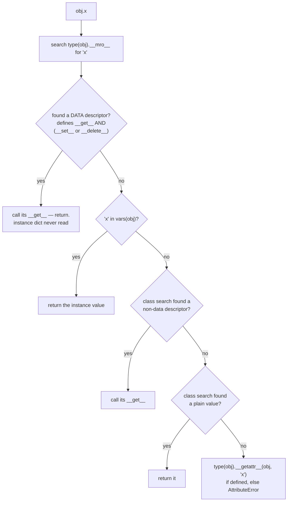
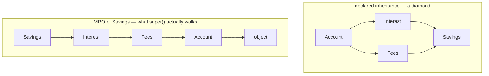

# The object model — what happens when you write `obj.x`

*The resolution order the language documents precisely, the broker standing between a program and its own data, and the C3 algorithm that keeps multiple inheritance from becoming a guessing game.*

**Level:** L5 · **Prerequisites:** none
**Covers:** PY-01
**Sources:** Ramalho, *Fluent Python* 2nd ed. ch.11, 13, 22–24 (2022) · Beazley, *Advanced Python Mastery* §3–4 (2024) · Wilson, *Software Design by Example*, ch. "Objects and Classes" (2026) · Python descriptor HowTo guide, docs.python.org · PEP 412 (2011) · PEP 487 (2016) · "The Python 2.3 Method Resolution Order," docs.python.org

---

## 1. The problem this solves

Here is a class with two attributes that look identical from the outside.

```python
class Account:
    def __init__(self, owner: str, balance_cents: int):
        self.owner = owner
        self.balance_cents = balance_cents

    @property
    def balance(self) -> float:
        return self.balance_cents / 100

    @balance.setter
    def balance(self, value: float) -> None:
        self.balance_cents = round(value * 100)
```

And here is the line that uses it:

```python
account = Account("alexandro", 5000)
print(account.owner, account.balance)
```

Both `account.owner` and `account.balance` are read with the same syntax — a dot and a name, no parentheses, no visible function call. But `account.owner` retrieves a string that has been sitting in a dictionary since `__init__` ran, and `account.balance` runs a function, divides an integer by a hundred, and produces a float that did not exist anywhere in memory a moment before. Nothing at the call site distinguishes the two. That is deliberate: the caller should never have to know or care whether an attribute is stored or computed, and the class should be free to change one into the other without breaking anyone who reads `account.balance`.

Now add the line that makes this a program instead of a demonstration:

```python
account.balance = 75.50
```

This is an assignment statement — the same statement that, for `account.owner`, would simply overwrite a dictionary entry. For `account.balance` it does something else entirely: it calls a setter function, multiplies by a hundred, rounds to the nearest cent, and writes an integer into `balance_cents`, a name that does not appear anywhere in the assignment. The most basic operation the language has — `name.attribute = value` — has been intercepted and given different behavior by the class definition, and the intercepting mechanism is invisible from where the assignment is written.

Every working Python programmer uses this transparently, usually without asking what makes it possible. The question matters for reasons beyond curiosity. The interception mechanism behind `@property` is the same mechanism an object-relational mapper uses to turn `account.transactions` into a database query, the same one a validation library uses to reject a negative balance before it is ever stored, and the same one that decides — in a class using multiple inheritance — which of several same-named methods actually runs when `super()` is called. Get the mechanism wrong and three unrelated-looking bugs turn out to share one cause: a shared mutable list silently visible to every instance of a class, a `RecursionError` from a method that looks like a two-line optimization, and a memory-saving change that produces object sizes going in the wrong direction when measured with the wrong tool.

There is also a narrower, more immediate reason to know this precisely rather than approximately. "Instance attributes shadow class attributes" is the rule most Python programmers can state, and it is the rule that gives the wrong answer whenever a class attribute happens to be a `property`, a method, or any other object implementing the **descriptor protocol** — which, as this chapter shows, includes nearly everything a class body defines. The rule is not so much wrong as incomplete: it describes one case of a five-step lookup procedure and omits the two steps that outrank it. This chapter builds that procedure from the ground up, in the order Python actually performs it, using CPython's own reference documentation as the primary source rather than a paraphrase of it — because the procedure is exact, the language's own guide already states it exactly, and every quantity in the sections that follow is either something the code demonstrably does or something a numbered source explicitly claims.

---

## 2. The mechanism, built up

### 2.1 Two dictionaries, not one

The smallest version of the puzzle from section 1 has nothing to do with descriptors yet. It is about where attributes actually live.

```python
class Account:
    bank = "Sogebank"                 # lives on the class
    def __init__(self, owner):
        self.owner = owner            # lives on the instance

a = Account("alexandro")
print(a.__dict__)                     # {'owner': 'alexandro'}
print(Account.__dict__['bank'])       # 'Sogebank'
print(a.bank)                         # 'Sogebank' — found on the class, not on a
```

An ordinary instance keeps its own attributes in a dictionary reachable as `a.__dict__`, populated one key at a time by every `self.x = ...` that has run. The class keeps a separate dictionary of its own, holding everything defined in the class body. `a.bank` returns `'Sogebank'` even though `'bank'` is not a key in `a.__dict__` at all — something walked from the instance to its class and found the name there. That walk, in full, is the subject of this chapter, and it has more steps than the phrase "instance attributes shadow class attributes" suggests.

Since Python 3.6, that walk has been cheaper than it looks. **PEP 412** gave CPython "key-sharing dictionaries": when several instances of the same class hold the same attribute names, their `__dict__` objects share one table of keys and store only their own values, rather than each instance paying for a full hash table of its own. PEP 412 reports that this reduced memory use by "10% to 20%" for typical object-oriented programs, with no measurable cost elsewhere. The two-dictionary picture above is still accurate; it is simply cheaper in practice than a hash table per instance would suggest, and only for instances of the same class that assign attributes in the same order in `__init__` — a dictionary that diverges from its class's shared layout falls back to a private table.

### 2.2 A property is a broker, not a keyword

Extend the example by one dimension: give the class a computed attribute.

```python
class Account:
    def __init__(self, owner, balance_cents):
        self.owner = owner
        self.balance_cents = balance_cents

    @property
    def balance(self):
        return self.balance_cents / 100

    @balance.setter
    def balance(self, value):
        self.balance_cents = round(value * 100)

a = Account("alexandro", 5000)
print(a.balance)            # 50.0
a.balance = 75.50
print(a.balance_cents)      # 7550
print(a.__dict__)           # {'owner': 'alexandro', 'balance_cents': 7550}
```

Two things are worth pausing on. First, `'balance'` never appears as a key in `a.__dict__` — reading and writing `a.balance` never touches the instance dictionary at all, only `balance_cents` does. Second, `property` is not special syntax. It is an ordinary built-in class, and `vars(Account)['balance']` is a plain object of that class sitting in the class dictionary, the same place `bank` sat in the previous example. Checking what that object supports explains everything that follows:

```python
prop = vars(Account)['balance']
print(hasattr(prop, '__get__'))   # True
print(hasattr(prop, '__set__'))   # True
```

An object that defines `__get__` is called a **descriptor**. When Python finds a descriptor sitting in a class's dictionary at the name being looked up, it does not return the descriptor object itself — it calls the descriptor's `__get__` method and returns whatever that call produces. This is the entire mechanism of `@property`, and — as section 2.4 shows — of an ordinary bound method as well. Hold one image for the rest of this chapter: a descriptor is a **broker** standing between the dot in `a.balance` and whatever value eventually comes back. Reading an ordinary attribute opens a drawer. Reading a descriptor asks a broker, and the broker decides what happens.

### 2.3 The lookup order, from the language's own reference implementation

Python's descriptor HowTo guide — the language's own documentation, not a third party's paraphrase of it — gives a pure-Python function that reproduces exactly what `object.__getattribute__` does in C. It is short enough to read in full:

```python
def object_getattribute(obj, name):
    "Emulate PyObject_GenericGetAttr() in Objects/object.c"
    null = object()
    objtype = type(obj)
    cls_var = find_name_in_mro(objtype, name, null)
    descr_get = getattr(type(cls_var), '__get__', null)
    if descr_get is not null:
        if (hasattr(type(cls_var), '__set__')
            or hasattr(type(cls_var), '__delete__')):
            return descr_get(cls_var, obj, objtype)     # data descriptor
    if hasattr(obj, '__dict__') and name in vars(obj):
        return vars(obj)[name]                          # instance variable
    if descr_get is not null:
        return descr_get(cls_var, obj, objtype)         # non-data descriptor
    if cls_var is not null:
        return cls_var                                  # class variable
    raise AttributeError(name)
```

Read as prose, this is: search the type's MRO for the name first, before looking anywhere on the instance. If what was found defines `__get__` **and** either `__set__` or `__delete__` — a **data descriptor** — call it immediately and return, without ever consulting the instance dictionary. Otherwise, check the instance dictionary and return its value if the name is there. Otherwise, if the class search found something with only `__get__` — a **non-data descriptor** — call that. Otherwise return the plain class-level value that was found. And only if none of that produced anything does Python fall back to `__getattr__`, a separate hook that is not part of `object.__getattribute__` at all and is covered in section 3.



The familiar shorthand — "the instance shadows the class" — is the third box in that chain, and it is sandwiched between two boxes that can beat it to the return statement. A data descriptor found on the class wins *before* the instance dictionary is even examined. That single fact is the whole explanation for why `@property` cannot be silently overridden by assigning to the instance, and it is the detail the half-remembered rule leaves out.

Here is the distinction running, with a data descriptor and a non-data descriptor built by hand so both branches are visible:

```python
class Loud:
    def __get__(self, obj, objtype=None):
        return "DATA-DESCRIPTOR __get__"
    def __set__(self, obj, value):
        obj.__dict__['x'] = value

class Quiet:
    def __get__(self, obj, objtype=None):
        return "NON-DATA-DESCRIPTOR __get__"

class A:
    x = Loud()
    y = Quiet()

a = A()
print(a.x)                 # DATA-DESCRIPTOR __get__
a.x = "shadow"
print(a.__dict__)          # {'x': 'shadow'}
print(a.x)                 # DATA-DESCRIPTOR __get__   <- unchanged

print(a.y)                 # NON-DATA-DESCRIPTOR __get__
a.y = "shadow-y"
print(a.__dict__)          # {'x': 'shadow', 'y': 'shadow-y'}
print(a.y)                 # shadow-y                  <- now the instance value
```

Trace what happens on the line `print(a.x)` immediately after `a.x = "shadow"`. The string `"shadow"` is sitting in `a.__dict__` at that point — the printed dictionary proves it. And yet reading `a.x` still returns `"DATA-DESCRIPTOR __get__"`. The instance dictionary was never consulted, because the diagram's second box already returned before the third box could run: `Loud` defines both `__get__` and `__set__`, so it is a data descriptor, and a data descriptor's `__get__` is called unconditionally. The data the assignment wrote is real, present, and permanently unreachable through `a.x`.

`Quiet` is the contrast that proves the rule is about the descriptor's *kind*, not about descriptors as a category. It defines only `__get__`, so it is non-data, and the moment `a.__dict__` holds a `'y'` entry, that entry wins — exactly the behavior the half-remembered rule predicts, but only because this particular descriptor happens to be non-data. `property` is reliable specifically because it is not: `hasattr(property, '__set__')` is `True` even for a read-only property, where the setter's only job is to raise `AttributeError` with a message naming the missing setter. Defining `__set__` at all — regardless of what it does — is what buys precedence over the instance dictionary.

### 2.4 Every method is a descriptor, and that is the entire mechanism of `self`

The broker pattern is not a special case reserved for `@property`. It is how an ordinary method call works.

```python
class T:
    def method(self):
        return "called"

print(T.__dict__['method'])           # <function T.method at 0x...>
print(hasattr(T.__dict__['method'], '__get__'))   # True
print(hasattr(T.__dict__['method'], '__set__'))   # False

t = T()
print(T.method)                        # <function T.method at 0x...>  (same object)
print(t.method)                        # <bound method T.method of <__main__.T object at 0x...>>
print(t.method.__self__ is t)          # True
```

Read the last three lines together. `T.method`, accessed through the class, is a plain function — exactly what the class dictionary contains. `t.method`, accessed through an instance, is a different kind of object: a **bound method**, which the printed repr shows pairs the function with the specific instance `t`. Nothing in the class body performed that pairing explicitly. It happened because a function object is itself a non-data descriptor — it defines `__get__` and not `__set__` — and the fourth box in the diagram in section 2.3 calls that `__get__` and returns whatever it produces. The descriptor HowTo guide's own reference implementation of a function's `__get__` states the effect plainly: dotted access from the class returns the function unchanged, and dotted access from an instance returns a bound method that pairs the function with that instance. That pairing is verifiable by hand:

```python
manual = T.__dict__['method'].__get__(t, T)
print(manual)                          # <bound method T.method of <__main__.T object at 0x...>>
print(manual() == t.method())          # True
```

There is no special case inside the interpreter for "calling a method on an object." A method call `t.method()` is `t.method` — which invokes the function descriptor's `__get__` and produces a bound method — followed by a call on the result, which supplies `t` as the first argument. That is the entire mechanism of `self`, described completely by the descriptor protocol and nothing else.

The same guide gives equally short reference implementations for `staticmethod` and `classmethod`, and reading them side by side with the function descriptor shows three distinct behaviors implemented through one protocol. `staticmethod`'s `__get__` returns the wrapped function completely unmodified — no instance is bound, which is why a static method called through an instance still takes no implicit first argument. `classmethod`'s `__get__` returns the function bound to the *class* rather than the instance, computed as `type(obj)` when accessed through an instance and used directly when accessed through the class — which is why a classmethod called through either a class or one of its instances always receives the class, never the instance. Being non-data descriptors is also load-bearing in the other direction: because a function defines `__get__` without `__set__`, an instance attribute of the same name can shadow it, which is precisely the mechanism that makes monkey-patching a single object's behavior possible without touching its class.

### 2.5 The MRO, and why `super()` does not mean "my parent"

Section 2.3's diagram says "search `type(obj).__mro__` for `'x'`" as though that were one simple step. With single inheritance it is. With multiple inheritance, that search walks a list computed by an algorithm with real rules behind it, and the list is not always the one intuition predicts.

```python
class Account:
    def describe(self): return "Account"

class Interest(Account):
    def describe(self): return "Interest -> " + super().describe()

class Fees(Account):
    def describe(self): return "Fees -> " + super().describe()

class Savings(Interest, Fees):
    def describe(self): return "Savings -> " + super().describe()

print(" -> ".join(c.__name__ for c in Savings.__mro__))
# Savings -> Interest -> Fees -> Account -> object
print(Savings().describe())
# Savings -> Interest -> Fees -> Account
print(Interest.__bases__)
# (<class '__main__.Account'>,)
```



The result to sit with is the second line. The call to `super()` inside `Interest.describe` dispatches to **`Fees`**, and `Interest.__bases__` on the third line confirms `Fees` is not a base of `Interest` at all — `Interest` inherits only from `Account`. `super()` therefore cannot mean "call my parent class," because in this call it did not. What it means is: call the method on whichever class comes immediately after the *current* class in the MRO of the object actually being operated on — here, an instance of `Savings`. `Interest` was written with no knowledge that `Fees` exists, and at runtime it cooperated with it correctly, because `Savings`'s linearization happens to place `Fees` right after `Interest`.

This linearization is computed by an algorithm CPython has used since version 2.3, described in the language's own reference documentation ("The Python 2.3 Method Resolution Order") as **C3**: the MRO of a class is the class itself, followed by a merge of the MROs of its bases together with the list of bases in the order they were declared. The merge repeatedly takes the head of the first remaining list that does not also appear in the tail of any other list, which is what guarantees two properties the documentation names explicitly: a class's declared order of its own bases is preserved in the final linearization, and the linearization is **monotonic** — if one class precedes another in some class's MRO, that relative order holds in every subclass's MRO too. Those two guarantees are why cooperative multiple inheritance is predictable rather than accidental: `Savings`'s author declared `Interest` before `Fees`, and the algorithm is contractually obligated to respect that ordering everywhere it appears.

When no ordering can satisfy every base's own constraints, C3 refuses rather than guessing:

```python
class X: pass
class Y: pass
class A(X, Y): pass
class B(Y, X): pass
class C(A, B): pass
```

```text
TypeError: Cannot create a consistent method resolution order (MRO) for bases X, Y
```

`A` requires `X` before `Y`; `B` requires `Y` before `X`; no single linearization can honor both. The documentation's own account of this example calls it a genuine disagreement rather than an edge case the algorithm handles poorly: Python 2.3 forces this class of ambiguity to surface as an error at class-creation time, in place of the arbitrary, order-dependent resolution the language used before C3 was adopted.

Cooperative multiple inheritance has a real cost that follows directly from the mechanism: every class along a chain must call `super()`, because the MRO is a single linear list and `super()` is simply "whatever is next in it." One class that returns without delegating breaks the chain for every class after it, silently — nothing in the language enforces the discipline.

### 2.6 The write path is shorter and does not know about non-data descriptors

Everything so far has been reading. Assignment goes through a different hook, `__setattr__`, whose default implementation is shorter than `__getattribute__`'s:

1. Search the MRO for the name. If what is found is a data descriptor, call its `__set__` and stop.
2. Otherwise, write the value directly into `obj.__dict__`.
3. If the object has no `__dict__` — the subject of section 2.7 — raise `AttributeError` instead.

The asymmetry between the two paths is the detail worth carrying forward: **a non-data descriptor has no say in a write at all**. That is precisely why an ordinary method can be shadowed by assigning an instance attribute of the same name — the read path's fourth step, which would call the method descriptor's `__get__`, is never reached once the write path has placed a value straight into `__dict__` — while a `property` cannot be shadowed under any circumstance, because its `__set__` intercepts every write before the instance dictionary is touched.

This asymmetry is also what makes validation-on-assignment reliable:

```python
class Audited:
    def __set_name__(self, owner, name):
        self.name = '_' + name
    def __get__(self, obj, objtype=None):
        return self if obj is None else getattr(obj, self.name, 0)
    def __set__(self, obj, value):
        if value < 0:
            raise ValueError(f"balance cannot be negative, got {value}")
        setattr(obj, self.name, value)

class Account:
    balance = Audited()

a = Account()
a.balance = 100
print(a.balance)        # 100
a.balance = -5           # ValueError: balance cannot be negative, got -5
```

A plain assignment statement raised a domain error, and it did so for **every** writer — the application, a migration script, a debugger poking at the object in a REPL — because the check lives in the class's write path rather than in any particular caller's code. That is the same argument as a database `CHECK` constraint, enforced one layer higher, and `__set_name__` is what let the descriptor learn its own storage name (`_balance`) automatically at class-creation time rather than requiring it to be repeated by hand.

### 2.7 `__slots__`: trading the instance dictionary for fixed storage

Every plain instance in this chapter so far has carried its own `__dict__`. `__slots__` is a class-level declaration that removes it.

```python
class Slotted:
    __slots__ = ('id', 'balance', 'currency')
    def __init__(self, id, balance, currency):
        self.id, self.balance, self.currency = id, balance, currency
```

Declaring `__slots__` tells CPython to generate a fixed-offset **member descriptor** — a data descriptor — for each name listed, storing the value directly in space reserved on the object itself, and to stop allocating a per-instance `__dict__` at all. The two instance layouts are structurally different, not just different in size:

```text
Plain instance                         Slotted instance
+------------------+                   +------------------+
| type pointer     |                   | type pointer     |
| refcount         |                   | refcount         |
| __dict__ pointer ---> {'id': 1,      | id       (inline)|
|                  |      'balance':.. | balance  (inline)|
|                  |      'currency':.}| currency (inline)|
+------------------+                   +------------------+
   one extra allocation,                  one allocation,
   reached through a pointer               values stored directly
```

A plain instance is a fixed header plus one pointer to a separately-allocated dictionary; reaching `id` means following that pointer and then hashing a string. A slotted instance has no such pointer — the three values live at fixed offsets inside the object itself, and the member descriptor generated for each slot name already knows the offset, so reading it is arithmetic rather than a hash lookup. That single structural difference explains every consequence a slotted class has, several of which surface as errors:

```python
s = Slotted(1, 100.0, "HTG")
s.__dict__                    # AttributeError: 'Slotted' object has no attribute '__dict__'
s.nickname = "checking"       # AttributeError: 'Slotted' object has no attribute
                               #   'nickname' and no __dict__ for setting new attributes
import weakref
weakref.ref(s)                # TypeError: cannot create weak reference to 'Slotted' object
```

There is no dictionary to fall back to, so a name that is not one of the declared slots cannot be created by assignment — a typo that would silently produce a new, never-read attribute on an ordinary instance instead raises immediately. There is also no `__weakref__` slot unless `'__weakref__'` is added to the tuple explicitly, so a slotted instance cannot be the target of a weak reference by default, which matters directly for anything that caches these objects in a `weakref.WeakValueDictionary`.

The costliest restriction is the one that produces no error at all:

```python
class SubSlotted(Slotted):
    pass                       # declares no __slots__ of its own

sub = SubSlotted(1, 1, "HTG")
sub.anything = "back from the dead"
print(sub.__dict__)            # {'anything': 'back from the dead'}
```

A subclass that does not declare its own `__slots__` receives an ordinary `__dict__` automatically, and every instance of that subclass pays the full dictionary cost the base class was written to avoid — silently, because the base class still looks correctly slotted and nothing at the point of subclassing warns that the optimization has been discarded. Using `__slots__` for its memory benefit is a commitment that has to be honored by every class in a hierarchy, not just the root of it.

### 2.8 The production shape: reacting to class creation without a metaclass

A class is itself an object — an instance of `type` — and `type(name, bases, namespace)` builds one directly, which is what the `class` statement compiles down to. A metaclass, historically, is simply a subclass of `type` used to customize that construction: intercepting the namespace before the class exists, altering the bases, changing the type used to build it. This is genuinely how a declarative ORM base class or a validation library's model class discovers its own fields.

**PEP 487** replaced the common case of that pattern with two hooks that need no metaclass at all: `__set_name__`, already seen in section 2.6, which tells a descriptor the name it was assigned to; and `__init_subclass__`, called automatically on a base class every time it gains a new subclass. The PEP specifies the order precisely — `__set_name__` runs on every descriptor in the new class before `__init_subclass__` runs — which means a class reacting to its own subclassing already sees fully-initialized descriptors and can inspect or adjust them.

```python
class Handler:
    registry = {}
    def __init_subclass__(cls, /, event=None, **kw):
        super().__init_subclass__(**kw)
        if event is None:
            raise TypeError(f"{cls.__name__} must declare event=")
        Handler.registry[event] = cls.__name__

class OnDeposit(Handler, event="deposit"): pass
class OnWithdraw(Handler, event="withdraw"): pass
print(Handler.registry)      # {'deposit': 'OnDeposit', 'withdraw': 'OnWithdraw'}

class Broken(Handler): pass
# TypeError: Broken must declare event=
```

Every subclass registered itself the moment it was defined, and one that omitted the required keyword failed at **import time** rather than the first time something tried to use it — with no metaclass, and no risk of the metaclass-conflict problem PEP 487's own rationale names as the reason this pattern was needed: two base classes with incompatible custom metaclasses cannot be combined by inheritance without a third, hand-written metaclass to reconcile them, and a library that adds a metaclass to a previously plain class can silently break every downstream subclass that combines it with something else. `__init_subclass__` and `__set_name__` cover the overwhelming majority of what a metaclass used to be reached for; a metaclass still earns its place only when the class itself must be built differently — a different namespace type, different bases, a different type entirely — rather than merely reacted to after the fact.

One caveat belongs to a later chapter rather than this one. CPython does not, in practice, re-run the full five-step search in section 2.3 on every single attribute access in a hot loop. Starting with the specializing adaptive interpreter introduced in Python 3.11, the bytecode for a `LOAD_ATTR` that keeps resolving the same way is rewritten to a specialized form that shortcuts the search, invalidated automatically the moment the underlying class or instance layout changes. The lookup order this chapter describes is the contract the language guarantees; the bytecode chapter on this shelf covers how the runtime honors that contract without paying its full cost every time.

---

## 3. Failure modes

### 3.1 A class-level mutable attribute is shared by every instance

```python
# Gist: shared_mutable.py
class Account:
    transactions = []                  # ONE list, sitting on the class
    def __init__(self, owner):
        self.owner = owner
    def deposit(self, amt):
        self.transactions.append(amt)

a, b = Account("alexandro"), Account("someone else")
a.deposit(100)
print(b.transactions)                  # [100]  <- someone else's account
print(a.transactions is b.transactions)  # True
print('transactions' in a.__dict__)      # False
```

```text
[100]
True
False
```

One account's deposit appears in a completely different account's history, and in a system modeling money that is the worst class of defect available: silent cross-contamination between customers. Section 2.1 predicted exactly this. `self.transactions.append(amt)` is a **read** of `transactions`, followed by mutating whatever the read returned — and the read finds one list sitting on the class, because no instance has ever written a `'transactions'` key of its own. Every instance shares the single class-level object, which the `is` comparison confirms directly.

The second half of the bug is what makes it painful to track down in practice. **Rebinding** an attribute is not the same operation as **mutating** one it refers to:

```python
a.transactions = [999]
print(a.transactions, b.transactions)   # [999] [100]
print('transactions' in a.__dict__)     # True
```

Assigning `a.transactions = [999]` goes through the write path from section 2.6, which places a genuine entry in `a.__dict__`. From that point on, `a` is fixed and `b` is still silently broken. A developer who "fixes" the symptom for the one account they happened to test will make it disappear from their own testing and leave it live for everyone else. The correct fix is to create the list inside `__init__`, so each instance's `__dict__` gets its own; the cost of that fix is nothing, because sharing the list was never intentional here.

The two-line check that exposed this bug generalizes into the diagnostic worth reaching for whenever a class holds mutable state: comparing `a.transactions is b.transactions` on two freshly constructed instances, before either has written anything, tells the whole story in one expression. `True` means the name currently resolves to the class body's own list — read only, in section 2.3's terms, never yet shadowed by an instance-level write — and `False` means each instance already owns an independent list. The same diagnostic distinguishes the bug from a related-looking but different mistake: replacing `self.transactions.append(amt)` with `self.transactions = self.transactions + [amt]` does not fix the sharing, but it does silence it for the one instance that performs the concatenation. Reading `self.transactions` still returns the class list — nothing about the right-hand side of that expression is any different from before — but assigning the result back to `self.transactions` runs the write path from section 2.6, which places a brand-new list directly into that one instance's dictionary. Every instance that had already deposited through the shared list before that point keeps the contaminated history; only the one instance that rebound the name is isolated going forward. A fix applied to the symptom on a single instance can look complete under manual testing while leaving every other instance of the same class exactly as broken as before — which is why the fix that belongs inside `__init__`, assigning a fresh list once per instance before any deposit can occur, is the only one that actually closes the bug rather than relocating it.

### 3.2 `__getattr__` and `__getattribute__` are one letter apart and not remotely the same hook

```python
# Gist: getattr_vs_getattribute.py
class Lazy:
    def __init__(self):
        self.real = "present"
    def __getattr__(self, name):
        return f"<generated {name}>"

l = Lazy()
print(l.real)              # present        — __getattr__ never runs
print(l.missing)           # <generated missing>

class Broken:
    def __init__(self):
        self.x = 1
    def __getattribute__(self, name):
        return self.__dict__[name]

Broken().x
```

```text
present
<generated missing>
RecursionError: maximum recursion depth exceeded
```

`__getattr__` is the last box in section 2.3's diagram — a fallback invoked only once the normal search has produced nothing at all. That is why `l.real` prints without ever calling it: `real` is found in the instance dictionary at step two, and the fallback is never consulted. This is what makes `__getattr__` cheap and safe for building a proxy or a lazily-populated configuration object.

`__getattribute__` is a different hook entirely, called at the very top of *every* attribute access on the class, including accesses that happen inside its own body. `self.__dict__` is itself an attribute access, so `Broken`'s override calls itself while trying to evaluate `self.__dict__`, which calls itself again, without ever reaching a base case — a `RecursionError` once the interpreter's recursion limit is hit. The general lesson carries beyond this one hook: overriding something that intercepts a primitive operation is safe only if the override's own body avoids performing that same primitive operation on itself.

The trap generalizes beyond `self.__dict__`: any attribute access performed inside an overridden `__getattribute__`'s own body re-enters that same override, because attribute access has exactly one entry point and the override has just made itself that entry point for every name, including its own. `self.name`, `self.__class__`, even `self.__getattribute__` itself inside the method body would each recurse identically — `self.__dict__` in the reproduction above is simply the shortest path to the same wall.

```python
class Fixed:
    def __init__(self):
        self.x = 1
    def __getattribute__(self, name):
        return object.__getattribute__(self, name)

Fixed().x   # 1 — no recursion
```

Calling `object.__getattribute__(self, name)` directly reaches the default implementation from section 2.3 without passing back through the overriding class's own method, which is the general escape hatch for a class that needs to run some logic on every access — logging, an access count, a lazy default — without accidentally intercepting itself. The fix is not free: every single attribute access on the class now runs the full five-step search from section 2.3, descriptor checks included, in place of what would otherwise be a single dictionary lookup, on every read, whether or not the overridden logic has anything useful to add for that particular name. That per-access cost is exactly why the trade-off table below marks `__getattribute__` as a hook to reach for almost never — the two dunders are one letter apart in the name and separated by several orders of magnitude in how often each one actually runs.

### 3.3 `__slots__` rejects a name that a plain class would have accepted silently

```python
# Gist: slots_typo.py
class NoSlots:
    def __init__(self):
        self.balance = 0

class WithSlots:
    __slots__ = ('balance',)
    def __init__(self):
        self.balance = 0

n = NoSlots()
n.balnace = 500              # typo — accepted without complaint
print(n.balance)             # 0, still — the typo created a new, useless attribute

w = WithSlots()
w.balnace = 500
```

```text
0
AttributeError: 'WithSlots' object has no attribute 'balnace' and no __dict__ for setting new attributes
```

Section 2.7 predicted both halves of this. `NoSlots` has an ordinary `__dict__`, so assigning to any name at all succeeds and simply creates a new key — the typo is a silent, permanent, unread attribute that leaves the real `balance` untouched. `WithSlots` has no dictionary to fall back to, so the identical typo is an immediate `AttributeError` naming the exact attribute that does not exist. For a class modeling something like money, where a silently-ignored write is far more dangerous than a loud crash, this alone can justify choosing `__slots__` even without caring about memory at all.

The costlier version of the same restriction produces no error whatsoever, which is what makes it a genuine failure mode rather than merely a documented limitation: a subclass that omits its own `__slots__` regains a full `__dict__`, and every instance of it silently pays for the exact overhead the base class was written to avoid, with nothing at the point of subclassing signaling that the optimization has been discarded. The fix — declaring `__slots__ = ()` explicitly on every subclass that adds no new attributes of its own, and real slot names on every subclass that does — costs nothing in behavior but has to be applied consistently across an entire hierarchy, which is precisely the kind of rule a reviewer can miss once and never notice again.

The asymmetry between the two failures is itself diagnostic. `NoSlots`'s typo produces a program that runs to completion and prints a wrong-looking but plausible number, the kind of defect that survives a manual test unless whoever is reading the output already knows what the correct balance should be; `WithSlots`'s typo produces an `AttributeError` at the exact line the mistake was made, which is strictly easier to fix precisely because it is impossible to ignore. The subclass version of the bug sits at the opposite end of that spectrum from both: it produces neither a wrong answer nor a crash, only a class that looks slotted and silently costs exactly what `__slots__` on the base class was written to avoid. The reason lies in what section 2.7 already established about the mechanism: `__slots__` generates one member descriptor — a data descriptor, per section 2.3 — for each name it declares, and only for those names. A subclass that declares none of its own contributes nothing to that set, so Python falls back to its ordinary behavior of giving the subclass a `__dict__`, and every name that is not one of the parent's declared slots — which, for an undeclared subclass, is every name at all — routes through that dictionary via the plain write path from section 2.6, exactly as if `__slots__` had never been used on the hierarchy at all. Checking `'__dict__' in dir(instance)` on a supposedly-slotted object is the one-line test that surfaces the regression directly.

### 3.4 Multiple inheritance can make `super()` unrecoverable rather than merely surprising

Section 2.5 showed cooperative multiple inheritance working correctly through a diamond. It can also fail to exist at all.

```python
# Gist: mro_conflict.py
class X: pass
class Y: pass
class A(X, Y): pass
class B(Y, X): pass

class C(A, B): pass
```

```text
TypeError: Cannot create a consistent method resolution order (MRO) for bases X, Y
```

`A` was declared with `X` before `Y`; `B` was declared with `Y` before `X`. C3's local-precedence guarantee — the order a class declares its own bases must survive into the final linearization — cannot honor both declarations at once for any class inheriting from both `A` and `B`, so the algorithm refuses rather than picking one arbitrarily. This is not a bug report waiting to happen at some later, more confusing point in a running program: it surfaces as a `TypeError` the moment `class C(A, B)` is executed, at import time, which is Python choosing to fail immediately and loudly in one of the few places it can detect an inheritance design as unsound before a single method has been called. The fix is a design change — reordering the bases somewhere in the hierarchy so the declared precedences agree, or removing the multiple inheritance in favor of composition — and it has no cost beyond the redesign itself, because the alternative is a hierarchy nobody could have used correctly regardless of whether Python permitted it.

This is not merely a defensive check added for its own sake. The documentation this chapter draws the algorithm from is explicit that C3 replaced an older, simpler linearization: Python before 2.3 computed a class's method order with a straightforward depth-first, left-to-right traversal of the inheritance graph, the same strategy several other languages still use. That traversal never refuses; given the `X`/`Y`/`A`/`B`/`C` hierarchy above, it would have produced *some* ordering of `X` and `Y` for `C`, silently choosing one of the two contradictory precedences its own base classes had declared, and whichever method actually ran would depend on the traversal order rather than on anything a caller could read off the class declarations. "The Python 2.3 Method Resolution Order" names this as the specific defect C3 was adopted to close: a design that already contained a genuine contradiction used to produce a program that ran, produced an answer, and gave no indication that the answer depended on an arbitrary tie-break buried in the traversal algorithm rather than on anything either `A` or `B`'s author actually intended. Raising `TypeError` at class-creation time is strictly worse than running for anyone who only tests the happy path and never constructs `class C(A, B)` — but for anyone who does, it converts a silent, order-dependent method dispatch into an error that names the two classes in conflict, at the exact line the contradiction was introduced, before a single instance of `C` has been built or a single method call has gone anywhere.

---

## 4. Trade-offs

| Approach | Use when | Because | Real cost |
| --- | --- | --- | --- |
| **Plain attribute** | The value is genuinely stored and needs no validation or computation | Nothing to gain from indirection; a read is one dictionary lookup | Converting to computed later changes the source, though not the call site |
| **`@property`** | The value is derived, or a write must be validated or transformed | A data descriptor cannot be shadowed by an instance attribute; the call site never has to change | A function call on every access, and — because it looks exactly like a stored attribute — it hides that cost from the reader |
| **Custom descriptor** | The same access-time logic repeats across several attributes or several classes | Written once, applied by simple assignment; `__set_name__` gives it its own storage name automatically | A reader has to find the descriptor class to know what an attribute actually does — real indirection, not free |
| **`__getattr__`** | Attributes are genuinely dynamic — a proxy, a lazily populated configuration object | Fires only on lookup failure, so every normal access is unaffected | A typo becomes a silent successful call instead of an error, and it defeats `dir()` and IDE completion |
| **`__getattribute__`** | Almost never, by design | It intercepts every access without exception | Slows every attribute access on the class, and a body that touches `self.anything` risks the recursion in section 3.2 |
| **`__slots__`** | A small, fixed-shape class instantiated in very large numbers | Removes the per-instance dictionary entirely, per the mechanism in section 2.7 | No dynamic attributes, no default weak-reference support, and silently defeated by any subclass that forgets to declare its own `__slots__` |
| **`__init_subclass__` / `__set_name__`** | Reacting to a class or descriptor being created | Covers the historical metaclass use case without the metaclass-combination hazard PEP 487 documents | Cannot change *how* the class itself is constructed — only react after `type.__new__` has already run |

### When a metaclass is still the right tool

`__init_subclass__` and `__set_name__` cover reacting to class creation. A metaclass is still necessary when the class must be built differently in the first place — a non-standard namespace (an ordered, duplicate-detecting dictionary instead of a plain one, for instance), injected base classes, or a type other than `type` used for the class itself. That is a narrower need than most code reaching for a metaclass actually has, and PEP 487's own rationale is the reason to default away from it: two libraries that each define their own metaclass cannot be combined by straightforward inheritance, and a metaclass added to a previously plain class by a later library version can silently break every downstream class that combines it with something else. Rejecting a metaclass in favor of `__init_subclass__` costs the ability to change construction itself; it buys freedom from a conflict that only manifests once, unpredictably, in someone else's inheritance graph.

The duplicate-detecting namespace named above shows precisely where `__init_subclass__`'s timing stops being sufficient. A metaclass's `__prepare__` method returns the mapping that receives every assignment in the class body as it executes, so a custom mapping can raise the moment a name is bound twice — the instant the duplication happens. `__init_subclass__` runs only after the class body has already finished and its plain-dict namespace has already resolved every duplicate assignment down to whichever one ran last, silently, with nothing left by then for it to detect.

### When `__slots__` is not worth it

The mechanism in section 2.7 pays off specifically when a program holds enormous numbers of small, fixed-shape instances — rows streamed through a parser, points in a simulation. For the few dozen or few hundred objects a typical request handler touches, the saved bytes are immaterial, and what is bought instead is a class that cannot accept an ad hoc debugging attribute, cannot be weakly referenced without extra declaration, and quietly stops saving anything the moment one subclass in the hierarchy forgets to declare its own slots. Rejecting `__slots__` here costs nothing measurable and avoids a rigidity that will eventually surprise whoever extends the class next.

A developer who drops into a REPL to stash a temporary flag on one specific instance — `obj.seen = True`, without touching the class definition — hits precisely the `AttributeError` from section 3.3 the moment the class is slotted, because there is no dictionary anywhere on that instance to receive an undeclared name. For a class instantiated by the millions, losing that flexibility is obviously worth the saving; for the handful of long-lived objects a typical service actually holds, it is a real everyday cost paid for a memory saving too small to matter.

### When a custom descriptor is not worth it

A descriptor earns its place when the same access-time behavior is needed on three or four attributes or across several classes. Below that, a `@property` says the same thing more plainly, and every Python programmer already recognizes it on sight — the descriptor's reusability is not worth the indirection tax every future reader of the class has to pay to understand what a single attribute does. The case against a custom descriptor here is not that it is wrong, only that it is premature for something a property already expresses in three lines.

Section 2.6's own `Audited` descriptor makes the trade concrete: `balance = Audited()` is the entire class body's worth of ceremony for the attribute, and reading it in isolation reveals nothing about what a read or write actually does, because the validation logic lives in a separate class definition the reader has to go find. A `@property` pair doing the identical job sits directly above the class body that uses it, costing a few more lines to write in exchange for costing nothing to understand later — a trade that inverts only once the same validation needs repeating across a second or third attribute.

---

## 5. Reference summary

The attribute-read order for `obj.x`, implemented by `object.__getattribute__` exactly as the descriptor HowTo guide's own reference function shows: **search `type(obj).__mro__` for `'x'` first; if what is found is a data descriptor (defines `__get__` and either `__set__` or `__delete__`), call it and return immediately — the instance dictionary is never consulted; otherwise check `obj.__dict__` and return its value if present; otherwise, if the class search found a non-data descriptor (only `__get__`), call that; otherwise return the plain class-level value found; only if nothing was found anywhere does `__getattr__` run, and its absence raises `AttributeError`.**

**A data descriptor outranks the instance dictionary; a non-data descriptor loses to it.** `property` defines `__set__` even when read-only, purely to buy that precedence — defining the method is what matters, not what it does when called.

**Every ordinary method is a non-data descriptor.** Accessing it through an instance calls its `__get__`, which returns a bound method pairing the function with that instance — the entire mechanism of `self`, with no special case anywhere in the interpreter. `staticmethod`'s `__get__` returns the function unmodified; `classmethod`'s binds the class instead of the instance. Three behaviors, one protocol.

**The write path (`__setattr__`) is shorter than the read path and asymmetric:** a data descriptor's `__set__` intercepts and can reject an assignment outright; a non-data descriptor has no say in writes at all, which is why a method can be shadowed by an instance attribute while a property never can.

**The MRO is computed by C3 linearization**, guaranteeing that a class's declared base order survives into the final list and that the ordering is monotonic across every subclass. `super()` calls the next class in the *current instance's* MRO, not a base of the calling class — a fact demonstrable with a diamond hierarchy where a class's `super()` dispatches to a sibling that is not among its own bases. When no consistent ordering exists, class creation raises `TypeError` rather than guessing.

**`__slots__` replaces the per-instance dictionary with fixed-offset member descriptors.** The costs are a hard `AttributeError` on any undeclared name, no default weak-reference support, and — the trap with no error attached to it — a subclass that omits its own `__slots__` silently regaining a full `__dict__` and erasing the saving for every one of its instances.

**Since Python 3.6 (PEP 412), same-class instance dictionaries share their key layout**, cutting typical object-oriented memory use by "10% to 20%" per the PEP's own figure — a detail about cost, not about the lookup order itself, which is unaffected. **PEP 487** replaced most historical metaclass use with `__set_name__` (a descriptor learning its own name) and `__init_subclass__` (reacting to a new subclass, called after every descriptor's `__set_name__` has already run), specifically to avoid the metaclass-combination conflicts the PEP documents. A class is itself an instance of `type`, and `type(name, bases, namespace)` is what the `class` statement compiles to — a metaclass is only required when construction itself, not merely reaction to it, must change.

---

← [Python knowledge graph](00_knowledge_graph.md) · [repo index](../README.md)
