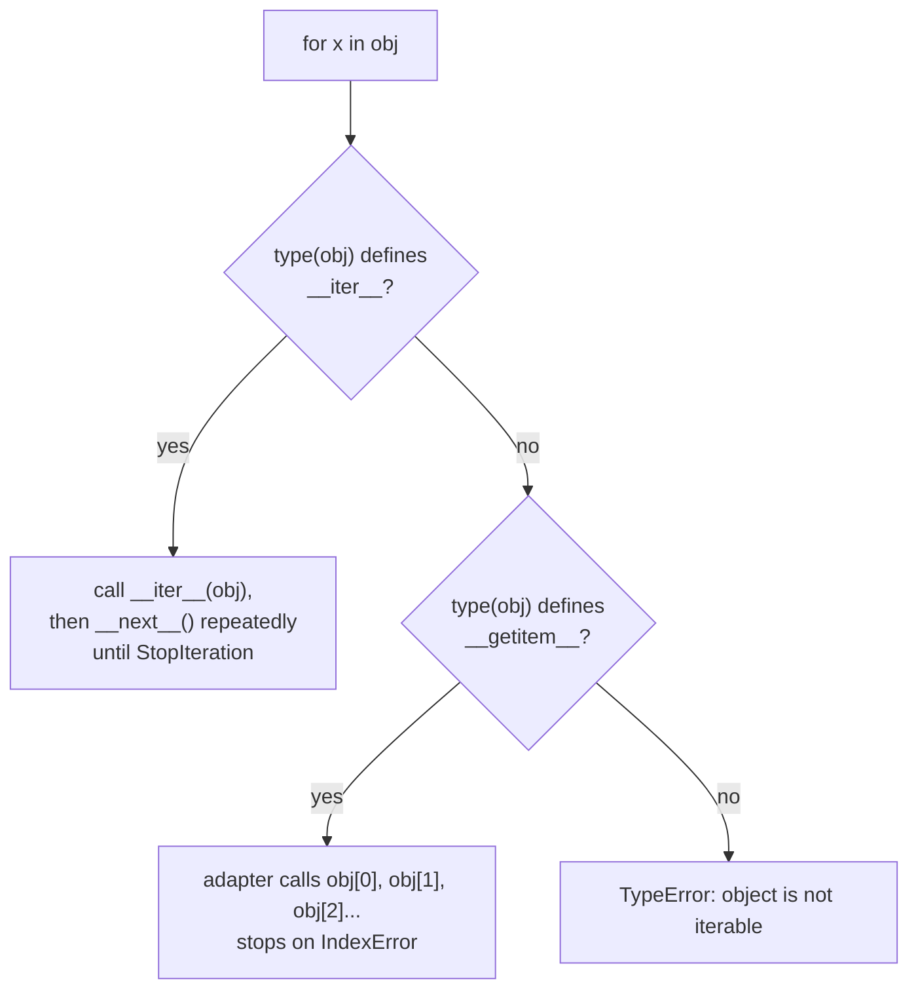
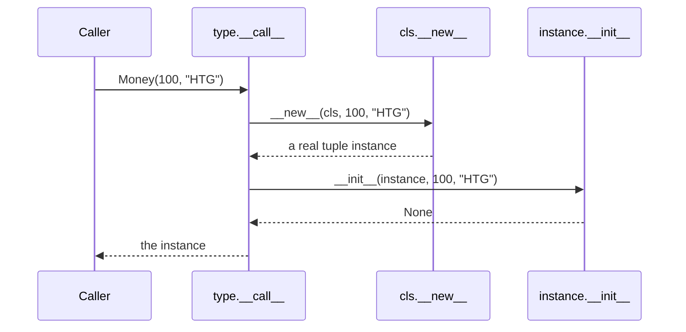
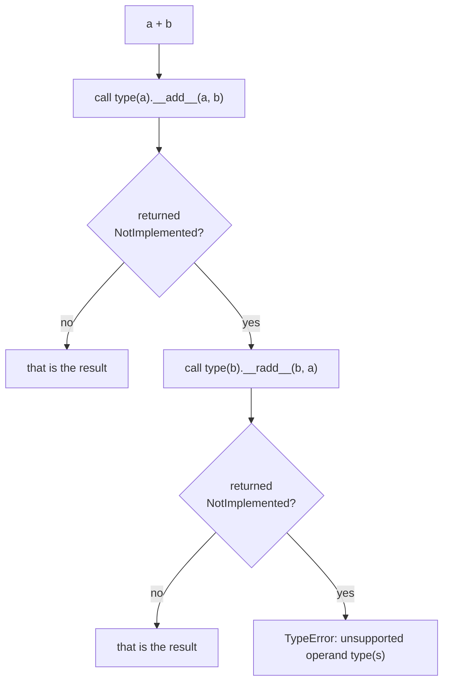

# The special-method protocol — dunders as the real interface, functions as first-class objects

*How `len(x)`, `for item in x`, `x + y`, and `with x:` all compile down to slot lookups on a type, and why a plain function can stand in for an entire class hierarchy.*

**Level:** L4 · **Prerequisites:** [01 object model and attribute lookup](01_object_model_and_attribute_lookup.md)
**Covers:** PY-02, PY-13
**Sources:** Ramalho, *Fluent Python* 2nd ed. ch.1, 7, 10, 12, 13, 16, 18, 22 (2022) · Beazley, *Advanced Python Mastery* §3, §6 (2024) · Wilson, *Software Design by Example*, ch. "Protocols" (2026) · Python data model reference, docs.python.org · `functools` documentation, docs.python.org

---

## 1. The problem this solves

`len`, `for`, `+`, `in`, and `with` are five pieces of syntax that work on strings, lists, dictionaries, and files without any of those types sharing a base class written for the purpose. `len("abc")`, `len([1, 2, 3])`, and `len({"a": 1})` all compile to the same bytecode, dispatched to three completely unrelated implementations. Python calls this duck typing, and the usual gloss — "if it walks like a duck and quacks like a duck" — describes the effect without saying anything about the mechanism that makes it happen. The mechanism is what this chapter is about, and it turns out to answer a second question that looks unrelated at first: why a plain function, with no class around it at all, is often the more idiomatic way to plug custom behavior into a Python program.

Start with the first question. A class that wants to work with `len()`, participate in a `for` loop, and combine with `+` does not inherit from anything to get there:

```python
class Ledger:
    def __init__(self, entries):
        self._entries = list(entries)

    def __len__(self):
        return len(self._entries)

    def __iter__(self):
        return iter(self._entries)

    def __add__(self, other):
        return Ledger(self._entries + other._entries)

checking = Ledger([100, -20, 50])
savings = Ledger([500])
print(len(checking))
for amount in checking:
    print(amount)
combined = checking + savings
print(len(combined))
```

Nothing here subclasses `list` or implements an interface declared anywhere. `Ledger` simply defines three methods with names Python has reserved, and three pieces of builtin syntax start working on it. The `len()` builtin does not know what a `Ledger` is; it looks for a method named `__len__` on the type and calls it. `for` does not know either; it looks for `__iter__`. This is the entire content of "duck typing" in Python: syntax dispatches to a name, not to a type check, and any object supplying that name participates — which is a stronger and more specific claim than "it looks like it would work," because it says precisely which names matter and precisely where Python looks for them.

That specificity has a consequence worth stating before the rest of this chapter builds on it: **where** Python looks for `__len__` is not the same place an ordinary attribute lookup looks, and the difference is not academic — the first failure mode in section 4 is a working monkey-patch that a built-in silently refuses to see, for exactly this reason.

The second question — why plain functions matter — comes from the other direction. A class in the `Strategy` or `Command` shape usually exists to make one piece of behavior swappable: a fee calculation, a sort key, a validation rule. Python does not require a class for that, because a function is already an object: it can be stored in a variable, passed as an argument, put in a dictionary, and returned from another function, with nothing extra defined. A large fraction of the code a Java or C++ background reaches for a class hierarchy to express — an interface with exactly one method, implemented three different ways and selected at runtime — is, in Python, three plain functions and a dictionary. Both threads in this chapter — the protocol that lets built-in syntax work on custom objects, and the fact that a function needs no ceremony to be treated as a value — are really the same idea from two directions: Python's object model treats "the thing that responds to this operation" and "the thing that can be called" as properties an object either has or does not have, checked by looking for a name, not by checking an ancestry.

---

## 2. The mechanism, built up

### 2.1 A dunder is a name, and the syntax that finds it is fixed

`len(x)` is defined, exactly, as `type(x).__len__(x)`. Nothing more subtle happens for the builtin case:

```python
class Ledger:
    def __len__(self):
        return 3

l = Ledger()
print(len(l))                      # 3
print(type(l).__len__(l))          # 3 — the same call, spelled explicitly
```

Every other piece of syntax mentioned in section 1 works the same way, against a different reserved name: `for x in obj` calls `type(obj).__iter__(obj)` to get an iterator and then repeatedly calls `__next__` on it; `a + b` calls `type(a).__add__(a, b)`; `x in obj` calls `type(obj).__contains__(obj, x)` if it exists. None of this is inherited from a common ancestor, because none of it needs to be — the interpreter's bytecode for each operation is written to look up one specific name on the operand's type, and any type supplying that name qualifies.

### 2.2 The lookup happens on the type, and bypasses the instance entirely

Chapter 1 established that an ordinary attribute lookup checks the instance dictionary as one of its steps. Implicit special-method lookup does not do this at all — it is a stricter, faster search that goes straight to the type and never consults the instance:

```python
class Ledger:
    def __len__(self):
        return 3

l = Ledger()
print(len(l))                 # 3

l.__len__ = lambda: 99        # a perfectly normal instance attribute
print(l.__len__())            # 99 — explicit attribute access finds it
print(len(l))                 # 3  — len() still does not
```

`l.__len__()` is an ordinary attribute read followed by a call, so it goes through the full lookup chapter 1 describes and finds the lambda sitting in `l.__dict__`. `len(l)` never performs that read at all. Python's own data model reference states the rule directly: implicit invocations of special methods are only guaranteed to work when the method is defined on the object's *type*, and this lookup bypasses instance attributes and bypasses `__getattribute__` itself, even the metaclass's. There is no step in the implicit path that would ever see the lambda sitting on `l`. This is not an oversight; the documentation's own rationale is that decoupling implicit dispatch from instance state lets the interpreter and extension code assume that `type(x).__len__` is stable for the lifetime of `x`, which matters for a builtin that wants to cache the lookup rather than repeat a full search on every call. The practical effect is that monkey-patching a dunder onto a single *instance* silently does nothing for any builtin syntax that uses it — reassigning `__len__` only changes anything when it is done on the class.

### 2.3 The iteration protocol is a fallback chain, not one rule

`__iter__` is the primary iteration protocol: define it, have it return an object with a working `__next__`, and `for` works. There is also a second, older protocol that still functions today, purely as a fallback:

```python
class LegacySequence:
    def __init__(self, data):
        self._data = data
    def __getitem__(self, index):
        return self._data[index]        # raises IndexError past the end

ls = LegacySequence(["a", "b", "c"])
for item in ls:
    print(item)
print(list(ls))
print(hasattr(ls, '__iter__'))          # False
```

`LegacySequence` defines no `__iter__` at all, and `for` still works. Python's `iter()` builtin — the language's own documentation states this plainly — accepts an object supporting the iterable protocol (`__iter__`) *or* an object supporting the sequence protocol (`__getitem__` with integer arguments starting at `0`), and constructs an adapter that calls `obj[0]`, `obj[1]`, `obj[2]`, and so on, stopping the moment one of those calls raises `IndexError`.



The fallback exists for a historical reason — `__getitem__` predates `__iter__` in the language — and it is still live today rather than deprecated, which is why any class that implements simple integer indexing gets basic iterability for free. It is also, as section 4.3 shows, a trap for a class whose `__getitem__` is keyed on something other than a dense run of integers starting at zero.

The same two-tier structure — a modern protocol with a narrower, older one still recognized underneath it — recurs elsewhere in the special-method surface, and it is worth naming as a pattern rather than a coincidence specific to iteration. Python's descriptor HowTo guide and data model reference are both organized around exactly this idea: a protocol is a small, closed set of names, checked for directly, and when the language adds a more capable version of a protocol it almost always leaves the older spelling recognized rather than removing it, because removing it would silently break every class written against the old contract. Asynchronous iteration, covered on this shelf's concurrency chapters, follows the identical shape one level up: `async for` looks for `__aiter__` and `__anext__` exactly the way `for` looks for `__iter__` and `__next__`, with no equivalent legacy `__getitem__`-style fallback, because the asynchronous protocol was designed after the lesson of the synchronous one's two-tier history was already learned.

### 2.4 Context managers, and what the decorator version is actually doing

`with` is two dunders, `__enter__` and `__exit__`, called around a block:

```python
class Transaction:
    def __init__(self, ledger):
        self.ledger = ledger
    def __enter__(self):
        self.snapshot = list(self.ledger)
        return self.ledger
    def __exit__(self, exc_type, exc_value, traceback):
        if exc_type is not None:
            self.ledger[:] = self.snapshot     # roll back
            return True                         # suppress the exception
        return False                            # let a clean exit through

ledger = [100]
with Transaction(ledger) as l:
    l.append(50)
    raise ValueError("insufficient funds")
print(ledger)                # [100] — rolled back
```

`__exit__` receives the exception type, value, and traceback if the block raised, or three `None`s if it did not, and its return value decides whether that exception propagates: `True` swallows it, anything falsy lets it continue. This is enough machinery to write a transaction, a lock acquisition, or a temporary state change correctly, but it is verbose for the common case of "run this, then always run that afterward regardless of what happened," which is why `contextlib.contextmanager` exists:

```python
import contextlib

@contextlib.contextmanager
def transaction(ledger):
    snapshot = list(ledger)
    try:
        yield ledger
    except Exception:
        ledger[:] = snapshot
        raise               # or swallow it, matching the class version's choice
    # no exception: fall through, nothing to undo

ledger2 = [100]
try:
    with transaction(ledger2) as l:
        l.append(50)
        raise ValueError("insufficient funds")
except ValueError:
    pass
print(ledger2)               # [100]
```

The decorator is not a different mechanism from `__enter__`/`__exit__` — it builds one. Calling `transaction(ledger2)` runs none of the generator's body; it produces a generator object, and `contextlib.contextmanager` wraps that object in a class supplying exactly `__enter__` and `__exit__`. `__enter__` advances the generator to its `yield` and returns the yielded value; `__exit__`, if the block raised, resumes the generator by throwing that exception in at the `yield` point, so the generator's own `try/except` around `yield` is what actually receives it. The `try/finally` shape that governs a generator-based context manager is a direct translation of the same `__enter__`/`__exit__` contract into control flow that already existed for a different reason — generator cleanup is section 7's subject on this shelf, but the shape here is the same idea applied to a resource instead of a loop.

`with` has a fixed vocabulary of exactly two names, which is why `async with` did not need to invent a third protocol from scratch when coroutines needed the same guarantee: it looks for `__aenter__` and `__aexit__`, awaitable counterparts checked for in exactly the same place `__enter__` and `__exit__` are, and `contextlib` supplies `asynccontextmanager` as the direct analogue of the decorator above for a generator built from `async def` instead of `def`. Nothing about the lookup mechanism changes between the synchronous and asynchronous forms — only the two names being searched for and the fact that the returned methods must be awaited rather than called outright.

### 2.5 The `__eq__`/`__hash__` contract, and why it is only checked one direction

`object` starts every instance with identity-based `__eq__` and a hash derived from `id()`. Overriding `__eq__` to compare on values, without also overriding `__hash__`, produces a class that CPython refuses to hash at all:

```python
class BadAccount:
    def __init__(self, owner, balance):
        self.owner, self.balance = owner, balance
    def __eq__(self, other):
        return self.owner == other.owner and self.balance == other.balance

a = BadAccount("alexandro", 100)
hash(a)                    # TypeError: unhashable type: 'BadAccount'
```

```text
TypeError: unhashable type: 'BadAccount'
```

The data model reference states the invariant this enforces: "the only required property is that objects which compare equal have the same hash value." Once `__eq__` is overridden, Python has no way to guarantee that property automatically — two `BadAccount`s with the same owner and balance would compare equal but, under the inherited identity-based `__hash__`, hash differently — so CPython sets `__hash__` to `None` on any class that defines `__eq__` without defining `__hash__` explicitly. `hash(a)` then raises immediately rather than silently violating the contract.

That protection only fires at class-definition time, on a class that *never* defines `__hash__`. It says nothing about a class that defines both consistently and then has a mutable field change underneath it:

```python
class Account:
    def __init__(self, acct_no, balance):
        self.acct_no, self.balance = acct_no, balance
    def __eq__(self, other):
        return self.acct_no == other.acct_no and self.balance == other.balance
    def __hash__(self):
        return hash((self.acct_no, self.balance))
```

`Account` is well-formed by the rule above: `__eq__` and `__hash__` agree at the moment either is called. Section 4.1 covers what happens once `balance` — a field the hash depends on — changes after the object has already been used as a dictionary key.

### 2.6 `__new__` builds the object; `__init__` only configures it

Every class body implicitly inherits `object.__new__` and `object.__init__`, and the two have different jobs: `__new__` is what actually allocates and returns the instance, and `__init__` runs afterward, on the object `__new__` already produced, to set its initial state. Overriding `__init__` is common; overriding `__new__` is rare, and reserved for the one case `__init__` cannot handle — controlling **which** object comes back, or whether construction happens at all.

```python
class Singleton:
    _instance = None
    def __new__(cls):
        if cls._instance is None:
            cls._instance = super().__new__(cls)
        return cls._instance

a, b = Singleton(), Singleton()
print(a is b)                     # True
```

`__init__` cannot do this — by the time it runs, `__new__` has already committed to an object, and `__init__`'s return value is discarded regardless of what it is (in fact `__init__` returning anything other than `None` is a `TypeError`). `__new__` is called *before* an instance exists to call a method on, which is why it takes the class rather than `self` and why it is implicitly a `staticmethod` under the hood rather than an ordinary method.

The other place `__new__` matters is subclassing an immutable built-in, where the value has to be fixed at creation time because there is no later opportunity to mutate it:

```python
class Money(tuple):
    def __new__(cls, amount, currency):
        return super().__new__(cls, (amount, currency))
    def __init__(self, amount, currency):
        pass   # the tuple's contents are already fixed; nothing left to set

m = Money(100, "HTG")
print(m, isinstance(m, tuple))    # (100, 'HTG') True
```



A `tuple` cannot be mutated after construction, so by the time `__init__` would run there is nothing left for it to set — the values had to go in through `__new__`'s call to `tuple.__new__`, which is the only point where the tuple's contents are decided. `Money.__init__` above does nothing because there is nothing left to do; it is defined only because leaving it absent would fall back to `object.__init__`, which raises if called with extra arguments it does not expect.

### 2.7 Operator overloading, and the protocol for "I don't know how to combine with that"

`a + b` is not simply `type(a).__add__(a, b)` unconditionally — there is a documented fallback for the case where `a` does not know how to add `b`:

```python
class Money:
    def __init__(self, cents):
        self.cents = cents
    def __add__(self, other):
        if not isinstance(other, Money):
            return NotImplemented
        return Money(self.cents + other.cents)
    def __radd__(self, other):
        if other == 0:
            return self             # makes sum([...]) work, which starts from 0
        return NotImplemented
    def __repr__(self):
        return f"Money({self.cents})"

print(Money(100) + Money(50))              # Money(150)
print(sum([Money(10), Money(20), Money(30)]))   # Money(60)
Money(100) + 5                              # TypeError
```

```text
Money(150)
Money(60)
TypeError: unsupported operand type(s) for +: 'Money' and 'int'
```

`NotImplemented` — a specific singleton, not an exception and not `None` — is a class's way of saying "I don't handle this combination; ask the other side." When `Money(100).__add__(5)` returns `NotImplemented`, Python does not stop there: it tries `(5).__radd__(Money(100))`, which for a plain `int` also does not know what to do and likewise returns `NotImplemented`, and only when *both* sides have declined does Python raise `TypeError`. `sum()` is the reason `__radd__` bothers to handle `other == 0` specially: `sum()` starts its accumulation from `0 + first_item`, so `Money` needs to handle being added to a literal zero to work with the builtin at all, and returning `self` unchanged for that one case is what makes it work.



Returning `None`, raising an exception, or returning some other placeholder instead of the actual `NotImplemented` singleton breaks this fallback outright — section 4.2 demonstrates exactly that mistake and the silently wrong result it produces.

`==` follows the identical two-sided protocol, with one further fallback on top of it. If both `type(a).__eq__(a, b)` and `type(b).__eq__(b, a)` return `NotImplemented`, Python does not raise — it falls back to comparing identity, the same behavior `object.__eq__` provides by default:

```python
class Weird:
    def __eq__(self, other):
        return NotImplemented

w = Weird()
print(w == w)             # True  — same object, identity fallback
print(w == object())      # False — different objects, identity fallback
```

This is the reason a class that declines every comparison via `NotImplemented` still behaves sensibly under `==` rather than raising: `object`'s own equality was always available underneath, and the protocol only reaches for `TypeError` when the *arithmetic* operators are involved, because there is no sensible fallback for "add these" the way there is for "are these the same object."

### 2.8 Duck typing as a protocol check, and dispatching by type as its formal cousin

`hasattr(x, "read")` and `isinstance(x, SomeABC)` are two different ways of asking the same underlying question — "does this object support the operation I'm about to perform" — and Python provides both because they trade off differently. Ad hoc `hasattr` checks are duck typing in its rawest form: no declaration anywhere says a `FakeFile` is file-like, and none is needed.

```python
def describe(x):
    return "file-like" if hasattr(x, "read") else "other"

class FakeFile:
    def read(self): return "data"

print(describe(FakeFile()))    # file-like
print(describe(42))            # other
```

`functools.singledispatch` formalizes the same idea for the case where the branching is on *type* rather than on the presence of a method, and where more than two or three cases are involved:

```python
from functools import singledispatch
from collections.abc import Mapping

@singledispatch
def render(value):
    return f"unknown: {value!r}"

@render.register
def _(value: Mapping):
    return "table: " + ", ".join(f"{k}={v}" for k, v in value.items())

@render.register
def _(value: list):
    return "list: " + ", ".join(str(v) for v in value)

class TransactionLog(dict):
    pass

print(render(TransactionLog(deposit=100, withdrawal=-50)))
print(render([1, 2, 3]))
```

```text
table: deposit=100, withdrawal=-50
list: 1, 2, 3
```

`TransactionLog` never mentions `render` and is not decorated in any way; it dispatches to the `Mapping` implementation because `dict` is a real, concrete subclass of `collections.abc.Mapping` and `singledispatch`, per its own documentation, walks the argument's method resolution order to find the most specific registered type — exactly the MRO search from chapter 1, repurposed to pick an implementation rather than to find an attribute. Registering against an abstract base class rather than a concrete type is what lets one `@render.register` handle every mapping-like class, present and future, without editing `render` again — the same generalization `isinstance(x, Mapping)` buys over `isinstance(x, dict)`, formalized as dispatch instead of as a conditional.

### 2.9 A function is already an object, and `__call__` extends that to anything

None of the tools in the rest of this chapter require a class at all, because a function needs no wrapping to be treated as a value:

```python
from functools import partial
import operator

apply_5pct_fee = partial(operator.mul, 1.05)
print(apply_5pct_fee(100))            # 105.0

def flat_fee(amount, fee):
    return amount + fee

checking_fee = partial(flat_fee, fee=2)
print(checking_fee(100))              # 102
```

`partial` builds a new callable that has already remembered some of the arguments, which is what a hand-written class implementing the Command pattern — a class whose entire purpose is to remember a piece of behavior plus its bound arguments for later — exists to do in a language without first-class functions. The **Strategy** pattern collapses just as directly: a family of interchangeable algorithms, each traditionally a subclass implementing one method, is a family of functions with the same signature and a dictionary or a `key=` argument to pick among them.

```python
def by_amount(transaction):
    return transaction["amount"]

def by_date(transaction):
    return transaction["date"]

transactions = [{"amount": 50, "date": "2026-01-02"}, {"amount": 10, "date": "2026-01-01"}]
print(sorted(transactions, key=by_amount))
print(sorted(transactions, key=by_date))
```

`sorted`'s `key=` parameter is a strategy slot with no interface declared anywhere for it — any single-argument callable qualifies, which includes a plain function, a `lambda`, a `functools.partial`, or an instance of a class defining `__call__`:

```python
class Discount:
    def __init__(self, rate):
        self.rate = rate
    def __call__(self, amount):
        return amount * (1 - self.rate)

ten_percent_off = Discount(0.10)
print(ten_percent_off(200))          # 180.0
print(callable(ten_percent_off))     # True
```

`__call__` is the same mechanism as every other dunder in this chapter, applied to the syntax `x(...)`: `ten_percent_off(200)` is `type(ten_percent_off).__call__(ten_percent_off, 200)`, looked up on the type per section 2.2. The production-shape lesson this converges on is that a class in Python earns its place when an operation needs to carry state between calls — `Discount` remembers `rate` — not merely because the operation is "a piece of behavior." A stateless piece of behavior is a function; a family of interchangeable stateless behaviors is a group of functions selected by a dictionary or a `key=` argument; only a piece of behavior that needs memory between invocations needs a class, and even that class typically needs nothing more than `__init__` and `__call__` to fully replace a one-method interface and its implementers.

---

## 3. Diagrams

The iteration-fallback flowchart in section 2.3, the `__new__`/`__init__` sequence diagram in section 2.6, and the operator-fallback flowchart in section 2.7 are integrated into the mechanism build-up above, as this format requires.

---

## 4. Failure modes

### 4.1 Mutating a field the hash depends on desyncs the object from its own dictionary bucket

```python
# Gist: mutable_hash_key.py
class Account:
    def __init__(self, acct_no, balance):
        self.acct_no, self.balance = acct_no, balance
    def __eq__(self, other):
        return self.acct_no == other.acct_no and self.balance == other.balance
    def __hash__(self):
        return hash((self.acct_no, self.balance))

a = Account(1001, 100)
book = {a: "primary checking"}
a.balance = 50          # a field __hash__ depends on, changed after insertion
```

Section 2.5's contract — "objects which compare equal have the same hash value" — was true when `a` was inserted and is violated the moment `balance` changes, because `hash(a)` is now a different number than the one the dictionary used to choose `a`'s bucket when it was stored. A dictionary does not rehash its existing entries when a key mutates; it has no way to know a mutation happened at all. What comes next is genuinely nondeterministic rather than a single predictable outcome: a lookup for `a` recomputes `hash(a)` using the *current* balance and probes the table starting from the bucket that hash implies. Whether that probe sequence happens to still pass through the bucket where the entry actually lives, before reaching an empty slot, depends on the specific hash values involved and the table's current size — neither of which the program controls or can predict from the source code alone. The same code can appear to work correctly through months of testing on a dictionary that happens to keep colliding into the right bucket, and then silently "lose" an entry the day the dictionary resizes or a different balance value is used. This is precisely why the failure is dangerous rather than merely inconvenient: it does not fail the same way twice, so a fix that seems to work after one manual check is not evidence of anything. The only real fix is prevention — computing `__hash__` exclusively from fields that do not change over the object's lifetime, which for `Account` means hashing only `acct_no` and leaving `balance` out of both `__eq__` and `__hash__`'s equality-relevant fields, or, more simply, only ever using an immutable, frozen value object as a dictionary key.

### 4.2 Returning the wrong thing instead of `NotImplemented` produces a silently wrong result, not an error

```python
# Gist: wrong_notimplemented.py
class Money:
    def __init__(self, cents): self.cents = cents
    def __add__(self, other):
        if not isinstance(other, Money):
            return None          # meant "I can't do this" — should be NotImplemented
        return Money(self.cents + other.cents)

result = Money(100) + 5
print(result, type(result))
```

```text
None <class 'NoneType'>
```

Section 2.7's fallback protocol depends entirely on the *specific* sentinel `NotImplemented` — Python checks for that exact singleton, not for any falsy or exception-raising alternative, to decide whether to try the reflected operator. Returning `None` here is not recognized as "please ask the other operand"; it is recognized as *the actual answer*. `Money(100) + 5` therefore does not raise the `TypeError` a programmer might expect for an unsupported combination — it silently produces `None`, typed as `NoneType`, which will fail much later and much less informatively, wherever that `None` is next used as though it were a `Money`. This is worse than a crash at the point of the mistake, because the traceback that eventually appears points at an unrelated line far from where the real defect is. The fix is one word — return `NotImplemented`, not `None` — and the cost is remembering that the two are unrelated: `NotImplemented` is a singleton object used exactly for this protocol, and it is not falsy in a way that makes `if not isinstance(...): return None` an easy substitute to reach for by habit.

### 4.3 The legacy iteration fallback assumes dense integer indices, and a sparse `__getitem__` breaks it mid-loop

```python
# Gist: sparse_getitem.py
class SparseLog:
    def __init__(self, data):
        self._data = data     # a dict keyed by timestamp, not 0..n
    def __getitem__(self, key):
        return self._data[key]

log = SparseLog({5: "deposit", 12: "withdrawal"})
for entry in log:
    print(entry)
```

```text
KeyError: 0
```

`SparseLog` defines `__getitem__` for a reason that has nothing to do with iteration — indexing by timestamp — and section 2.3's fallback protocol does not know that. `iter()` sees a `__getitem__` and no `__iter__`, assumes the legacy sequence protocol, and starts probing `log[0]`, `log[1]`, `log[2]`, expecting the sequence to be dense and to eventually signal its end with `IndexError`. `SparseLog`'s dictionary has no key `0`, so the very first probe raises `KeyError` instead of the `IndexError` the protocol is listening for, and that exception propagates out of the loop unhandled rather than being interpreted as "iteration is over." The fix is either to define `__iter__` explicitly — the modern protocol, which sidesteps the legacy fallback entirely and is the correct choice for any container not naturally indexed by a dense integer range — or, if `__getitem__` genuinely must double as the container's iteration mechanism, to raise `IndexError` specifically for the termination case rather than letting whatever the underlying lookup happens to raise propagate unexamined.

### 4.4 An instance-level monkey-patch of a dunder is invisible to the syntax it is meant to intercept

```python
# Gist: instance_dunder_ignored.py
class Ledger:
    def __len__(self):
        return 3

l = Ledger()
l.__len__ = lambda: 0          # intended: make this test double report "empty"
print(len(l) == 0)
```

```text
False
```

This is section 2.2's rule surfacing as a debugging trap rather than as a curiosity. A test that tries to stub out `__len__` on a single instance — a common instinct when writing a fake or a test double without wanting to define a whole new class — silently fails to change what `len()` reports, because implicit dunder lookup never looks at the instance dictionary at all; it goes straight to `type(l).__len__`, exactly as documented. The assertion fails not because the underlying logic is wrong but because the patch was applied to the wrong place, and nothing about the assignment itself raises any error — `l.__len__ = lambda: 0` is a perfectly ordinary, successful attribute assignment, which is what makes this easy to miss. The fix is to patch the class, or the specific instance's `__class__` if only one object needs the behavior (`l.__class__ = FakeLedger`, a class defining `__len__` to return `0`), or, in tests, to use a mocking library that is aware of this rule and patches dunders at the type level rather than the instance level.

---

## 5. Trade-offs

| Approach | Use when | Because | Real cost |
| --- | --- | --- | --- |
| **`hasattr` duck typing** | One or two capabilities, checked informally, no shared abstraction worth naming | Zero ceremony; works on any object regardless of its ancestry | No enforcement that the attribute behaves correctly, only that it exists; a partial or wrong implementation passes the check |
| **`isinstance` against an ABC** | Several capabilities travel together, and misuse should fail fast and clearly | Declares the contract once; subclassing or `.register()` is an explicit opt-in | Requires either real inheritance or explicit registration; does not work for an object nobody thought to register |
| **`functools.singledispatch`** | Behavior branches on the type of one argument across three or more cases | Extensible without touching the original function; dispatches through the MRO, so ABC registration generalizes automatically | Dispatch is on the first argument's type only; a second-argument-driven branch needs a different tool entirely |
| **A plain function / `functools.partial`** | The behavior is stateless, or all the state it needs is already fixed at the point it is built | No class, no boilerplate; a function is already a value | Cannot carry mutable state across separate calls without an enclosing class or a closure taking on that job |
| **A callable class (`__call__`)** | The behavior needs to remember state between invocations | One class replaces an entire one-method interface and every one of its implementers | A class body, an `__init__`, and an instance to construct — more ceremony than a function for anything that turns out not to need the memory |

### When not to reach for an ABC

Registering or subclassing an abstract base class is worth it when a real caller will get real value from the `isinstance` check — a public API boundary, a plugin system, a place where failing fast on the wrong type matters more than flexibility. Inside a single module where the only caller is code the same person wrote five lines above, a `hasattr` check or simply calling the method and letting it raise `AttributeError` if it is missing is not a lesser choice; formalizing a contract that has exactly one implementation and one call site is ceremony with no payoff. This is also, concretely, the argument for preferring "try it and let the exception happen" — the style sometimes called EAFP, easier to ask forgiveness than permission — over a defensive `hasattr` guard placed in front of every call: a guard that checks for `read` and then calls it is two lookups where one would do, and the second lookup can itself race with something else changing the object between the check and the call in any code path that is not strictly single-threaded.

### When not to reach for `singledispatch`

Two cases do not need it: a two-way branch is more directly expressed as a single `isinstance` check or an `if`/`else`, and a function whose actual complexity is in the arguments' *values* rather than their *types* is not what `singledispatch` was built for at all. It earns its place specifically when new types need new behavior added without editing a growing `if isinstance(...)` chain, which is a maintenance property, not a performance one — dispatch through the MRO on every call is not free, and for two or three stable cases a direct conditional is both faster and more legible.

### The case against building a class hierarchy for swappable behavior

The Strategy and Command patterns exist in languages where a function cannot be passed around as a value, and Python's answer is not "use a smaller class" but "do not use a class." A `Strategy` interface with three subclasses, each implementing one method and holding no state of their own, is three functions and a `dict` mapping names to them — less code, no instantiation step, and no inheritance to navigate to find out what the strategy actually does. The rejected alternative — a full class hierarchy — costs an abstract base class, three concrete subclasses, and an extra allocation per strategy selected, all to hold a single method that a function already expresses. The one place the class wins is exactly section 2.9's dividing line: the moment a strategy needs to remember something between calls, a closure or a `__call__`-based class becomes the honest choice, and reaching for a bare function at that point costs a global variable or a mutable default argument to fake the state a class would hold cleanly.

---

## 6. Reference summary

**Built-in syntax dispatches to a fixed dunder name on the operand's type**, not to a type check: `len(x)` is `type(x).__len__(x)`, `a + b` is `type(a).__add__(a, b)`, and so on. **Implicit dunder lookup goes straight to the type and bypasses the instance dictionary and `__getattribute__` entirely** — assigning `__len__` on an instance changes nothing for `len()`, which only ever looks at the type.

**Iteration has two protocols.** `__iter__` is primary. Its absence falls back to the legacy sequence protocol — repeated `__getitem__(0)`, `__getitem__(1)`, … until `IndexError` — which is why any class with plain integer indexing gets `for` for free, and why a `__getitem__` keyed on anything other than a dense integer range breaks that fallback with whatever exception the real lookup raises instead of the `IndexError` the protocol expects.

**`with` is `__enter__`/`__exit__`**, where `__exit__`'s return value decides whether a raised exception propagates (falsy) or is swallowed (truthy). `contextlib.contextmanager` builds the same pair of methods from a generator function: `__enter__` runs the generator to its `yield`, and `__exit__` resumes it — throwing in the exception if the block raised — so the generator's own `try`/`except` around `yield` is what actually handles cleanup.

**`__eq__` and `__hash__` must agree that equal objects hash equally.** CPython enforces this automatically only at class-definition time, by setting `__hash__` to `None` on any class overriding `__eq__` without also overriding `__hash__`. It cannot enforce the contract against a *mutation* of a field the hash depends on after the object has already been used as a key — that produces a nondeterministic, hard-to-reproduce lookup failure, not an error, and the only real defense is hashing exclusively on fields that never change.

**`__new__` builds the object; `__init__` only configures it**, running afterward on whatever `__new__` returned. `__new__` is the only hook that can return an existing object instead of a new one (a singleton) or that can fix an immutable built-in's contents before there is an instance to call a normal method on.

**`a + b` tries `type(a).__add__` first; if that returns the literal `NotImplemented` singleton, Python tries `type(b).__radd__` before raising `TypeError`.** Returning anything else — `None`, a default value, a raised exception — short-circuits that fallback and either produces a silently wrong result or an error at the wrong place.

**A function is already a first-class object**, storable, passable, and returnable with no wrapping. `functools.partial` fixes some of a function's arguments ahead of time; `functools.singledispatch` extends the same idea to type-directed branching, walking the argument's MRO so registering against an abstract base class covers every subclass automatically. **A class earns its place over a function specifically when the behavior needs to remember state between calls** — at which point `__call__`, looked up the same way every other dunder in this chapter is, makes an instance directly usable wherever a function was expected.

---

← [Python knowledge graph](00_knowledge_graph.md) · [repo index](../README.md)
