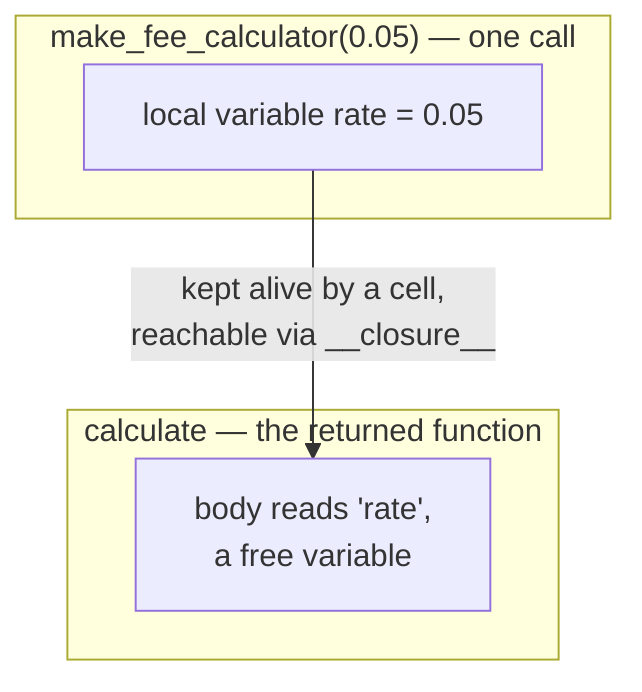
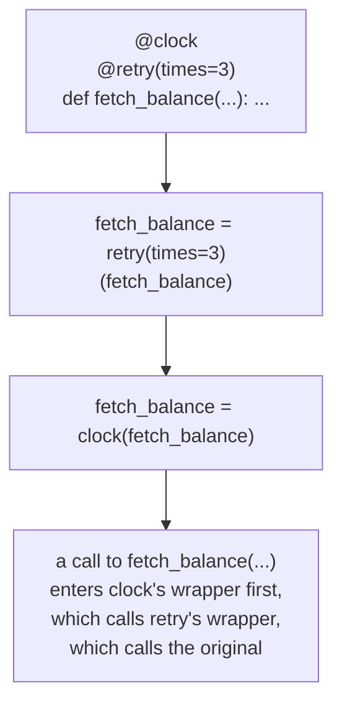
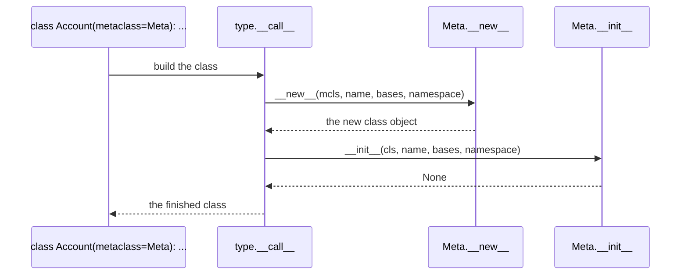

# Closures, decorators, and metaprogramming — how a function remembers, and how code rewrites code

*Cell objects and free variables, what `functools.wraps` actually restores, why a class decorator usually beats a metaclass, and what still needs one when it does not.*

**Level:** L5 · **Prerequisites:** [01 object model and attribute lookup](01_object_model_and_attribute_lookup.md), [02 the special-method protocol](02_the_special_method_protocol.md)
**Covers:** PY-03
**Sources:** Ramalho, *Fluent Python* 2nd ed. ch.9, 10, 24 (2022) · Beazley, *Advanced Python Mastery* §7 (2024) · Wilson, *Software Design by Example*, ch. "Functions and Closures," ch. "Protocols" §Decorators, ch. "Running Tests" (2026)

---

## 1. The problem this solves

A function that needs to remember something between calls looks, at first, like it needs a class:

```python
def make_fee_calculator(rate):
    def calculate(amount):
        return amount * rate
    return calculate

five_pct = make_fee_calculator(0.05)
ten_pct = make_fee_calculator(0.10)
print(five_pct(200), ten_pct(200))     # 10.0 20.0
```

`make_fee_calculator` runs once, returns, and is gone. `calculate` keeps running long after — `five_pct` and `ten_pct` are both still using a `rate` that only ever existed inside a function call that has already completed. Nothing about this is a special case Python bolted on for convenience; it falls directly out of two facts already established on this shelf: a function is an ordinary object (chapter 2), and a nested function can read names from the scope it was defined in even after that scope has technically returned. What makes the second fact non-obvious is *how* it can possibly be true — the enclosing call's local variables should have been discarded the moment it returned, by the same stack-frame accounting that discards every other function call's locals. They were not discarded, and the mechanism that keeps them alive, and exactly what "keeps them alive" means for a variable that changes after the closure is built, is the first half of this chapter.

The second half starts from a different, equally common need: behavior that should wrap around a function without changing what the function itself does. Retry a flaky network call up to three times. Time how long a computation takes. Register a function in a lookup table the moment it is defined, without a second, separate line of code to add it. Each of these is "run some code before and after calling this function," and each is possible to write by hand — call the real function from inside another function, add the extra behavior around that call — with enough repetition to make doing it by hand for every function actively unpleasant. A decorator is syntax for exactly this pattern, and section 2 shows that the syntax is not doing anything a programmer could not write themselves; `@deco` above a function definition is, character for character, sugar for one assignment statement.

Neither half of this problem is solved by writing a class instead, though a class can express both. A `Retrier` class with a `__call__` method and a `times` attribute would work exactly as well as the function-based version this chapter builds — the choice between them is not correctness, it is which shape makes the intent easiest to read at the call site, and Python's decorator syntax exists because "wrap this function with this behavior" reads far more directly as `@retry(times=3)` sitting directly above the function it modifies than as an instantiation and a manual call somewhere else in the file.

The two halves connect at the point this chapter is actually about: a decorator that needs to remember anything about the function it wraps — how many times it has been called, what its original name was, what argument it should retry with — needs a closure to hold that memory, because the decorator function itself, like `make_fee_calculator`, runs once and returns. Understanding closures is not optional background for understanding decorators; it is the mechanism decorators are built from. The chapter ends with the more drastic tool that shares the same motivation — changing how a class itself behaves, rather than how a function behaves — and with the honest case, made by the very book this chapter draws its metaclass material from, that most of what a metaclass used to be needed for no longer requires one.

Metaprogramming, across both halves, is the umbrella term for all of this: code that operates on other code — functions, classes, or a module's own namespace — as data, rather than simply executing in sequence. A decorator inspects and replaces a function object. A class decorator inspects and modifies a class object. A metaclass controls how a class object is assembled in the first place. And, at the plainest end of the same spectrum, a piece of code that reads `globals()` and picks out every name matching a pattern is metaprogramming with no special syntax at all — just the ordinary fact that a running program's own namespace is, itself, an inspectable dictionary. What separates a well-chosen metaprogramming tool from an over-engineered one, in every case this chapter covers, is whether the problem actually requires operating on the code rather than simply calling it — and section 4 returns to that question directly for each tool in turn.

---

## 2. The mechanism, built up

### 2.1 A closure is a function plus the bindings its body still refers to

`calculate`, from section 1, is not carrying a copy of `rate`. It is carrying a reference to the same variable `make_fee_calculator` created, kept alive specifically because `calculate`'s body still refers to it:

```python
print(five_pct.__code__.co_freevars)        # ('rate',)
print(five_pct.__closure__)                 # (<cell at 0x...: float object at 0x...>,)
print(five_pct.__closure__[0].cell_contents) # 0.05
print(ten_pct.__closure__[0].cell_contents)  # 0.1
```

`co_freevars` is the compiler's own record of which names in `calculate`'s body are neither local to `calculate` nor global — a **free variable**, in the technical sense, is a name read inside a function but bound outside it. For each free variable, the returned function object carries a **cell**: a small box holding the actual value, reachable through `__closure__`. `five_pct` and `ten_pct` have separate cells holding `0.05` and `0.1` because each call to `make_fee_calculator` created a fresh local `rate` and a fresh cell to hold it — the closure is per-call, not per-function-definition.



This is why the enclosing call's locals are not simply discarded: the returned function's `__closure__` holds a reference to the cell, and Python's reference-counting collector — the subject of the next chapter on this shelf — does not free memory still referenced from somewhere reachable. The cell outlives the stack frame it was created in because something still points to it.

### 2.2 A cell can be reassigned, not just read, with `nonlocal`

Reading a free variable works with no special syntax, as `calculate` shows. Assigning to one from inside the nested function does not, by default, do what it looks like it should:

```python
def make_averager():
    count = 0
    total = 0
    def averager(new_value):
        count += 1          # this is the same as: count = count + 1
        total += new_value
        return total / count
    return averager

avg = make_averager()
avg(10)
```

```text
UnboundLocalError: cannot access local variable 'count' where it is not associated with a value
```

The compiler decides, once, at the time it compiles `averager`'s body, whether each name is local to `averager`, free, or global — and it decides this from the *presence of an assignment* anywhere in the function body, not from execution order. `count += 1` is an assignment to `count`, so the compiler marks `count` as local to `averager` for the entire function, which means the read half of `count += 1` is reading a local variable that has never been given a value yet, before the assignment half can run. This is the same static-scoping analysis that makes chapter 1's method-versus-function distinction possible, applied one level down, to variables instead of attributes.

`nonlocal` is the explicit override: it tells the compiler that a specific name, despite being assigned inside this function, should be resolved in the nearest enclosing function's scope instead of treated as local.

```python
def make_averager():
    count = 0
    total = 0
    def averager(new_value):
        nonlocal count, total
        count += 1
        total += new_value
        return total / count
    return averager
```

With `nonlocal count, total` declared, the same `count += 1` now reads and writes the cell from `make_averager`'s scope, and the running total works correctly across calls. The rule this generalizes to, precisely: if a name is read but never assigned in a function, it is free, and Python looks for it in the nearest enclosing scope, then the module's global scope, then `__builtins__`. If a name is assigned anywhere in the function body, it is local, unless a `global` or `nonlocal` declaration says otherwise. Lists and dictionaries do not run into this at all — `series.append(x)` is a method call, not an assignment to `series`, so the compiler never reclassifies `series` as local, which is why a closure that only ever mutates a mutable free variable in place needs no `nonlocal` declaration at all.

### 2.3 A decorator is one assignment statement, and nothing more

`@decorate` above a function definition is defined, exactly, as running the function body and then rebinding its name to `decorate`'s return value:

```python
@decorate
def target():
    print("running target")
```

is the same as:

```python
def target():
    print("running target")
target = decorate(target)
```

A decorator, in the general case, is any callable that accepts a function and returns something — usually, but not necessarily, another callable — and this happens **immediately**, at the moment the module containing the `@decorate`-decorated function is loaded, not the first time `target` is called. The clearest consequence is that a decorator with no closure at all can still change what a name refers to permanently:

```python
registry = []

def register(func):
    registry.append(func)
    return func

@register
def deposit(amount): ...

@register
def withdraw(amount): ...

print([f.__name__ for f in registry])   # ['deposit', 'withdraw']
```

`register` returns `func` unchanged, so `deposit` and `withdraw` still work exactly as written; the side effect — appending to `registry` — is what the decorator is actually for, and it has already happened by the time any other code in the module runs, because decoration happens at *def* time.

### 2.4 A decorator that wraps behavior needs a closure to remember the original function

A decorator that intercepts calls, rather than merely registering the function once, has to hold onto the original function somewhere the replacement can reach it — which is precisely the closure mechanism from section 2.1, applied to a function object instead of a number:

```python
import time

def clock(func):
    def clocked(*args, **kwargs):
        t0 = time.perf_counter()
        result = func(*args, **kwargs)
        elapsed = time.perf_counter() - t0
        print(f"[{elapsed:.6f}s] {func.__name__}(...) -> {result!r}")
        return result
    return clocked

@clock
def apply_interest(balance, rate):
    return balance * (1 + rate)

apply_interest(1000, 0.05)
```

`clock(apply_interest)` returns `clocked`, and `apply_interest` is rebound to `clocked` per section 2.3. `func` is a free variable of `clocked`, held in a cell exactly like `rate` was in section 2.1 — the fact that the captured value happens to be a function rather than a float changes nothing about the mechanism. Every subsequent call to `apply_interest(...)` is really a call to `clocked(...)`, which calls the original function through the closure, times it, and returns its result.

### 2.5 `functools.wraps` restores identity that the wrapper otherwise erases

`clocked` from section 2.4 works, but it has quietly become the function that answers to introspection wherever `apply_interest` is inspected:

```python
print(apply_interest.__name__)     # 'clocked'   — wrong
print(apply_interest.__doc__)      # None        — lost
```

Every tool that inspects a function by asking it questions — a debugger, an API-documentation generator, a test framework matching functions by name — is asking `clocked`, not `apply_interest`, and getting `clocked`'s answers. `functools.wraps` fixes this by copying the relevant metadata from the original function onto the wrapper as part of building it:

```python
import functools

def clock(func):
    @functools.wraps(func)
    def clocked(*args, **kwargs):
        t0 = time.perf_counter()
        result = func(*args, **kwargs)
        elapsed = time.perf_counter() - t0
        print(f"[{elapsed:.6f}s] {func.__name__}(...) -> {result!r}")
        return result
    return clocked

@clock
def apply_interest(balance, rate):
    """Apply a simple interest rate to a balance."""
    return balance * (1 + rate)

print(apply_interest.__name__)      # 'apply_interest'
print(apply_interest.__doc__)       # 'Apply a simple interest rate to a balance.'
print(apply_interest.__wrapped__ is not None)   # True
```

`functools.wraps(func)` is itself a decorator — applied to `clocked`, inside `clock` — that copies `__name__`, `__doc__`, `__module__`, and `__dict__` from `func` onto `clocked`, and additionally sets `clocked.__wrapped__ = func`, an explicit escape hatch back to the original that tools like `inspect.signature` know to follow. Without it, a stack of decorators progressively erases the original function's identity one layer at a time; with it, every layer is transparent to introspection, and the underlying function remains reachable no matter how many decorators sit on top of it.

### 2.6 A decorator that takes its own arguments is a function that returns a decorator

`@clock` takes no arguments of its own. `@retry(times=3)` needs to, which adds one more level of nesting rather than a new mechanism:

```python
def retry(times):
    def decorator(func):
        @functools.wraps(func)
        def wrapper(*args, **kwargs):
            last_exc = None
            for attempt in range(1, times + 1):
                try:
                    return func(*args, **kwargs)
                except ConnectionError as e:
                    last_exc = e
            raise last_exc
        return wrapper
    return decorator

@retry(times=3)
def fetch_balance(account_id):
    ...
```

`retry(times=3)` is a plain function call, evaluated first, that returns `decorator` — and `decorator` is what actually receives `fetch_balance` and decorates it, exactly as in section 2.3. `times` is now a free variable of `wrapper`, two closures deep: `wrapper` closes over `func` (from `decorator`'s parameter) and, transitively, `decorator` closes over `times` (from `retry`'s parameter). `@retry(times=3)` above a function definition desugars to `fetch_balance = retry(times=3)(fetch_balance)` — a decorator factory called once to produce the actual decorator, which is then applied once, in the same statement, to the function beneath it.

### 2.7 Stacking decorators nests them, innermost first

Multiple decorators on one function apply bottom-up and unwrap top-down:



The decorator closest to the function is applied first, so it is the *innermost* layer at call time; the one written above it wraps that already-wrapped function, becoming the *outermost* layer — the first thing that actually runs when the decorated name is called. Getting this backwards is a common source of confusion when a timing decorator is meant to measure a retried call as a whole but ends up, because of stacking order, measuring only the innermost attempt.

### 2.8 Class decorators, and the two hooks that replace most of what metaclasses were for

Everything from section 2.3 onward generalizes directly to classes: a class decorator is a callable that receives a freshly built class and returns one, applied after `class Account: ...` has already executed in full.

```python
def add_repr(cls):
    def __repr__(self):
        fields = ", ".join(f"{k}={v!r}" for k, v in vars(self).items())
        return f"{cls.__name__}({fields})"
    cls.__repr__ = __repr__
    return cls

@add_repr
class Account:
    def __init__(self, owner, balance):
        self.owner, self.balance = owner, balance

print(Account("alexandro", 100))   # Account(owner='alexandro', balance=100)
```

This is class-level metaprogramming — code that modifies a class definition — without a metaclass anywhere in sight, and it is simpler to reason about than one for the same reason a decorator is simpler to reason about than overriding `__new__`: it runs once, after the class exists, and cannot affect anything about how the class was assembled in the first place, which rules out an entire category of subtle ordering bugs a metaclass can introduce.

Chapter 1 covers `__init_subclass__` and `__set_name__` in full, as the mechanism behind reacting to subclass creation and descriptor naming without a metaclass; this chapter's addition is naming what kind of tool they are: metaprogramming that operates *through* ordinary class-body syntax rather than by intercepting class construction itself. Between class decorators, `__init_subclass__`, and `__set_name__`, the historical reasons to reach for a metaclass — auto-registering subclasses, validating a class body, naming a descriptor — are covered without one.

### 2.9 What is left that only a metaclass can do

A metaclass is a class whose instances are themselves classes, and the operation it customizes is the one step none of the tools above can reach: **what happens while the class body is still being assembled**, before `class` has produced anything to decorate. `type.__call__` — the same machinery chapter 1 traced for ordinary instance construction — runs `Meta.__new__` and then `Meta.__init__` to produce the class object itself, one level up from `cls.__new__`/`instance.__init__` producing an instance:



The one thing this reaches that a class decorator cannot: `Meta.__prepare__(name, bases)` can hand back a custom mapping to be used *as* the class namespace while the body executes, before a single line of it has run. Ramalho's own illustration is a namespace that implements `__missing__` to auto-assign an incrementing integer to any name read but not yet defined, which lets a class body list bare names — `banana`, `coconut`, `vanilla` — and have each one become a distinct constant with no right-hand side at all. A class decorator is fundamentally too late for this, because by the time it runs, the namespace has already been read in whatever form it was created.

That power comes with a real, sharp restriction: a class can have exactly one metaclass, and Python computes it as the most derived of the metaclasses of `type` and every base class. When that computation has no single answer, class creation fails immediately:

```python
import abc

class PersistentMeta(type):
    pass

class Record(abc.ABC, metaclass=PersistentMeta):
    pass
```

```text
TypeError: metaclass conflict: the metaclass of a derived class must be a (non-strict) subclass of the metaclasses of all its bases
```

`abc.ABC` is built with `abc.ABCMeta` as its metaclass, and `PersistentMeta` shares no relationship with `ABCMeta` — neither is a subclass of the other — so there is no single class that could serve as `Record`'s metaclass without contradicting one of its bases. The fix is either to avoid combining the two metaclasses at all, or to write a third metaclass inheriting from both and use that instead, which is exactly the kind of code Ramalho's own account of this warns against reaching for near a deadline: it is easy to get subtly wrong and hard for the next reader to follow.

One historical reason to reach for `__prepare__` has separately disappeared on its own. Before Python 3.6, a plain `dict` did not preserve the order in which keys were inserted, so a metaclass that needed to process a class body's attributes in the order they were written — to number them, or to preserve declaration order in a generated schema — had no choice but to supply its own ordered mapping via `__prepare__`. Ordinary `dict` objects have preserved insertion order since 3.6, formalized as a language guarantee in 3.7, so that specific reason is gone for any codebase that has dropped support for interpreters older than that; Ramalho's own accounting of this shelf's metaclass material names it directly as one of the two named features — alongside `__set_name__` — that made the historically largest classes of custom metaclass unnecessary rather than merely inconvenient.

Two frameworks widely used in the same web-service stack this shelf covers still choose a metaclass for exactly this reason, current as of their present major versions: SQLAlchemy's `DeclarativeBase` is instrumented by a `DeclarativeMeta` metaclass by default — intercepting attribute assignment on mapped classes to wire `mapped_column()` definitions into the ORM's registry — with an explicit `DeclarativeBaseNoMeta` escape hatch documented for the case where a project's own metaclass would conflict with it. Pydantic v2's `BaseModel` is built by a `ModelMetaclass`, which is also why `pydantic.BaseModel` provides its own `__pydantic_init_subclass__` hook rather than relying on the ordinary `__init_subclass__` alone — the metaclass needs to finish building the model's validation schema before that hook fires, an ordering guarantee plain `__init_subclass__` cannot make on its own. Both are examples of the discipline the same source material recommends: the metaclass is an implementation detail sitting behind a plain class that ordinary code subclasses normally, never something application code is expected to write or even notice.

### 2.10 Discovery by introspection needs neither decorators nor metaclasses

The last metaprogramming tool in this chapter is the plainest one: scanning an already-built namespace to find things that match a convention, with no decoration and no class machinery at all.

```python
def test_deposit_increases_balance():
    assert True

def test_withdrawal_decreases_balance():
    assert True

def helper_not_a_test():
    pass

tests = [name for name, obj in globals().items()
         if name.startswith("test_") and callable(obj)]
print(sorted(tests))
```

```text
['test_deposit_increases_balance', 'test_withdrawal_decreases_balance']
```

This is the actual mechanism behind a test runner finding test functions without any of them being registered anywhere: `globals()` returns the module's own namespace as an ordinary dictionary, and any function whose name matches a convention is treated as a test. No decorator marks it, no base class declares it, no metaclass intercepts its creation — the discovery happens entirely after the fact, by reading data the interpreter was already going to produce. This is the least ceremonious metaprogramming technique in the chapter specifically because it asks nothing of the code being discovered; the cost, covered in section 4, is that it asks everything of the naming convention instead.

---

## 3. Failure modes

### 3.1 A closure inside a loop captures the variable, not the value it held at that iteration

```python
# Gist: late_binding.py
calculators = []
for rate in (0.05, 0.10, 0.15):
    calculators.append(lambda amount: amount * rate)

print([f(100) for f in calculators])
```

```text
[15.0, 15.0, 15.0]
```

Every lambda here closes over the same cell — `rate`, from the enclosing scope of the `for` loop, since a loop does not create a new scope on each iteration — and section 2.1 already established that a closure holds a reference to a variable, not a snapshot of its value at the moment the closure was built. By the time any of the three lambdas is actually called, the loop has finished and `rate` holds its final value, `0.15`, which is what every one of them sees. This is not specific to `lambda`; an ordinary nested `def` built inside the same loop would exhibit the identical behavior, because the mechanism is about closures, not about the anonymous-function syntax. The fix is to force the value to be bound at the time each lambda is created rather than looked up when it is called, most commonly by giving it a default argument, whose value is evaluated once, at function-definition time, into a genuinely separate cell per iteration:

```python
calculators = []
for rate in (0.05, 0.10, 0.15):
    calculators.append(lambda amount, rate=rate: amount * rate)

print([f(100) for f in calculators])   # [5.0, 10.0, 15.0]
```

The cost of the fix is a parameter name that exists purely to shadow the outer one — `rate=rate` reads oddly to someone who has not seen this idiom before — which is why an explicit factory function like `make_fee_calculator` from section 1, called once per iteration with `rate` as a real argument, is often the more readable alternative even though it is a few more lines.

### 3.2 Omitting `functools.wraps` breaks every tool that identifies a function by its metadata

```python
# Gist: missing_wraps.py
def log_call(func):
    def wrapper(*args, **kwargs):
        return func(*args, **kwargs)
    return wrapper

@log_call
def deposit(amount):
    """Add amount to the account balance."""
    return amount

print(deposit.__name__)
print(deposit.__doc__)
import inspect
print(inspect.signature(deposit))
```

```text
wrapper
None
(*args, **kwargs)
```

Section 2.5 predicted exactly this: `deposit` is now `wrapper` in every way that matters to code inspecting it rather than calling it. The docstring is gone, the name a stack trace will show is `wrapper` instead of `deposit`, and — the entry most likely to cause a real defect — `inspect.signature` reports `(*args, **kwargs)` instead of `deposit`'s real parameter list, which breaks any tool that builds behavior from a function's declared signature: a CLI framework generating arguments from a function, a dependency-injection system matching parameter names, or a testing tool that inspects a fixture's expected arguments. None of this raises an exception anywhere; the wrapped function still runs correctly when called directly, which is exactly why the defect tends to surface far from the decorator that caused it — in whichever downstream tool trusted the now-wrong metadata. The fix is one line, `@functools.wraps(func)` on the inner function, and it costs nothing; there is no legitimate reason for a transparent wrapper to omit it.

### 3.3 Combining two independently metaclassed base classes fails at class-creation time, not at the point of confusion

```python
# Gist: metaclass_conflict.py
import abc

class PersistentMeta(type):
    pass

class Record(abc.ABC, metaclass=PersistentMeta):
    pass
```

```text
TypeError: metaclass conflict: the metaclass of a derived class must be a (non-strict) subclass of the metaclasses of all its bases
```

Section 2.9 predicted this precisely: Python must compute a single metaclass for `Record` that is compatible with every base's own metaclass, and `PersistentMeta` and `abc.ABCMeta` share no subclass relationship in either direction. This is not a runtime surprise buried in some later call — it is caught the moment the `class` statement executes, which is the metaclass system behaving exactly as intended: an unsatisfiable construction is refused rather than silently resolved by picking one metaclass and ignoring the other's behavior. The fix, when both base behaviors are genuinely needed, is a third metaclass that inherits from both `PersistentMeta` and `abc.ABCMeta` and is used explicitly; the cost, as the source material for this node stresses, is that combined metaclasses of this kind take longer to get right than they look like they should and are correspondingly harder for the next person to safely modify. The lower-cost fix, in most real cases, is to notice that one of the two capabilities — often the ABC's abstract-method enforcement — can be replaced with a plain runtime check in `__init_subclass__` instead, avoiding the combination entirely.

### 3.4 Reassigning a free variable without `nonlocal` silently creates a new local instead of updating the closure

```python
# Gist: missing_nonlocal.py
def make_averager():
    count = 0
    total = 0
    def averager(new_value):
        count += 1
        total += new_value
        return total / count
    return averager

avg = make_averager()
avg(10)
```

```text
UnboundLocalError: cannot access local variable 'count' where it is not associated with a value
```

Section 2.2 traced the cause: the compiler decides `count` is local to `averager` because `count += 1` assigns to it somewhere in the function body, and that decision applies to the whole function, including the read that happens first inside the same statement. The error fires immediately and loudly here, which is the least dangerous version of this mistake — a quieter variant exists when the outer scope also happens to define a module-level or class-level `count`: without `nonlocal`, the inner function silently reads that outer name (through the normal free-variable lookup) on its first pass but then raises the identical `UnboundLocalError` the instant it tries to assign, because a single function body is classified consistently for every execution, not name-by-name per statement. The fix is the `nonlocal` declaration named in section 2.2, and it costs nothing behaviorally; the only real cost is that it must be added the moment a closure's job changes from reading an enclosing value to accumulating one, a distinction easy to miss when a function starts simple and grows a counter later.

---

## 4. Trade-offs

| Approach | Use when | Because | Real cost |
| --- | --- | --- | --- |
| **Closure (with `nonlocal` if mutating)** | A single piece of state needs to travel with one function, and no second method is ever needed on it | No class body, no `self`, nothing to instantiate | State is invisible from outside the function; nothing can inspect or reset it without calling the function itself |
| **Callable class (`__call__`)** | The same state needs to be read or reset from outside, or more than one method needs to share it | State lives in `self`, inspectable and testable directly | An `__init__`, a class body, and an instance to construct — real ceremony for a single piece of memory |
| **Plain decorator (`@deco`)** | Behavior wraps around a function uniformly, with no per-use configuration | One assignment statement, applied at def time; `functools.wraps` keeps it transparent | Every layer adds one more frame to every traceback and one more hop to every call |
| **Decorator factory (`@deco(arg)`)** | The wrapping behavior needs to be configured per use (a retry count, a cache size) | The extra call is one line at the use site, and the configuration is visible right there | Two nested closures instead of one; a bug in the outer function is easy to mistake for a bug in the inner one |
| **Class decorator** | A class needs a fixed, one-time modification after it is fully built | Runs once, after construction; cannot introduce ordering bugs relative to the class body's own execution | Cannot see or change how the class was assembled — only what it looks like once assembly is done |
| **Metaclass** | The class's *construction* itself must be intercepted — a custom namespace via `__prepare__`, or attribute interception during the class body | The only hook that runs before or during class-body execution, not after it | One metaclass per class, full stop; combining two independently-written metaclasses is real, error-prone work, not a formality |
| **Introspection-based discovery** | A convention (a name prefix) is enough to identify what matters, and nothing should have to opt in explicitly | Zero ceremony on the discovered code; nothing to import, decorate, or register | The convention itself is the only contract; a typo in a name silently drops something from discovery with no error anywhere |

### When a closure is the wrong tool

The moment external code needs to read, reset, or otherwise interact with the state a closure is holding, the closure has become a class pretending not to be one — `avg.__closure__[0].cell_contents` is a real way to read a closure's state from outside, but it is not something to design an API around. A callable class expresses the same behavior with the state as an ordinary, inspectable attribute, at the cost of the boilerplate a closure avoids. The same reasoning extends to a closure holding more than two or three free variables: at that point the parameter list of the outer factory function is doing the job a dataclass's fields would do more legibly, and the closure has stopped being the lighter-weight option it was chosen for.

### When not to reach for a metaclass

Section 2.9's own conflict is the practical argument: a metaclass is the one customization point that cannot be composed safely with another, independently-written one, because Python allows exactly one per class. A class decorator or `__init_subclass__` composes freely — a class can be decorated any number of times and can inherit from any number of `__init_subclass__`-defining bases — and between them they cover auto-registration, validation, and descriptor naming, which covers the overwhelming majority of real use cases. The narrow case a metaclass still owns — intercepting the namespace before the class body runs, via `__prepare__` — is genuinely rare in application code; both frameworks cited in section 2.9 that still use a metaclass do so to intercept ordinary attribute assignment on the finished class, not to run `__prepare__` tricks, and both ship a documented way to opt out of the metaclass for a project that cannot tolerate it.

### When introspection-based discovery is the wrong tool

A naming convention is an implicit contract, and implicit contracts fail silently: a test function misspelled as `tset_withdrawal` is not run, not flagged, and not missed by anything except a human noticing the coverage gap later. An explicit registration decorator, from chapter 2's `@register` pattern, costs one extra line per function and buys a failure that is at least visible in the source — a function nobody decorated is obviously not in the registry, in a way a function nobody named correctly is not obviously anything. Discovery by convention earns its place specifically where the volume of matching code is high enough that a decorator on every one of them is real friction — a test suite with hundreds of test functions is the standard case — and where a missed function is caught by some other safety net, such as a coverage report, rather than being the only signal that it exists at all.

---

## 5. Reference summary

**A closure is a function plus the free variables its body refers to, kept alive as cells reachable through `__closure__`.** The compiler's own `co_freevars` names them. A cell holds a reference, not a copy, which is why every closure built inside the same loop iteration variable ends up looking at that variable's *final* value rather than the value it held when each closure was created.

**Assigning to a free variable requires `nonlocal`**, because the compiler classifies a name as local to a function the moment any assignment to it appears anywhere in that function's body — a decision made once, statically, not statement by statement — and a `nonlocal` declaration is what overrides that classification back to "resolve this in the nearest enclosing scope." Mutating a free variable in place (`.append`, `+=` on a `dict`) needs no such declaration, because mutation is a method call, not an assignment to the name itself.

**`@decorate` above a function definition is exactly `name = decorate(name)`**, run at the moment the module is loaded, not the first time the function is called. A decorator that wraps rather than merely registers needs a closure to hold the original function; **`functools.wraps` copies `__name__`, `__doc__`, and related metadata onto the wrapper and sets `__wrapped__`**, without which every introspecting tool — debuggers, signature inspectors, documentation generators — sees the wrapper's identity instead of the wrapped function's. **A decorator taking its own arguments is a function that returns a decorator** — one more level of nesting, not a different mechanism — and **stacked decorators apply bottom-up, so the one written closest to the function runs innermost at call time.**

**Class decorators run once, after a class is fully built**, and cover auto-registration, validation, and repr/dunder injection without the risks a metaclass carries. **`__init_subclass__` and `__set_name__`** (chapter 1) cover reacting to subclass creation and naming a descriptor, respectively, also without a metaclass. **A metaclass remains the only tool that can intercept construction itself** — most notably via `__prepare__`, supplying a custom namespace before the class body executes — and **a class may have exactly one metaclass**, computed as the most derived metaclass among `type` and every base; when no single metaclass satisfies every base, class creation raises `TypeError: metaclass conflict` immediately, at definition time. SQLAlchemy's `DeclarativeBase` and Pydantic v2's `BaseModel` both still use a metaclass under the hood for this reason, each shipping a documented way around it for projects that need one.

**Discovery by introspection** — scanning `globals()` or a class's namespace for names matching a convention — needs no decorator, base class, or metaclass at all, at the cost of making a naming convention the only contract; a name that does not match is silently invisible rather than loudly wrong.

**All of it is metaprogramming**, in the specific sense of code that treats other code — a function, a class, a namespace — as data to inspect or rewrite rather than simply calling it. The tools in this chapter form a rough order of increasing power and increasing risk: a closure changes nothing about any function's identity; a decorator replaces a function outright but only after it exists; a class decorator does the same one level up; `__init_subclass__` and `__set_name__` react during construction without controlling it; and a metaclass is the only member of the set that can change how construction itself happens, which is exactly why it is also the one member of the set that cannot be combined with another instance of itself.

---

← [Python knowledge graph](00_knowledge_graph.md) · [repo index](../README.md)
