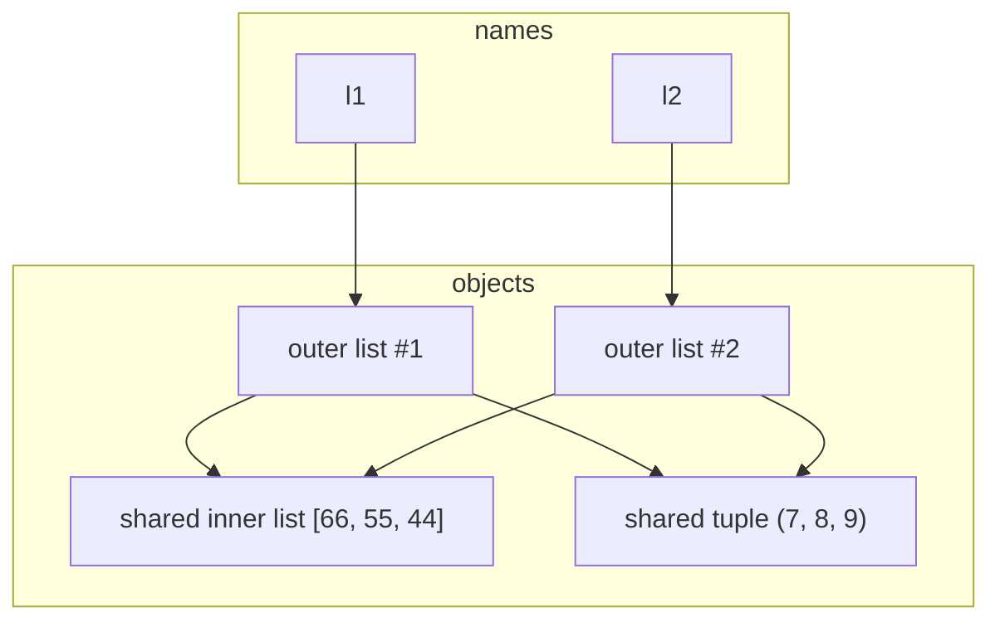
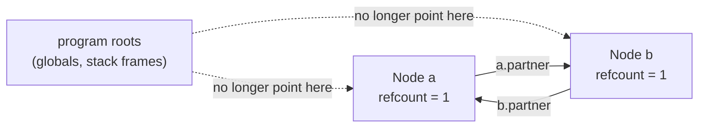

# Memory management — reference counting, the cyclic collector, and weak references

*Why destruction in CPython is immediate rather than eventual, what a reference cycle defeats about that guarantee, and what changes once there is no GIL left to lean on.*

**Level:** L4 · **Prerequisites:** [01 object model and attribute lookup](01_object_model_and_attribute_lookup.md)
**Covers:** PY-04
**Sources:** Ramalho, *Fluent Python* 2nd ed. ch.6 (2022) · Beazley, *Advanced Python Mastery* §2–3 (2024) · CPython memory management reference, docs.python.org · PEP 442 (2013) · PEP 683 (2021) · PEP 703 (2023) · PEP 779 (2025)

---

## 1. The problem this solves

Nothing in ordinary Python code ever frees memory explicitly. There is no `free`, no `delete`, no block that must be matched with a corresponding release:

```python
class Account:
    def __init__(self, owner):
        self.owner = owner

def process():
    a = Account("alexandro")
    print(a.owner)
# a goes out of scope here — and the object it named is gone
```

Something still has to reclaim that memory, and the honest first question is *when*. In a language with a tracing garbage collector — the JVM, most JavaScript engines — the answer is "eventually, whenever the collector next runs," which is a real design choice with a real cost: an object holding a file handle or a network socket cannot be trusted to release it promptly, because "eventually" might be milliseconds or might be much longer under load. CPython answers differently, and the difference is a large part of why context managers (`with`, chapter 2) are the idiomatic way to manage a resource in this language rather than a strictly necessary one: **CPython destroys an object the instant nothing refers to it anymore**, deterministically, not at the next convenient pause. `process()` above frees `Account("alexandro")`'s memory synchronously, as part of the function returning — not later, not "probably soon."

This is also why Python code so rarely worries about memory management explicitly, in a way that reads as almost suspicious to someone arriving from a language that makes allocation and deallocation a first-class concern. The counting happens on every single reference assignment, function call, and container operation, automatically, as a side effect of running the program rather than as a separate concern a programmer has to track. That automation is precisely what makes the cycle below dangerous rather than merely awkward: nothing about the syntax that creates a cycle looks any different from the syntax that creates an ordinary, safely-collectible reference, so there is no visual cue in the code itself warning that this particular assignment is the one that defeats the mechanism everything else in the language quietly relies on.

That guarantee runs into a genuine problem the moment two objects refer to each other:

```python
class Node:
    def __init__(self, name):
        self.name = name
        self.partner = None

a = Node("a")
b = Node("b")
a.partner = b
b.partner = a
del a, b
```

After `del a, b`, no name in the running program refers to either `Node`. And yet, immediately after `a.partner = b` and `b.partner = a`, each object is referenced by the other — so if destruction is really driven by "does anything still refer to this object," neither one alone will ever answer "no." This is not a contrived edge case; it is what happens whenever a parent points at a child and the child points back at its parent, or whenever an object registers itself with an observer that it also holds a reference to. The counting mechanism this chapter opens with cannot resolve this by itself, which is exactly why CPython needs a second, entirely different algorithm layered on top of it — and understanding where the first one's guarantee actually comes from, and precisely why it cannot see a cycle, is what makes the second one make sense rather than feel like a bolted-on afterthought.

---

## 2. The mechanism, built up

### 2.1 Every object counts its own references, and zero means destroy now

Every Python object carries a hidden integer: how many references currently point to it. Creating a new binding to an object increments it; deleting a binding, rebinding a name, or a reference going out of scope decrements it. The moment that count reaches zero, CPython frees the object immediately, in the same line of code that dropped the last reference — there is no separate collection pass involved for this part at all.

```python
import sys

x = []
print(sys.getrefcount(x))     # 2
```

The count reads `2`, not `1`, for an object with exactly one name bound to it, and that extra count is not a bug to explain away: `sys.getrefcount` is itself a function call, and passing `x` to it creates a second, temporary reference for the duration of the call — the parameter inside `getrefcount`'s own frame. The count in this instant genuinely is two; it drops back to one the moment the call returns.

`__del__`, when defined, runs synchronously at exactly this moment — the instant the refcount hits zero — which is why chapter 1's contrast with the `CHECK`-constraint style of validation extends naturally here: destruction-time behavior in CPython is not "whenever the runtime gets around to it," it is a direct, traceable consequence of the last `del`, the last rebinding, or the last stack frame that held a reference going away.

### 2.2 A copy is shallow by default, which means references are shared, not objects

Reference counting only makes sense once it is clear what "a reference" actually is, and Python's answer — every variable is a reference to an object, never a box containing one — has a direct consequence for what copying means:

```python
l1 = [3, [66, 55, 44], (7, 8, 9)]
l2 = list(l1)
print(l2 == l1, l2 is l1)     # True False
l1.append(100)
print(l2)                      # [3, [66, 55, 44], (7, 8, 9)]  — unaffected
l1[1].append(999)
print(l2)                      # [3, [66, 55, 44, 999], (7, 8, 9)]  — affected
```

`list(l1)` builds a genuinely new list object, which is why appending to `l1` afterward does not touch `l2`. But the *outer* list is the only thing that got duplicated — the new list's second slot holds a reference to the exact same inner list `l1[1]` refers to, not a copy of it. Mutating that shared inner list through `l1` is visible through `l2`, because there is only one inner list object; both outer lists just point at it. This is what "shallow copy" means precisely: the container is duplicated, the things it refers to are not.



`copy.deepcopy` is the alternative that recursively duplicates everything reachable, rather than stopping at the outer container — and doing that correctly requires solving a smaller version of section 1's cycle problem: a deep copy of a structure that contains a reference to itself must not recurse forever.

```python
from copy import deepcopy

a = [10, 20]
b = [a, 30]
a.append(b)          # a now contains b, which contains a
c = deepcopy(a)
print(c is a)          # False — a genuine, independent copy
print(c[2][0] is c)    # True  — the copy's own cycle, correctly reconstructed
```

`deepcopy` keeps a memo dictionary, keyed by `id()`, of every object it has already copied during the current call; when it encounters `a` a second time while copying `b`, it recognizes the id and reuses the copy already in progress instead of recursing into `a` again. The result is a fully independent structure — `c is a` is `False` all the way down — that still has the same cyclic shape as the original, correctly reconstructed rather than infinitely unrolled.

### 2.3 Aliasing through function calls is the same mechanism, and a mutable default argument is where it bites hardest

Python passes arguments the same way it passes anything else: by handing the callee a reference, never a copy. A function that mutates a mutable argument mutates the caller's object, visibly, because there was only ever one object:

```python
def f(a, b):
    a += b
    return a

x, y = 1, 2
f(x, y); print(x, y)            # (1, 2) — ints are immutable; += rebinds locally

a, b = [1, 2], [3, 4]
f(a, b); print(a, b)            # ([1, 2, 3, 4], [3, 4]) — a was mutated in place
```

`a += b` means two different things depending on what `a` is, and section 2.1's reference-counting model is exactly why: for an immutable `int`, `+=` cannot mutate anything, so it rebinds the local name `a` to a new object, leaving the caller's `x` untouched. For a `list`, `+=` calls `__iadd__`, which extends the same list object in place — and because `a` inside `f` was never a copy of the caller's list, only a second reference to it, the caller sees the mutation.

The same fact turns dangerous the moment a default argument is a mutable object, because a function's default values are evaluated exactly once — when the `def` statement runs, not on every call — and stored as an attribute of the function object itself:

```python
class HauntedBus:
    def __init__(self, passengers=[]):
        self.passengers = passengers
    def pick(self, name):
        self.passengers.append(name)

bus2 = HauntedBus()
bus2.pick("Carrie")
bus3 = HauntedBus()
print(bus3.passengers)                    # ['Carrie'] — never picked up here
print(bus2.passengers is bus3.passengers) # True
```

Every `HauntedBus` constructed without an explicit `passengers` argument receives `self.passengers = passengers`, and `passengers` is the *same* list object every single time, because it was created once, at function-definition time, and lives on in `HauntedBus.__init__.__defaults__`. `bus2` and `bus3` are two different accounts silently sharing one passenger list, for exactly the reason section 2.2's shallow-copy figure predicts: no copy was ever made, only a second reference to an object that already existed. The fix is the idiom `passengers=None`, checked explicitly inside the function, so that each call with no argument gets a freshly created list rather than the one baked into the function at definition time.

### 2.4 A reference cycle keeps every object's count above zero forever

Section 1's `Node` example can now be stated precisely: `a` and `b` reference each other, so each object's refcount is `1` even after every external name is deleted — a reference exists, it simply does not originate from anywhere the running program can still reach.



Reference counting only ever asks "is this count zero," and it never was zero for either node — it is unreachable, which is a different and strictly weaker condition than "has zero references." This is precisely the gap CPython's second collector exists to close: rather than counting references, it periodically looks for groups of objects that only reference each other, with nothing from outside the group pointing in. CPython organizes candidate objects — container types that can participate in cycles, such as lists, dicts, and instances — into three **generations**, on the empirical assumption that most objects die young: a new object starts in generation 0, and survives into generation 1, then generation 2, each time a collection pass of its current generation does not reclaim it. `gc.get_threshold()` reports the count of allocations, tracked per generation, that triggers each generation's next collection pass — `(2000, 10, 10)` by default on the machine this chapter was checked against, meaning generation 0 is swept far more often than generations 1 and 2, which is where long-lived objects accumulate and where a full sweep is comparatively expensive.

```python
import gc
print(gc.get_threshold())    # (2000, 10, 10)
gc.collect()                  # force an immediate full collection, all generations
```

A newly created container-type object starts in generation 0. Every time generation 0 is swept and the object survives — because something outside the swept batch still reaches it — it is promoted to generation 1, and from there, surviving a generation-1 sweep promotes it to generation 2, the oldest tier, swept far less often than the other two. `gc.get_count()` reports how many allocations each generation has accumulated since its last sweep, which is what CPython actually compares against the thresholds above to decide when the next automatic collection of each tier fires. The promotion scheme is a direct bet on the same "most objects die young" observation that motivates the whole generational design: a request-scoped object that is going to become garbage almost always does so within its first sweep or two, so paying the cost of scanning it repeatedly in the oldest, most expensive generation would mostly be wasted work.

The algorithm the collector runs, once it decides to sweep a generation, is a variant of cycle detection that temporarily decrements a trial copy of each candidate object's refcount by the number of references coming from *other candidates in the same batch*; whatever is left with a positive count after that subtraction is reachable from something outside the cycle and is spared, and whatever drops to zero is part of an unreachable cycle and is collected. This is why the cyclic collector, unlike ordinary refcounting, has to look at groups of objects together rather than one object at a time — it is answering a fundamentally different question than "is anything using this," which is exactly the question refcounting cannot answer for a cycle.

### 2.5 `__del__` no longer blocks collection of a cycle

Before Python 3.4, an object defining `__del__` that also participated in a reference cycle created a genuine problem for the collector: the collector could see that a group of objects was unreachable, but it could not safely decide what *order* to finalize them in, because any one of their `__del__` methods might reach through `self` into another object in the same doomed group and resurrect a reference to it mid-finalization. CPython's answer at the time was to refuse the responsibility — such cycles were left uncollected, dumped into `gc.garbage` for a program to deal with manually, which meant a `__del__` method was, in practice, a way to leak memory in any code that also formed cycles.

PEP 442, "Safe object finalization," replaced that with an approach that clears an unreachable cycle's internal references *before* running any of its `__del__` methods, removing the resurrection hazard the old restriction existed to avoid. The mechanism now works cleanly:

```python
import gc, weakref

class Node:
    def __init__(self, name):
        self.name = name
        self.partner = None
    def __del__(self):
        print(f"Node {self.name} finalized")

a, b = Node("a"), Node("b")
a.partner, b.partner = b, a
ref = weakref.ref(a)
del a, b
gc.collect()
print(ref() is None)
```

```text
Node a finalized
Node b finalized
True
```

Both `__del__` methods run, the cycle is fully reclaimed, and `gc.garbage` stays empty — behavior that would have left both nodes stranded before PEP 442 landed. The historical hazard is worth carrying forward anyway, because it explains a still-current piece of advice: a `__del__` method should never assume anything about *when* it runs relative to other objects' finalizers in the same batch, since the collector processes an unreachable group together rather than in any object's own preferred order.

### 2.6 A weak reference is a way to opt out of counting entirely

Reference counting and the cyclic collector both assume that any reference to an object should keep it alive. `weakref` provides a third option: a reference that does not increment the count at all, and therefore never keeps its target alive on its own.

```python
import weakref

class Account:
    def __init__(self, acct_no):
        self.acct_no = acct_no

cache = weakref.WeakValueDictionary()
a = Account(1001)
cache[1001] = a
print(1001 in cache)     # True
del a
print(1001 in cache)     # False — the entry vanished on its own
```

`WeakValueDictionary` holds its values through weak references, so storing `a` in `cache` does not add to `a`'s refcount at all. The moment the last *ordinary* reference to the account (the local variable `a`) is deleted, the object's refcount reaches zero exactly as section 2.1 describes, it is destroyed immediately, and the cache entry — which was never counted as a keeper in the first place — is removed automatically. This is the direct, everyday application of the mechanism: a cache built this way never needs the cyclic collector to reclaim what it holds, and it never accidentally keeps an object alive just because something is still looking it up occasionally. The same tool applies to breaking a cycle deliberately — a child object holding a `weakref.ref` back to its parent, instead of an ordinary reference, means the parent-child pair is never a genuine cycle in section 2.4's sense, and the two objects can be collected by refcounting alone, the moment they are actually unreachable, rather than waiting for the next generational sweep.

### 2.7 Where the memory actually lives, and why freed memory does not always shrink a process

Every container object in CPython holds pointers to its elements, not the elements themselves — a list of five objects is, physically, a small array of five pointers, with the actual objects living wherever they were separately allocated. This is what makes container operations cheap regardless of what they hold: appending to a list copies one pointer, never the object it points to, and a shallow copy (section 2.2) is cheap for the identical reason — it duplicates the pointer array, not what the pointers reference.

Lists specifically over-allocate on growth: appending past a list's current capacity requests more slots than the single new element needs, so that the next several `append()` calls need no further allocation at all. This trades a small amount of unused reserved space for making the common case — appending one item at a time — fast on average rather than paying an allocation cost on every single call.

Below the container level, CPython's small-object allocator, **pymalloc**, handles allocations of 512 bytes or smaller — the overwhelming majority of everyday Python objects — through fixed-size memory mappings called **arenas**, 1 MiB each on 64-bit platforms per CPython's own memory-management documentation. An arena is only released back to the operating system once every allocation inside it has been freed; a single long-lived object sitting inside an otherwise-empty arena is enough to keep that entire megabyte mapped to the process. This is the mechanism behind a common and confusing observation: a program's reported memory usage (its RSS, resident set size) frequently does not drop after a large, short-lived data structure is deleted, even though every object in it was correctly and promptly destroyed by reference counting. The memory was freed at the Python level the instant it became unreachable; what stayed mapped is the underlying arena, held open by whatever else — however small — still lives inside it. `sys.getsizeof`, as chapter 1 already established, answers a narrower question than either of these mechanisms; `tracemalloc` is the tool that actually attributes live allocations to the code that made them, which is what makes it the right instrument for investigating memory behavior at this level rather than guessing from process-level RSS alone.

### 2.8 Under the free-threaded build, the counting itself changes

Everything in sections 2.1 through 2.6 describes the default CPython build, where the GIL serializes access to the interpreter and makes an ordinary, non-atomic increment or decrement of a refcount safe by construction — only one thread ever touches Python objects at a time, so there is no possibility of two threads racing on the same counter. That safety argument disappears entirely under the free-threaded build.

Free threading — experimental starting in Python 3.13, and promoted to officially supported status for Python 3.14 by PEP 779, accepted by the Steering Council in mid-2025 — removes the GIL, which means two threads genuinely can execute Python bytecode simultaneously and could, in principle, corrupt an object's refcount by incrementing and decrementing it at the same instant. PEP 703, the proposal that defines free-threaded CPython's design, answers this with **biased reference counting**: each object records an "owning" thread, and that thread updates a *local* count field with ordinary, fast, non-atomic instructions, while every other thread updates a separate *shared* count field using slower atomic instructions. The split exploits the same fact the PEP states directly — most objects, even in a heavily multithreaded program, are only ever touched by one thread — so the fast, uncontended path is common and the slow, correctness-preserving path is rare.

A second, independent optimization changes the picture further for a specific class of object. PEP 683 makes certain runtime-global objects — `None`, `True`, `False`, small cached integers, and every static type object — **immortal**: marked with a special refcount value that `Py_INCREF` and `Py_DECREF` recognize and treat as a no-op, so these objects' reference counts never change at all, by design, for the life of the process. This exists independently of free threading — it also reduces ordinary cache-line contention on the GIL-enabled build — but it matters more once refcount updates are no longer free of contention risk, because an immortal object needs neither the fast path nor the slow path section above describes; it needs no path at all. The set of immortal objects narrowed between 3.13 and 3.14, from all module-level code and type objects down to interned strings and code constants specifically, which is worth knowing before assuming any particular object is immune to refcounting overhead based on its type alone.

None of this changes what section 2.1 through 2.6 describe as *observable* behavior — an object is still destroyed the instant it becomes unreachable, a cycle still needs the generational collector, `weakref` still opts an object out of counting — only how the counting is physically implemented underneath. The mechanism itself, the concurrency it interacts with, and the migration path for extension modules that assumed the GIL's protection are the free-threading chapter's subject on this shelf, not this one's.

---

## 3. Diagrams

The shallow-copy aliasing diagram in section 2.2 and the unreachable-cycle diagram in section 2.4 are integrated into the mechanism build-up above, as this format requires.

---

## 4. Failure modes

### 4.1 A mutable default argument is shared across every call that does not override it

```python
# Gist: haunted_bus.py
class HauntedBus:
    def __init__(self, passengers=[]):
        self.passengers = passengers
    def pick(self, name):
        self.passengers.append(name)

bus2 = HauntedBus()
bus2.pick("Carrie")
bus3 = HauntedBus()
print(bus3.passengers)
```

```text
['Carrie']
```

`bus3` was never given a passenger, and it already has one. Section 2.3 traced the exact cause: `passengers=[]` creates the empty list once, when `__init__` is compiled, not once per call, and every `HauntedBus` built without an explicit argument receives a reference to that same list. `bus2.pick("Carrie")` mutates it in place, and `bus3`, constructed afterward with no arguments at all, sees the mutation because `bus2.passengers is bus3.passengers` is `True` — they were never two lists to begin with. This defect is unusually good at surviving code review and a first pass of manual testing, because it only manifests once two instances are both built with the default and then used far enough apart in the code that the connection between them is not obvious; a test that only ever constructs one instance at a time will never observe it. The fix is `passengers=None`, checked explicitly and replaced with a freshly constructed list inside the function body, which costs one `if` and is the idiomatic answer to every version of this defect regardless of which mutable type is involved.

### 4.2 A reference cycle keeps two objects alive until the next collector sweep, not until the last name is deleted

```python
# Gist: cycle_timing.py
import gc

class Session:
    def __init__(self, name):
        self.name = name
        self.parent = None

gc.disable()
s1, s2 = Session("s1"), Session("s2")
s1.parent, s2.parent = s2, s1
del s1, s2
# both Session objects are unreachable here, but neither has been destroyed
```

With the collector disabled, both sessions remain allocated indefinitely after `del s1, s2` — unreachable from anywhere the program can still name, per section 2.4, but never at a refcount of zero, because each still holds the other. Nothing raises an error and nothing looks obviously wrong; the program simply accumulates memory it will never use again, at a rate proportional to how often this kind of cycle is created, until either the collector runs or the process exits. This is the shape of a real production memory leak in Python far more often than an ordinary forgotten reference is — a single un-collected list left lying around is easy to spot in a heap profile, while a steady trickle of small, mutually-referencing objects accumulating across thousands of requests looks, from the outside, like ordinary long-run memory growth. The fix, when the cyclic relationship is structural rather than accidental — a parent-child or observer-subject pair that is expected to reference both ways — is to make one direction of the reference a `weakref.ref` instead of an ordinary one, per section 2.6, so the pair is never a true cycle and refcounting alone reclaims it the instant it is truly unreachable; when the cycle is accidental, the fix is simply not to create it, typically by having a child object drop its reference to its parent explicitly once it is done rather than relying on the parent's own lifetime to end first.

### 4.3 A `__del__` method that resurrects `self` produces a warning and a leaked object, not a clean revival

```python
# Gist: del_resurrection.py
import gc

undead = []

class Zombie:
    def __del__(self):
        undead.append(self)   # re-adds a reference during finalization

z = Zombie()
del z
print(len(undead))
```

```text
1
```

`__del__` running does not mean the object is required to actually go away — appending `self` to a list that outlives the call gives the object a brand-new reference at the exact moment its refcount would otherwise have reached zero for good, and CPython's finalization logic detects this and leaves the object alive rather than freeing memory a live reference still points to. `undead` now holds a fully functional `Zombie`, `__del__` will not run again automatically when this second reference is eventually dropped in the same way the first one was — Python does not repeatedly attempt finalization on an object that has already been finalized once — so any cleanup logic written under the assumption that `__del__` fires exactly once per object's true end of life is now wrong for this specific instance. This is precisely the resurrection hazard PEP 442 (section 2.5) was designed to make *safe* rather than to prevent outright: safety here means the interpreter does not crash or corrupt memory, not that the resurrection is harmless to the program's own logic. The practical fix is the same advice that governs `__del__` generally — treat it as an opportunity to release external resources (file handles, sockets, locks), never as a place to re-establish the object's presence in the running program, and prefer an explicit `close()`-style method plus a context manager (chapter 2) for anything that genuinely needs deterministic, callable-on-demand cleanup.

---

## 5. Trade-offs

| Approach | Use when | Because | Real cost |
| --- | --- | --- | --- |
| **Rely on refcounting alone** | The object graph is acyclic — trees, plain data, most everyday code | Destruction is immediate and deterministic, with no collector pause to reason about | Silently does nothing for a cycle; the object graph has to actually stay acyclic for this guarantee to hold |
| **Let the generational collector handle cycles** | Cyclic structures exist but are not performance-critical to reclaim instantly | No extra code; `gc` runs automatically at its default thresholds | Collection is deferred to the next sweep of the relevant generation, not immediate, and a full sweep has a real (if usually small) pause cost |
| **`weakref` to break a cycle deliberately** | A parent-child or cache relationship is expected to reference both ways | Removes the cycle from existence; refcounting alone reclaims the pair immediately | The weak side can vanish out from under code that forgot to check for it — every read through a `weakref.ref` must handle `None` |
| **Explicit `close()` / context manager over `__del__`** | An external resource (file, socket, lock) must be released at a known, controllable moment | Deterministic and callable on demand, unlike `__del__`, which fires only at an object's actual end of life | Requires the caller to remember to use it — a context manager enforces this; a bare `close()` method does not |
| **Deep copy instead of shallow** | The copy must be fully independent of the original, including everything it references | No aliasing at all, cycle-safe via `deepcopy`'s memo dictionary | Full traversal and duplication of the entire reachable graph — real time and memory cost proportional to the whole structure, not just the outer container |

### When not to reach for `weakref`

A weak reference is the right tool specifically when the referenced object's lifetime should be governed by something *other* than this particular reference — a cache, an observer list, a back-pointer in a cyclic structure. It is the wrong tool when the reference is the thing that is actually supposed to keep the object alive: reaching for `weakref` reflexively, out of general caution about memory, produces code that has to check for `None` on every access and that can lose an object precisely when nothing else happens to be holding it — which, if the object was actually meant to persist, is a bug the weak reference introduced rather than one it solved.

### When not to define `__del__` at all

Section 4.3's resurrection hazard, combined with the fact that `__del__`'s timing is tied to reference counting and collector sweeps rather than to any point a program controls directly, makes it a poor default choice for resource cleanup even though it looks like the natural place to put it. The rejected alternative that should be reached for instead, in nearly every real case, is a context manager (chapter 2): `__exit__` runs at a point the code controls explicitly, every time, with the exception state available if something went wrong, none of which `__del__` can promise. `__del__` earns its place only as a defensive last resort — a safety net that closes a resource if a caller forgot to use the context manager at all — never as the primary cleanup path.

### The case against disabling the collector for performance

`gc.disable()` is a real, sometimes-recommended technique for a short-lived script that allocates heavily and exits quickly enough that leaked cycles never matter — a batch job, a command-line tool — because every collection pass costs time that a program which never reaches its later generations does not need to spend. It is the wrong default for a long-running service for exactly the reason section 4.2 demonstrates: a service that runs for hours or days and forms even a slow trickle of reference cycles will accumulate them indefinitely with the collector off, turning a bounded, self-correcting overhead into an unbounded one. The rejected alternative to disabling it wholesale is tuning the thresholds — raising generation 0's trigger count so that a program which allocates heavily but briefly still gets full sweeps of the older generations — which keeps the safety net in place while reducing how often the cheapest, most frequent sweep runs.

### When acyclic-by-design beats relying on the collector

For a data structure with a genuinely large number of short-lived nodes — a tree rebuilt frequently, a request-scoped graph of objects — designing it to never contain a cycle in the first place (parent references as `weakref.ref`, or omitted entirely in favor of passing context explicitly where it is needed) keeps every node's lifetime governed by ordinary refcounting, reclaimed the instant it is unreachable. The rejected alternative — building the structure with ordinary bidirectional references and trusting the generational collector to clean it up — costs a real, if usually small, delay between "unreachable" and "actually reclaimed," multiplied across however many such structures the program builds and discards over its lifetime; at high enough volume, that delay is the difference between flat and slowly climbing memory usage.

---

## 6. Reference summary

**CPython destroys an object the instant its reference count reaches zero** — synchronously, not at some later collector pause — which is why `__del__`, when defined, has a precise and traceable moment it runs. `sys.getrefcount` reads one higher than expected because the call itself holds a temporary reference to its argument.

**A copy is shallow by default**: `list(x)`, `x[:]`, and `copy.copy(x)` duplicate the outer container only, leaving every element as a shared reference with the original — mutating a shared mutable element through either copy is visible through both. **`copy.deepcopy` recursively duplicates everything reachable**, using an `id()`-keyed memo dictionary to detect and correctly reconstruct cycles rather than recursing into them forever.

**Arguments are passed by sharing a reference, never by copying the object.** A mutable default argument is evaluated exactly once, at function-definition time, and stored on the function object — every call that omits the argument receives the identical object, which is the mechanism behind the classic shared-mutable-default defect. The fix is a `None` default checked explicitly inside the function body.

**A reference cycle keeps every object in it at a refcount above zero even when the whole group is unreachable from any live name**, because refcounting can only ask "is this object's own count zero," never "is this object reachable from a root." CPython's generational cyclic collector answers the reachability question instead, organizing candidate objects into three generations under the assumption that most objects die young, and reclaiming an unreachable group by simulating what each member's refcount would be with only intra-group references removed.

**`__del__` no longer blocks cycle collection** (PEP 442, Python 3.4): an unreachable cycle's internal references are cleared before any of its `__del__` methods run, removing the resurrection hazard that previously left such cycles permanently uncollected in `gc.garbage`. A `__del__` that re-adds a live reference to `self` during finalization still succeeds in reviving the object, but finalization does not run a second time for it.

**A `weakref` does not increment an object's reference count**, so it never keeps its target alive on its own; `WeakValueDictionary` is the standard tool for a cache that should not outlive its entries, and a deliberate weak back-reference is the standard way to prevent a parent-child relationship from becoming a true reference cycle in the first place.

**Small objects are allocated from fixed-size pymalloc arenas** — 1 MiB each on 64-bit platforms — **released back to the operating system only once completely empty**, which is why a process's reported memory usage does not necessarily shrink right after a large structure is freed: the objects were reclaimed correctly, but the arena holding them may still contain something else. `tracemalloc`, not `sys.getsizeof`, is the tool that attributes live memory to the code that allocated it.

**Under the free-threaded build (PEP 703, officially supported for 3.14 per PEP 779), ordinary non-atomic refcounting is no longer safe**, and is replaced by biased reference counting: a fast, non-atomic path for an object's owning thread, and a slower, atomic path for every other thread. **PEP 683 immortal objects** — `None`, `True`, `False`, small cached integers, static type objects, narrowed to interned strings and code constants as of 3.14 — skip reference counting entirely via a reserved refcount value, independent of which build is in use. None of this changes what a program observes; it changes only how the counting is implemented underneath.

For a reader coming from the default, GIL-enabled build, the practical takeaway is narrower than the mechanism sounds: nothing in this chapter's code examples behaves any differently under free threading, and no application-level code needs to change to account for biased reference counting or immortal objects. The place this surfaces in practice is in C-extension code that manually manipulated refcounts under assumptions the GIL used to guarantee — that concern, and the migration path for it, belongs to the concurrency chapters on this shelf rather than to ordinary Python-level memory management.

---

← [Python knowledge graph](00_knowledge_graph.md) · [repo index](../README.md)
