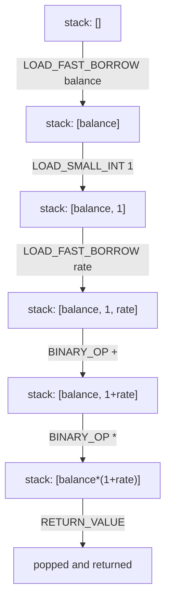
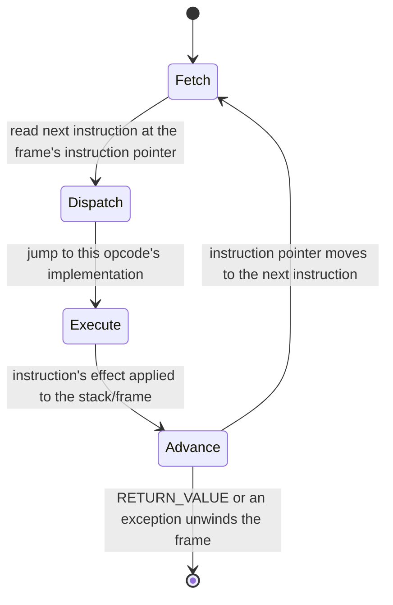

# Bytecode and the runtime — what `dis` shows, and the machine underneath the syntax

*A stack machine, a per-call frame, and a specializing interpreter that has changed twice since most books on this shelf were written.*

**Level:** L5 · **Prerequisites:** [01 object model and attribute lookup](01_object_model_and_attribute_lookup.md)
**Covers:** PY-05
**Sources:** Beazley, *Advanced Python Mastery* §2 (2024) · Wilson, *Software Design by Example*, ch. "A Virtual Machine" (2026) — a contrasting register machine, not a description of CPython's own · `dis` and `timeit` documentation, docs.python.org · PEP 659 (2021) · PEP 744 (2024) · *What's New in Python 3.14*, docs.python.org

---

## 1. The problem this solves

A piece of folklore travels through nearly every Python codebase eventually: reading a local variable is faster than reading a global one, so a hot loop should copy a module-level name into a local before iterating. It is true, and stated as bare advice it is exactly the kind of unattributed performance claim this book's sourcing rules exist to keep out — a rule with no mechanism behind it is not something a reader can apply correctly to a case the rule-of-thumb did not anticipate. The mechanism is available, directly, from the same interpreter running the code:

```python
def apply_local(balance, rate):
    return balance * (1 + rate)
```

Python never executes this source text. It compiles it once, into a sequence of instructions for a small, specific virtual machine built into CPython, and it is that instruction sequence — not the Python source — that actually runs every time the function is called. `dis.dis` shows it directly, and reading it answers the folklore question precisely rather than by reputation.

This is also, honestly, a chapter this shelf's own books cannot carry alone, which is worth stating rather than hiding. Neither Ramalho nor the FastAPI-focused texts on this shelf disassembles CPython bytecode at all, and Beazley's 2024 material touches builtin-object memory layout without going near the instruction set; Wilson's contribution is a small register machine built for a different book entirely, valuable here only as a contrast that makes CPython's own stack-machine design easier to see by comparison, not as a description of it. Treating "the interpreter" as a black box has a real cost beyond one piece of folklore. A traceback is, mechanically, a chain of frame objects; a decorator's replacement of a function (chapter 3) is a change in what name a call instruction resolves against, not a change to the eval loop itself; and the difference between a method call and a plain function call, however it is explained at the syntax level, is ultimately a question of which bytecode sequence the compiler emitted. None of the earlier chapters on this shelf were wrong to describe these mechanisms in terms of the object model and the protocols built on top of it — that is the right altitude for understanding what code *means*. This chapter is about the layer underneath that: what the interpreter is actually doing, instruction by instruction, to make all of it true.

That gap would matter less if the instruction set had been stable for the last decade, but it has not: Python 3.11 shipped a specializing interpreter that rewrites hot bytecode into faster variants at runtime, 3.14 added new opcodes that skip reference-counting work entirely when the interpreter can prove it is safe, and an experimental JIT compiler now sits on top of both in current CPython builds. A reader relying on any book published before 2021 for this specific mechanism is reading about a machine that no longer exists in the form described. What follows is built from the interpreter directly, on the version it names, rather than from a secondary description of an interpreter that changed underneath it.

---

## 2. The mechanism, built up

### 2.1 The smallest disassembly, and the stack machine it reveals

```python
def apply_local(balance, rate):
    return balance * (1 + rate)
```

```text
  RESUME                   0
  LOAD_FAST_BORROW         0 (balance)
  LOAD_SMALL_INT           1
  LOAD_FAST_BORROW         1 (rate)
  BINARY_OP                0 (+)
  BINARY_OP                5 (*)
  RETURN_VALUE
```

`dis.dis(apply_local)` on CPython 3.14 produces exactly this. Every instruction here operates on a **stack** — a last-in-first-out list of values, private to this one function call — rather than on named registers, which is the single fact that makes the rest of the listing readable as a story rather than a table. `LOAD_FAST_BORROW 0 (balance)` pushes the value of the first local variable. `LOAD_SMALL_INT 1` pushes the literal `1`. `LOAD_FAST_BORROW 1 (rate)` pushes the second local. `BINARY_OP 0 (+)` pops the top two values off the stack — `1` and `rate` — and pushes their sum back on. `BINARY_OP 5 (*)` pops the sum and `balance`, multiplies them, and pushes the result. `RETURN_VALUE` pops that final value and hands it back to the caller.



Every operator, every function call, every attribute access in Python compiles down to some sequence of pushes, pops, and an instruction that consumes what it needs from the top of this stack. `RESUME`, the first instruction in every function, does no visible work in ordinary execution; it exists as a fixed point the specializing interpreter can hook into, which section 2.5 returns to. `LOAD_FAST_BORROW` and `LOAD_SMALL_INT`, rather than the plainer `LOAD_FAST` and `LOAD_CONST` a book written before 2024 would show, are themselves part of this chapter's currency correction — section 2.6 explains exactly what changed and why.

Both `BINARY_OP` instructions in this listing are themselves a consolidation rather than two historically separate opcodes. Before Python 3.11, addition and multiplication compiled to distinct instructions — `BINARY_ADD`, `BINARY_MULTIPLY`, and roughly a dozen more, one per operator, plus a parallel set for each operator's in-place form (`+=`, `*=`, and so on). 3.11 merged the whole family into one `BINARY_OP` instruction whose operand — the `0` and `5` visible in the listing above — selects which actual operation runs, on the reasoning that section 2.5's specializing interpreter would very quickly rewrite the common cases into their own fast paths regardless of how many distinct generic opcodes existed underneath. A disassembly from a pre-3.11 interpreter naming `BINARY_ADD` and one from 3.11 onward naming `BINARY_OP 0 (+)` are describing the identical arithmetic; only the *generic* instruction's name changed, which is worth knowing before assuming a listing from an older book or blog post is simply wrong.

### 2.2 A local variable is a fixed array slot; a global is a dictionary lookup by name

The folklore from section 1 has a precise mechanism, visible by disassembling the same expression written two ways:

```python
GLOBAL_RATE = 0.05

def apply_local(balance, rate):
    return balance * (1 + rate)

def apply_global(balance):
    return balance * (1 + GLOBAL_RATE)
```

```text
apply_local:
  LOAD_FAST_BORROW         0 (balance)
  LOAD_SMALL_INT           1
  LOAD_FAST_BORROW         1 (rate)
  BINARY_OP                0 (+)
  BINARY_OP                5 (*)
  RETURN_VALUE

apply_global:
  LOAD_FAST_BORROW         0 (balance)
  LOAD_SMALL_INT           1
  LOAD_GLOBAL              0 (GLOBAL_RATE)
  BINARY_OP                0 (+)
  BINARY_OP                5 (*)
  RETURN_VALUE
```

The two listings differ in exactly one instruction. `LOAD_FAST_BORROW 1 (rate)` reads index `1` out of the frame's own array of local slots — `rate`'s position was decided once, at compile time, from the function's parameter list, and reading it at runtime is nothing more than array indexing. `LOAD_GLOBAL 0 (GLOBAL_RATE)` has no fixed slot to read: it looks the name `GLOBAL_RATE` up by name, at the moment the instruction runs, in the module's namespace — a `dict`, per the object model this shelf already covers. A dictionary lookup, however fast dict.h makes it, is not the same operation as reading a known array index, and that difference — not a vague notion that "locals are just faster" — is the entire content of the folklore rule. It also explains the rule's real limit: copying a global into a local before a loop helps exactly because it turns a name lookup done once per iteration into a slot read done once per iteration, and it helps *only* to the degree that the loop body would otherwise repeat that same global lookup many times; copying a global that is read once has nothing to gain.

### 2.3 A frame is where a function call's locals and its position in the call stack actually live

Every call to a Python function creates a **frame** object: the local-variable array section 2.2 describes, plus a reference to the code object being executed, the globals dictionary it runs against, and a pointer back to the frame that called it.

```python
import sys

def outer():
    x = 1
    return inner()

def inner():
    caller = sys._getframe(1)
    print(caller.f_code.co_name)     # outer
    print(caller.f_locals)           # {'x': 1}

outer()
```

`sys._getframe(1)` reaches one level up the call stack from `inner` and returns `outer`'s frame directly, and `f_locals` shows exactly the local-variable state section 2.2's `LOAD_FAST_BORROW` instructions are reading and writing. This is the same call stack chapter 4 relies on implicitly when it describes a reference going out of scope at the end of a function — "the frame is popped" and "the local variable's reference is gone" are the same event, described from two different angles. It is also, concretely, what distinguishes an ordinary local variable from the free variables chapter 3 covers: a closure's cell lives independently of any one frame, specifically so it can outlive the frame that created it, while an ordinary `LOAD_FAST_BORROW` slot exists only for the lifetime of the one call that owns it.

A traceback, the object attached to every caught exception, is built from exactly this chain: each frame the exception passed through on its way up the call stack contributes one entry, in order, which is why a traceback reads as a list of function calls nested inside one another — it is, quite literally, a snapshot of consecutive `f_back` links taken at the moment the exception was raised. Section 3.4 returns to this directly, because a frame kept alive through a retained traceback is kept alive along with every local variable it was holding at the time, whether or not anything about the exception itself needed them.

### 2.4 The eval loop is a dispatch table, executed one instruction at a time

CPython's interpreter core — the "eval loop," found in the C source as a function historically named `_PyEval_EvalFrameDefault` — is, at the shape this chapter cares about, a loop that repeatedly reads the next instruction from the current frame's code, and jumps to whatever C code implements that specific opcode.



"Jumps to whatever C code implements that specific opcode" is doing real work in that sentence: on compilers that support it, CPython builds this dispatch as a table of computed gotos — one jump target per opcode, indexed directly by the opcode's numeric value — rather than as an ordinary `switch` statement, specifically because a long `switch` forces every dispatch through a single comparison chain or jump table that the CPU's branch predictor handles worse than a computed goto's more direct, per-opcode jump. This detail belongs to the C implementation, not to anything visible from Python, and no example in this chapter depends on it; it is worth knowing only because it explains why the eval loop's dispatch overhead — the cost paid before an instruction's actual work even begins — has been a standing target for the optimizations sections 2.5 through 2.7 describe, rather than something CPython left unexamined.

This is why `dis.dis`'s output is not merely documentation of what happened — it is, instruction for instruction, minus the specialization section 2.5 introduces, the actual sequence of jumps the eval loop performs. Every Python-level operation this shelf has covered — a `for` loop's repeated calls to `__next__`, a decorator's replacement of a function, an attribute read walking a type's MRO — eventually bottoms out as some sequence of these opcodes executing inside this same loop, on the same per-frame stack. There is no second, separate execution engine underneath the object model and protocol chapters already covered; this loop is the machine those chapters have been describing the effects of all along.

### 2.5 The specializing interpreter rewrites hot instructions in place

Python 3.11 changed what `dis.dis` shows for a program that has actually run for a while, via the mechanism **PEP 659** calls the specializing adaptive interpreter. A generic instruction like `LOAD_ATTR` starts out exactly as general as it has always been — walking the full lookup chapter 1 describes, on every single execution — but it now carries reserved space, immediately after it in the instruction stream, for a small inline cache:

```text
LOAD_ATTR                0 (balance)
CACHE                    0 (counter: 0)
CACHE                    0 (version: 0)
CACHE                    0
CACHE                    0 (keys_version: 0)
CACHE                    0
CACHE                    0 (descr: 0)
CACHE                    0
CACHE                    0
CACHE                    0
```

`dis.dis(..., show_caches=True)` reveals these entries directly; ordinary `dis.dis` hides them because they are not separate instructions a programmer wrote, only reserved storage the interpreter fills in as it learns. The first several times this `LOAD_ATTR` executes, it runs the ordinary, general lookup and increments the `counter` cache entry. Once that counter crosses an internal threshold, the interpreter **specializes** the instruction in place — rewriting it, in memory, to a narrower variant such as `LOAD_ATTR_INSTANCE_VALUE`, which records the specific type it has seen (`version`) and the exact offset the value lives at, so that every subsequent execution skips the general MRO walk and reads the value directly. If a later call arrives with a differently-shaped object — a different type, or an instance whose `__dict__` layout has changed — the specialized instruction's guard fails, and it **de-optimizes**, falling back to the general form rather than returning a wrong answer.

The lookup order chapter 1 documents is unchanged by any of this — specialization is a cache over the *result* of that lookup for a stable call site, never a different rule for what the result should be, and a program that only ever calls `LOAD_ATTR` on one shape of object is, after warm-up, running a version of the instruction with the same guarantees but far less repeated work per call.

### 2.6 New opcodes trade a reference-count bump for a proof that one is not needed

Python 3.14 extended specialization with a narrower, more targeted change: `LOAD_FAST_BORROW`, the instruction section 2.1 already showed in place of the older `LOAD_FAST`. An ordinary `LOAD_FAST` pushes a local variable's value onto the stack and increments its reference count, because the stack is now a second place that value is reachable from and chapter 4's counting discipline has to stay accurate. `LOAD_FAST_BORROW` skips that increment entirely, in the specific cases the compiler can prove it is safe — when the frame's own reference to the local is guaranteed to outlive the borrowed reference sitting briefly on the stack, which is true for the overwhelming majority of ordinary reads. `LOAD_SMALL_INT`, alongside it, pushes a small integer directly by its value rather than looking it up in the code object's constant table at all.

Both are, in effect, the specializing interpreter's underlying philosophy applied one level lower: not "cache the result of an expensive lookup," section 2.5's trick, but "recognize a case where an entire category of bookkeeping was never actually necessary, and stop paying for it." Neither opcode changes what a program observes — a borrowed reference on the stack behaves identically to an owned one for every purpose visible to Python code — which is the same guarantee chapter 4 stresses about biased reference counting under free threading: the implementation gets more specific about when work is genuinely required, and the language's own semantics do not move at all.

### 2.7 An experimental JIT sits on top of the specializing interpreter, off by default

**PEP 744** describes the next tier above specialization: a **copy-and-patch JIT** that assembles short traces of already-specialized instructions into small blocks of real machine code, skipping the eval loop's fetch-dispatch cycle entirely for the instructions it covers. It is not enabled in a standard CPython build by default in either 3.13 or 3.14 — it requires the interpreter itself to have been built with `--enable-experimental-jit`, a compile-time flag most Linux distribution packages of Python do not pass, though the official 3.14 installers for Windows and macOS now ship JIT-capable binaries. Even on a JIT-capable build, the feature is typically off until explicitly requested at runtime with the environment variable `PYTHON_JIT=1` — a JIT-capable build defaults to *not* running the JIT unless it was configured with `--enable-experimental-jit=yes` specifically, as opposed to the `yes-off` variant that ships built but inactive.

PEP 744 itself is candid about where the project currently stands: it states the JIT is, at the time of writing, "about as fast as the existing specializing interpreter on most platforms" — parity, not yet a clear win — and names the bar for graduating out of experimental status as a "meaningful performance improvement for at least one popular platform (realistically, on the order of 5%)," a bar the PEP states has not yet been met. This is worth stating plainly rather than rounding up to a success story: as of Python 3.14, the JIT is real, shippable, and still explicitly experimental by its own governing document's own account, at a real memory cost the same PEP estimates at roughly ten to twenty percent above the base interpreter's footprint.

### 2.8 Identity on small integers and literal strings is a caching detail, not a language guarantee

`co_consts`, the constant table section 2.2's `LOAD_SMALL_INT` bypasses for the smallest integers, is only part of the identity story. CPython separately caches every integer from `-5` to `256` as a shared singleton, and interns many string literals, purely as a memory and speed optimization with no guarantee attached to it:

```python
def make(n):
    return n + 0     # a genuine computation, not a literal shared via co_consts

for v in (5, 256, 257, -5, -6):
    a, b = make(v), make(v)
    print(v, a is b)
```

```text
5 True
256 True
257 False
-5 True
-6 False
```

Values inside the cached range compare identical across two entirely separate computations; values one step outside it do not, on the same interpreter, with the same code, differing only in the number involved. Nothing about the language specifies this boundary — it is a CPython implementation choice, not part of the language reference, and Ramalho's own account of this shelf's material is explicit that the criteria are undocumented and not something to depend on. `is` answers "are these genuinely the same object," which is a question about the runtime's internal bookkeeping; `==` answers "do these compare equal," which is the question almost every piece of code actually means to ask, and section 3.1 covers exactly what breaks when the two are confused.

### 2.9 Measuring any of this honestly means distrusting a single number

Everything in this chapter is a claim about *mechanism* rather than about *how many nanoseconds* — deliberately, because a timing figure is only ever true of the specific machine it was measured on, and every section above holds regardless of which machine runs it. Measuring performance correctly is still part of this subject, and Python's own `timeit` module is built around two decisions worth understanding rather than memorizing as trivia.

`timeit` disables the cyclic collector for the duration of a timing run by default, and its own documentation states the reason directly: doing so "makes independent timings more comparable," at the acknowledged cost that a collection pause genuinely triggered by the code under test will not show up in the result — a choice to measure the steady-state cost of an operation rather than its occasional worst case. The module's documentation is equally direct about which statistic to trust once several timings have been collected: "the lowest value gives a lower bound for how fast your machine can run the given code snippet," while higher values in the same batch are typically explained by an unrelated process briefly interfering with the measurement rather than by any real variability in the code itself — which is why the documentation states plainly that the minimum, not the mean, "is probably the only number you should be interested in." A single manually-timed run with `time.time()` around one execution has neither protection: no isolation from the collector, and no repeated sample to take a minimum of, which is precisely why such a measurement cannot be trusted to distinguish a real difference from ordinary noise, and why nothing in this chapter reports a bare timing figure as if one interpreter run had settled the question.

---

## 3. Failure modes

### 3.1 Using `is` on integers or strings works until the value crosses an undocumented boundary

```python
# Gist: interning_trap.py
def make(n):
    return n + 0

small = make(200)
big = make(2000)

if make(200) is small:
    print("treating cached small ints as always identical")
if make(2000) is big:
    print("this line will not run")
else:
    print("2000 is not cached — a fresh object every time")
```

```text
treating cached small ints as always identical
2000 is not cached — a fresh object every time
```

Section 2.8 already showed the exact boundary: CPython caches integers from `-5` to `256`, and nothing outside that narrow, undocumented range is guaranteed to be the same object twice, even when computed identically. Code that happens to use small test values during development — account IDs starting at `1`, quantities under a hundred — can pass every manual check while relying on `is` instead of `==`, and then fail silently and intermittently the moment production data includes a value outside the cached range, with no exception anywhere: the `if` branch simply evaluates to `False` when the author expected `True`, and the program continues, wrong. The fix is unconditional: never use `is` to compare values for equality, only to compare identity deliberately (checking for `None`, or checking that two names refer to the literal same object) — `==` is correct in every case `is` happened to work by coincidence, and it is never slower by a margin that matters against the cost of a defect that only appears once numbers get large enough.

### 3.2 Mutating `frame.f_locals` (or `locals()`) does not change the actual local variable

```python
# Gist: locals_snapshot.py
def apply_discount():
    balance = 100
    snapshot = locals()
    snapshot['balance'] = 0
    return balance

print(apply_discount())
```

```text
100
```

Section 2.2 established that a function's locals live in a fixed array of frame slots, addressed by position, read and written by `LOAD_FAST_BORROW`/`STORE_FAST`-family instructions compiled once, at function-definition time. `locals()` (and `frame.f_locals` when inspecting another frame, as in section 2.3) does not hand back that array — it builds and returns an ordinary `dict` snapshot of the array's current contents, freshly synthesized on each call. Mutating the returned dictionary mutates that snapshot, which the compiled `LOAD_FAST_BORROW` instructions inside `apply_discount` have no path back to; `balance` is still read directly from its own frame slot, entirely unaware that a dictionary claiming to represent it was ever changed. This is a common trap for code written under the assumption that a function's local namespace behaves like a mutable dictionary the way a module's global namespace genuinely does — `globals()` really is the live namespace, because module-level code executes against an actual dictionary rather than a fixed slot array, and that asymmetry is precisely what section 2.2 identified as the mechanical difference between the two. There is no supported, portable way to write back into a live frame's fast locals from Python code; the fix is to restructure the function to use an explicit, ordinary mutable container — a dict or object attribute the function actually reads from — rather than relying on `locals()` as if it were one.

### 3.3 Unbounded recursion exhausts the call stack in a fixed, small number of frames

```python
# Gist: recursion_limit.py
import sys

def recurse(n):
    return recurse(n + 1)

print(sys.getrecursionlimit())
recurse(0)
```

```text
1000
RecursionError: maximum recursion depth exceeded
```

Section 2.3 established that every call allocates a real frame object, linked to its caller through `f_back`, and section 2.1 showed that a `RETURN_VALUE` is what eventually lets a frame be released. `recurse` never reaches its `return` — the recursive call is itself the entire return expression, so each call's frame stays live, waiting on the call beneath it, for as long as the chain keeps growing. CPython does not perform tail-call optimization, unlike some functional-language runtimes, so a "tail-recursive-looking" function like this one is not converted into a loop under the hood; every one of the thousand-plus calls genuinely holds its own frame in memory simultaneously. `sys.getrecursionlimit()`'s default exists specifically to turn what would otherwise be an eventual, memory-exhausting crash into a clean, immediate, catchable exception well before the process is actually in danger. Raising the limit with `sys.setrecursionlimit()` treats the symptom rather than the cause and merely moves the eventual crash further out; the structural fix, for an algorithm that is naturally recursive over an input whose size is not bounded in advance, is to rewrite it as an explicit loop with its own stack — a plain Python list — rather than relying on the interpreter's own call stack to hold state proportional to the input size.

### 3.4 A caught exception can hold its own frame alive, forming the reference cycle chapter 4 warns about

```python
# Gist: traceback_cycle.py
import weakref

class Big:
    def __init__(self, name): self.name = name

def leaky():
    big = Big("leaked")
    ref = weakref.ref(big)
    try:
        raise ValueError("boom")
    except ValueError as e:
        exc = e            # keep the exception alive past the except block
    return ref, exc

ref, exc = leaky()
del exc
print(ref() is not None)   # True — big is still alive
```

```text
True
```

Section 2.3 established that a frame is a real object, holding real references to its own locals. An exception's `__traceback__` holds a chain of exactly these frame objects — including `leaky`'s own frame, the one active when `raise` ran — and `leaky`'s frame, in turn, has `exc` itself sitting in its local-variable array, because `exc = e` assigned it there before the function returned. `exc` (in the caller) references the exception, which references its traceback, which references `leaky`'s frame, which references `exc`'s own value back — a genuine cycle, of exactly the shape chapter 4 describes, and not something plain reference counting can ever resolve on its own. `del exc` in the caller removes one external reference into that cycle, but the cycle's members still reference each other, so `big` — reachable only through that same frame's locals — stays alive until the generational collector's next sweep actually runs, not the instant `del` executes.

```python
import gc
gc.collect()
print(ref() is not None)   # False, once the collector actually runs
```

This is why long-lived code that catches exceptions into a variable held for later — a logging queue, a batch of collected errors from a loop — can retain far more memory than the exception object itself appears to justify: every frame in the traceback, and everything each of those frames' locals reference, stays reachable through it. The fix is either to avoid holding onto an exception object longer than necessary, or, when a traceback genuinely must be kept for later reporting, to extract only the formatted string (`traceback.format_exc()`) rather than the live exception and its attached frames, which discards the frame chain — and everything it retains — while keeping exactly the information a human actually needs to read.

---

## 4. Trade-offs

| Approach | Use when | Because | Real cost |
| --- | --- | --- | --- |
| **Trust `dis.dis` output directly** | Answering "what does this code actually do" precisely, for a specific interpreter version | It is the literal instruction sequence the eval loop executes, not a description of it | Output is version-specific; a listing from 3.10 and one from 3.14 can legitimately differ in opcode names for identical source |
| **Copy a hot global into a local before a loop** | The loop body reads the same global name many times | Converts a per-iteration dictionary lookup into a per-iteration array read (section 2.2) | Real benefit only scales with how many times the loop body re-reads it; negligible for a loop that reads it once |
| **`is` for identity, `==` for equality** | `is` only for singleton checks (`None`, sentinel objects) and deliberate object-identity tests | `==` calls `__eq__`, which is correct regardless of caching; `is` is correct regardless of caching only when identity is genuinely the question being asked | None — there is no case where relying on interning as a substitute for `==` is the right engineering choice |
| **`timeit`'s `min()` of repeated runs** | Comparing two implementations' actual cost | Isolates the fastest achievable run, per the module's own stated rationale, from noise that only ever makes a run slower | Requires several repetitions and a moment's more setup than a single `time.time()` bracket |
| **The experimental JIT (`PYTHON_JIT=1`)** | Testing whether a specific, already-profiled workload benefits, on a JIT-capable build | Free to try; no code changes required | PEP 744 itself reports rough parity with the specializing interpreter today, plus roughly 10–20% higher memory use — not a default-worthy trade yet |

### When bytecode-level reasoning is not the right level

Nearly all real Python performance work should start and often end at the algorithmic level — a better data structure, fewer redundant passes over the same data, a cache for a genuinely expensive computation — because those changes routinely produce improvements an order of magnitude larger than anything visible by reading `dis.dis` output. Reaching for bytecode-level explanations first, before establishing that the algorithm itself is sound, is a common and costly misallocation of effort: a `LOAD_GLOBAL` versus `LOAD_FAST` difference is real but small, and optimizing it in code whose actual bottleneck is an accidentally quadratic loop changes nothing that matters.

### The case against manually working around the specializing interpreter

Writing code specifically shaped to help the specializing interpreter specialize more aggressively — forcing monomorphic call sites, avoiding polymorphism at a hot attribute access — trades ordinary, readable object-oriented design for a runtime behavior that section 2.5 already shows the interpreter attempts automatically, without being asked. The rejected alternative here is deliberately writing less idiomatic code to chase an optimization the interpreter already performs opportunistically on typical code; the cases where this is worth doing at all are rare enough, and specific enough to a measured bottleneck, that they belong to a profiling-driven fix on identified hot code, never to a general style rule applied everywhere in advance.

### The case against reading bytecode as a substitute for a profiler

`dis.dis` answers "what does this specific piece of code do," precisely, but it answers nothing about "where does this program actually spend its time" — a question only a profiler, sampling or otherwise, can answer honestly, because it requires observing an entire running program rather than a single function's compiled form in isolation. A developer who has learned to read bytecode sometimes reaches for it as a first diagnostic step out of familiarity, disassembling a function that turns out not to be the bottleneck at all. The rejected alternative to profiling first is exactly this: treating fluency with one layer of the system as a reason to skip the tool built specifically to answer the question actually being asked. Bytecode reading earns its place once a profiler has already named a specific hot function and the next question is *why* it is slow at the mechanism level — the two tools answer different questions and neither substitutes for the other.

---

## 5. Reference summary

**Python source compiles to bytecode, a fixed instruction set for a per-call stack machine**, and `dis.dis` shows exactly what runs — not a description of it, the actual sequence the eval loop dispatches. **A local variable is read by fixed array index (`LOAD_FAST_BORROW`); a global is read by name, through a dictionary lookup (`LOAD_GLOBAL`)** — the precise mechanism behind "locals are faster than globals," and the reason copying a repeatedly-read global into a local before a loop helps in proportion to how many times the loop re-reads it.

**Every call creates a frame**: a local-variable array, a reference to the code object and its globals, and a link back to the caller's own frame (`f_back`). `locals()`/`f_locals` returns a freshly built dictionary *snapshot* of that array, not the array itself — **writing to it does not change the running function's actual local variables.**

**The eval loop is a fetch-dispatch cycle**, reading one instruction at a time and jumping to that opcode's implementation; there is no separate machine underneath the object-model and protocol mechanisms this shelf covers elsewhere — they all bottom out as sequences of these instructions.

**Since Python 3.11 (PEP 659), the interpreter specializes hot instructions in place**, using inline caches reserved directly in the instruction stream (visible via `dis.dis(..., show_caches=True)`) to skip repeated general-case work once a call site proves stable, and falling back to the general form the moment a guard fails — never changing the documented result, only the cost of computing it. **Since 3.14, `LOAD_FAST_BORROW` and `LOAD_SMALL_INT` skip reference-count bookkeeping the compiler can prove is unnecessary**, the same optimizing philosophy applied one level below specialization.

**An experimental copy-and-patch JIT (PEP 744) sits above the specializing interpreter**, requires a JIT-capable build (`--enable-experimental-jit`) and, even then, an explicit `PYTHON_JIT=1` to activate, and — by its own governing PEP's account, as of Python 3.14 — delivers roughly performance parity with the specializing interpreter alone, at meaningfully higher memory cost, short of the improvement threshold the PEP sets for graduating out of experimental status.

**Small-integer (`-5` to `256`) and many string-literal identities are a CPython caching detail, not a language guarantee** — `is` behaves consistently inside that range and inconsistently outside it, on identical code, which is exactly why `==` and not `is` is the correct tool for value equality.

**A trustworthy timing measurement is the minimum of several repeated runs with garbage collection disabled**, per `timeit`'s own documented rationale — a single manually bracketed measurement cannot distinguish a real cost difference from ordinary system noise.

**A caught exception's traceback holds a live reference to every frame it passed through**, and a frame it retains can itself hold a reference back to the exception through one of its own locals, forming a genuine reference cycle that only the collector, not plain refcounting, can reclaim — the same mechanism chapter 4 describes, surfacing here through the runtime's own frame and traceback objects rather than through application data.

**None of these mechanisms are properly diagnosed by reading bytecode alone.** A profiler answers where a program spends its time; `dis.dis` answers what a specific, already-identified piece of code does once it is running — the two tools are complementary, and reaching for bytecode-level reasoning before establishing, with a profiler, that the mechanism actually matters to the problem at hand is a common and avoidable waste of effort.

---

← [Python knowledge graph](00_knowledge_graph.md) · [repo index](../README.md)
