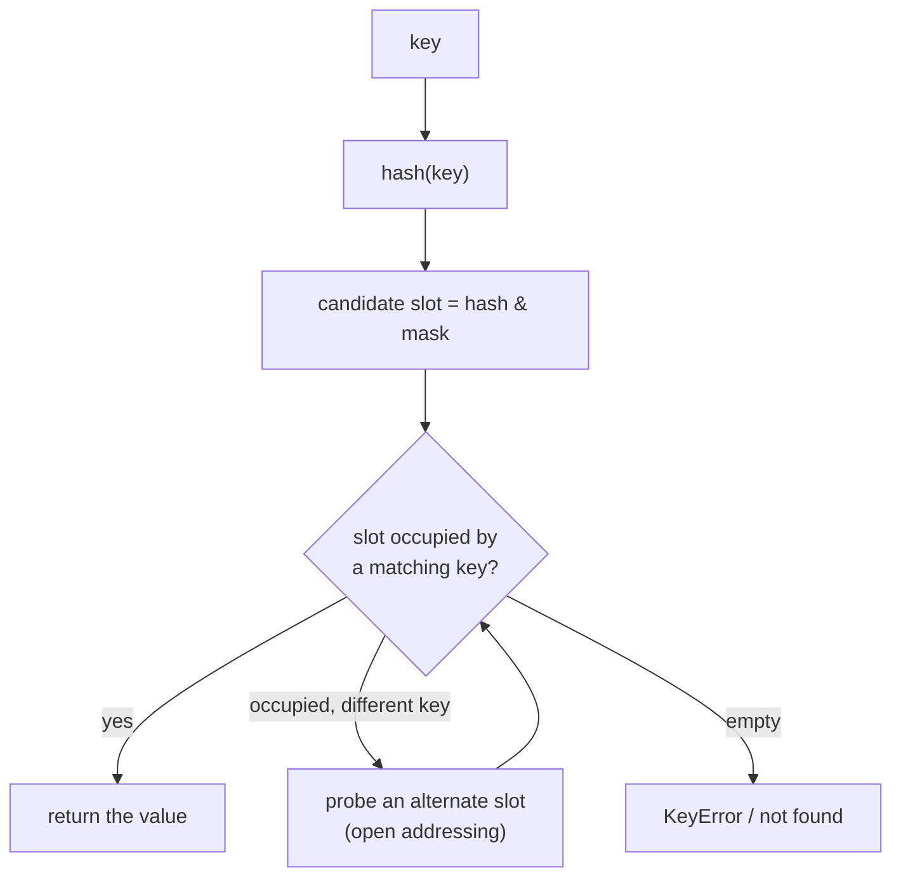

# Sequences, dicts, and sets — contiguous arrays against hash tables

*Why a list scan and a dict lookup are not the same operation wearing different syntax, and what a tuple, an array, a deque, and a memoryview each trade away to specialize.*

**Level:** L4 · **Prerequisites:** [01 object model and attribute lookup](01_object_model_and_attribute_lookup.md), [05 bytecode and the runtime](05_bytecode_and_the_runtime.md)
**Covers:** PY-09, PY-10
**Sources:** Ramalho, *Fluent Python* 2nd ed. ch.2, ch.3 (2022) · Beazley, *Advanced Python Mastery* §2 (2024) · Wilson, *Software Design by Example*, ch. "Finding Duplicate Files" (2026) · *What's New in Python 3.7*, docs.python.org · PEP 412 (2011)

---

## 1. The problem this solves

A list of account records and a need to check whether a given account ID has already been seen look, at first, like they call for the same tool:

```python
seen = []
for account_id in incoming_ids:
    if account_id in seen:
        flag_duplicate(account_id)
    seen.append(account_id)
```

This works, and it is also a program whose cost grows in a way that is easy to miss until the input is large enough to make it obvious: `account_id in seen` has to check every element already in `seen`, one at a time, in the worst case, because `seen` is a list and a list has no faster way to answer "is this value present" than looking. Doubling the number of incoming IDs does not merely double the work — it roughly quadruples it, because both the number of checks and the length of each check have doubled. Replacing `seen = []` with `seen = set()` changes nothing else about the code and changes the growth curve entirely, because a set answers membership by computing where a value *should* be rather than by looking everywhere it *might* be.

The same choice recurs at a smaller scale inside a single record. A bank transaction naturally has a handful of fixed fields — a date, an amount, a type — and Python offers at least three ways to hold them: a `list`, whose length and meaning are not fixed by anything in the type itself; a `tuple`, whose length is fixed the moment it is built but whose fields are addressed only by position; and a `dict`, whose fields are addressed by name at the cost of the hashing machinery this chapter builds up to. Choosing among these three for what is fundamentally the same four numbers is not a matter of taste — it is a decision about which operations the rest of the program needs to be cheap, and about whether "the third element" or "the `amount` field" is the more natural way for the code that reads this record back out to refer to it.

That difference is not a special case of sets being "optimized" in some generic sense. It is a direct consequence of two genuinely different physical layouts sitting underneath syntax that looks similar at the call site. A list, a tuple, and an array are all, underneath, a contiguous block of slots addressed by position — which is exactly why indexing any of them by an integer is fast regardless of the collection's size, and exactly why searching any of them for a *value* is not. A dict and a set are both, underneath, a **hash table** — a structure that computes a value's likely location directly from the value itself, which is what makes membership and key lookup fast regardless of size, at a real and worthwhile cost elsewhere. Neither layout is a strictly better version of the other; each is exactly suited to a different question, and this chapter is about knowing which question a piece of code is actually asking before choosing which structure answers it.

---

## 2. The mechanism, built up

### 2.1 A list is a resizable array of pointers, over-allocated on purpose

A Python list does not store its elements inline, one after another in memory. It stores a contiguous array of pointers, each one pointing to wherever the actual object lives:

```python
items = [10, 20, 30]
items.append(40)
```

Appending does not necessarily allocate new memory at all. Lists over-allocate on growth — requesting more pointer slots from the operating system than the immediate append needs, so that several subsequent `append()` calls can each simply write into an already-reserved slot and update a length counter, with no allocation at all. Beazley's own account of this shelf's object-internals material frames it exactly this way: a list keeps `used` and `reserved` regions, and the gap between them is precisely what makes repeated appends cheap on average rather than paying a full reallocation on every single call. This is what "amortized" means in "amortized O(1) append": any *individual* append might trigger a reallocation once the reserved space runs out, but averaged over a long sequence of appends, the cost per call is small and roughly constant, because reallocations become proportionally rarer as the list grows.

```text
list  [0][1][2]|[ ][ ][ ]     <- 3 used slots, 3 reserved but unused
              ^
        append() writes here first, no new allocation needed
```

Indexing `items[1]` is a single pointer dereference at a computed offset — the array's start address plus `1` times the pointer size — which is why `items[1]` costs the same whether the list holds ten elements or ten million. Searching for a *value* — `30 in items` — has no equivalent shortcut: the interpreter has no way to know where `30` might be without comparing it against elements in order, starting from the first, until a match is found or the list is exhausted.

### 2.2 A tuple is two different things wearing one type: a record, and an immutable list

Python overloads the tuple type for two purposes that share a representation but not a purpose. As a **record**, position carries meaning — the fields of a fixed, heterogeneous structure, unpacked by position rather than looked up by name:

```python
account = ("alexandro", "checking", 100.0)
owner, kind, balance = account
```

As an **immutable list**, a tuple is simply a sequence that cannot grow, shrink, or have its elements reassigned — used because immutability itself is the point (a dict key, per chapter 2's hashability requirement, or a value passed somewhere that must not be able to mutate it), not because the positions mean anything individually. Both uses compile to the identical bytecode and the identical C struct; the distinction lives entirely in how the code that constructs and reads the tuple is written, not in anything the interpreter enforces.

The tuple type's own method set reflects the record use case more than the immutable-list one: a tuple has exactly two methods beyond the sequence protocol, `count` and `index`, against the dozen-plus a list exposes for growing, shrinking, and reordering itself. There is no `tuple.append`, no `tuple.sort`, not because the designers forgot them but because a record's fields do not get appended to or sorted — a tuple used as a record has a fixed number of positions with fixed meanings, and a tuple used as a frozen sequence has no need to change at all, so neither role has any use for the mutating half of the list API in the first place.

"Immutable" for a tuple is a guarantee about the tuple's own slots, not about what those slots point to, and the gap between the two produces a genuinely well-known puzzle:

```python
t = (1, 2, [30, 40])
t[2] += [50, 60]
```

```text
TypeError: 'tuple' object does not support item assignment
```

```python
print(t)   # (1, 2, [30, 40, 50, 60])
```

The assignment raises `TypeError` — and the list inside the tuple was mutated anyway. Disassembling `t[2] += [50, 60]` shows why, using the bytecode vocabulary chapter 5 already built: the expression loads `t[2]` onto the stack (`BINARY_SUBSCR`), performs the in-place addition on *that list object* (`INPLACE_ADD`/`BINARY_OP`, which succeeds because the list itself is mutable), and only then attempts to store the result back into `t[2]` (`STORE_SUBSCR`) — and that final step is the one `tuple` refuses. Augmented assignment is not one atomic operation; it is three separate steps, and the second one already mutated the list in place before the third one failed. The lesson this generalizes to, stated by chapter 5's own vocabulary: never assume an operator is indivisible just because it reads as one token in the source.

### 2.3 Slicing is a half-open interval, and it produces a first-class object

`s[a:b:c]` — start, stop, and an optional stride — is Python's slicing notation, and the exclusive upper bound (`b` is not included) is a deliberate design choice rather than an arbitrary one: it is what makes `len(s[a:b])` equal to `b - a` with no adjustment, what makes `s[:n]` and `s[n:]` split a sequence into two pieces with no element duplicated or skipped, and what makes consecutive slices `s[a:b]` and `s[b:c]` compose cleanly with no off-by-one correction needed at the seam.

```python
s = 'bicycle'
print(s[::3])    # 'bye'
print(s[::-1])   # 'elcycib'
```

The notation `a:b:c` is only meaningful inside `[]`, and evaluating it produces a real object — `slice(a, b, c)` — which is what `seq[a:b:c]` actually calls `seq.__getitem__` with, per chapter 2's protocol mechanism. That object can be named and reused, which is a legitimate technique for a fixed-format record rather than a curiosity:

```python
UNIT_PRICE = slice(40, 52)
QUANTITY = slice(52, 55)
line = "1909  Pimoroni PiBrella            $17.50    3"
print(line[UNIT_PRICE], line[QUANTITY])
```

Slice assignment extends the same mechanism to mutation: a mutable sequence can have a slice replaced, grown, or shrunk in a single statement, with the right-hand side required to be an iterable — even a one-element replacement must be wrapped in a sequence, because a bare scalar on the right of a slice assignment is a `TypeError`, not a convenience shorthand.

### 2.4 Multiplying a sequence of mutable items multiplies the reference, not the object

`sequence * n` is a fast, common idiom for building a fixed-size structure — and it is only safe when the elements being repeated are immutable, for exactly the reason section 2.1 already established about how a list stores pointers rather than values:

```python
board = [['_'] * 3] * 3
board[1][2] = 'X'
print(board)
```

```text
[['_', '_', 'X'], ['_', '_', 'X'], ['_', '_', 'X']]
```

Marking one cell modified every row, because `[['_'] * 3] * 3` builds one inner list and then fills the outer list with three pointers to that *same* inner list — multiplying a list does not deep-copy its contents, it copies the reference to each element the requested number of times. This is chapter 4's shallow-aliasing mechanism surfacing through a different piece of syntax: `outer = [inner] * 3` is exactly as aliased as `a = b = inner` repeated three times, just spelled more densely. The fix is a list comprehension, which evaluates `['_'] * 3` fresh on every iteration rather than once: `[['_'] * 3 for _ in range(3)]` builds three genuinely separate inner lists, because the comprehension's body runs three separate times rather than being computed once and copied by reference.

### 2.5 Purpose-built sequence types trade generality for a specific cost profile

A plain list is general-purpose, and that generality has a price in three specific situations, each with its own purpose-built alternative.

**`array.array`** stores homogeneous numeric data packed directly, without the pointer indirection section 2.1 describes — every element is the actual bytes of the number, laid out contiguously, rather than a pointer to a separately-allocated object:

```python
import array
a = array.array('d', [1.0, 2.0, 3.0])   # 'd' = C double, 8 bytes each
print(a.itemsize)                        # 8
```

This trades away Python's ordinary flexibility — every element must be the same fixed-width numeric type, declared up front by a type code — for a memory layout closer to a C array, which matters specifically when a program holds a very large, uniform numeric sequence and the pointer overhead of an ordinary list, one full pointer's worth of indirection per number, is the thing actually costing memory.

**`memoryview`** does not store data at all; it is a *view* onto an existing buffer — an `array`, a `bytearray`, or anything else exposing the buffer protocol — that reads and writes through to the original without copying:

```python
buf = bytearray(b'abcdef')
mv = memoryview(buf)
mv[0:2] = b'XY'
print(buf)      # bytearray(b'XYcdef')
```

Writing through the `memoryview` changed `buf` directly, with no intermediate copy of the six bytes ever made — the entire point of the type, and the reason it matters for anything that would otherwise copy a large buffer just to read or rewrite a small slice of it.

**`collections.deque`** is a double-ended queue, optimized specifically for adding and removing at *both* ends in constant time — a guarantee an ordinary list does not make at its front:

```python
from collections import deque
recent = deque(maxlen=3)
recent.append(1); recent.append(2); recent.append(3); recent.append(4)
print(recent)          # deque([2, 3, 4], maxlen=3)
recent.appendleft(0)
print(recent)           # deque([0, 2, 3], maxlen=3)
```

`maxlen=3` turns the deque into a fixed-size ring buffer, automatically discarding from the opposite end as new items arrive — genuinely useful for a rolling window of the most recent N events, expressed with no manual trimming logic at all. Section 3.4 covers precisely what a plain list costs when a program treats its *front* the way a deque is built to handle.

### 2.6 Pattern matching over a sequence is structural unpacking, made conditional

`match`/`case` extends ordinary unpacking (`owner, kind, balance = account`, from section 2.2) into something that can also check shape and reject a non-matching one, rather than raising if the shape is wrong:

```python
match ("deposit", 100):
    case ("deposit", amount):
        print("credit", amount)
    case ("withdrawal", amount):
        print("debit", amount)
    case _:
        print("unrecognized")
```

A sequence pattern like `(action, amount)` matches any sequence of exactly two elements — list or tuple alike — binding `action` and `amount` to whatever is there, and simply falls through to the next `case` if the shape does not fit, rather than raising `ValueError: too many values to unpack` the way a bare assignment-unpacking would. This chapter treats pattern matching only as far as it touches sequence *shape*; the full pattern-matching mechanism, including class patterns and guards, belongs to its own chapter later on this shelf.

### 2.7 A dict computes where a key belongs; it does not search for it

Everything from here forward answers a different question than section 2.1's array-based structures can answer efficiently. A dict does not scan for a key — it computes the key's hash, derives a candidate slot directly from that hash, and looks there first:



This is why dict and set lookup costs roughly the same whether the container holds ten entries or ten million: the number of slots examined is small and largely independent of the total size, in sharp contrast to section 2.1's linear scan. Ramalho's own accounting of the practical consequences of this design names the real trade being made: a hash table needs meaningfully more memory per entry than a bare array of pointers would, and CPython's implementation deliberately keeps a hash table no more than about two-thirds full, resizing and reinserting every entry once that threshold is crossed, specifically to keep the number of collisions — two different keys landing on the same candidate slot — low enough for the probe step above to stay cheap.

### 2.8 Key order is a guaranteed side effect of the layout, not an incidental feature

Before Python 3.6, dict key order was unspecified and not something correct code could rely on. CPython's 3.6 implementation changed the underlying layout to a more compact structure — one that happens to preserve insertion order as a natural consequence of how it stores entries — and *What's New in Python 3.7* promoted that implementation detail to a language guarantee every conforming implementation must now honor, not merely something CPython happens to do.

```python
d = {}
d['z'] = 1
d['a'] = 2
d['m'] = 3
print(list(d))   # ['z', 'a', 'm'] — insertion order, guaranteed since 3.7
```

The same compact layout is also what makes **PEP 412**'s key-sharing optimization possible — chapter 1 already covers its headline figure, a 10–20% memory reduction for same-shaped instance dictionaries — because a compact table separates the keys from the values in a way that makes sharing one class's key layout across many instances' dictionaries a structural option rather than a special case bolted on afterward. Order preservation and memory compactness are two separate, attributable claims about the same underlying redesign, not one fact dressed up two ways.

### 2.9 A dictionary view is a live, set-like proxy — never a snapshot

`.keys()`, `.values()`, and `.items()` do not copy anything out of the dict; they return a **view**, a thin object that reads through to the dict's current state on every access:

```python
d = {'a': 10, 'b': 20}
values = d.values()
print(values)          # dict_values([10, 20])
d['c'] = 30
print(values)          # dict_values([10, 20, 30]) — the same view, now showing 3
```

The view updated with no reassignment anywhere, because it was never a copy to begin with — it is a small object that knows how to read the dict's live internal state each time it is examined. `keys()` and `items()` additionally support set operations directly — intersection, union, difference — because a dict's keys, like a set's elements, are already required to be hashable and unique, which is exactly the structural property a set needs; `values()` does not support this, since values carry no such uniqueness guarantee.

### 2.10 Sets are hash tables with no attached values, at the same structural cost

A `set` is, internally, the same hash-table mechanism as a dict, with every slot holding a key and no associated value. Every consequence of section 2.7 applies identically: elements must be hashable, membership testing is fast regardless of size, and the table maintains the same headroom for the same reason.

```python
haystack = set(range(1_000_000))
needles = {17, 999_999, -1}
found = needles & haystack
```

Ramalho's own account of this exact shape of problem — counting how many of a smaller collection's elements occur in a much larger one — reports a set intersection completing in roughly 0.3 milliseconds against a ten-million-element haystack in his own measured example, versus a hand-written loop checking membership one element at a time; the mechanism producing that gap is precisely section 2.7's hash-computed lookup replacing section 2.1's linear scan, applied once per needle instead of the other way around. `frozenset` is the immutable counterpart, needed specifically because chapter 2's hashability rule excludes a mutable `set` from ever being a dict key or an element of another set — a `frozenset` can hold that role because, once built, it can no longer change out from under whatever is depending on its hash staying stable.

Section 2.8's insertion-order guarantee is a **dict** guarantee specifically, and it is a mistake to assume it extends to `set`. A set's iteration order does depend on insertion history, but not in any way a program may rely on: two elements with different values can still land in the same candidate slot if their hashes collide, and which one ends up appearing first depends on which was inserted first — a detail about hash collisions, not about program logic. Worse, resizing a set's internal table once it crosses the same roughly-two-thirds-full threshold section 2.7 describes for dicts forces every existing element to be reinserted into the new, larger table, and that reinsertion can silently reorder elements that were never touched by the code at all. A dict published this same behavior as an implementation detail before 3.7 and then had it formalized into a guarantee; a set has had no equivalent promise made for it at any point, and code that iterates a set expecting a stable or meaningful order is relying on something the type has never committed to providing.

---

## 3. Failure modes

### 3.1 `[[x] * n] * n` builds one row and n references to it, not n independent rows

```python
# Gist: aliased_board.py
board = [['_'] * 3] * 3
board[1][2] = 'X'
print(board)
```

```text
[['_', '_', 'X'], ['_', '_', 'X'], ['_', '_', 'X']]
```

Section 2.4 already traced this exactly: the outer `* 3` copies a reference to the single inner list three times, so every "row" is the same object under three different names, and mutating one mutates all of them simultaneously. This defect is unusually easy to miss during development, because printing the freshly built structure looks completely correct — `[['_', '_', '_'], ['_', '_', '_'], ['_', '_', '_']]` reveals nothing about whether the three inner lists are actually three objects or one — and the defect only becomes visible the first time something writes to a single cell, at which point every row appears to have been written to. The fix is a list comprehension that constructs the inner list fresh on each iteration — `[['_'] * 3 for _ in range(3)]` — which costs nothing beyond writing the comprehension instead of the shorter-looking multiplication.

### 3.2 Augmented assignment on a tuple element can raise and mutate in the same statement

```python
# Gist: tuple_puzzler.py
t = (1, 2, [30, 40])
t[2] += [50, 60]
```

```text
TypeError: 'tuple' object does not support item assignment
```

```python
print(t)   # (1, 2, [30, 40, 50, 60])
```

Section 2.2 traced the three-step bytecode sequence behind this: load `t[2]`, mutate it in place (which succeeds, because the list itself is mutable), then attempt to store the result back into the tuple (which fails). The exception is real and correctly raised — but it fires *after* the mutation already happened, which means code that catches the `TypeError` and assumes nothing changed is wrong. A caller relying on the assumption that a failed statement leaves state untouched — reasonable for most single expressions in most languages — is specifically wrong here, because `+=` on a sequence element is not one indivisible operation. The practical fix is the one Ramalho's own account of this exact case draws from it: avoid putting a mutable object inside a tuple at all when the tuple is meant to be a genuinely immutable record, since the tuple's own immutability was never protecting that mutable element to begin with.

### 3.3 Mutating a dict while iterating over it (or a view of it) raises mid-loop, not at the point of mutation

```python
# Gist: mutate_during_iteration.py
transactions = {'deposit': 100, 'fee': -5, 'withdrawal': -20}
for kind in transactions:
    if kind == 'fee':
        del transactions[kind]
```

```text
RuntimeError: dictionary changed size during iteration
```

Section 2.9 established that a view — and the implicit iteration a plain `for key in some_dict` performs is built on the same live mechanism — reads through to the dict's actual current state rather than a frozen copy taken at the start of the loop. CPython detects a change in the dict's size while an iterator over it is still active and raises rather than silently producing skipped or duplicated entries, which is the correct, safe behavior, but it surprises code written under the assumption that a `for` loop over a dict is iterating a fixed list of keys decided once at the top. The fix is to iterate over a genuine copy of the keys taken before the loop begins — `for kind in list(transactions):` — which decouples the loop's iteration from the dict's live state, at the cost of one shallow copy of the key list; removing entries from within the loop by name, after the fact, into a separate list of keys to delete afterward, is the same fix expressed slightly differently.

### 3.4 Repeatedly inserting or removing from the front of a list scales far worse than the same operation on a deque

```python
# Gist: front_insertion_cost.py
queue = []
queue.append(1)
queue.append(2)
queue.append(3)
first = queue.pop(0)
```

`queue.pop(0)` (and `queue.insert(0, x)`) is not the same cost as `queue.pop()` or `queue.append(x)`. Section 2.1 established that a list is a contiguous array of pointers addressed by position — removing the *first* element means every remaining element has to shift down by one slot to close the gap, which is work proportional to however many elements are left in the list, repeated on every single call. A loop that repeatedly pops from the front of a list that stays large throughout the loop is doing that shifting work on every iteration, which is easy to write without noticing, because nothing about `queue.pop(0)` looks more expensive than `queue.pop()` at the call site — the cost difference is entirely in what has to happen underneath, not in anything visible in the code. `collections.deque`, from section 2.5, exists specifically to make both ends of the structure cheap, implemented internally as a structure that never needs to shift existing elements to add or remove at either end. The fix, for any queue-like usage — first-in-first-out processing, a sliding window, a rolling buffer — is to use `deque` from the start rather than a plain list; the cost of switching is limited to the small API differences between the two types, and there is no case where a list used as a front-heavy queue is the better choice once a `deque` is available.

### 3.5 A set's iteration order is not just unspecified — it can differ between separate runs of the identical program

```python
# Gist: set_order_nondeterminism.py
s = {'alpha', 'bravo', 'charlie', 'delta', 'echo'}
print(list(s))
```

Running this exact script several times, unmodified, on the same interpreter, on the same machine, does not reliably print the same order twice. Section 2.10 already establishes that a set's iteration order depends on where each element's hash happens to land — and for `str`, Python salts the hash function with a value chosen freshly, at random, each time the interpreter starts, specifically to make it computationally impractical for an attacker to predict hash collisions and construct a denial-of-service input against a program that hashes untrusted strings. That salt changing between runs is precisely why the same five strings, inserted in the same order, can print in a different order on two separate invocations of the identical program — the outcome depends on where each string's salted hash lands modulo the table size, which the program's own logic has no way to see or control. This is not a bug to fix in the program; it is expected behavior with a real security justification behind it, described as nondeterministic rather than demonstrated with one run's output pretended to be the reliable answer, because no single run's order is any more "correct" than another's. The practical fix, whenever a program's output must be reproducible — test assertions, snapshot comparisons, generated reports — is to sort before displaying or comparing (`sorted(s)`) rather than relying on a set's own iteration order for anything a human or another system will read as meaningful sequence.

---

## 4. Trade-offs

| Approach | Use when | Because | Real cost |
| --- | --- | --- | --- |
| **`list`** | General-purpose, ordered, mutable collection of arbitrary objects | Fast indexed access and append; the default for a reason | Linear-time search, insertion, and removal anywhere but the end |
| **`tuple`** | A fixed-shape record, or any sequence that must be hashable/immutable | Cheaper to construct than a list; usable as a dict key or set element when its contents are themselves hashable | No growth, no in-place mutation — including no protection for a mutable object stored inside it |
| **`array.array`** | A large, uniform numeric sequence where per-element pointer overhead matters | Packs values directly, without one full pointer per element | Every element must share one fixed C-level numeric type; no arbitrary Python objects |
| **`memoryview`** | Reading or writing a slice of an existing buffer without copying it | Genuinely zero-copy — writes propagate directly to the underlying buffer | Only works over objects exposing the buffer protocol; not a general-purpose sequence type |
| **`deque`** | Frequent insertion or removal at either end, or a fixed-size rolling window (`maxlen`) | Constant-time at both ends, unlike a list's linear-time front operations | Indexing into the middle is linear time, unlike a list's constant-time indexing anywhere |
| **`dict` / `set`** | Membership testing, deduplication, or lookup by key, at any real scale | Hash-computed location instead of a scan — near-constant time regardless of size | Real per-entry memory overhead versus a bare array; elements/keys must be hashable |

### When a hash table is the wrong tool

A dict or set is the wrong choice for a small, fixed collection checked rarely, or for any collection where preserving a specific *sortable* order beyond simple insertion order matters — a hash table's memory overhead and hashability requirement buy nothing when a handful of linear scans would cost less overall than building and maintaining the table in the first place. It is also the wrong tool the moment the natural key is itself mutable in a way that would need to change after insertion, since chapter 2's hash contract makes that combination actively dangerous rather than merely inefficient.

### The case against reaching for `array` or `memoryview` by default

Both exist specifically for a measured memory or copying bottleneck involving large, homogeneous numeric data — and reaching for either preemptively, on ordinary application data that is not numeric, not enormous, and not already causing a measured problem, trades Python's ordinary flexibility for a rigidity (fixed element type, no arbitrary objects) that buys nothing without the specific workload that motivates it. A plain list remains the correct default; these are specialist tools for a specialist, already-identified cost.

### The case against a list as a general-purpose queue

Treating a plain list as a first-in-first-out queue — appending at one end, popping from the other — is the single most common way section 3.4's cost surfaces in real code, because nothing at either call site looks more expensive than the other. The rejected alternative to `deque` here is not "no alternative exists," it is "a list already does this, so why import something else" — and the answer is that a list only does it cheaply from one end, which is precisely the trade `deque` was built to remove.

### When a tuple record should become something else entirely

A tuple used as a record is readable only as long as its author and every future reader agree on what each position means, and that agreement is entirely undocumented in the type itself — `account[1]` gives no hint whether position `1` is the balance, the owner, or the account type without checking wherever the tuple was constructed. The moment a positional record is read from more than one place, or grows past three or four fields, the rejected alternative worth taking seriously is a `dataclass` or `NamedTuple` (a later chapter on this shelf) instead of a bare tuple: both give named-field access while keeping most of a tuple's cost profile, at the price of a short class definition the bare tuple never needed. A bare tuple remains the right choice specifically when the record is small, local, and short-lived enough that the positional convention never has to be remembered past the few lines that both build and consume it.

---

## 5. Reference summary

**A list, tuple, and array are contiguous, position-addressed structures** — indexing by position is fast regardless of size; searching for a value is not, because nothing about the layout tells the interpreter where a given value would be. **Lists over-allocate on growth**, so most individual `append()` calls write into already-reserved space rather than triggering a new allocation, which is what "amortized constant time" means in practice.

**A tuple serves two distinct roles — a fixed-position record, and an immutable list** — sharing one representation. Immutability applies to the tuple's own slots only; **a mutable object stored inside a tuple can still be mutated**, and augmented assignment on a tuple element can raise `TypeError` *after* already mutating that element, because the operation is really three separate bytecode steps, not one.

**Slicing is a half-open interval** (`s[a:b]` excludes `b`), a design choice that makes lengths, splits, and consecutive slices compose without off-by-one adjustment; `s[a:b:c]` evaluates to a real `slice` object, which is what `__getitem__` actually receives. **Multiplying a sequence of mutable elements (`[x] * n`) copies the reference n times, not the object** — the same aliasing chapter 4 describes, reached through different syntax.

**`array.array` packs homogeneous numeric data without per-element pointer overhead; `memoryview` is a zero-copy view onto an existing buffer; `deque` gives both ends of a sequence constant-time insertion and removal**, unlike a plain list, whose front operations are linear-time because every remaining element has to shift.

**A dict or set is a hash table**: it computes a candidate slot directly from a key's hash rather than searching, which is what makes lookup and membership testing fast regardless of size, at the cost of real per-entry memory overhead and a hard requirement that keys/elements be hashable. **Key insertion order has been a language guarantee since Python 3.7**, following from a more compact internal layout CPython adopted in 3.6 — the same layout change that makes PEP 412's key-sharing memory optimization possible. **Dictionary views (`.keys()`, `.values()`, `.items()`) are live proxies**, never snapshots, and `.keys()`/`.items()` support set algebra directly because dict keys are already unique and hashable. **Mutating a dict's size while iterating over it or a view of it raises `RuntimeError`** rather than silently corrupting the iteration. **A set's iteration order carries no guarantee at all** — unlike a dict's, it is not merely insertion-dependent but genuinely nondeterministic across separate runs for string elements, because CPython salts string hashing at process start specifically to resist hash-flooding attacks; code that needs a reproducible order must sort explicitly rather than lean on iteration order for anything observable.

**The tuple/dict/dataclass choice for a small fixed record is a decision about how the record will be read later**, not merely how it is built: positional access costs nothing to set up and nothing to read for code written alongside the tuple's construction, but it documents nothing about what each position means to a reader arriving later, which is exactly the gap a named-field alternative exists to close once a record is read from more than a handful of nearby lines.

---

← [Python knowledge graph](00_knowledge_graph.md) · [repo index](../README.md)
