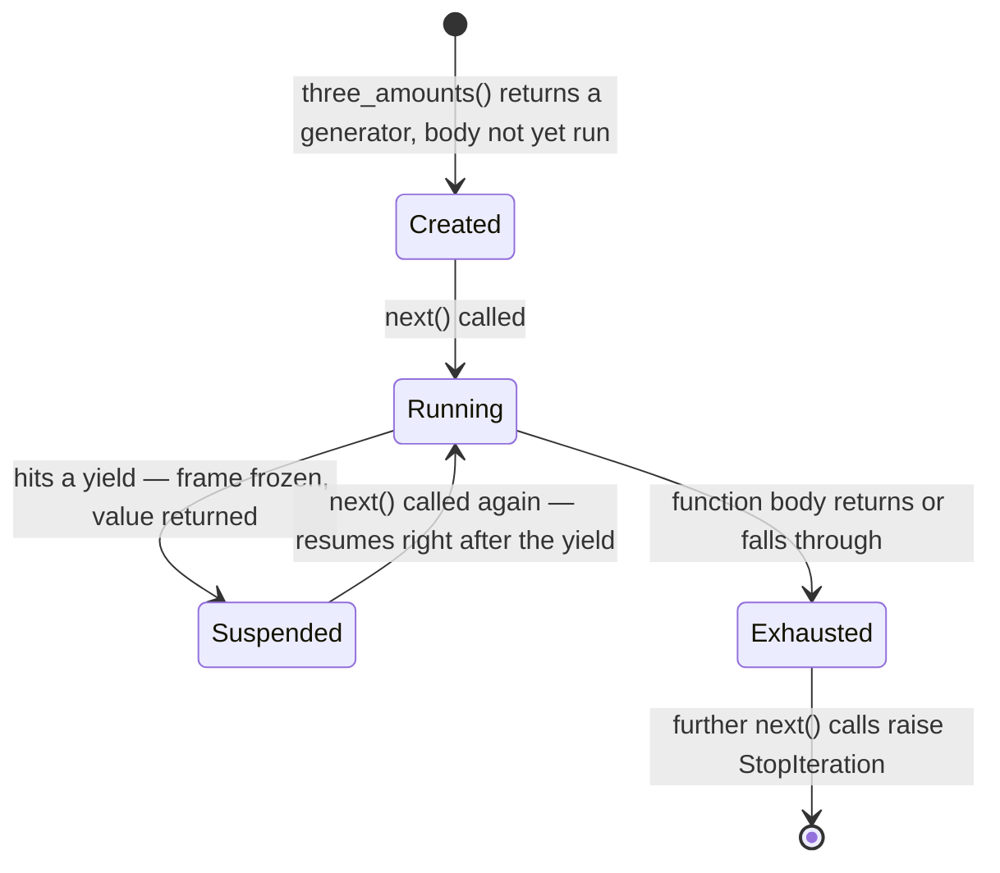
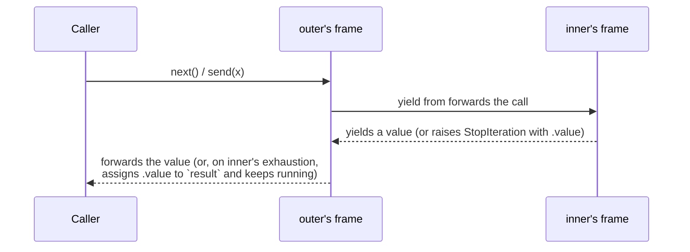
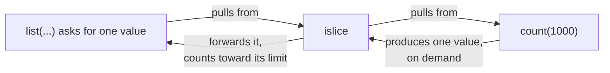

# Iterators, generators, and lazy evaluation — suspending a function instead of returning from it

*What actually happens at `yield`, why a generator that consumes values is a different tool from one that produces them, and the exception-handling change that made both safe to compose.*

**Level:** L4 · **Prerequisites:** [02 the special-method protocol](02_the_special_method_protocol.md)
**Covers:** PY-07
**Sources:** Ramalho, *Fluent Python* 2nd ed. ch.17 (2022) · Beazley, *Advanced Python Mastery* §8 (2024) · Wilson, *Software Design by Example*, ch. "Protocols" §Iterators (2026) · PEP 342 (2005) · PEP 380 (2009) · PEP 479 (2015) · `itertools` documentation, docs.python.org

---

## 1. The problem this solves

Chapter 2 already covers the iteration protocol itself — `__iter__`, `__next__`, `StopIteration`, and the legacy `__getitem__` fallback — as the mechanism that makes `for` work on a custom class. What it does not cover is the more common, more practical question this chapter takes up: writing an iterator by hand, as a class with a `__next__` method that manually tracks its own position, is tedious for anything beyond the simplest case, and the tedium scales with exactly the kind of state a real iteration needs to track.

```python
class TransactionScanner:
    def __init__(self, lines):
        self._lines = lines
        self._index = 0
    def __iter__(self):
        return self
    def __next__(self):
        while self._index < len(self._lines):
            line = self._lines[self._index]
            self._index += 1
            if line.startswith("DEPOSIT"):
                return line
        raise StopIteration
```

Every piece of state this class needs — where it left off, what it is currently doing — has to be stored explicitly as an instance attribute, because a class has no other place to keep it between calls to `__next__`. This is a direct, mechanical translation of "advance one step and remember where you are" into the object model, and it is exactly the kind of bookkeeping a generator function eliminates by letting the *function's own execution position* serve as the state, rather than requiring an attribute for every piece of it.

The class above also has a subtler defect worth naming before moving past it, because it is a common enough mistake to earn its own warning: `TransactionScanner.__iter__` returns `self`, which makes the object both an iterable and its own iterator. That collapses the distinction chapter 2 draws between the two — an iterable is something `iter()` can be called on to get a fresh iterator, and an iterator is the thing that actually tracks position — and the practical cost shows up the moment two separate `for` loops try to iterate the same `TransactionScanner` instance at once: there is only one `_index`, shared by both loops, so the second loop silently resumes wherever the first one left off rather than starting over. A generator function sidesteps this failure mode entirely, because *calling* a generator function is what produces a fresh iterator each time — `scan_deposits(lines)` called twice produces two independent generator objects, each with its own frame and its own suspended position, with no shared mutable state between them at all.

There is a second, independent problem this chapter addresses: even once an iterator exists, a program can build the values it iterates over either eagerly, all at once, before the first one is ever used, or lazily, one at a time, only as each one is actually requested. A function that reads every transaction from a large log into a list before scanning it for deposits has already paid the full memory and time cost of the whole log before producing a single result, even if the caller only wanted the first three matches. A lazy version produces exactly as much as is asked for and no more — a difference that a class-based iterator, a generator function, or a generator expression can each express, but that only becomes cheap and idiomatic to write once the mechanism underneath `yield` is genuinely understood rather than treated as a shorthand for "somehow returns things one at a time."

---

## 2. The mechanism, built up

### 2.1 Any function containing `yield` becomes a generator factory, not an ordinary function

A function is classified as a **generator function** the moment its body contains `yield` anywhere — a purely syntactic decision the compiler makes once, at compile time, not something that depends on which branch of the function actually runs.

```python
def three_amounts():
    yield 100
    yield 250
    yield 75

print(three_amounts)          # <function three_amounts at 0x...>
g = three_amounts()
print(g)                       # <generator object three_amounts at 0x...>
```

Calling `three_amounts()` does not run any of the function's body at all — it constructs and returns a **generator object**, which wraps the function's code and is itself an iterator per chapter 2's protocol, implementing both `__iter__` and `__next__`. The body only starts executing on the first call to `next()`:

```python
g = three_amounts()
print(next(g))    # 100
print(next(g))    # 250
print(next(g))    # 75
next(g)            # StopIteration
```

`StopIteration` fires once the function body runs off its end — falling through the last line, or hitting an explicit `return` with no value — exactly matching the contract chapter 2 established for `__next__`, and for exactly the same reason: a `for` loop over a generator is looking for that specific exception to know when to stop, and a generator function's implicit fall-through raises it automatically so the author never has to write it by hand.

### 2.2 A generator suspends its own stack frame at `yield`, and resumes exactly there

The mechanism behind "producing values one at a time" is not a queue or a background thread — it is the same frame object chapter 5 already introduced, kept alive and paused rather than popped and discarded.

```python
def traced():
    print('start')
    yield 'A'
    print('continue')
    yield 'B'
    print('end.')

for value in traced():
    print('-->', value)
```

```text
start
--> A
continue
--> B
end.
```

Read this trace in order, and the interleaving is the entire point: `'start'` prints, execution reaches the first `yield`, and control returns to the `for` loop with the value `'A'` — but the function's frame is not destroyed the way an ordinary `return` would destroy it. Its instruction pointer, its local variables, and its position inside the loop are frozen exactly where they stood. The `for` loop's next iteration calls `next()` again, which does not start the function over — it resumes that same frozen frame from the instruction immediately after the `yield` that suspended it, prints `'continue'`, and runs to the second `yield`. This is why the printed output interleaves with the loop's own `-->` lines rather than all appearing before or after them: the generator's code and the loop's code are genuinely taking turns, each one running exactly until it yields control back to the other.



### 2.3 A generator is the idiomatic way to make a sequence lazy

Nothing about a generator function requires it to be finite or requires its caller to consume all of it — which is exactly what makes it the natural tool for lazy evaluation:

```python
def scan_deposits(lines):
    for line in lines:
        if line.startswith("DEPOSIT"):
            yield line
```

Compare this to building a full list of matches up front: `scan_deposits` does no work at all until the first `next()` call, processes exactly one line of input per `yield`, and — critically — never holds more than one matching line in memory at a time, regardless of how many lines the input has or how many of them match. A caller that only wants the first result, via `next(scan_deposits(lines))` or a `for` loop with an early `break`, never pays the cost of scanning the rest of the input at all. This is the direct, mechanical reason "lazy" is the right word: work is deferred to the exact moment a value is actually requested, and never performed further ahead than that.

The same laziness is available in an even more compact form for the simplest cases — a **generator expression**, syntactically a comprehension with parentheses instead of brackets:

```python
deposits = (line for line in lines if line.startswith("DEPOSIT"))
```

A list comprehension (`[... for ... ]`) builds the entire list immediately, eagerly, before the assignment even completes; the identical expression with parentheses builds a generator object instead, producing nothing until iterated. The choice between the two is a direct statement of intent: reach for the list when every element will genuinely be needed and held onto, and the generator expression when the values will be consumed once, in order, and do not need to exist all at the same time.

### 2.4 A generator used to consume values, rather than produce them, is a coroutine — and the two roles should not be mixed

Everything so far treats a generator as something that *produces* a sequence of values for a caller to pull. **PEP 342** added a second, entirely different use for the same underlying object: a generator that a caller *sends* values into, using `yield` as an expression whose value comes from outside rather than a statement that only emits outward.

```python
def averager():
    total = 0.0
    count = 0
    average = 0.0
    while True:
        term = yield average
        total += term
        count += 1
        average = total / count

coro = averager()
print(next(coro))        # 0.0 — "priming": advances to the first yield
print(coro.send(10))     # 10.0
print(coro.send(30))     # 20.0
print(coro.send(5))      # 15.0
```

`term = yield average` does two things in one line: it yields `average` outward, suspending the generator exactly as before, and it is itself an expression that evaluates to whatever the next `.send(...)` call provides, which is then assigned to `term`. A generator used this way is often called a **classic coroutine** — a term this chapter keeps deliberately distinct from the native `async`/`await` coroutines covered on this shelf's concurrency chapters, because the two share their C-level implementation but are used in opposite directions. Beazley's own framing of this distinction is worth carrying forward as a rule of thumb: generators produce data for iteration, coroutines consume data sent into them, and mixing the two roles in the same function — a generator that both `yield`s meaningfully to a `for` loop *and* expects meaningful values sent into it — reliably produces code that is difficult to reason about, because a `for` loop never sends anything but `None`.

`coro.send(...)` cannot be the very first operation on a freshly created generator: the generator has to be advanced to its first `yield` before a sent value has anywhere to be assigned. `next(coro)` — or, equivalently, `coro.send(None)` — performs that priming step, which is why every coroutine-style generator's very first `next()` call is discarded for its return value and used purely to reach the first suspension point.

### 2.5 `close()` and `throw()` inject termination and exceptions at the suspension point

A generator that is never exhausted still needs a way to be shut down deliberately, and `throw()` needs a way to signal an error into code that is, at the moment, paused mid-execution rather than running.

```python
def audited():
    try:
        yield 1
        yield 2
    except GeneratorExit:
        print("cleaning up")
        raise

g = audited()
next(g)
g.close()
```

```text
cleaning up
```

`close()` raises `GeneratorExit` **at the exact `yield` where the generator is currently suspended** — not at the call site of `close()` itself. If the generator's body has a `try`/`finally` or a `try`/`except GeneratorExit` wrapped around that `yield`, that cleanup code runs at exactly this moment, which is what makes a generator a legitimate place to hold a resource that needs releasing: a `finally` block wrapped around the body's `yield` statements runs whether the generator finishes normally, is closed explicitly, or is simply abandoned and reference-counted out of existence — chapter 4's destruction-on-refcount-zero mechanism applies to a generator object exactly as it applies to anything else, and CPython calls `close()` automatically as part of that destruction if it has not already happened.

`throw()` is the general form: it injects an arbitrary exception at the suspended `yield`, letting the generator's own exception handling decide what to do — recover and yield again, or let the exception propagate out to the caller.

```python
def resilient():
    try:
        x = yield 1
    except ValueError as e:
        print("caught inside:", e)
        yield "recovered"

g = resilient()
next(g)
print(g.throw(ValueError("bad input")))
```

```text
caught inside: bad input
recovered
```

### 2.6 `return` inside a generator sets `StopIteration.value`, and `yield from` delegates to a subgenerator transparently

A generator function's `return` statement does not return a value in the ordinary sense — it cannot, because the function has already committed to being an iterator, and an iterator's contract has no slot for a return value visible to a `for` loop. What actually happens is that the returned value is attached to the `StopIteration` exception the generator raises on exhaustion, retrievable from its `.value` attribute:

```python
def totals():
    yield 1
    yield 2
    return "done"

g = totals()
next(g); next(g)
try:
    next(g)
except StopIteration as e:
    print(e.value)   # done
```

Reading that value by hand, by catching `StopIteration` directly, is exactly what **PEP 380**'s `yield from` does automatically when one generator delegates to another:

```python
def inner():
    yield 1
    yield 2
    return "inner done"

def outer():
    result = yield from inner()
    print("inner returned:", result)
    yield "outer continues"

for value in outer():
    print(value)
```

```text
1
2
inner returned: inner done
outer continues
```



`yield from inner()` is not merely a shorthand for looping over `inner()` and re-yielding each value — though that is its most visible effect. It transparently forwards `.send()` calls from `outer`'s caller down into `inner`, forwards `inner`'s yielded values back up, and, on `inner`'s exhaustion, both retrieves its `StopIteration.value` as `yield from`'s own expression result and lets `outer` continue running rather than terminating alongside `inner`. This is the mechanism that makes recursive generator composition — a generator that walks a tree by delegating to itself on each child — as natural to write as ordinary recursive function calls, with the delegation handling suspension, exception propagation, and return-value passing all through the same protocol.

### 2.7 `itertools` composes lazy generators into pipelines, evaluated from the end backward

Every function in the standard library's `itertools` module returns an iterator, never a list, which is what makes chaining several of them together a genuinely lazy pipeline rather than a sequence of eager, fully-materialized intermediate lists.

```python
import itertools

recent_ids = itertools.islice(itertools.count(1000), 5)
print(list(recent_ids))    # [1000, 1001, 1002, 1003, 1004]

combined = itertools.chain([1, 2], [3, 4])
print(list(combined))       # [1, 2, 3, 4]

transactions = sorted(
    [{"type": "deposit", "amount": 100}, {"type": "withdrawal", "amount": 20}, {"type": "deposit", "amount": 50}],
    key=lambda t: t["type"],
)
for kind, group in itertools.groupby(transactions, key=lambda t: t["type"]):
    print(kind, [g["amount"] for g in group])
```

```text
[1000, 1001, 1002, 1003, 1004]
[1, 2, 3, 4]
deposit [100, 50]
withdrawal [20]
```

`itertools.count(1000)` is an infinite generator — it would never stop producing values on its own — and wrapping it in `itertools.islice(..., 5)` is what makes the combination finite, because `islice` only ever pulls as many values from its source as it has been asked to yield onward. This is the same pull-based evaluation section 2.3 already established, extended across a chain of composed iterators: nothing runs until something at the very end of the pipeline — a `for` loop, a call to `list()`, a single `next()` — actually asks for a value, and that single request propagates backward through every stage exactly once per item produced, never further ahead than that.



Each arrow in that diagram fires once per value actually produced, in the order shown, and the chain simply stops advancing the moment `islice`'s own limit is reached — `count(1000)` never produces a sixth value at all, because nothing ever asked it to. A pipeline built from ordinary lists and list comprehensions instead would run `count`-equivalent logic to completion (which, for a genuinely infinite source, would never finish) before `islice`-equivalent logic ever got a chance to trim it down, which is precisely the eager-versus-lazy distinction section 2.3 opened with, now shown composing across more than one stage at once.

### 2.8 `StopIteration` escaping a generator's own body is a bug, not a signal, since Python 3.7

Before **PEP 479** took full effect in Python 3.7, a `StopIteration` raised *accidentally* inside a generator's body — most commonly from calling `next()` on some other, unrelated exhausted iterator without catching the exception — would propagate straight out of the generator, and because a `for` loop's own machinery is also watching for `StopIteration`, the loop consuming the generator would simply stop, silently, as though the generator itself had finished normally. This made a completely unrelated bug deep inside a generator's body indistinguishable from ordinary, successful exhaustion, from the outside.

PEP 479 changed the rule: a `StopIteration` about to propagate out of a generator's own frame is now automatically converted into a `RuntimeError`, which cannot be confused with normal completion.

```python
def broken():
    it = iter([])
    yield next(it)     # next(it) raises StopIteration internally, uncaught

next(broken())
```

```text
RuntimeError: generator raised StopIteration
```

The fix this pushes toward is exactly the one section 2.6 already establishes as idiomatic: signal that a generator is finished by letting its body `return` (or simply fall off the end), never by allowing some other iterator's own exhaustion to leak upward unhandled. A generator that genuinely needs to stop early in response to an inner iterator running out should catch that `StopIteration` explicitly and `return` in response to it, which is unambiguous in a way that letting the exception propagate on its own never was.

---

## 3. Failure modes

### 3.1 An exhausted generator cannot be restarted — a second iteration silently produces nothing

```python
# Gist: exhausted_generator.py
def deposits(lines):
    for line in lines:
        if line.startswith("DEPOSIT"):
            yield line

data = ["DEPOSIT 100", "WITHDRAW 20", "DEPOSIT 50"]
g = deposits(data)
print(list(g))    # ['DEPOSIT 100', 'DEPOSIT 50']
print(list(g))    # []
```

```text
['DEPOSIT 100', 'DEPOSIT 50']
[]
```

Section 2.1 already established that a generator's frame runs off the end of the function body exactly once and then permanently raises `StopIteration` on every further `next()` call — there is no mechanism to rewind a generator's frame back to its starting instruction, because nothing about the object retains a copy of its own initial state to reset to. The second `list(g)` call is not a bug in `list` or in the generator; it is iterating an object that has already, correctly, finished. This becomes a real defect specifically when a generator is stored in a variable and handed to more than one consumer under the assumption that it behaves like a list — passed to one function that partially consumes it, then to a second function expecting the full sequence, which silently receives whatever was left, or nothing at all, with no exception anywhere to reveal the mistake. The fix is to be explicit about which shape is needed: call the generator function fresh for each independent consumer, or, if the values themselves must be reused, materialize them into a `list` once, deliberately, at the one point they need to be iterated more than once.

### 3.2 Sending a value into a generator before it has been primed is a `TypeError`, not a silent no-op

```python
# Gist: unprimed_send.py
def averager():
    total = 0.0
    count = 0
    while True:
        term = yield total / count if count else 0.0
        total += term
        count += 1

coro = averager()
coro.send(10)
```

```text
TypeError: can't send non-None value to a just-started generator
```

Section 2.4 already explains why: a freshly created generator has not yet reached its first `yield`, so there is no suspended `term = yield ...` expression waiting to receive a sent value — `send(10)` has nowhere to deliver the `10`. `send(None)` (equivalently, `next(coro)`) works from this same starting state precisely because `None` is what a `for` loop would implicitly provide anyway, and it is only ever used to advance the generator to its first suspension point, discarding whatever the generator body chose to yield there. The fix is the explicit priming call, `next(coro)`, before the first real `send()` — a pattern common enough that library code wrapping this idiom typically provides a decorator that primes a coroutine-style generator automatically, immediately after construction, so callers cannot forget the step.

### 3.3 A `StopIteration` raised by mistake inside a generator body is reported as a `RuntimeError`, not silent completion

```python
# Gist: pep479_stopiteration.py
def first_deposit(transactions):
    matching = (t for t in transactions if t["type"] == "deposit")
    yield next(matching)     # raises StopIteration if there is no deposit at all

list(first_deposit([{"type": "withdrawal", "amount": 20}]))
```

```text
RuntimeError: generator raised StopIteration
```

Section 2.8 already covers exactly this shape: `next(matching)` genuinely has nothing to return, because no transaction in the input is a deposit, and its own `StopIteration` — meant to signal "the inner generator `matching` is exhausted" — was never caught before it reached the boundary of `first_deposit`'s own frame. Before Python 3.7 this would have looked, from the outside, exactly like `first_deposit` completing normally with zero results; PEP 479 turns it into an error specifically so that "an inner iterator ran out" and "this generator is done" are never confused with each other again. The fix is to catch the inner `StopIteration` explicitly and decide, in the generator's own code, what "no deposit was found" should actually mean — raising a domain-specific exception, yielding a sentinel value, or `return`-ing early — rather than allowing an unrelated iterator's exhaustion to be interpreted as this generator's own.

### 3.4 A generator abandoned mid-iteration still runs its cleanup, but only once, and only if something actually triggers destruction

```python
# Gist: abandoned_generator.py
def audited_scan(lines):
    print("opening")
    try:
        for line in lines:
            yield line
    finally:
        print("closing")

g = audited_scan(["a", "b", "c"])
print(next(g))
# g is never iterated further, and never closed explicitly
```

```text
opening
a
```

Nothing prints `"closing"` in this run, because the generator is still alive — the local variable `g` still references it, so per chapter 4's reference-counting mechanism, nothing has triggered its destruction yet, and therefore nothing has triggered the implicit `close()` CPython issues as part of that destruction. The `finally` block *will* eventually run, but only once the generator object itself becomes unreachable — the end of the enclosing scope, an explicit `del g`, or a rebinding of the name — at which point ordinary refcounting reclaims it and its own destructor calls `close()` on the way out, precisely as section 2.5 describes. In a short-lived script this timing rarely matters, but in a long-running service, a generator wrapping a resource (a database cursor, an open file) that is only ever partially iterated and never explicitly closed or exhausted can hold that resource open for an unpredictable length of time — bounded by whenever the generator object happens to be collected, not by when the program logically finished using it. The fix is the same one that governs any resource with a lifetime a program cares about: exhaust the generator fully, call `.close()` on it explicitly once it is no longer needed, or, more robustly, wrap the generator itself in a `contextlib.closing()` context manager so its cleanup runs deterministically at a point the code controls, rather than whenever the collector happens to get to it.

### 3.5 An iterable that is also its own iterator breaks under concurrent iteration

```python
# Gist: shared_iterator_state.py
class TransactionScanner:
    def __init__(self, lines):
        self._lines = lines
        self._index = 0
    def __iter__(self):
        return self          # WRONG: returns itself instead of a fresh iterator
    def __next__(self):
        if self._index >= len(self._lines):
            raise StopIteration
        line = self._lines[self._index]
        self._index += 1
        return line

scanner = TransactionScanner(["a", "b", "c", "d"])
first_two = [next(iter(scanner)) for _ in range(2)]
remaining = list(scanner)
print(first_two, remaining)
```

```text
['a', 'b'] ['c', 'd']
```

Section 2.1's contrast between a hand-written iterator class and a generator function predicted this exactly: `TransactionScanner.__iter__` returns `self`, so calling `iter()` on it a second time does not produce a second, independent position — it returns the same object, with the same `_index`, already advanced by whatever the first loop already consumed. `remaining` here is not the full four-element list a reader would reasonably expect from a second, apparently-fresh iteration; it is only what the first partial iteration left behind. This is invisible in any code path that only ever iterates the object once, which is exactly why it tends to survive into a codebase where a second caller — a retry, a second pass over the same data for a different purpose — is added later, and inherits state left over from a first pass that has, from that second caller's point of view, no visible connection to it at all. The fix is to give `__iter__` its own independent state: return a freshly constructed iterator object (or, far more simply, rewrite the class as a generator function per section 2.1's opening example, where a fresh call always produces a fresh, independent generator with no shared mutable position at all).

---

## 4. Trade-offs

| Approach | Use when | Because | Real cost |
| --- | --- | --- | --- |
| **Hand-written iterator class** | The iteration needs genuinely persistent, externally inspectable state, or must support being restarted/copied | State lives in ordinary, readable instance attributes | Real boilerplate — `__iter__`, `__next__`, and manual position tracking for even a simple case |
| **Generator function** | A one-shot, forward-only sequence of values, especially one with non-trivial control flow | The function's own suspended frame holds the state; no attributes to manage by hand | Cannot be restarted or iterated twice; consumed exactly once |
| **Generator expression** | A simple, single-pass transformation or filter over an existing iterable | Most compact form; identical laziness to a generator function | Limited to what a single expression can express — no multi-statement logic |
| **List comprehension / eager list** | Every element will genuinely be used, more than once, or the full collection's length matters | Simple, fully-materialized, indexable and re-iterable at no extra cost | Full memory cost up front, and no results at all until the entire collection is built |
| **Classic coroutine (`.send()`)** | A single piece of state must accumulate across values pushed in over time, without an enclosing class | Local variables persist naturally across suspensions, no closure or instance needed | Easy to misuse if mixed with ordinary iteration; largely superseded by native `async`/`await` for concurrent code |
| **`itertools` pipeline** | Several lazy transformations need to compose without materializing intermediate results | Every stage pulls only as much as the next stage asks for | A long pipeline can be genuinely harder to read and to debug step-by-step than an explicit loop |

### When eager beats lazy

Laziness is not free: a generator's per-item overhead — suspending and resuming a frame — is real, and for a small, fixed-size collection that will be iterated more than once, building a plain list once and reusing it is both simpler and, in aggregate, cheaper than reconstructing a generator (or worse, discovering that a stored generator has already been exhausted, per section 3.1) every time the data is needed again. Laziness earns its keep specifically when the input is large, the input may not be needed in full, or the input is conceptually infinite — not as a default reached for out of general principle.

### The case against classic coroutines for new code

`.send()`-based generators predate `async`/`await` and remain fully functional, but PEP 342's own mechanism is no longer what `asyncio` and native coroutines are built on, and code written today that needs to consume values produced asynchronously over time has a purpose-built, more widely understood tool available on this shelf's concurrency chapters. The rejected alternative to reaching for a classic coroutine in new code is not "there is no alternative" — it is that native coroutines solve the same class of problem with syntax that does not require the reader to already know the distinction this chapter draws between a generator that produces and one that consumes. Classic coroutines remain worth understanding because the underlying mechanism — a suspended frame — is the same one native coroutines use, not because new code should prefer them.

### The case against a long, unbroken `itertools` chain

A pipeline of five or six chained `itertools` calls is genuinely lazy and genuinely efficient, and it is also genuinely difficult to debug by inserting a `print` in the middle of it, because there is no "middle" — only a chain of iterator objects, none of which have run until the very end of the chain is pulled. The rejected alternative to an unbroken chain, once it grows past two or three stages, is an explicit generator function with named intermediate steps and, if needed, an actual `print` or breakpoint between them; the cost is a few more lines, bought back many times over the first time the pipeline produces something unexpected and needs to be understood step by step.

---

## 5. Reference summary

**Any function containing `yield` anywhere in its body is a generator function**, decided at compile time; calling it runs none of the body and returns a generator object, which is itself an iterator per chapter 2's protocol. **A generator suspends its actual stack frame at each `yield`** — the same frame object chapter 5 introduces — and resumes execution from exactly that point on the next `next()` call, which is what lets its local variables serve as the iteration's state with no instance attributes required.

**A generator expression and a generator function are both lazy**; a list comprehension is eager. Laziness means work is deferred to the moment a value is actually requested and never performed further ahead than that — the mechanism behind `itertools.islice` making an infinite `itertools.count()` usable at all.

**`.send(value)` delivers `value` as the result of the `yield` expression the generator is currently suspended at**, turning the generator into a consumer of pushed-in values rather than a producer pulled from — a **classic coroutine** in this shelf's terminology, distinct from native `async`/`await` coroutines despite sharing an implementation. A freshly created generator must be primed with `next()` (or `send(None)`) before any other value can be sent to it. **Mixing the producing and consuming roles in one generator is a reliable source of confusing code.**

**`close()` raises `GeneratorExit` at the generator's current suspension point**, running any `finally` block wrapped around its `yield` statements; CPython calls `close()` automatically as part of ordinary reference-counted destruction, so an abandoned, un-exhausted generator's cleanup runs eventually, but only once something actually triggers that destruction. **`throw()` injects an arbitrary exception at the same suspension point**, letting the generator's own exception handling decide how to respond.

**`return` inside a generator attaches its value to the `StopIteration` it raises on exhaustion (`.value`)**, and **`yield from` (PEP 380) delegates to a subgenerator transparently** — forwarding yielded values and sent values in both directions and surfacing the subgenerator's `StopIteration.value` as `yield from`'s own expression result, which is what makes recursive generator composition work without manual exception handling at every level.

**Since Python 3.7 (PEP 479), a `StopIteration` that escapes a generator's own frame by accident is converted to `RuntimeError`** rather than being mistaken for the generator's own successful completion — a change made specifically to stop an unrelated inner iterator's exhaustion from silently masquerading as this generator finishing normally.

**A hand-written iterator class must keep `__iter__` and `__next__` separate** — `__iter__` returning `self` collapses an iterable and its iterator into one object with one shared position, which breaks the moment two independent passes over the same object are attempted. **A generator function sidesteps this by construction**: each call produces a genuinely independent generator object, with its own frame and its own suspended position, which is the same guarantee a correctly written iterator class has to maintain by hand.

**`itertools` is a general catalog of lazy building blocks**, not only the three shown above — `tee` splits one iterator into several independent ones without materializing the source, `zip_longest` pairs iterables of unequal length by filling gaps with a sentinel, and `accumulate` produces a running reduction lazily, one partial result per input item. Each follows the identical pull-based contract: nothing runs, and no memory beyond the current item is held, until something downstream actually asks for the next value.

---

← [Python knowledge graph](00_knowledge_graph.md) · [repo index](../README.md)
