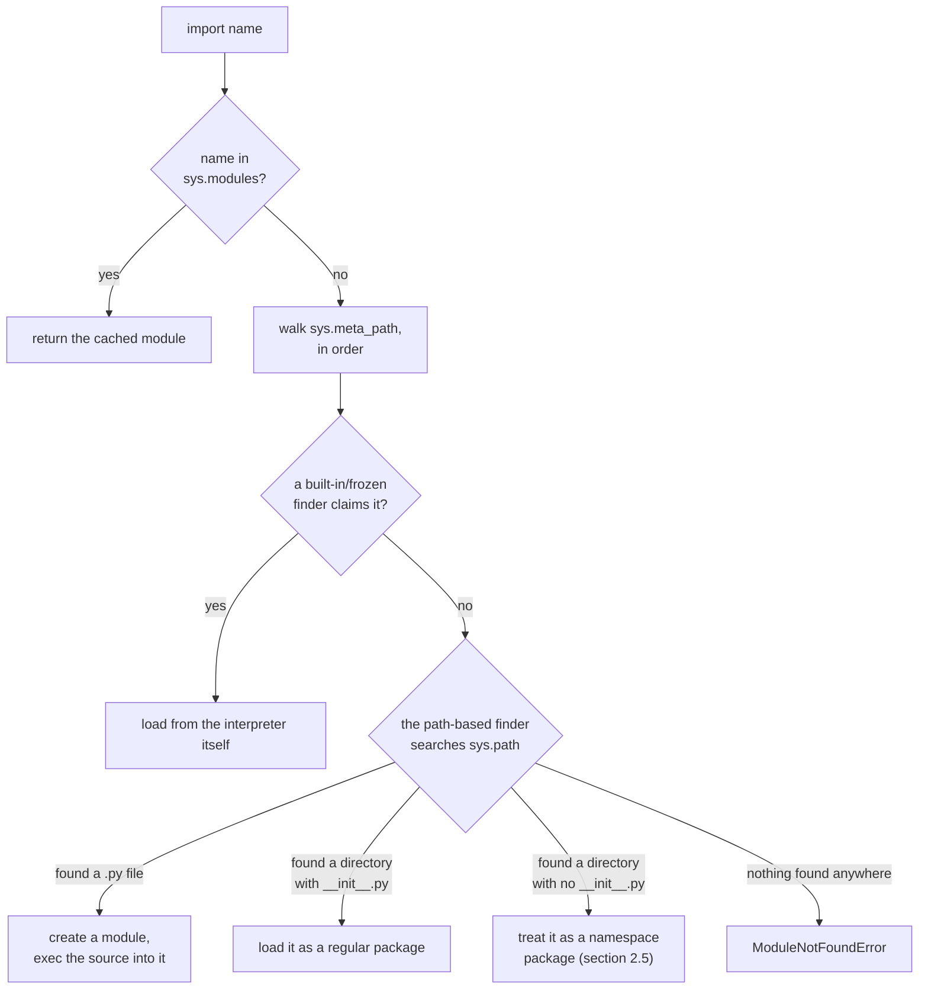
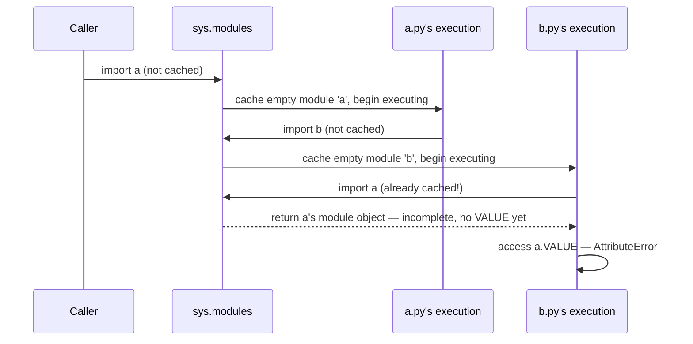
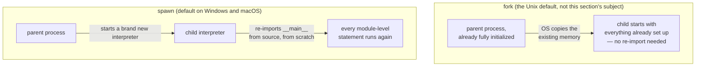

# The import system and packaging — what `import` actually does, and how a resolver decides what to install

*A module cache keyed by name, a circular import that fails on timing rather than on principle, and a dependency-resolution problem that is provably hard regardless of which tool is solving it.*

**Level:** L4 · **Prerequisites:** [01 object model and attribute lookup](01_object_model_and_attribute_lookup.md)
**Covers:** PY-08
**Sources:** Beazley, *Advanced Python Mastery* §9 (2024) · Wilson, *Software Design by Example*, ch. "A Package Manager" (2026) · Python import system reference, docs.python.org · PEP 328 (2004) · PEP 420 (2012) · `multiprocessing` documentation, docs.python.org · Di Cosmo, Zacchiroli, and Trezentos, *Package Upgrades in FOSS Distributions: Details and Challenges* (2005) · Astral, `uv` documentation

---

## 1. The problem this solves

`import` reads like a keyword, and it is one syntactically, but almost everything it does is an ordinary, inspectable operation running against ordinary data structures — a dictionary cache, a search path, a namespace being filled in by executing code. That gap between how `import` looks and what it does explains three things that otherwise look like unrelated pieces of trivia: why editing a module's source file mid-session and importing it again does not pick up the change, why two modules that import each other sometimes work and sometimes raise `AttributeError` depending on which line the failing reference sits on, and why a `multiprocessing` script on some platforms silently re-runs code the author only meant to run once.

```python
import sys
print('mod' in sys.modules)   # False, before the first import
import mod
print('mod' in sys.modules)   # True, now and for the rest of the process
import mod                     # does nothing new at all
```

None of these three puzzles is solved by memorizing "circular imports are bad" or "always guard your multiprocessing code" as bare rules. Each is a direct, predictable consequence of two facts this chapter builds from the ground up: a module is executed exactly once, into a real dictionary that other code can inspect mid-execution, and the thing performing that execution — the interpreter itself — is not privileged or special-cased relative to ordinary Python code. `import` is implemented in terms of the same object model, the same dictionaries, and the same exec-a-namespace mechanism that any other piece of metaprogramming in this book uses; understanding it is mostly a matter of realizing there is no separate, hidden layer underneath it to discover.

This chapter's first half is the import machinery itself — stable, unglamorous, and essentially unchanged for a decade, which is why a Beazley slide deck from 2024 still describes it accurately. Its second half is the layer built on top of that machinery to answer a question the import statement itself has no opinion about: given a project that depends on several packages, each of which depends on several more, which exact versions of everything should actually be installed. That second question turns out to be a different kind of problem entirely — not "where is this file" but "does any combination of versions satisfy every constraint at once" — and it is the layer that has changed the most recently, with a tool this shelf's own books predate now doing most of the work.

---

## 2. The mechanism, built up

### 2.1 `import name` is close to a function call against a cache

Stripped to its essentials, Beazley's own account of the mechanism reduces `import name` to a small, readable sequence: check whether `name` is already in a cache; if not, locate the source, build an empty module object, run the source *inside* that module's own namespace, and cache the result.

```python
# a simplified restatement of the actual mechanism
def import_module(name):
    if name in sys.modules:
        return sys.modules[name]
    filename = find_module(name)          # section 2.3 covers this step in full
    code = open(filename).read()
    mod = types.ModuleType(name)
    sys.modules[name] = mod                # cached *before* the body runs
    exec(code, mod.__dict__, mod.__dict__)
    return mod
```

Every top-level name a module defines — every `def`, every `class`, every plain assignment — is simply a key written into that module's own `__dict__` as `exec` runs the source against it. `import mod; mod.grok(2)` is not fetching something from a special, separate place; it is an ordinary attribute lookup (chapter 1's mechanism) against a namespace that a `def` statement happened to populate. `from mod import grok` does not change any of this — it still runs the *entire* module and still populates the *entire* cache entry; it only additionally copies one name out of that already-built namespace into the importing module's own namespace, which is why a `from`-import is not a smaller or a partial import in any real sense.

A module object's own reflective attributes follow directly from this same construction. `__name__` is simply the string the module was registered under — `"__main__"` for the file actually launched, the dotted path otherwise — and `__file__` is wherever the loader actually read the source from, both stored on the module object precisely because `types.ModuleType(name)` accepts and stores that name at construction, before a single line of the module's own source has run. A package additionally carries `__path__`, the list of directories its own submodules should be searched under, and `__package__`, the dotted name of the package it belongs to — both consulted by the finder pipeline in section 2.3 whenever a relative import (`from . import sibling`, formalized by **PEP 328**) needs to resolve "relative to what."

### 2.2 A module body runs exactly once per process, because `sys.modules` is checked first

The line `sys.modules[name] = mod` in the pseudocode above appears *before* the module's source is executed, not after, and that ordering is deliberate — section 2.4 depends on it directly. The immediate, simpler consequence is what makes module-level code a safe place to do real work: a database connection opened at module scope, a configuration dictionary built once, a compiled regular expression — none of it re-runs on a second `import` anywhere else in the same process, because the second `import` finds the name already in `sys.modules` and returns the cached object without touching the source file again.

This caching is also why editing a module's source during a long-running process and importing it again changes nothing: the cache is keyed purely by name, with no comparison against the file's contents or modification time. `importlib.reload()` exists specifically to force a re-execution, but it does so by running the new source *into the same, already-existing module dictionary* — which section 4.3 shows is a narrower operation than it sounds, because anything created from the *old* definitions before the reload does not retroactively become an instance of the *new* ones.

### 2.3 Finding a module is a chain of finders, each trying a different strategy

`find_module(name)` in section 2.1's pseudocode is itself a small pipeline, formalized in the actual import system as a list of **finder** objects, tried in order, each capable of claiming a name it knows how to handle:



`sys.meta_path` holds the finders tried first — normally including one for built-in and frozen modules and, most relevantly for ordinary code, `PathFinder`, which is what actually walks `sys.path` looking for a matching file or directory. Each finder that claims a name hands back a **spec** describing how to load it, and a matching **loader** is what actually reads the source and hands it to `exec`. This two-step split — a finder that says *where*, a loader that says *how* — is what lets Python import modules from a `.zip` archive, a frozen executable, or a network location without changing anything about how ordinary code writes `import`: each of those is a different finder/loader pair plugged into the same pipeline, invisible from the call site.

### 2.4 A circular import does not fail on principle — it fails on exactly which name is accessed before it exists

Two modules importing each other is not, by itself, an error. Section 2.2's ordering — the module is cached *before* its body finishes running — is precisely what makes this survivable at all, and precisely what determines whether it actually breaks:

```python
# a.py
print("a.py starting")
import b
print("a.py: b.VALUE =", b.VALUE)
VALUE = "from a"
```

```python
# b.py
print("b.py starting")
import a
print("b.py: a.VALUE =", a.VALUE)
VALUE = "from b"
```

```text
a.py starting
b.py starting
b.py: AttributeError: module 'a' has no attribute 'VALUE' (consider renaming '.../a.py' if it has the same name as a library you intended to import)
a.py: b.VALUE = from b
```



`import a` (running `a.py`) reaches `import b` before `a.py`'s own `VALUE = "from a"` line has executed. That `import b` triggers `b.py`, whose own `import a` does **not** re-run `a.py` — `a` is already sitting in `sys.modules`, per section 2.2, exactly because it was cached the moment its execution began, not when it finished. `b.py` gets a real, live reference to `a`'s module object, but that object's `__dict__` only contains whatever `a.py` had defined *up to the point it paused to import `b`* — which does not yet include `VALUE`. The `AttributeError` is not a generic "circular import" failure; it is a precise statement about ordering, and it would not occur at all if `b.py`'s reference to `a.VALUE` came *after* `a.py` had already finished running, or if `b.py` deferred that access into a function body instead of its own module-level code (a function isn't called until later, by which point `a.py` has completed). The general fix follows directly: restructure so that circularly-dependent names are read inside a function rather than at import time, or extract the specific shared names into a third module that both `a` and `b` import without needing anything from each other.

### 2.5 A directory with no `__init__.py` is still a package, since Python 3.3

Historically, an `__init__.py` file — even empty — was what made a directory importable as a package at all; Beazley's own slides from this shelf still teach it as a requirement. **PEP 420** relaxed this: a directory with no `__init__.py` anywhere in it can still be imported as a **namespace package**, discovered automatically by the same path-based finder from section 2.3.

```python
# no __init__.py anywhere under nspkg/
import nspkg.mod
print(nspkg.__path__)     # _NamespacePath([...])
print(type(nspkg.__loader__))   # <class '...NamespaceLoader'>
```

The distinguishing, and occasionally surprising, feature of a namespace package is that its `__path__` is not fixed to one directory — it can span **every** matching directory found across the whole of `sys.path`:

```python
# nsmerge/locA/shared/a_mod.py  and  nsmerge/locB/shared/b_mod.py
# — two entirely separate directories, both named "shared", on different sys.path entries
import shared.a_mod
import shared.b_mod
print(shared.__path__)
```

```text
_NamespacePath(['.../locB/shared', '.../locA/shared'])
```

Both directories are genuinely separate, physically unrelated locations, and both contribute submodules to the *same* `shared` package, merged transparently the moment neither one declares itself a regular package with an `__init__.py`. This is a deliberate feature — it is what lets a large project split a single logical package's implementation across multiple installed distributions — but it is also, per section 4.4, a real hazard for a directory that was only ever supposed to be self-contained and happened to omit `__init__.py` by accident rather than by design.

### 2.6 The `__main__` guard exists because "starting a new process" and "importing a module" are not always different operations

Every script run directly is, from the interpreter's point of view, a module named `__main__` — `if __name__ == "__main__":` is simply asking "was this file the one actually launched, or was it imported from somewhere else." That distinction becomes load-bearing, rather than stylistic, the moment `multiprocessing` uses the `spawn` start method, which is the default on Windows and macOS: `spawn` does not clone the running process's memory the way `fork` does — it starts a genuinely new Python interpreter and has that new interpreter **re-import the `__main__` module from scratch** to reconstruct whatever state the child process needs.

```python
import multiprocessing as mp

print("module top-level executing")

def worker():
    print("worker running")

if __name__ == "__main__":
    mp.set_start_method("spawn")
    p = mp.Process(target=worker)
    p.start()
    p.join()
    print("main done")
```

```text
module top-level executing
module top-level executing
worker running
main done
```



`"module top-level executing"` prints **twice** — once for the parent process's ordinary execution, and once again because the spawned child re-imports `__main__` as its own first act, per section 2.1's mechanism, running every top-level statement in the file a second time in a fresh interpreter. Everything inside the `if __name__ == "__main__":` block does *not* re-run in the child, specifically because the child's re-import checks `__name__` exactly as the parent's original run did, and in the child it evaluates to `"__main__"` only for the process the user actually launched — Python's own multiprocessing documentation states this guard is required specifically to avoid exactly this recursive re-execution turning genuinely dangerous, which section 4.2 makes concrete.

### 2.7 Choosing which versions to install is a constraint-satisfaction problem, not a lookup

Everything above answers "where is this module and how do I load it," for code already present on disk. A separate, harder question sits above it: given a project requiring several packages, each of which names its own required version ranges for its own dependencies, which single set of versions satisfies every stated constraint simultaneously. This is not a database lookup — it is the same shape of problem as boolean satisfiability, and Di Cosmo, Zacchiroli, and Trezentos's 2005 analysis of package-upgrade problems in Linux distributions proved dependency resolution of this general form to be **NP-complete**, encodable directly as a SAT instance. That result does not depend on which language or package ecosystem is doing the resolving; it is a statement about the mathematical shape of "satisfy every constraint at once," and it is the reason a resolver can, in principle, need to explore an exponential number of candidate combinations before either finding one that works or proving that none does.

Real tools do not run a generic SAT solver for this — they use algorithms tuned for the specific structure version constraints usually have. Since pip 20.3, pip's own resolver is a **backtracking** algorithm built on the `resolvelib` library: it picks a candidate version for each requirement, and when a later requirement turns out to conflict with an earlier choice, it discards some of that already-completed work and tries a different candidate rather than failing outright on the first contradiction found. `uv`, covered in the next section, uses a different, more modern algorithm from the same family — **PubGrub**, an incremental version-solving algorithm — implemented in Rust rather than pure Python, which is a meaningful part of why it resolves the same dependency graphs measurably faster without changing what problem is actually being solved underneath.

### 2.8 `uv` is a Rust-implemented replacement for the entire pip/venv/pyenv toolchain, not merely a faster pip

This is the part of the import-and-packaging subject that has moved the furthest since 2024: Beazley's own material on this shelf teaches `venv` for environments and `pip` for installation, both of which still work exactly as documented, but neither is the fastest or most commonly reached-for path in current practice. **`uv`**, from Astral — the team behind the `ruff` linter — reimplements the resolver (section 2.7's PubGrub algorithm) and the installer in Rust, and is explicitly positioned as a single replacement for `pip`, `pip-tools`, `pipx`, `poetry`, `pyenv`, and `virtualenv` at once, rather than a faster version of any one of them individually.

`uv run script.py` resolves and installs a project's declared dependencies into an isolated environment and runs the script against it in one step, without a separate, manually-activated virtual environment; `uv add package` updates both the project's declared dependencies and a lock file (`uv.lock`) recording the *exact* resolved versions, so that a second machine running `uv sync` against the same lock file reproduces the identical environment rather than re-running the resolver and potentially landing on a different, still-valid combination. None of this changes anything from sections 2.1 through 2.6 — the import machinery a resolved, installed package is eventually loaded through is the same finder/loader pipeline regardless of which tool did the resolving and installing.

---

## 3. Diagrams

The finder/loader flowchart in section 2.3, the circular-import timing diagram in section 2.4, and the fork-versus-spawn contrast in section 2.6 are integrated into the mechanism build-up above, as this format requires.

---

## 4. Failure modes

### 4.1 A circular import raises `AttributeError` at exactly the line that runs before its dependency has finished initializing

```python
# Gist: a.py
print("a.py starting")
import b
print("a.py: b.VALUE =", b.VALUE)
VALUE = "from a"
```

```python
# Gist: b.py
print("b.py starting")
import a
print("b.py: a.VALUE =", a.VALUE)
VALUE = "from b"
```

```text
a.py starting
b.py starting
AttributeError: module 'a' has no attribute 'VALUE'
```

Section 2.4 already traces the exact mechanism: `b.py`'s `import a` finds a real, cached, but *incomplete* module object, and `a.VALUE` is simply not there yet. What makes this defect genuinely troublesome in a real codebase is that it is order-sensitive in a way that is easy to fix accidentally without understanding why: moving the `VALUE = "from a"` line to occur *before* `import b` in `a.py` makes the exact same circular import work without error, which can make the defect look "fixed" by a change that only worked by coincidence and will break again the next time either file is reordered. The durable fix is structural rather than positional: move the cross-module attribute access inside a function body (deferring it until both modules have fully finished importing), or extract whatever `a` and `b` both need into a third module neither of them needs the other to define.

### 4.2 An unguarded `multiprocessing.Process` call at module scope spawns children recursively under `spawn`

```python
# Gist: unguarded_spawn.py
import multiprocessing as mp

def worker():
    print("working")

mp.set_start_method("spawn")
p = mp.Process(target=worker)
p.start()          # module-level, no __name__ guard
p.join()
```

Section 2.6 already establishes the mechanism this triggers: under `spawn`, the child process re-imports this file as `__main__` from scratch to reconstruct its state. Because the `Process().start()` call here sits at module scope rather than behind `if __name__ == "__main__":`, the child's re-import runs that exact same line again — spawning a second child, which re-imports the file again, spawning a third, in a chain that does not stop on its own. Python's own multiprocessing documentation states plainly that this guard is required for exactly this reason on platforms using `spawn`, and the failure mode it prevents is not a clean crash but a rapidly multiplying set of processes that can exhaust a machine's process table or memory before anyone notices what is launching them. The fix is the guard itself — moving every module-level side effect that should run only once, in the original process, behind `if __name__ == "__main__":` — and it costs nothing beyond remembering that "this file might be re-imported by a process that isn't the one a human launched" is a real possibility on the two most common desktop platforms, not a theoretical edge case.

### 4.3 `importlib.reload()` updates the module's namespace but not any object already built from its old classes

```python
# Gist: reload_staleness.py
# mod.py originally:
#   class Account:
#       def describe(self): return "v1"

import mod
a = mod.Account()
print(a.describe())                       # v1

# mod.py is edited on disk to return "v2"

import importlib
importlib.reload(mod)
print(a.describe())                        # still v1
print(isinstance(a, mod.Account))          # False
b = mod.Account()
print(b.describe())                        # v2
```

```text
v1
v1
False
v2
```

Section 2.2 already names the mechanism: `reload()` re-executes the new source into the module's *existing* dictionary, which rebinds the name `Account` to a **new** class object — it does not, and cannot, reach back and modify `a`, an instance built earlier from the *old* `Account`. `a.__class__` still points at the class object that existed before the reload, so `a.describe()` keeps calling the old method, and `isinstance(a, mod.Account)` is `False` because `mod.Account` now names a different object than the one `a` was actually built from. This is precisely why reload-based development workflows are fragile in exactly the way Beazley's own material warns against: any object holding a reference to an old class — including, subtly, any `super()` call inside a method defined on that old class, or any `isinstance` check against the freshly reloaded name — can behave inconsistently after a reload in ways that a fresh process restart would never exhibit. The practical fix is not a smarter reload; it is accepting that `reload()` is a narrow debugging convenience for a REPL session, never a substitute for restarting the process, and reaching for an actual process restart the moment more than the very simplest, instance-free module is involved.

### 4.4 Two unrelated directories with the same name silently merge into a single namespace package

```python
# Gist: accidental_namespace_merge.py
# locA/shared/a_mod.py  (from_a = True)   <- both on sys.path
# locB/shared/b_mod.py  (from_b = True)   <- neither directory has __init__.py

import sys
sys.path.insert(0, "locA")
sys.path.insert(0, "locB")
import shared.a_mod
import shared.b_mod
print(shared.__path__)
```

```text
_NamespacePath(['.../locB/shared', '.../locA/shared'])
```

Section 2.5 already covers why this succeeds at all: with no `__init__.py` in either directory, both qualify as namespace-package fragments under the identical name `shared`, and the path-based finder combines every matching directory it finds across the whole of `sys.path` into one logical package rather than treating the second one as a conflict or a shadow of the first. This becomes a genuine defect, rather than the intentional multi-distribution feature section 2.5 describes, the moment two *unrelated* projects happen to place a directory with the same name on the same `sys.path` — a vendored dependency's internal `utils/` colliding with a project's own `utils/`, for instance — with neither developer aware the other directory exists, let alone that omitting `__init__.py` would cause the two to blend into one importable namespace holding modules from both. Nothing about this raises an error; `import shared.a_mod` and `import shared.b_mod` both simply work, which is exactly what makes it hard to diagnose when a third module unexpectedly resolves to the wrong directory's file. The fix, once the merge is unwanted, is the traditional guard against it: add an `__init__.py` to whichever directory is meant to be a self-contained regular package, which removes it from namespace-package eligibility entirely and makes any accidental same-name collision on `sys.path` a normal, loud shadowing problem instead of a silent merge.

### 4.5 A same-named local file silently shadows a standard-library module

```python
# Gist: shadow_test/random.py
print("local random.py loaded instead of the standard library")
```

```python
# Gist: shadow_test/main.py
import random
print(random.__file__)
```

```text
local random.py loaded instead of the standard library
/.../shadow_test/random.py
```

Section 2.3's finder pipeline explains exactly why: `PathFinder` walks `sys.path` in order, and the directory containing the script being run is normally inserted at the very front of it — ahead of the standard library's own location. A file named `random.py`, `email.py`, `json.py`, or any other name matching a standard-library module, sitting in that same directory, is found first, every time, with nothing about the ordinary `import random` statement hinting that anything unusual happened. The failure this produces is rarely an exception at the point of import; it is every subsequent call into the shadowed module behaving nothing like its real standard-library counterpart, which tends to surface as confusing errors deep inside code that looks like it is using a trusted, well-known module correctly. The fix is simply never naming a project file after a standard-library module — a check that costs nothing and that most editors and linters can catch automatically — and, if a conflict is discovered after the fact, renaming the local file rather than trying to reorder `sys.path` around it, since the reordering fix does not generalize to the next standard-library name someone picks by coincidence later.

---

## 5. Trade-offs

| Approach | Use when | Because | Real cost |
| --- | --- | --- | --- |
| **Regular package (`__init__.py`)** | The package is self-contained and should never silently combine with another directory of the same name | Explicit, single-location, matches every reader's default mental model of "a package" | One boilerplate file per directory, easy to forget on a new subpackage |
| **Namespace package (PEP 420)** | A logical package is deliberately split across multiple separately-installed distributions | No `__init__.py` needed; contributions merge automatically by name | The exact same automatic merging can happen by accident between unrelated projects, per section 4.4 |
| **`importlib.reload()`** | A quick, throwaway check inside an interactive session | No process restart needed for a fast iteration loop | Existing instances silently keep referencing pre-reload classes, per section 4.3 — not safe once real state exists |
| **Restarting the process** | Anything beyond the simplest single-function edit-and-recheck loop | Every object, class, and cached reference starts genuinely fresh | Slower than a reload, by however long the process takes to start back up |
| **`pip` + `venv`** | Minimal tooling footprint, or an environment where installing an additional tool is not an option | Ships with every CPython installation; no extra dependency | Slower resolution and installation; separate tools needed for what `uv` unifies |
| **`uv`** | A new project, or an existing one willing to adopt a single unified tool | One tool for environments, resolution, installation, and locking; a substantially faster resolver | Another external tool to install and to trust; the ecosystem around it is younger than `pip`'s |

### When `reload()` is actively the wrong choice

The moment a session has created any object from a module's classes — which is most real, non-trivial debugging sessions almost immediately — `reload()` stops being a convenience and starts being a source of exactly the kind of stale-class bugs section 4.3 demonstrates, bugs that exist only because of the debugging technique itself and would not occur in a normal process restart. The rejected alternative to reaching for `reload()` out of habit is simply restarting the interpreter; it costs the time to reach a fresh state again, and it buys back the guarantee that nothing observed afterward is an artifact of the reload mechanism rather than the actual code.

### When a namespace package is the wrong default

Omitting `__init__.py` reflexively, on the reasoning that Python 3.3+ no longer requires it, gives up an explicit signal — "this directory is a complete, self-contained package" — in exchange for nothing, unless the multi-distribution splitting namespace packages exist for is actually needed. For an ordinary project's own internal packages, an explicit `__init__.py` remains the safer default specifically because it makes an accidental same-name collision on `sys.path` fail loudly (as an ordinary shadowing problem) instead of silently (as an unplanned merge).

### The case against manual `sys.path` manipulation

Appending to `sys.path` by hand at the top of a script is a tempting, immediate fix for "this import doesn't work from here," and it is also how section 4.5's shadowing hazard and section 4.4's accidental namespace merging most often get introduced — both depend entirely on exactly which directories end up on the path and in what order, and a manual `sys.path.insert(0, ...)` is precisely the kind of change that alters that order without anyone reviewing the consequences for every other import in the program. The rejected alternative to reaching for `sys.path` surgery is fixing the actual structural problem — installing the package properly (even in editable mode during development), or correcting the relative-import paths per section 2.1's package mechanics — which costs the time to understand why the import was failing in the first place, rather than the few seconds a path hack takes to write.

### The case against adopting `uv` without understanding what it replaces

`uv`'s breadth — replacing `pip`, `poetry`, `pyenv`, and `virtualenv` all at once — is also the reason adopting it uncritically, without understanding which of those tools' concepts (lock files, virtual environments, Python version pinning) it is actually managing underneath, can leave a team unable to diagnose a problem when `uv`'s own abstraction leaks. The rejected alternative to a wholesale switch is understanding the underlying mechanism this chapter builds — the resolver's job, the environment's job, the loader's job — well enough that `uv` reads as a faster, unified implementation of familiar concepts rather than as an opaque replacement for understanding them.

---

## 6. Reference summary

**`import name` checks `sys.modules` first, and caches the module object *before* running its source**, not after — the second fact is what makes a circular import survivable at all, and the first is what makes a module's top-level code run exactly once per process regardless of how many times it is imported.

**Finding a module walks `sys.meta_path`, most commonly reaching `PathFinder`, which searches `sys.path` for a matching file or directory.** A finder returns a spec; a loader does the actual reading and execution. This split is what lets a `.zip` archive, a frozen binary, or a namespace package all be imported through the identical `import` statement.

**A circular import fails only if one module accesses a name in the other before that name has been defined** — the failure is `AttributeError`, tied to execution order, not a dedicated "circular import" exception, and it can appear or disappear based on line ordering that looks unrelated to the actual defect.

**A directory needs no `__init__.py` to be importable, since Python 3.3 (PEP 420)** — such a namespace package's `__path__` can span every matching directory across all of `sys.path`, merging unrelated locations by name, which is a deliberate feature for multi-distribution packages and an accidental hazard for anything else.

**`if __name__ == "__main__":` distinguishes "this file was launched directly" from "this file was imported"**, and that distinction is load-bearing under `multiprocessing`'s `spawn` start method (the default on Windows and macOS), which re-imports the entire `__main__` module in every child process — module-level code outside the guard runs again in each child, and an unguarded process-spawning call at module scope spawns recursively without bound.

**`importlib.reload()` re-executes a module's source into its existing namespace**, rebinding class names to new class objects without updating any object already built from the old ones — a narrow interactive convenience, not a substitute for restarting the process once real state exists.

**Dependency resolution — choosing versions that satisfy every declared constraint at once — is NP-complete**, provably equivalent in difficulty to Boolean satisfiability, which is why it can be slow and why every real resolver uses a specialized, non-exhaustive algorithm rather than checking every combination. **`pip`'s resolver (since 20.3) is a Python backtracking algorithm (`resolvelib`); `uv` implements the PubGrub algorithm in Rust**, and is positioned as a single, faster replacement for `pip`, `pip-tools`, `pipx`, `poetry`, `pyenv`, and `virtualenv` together, with a lock file (`uv.lock`) recording the exact resolved versions for reproducible installs — none of which changes the underlying import machinery sections 2.1 through 2.6 describe, only what decides what gets installed before that machinery ever runs.

**A module's own reflective attributes are ordinary data, set at the moment its module object is constructed**: `__name__` is the registered name (`"__main__"` specifically for whichever file was actually launched), `__file__` is wherever the loader read the source from, and a package's `__path__`/`__package__` are what a relative import (`from . import sibling`, PEP 328) resolves against. `sys.path` ordering — normally the launched script's own directory first — is also what makes a same-named local file capable of silently shadowing a standard-library module of the identical name, with no error raised anywhere near the point of import.

---

← [Python knowledge graph](00_knowledge_graph.md) · [repo index](../README.md)
