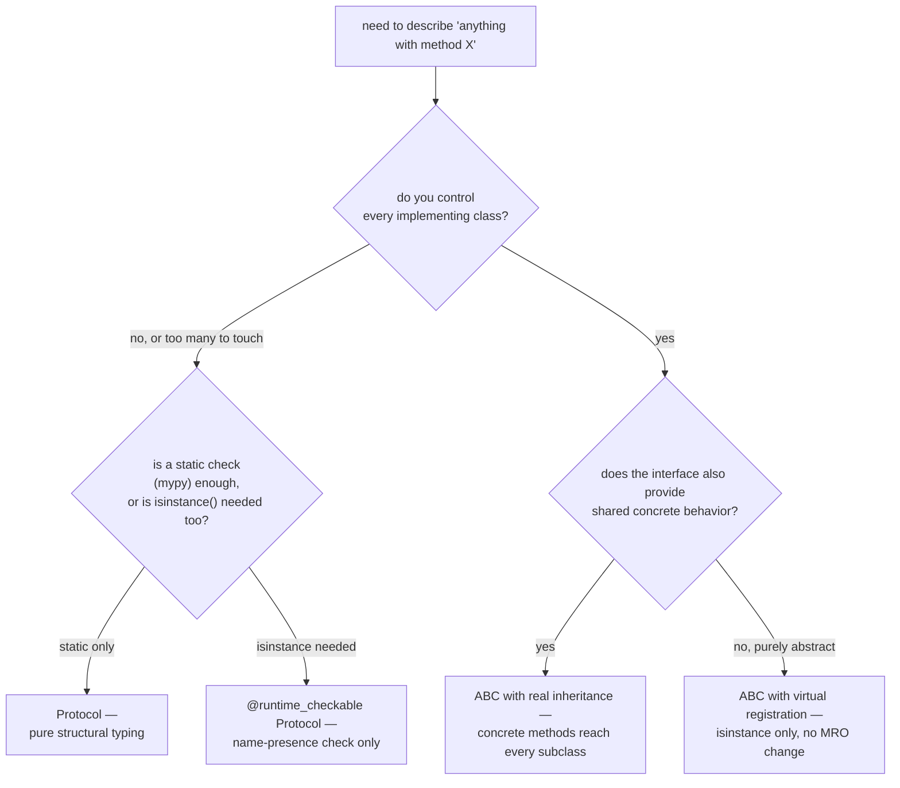
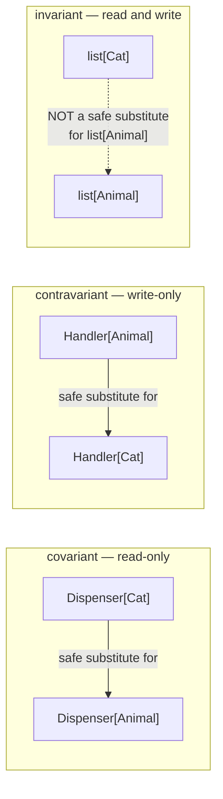

# The gradual type system — hints as data, checked by a program that never runs your code

*Why `def f(x: int)` does nothing at all when `f` is called, what changed in Python 3.14 about when an annotation is even evaluated, and the native generic syntax that replaced a decade of `TypeVar` boilerplate.*

**Level:** L4 · **Prerequisites:** [02 the special-method protocol](02_the_special_method_protocol.md)
**Covers:** PY-06
**Sources:** Ramalho, *Fluent Python* 2nd ed. ch.8, 13, 15 (2022) · PEP 695 (2023) · PEP 649 (2023) and PEP 749 (2024) · `annotationlib` documentation, docs.python.org · `typing` module documentation, docs.python.org

---

## 1. The problem this solves

```python
def apply_interest(balance: int, rate: float) -> float:
    return balance * (1 + rate)

print(apply_interest("not a number", "also not a number"))
```

```text
TypeError: unsupported operand type(s) for +: 'int' and 'str'
```

The annotations `balance: int`, `rate: float`, and `-> float` did nothing to prevent this call, and did nothing to produce the error either — the `TypeError` came from `1 + rate` failing inside the function body, exactly as it would have with no annotations present at all. This is not a bug or an oversight; it is the entire design of Python's type system stated in one example. Annotations are never consulted by the interpreter while a program runs. They are ordinary Python objects, stored in a place any code can inspect, read by a **separate program** — a static type checker such as mypy — that analyzes the source without ever executing it, and that separate program is the only thing that would have caught this call as wrong, and only if it had been run before the call was ever made.

Contrast this with a language whose type system is enforced by the compiler or runtime itself — Java rejecting a program that does not type-check at all, or a runtime `ClassCastException` the moment an incompatible object is force-cast. Python has no equivalent gate anywhere in its execution model, and adding types to the language was never going to change that without breaking every dynamic idiom the language already depended on — duck typing, monkey-patching, functions that genuinely accept more than one shape of argument on purpose. The design chosen instead treats types as documentation precise enough for a machine to check, layered entirely on top of a runtime that continues to know nothing about them.

This is what "gradual" means in gradual typing, and it is a real, deliberate trade-off rather than an unfinished feature: a codebase can be entirely unannotated, entirely annotated, or — realistically, almost always — annotated unevenly, with the type checker enforcing exactly as much rigor as the annotations present actually specify, and enforcing nothing at all anywhere they are absent. Retrofitting types onto an existing dynamic codebase can happen one function at a time, in one module at a time, without a flag day where everything must type-check at once. The cost of that flexibility is the trade this chapter is about: types are data the runtime carries and ignores, checked by a tool that has to reconstruct, from that data, guarantees the interpreter itself makes no attempt to enforce — and how that data is stored, when it is evaluated, and how faithfully it can describe an arbitrarily dynamic language have all changed materially since the shelf's own primary source was written, most sharply in the two most recent CPython releases.

---

## 2. The mechanism, built up

### 2.1 An annotation is a plain object living in a dictionary, consulted by nothing at runtime

```python
def clip(text: str, max_len: int = 80) -> str:
    return text[:max_len]

print(clip.__annotations__)
```

```text
{'text': <class 'str'>, 'max_len': <class 'int'>, 'return': <class 'str'>}
```

`__annotations__` is an ordinary dictionary, mapping parameter names (and the special key `'return'`) to whatever objects the annotation expressions evaluated to — here, the actual `str` and `int` classes, not strings naming them. Nothing about calling `clip` reads this dictionary; `clip("hello", "not an int")` runs exactly as far as the body lets it, `text[:max_len]` in this case raising `TypeError` only because slicing genuinely requires an integer, not because anything checked the annotation first. The entire value of this dictionary is what a second program can do by reading it later — a type checker analyzing the source, a runtime validation library like Pydantic (covered later on this shelf) building a schema from it, a documentation generator rendering it — never anything the interpreter itself acts on while running the function.

### 2.2 Since Python 3.14, an annotation is evaluated lazily, on first access — not at definition time

Every annotation used to be evaluated **eagerly**, at the moment the `def` or `class` statement ran, which created a genuine problem this shelf's primary source documents in detail: a method that returns an instance of the very class still being defined has no way to name that class yet, because the class object does not exist until its body finishes executing.

```python
class Rectangle:
    def stretch(self, factor: float) -> 'Rectangle':   # must be a string — Rectangle doesn't exist yet
        ...
```

Writing the forward reference as a string was the standard, required workaround, and `from __future__ import annotations` (available since 3.7) turned every annotation in a module into a string automatically, sidestepping the problem at the cost of making `__annotations__` hold text that had to be separately parsed and evaluated by anything wanting the real type — `typing.get_type_hints()`, and later `inspect.get_annotations()`, existed specifically to do that resolution correctly.

**PEP 649**, implemented via **PEP 749** in Python 3.14, replaces this arrangement rather than papering over it further. An annotation is no longer evaluated at `def` time at all; it is compiled into a small function — accessible as `__annotate__` — that is only *called* the first time something actually asks for `__annotations__`. This means a forward reference to a name that does not exist yet is not an error at definition time:

```python
def f(x: Undefined) -> None:
    pass

print("defined fine")            # prints — no error yet
print(hasattr(f, '__annotate__'))  # True — the annotation is stored, not evaluated

f.__annotations__                  # evaluation happens HERE, on first access
```

```text
defined fine
True
NameError: name 'Undefined' is not defined
```

The function is defined successfully — `Undefined` is never looked up during that definition — and the `NameError` only fires the moment something actually reads `f.__annotations__`, which is a materially different failure timing than every prior version of Python, where the identical mistake would have failed immediately, at the `def` statement itself. The new `annotationlib` module gives controlled access to this deferred state without forcing full evaluation: `annotationlib.get_annotations(f, format=Format.STRING)` returns `{'x': 'Undefined', 'return': 'None'}` as literal text, and `format=Format.FORWARDREF` returns a `ForwardRef` placeholder object for any name that cannot yet be resolved, letting a caller inspect what was written without triggering the `NameError` that fully resolving it would cause.

```mermaid
stateDiagram-v2
    [*] --> Defined: def/class statement runs;<br/>__annotate__ stored, not called
    Defined --> Evaluated: something reads __annotations__<br/>(or calls __annotate__ directly)
    Evaluated --> Resolved: every name in the annotation<br/>already exists — values returned
    Evaluated --> Failed: a name doesn't exist yet — NameError,<br/>raised here, not at definition time
```



`from __future__ import annotations` still works exactly as before in 3.14 — every annotation in the module becomes a string, unconditionally — but PEP 749 itself states it will be formally deprecated once the last pre-649 Python release (3.13) reaches end of life, on the reasoning that the `__future__` import existed specifically to work around a problem the language itself no longer has.

### 2.3 Gradual typing means the checker's strictness is a dial, not a switch, and `Any` is the universal escape hatch

A type checker like mypy does not simply pass or fail a file; it can be run at multiple levels of strictness, and an entirely unannotated function is, by default, not checked at all rather than flagged as an error — the checker treats an absent annotation as "could be anything," identical in effect to an explicit `Any`. `Any` is deliberately **consistent-with** every other type in both directions: a value typed `Any` can be passed where a `str` is expected and vice versa, with no error either way, which is precisely what makes it useful as an escape hatch for a genuinely dynamic value and dangerous as a habit — Ramalho's own account of this shelf's material calls `Any` "contagious," because once a value flows into code typed `Any`, everything downstream that touches it silently stops being checked as well, even if every individual annotation nearby looks perfectly precise.

```python
def parse(raw) -> None:        # no annotation on raw at all — treated as Any
    ...
```

Mypy's own strictness settings are genuinely incremental rather than a single on/off switch, which is the concrete mechanism behind "gradual" as a practice rather than merely as a theoretical description. A team can start with the checker configured to accept nearly anything, catching only outright contradictions — calling a method that a declared type definitely does not have, for instance — and only later, once real annotation coverage exists, turn on flags like `--disallow-untyped-defs` (every function must be annotated) or `--strict` (a bundle of the strictest individual settings at once). Running the strict configuration against a freshly-started, unannotated codebase would produce an overwhelming, useless wall of errors; running the lenient configuration against a fully-annotated one would silently let real mistakes through. The two settings exist for two different points in the same project's life, not two different kinds of project.

A checker configured strictly (mypy's `--disallow-untyped-defs`, for instance) can be told to flag exactly this — a function with no annotations at all — as an error in its own right, which is the practical mechanism behind "gradual": the same codebase can run the checker leniently while types are still being added, and progressively tighten the configuration as coverage grows, without any change to how the interpreter runs the code in the meantime.

### 2.4 A `Protocol` is duck typing checked statically, without any inheritance declared anywhere

Chapter 2 already covers duck typing as a runtime mechanism — `hasattr(x, "read")`, checked when the code actually runs. `typing.Protocol` is the static counterpart: a class is treated as satisfying a `Protocol` purely by having the right methods, with no explicit relationship declared between them anywhere in the source.

```python
from typing import Protocol

class SupportsBalance(Protocol):
    def balance(self) -> float: ...

class Account:
    def balance(self) -> float:
        return 100.0

def report(x: SupportsBalance) -> None:
    print(x.balance())

report(Account())    # type-checks and runs — Account never mentions SupportsBalance
```

`Account` does not inherit from `SupportsBalance` and does not register with it in any way; a type checker accepts the call to `report(Account())` purely because `Account` happens to define a `balance` method with a compatible signature. This is **structural typing**: the shape of the class, not its declared ancestry, is what satisfies the type. Marking a `Protocol` with `@runtime_checkable` additionally allows `isinstance()` against it at runtime — but only as a check for the *presence* of the right method names, not their actual signatures, which section 3.3 shows is a real and sharp limitation rather than a minor caveat.

### 2.5 Goose typing is an ABC's own answer to the same problem, checked at runtime, with the option to opt in from outside a class entirely

Ramalho's own term for this — **goose typing** — names a runtime-checked, ABC-based alternative that sits between strict nominal subclassing and pure structural duck typing. An abstract base class can be satisfied either by genuine inheritance or by explicit **virtual subclass registration**, which declares a class compatible without touching its definition or its actual method resolution order at all:

```python
from abc import ABC, abstractmethod

class Shape(ABC):
    @abstractmethod
    def area(self) -> float: ...
    def describe(self):
        return f"a shape with area {self.area()}"

class Square:
    def __init__(self, side): self.side = side
    def area(self): return self.side ** 2

Shape.register(Square)
print(isinstance(Square(3), Shape))   # True
print(Square.__mro__)                  # (Square, object) — Shape is not actually a base
```

```text
True
(<class '__main__.Square'>, <class 'object'>)
```

`isinstance` reports `True`, and the class genuinely satisfies the interface for the purpose a checker or an `isinstance` gate cares about — but `Square.__mro__` shows plainly that `Shape` is not actually one of `Square`'s ancestors. Registration is a one-way promise, not a structural relationship the object model enforces; it makes `Square` recognized *as* a `Shape` without giving it any of `Shape`'s concrete behavior, which section 3.4 demonstrates directly. This is the deliberate trade goose typing makes relative to real subclassing: the flexibility to declare compatibility for a class defined somewhere else, entirely from the outside, at the cost of gaining none of the base class's own machinery in the process.



Reading this decision from left to right is really reading section 2.4 and section 2.5 as one continuous choice rather than as two unrelated tools: the further right a path leads, the more the interface can offer beyond a bare type check, and the more it demands of — or gives to — whatever class is actually satisfying it.

### 2.6 PEP 695 replaced `TypeVar` boilerplate with generics as native syntax

Before Python 3.12, writing a generic class required declaring a `TypeVar` separately and threading it through `Generic[...]`:

```python
from typing import TypeVar, Generic
T = TypeVar('T')
class Box(Generic[T]):
    def __init__(self, item: T) -> None:
        self.item = item
```

**PEP 695**, shipped in Python 3.12, replaces this with type parameters declared directly in the class or function header, with no separate `TypeVar` object or `Generic` base required at all:

```python
class Box[T]:
    def __init__(self, item: T) -> None:
        self.item = item
    def get(self) -> T:
        return self.item

def first[T](items: list[T]) -> T:
    return items[0]

type Maybe[T] = T | None
```

```python
print(Box.__type_params__)   # (T,)
```

`class Box[T]:` and `def first[T](...)` both introduce `T` scoped to exactly that class or function, eliminating the separate top-level `TypeVar` declaration and the risk of accidentally reusing one `TypeVar` object across unrelated generics. The `type` statement is a third piece of this same PEP: `Maybe[T]` is a genuine type alias, and — consistent with section 2.2's broader shift — its right-hand side is evaluated lazily, only when the alias is actually used, which means a `type` alias can reference names that do not exist yet at the point it is defined, the same forward-reference relief PEP 649 brings to ordinary annotations. The older `TypeVar`-based spelling still works unchanged in 3.14 and remains necessary for any code that must keep running on pre-3.12 interpreters; PEP 695 syntax is the current, preferred form for everything else.

### 2.7 Variance is a static-only concept, invisible to the interpreter, describing which direction a generic type may safely substitute

Nothing enforces this at runtime — `Dispenser[int]` and `Dispenser[str]` are, to the interpreter, both just instances of the same ordinary class, with type parameters that exist purely for a checker's benefit and vanish completely once the program is running. The question variance answers is purely static: given a generic `Container[T]`, is `Container[Cat]` safe to use wherever `Container[Animal]` is expected.

A type is **covariant** in `T` if that substitution is safe specifically because `T` only ever comes *out* — a read-only dispenser of `Cat`s is safely usable as a read-only dispenser of `Animal`s, because anything read from it is, in fact, an `Animal`. A type is **contravariant** in `T` if the substitution is safe in the *opposite* direction — a handler that only ever *accepts* `Animal`s is safe to use wherever something that accepts only `Cat`s is expected, because it can certainly handle a `Cat` too. A type is **invariant** — the default, and the only safe choice for anything genuinely mutable — when `T` is used both ways, as both an input and an output: a mutable `list[Cat]` cannot safely stand in for a `list[Animal]`, because code holding the `list[Animal]` reference could insert a `Dog` into it, corrupting what the original `list[Cat]` reference believes it contains.



This is exactly the same soundness argument chapter 2's `NotImplemented`-based operator protocol and chapter 1's `__slots__` restrictions both ultimately rest on: a rule exists because relaxing it would let correct-looking code corrupt something elsewhere silently, and a type checker's variance rules are only Python's most explicit, most formally named instance of that same recurring shape of argument.

### 2.8 `TypedDict` and `@overload` describe shapes a plain annotation cannot

Two further pieces of vocabulary round out what this chapter's Covers list treats as the type system's working surface. **`TypedDict`** annotates a plain `dict` with a fixed, named set of keys and per-key types — the dict itself remains an ordinary runtime `dict`, with `TypedDict` existing purely to give a checker something precise to verify against:

```python
from typing import TypedDict

class Transaction(TypedDict):
    amount: float
    kind: str

t: Transaction = {"amount": 100.0, "kind": "deposit"}
```

**`@overload`** lets a single function be described as having several distinct, individually-typed call signatures, useful whenever a function's return type genuinely depends on which argument type was passed rather than being expressible as one union:

```python
from typing import overload

@overload
def process(x: int) -> int: ...
@overload
def process(x: str) -> str: ...
def process(x):
    return x
```

Only the final, unadorned `def process(x):` actually runs; the two `@overload`-decorated signatures above it exist purely for the type checker to match a given call site against, and are never called themselves. **PEP 604**'s `X | Y` union syntax (`int | None` in place of `Optional[int]`, `str | int` in place of `Union[str, int]`) is the same idea applied to argument and return types generally — already current when Ramalho's chapters on this shelf were written, and unaffected by anything in sections 2.2 or 2.6.

---

## 3. Failure modes

### 3.1 A type mismatch the checker would not even flag can still produce a silently wrong result

```python
# Gist: numeric_tower_mismatch.py
def apply_interest(balance: int, rate: float) -> float:
    return balance * (1 + rate)

print(apply_interest(1000, 5))    # meant 0.05 (5%), passed 5 by mistake
```

```text
6000
```

Nothing about this call is even a type error a checker would catch, which makes it sharper than an ordinary annotation mismatch: **PEP 484 explicitly makes `int` compatible with `float`** as a deliberate, pragmatic exception rather than an oversight, so `rate: float` accepts the integer `5` cleanly, by design, in both mypy's eyes and the interpreter's. The bug is not a type error at all — it is a units error, `5` meant as a percentage where the function expects a fraction — and the type system, static or dynamic, has no vocabulary for "this float should additionally be less than one." Section 2.1 already establishes that annotations carry no runtime enforcement in any case; this failure mode goes one step further and shows a case where even a fully type-checked, fully passing codebase would not have caught the mistake, because the checker's job is verifying that the *shape* of the data matches, never that the *value* means what the caller intended. The only real defenses are one level up from typing entirely: a narrower, self-documenting type (a small `Percentage` value object that only accepts values in a sane range, validated in its own constructor) or a runtime assertion at the boundary — neither of which this chapter's type-hint vocabulary provides on its own.

### 3.2 A forward reference that never resolves fails at first inspection, not at the point it was written

```python
# Gist: lazy_annotation_failure.py
def register_handler(event: EventType) -> None:   # EventType defined nowhere in this file
    print("registered")

register_handler("deposit")     # runs fine — the annotation is never evaluated here
print("still fine")

import inspect
inspect.signature(register_handler)   # first thing that actually reads the annotation
```

```text
registered
still fine
NameError: name 'EventType' is not defined
```

Section 2.2 already traces this precisely: PEP 649's deferred evaluation means `EventType` genuinely never has to exist for `register_handler` to be defined and called successfully — the function's actual behavior has nothing to do with its annotations at all. The `NameError` only fires the moment something calls `inspect.signature`, reads `__annotations__` directly, or otherwise triggers `__annotate__` — which, in a real codebase, is often a debugging tool, a documentation generator, or a runtime validation library (Pydantic, covered later on this shelf) rather than anything in the program's own ordinary control flow. This makes the defect's symptom appear far from its cause in a way earlier Python versions did not: before 3.14, the identical typo would have failed loudly at the `def` statement itself, the moment the module was first imported, rather than lying dormant until some later, possibly rare, code path finally asks to see the annotation.

### 3.3 A `runtime_checkable` `Protocol`'s `isinstance` check verifies method names, never their signatures

```python
# Gist: protocol_signature_gap.py
from typing import Protocol, runtime_checkable

@runtime_checkable
class Sized(Protocol):
    def __len__(self) -> int: ...

class WeirdLen:
    def __len__(self, extra):   # wrong signature — requires an extra argument
        return 5

w = WeirdLen()
print(isinstance(w, Sized))     # True
len(w)                           # actually calling it
```

```text
True
TypeError: WeirdLen.__len__() missing 1 required positional argument: 'extra'
```

Section 2.4 already names the limitation this exposes: a `runtime_checkable` `Protocol`'s `isinstance` check is implemented as a presence check against the type's `__dict__` — does a method with this name exist — and nothing about it inspects that method's parameter list, its return type, or whether it can actually be called the way the protocol implies. `WeirdLen` passes the check cleanly and then fails the very next moment anything actually tries to use it as sized, because `len()` calls `__len__()` with no arguments, and `WeirdLen.__len__` demands one. Code that gates behavior on `isinstance(x, SomeRuntimeCheckableProtocol)` and then trusts the object fully is trusting a check that is real but considerably weaker than it looks; the fix is either to call the method inside a `try`/`except TypeError` at the actual point of use regardless of the `isinstance` result, or to rely on static checking (which does inspect full signatures) rather than the runtime check for anything beyond a coarse, best-effort filter.

### 3.4 Virtual subclass registration grants `isinstance` compatibility without granting any of the base class's actual behavior

```python
# Gist: virtual_subclass_gap.py
from abc import ABC, abstractmethod

class Shape(ABC):
    @abstractmethod
    def area(self) -> float: ...
    def describe(self):
        return f"a shape with area {self.area()}"

class Square:
    def __init__(self, side): self.side = side
    def area(self): return self.side ** 2

Shape.register(Square)
sq = Square(3)
print(isinstance(sq, Shape))    # True
sq.describe()
```

```text
True
AttributeError: 'Square' object has no attribute 'describe'
```

Section 2.5 already shows why: `Shape.register(Square)` makes `isinstance(sq, Shape)` return `True`, but it never touches `Square.__mro__`, which still reads `(Square, object)` — `Shape` is nowhere in it. `describe`, a perfectly ordinary concrete method `Shape` provides to every *real* subclass, is simply not reachable from `Square` at all, because chapter 1's attribute-lookup mechanism walks the actual MRO, and registration was never part of it. Code that checks `isinstance(x, Shape)` as a gate and then calls a method `Shape` defines concretely, rather than only the abstract method it actually declared, will work for every genuine subclass and fail specifically for every virtually-registered one — a defect that tends to surface only once a virtual subclass is introduced well after the `isinstance` gate was written and trusted. The fix is to keep an ABC's own concrete methods to an absolute minimum (or none at all) whenever virtual subclassing is part of its intended usage, since anything concrete on the base is a promise that only real inheritance actually keeps.

---

## 4. Trade-offs

| Approach | Use when | Because | Real cost |
| --- | --- | --- | --- |
| **No annotations** | Small scripts, exploratory code, or a codebase not yet worth the investment | Zero overhead, zero ceremony | No static checking at all; every type mismatch is a runtime surprise or silent wrong result |
| **Gradual annotation, lenient checker config** | An existing, large, unannotated codebase being improved incrementally | Types can be added file by file with no flag day | Unannotated code remains fully unchecked, `Any`-equivalent, for as long as it stays that way |
| **`Protocol` (structural)** | The types that should satisfy an interface are not under your control, or are numerous and unrelated | No inheritance or registration needed anywhere | `runtime_checkable` gives only a name-presence check, per section 3.3 — real strength lives in the static checker, not at runtime |
| **ABC with real inheritance** | The interface should also provide shared concrete behavior to every implementer | Subclasses genuinely gain the base's methods through the real MRO | Every implementer must be written (or rewritten) to inherit from the ABC |
| **ABC with virtual registration** | An existing, unmodifiable class should be recognized as satisfying an interface | No changes needed to the registered class at all | Grants `isinstance` compatibility only — none of the base's concrete behavior, per section 3.4 |
| **PEP 695 native generics** | New code targeting Python 3.12+ | No separate `TypeVar`, scoped automatically to the class/function | Unusable on any interpreter before 3.12 — the legacy `TypeVar` form remains necessary for that audience |

### When `Any` is the honest choice, not a shortcut

`Any` is correctly reached for when a value's type genuinely cannot be known statically — the result of `json.loads` on data whose shape is not fixed, for instance — and incorrectly reached for as a way to silence a checker complaint without actually resolving what the real type should be. The difference is not stylistic: an honest `Any` marks a real boundary of what static analysis can know; a defensive `Any` used to make an error go away hides a mismatch a checker would otherwise have caught, exactly as section 3.1 demonstrates going unnoticed at runtime.

### The case against reaching for a metaclass-based or decorator-based validation scheme instead of `Protocol`

Before structural typing was available, verifying that an object "quacked" correctly typically meant either an ABC with real inheritance forced onto every implementer, or a runtime check scattered through the code calling `hasattr` several times in a row. `Protocol` replaces both with a single, statically-checked declaration that costs nothing at runtime unless explicitly marked `runtime_checkable` — the rejected alternative of forcing inheritance is a needless coupling between an interface and every type that happens to satisfy it, which is precisely the coupling structural typing exists to remove.

### When real inheritance beats a `Protocol`, regardless of how attractive structural typing looks

The moment shared, non-trivial concrete behavior needs to live in one place and be reused by every implementer — not merely a shared method *signature*, but a shared method *body* — a `Protocol` cannot help at all, since it declares shape, never implementation. An ABC with real inheritance, accepting the coupling cost, is the correct tool specifically when that reuse is the actual goal; reaching for a `Protocol` here and then duplicating the same method body into every class that should satisfy it is trading a small, honest coupling for a real, ongoing maintenance cost.

### The case against skipping the type checker in CI because "the code runs fine"

Section 3.1 and section 3.2 both demonstrate the same underlying fact from different angles: a program that runs without raising an exception has not been shown to be correct, only shown not to have crashed on the specific inputs it happened to receive. Treating "it ran" as equivalent to "the types are right" is exactly the assumption gradual typing was built to let a team stop relying on, and skipping the checker in CI — reserving it for occasional, manual, local runs — reintroduces the very risk annotations were added to reduce, while keeping all of the ongoing cost of writing and maintaining them. The rejected alternative to running the checker in CI is trusting that whoever last touched a piece of annotated code also remembered to run mypy locally before committing; the cost of actually gating merges on it is a slower CI pipeline and, occasionally, a legitimately inconvenient wait for a fix to an error the checker was right to raise.

---

## 5. Reference summary

**An annotation is a plain object (or, since 3.14, a deferred computation) that the interpreter never consults while running code.** `__annotations__` is an ordinary dictionary; a type checker, not the runtime, is what turns that data into an enforced guarantee, and a codebase can be partially, unevenly annotated by design — that partiality is what "gradual" means.

**Since Python 3.14 (PEP 649, via PEP 749), annotations are evaluated lazily**, stored as an `__annotate__` function called only on first access to `__annotations__` (or through the new `annotationlib` module's `VALUE`/`FORWARDREF`/`STRING` formats) rather than eagerly at `def`/`class` time. A forward reference to an undefined name is no longer an error at definition time — it becomes one only at first inspection, which changes *where* the resulting `NameError` surfaces, not whether it can occur. `from __future__ import annotations` still works in 3.14 but is slated for eventual deprecation once Python 3.13 reaches end of life.

**`Any` is consistent-with every type in both directions** and is "contagious" in Ramalho's own phrase — once a value is typed `Any`, everything it touches is unchecked as well, which makes an honest, boundary-marking `Any` very different from a defensive one used to silence a real complaint.

**`Protocol` is structural typing**: a class satisfies it purely by shape, with no inheritance or registration declared. **`runtime_checkable` extends this to `isinstance`, but only as a check for method-name presence — never signatures**, which is why an object can pass the check and still fail the moment it is actually used. **ABC-based "goose typing" offers virtual subclass registration** (`Shape.register(Square)`) as a runtime-checked alternative to real inheritance — it grants `isinstance` compatibility without adding the registered class anywhere in its actual MRO, so none of the base class's concrete methods become reachable from it.

**PEP 695 (Python 3.12) replaces `TypeVar`/`Generic` boilerplate with native syntax** — `class Box[T]:`, `def first[T](...)`, and a lazily-evaluated `type Alias[T] = ...` statement — scoped automatically with no separate top-level declaration; the legacy `TypeVar` form still works and remains necessary only for code that must run on pre-3.12 interpreters.

**Variance (covariant/contravariant/invariant) is a purely static concept**, invisible to the running interpreter, describing which direction a generic type is safe to substitute: covariant for read-only production of a type, contravariant for write-only consumption of one, invariant — the only sound choice for a mutable container — when both directions are possible at once.

---

← [Python knowledge graph](00_knowledge_graph.md) · [repo index](../README.md)
