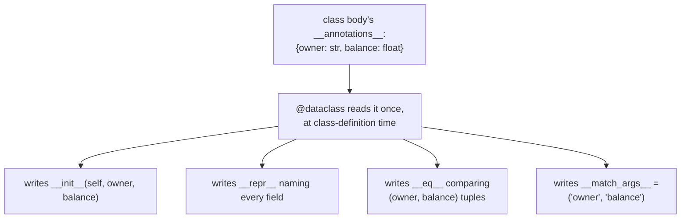
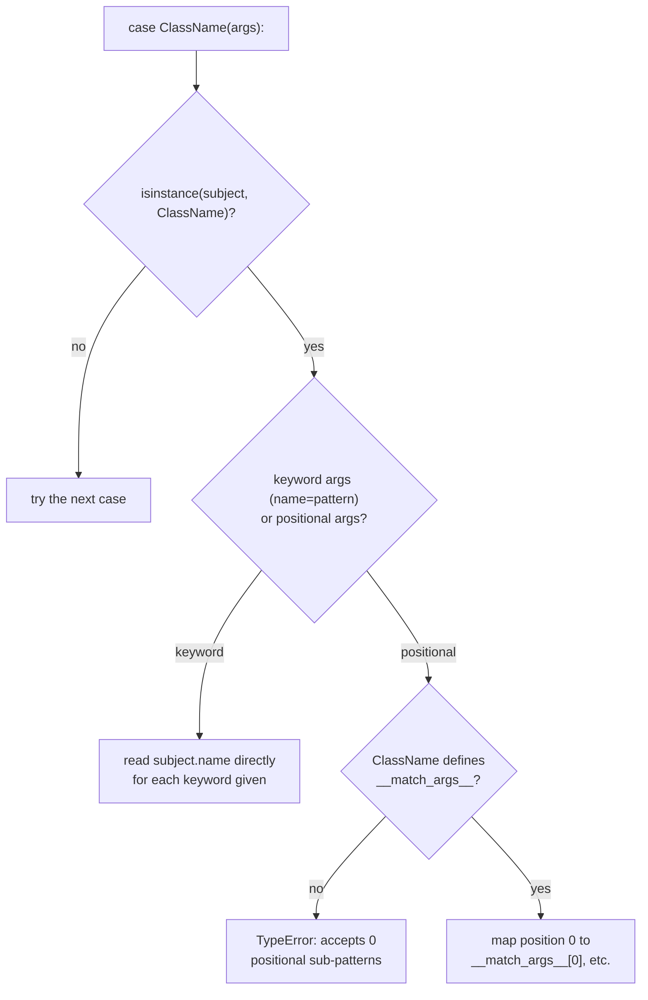
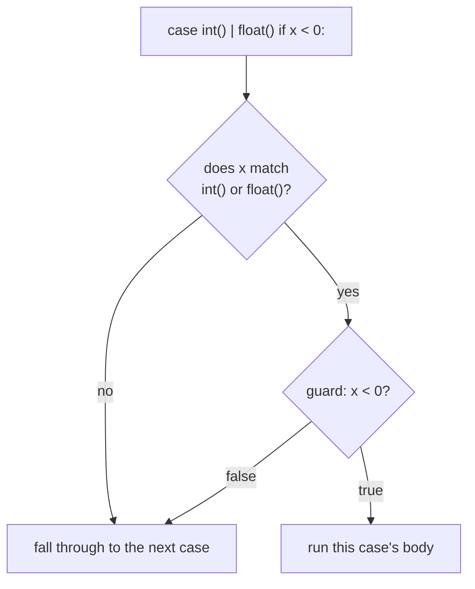

# Data classes and pattern matching — records that write their own boilerplate, and syntax that checks shape before it binds

*What `@dataclass` actually generates, the one mutable default it catches and the ones it does not, and the single most misread line in the entire `match` statement.*

**Level:** L4 · **Prerequisites:** [01 object model and attribute lookup](01_object_model_and_attribute_lookup.md), [09 the gradual type system](09_the_gradual_type_system.md)
**Covers:** PY-12, PY-20
**Sources:** Ramalho, *Fluent Python* 2nd ed. ch.2, 3, 5, 11, 18 (2022) · PEP 526 (2016) · PEP 557 (2018) · PEP 634 (2021)

---

## 1. The problem this solves

A record — a handful of named fields, meant to be compared, printed, and passed around — costs the same four or five methods every time it is written by hand:

```python
class Account:
    def __init__(self, owner, balance):
        self.owner = owner
        self.balance = balance
    def __repr__(self):
        return f"Account(owner={self.owner!r}, balance={self.balance!r})"
    def __eq__(self, other):
        if not isinstance(other, Account):
            return NotImplemented
        return (self.owner, self.balance) == (other.owner, other.balance)
```

Every one of these methods is entirely mechanical, derived from nothing but the list of fields already named once in `__init__`'s parameter list — and yet a plain class gets none of them for free, chapter 1's inherited `object.__repr__` and identity-based `__eq__` being the only defaults available. `@dataclass` exists specifically to stop writing this by hand: the field list, declared once as annotations, is enough for the decorator to generate `__init__`, `__repr__`, and `__eq__` automatically, correctly, and consistently across every class that uses it.

A second, seemingly unrelated problem shares more with the first than it first appears: deciding what to do with a value based on its *shape* rather than a single property of it.

```python
if isinstance(point, tuple) and len(point) == 2 and isinstance(point[0], (int, float)):
    x, y = point
    ...
```

This is legible, but it scales badly — a third field, a nested structure, or an alternative shape the same variable might take all multiply the number of conditions a single `if` has to spell out by hand, and every one of those conditions has to bind the fields it just checked in a separate line right afterward, `x, y = point`, repeating information the `if` already established. `match`/`case`, from **PEP 634**, is a piece of syntax built specifically to check shape and bind names from within it in one step, and — the connection this chapter is built around — a record built by `@dataclass` earns pattern-matching support automatically, for the same reason it earns `__repr__` and `__eq__` automatically: the field list a dataclass declares once is exactly the information a class pattern needs to know which attributes to check.

Both halves of this chapter, in other words, are about the same underlying idea approached from two directions: a record's field list is a single piece of information a program states once, and everything else — how the record prints, how two records compare, how a branch of code recognizes one record's shape among several possible ones — should follow from that single statement rather than being re-derived by hand at every point that needs it. `@dataclass` generates the methods that follow from a field list; `match`/`case` generates, at each call site, the conditional logic that follows from checking one.

---

## 2. The mechanism, built up

### 2.1 `@dataclass` reads a class's annotations and writes the methods a record needs

```python
from dataclasses import dataclass

@dataclass
class Account:
    owner: str
    balance: float

a = Account("alexandro", 100.0)
print(a)                          # Account(owner='alexandro', balance=100.0)
print(a == Account("alexandro", 100.0))   # True
```

`@dataclass` runs once, at class-definition time, exactly like the class decorators chapter 3 already covers — it inspects the class's own `__annotations__` (chapter 9's plain runtime dictionary) and, from that field list alone, writes `__init__` (one parameter per field, in declared order), `__repr__` (a string naming every field and its value), and `__eq__` (comparing every field as a tuple) directly onto the class. Nothing here is new machinery — it is chapter 3's class-decorator mechanism, applied to exactly the annotation data chapter 9 already establishes is inert to the interpreter but fully readable by anything willing to inspect it.



Chapter 1's hash contract governs one generated method the diagram above omits deliberately: by default (`eq=True`, `frozen=False`), `@dataclass` sets `__hash__` to `None` explicitly, making every ordinary data class unhashable, for exactly the reason chapter 2 already establishes — a mutable object whose `__eq__` compares by value cannot safely guarantee a stable hash. `hash(Point(1, 2))` raises `TypeError: unhashable type: 'Point'` on a plain `@dataclass`; only `frozen=True` (section 3.3) restores a generated `__hash__`, because only then can the fields be trusted not to change underneath it. `order=True` is a separate opt-in generating `__lt__`, `__le__`, `__gt__`, and `__ge__` from the same field tuple, letting instances be sorted or compared with `<` the moment a project needs it, at no cost to anyone who does not.

### 2.2 A mutable default is rejected outright — for three specific types, not for mutability in general

Chapter 3 already covers the classic mutable-default-argument defect for a plain function, where nothing stops it. `@dataclass` narrows that hazard, but only for the types it can recognize on sight:

```python
@dataclass
class ClubMember:
    name: str
    guests: list = []
```

```text
ValueError: mutable default <class 'list'> for field guests is not allowed: use default_factory
```

`@dataclass` raises immediately, at class-definition time, rather than letting the shared-list defect from chapter 3 happen silently later. The fix it directs toward is `field(default_factory=list)` — a zero-argument callable invoked fresh for every new instance, rather than a single object shared across all of them:

```python
from dataclasses import dataclass, field

@dataclass
class ClubMember:
    name: str
    guests: list = field(default_factory=list)

a, b = ClubMember("a"), ClubMember("b")
a.guests.append("x")
print(a.guests, b.guests)   # ['x'] []
```

`field()` accepts several other options beyond `default_factory` — `compare` (whether the field participates in `__eq__`), `repr` (whether it appears in `__repr__`), and `hash` (whether it participates in a generated `__hash__`) among them — each letting one field opt out of the behavior `@dataclass` would otherwise generate for it by default. Section 3.1 covers exactly which mutable defaults this protection does **not** catch, which is a narrower set than "mutable" suggests.

### 2.3 `__post_init__` runs after the generated `__init__`; `ClassVar` and `InitVar` opt specific annotations out of being fields at all

The generated `__init__` only ever assigns parameters to fields — it has no way to validate them or to derive one field from another. `__post_init__`, when defined, is called automatically as the generated `__init__`'s last step, specifically to fill that gap:

```python
@dataclass
class HackerClubMember(ClubMember):
    all_handles: ClassVar[set[str]] = set()
    handle: str = ""

    def __post_init__(self):
        cls = self.__class__
        if self.handle == "":
            self.handle = self.name.split()[0]
        if self.handle in cls.all_handles:
            raise ValueError(f"handle {self.handle!r} already exists.")
        cls.all_handles.add(self.handle)
```

Two annotations here are deliberately excluded from becoming ordinary instance fields, and `@dataclass` is one of the few places in the language where the *type* written in an annotation changes runtime behavior rather than being pure inert data: `ClassVar[set[str]]` tells `@dataclass` this name is a class attribute, shared across every instance, and not a parameter the generated `__init__` should accept at all; `InitVar[SomeType]` (not shown above, but documented alongside it) marks an argument the generated `__init__` should accept and pass to `__post_init__`, without ever storing it as a field on the instance. Both exist to widen what an annotated class body can express beyond "every annotation becomes a stored field" — the default, and correct, assumption everywhere else.

This is worth pausing on precisely because chapter 9 spends real effort establishing that annotations carry no runtime meaning at all, and `@dataclass` is a genuine, narrow exception to that rule rather than a contradiction of it. The decorator inspects only the *outermost* shape of an annotation — is it literally `ClassVar[...]`, is it literally `InitVar[...]` — to decide whether to treat a name as a field; it does not evaluate or enforce the type inside those wrappers, or any other annotation, any more strictly than chapter 9 already describes. A field annotated `balance: float` still accepts an `int`, a `str`, or anything else at runtime, exactly as an unwrapped annotation always has; only the `ClassVar`/`InitVar` wrapper itself is inspected, and only to decide whether a slot in the generated `__init__` should exist for that name at all.

`InitVar` earns its place specifically when a value is needed to *compute* a field without itself becoming one — a database handle passed in purely so `__post_init__` can look something up with it, discarded once the lookup is done, is the standard example the `dataclasses` documentation itself gives. Declaring that parameter as an ordinary field would store the database handle on every instance indefinitely, which is rarely what anyone wants from a record meant to be compared and printed; `InitVar` expresses "this argument matters only during construction" directly, rather than requiring a convention of deleting the attribute again inside `__post_init__` to achieve the same effect by hand.

### 2.4 Three builders produce a similar shape from three different starting points

`@dataclass` is not the only record builder on this shelf, and the other two matter specifically because of what they share with it and what they do not:

```python
from collections import namedtuple
from typing import NamedTuple

City1 = namedtuple("City1", ["name", "country"])          # classic, untyped
class City2(NamedTuple):                                    # typed, class syntax
    name: str
    country: str

@dataclass
class City3:                                                 # mutable, plain object
    name: str
    country: str
```

`City1` and `City2` are both, underneath, `tuple` subclasses — immutable, unpackable by position, and equipped with a `_fields` attribute naming their fields in order. `City3` is an ordinary, mutable object with no tuple ancestry at all. All three generate `__init__`, `__repr__`, and `__eq__` from the same kind of field declaration, and — the fact section 2.6 depends on directly — all three also generate `__match_args__` automatically, which is what makes every one of them usable in a positional class pattern with no extra work. Choosing among them is choosing between tuple-like immutability and unpacking (the `NamedTuple` variants) against ordinary mutable-object semantics (`@dataclass`) — not a difference in how much boilerplate each one saves, which is identical.

The two `NamedTuple` variants differ from each other only in how the fields are declared — a call to the `namedtuple` factory function with a list of names as strings, versus a `class` statement with annotated fields, the same syntactic shift chapter 9 already covers for `TypeVar` versus PEP 695 generics. Both produce a genuine `tuple` subclass, which is precisely why either one can be passed anywhere ordinary tuple-unpacking or indexing is expected — `name, country = city` works on both exactly as it would on a bare `(str, str)` tuple, because that is, underneath, what both actually are. `@dataclass`'s instances support none of that, being ordinary objects with no `__iter__` or integer indexing generated for them at all, which is the concrete form the "record versus immutable list" distinction from chapter 6 takes once records gain their own dedicated builder.

### 2.5 A data class is a legitimate design choice in two specific situations, and a code smell everywhere else

Ramalho's own material draws directly on Martin Fowler's "code smell" vocabulary here: a class with fields and no behavior is often a sign that behavior properly belonging to it has leaked out into whatever other code is manipulating its data instead, scattered across the codebase rather than gathered in the one place object-oriented design would put it. That critique does not make every data class wrong — it identifies exactly two situations where a fields-only class is the honest, correct choice rather than a symptom: as **scaffolding**, a deliberately simple, temporary stand-in used to get a new module working before its real behavior is designed and added; and as an **intermediate representation**, a record built specifically to cross a system boundary — serialized to JSON, read from a database row — where the value should be treated as immutable data in transit even if its fields are technically mutable, precisely because mutating it mid-transit reintroduces the same behavior-data separation the smell describes in the first place.

### 2.6 A class pattern matches by type first, then checks named attributes — and `__match_args__` is what makes position meaningful

`match`/`case` extends chapter 6's sequence-pattern coverage to arbitrary class instances. A class pattern's syntax deliberately echoes a constructor call:

```python
@dataclass
class Point:
    x: int
    y: int

p = Point(1, 2)

match p:
    case Point(x=0, y=0):
        print("origin")
    case Point(x=x, y=y):
        print(f"at {x}, {y}")
```

`Point(x=0, y=0)` is a **keyword class pattern**: it matches any `Point` instance whose `x` attribute equals `0` and whose `y` attribute equals `0`, checking `isinstance(subject, Point)` first and then reading the named attributes directly — it works against any class exposing those attributes publicly, dataclass-built or not. A **positional class pattern** is more compact but requires more support from the class itself:

```python
match p:
    case Point(1, y):
        print("x is 1, y is", y)
```

`Point(1, y)` matches only because `Point.__match_args__` — generated automatically by `@dataclass`, per section 2.4 — is `('x', 'y')`, telling the pattern-matching machinery that the first positional sub-pattern corresponds to the `x` attribute and the second to `y`. A plain class with no `__match_args__` defined has no positional patterns available at all, which section 3.4 demonstrates concretely.



A **simple class pattern** — `case float():`, with no arguments at all — is a third, narrower form: it matches purely on `isinstance`, binding nothing. It also hides the single most misread line in the entire feature, which section 3.2 exists specifically to make unmistakable.

### 2.7 Or-patterns and guards combine with class and sequence patterns to express real branching logic

A `case` can name several alternative patterns with `|`, matching if any one of them does, and can add an `if` clause — a **guard** — evaluated only once the pattern itself has already matched and bound its names:

```python
def classify(x):
    match x:
        case int() | float() if x < 0:
            return "negative number"
        case int() | float():
            return "non-negative number"
        case str():
            return "string"
        case _:
            return "other"
```



The guard runs after the pattern match, not as part of it — `int() | float() if x < 0` first checks that `x` is an `int` or a `float` at all, and only then evaluates `x < 0`, which is why a guard can safely reference names the pattern above it just bound. A pattern that fails its guard does **not** fall through to try binding differently against the *same* case; the entire case is abandoned and matching resumes at the next `case` in sequence, exactly as if the pattern itself had never matched at all. `case _:` — the wildcard pattern — matches anything and binds nothing, serving the same role a bare `else` serves in an `if`/`elif` chain, and is conventionally placed last for the identical reason.

### 2.8 `else` on a loop or a `try` runs only when nothing interrupted it

A separate, smaller piece of syntax sits alongside pattern matching on this node's own coverage: `for`, `while`, and `try` all accept an `else` clause, running only if the block completed without a `break` (for a loop) or without an exception (for `try`) — not, as the keyword's use with `if` might suggest, "otherwise."

```python
for candidate in candidates:
    if candidate.balance < 0:
        break
else:
    print("no negative balance found")   # runs only if the loop never broke
```

This reads naturally as "search for something, and if the search finishes without finding it, do this" — a shape common enough that the `else` clause exists specifically to express it without a separate flag variable tracking whether a `break` occurred. It is one of the more consistently misread pieces of syntax in the language for exactly that reason: readers new to it default to interpreting `else` as its `if`-statement meaning, which is precisely backward here.

---

## 3. Failure modes

### 3.1 `@dataclass` only rejects `list`, `dict`, and `set` as mutable defaults — any other mutable type slips through unguarded

```python
# Gist: unguarded_mutable_default.py
from dataclasses import dataclass

class Ledger:
    def __init__(self):
        self.entries = []

@dataclass
class Holder:
    thing: Ledger = Ledger()   # a custom mutable type — @dataclass says nothing

h1 = Holder()
h2 = Holder()
print(h1.thing is h2.thing)
```

```text
True
```

Section 2.2's `ValueError` protection is real but narrow: it recognizes exactly the three built-in mutable container types, `list`, `dict`, and `set`, and every other mutable type — a custom class, an instance of a third-party library's own mutable container — is accepted as a default with no warning at all, silently reintroducing chapter 3's shared-mutable-default defect one level up. `h1` and `h2` share the identical `Ledger` instance, exactly as two `HauntedBus` instances shared a list in chapter 3, and nothing about `@dataclass`'s own safety net catches it, because that net was built to catch three specific types by name rather than mutability as a general property. The fix is the same `field(default_factory=...)` idiom section 2.2 already introduces, applied deliberately to any default value that is not a plain immutable literal — the safety net not catching a case is not evidence the case is safe.

### 3.2 `case float:` matches everything, because a bare name in a pattern is a capture, not a type check

```python
# Gist: bare_name_pattern_trap.py
x = 5.0

match x:
    case float():
        print("matched as a float instance")   # this line IS the correct form

match x:
    case float:              # DANGER — looks like a type check, is not
        print("float is just a capture variable here, now bound to", float)
```

```text
matched as a float instance
float is just a capture variable here, now bound to 5.0
```

`case float():` — with parentheses — is a class pattern per section 2.6, genuinely checking `isinstance(x, float)`. `case float:` — with no parentheses — is a **capture pattern**: any bare name in a `case` that is not a dotted attribute reference is treated as a variable to bind the subject to, unconditionally, matching *any* value at all. Python does not special-case `float` here even though it names a real, familiar built-in type; the pattern-matching grammar has no way to distinguish "a name the author means as a type" from "a name the author means as a new local variable" except by the presence of parentheses, so it always chooses the capture interpretation for a bare name. Worse, this silently shadows the built-in: inside that `case` body, `float` no longer refers to the type at all, it refers to `5.0`. The fix — the parenthesized form for every type check — costs nothing and is the only spelling PEP 634 actually treats as a type-checking class pattern; a bare name in a `case` should be read, on sight, as "this binds a variable," never as "this checks a type."

### 3.3 `frozen=True` is a convention enforced by `__setattr__`, not a memory-level guarantee — and it is bypassable on purpose

```python
# Gist: frozen_bypass.py
from dataclasses import dataclass

@dataclass(frozen=True)
class Money:
    cents: int

m = Money(100)
m.cents = 200
```

```text
dataclasses.FrozenInstanceError: cannot assign to field 'cents'
```

```python
object.__setattr__(m, "cents", 200)
print(m.cents)   # 200 — the "frozen" instance was mutated anyway
```

`frozen=True` works by generating a `__setattr__` (and `__delattr__`) that raises on every ordinary assignment — chapter 2's dunder mechanism, not a language-level immutability flag comparable to a genuinely immutable type like `tuple`. `object.__setattr__`, called directly, bypasses the class's own overridden `__setattr__` entirely and writes to the instance's `__dict__` the same way any ordinary attribute assignment would if `frozen` were never set. This is, deliberately, not a security boundary — Ramalho's own account of this shelf's material states plainly that a determined, "nosy" piece of code can always work around it, and that the goal of `frozen=True` is protection against *accidental* mutation during ordinary code review and ordinary use, not protection against a caller who has decided to defeat it on purpose. Treating a frozen dataclass as suitable for holding a genuine security invariant — a value that must never change regardless of what any caller attempts — is the actual mistake here, not the bypass technique itself; nothing about `frozen=True` was ever meant to resist a caller willing to call `object.__setattr__` directly.

### 3.4 A positional class pattern against a class with no `__match_args__` raises `TypeError`, not a non-match

```python
# Gist: missing_match_args.py
class Plain:
    def __init__(self, x, y):
        self.x = x
        self.y = y

p = Plain(1, 2)

match p:
    case Plain(1, y):
        print("matched", y)
```

```text
TypeError: Plain() accepts 0 positional sub-patterns (2 given)
```

Section 2.6 already predicts this precisely: `Plain` is an ordinary hand-written class, never decorated with `@dataclass` and never given `__match_args__` explicitly, so the pattern-matching machinery has no attribute-name mapping to consult for a positional pattern against it. This is not treated as "this pattern simply does not match" the way a keyword pattern or a failed attribute comparison would be — it is a `TypeError`, raised immediately, because a positional pattern against a class with an empty `__match_args__` is a structurally invalid request rather than a legitimately false comparison. The fix is either to add an explicit `__match_args__ = ('x', 'y')` to the class by hand, or, more simply, to build the class with one of section 2.4's builders in the first place, all three of which generate a correct `__match_args__` automatically as a side effect of declaring the fields once.

### 3.5 An ordinary data class cannot be put in a `set` or used as a `dict` key, by design, until it is frozen

```python
# Gist: unhashable_dataclass.py
from dataclasses import dataclass

@dataclass
class Point:
    x: int
    y: int

points = {Point(1, 2), Point(3, 4)}
```

```text
TypeError: unhashable type: 'Point'
```

Section 2.1's generated methods quietly include one more than the three usually advertised: with the default options (`eq=True`, `frozen=False`), `@dataclass` sets `__hash__` to `None` explicitly on the class, which is chapter 2's own enforcement mechanism for the `__eq__`/`__hash__` contract, applied automatically rather than left for a developer to remember. A plain data class comparing equal by value has no safe hash to offer while its fields remain mutable, so `@dataclass` declines to provide one at all rather than offering one that mutation could silently invalidate. This surprises code written under the reasonable-looking assumption that "it's just a small record, of course it can go in a set" — the fix is not a workaround but a design decision: either freeze the class (`frozen=True`, which restores a generated `__hash__` because the fields genuinely cannot change afterward), or, if the record must stay mutable, hash it by an explicit, stable subset of its fields via `field(hash=False)` on whichever fields should be excluded, and provide `__hash__` by hand based on the rest.

---

## 4. Trade-offs

| Approach | Use when | Because | Real cost |
| --- | --- | --- | --- |
| **Hand-written class** | The class needs behavior more than it needs a field list, or full control over every generated method | No generated code to understand or override | Every one of `__init__`/`__repr__`/`__eq__` is boilerplate, written and maintained by hand |
| **`@dataclass`** | A mutable record with a fixed set of fields | Generates `__init__`/`__repr__`/`__eq__`/`__match_args__` from one annotated field list | Still an ordinary object underneath — no tuple-style unpacking or immutability unless `frozen=True` is set |
| **`typing.NamedTuple`** | An immutable, unpackable record, especially one passed positionally | Genuine `tuple` subclass — unpacking, indexing, and hashability come for free | Cannot be mutated at all, including fields that logically should be updatable later |
| **Keyword class pattern** | Matching against any class's public attributes, dataclass-built or not | Works universally — no `__match_args__` required | More verbose than the positional form for a class with many fields |
| **Positional class pattern** | Matching against a class that already defines `__match_args__` (any of section 2.4's three builders) | Compact, and self-documenting once the field order is known | Silently unavailable — as a hard `TypeError`, not a graceful non-match — on any class without it |

### When a data class really is a code smell worth fixing

The clearest signal, per section 2.5, is a class whose fields keep gaining more and more free functions and methods elsewhere in the codebase that read and write them without the class itself ever gaining a corresponding method of its own. That pattern is worth the cost of stopping to add real behavior to the class — moving the logic that already exists near its fields into a method on the class — specifically because the alternative is behavior belonging to the data continuing to spread across every file that happens to touch it, each new addition making the eventual refactor larger than the last.

### The case against reaching for `frozen=True` as a security measure

Section 3.3 already demonstrates the bypass; the broader point is architectural. Anywhere a value's immutability is meant to be a genuine invariant another part of the system depends on for correctness — not merely a guard against an accidental typo in code review — `frozen=True` is the wrong tool, because it was never designed to resist a caller acting in bad faith or even simply unaware of the convention. The rejected alternative to reaching for `frozen=True` here is accepting that Python has no fully tamper-proof attribute-level immutability at all, and building the actual invariant elsewhere — validation at every boundary that constructs the value, or simply documenting and trusting the convention the same way the rest of the language already asks callers to respect a single leading underscore.

### The case against choosing `@dataclass` purely to avoid writing three methods

Three generated methods are a real convenience, but they are not, by themselves, sufficient justification for structuring a piece of state as a class at all when a plain tuple, a dict, or even a handful of separate local variables would express the same information with less ceremony and no import. The rejected alternative to a data class here is not "write the boilerplate by hand" — it is "ask whether this needs to be a named, reusable type at all," since a data class introduced purely to avoid three lines of `__init__` in a function used exactly once has paid a real readability cost (a class definition, elsewhere in the file, that a reader now has to go find) for a saving that a plain tuple or dict would have offered for free at the point of use.

### When `match`/`case` is not the better choice over `if`/`elif`

A two- or three-branch decision based on one simple property — `if x < 0:` — reads no more clearly as a `match` than as an ordinary `if`, and forcing it into `case` form adds ceremony (a `match` block, a wildcard case) without adding clarity. `match` earns its place specifically once the decision genuinely depends on *shape* — multiple attributes checked together, a sequence's length and contents, several unrelated types handled uniformly — which is exactly the case a chain of `isinstance` and `len()` checks inside nested `if`s starts to read as unclear, and where the pattern syntax's ability to check and bind in the same expression stops being a stylistic preference and starts being a real reduction in code that could otherwise get the check subtly wrong.

---

## 5. Reference summary

**`@dataclass` reads a class's `__annotations__` (chapter 9's plain runtime dictionary) and generates `__init__`, `__repr__`, `__eq__`, and `__match_args__` from the field list it finds there** — the same class-decorator mechanism chapter 3 covers generally, applied specifically to annotation data.

**A mutable default is rejected only for `list`, `dict`, and `set`** — any other mutable type as a default value is accepted silently and shared across every instance exactly as an unguarded function default would be; `field(default_factory=...)` is the fix for any of them. **`__post_init__` runs as the last step of the generated `__init__`**, for validation or derived-field computation the field list alone cannot express; **`ClassVar` and `InitVar` are two of the few annotation types `@dataclass` itself inspects**, excluding a name from becoming an ordinary instance field.

**Three record builders — `collections.namedtuple`, `typing.NamedTuple`, and `dataclasses.dataclass` — all generate a similar set of methods from one field declaration**, differing chiefly in whether the result is an immutable `tuple` subclass (the two `NamedTuple` variants) or an ordinary mutable object (`@dataclass`). **A fields-only class is a design smell except in two situations**: as temporary scaffolding for code not yet fully designed, and as an intermediate representation crossing a system boundary, treated as immutable data in transit regardless of whether its fields are technically mutable.

**A class pattern checks `isinstance` first, then either reads named attributes directly (keyword form) or maps positions through `__match_args__` (positional form)** — a class with no `__match_args__` raises `TypeError` on a positional pattern rather than simply failing to match. **A bare name in a `case` is always a capture pattern, binding unconditionally, never a type check** — `case float():` checks a type; `case float:` shadows the name `float` with whatever the subject happens to be, matching anything at all. **Or-patterns (`|`) combine alternatives; a guard (`if ...` after the pattern) runs only once the pattern has already matched and bound its names.**

**`else` on `for`, `while`, or `try` runs only when the block was not interrupted** — by `break`, in the loop case, or by an exception, in the `try` case — which is the opposite of what its use with `if` might suggest to an unfamiliar reader.

**A record's field list, declared once, is the single source every mechanism in this chapter draws from.** `@dataclass` reads it to generate `__init__`/`__repr__`/`__eq__`/`__match_args__`/`__hash__`; a keyword class pattern reads a subject's attributes by the same names directly; a positional class pattern reads them through `__match_args__`, generated from that identical list. Declaring the fields correctly once is what keeps every one of those mechanisms — construction, printing, comparison, matching — consistent with each other automatically, which is the concrete value this chapter's two halves share: less code restates the same fact, and less code means fewer places for that restatement to quietly drift out of sync with the original.

---

← [Python knowledge graph](00_knowledge_graph.md) · [repo index](../README.md)
