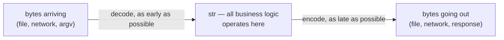
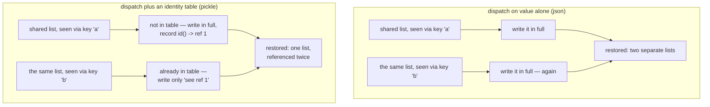

# Unicode text versus bytes, and how a Python object survives being written down

*Why `str` and `bytes` are never silently interchangeable, and why serializing an object graph correctly means solving the aliasing problem before it means picking a file format.*

**Level:** L4 · **Prerequisites:** [02 the special-method protocol](02_the_special_method_protocol.md)
**Covers:** PY-11, PY-22
**Sources:** Ramalho, *Fluent Python* 2nd ed. ch.4 (2022) · Wilson, *Software Design by Example*, ch. "Object Persistence," ch. "Binary Data" (2026) · PEP 574 (2019) · `pickle`, `struct`, and `unicodedata` documentation, docs.python.org

---

## 1. The problem this solves

A running Python program only ever holds text as a `str` — an abstract sequence of Unicode characters, with no byte layout of its own. The instant that text has to leave the program — written to a file, sent over a socket, printed to a terminal with a specific locale — it has to become a concrete sequence of bytes, and the reverse conversion has to happen the instant bytes come back in. Python keeps these two representations as genuinely different types precisely because conflating them is where a large share of real-world text bugs come from: `str` and `bytes` support almost the same set of operations, look similar when printed, and are never silently interchangeable, so a mismatch between them fails immediately and specifically rather than producing a plausible-looking wrong answer.

This is a genuinely different design from Python 2, worth naming even briefly because it explains why so much of the vocabulary in this chapter — codecs, encode, decode, the very existence of a `bytes` type distinct from text — exists at all. Python 2's `str` was already a sequence of bytes, and its `unicode` type was the one that held real characters; the two could often be mixed without complaint, silently, because Python 2 would attempt an implicit ASCII-based conversion between them whenever code combined a `str` and a `unicode` value. That implicit conversion was itself a common source of exactly the mojibake and crashes this chapter's failure modes describe, just delayed and less visible than an immediate, specific exception. Python 3's `str` is what Python 2 called `unicode`, keeping only one text type, and refusing entirely to mix it with `bytes` implicitly — trading a silent, occasionally-wrong convenience for an explicit boundary a program cannot cross by accident.

A second, structurally different problem sits one level up: turning an entire Python **object**, not merely a piece of text, into bytes and back. The obvious approach — walk the object, write out its type and its values, recursively, for anything it refers to — works until two different names refer to the *same* object, at which point the obvious approach writes that object out twice and silently turns one shared object into two independent ones on the way back. It fails more sharply still the moment an object refers back to itself, directly or through a chain of other objects, because a naive recursive walk over a cycle never terminates at all. Solving this correctly needs one additional piece of bookkeeping beyond "convert each value" — a record of which objects have already been written, checked by identity rather than by value — and once that piece exists, the rest of what a format like `pickle` does is mostly a specific, well-tested implementation of exactly that idea.

---

## 2. The mechanism, built up

### 2.1 A `str` is characters; a `bytes` is integers; encoding is the conversion between them

```python
s = "café"
print(len(s))              # 4 — four Unicode characters

b = s.encode("utf-8")
print(b)                    # b'caf\xc3\xa9'
print(len(b))                # 5 — the é took two bytes in UTF-8

print(b.decode("utf-8"))     # 'café' — back to a str
```

`s` has four elements because `"café"` has four Unicode characters, each identified by a numeric **code point** — a number from `U+0000` to `U+10FFFF` — entirely independent of how that character is ever stored as bytes. `b` has five elements because UTF-8 happens to need two bytes to represent the code point for `é`; a different encoding could need a different number. **Encoding** converts code points to bytes; **decoding** converts bytes back to code points, and the two operations are not symmetric inverses of arbitrary data — decoding a byte sequence with the wrong encoding, or encoding a string into an encoding that cannot represent one of its characters, are both real, common failure points, covered fully in section 4.1.

`bytes` (and its mutable counterpart, `bytearray`) is a sequence of plain integers from `0` to `255` — indexing a `bytes` object returns an `int`, not a one-character `bytes`, which is the one place its behavior genuinely diverges from `str`'s. Both types share most of `str`'s other methods (`.replace()`, `.split()`, `.strip()`, and so on), deliberately, precisely so that code operating purely on bytes — a binary protocol parser, for instance — is not forced to decode text it may not even know the encoding of.

### 2.2 Every encode/decode mismatch fails as one of two specific, distinguishable exceptions

```python
"São Paulo".encode("cp437")
```

```text
UnicodeEncodeError: 'charmap' codec can't encode character '\xe3' in position 1: character maps to <undefined>
```

`cp437` — the original IBM PC character set — simply has no representation for `ã`, and the default error-handling mode (`'strict'`) raises rather than silently dropping or mangling the character. Three alternative modes trade correctness for tolerance in different, explicit ways: `errors='ignore'` drops the unencodable character entirely (real, silent data loss); `errors='replace'` substitutes a visible placeholder (`?`) so a human reading the output at least sees that something was lost; `errors='xmlcharrefreplace'` substitutes an XML numeric entity, which is lossless and reversible when the target format supports it. The decode direction fails with the sibling exception, `UnicodeDecodeError`, the moment a byte sequence is not valid under the assumed encoding — but only sometimes, which section 4.2 covers as its own hazard: several legacy 8-bit encodings can decode *any* byte sequence at all, including outright random noise, without ever raising anything.

### 2.3 A byte-order mark exists because multi-byte encodings have no fixed byte order of their own

```python
u16 = "El Niño".encode("utf_16")
print(list(u16[:2]))     # [255, 254] — a BOM, not part of the text
```

A single code point above `U+00FF` needs more than one byte under UTF-16, and nothing about the format itself says whether the more significant byte comes first (**big-endian**) or last (**little-endian**) — that choice is made by whichever machine performs the encoding. The **byte-order mark** — the invisible `ZERO WIDTH NO-BREAK SPACE` character, encoded first — exists purely to let a reader infer which ordering was used, because there is no `U+FFFE` character in Unicode by design, so a reader seeing bytes that would decode to `U+FFFE` under one byte order knows to flip to the other. UTF-8 needs no such marker at all, because it is defined byte-by-byte with no multi-byte-word ordering ambiguity in the first place — which is one concrete reason it has become the dominant encoding for interchange rather than merely a popular convention.



This is the **Unicode sandwich**: decode once, near the boundary where bytes enter a program; operate on `str` exclusively everywhere in between; encode once, near the boundary where bytes leave. `open()` in text mode already performs both halves of this automatically, and the discipline that actually needs remembering is not calling `.encode()` or `.decode()` anywhere in the middle of ordinary business logic.

### 2.4 Case-identical text can be composed of different code point sequences, and only normalization makes comparison reliable

```python
s1 = "café"
s2 = "cafe\N{COMBINING ACUTE ACCENT}"
print(s1, s2)              # café café — visually identical
print(len(s1), len(s2))    # 4 5 — genuinely different code point sequences
print(s1 == s2)             # False
```

Unicode allows an accented character to be represented either as one precomposed code point or as a base letter followed by a separate combining mark, and both render identically while comparing as unequal `str` values. `unicodedata.normalize()` resolves this: `'NFC'` composes to the shortest equivalent form, `'NFD'` decomposes to base-plus-combining-marks — either one, applied consistently to both sides of a comparison, makes `s1 == s2` true. Two stronger forms, `'NFKC'` and `'NFKD'`, additionally fold **compatibility characters** — symbols that exist for round-trip compatibility with older standards, such as the vulgar fraction `½` or the micro sign `µ` — into their more ordinary equivalents, at the cost of real, potentially meaningful information loss (`4²` becomes `42` under NFKC, which is a different value, not merely a different spelling), which is why NFKC/NFKD belong in search and indexing rather than in anything meant to round-trip.

The failure mode this sets up is not merely theoretical: the OHM SIGN (`Ω`, `U+2126`) is normalized under NFC into the GREEK CAPITAL LETTER OMEGA (`U+03A9`) — a visually identical character with a genuinely different code point, existing as a separate symbol purely because Unicode preserves it for legacy compatibility. `Ω == normalize('NFC', Ω)` is `False` before normalization and `True` after, which is precisely the kind of silent equality surprise normalization exists to eliminate, and precisely the kind that reappears the moment code compares text without normalizing it first.

### 2.5 The standard library's dual-mode functions accept `str` or `bytes`, but never a mix of the two

A handful of standard-library APIs — the `re` module and several `os` functions among the most common — are written to accept either `str` or `bytes` input and to answer in kind, rather than requiring one or the other:

```python
import re

print(re.findall(r"\d+", "abc123def456"))     # ['123', '456']
print(re.findall(rb"\d+", b"abc123def456"))    # [b'123', b'456']

import os
print(os.listdir(".")[:1])       # ['02_...'] — str paths in, str names out
print(os.listdir(b".")[:1])       # [b'02_...'] — bytes paths in, bytes names out
```

Each of these functions genuinely operates in two distinct modes — a `str` pattern searching `str` data and returning `str` matches, or a `bytes` pattern searching `bytes` data and returning `bytes` matches — with the *mode* fixed by which type the caller supplies. What none of them do is accept a mix:

```python
re.findall(r"\d+", b"abc123")
```

```text
TypeError: cannot use a string pattern on a bytes-like object
```

This is section 2.1's `str`/`bytes` boundary enforced one level higher, at the API surface rather than at a single value: a dual-mode function is still fundamentally two separate implementations sharing one name, and mixing a `str` pattern with `bytes` data is exactly the category of mismatch chapter 2's protocol dispatch would also refuse, here made explicit and immediate rather than allowed to silently coerce one type into the other. `os` functions accepting `bytes` paths exist specifically for filesystems where a path is not guaranteed to be valid, decodable text at all — Unix filenames are arbitrary byte sequences, not necessarily UTF-8 — which is the rare, genuine case where operating on raw bytes throughout, rather than decoding at the boundary per section 2.3's sandwich, is the actually correct discipline.

### 2.6 Persisting an object graph the obvious way loses shared references and cannot survive a cycle at all

Everything from here shifts from encoding *text* to encoding an entire **object graph** — and the most familiar tool for it demonstrates the exact problem this section exists to name:

```python
import json

shared = [1, 2, 3]
data = {"a": shared, "b": shared}
restored = json.loads(json.dumps(data))
print(restored["a"] is restored["b"])   # False — one shared list became two
```

`json.dumps` walks `data`, and when it reaches `shared` through `"a"` and then again through `"b"`, it has no memory of having already written that exact list out once — it writes its *value* twice, faithfully, and the round trip produces two separate, equal-but-not-identical lists where the original had one object referenced twice. This is the **aliasing problem** in its plainest form: a format that serializes by walking values, with no notion of object identity, cannot distinguish "two equal objects" from "one object referenced twice," and therefore cannot preserve the difference.

```python
cyclic = [1, 2]
cyclic.append(cyclic)
json.dumps(cyclic)
```

```text
ValueError: Circular reference detected
```

A cyclic structure is the same problem taken to its limit: a naive recursive walk with no memory of what it has already visited would recurse into `cyclic` forever, and `json` specifically detects this and raises rather than actually looping infinitely — a real safety measure, but one that trades a crash for silence, not a way of actually representing the cycle.

### 2.7 An identity table — tracking objects by `id()`, not by value — is what actually solves both problems at once

The fix chapter 4's `copy.deepcopy` already relies on, and the fix Wilson's own construction of a persistence format builds from first principles, is a single piece of bookkeeping: a table, keyed by each object's `id()`, recording which objects have already been serialized and what identifier was assigned to each. Serializing a value that is already in the table writes a lightweight *reference* to the existing identifier instead of the value again; serializing a value not yet in the table writes it in full and records it before recursing into anything it contains — which is also what breaks a cycle's infinite recursion, since by the time the walk would revisit the cyclic object, that object is already in the table and only a reference gets written.

```python
import pickle

shared = [1, 2, 3]
data = [shared, shared]
data.append(data)         # data now contains itself

blob = pickle.dumps(data)
restored = pickle.loads(blob)
print(restored[0] is restored[1])   # True — sharing preserved
print(restored[2] is restored)       # True — the cycle survived intact
```

`pickle` — unlike `json` — maintains exactly this kind of identity table (called a **memo** in its own documentation) as it serializes, which is why both examples that broke `json` above round-trip correctly through it: the second reference to `shared` is written as a memo lookup rather than a duplicate value, and the self-reference inside `data` is written as a memo lookup back to an object still being constructed, rather than triggering unbounded recursion.

```mermaid
sequenceDiagram
    participant Pickler
    participant Memo as memo table (id -> ref)
    Pickler->>Memo: visiting shared (id=X) via key 'a' — in memo?
    Memo-->>Pickler: no
    Pickler->>Pickler: write shared in full; record id(X) -> ref 1
    Pickler->>Memo: visiting shared (id=X) again, via key 'b' — in memo?
    Memo-->>Pickler: yes — ref 1
    Pickler->>Pickler: write "see ref 1" instead of the value again
```

Unpickling reverses this exactly: the loader keeps its own table, this time mapping each reference number back to the object it has already reconstructed, so a "see ref 1" instruction returns the identical live object rather than building a new one — which is what makes `restored[0] is restored[1]` true on the way back out, not merely `restored[0] == restored[1]`.



### 2.8 `__reduce__`, `__getstate__`, and `__setstate__` are the hooks a class uses to control its own serialization

`pickle`'s default behavior for a user-defined object — record its class and its `__dict__`, recursively — is not always correct, and three hooks let a class override exactly how much of that default to keep.

```python
class Account:
    def __init__(self, owner, balance):
        self.owner = owner
        self.balance = balance
    def __getstate__(self):
        state = self.__dict__.copy()
        state["balance"] = 0        # never serialize a live balance
        return state
    def __setstate__(self, state):
        self.__dict__.update(state)

a = Account("alexandro", 500)
b = pickle.loads(pickle.dumps(a))
print(b.owner, b.balance)   # alexandro 0
```

`__getstate__` intercepts what `pickle` treats as "the object's data" before writing it, and `__setstate__` intercepts how that data is written back into a freshly-constructed instance on load — here used to deliberately scrub a field on the way out. `__reduce__` is the more general, lower-level hook underneath both: it returns a callable and the arguments to pass it, and `pickle` reconstructs the object by calling exactly that combination on load rather than using the default class-plus-`__dict__` reconstruction at all — which is both what makes it possible to serialize objects with no ordinary `__init__`-based reconstruction and, as section 4.4 covers, the exact mechanism that turns unpickling into a genuine security boundary.

### 2.9 `struct` packs Python values into a fixed, C-compatible binary layout, with explicit control over byte order

`pickle`'s format is specific to Python; `struct` produces (and reads) a binary layout meant to interoperate with other languages and with fixed binary file formats, using a format string that names both the fields and their byte order explicitly:

```python
import struct

packed = struct.pack(">hh", 1000, -1)     # big-endian, two signed shorts
print(packed)                              # b'\x03\xe8\xff\xff'
print(struct.unpack(">hh", packed))        # (1000, -1)

print(struct.pack("<hh", 1000, -1))         # b'\xe8\x03\xff\xff' — little-endian
```

`>` and `<` in the format string are the same endianness choice section 2.3 already covers for text, applied to raw binary fields instead of characters — and `struct` requires it to be stated explicitly precisely because, unlike UTF-8, a fixed-width binary format has no self-describing marker equivalent to a BOM; getting the byte order wrong does not raise an error at all, it silently produces a different, wrong number.

### 2.10 Pickle protocol 5 (PEP 574) moved large buffers out of the pickle stream entirely, which is why this node connects to memory management rather than only to file formats

Every version of the pickle protocol before **PEP 574** copied a large buffer — a `bytearray`, a `numpy` array, an `array.array` — directly into the serialized byte stream, which meant at least one full copy of that data even when the sender and receiver were two processes on the same machine capable of sharing memory far more cheaply. Protocol 5, added in Python 3.8, introduces `PickleBuffer`: a class a `__reduce_ex__` implementation can return to mark a buffer as eligible for **out-of-band** transfer — handed to a `buffer_callback` during serialization and supplied separately, via a `buffers` argument, during deserialization, rather than being copied into the pickle stream's own bytes at all.

This is precisely why this object-persistence node sits closer to chapter 4's memory-management material than a file-format topic would otherwise suggest: `multiprocessing`, which moves data between processes by pickling it, is a direct beneficiary of protocol 5 for exactly the large-array case chapter 4 already establishes as expensive to copy needlessly — the same "container objects hold pointers, not the objects themselves" argument from chapter 6 applies here one level up, at the level of an entire serialized object graph rather than a single Python container.

---

## 3. Diagrams

The Unicode-sandwich diagram in section 2.3, the identity-table contrast in section 2.6, and the memo-table sequence in section 2.7 are integrated into the mechanism build-up above, as this format requires.

---

## 4. Failure modes

### 4.1 Decoding with the wrong encoding raises `UnicodeDecodeError` — but only when the wrong encoding happens to reject the bytes

```python
# Gist: wrong_decode.py
octets = "Montréal".encode("latin1")
print(octets.decode("cp1252"))     # 'Montréal' — cp1252 is a latin1 superset, works by luck
print(octets.decode("koi8_r"))     # 'MontrИal' — silently WRONG, no error at all
octets.decode("utf-8")
```

```text
Montréal
MontrИal
UnicodeDecodeError: 'utf-8' codec can't decode byte 0xe9 in position 5: invalid continuation byte
```

Section 2.2 already names the mechanism: `koi8_r` (a Russian-language 8-bit encoding) can decode *any* byte value at all, because every one of the 256 possible byte values maps to *some* character under it — there is no invalid byte for it to reject, so it happily, silently produces a Cyrillic letter where the actual text meant an accented `é`. Only `utf-8`, which has real structural rules about which byte sequences are even legal, correctly identifies the mismatch and raises. This is the sharper version of the encoding-mismatch hazard: a program that assumes the wrong single-byte legacy encoding may run for a long time producing subtly garbled text with no exception ever appearing to reveal the mistake, while a program making the identical mistake against a stricter encoding fails immediately and loudly. The only real defense is not to guess: know the encoding a byte source actually uses, from a protocol header, a file format's own specification, or an explicit agreement with whatever produced the bytes, rather than assuming one and hoping a decode error will surface if the assumption is wrong.

### 4.2 Normalizing text can silently change which character it contains

```python
# Gist: normalization_surprise.py
from unicodedata import normalize, name

ohm = "Ω"                      # OHM SIGN
ohm_normalized = normalize("NFC", ohm)
print(name(ohm), name(ohm_normalized))
print(ohm == ohm_normalized)
```

```text
OHM SIGN GREEK CAPITAL LETTER OMEGA
False
```

Section 2.4 already covers why: the OHM SIGN is a distinct, legacy code point Unicode preserves purely for compatibility, and NFC's normalization step considers it a compatibility variant of the Greek omega it visually resembles, replacing it outright. Code that normalizes user input before storing it — a reasonable, common practice for reliable comparison — has, in this one specific case, quietly replaced the character the user actually typed with a different one, and nothing about the process raises a warning, because normalization is doing exactly what it is documented to do. This matters most for text meant to be reproduced exactly — a technical symbol in a document, a unit of measurement — where "compares reliably" and "preserves exactly what was typed" are two different, occasionally conflicting goals, and normalizing indiscriminately picks the first at the expense of the second without saying so.

### 4.3 A format with no identity table turns one shared object into several independent ones, silently

```python
# Gist: json_aliasing_loss.py
import json

shared_account = {"owner": "alexandro", "balance": 100}
ledger = {"checking": shared_account, "primary": shared_account}

restored = json.loads(json.dumps(ledger))
restored["checking"]["balance"] = 999
print(restored["primary"]["balance"])   # still 100 — the sharing is gone
```

```text
100
```

Before serialization, `ledger["checking"]` and `ledger["primary"]` are the identical object — updating one through either name updates the same underlying dictionary. Section 2.6 already shows why the round trip does not preserve this: `json` has no identity table, so it wrote the same dictionary's *value* twice and produced two independent dictionaries on the way back, and the code above, written under the reasonable assumption that the aliasing relationship survived a save-and-reload cycle, silently stops being correct the moment it actually runs against restored data. This is a defect that is completely invisible in any test that only checks values immediately after loading — `restored["checking"] == restored["primary"]` is still `True`, because the two dictionaries hold equal contents; only a mutation-and-recheck test, or an explicit `is` comparison, would reveal that the sharing itself did not survive. The fix, whenever preserving object identity matters and not merely equal values, is a format that maintains its own identity table — `pickle`, or an application-level scheme built the same way — rather than a value-only format like JSON, which was never designed to represent aliasing in the first place.

### 4.4 Unpickling untrusted data is equivalent to executing arbitrary code supplied by whoever produced it

```python
# Gist: pickle_is_not_safe.py
import pickle, os

class Payload:
    def __reduce__(self):
        return (os.system, ("echo this command came from the pickle stream",))

blob = pickle.dumps(Payload())
pickle.loads(blob)     # runs the command the instant it is unpickled
```

```text
this command came from the pickle stream
```

Section 2.8 already names the mechanism this exploits: `__reduce__` returns a callable and its arguments, and `pickle.loads` calls exactly that combination to reconstruct the object — there is nothing in the reconstruction step restricting which callable may be named or what it may do, because the same generality that lets a class hand-craft its own reconstruction has no way to distinguish a legitimate constructor call from an arbitrary command. Every mainstream discussion of `pickle`'s security model, including Python's own documentation, states this without qualification: unpickling data from a source that is not fully trusted is equivalent to running whatever code that data's author chose to embed, and there is no safe subset of `pickle` to fall back to that preserves its generality while removing this. The only real defense is architectural rather than technical: never call `pickle.loads` (or `pickle.load`) on data that arrived from outside a fully trusted boundary — a network request, an uploaded file, a message queue fed by an external system — and reach for a value-only format such as JSON, which has no equivalent reconstruction hook and therefore no equivalent way to execute anything at all, for any data that crosses that boundary.

---

## 5. Trade-offs

| Approach | Use when | Because | Real cost |
| --- | --- | --- | --- |
| **`str` throughout, encode/decode only at I/O boundaries** | Essentially always, for any text-handling code | The Unicode sandwich keeps encoding concerns out of business logic entirely | None — this is the default correct discipline, not a specialized choice |
| **A permissive error handler (`errors='replace'`/`'ignore'`)** | The data source is known to be occasionally malformed and partial recovery beats a crash | The program keeps running instead of raising on the first bad byte | Real, silent data loss (`'ignore'`) or visible-but-unrecoverable loss (`'replace'`) — never appropriate for data that must round-trip exactly |
| **`json` (or another value-only format)** | The data is untrusted, needs to interoperate with non-Python systems, or genuinely has no aliasing/cycles to preserve | Human-readable, safe to load from any source, universally supported | Cannot represent shared references or cycles at all — silently duplicates the former, refuses the latter |
| **`pickle`** | Fully trusted, Python-to-Python data — caching, `multiprocessing` payloads, checkpointing internal state | Preserves aliasing and cycles correctly via its own identity table; handles arbitrary Python objects | Unsafe against untrusted input by design (section 4.4); not readable by, or meant for, anything outside Python |
| **`struct`** | A fixed binary layout must interoperate with another language or a specified file format | Explicit, compact, byte-for-byte control including endianness | Entirely manual — no object graph support, no identity table, just fixed-width fields |

### When JSON's limitations are a feature, not a defect

A value-only format that cannot execute code and cannot represent aliasing is exactly the right tool the moment data crosses a trust boundary, because those two "limitations" are precisely what make it safe to load from a source that has not been vetted. Reaching for `pickle` purely because it is more capable, for data that will ever be read from outside a fully trusted process, trades that safety for a convenience that a value-only format's simplicity already provides for the overwhelming majority of interchange use cases.

### The case against decoding "as soon as possible" without checking what "as soon as possible" actually means for a given source

The Unicode sandwich's own advice — decode near the boundary — is occasionally over-applied to a boundary that does not yet know its own encoding, which produces the opposite of the discipline it is meant to enforce: a premature decode using a guessed or default encoding, followed by code that treats the resulting `str` as trustworthy when it is actually already corrupted. The rejected alternative to guessing early is deferring the decode until the actual encoding is known — from a declared header, a file format's own specification, or explicit configuration — even if that means holding a value as `bytes` slightly longer than the sandwich metaphor's simplest reading suggests; a `str` produced from a wrong guess is not a fresh start, it is corrupted data wearing the type of clean data.

### The case against hand-rolling an identity-table serializer instead of using `pickle`

Building a custom serializer that tracks object identity by hand — the mechanism section 2.7 walks through from first principles — is a legitimate way to *understand* the problem, and a poor way to *solve* it for production code, because `pickle`'s implementation has already handled the accumulated edge cases a hand-rolled version would rediscover one at a time: recursive structures of arbitrary depth, objects with custom `__reduce__` logic, version compatibility across protocol numbers. The rejected alternative to reusing `pickle` here is reimplementing a well-tested piece of the standard library slightly worse, for a problem `pickle` already solves correctly, unless the actual goal is specifically a cross-language format `pickle` cannot provide — at which point the honest choice is a real interchange format (JSON, plus separate application-level handling of any aliasing that matters), not a hand-rolled binary protocol either.

---

## 6. Reference summary

**`str` is Unicode code points; `bytes` is raw integers 0–255; encoding converts the first to the second, decoding the reverse** — and a mismatch between them fails as one of two specific exceptions, `UnicodeEncodeError` or `UnicodeDecodeError`, except when the target/source encoding happens to be permissive enough to silently accept the wrong data. **The Unicode sandwich — decode at the boundary, operate on `str` throughout, encode at the boundary — is the discipline that keeps encoding concerns out of ordinary logic entirely.**

**A byte-order mark exists because multi-byte encodings like UTF-16 have no fixed byte order of their own**; UTF-8 needs none, which is one real reason for its dominance as an interchange encoding. **Unicode normalization (`NFC`/`NFD`/`NFKC`/`NFKD`) is required for reliable text comparison**, because visually identical text can be composed of different code point sequences — and the stronger forms (`NFKC`/`NFKD`) can silently replace a legacy or compatibility character with a different, related one, which is correct behavior for search and indexing and genuinely lossy for anything meant to preserve exact input.

**Serializing an object graph by walking values alone — as JSON does — cannot preserve shared references and cannot represent a cycle at all**, because it has no way to recognize "the same object seen twice" apart from "two equal-valued objects." **An identity table, keyed by `id()`, is the fix**: an object already recorded is serialized as a lightweight reference on a second encounter, which both preserves aliasing correctly and terminates a cyclic walk instead of recursing forever. **`pickle` implements exactly this via its own memo table**, and exposes `__reduce__`, `__getstate__`, and `__setstate__` as the hooks a class uses to override its default class-plus-`__dict__` serialization.

**`struct` produces fixed-width binary layouts with explicit, mandatory endianness**, because unlike text encodings it has no self-describing marker equivalent to a BOM — getting the byte order wrong produces a different, silently wrong number rather than an error. **Pickle protocol 5 (PEP 574, Python 3.8) moves large buffers out of the pickle stream via `PickleBuffer` and out-of-band transfer**, avoiding the extra copy earlier protocols required and directly benefiting `multiprocessing`'s use of pickle to move data between processes — the same "don't copy what you don't have to" argument chapters 4 and 6 already make, applied to an entire serialized object graph.

**Unpickling untrusted data is equivalent to running arbitrary code the data's author chose to embed**, via the same `__reduce__` hook that makes custom reconstruction possible at all — there is no safe subset of `pickle` for this case; the only real defense is never unpickling data that crossed a trust boundary, and using a value-only format like JSON there instead.

---

← [Python knowledge graph](00_knowledge_graph.md) · [repo index](../README.md)
