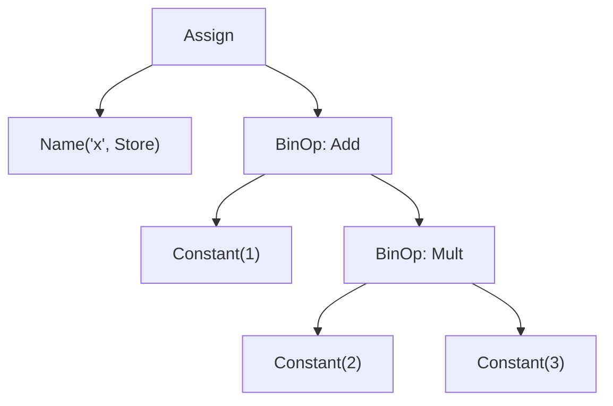
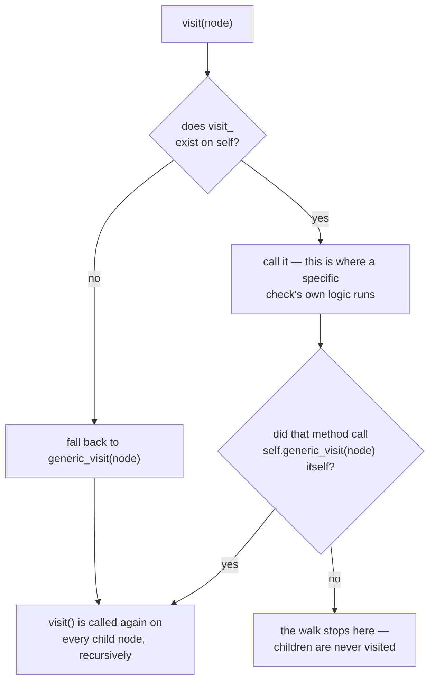

# The abstract syntax tree — reading code as data before any of it runs

*The same tree the compiler builds on its way to bytecode, exposed to ordinary Python code, and why a tool that walks it catches what a regular expression structurally cannot.*

**Level:** L4 · **Prerequisites:** [05 bytecode and the runtime](05_bytecode_and_the_runtime.md)
**Covers:** PY-23
**Sources:** Wilson, *Software Design by Example*, ch. "A Code Linter," ch. "An HTML Validator," ch. "Generating Documentation" (2026) · `ast` module documentation, docs.python.org · PEP 634 (2021) · PEP 695 (2023)

---

## 1. The problem this solves

Checking whether every function in a file has a docstring looks, at first, like a job for a regular expression — search for the keyword `def`, check that the next non-blank line starts with a quote. That approach breaks the moment a function signature spans multiple lines, or a string literal elsewhere in the file happens to contain the text `def` inside a comment or another string, or a decorator sits between the function and what a naive pattern assumes is its first line. A regular expression operates on source code as a flat sequence of characters, with no notion of "this text is inside a string" or "this is a nested function" or "this line is a continuation of the previous one" — every one of those facts is precisely what a regex has no structural way to represent, because regular expressions describe patterns in flat text, not the nested, self-describing shape a programming language's grammar actually has.

Chapter 5 already established that Python source does not run as text at all — it compiles to bytecode first. What that chapter left unstated is the step in between: before the compiler can emit a single bytecode instruction, it has to fully understand the *structure* of the source — which expression is nested inside which, which statement is the body of which function — and it does this by building a tree, once, out of the source text.


The `ast` module exposes that exact tree — the second box in this pipeline, built and fully resolved before the third box even begins — to ordinary Python code, before compilation continues and long before anything runs. This turns "check the structure of this program" from a text-pattern problem into a tree-traversal problem — one a regular expression can only approximate and a tree walker can answer precisely, because it is looking at the same structural representation the language's own compiler relies on, not a second, independent guess at what the source might mean.

---

## 2. The mechanism, built up

### 2.1 `ast.parse` returns a tree of typed node objects, one per grammatical construct

```python
import ast

tree = ast.parse("x = 1 + 2 * 3")
print(ast.dump(tree, indent=2))
```

```text
Module(
  body=[
    Assign(
      targets=[
        Name(id='x', ctx=Store())],
      value=BinOp(
        left=Constant(value=1),
        op=Add(),
        right=BinOp(
          left=Constant(value=2),
          op=Mult(),
          right=Constant(value=3))))])
```

Every node is an ordinary Python object of a specific class — `Assign`, `BinOp`, `Constant`, `Name` — each with attributes naming its own grammatical parts. `1 + 2 * 3` is not a flat list of tokens here; it is a `BinOp` for the addition, whose right side is itself a nested `BinOp` for the multiplication, exactly reflecting operator precedence — the compiler already had to work this structure out to know that multiplication binds tighter than addition, and the tree simply exposes that work rather than redoing it. `Name(id='x', ctx=Store())` records not just that `x` appears, but that this particular appearance is a write (`Store`) rather than a read (`Load`), a distinction section 2.4 depends on directly.



### 2.2 `NodeVisitor` separates walking the tree from deciding what to do at each node

Writing a recursive function that manually descends into every possible node type would work, but it would also repeat the same traversal logic in every checker anyone ever wrote. `ast.NodeVisitor` is the standard library's implementation of the **visitor pattern** specifically to avoid that repetition: it walks the tree automatically, and calls a method named `visit_<NodeType>` on itself for every node whose type matches, if one exists.

```python
class DuplicateKeyChecker(ast.NodeVisitor):
    def visit_Dict(self, node):
        seen = set()
        for key in node.keys:
            if isinstance(key, ast.Constant) and key.value in seen:
                print(f"duplicate key {key.value!r} at line {key.lineno}")
            elif isinstance(key, ast.Constant):
                seen.add(key.value)
        self.generic_visit(node)

source = 'config = {"host": "localhost", "port": 8000, "host": "127.0.0.1"}'
DuplicateKeyChecker().visit(ast.parse(source))
```

```text
duplicate key 'host' at line 1
```

`DuplicateKeyChecker` never had to know how to find a `Dict` node inside a `Module`, inside an `Assign`, inside whatever larger structure surrounds it — `NodeVisitor.visit()` handles the generic walk, dispatching to `visit_Dict` the moment it reaches a node of that type, by exactly the same "look up a method by name" mechanism chapter 1 already covers for ordinary attribute access. Every node type the visitor does not define a `visit_` method for is walked with a default behavior that does nothing extra at that node — which is precisely why `self.generic_visit(node)` is called explicitly inside `visit_Dict`: without it, the walk would stop at the `Dict` node and never descend into anything the dictionary's values might themselves contain.



`visit()`'s own implementation is, underneath, exactly this dispatch — building the string `"visit_" + type(node).__name__` and looking it up via `getattr(self, name, self.generic_visit)` — which is worth naming plainly because it means nothing magical distinguishes a `NodeVisitor` subclass from any other object relying on chapter 1's ordinary attribute-lookup machinery; the "visitor pattern" here is a naming convention plus one line of dispatch code, not a special language feature.

### 2.3 Forgetting `generic_visit` does not raise an error — it silently stops the walk at that node

```python
class ShallowVisitor(ast.NodeVisitor):
    def visit_FunctionDef(self, node):
        print("found function:", node.name)
        # no self.generic_visit(node) here

source = """
def outer():
    def inner():
        pass
"""
ShallowVisitor().visit(ast.parse(source))
```

```text
found function: outer
```

`inner`, nested inside `outer`'s body, is never reported, and nothing about running this code indicates that anything was skipped — the visitor completed normally, having simply never been told to look inside `outer`'s body for more function definitions. This is the same shape of hazard as any other silent, non-erroring omission this shelf has already covered: the visitor pattern's convenience — writing only the node types a particular check cares about — is inseparable from the responsibility of explicitly continuing the walk everywhere that check does not itself terminate it, and section 4.1 returns to exactly this trap in a more realistic setting.

### 2.4 A genuinely useful check needs two passes over the tree, tracking `Store` versus `Load` context

Finding a variable that is assigned but never subsequently read requires comparing two different sets of occurrences, which is where `Name` nodes' `ctx` attribute — `Store` or `Load` — from section 2.1 becomes load-bearing:

```python
class UnusedVariableChecker(ast.NodeVisitor):
    def visit_FunctionDef(self, node):
        assigned, read = {}, set()
        for child in ast.walk(node):
            if isinstance(child, ast.Name):
                if isinstance(child.ctx, ast.Store):
                    assigned.setdefault(child.id, child.lineno)
                elif isinstance(child.ctx, ast.Load):
                    read.add(child.id)
        for name, lineno in assigned.items():
            if name not in read:
                print(f"{name!r} assigned at line {lineno} but never read")
        self.generic_visit(node)

source = """
def compute():
    total = 0
    unused = 42
    total += 1
    return total
"""
UnusedVariableChecker().visit(ast.parse(source))
```

```text
'unused' assigned at line 4 but never read
```

`ast.walk`, used here instead of a `NodeVisitor` subclass, is the module's other traversal primitive — a plain generator yielding every node in the tree in no particular guaranteed order, useful precisely when a check needs to gather facts across an entire subtree rather than react to specific node types as they are encountered. `total` correctly does **not** get flagged, because `total += 1` produces both a `Load` (reading the current value) and a `Store` (writing the incremented one) for the same name, and `return total` supplies a second `Load` — exactly the kind of distinction a regex matching the bare word `total` could not make reliably, since it has no notion of which occurrences are reads and which are writes.

### 2.5 `NodeTransformer` rewrites the tree; `ast.unparse` turns it back into source; `fix_missing_locations` is not optional

A `NodeTransformer` is a `NodeVisitor` whose `visit_` methods are expected to *return* a node — the original, a replacement, or `None` to delete it — which is what makes source-to-source transformation possible:

```python
class RenameTransformer(ast.NodeTransformer):
    def visit_Name(self, node):
        if node.id == "old_name":
            return ast.copy_location(ast.Name(id="new_name", ctx=node.ctx), node)
        return node

tree = RenameTransformer().visit(ast.parse("old_name = old_name + 1"))
ast.fix_missing_locations(tree)
print(ast.unparse(tree))
```

```text
new_name = new_name + 1
```

`ast.unparse` — available since Python 3.9 — converts a tree back into source text, which is what makes a transformation's result usable as a program again rather than only as data to inspect. `ast.copy_location` and `ast.fix_missing_locations` exist because every real node in a tree produced by `ast.parse` carries line and column information the compiler needs for tracebacks and syntax errors, and a brand-new node built by hand — `ast.Name(id="new_name", ...)` on its own — has none of that; omitting the location-fixing step is not a style choice, it produces a tree `compile()` refuses outright, which section 4.2 demonstrates directly.

### 2.6 `ast.get_docstring` is a small, purpose-built accessor rather than a generic tree query

```python
source = '''
def greet(name):
    """Say hello to someone."""
    return f"hello {name}"
'''
func = ast.parse(source).body[0]
print(ast.get_docstring(func))
```

```text
Say hello to someone.
```

A docstring is not a distinct node type in its own right — it is an ordinary string literal that happens to be the first statement in a function, class, or module body, a convention `ast.get_docstring` encodes so that documentation-generating code does not have to rediscover "check whether the first body element is a bare string constant" from first principles every time. This is representative of a broader pattern in the `ast` module: most of what a real analysis tool needs is a plain tree walk with `NodeVisitor`, and a handful of small, specific helper functions cover the few conventions — like docstring placement — that are common enough to deserve their own accessor rather than being left to every caller to reimplement.

### 2.7 `ast.literal_eval` is the AST module's own answer to `eval`'s security problem

Chapter 11 already establishes that unpickling untrusted data is equivalent to running arbitrary code an attacker supplied. `eval()` on a string is the same hazard in a plainer form — it compiles and runs whatever expression the string contains, with no restriction on what that expression may do. `ast.literal_eval` solves the narrower, far more common real need — parsing a string that is supposed to contain only a literal value — by working entirely at the tree level, never compiling or executing anything at all:

```python
import ast

print(ast.literal_eval('[1, 2, {"a": 3.5, "b": (True, None)}]'))
# [1, 2, {'a': 3.5, 'b': (True, None)}]

ast.literal_eval('__import__("os").system("echo hi")')
```

```text
ValueError: malformed node or string on line 1: <ast.Call object at 0x...>
```

`literal_eval` parses the string into a tree exactly as section 2.1 describes, then walks that tree checking that every node is one of a small, fixed set of literal-producing types — constants, tuples, lists, dicts, sets built only from further literals — and raises `ValueError` the moment it finds anything else, a function call included. This is a direct, practical payoff of the AST being a real data structure rather than executable code by default: a tree can be *inspected and rejected* before anything in it ever runs, which is precisely the guarantee `eval()` cannot offer, because `eval()`'s entire contract is "compile and run this," with the checking step this section describes never in the loop at all.

### 2.8 The AST can only describe what the source *says*, never what the program will *do*

Every mechanism above operates entirely without executing a single line of the analyzed code — which is both the point and the hard limit. `getattr(obj, some_computed_string)`, a dictionary key built from string concatenation at runtime, a function chosen from a list by an index computed from user input: none of these are visible to a tree walker as anything more specific than "a call" or "a subscript," because their actual behavior depends on values that do not exist until the program runs. This is the same static-versus-dynamic boundary chapter 9 already draws for the type system, one level more fundamental: a type checker at least has annotations to reason from, while a bare AST walk over unannotated code has only the shape of the syntax, with no information at all about what values will flow through it. An AST-based linter can reliably tell you a dictionary literal has a duplicate key; it cannot tell you whether a dynamically constructed dictionary will end up with one, because "dynamically constructed" means the keys are not literals the tree can see at all.

### 2.9 An AST check operates one level above the bytecode chapter 5 already covers, and that altitude is deliberate

Chapter 5's `dis` module exposes the *compiled* form of a function — the flat instruction sequence the eval loop actually runs — and it is a reasonable question why an analysis tool would prefer the AST over that already-familiar representation. The answer is that compilation is lossy in exactly the direction source-level analysis cares about: `dis.dis` on a function shows `LOAD_FAST_BORROW`, `BINARY_OP`, and `CALL` instructions, with no direct trace of which of those instructions came from a `for` loop, a `while` loop, or a nested function definition, because the compiler has already flattened that structural distinction into a shared vocabulary of stack operations by the time bytecode exists at all. A docstring is not even present as a discoverable value in typical execution paths through the bytecode; it is a source-level convention, visible only at the level of the parsed statement it is the first line of. The AST keeps precisely the structural, source-level facts a check like "does this function have a docstring" or "is this dictionary literal missing a comma between two keys" needs, at the cost of not being the thing that actually executes — which is exactly the right trade for a tool whose entire job is describing the source, not running it.

### 2.10 The tree's own shape is versioned with the language, and a checker written against one version silently ignores syntax from a later one

`ast.parse` is not a fixed target — every new piece of syntax the language adds becomes a new node type or a new field on an existing one, and a checker that predates that addition does not fail when it encounters it; it simply has no `visit_` method for the new type and falls through to `generic_visit`, seeing the new construct's children but never recognizing the construct itself as what it is.

```python
class BranchCounter(ast.NodeVisitor):
    def __init__(self):
        self.branches = 0
    def visit_If(self, node):
        self.branches += 1
        self.generic_visit(node)
    # written before Python 3.10 — no visit_Match at all

source = """
def classify(x):
    if x < 0:
        return "negative"
    match x:
        case 0:
            return "zero"
        case _:
            return "positive"
"""
counter = BranchCounter()
counter.visit(ast.parse(source))
print("branches counted:", counter.branches)
```

```text
branches counted: 1
```

**PEP 634** added `ast.Match`, `match_case`, and a family of pattern node types (`MatchValue`, `MatchSequence`, `MatchAs`, and others) in Python 3.10; **PEP 695** added a `type_params` field carrying `TypeVar`, `ParamSpec`, and `TypeVarTuple` nodes to `ClassDef` and `FunctionDef` in 3.12. `BranchCounter`, written for a `match`-less Python, counts exactly one branch in a function with three, not because anything is broken, but because `match` is invisible to a checker that only knows to look for `ast.If`. This is worth stating plainly as a currency fact rather than folding it into "the AST module is stable": the module's *interface* — `NodeVisitor`, `parse`, `walk`, `unparse` — has been stable for years, but the *set of node types* it can hand back grows with every language release, and any analysis tool has an implicit "written against Python version N" ceiling above which its coverage silently degrades rather than errors.

One further, separate currency note belongs here rather than being left implicit: the linting tools most Python projects actually run in practice are, as of this writing, no longer built on this module at all. Ruff, now the dominant fast linter in the ecosystem, reimplements its analysis in Rust rather than walking Python's own `ast` module — which does not make anything in this chapter obsolete, since understanding, writing, and extending a custom analysis (a project-specific check, a code migration script, a documentation generator) is still done exactly this way. It does mean this module should be understood as the way to *build and understand* source-level analysis, not assumed to be the engine behind the specific linter a given project has installed.

---

## 3. Diagrams

The compile-pipeline diagram in section 1, the expression-tree diagram in section 2.1, and the visitor-dispatch diagram in section 2.2 are integrated into the mechanism build-up above, as this format requires.

---

## 4. Failure modes

### 4.1 A visitor that forgets `generic_visit` inside a nested-scope handler silently skips everything inside that scope

```python
# Gist: shallow_docstring_check.py
import ast

class DocstringChecker(ast.NodeVisitor):
    def visit_FunctionDef(self, node):
        if ast.get_docstring(node) is None:
            print(f"missing docstring: {node.name}")
        # no self.generic_visit(node) — nested functions are never reached

source = """
def outer():
    '''Has a docstring.'''
    def inner():
        pass
"""
DocstringChecker().visit(ast.parse(source))
```

```text
```

Nothing prints at all — `inner`, which genuinely lacks a docstring, is never checked, because `visit_FunctionDef` returns without descending into `outer`'s body, and `inner` is defined entirely inside that body. Section 2.3 already names the mechanism: a `NodeVisitor` only continues past a node its own `visit_` method handles if that method explicitly calls `self.generic_visit(node)`, and there is no error, warning, or any other signal that a subtree went unvisited — the check simply runs to completion having silently covered less of the program than its author believed. This defect is dangerous specifically because it is easy to write and easy to test past: a test file with only top-level functions passes cleanly, and the gap only becomes visible once someone happens to nest a function inside another and notices, by other means, that the linter never flagged it. The fix is a one-line addition, `self.generic_visit(node)`, at the end of every `visit_` method whose node type can contain other nodes worth checking — which, for anything besides the simplest leaf nodes, is nearly all of them.

### 4.2 A hand-built replacement node with no location information fails at `compile()`, not at tree-construction time

```python
# Gist: missing_locations.py
import ast

class RenameTransformer(ast.NodeTransformer):
    def visit_Name(self, node):
        if node.id == "old_name":
            return ast.Name(id="new_name", ctx=node.ctx)   # no copy_location
        return node

tree = RenameTransformer().visit(ast.parse("old_name = old_name + 1"))
compile(tree, "<string>", "exec")
```

```text
TypeError: required field "lineno" missing from expr
```

Building `tree` and even calling `RenameTransformer().visit()` on it both succeed without complaint — the new `Name` node is a perfectly valid Python object the moment it is constructed. The failure only surfaces later, at `compile()`, because every node `ast.parse` itself produces carries `lineno`, `col_offset`, and related attributes the compiler requires to generate correct bytecode and tracebacks, and a node built by hand has none of them unless something sets them explicitly. Section 2.5 already names the fix — `ast.copy_location` (to copy an existing node's position onto a new one) or `ast.fix_missing_locations` (to propagate a parent's position onto any child missing it) — and the error's own delayed timing is the trap: a transformation can look completely successful, right up until the specific moment the result is handed to `compile()`, which may be considerably later in a pipeline than wherever the tree was actually built and modified.

### 4.3 A checker written against one Python version silently undercounts constructs a later version introduced

```python
# Gist: version_skew_checker.py
import ast

class BranchCounter(ast.NodeVisitor):
    def __init__(self):
        self.branches = 0
    def visit_If(self, node):
        self.branches += 1
        self.generic_visit(node)

source = """
def classify(x):
    if x < 0:
        return "negative"
    match x:
        case 0:
            return "zero"
        case _:
            return "positive"
"""
counter = BranchCounter()
counter.visit(ast.parse(source))
print(counter.branches)
```

```text
1
```

Section 2.10 already traces this exactly: `classify` has three real branches — one `if` and two `match` cases — and `BranchCounter` reports one, because it was written to recognize `ast.If` and has no equivalent handling for `ast.Match`, a node type that did not exist in the language this checker's author was writing against. Nothing raises an error anywhere in this pipeline; the checker runs to completion and produces a plausible-looking, confidently wrong number, which is precisely the shape of failure this book treats as most dangerous — not a crash, but a quiet, systematically wrong answer a reader has every reason to trust. The fix has two layers: immediately, add the missing `visit_Match` handling once the gap is noticed; durably, treat any AST-based tool's node-type coverage as tied to a specific minimum Python version, worth stating explicitly and worth revisiting deliberately whenever the language gains new syntax, rather than assuming a checker that has not been touched in years still sees everything a current codebase can contain.

### 4.4 `ast.literal_eval` rejects ordinary arithmetic, which is easy to assume it would accept

```python
# Gist: literal_eval_arithmetic_gap.py
import ast

print(ast.literal_eval("-5"))       # -5      — unary minus on a literal is allowed
print(ast.literal_eval("3+4j"))      # (3+4j)  — literal complex-number syntax is allowed
ast.literal_eval("2**10")
```

```text
-5
(3+4j)
ValueError: malformed node or string on line 1: <ast.BinOp object at 0x...>
```

Section 2.7 already establishes that `literal_eval` walks the tree checking for a small, fixed set of literal-producing node types, and it is easy to over-generalize that description into "it evaluates simple, safe-looking expressions," which is not quite what it does. The unary-minus and complex-number cases work only because the CPython implementation special-cases them specifically to support numeric literal syntax like `-5` and `3+4j`, which the grammar itself represents as small operator trees even though they are conceptually single literal values. A general binary operation like `2**10` — a natural way to write a size constant in a configuration file — is a `BinOp` node like any other, and `literal_eval` has no general-purpose arithmetic evaluator hiding behind its literal-only contract; it rejects the `BinOp` outright, with no distinction between "this expression could call `os.system`" and "this expression is harmless exponentiation." The fix is simply to write the computed value directly (`1048576` rather than `2**20`) in whatever configuration format calls `literal_eval` to parse it, which costs a small amount of readability at the config-writing end in exchange for staying within a boundary that is deliberately narrow rather than merely appearing so.

---

## 5. Trade-offs

| Approach | Use when | Because | Real cost |
| --- | --- | --- | --- |
| **Regular expressions over source text** | A genuinely simple, single-line, unambiguous textual pattern | Fast to write, no parsing step, works on any text at all, even invalid syntax | Blind to nesting, multi-line constructs, and the difference between real code and a string or comment that merely looks like it |
| **`ast.NodeVisitor` (read-only analysis)** | Checking a structural property — shape, naming, presence/absence of a construct | Sees the language's actual grammar, exactly as the compiler does | Cannot see runtime behavior at all; blind to anything computed dynamically |
| **`ast.NodeTransformer` + `ast.unparse`** | Automated, mechanical source-to-source rewriting (a rename, a migration) | Guarantees the rewrite is syntactically grounded in the real grammar, not a fragile text substitution | Requires careful location-handling (section 4.2) and produces re-formatted, not necessarily style-preserving, output |
| **Running the program and observing it (tests, a debugger, a profiler)** | The actual question is about runtime behavior or values, not source shape | The only way to see what dynamically-computed code actually does | Requires the program to actually run, with real or realistic inputs, which a static check never needs |
| **`ast.literal_eval`** | Parsing a string that is supposed to contain only a literal value (a config value, a cached repr) | Never compiles or executes anything — rejects a non-literal tree before it could run | Deliberately narrow; no general arithmetic, no function calls, no name lookups of any kind |
| **`eval`/`exec`** | The actual goal is running dynamically-constructed code, by design, in a fully trusted context | The only tool of the group that can, because it is the only one built to execute rather than inspect | Carries chapter 11's arbitrary-code-execution risk in full; never appropriate for untrusted input |

### When a regex genuinely is the right tool

Not every text check needs a parser: verifying a file has no trailing whitespace, checking a version string's format, or confirming a specific literal comment marker appears somewhere are all real, single-line, unambiguous patterns where building or invoking an AST is pure overhead for a problem regular expressions solve completely correctly. The rejected alternative to a lightweight regex here is not "always use the AST" — it is recognizing that the AST earns its cost specifically once nesting, multi-line constructs, or the string/comment-versus-real-code distinction actually enters the picture, and reaching for it reflexively for a problem regex already solves is its own kind of over-engineering.

### The case against writing a custom AST-based linter instead of configuring an existing one

A project's first instinct on hitting a gap in Ruff's (or any existing linter's) built-in rules is sometimes to write a custom `ast.NodeVisitor` check from scratch, duplicating a substantial amount of the CLI plumbing, configuration handling, and reporting infrastructure a mature tool already provides. The rejected alternative to a bespoke script here, whenever the existing tool supports custom rule plugins or configuration extension points, is writing directly against that tool's own plugin API — the cost of learning one more tool-specific interface is usually smaller than maintaining an entirely separate, hand-rolled analysis pipeline indefinitely. A from-scratch `ast`-based tool earns its place specifically for a check tied tightly to one project's own conventions, not as a general substitute for the ecosystem's existing linters.

---

## 6. Reference summary

**`ast.parse` returns a tree of typed node objects mirroring the language's grammar** — the same structural understanding the compiler builds on its way to the bytecode chapter 5 already covers, exposed before compilation continues any further. **`Name` nodes carry a `ctx` of `Store` or `Load`**, distinguishing a write from a read at the same textual position, which is what makes an accurate unused-variable or reassignment check possible at all.

**`ast.NodeVisitor` implements the visitor pattern**: it walks the tree automatically and dispatches to a `visit_<NodeType>` method by name, falling back to a no-op default for any type without one. **Continuing the walk past a node a `visit_` method handles requires an explicit `self.generic_visit(node)` call** — omitting it does not error, it silently stops the walk at that point, which is the single most common real mistake in a hand-written visitor. **`ast.walk`** is the simpler alternative when a check needs every node in a subtree without reacting differently by type.

**`ast.NodeTransformer` rewrites the tree by returning replacement nodes from its `visit_` methods; `ast.unparse` (Python 3.9+) converts a tree back into source.** A hand-constructed replacement node needs `ast.copy_location` or `ast.fix_missing_locations` applied to it before `compile()` will accept it — omitting this fails later, at compilation, not at the point the bad node was actually created.

**An AST-based check can only see what the source literally says, never what the program will compute at runtime** — the same static/dynamic boundary chapter 9 draws for the type system, applied to raw syntax rather than annotated types.

**The set of node types `ast.parse` can produce grows with the language** — `ast.Match` and its pattern nodes arrived with `match`/`case` in Python 3.10 (PEP 634); `type_params` fields carrying `TypeVar`/`ParamSpec`/`TypeVarTuple` nodes arrived with PEP 695's generic syntax in 3.12 — and a checker written against an earlier version does not fail against newer syntax, it silently fails to recognize it, undercounting or ignoring whatever construct it has no handler for. **Production-grade linting tools in current practice, such as Ruff, are frequently no longer built on this module at all** (Ruff itself is implemented in Rust); the `ast` module remains the right tool for understanding the mechanism and building a project-specific analysis, not for assuming what powers whichever linter a given project already runs.

**The AST sits one level above the bytecode chapter 5 covers, and deliberately so**: compilation flattens source-level structure (which loop, which nested function, which docstring) into a shared vocabulary of stack operations, which is exactly the information an AST-based check needs and bytecode has already discarded. **`ast.literal_eval` inspects a tree and rejects anything beyond a small, fixed set of literal-producing node types before executing anything at all** — the direct, practical benefit of the AST being inert data rather than executable code by default — but its literal-only contract is narrower than "safe arithmetic": ordinary binary operations like `2**10` are rejected outright, with only unary-minus and literal complex-number syntax special-cased as exceptions. `eval`/`exec` remain the only tools in this family that actually run code, and inherit chapter 11's full unpickling-style risk the moment their input is not fully trusted.

**None of this replaces testing.** A tree walk can prove a docstring is present, a dictionary literal has no duplicate keys, or a function signature matches a naming convention — every one of these is a fact about the source's shape. It cannot prove a function computes the right answer, because that is a fact about behavior, observable only by actually running the code — which is why static analysis and a test suite are complementary tools answering different categories of question, never substitutes for one another.

---

← [Python knowledge graph](00_knowledge_graph.md) · [repo index](../README.md)
