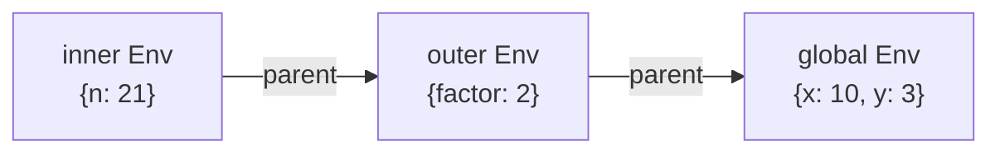
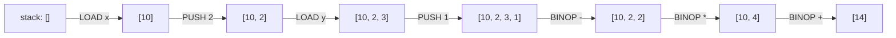

# Building an interpreter and a virtual machine — two ways to give a program meaning

*A tree-walking evaluator against a chain of environments, and a compiler that lowers the same tree into an instruction set small enough to read every line of — both of them the same idea chapter 5 already showed happening in C, built here entirely in view.*

**Level:** L5 · **Prerequisites:** [05 bytecode and the runtime](05_bytecode_and_the_runtime.md), [12 the AST as a program-analysis surface](12_the_ast_as_a_program_analysis_surface.md)
**Covers:** PY-21
**Sources:** Wilson, *Software Design by Example*, ch. "Parsing Text," ch. "An Interpreter," ch. "Functions and Closures," ch. "A Virtual Machine" (2026)

---

## 1. The problem this solves

Chapter 5 describes CPython's eval loop from the outside: a fetch-decode-execute cycle, reading one instruction at a time and dispatching to whatever C code implements it. That description is accurate, and it is also, for a reader who has never built one, a black box — "the interpreter reads an instruction and does what it says" is true of every interpreter that has ever existed, and it explains nothing about what makes that possible or why a design would choose one shape of machine over another. The only way to turn that description into a mechanism rather than an article of faith is to build a small one, entirely in view, using nothing more than the tools this shelf has already covered: dictionaries as environments (chapter 6), closures (chapter 3), and dispatch by type or by name (chapters 1 and 2).

Neither exercise requires inventing anything new. Every piece — a tokenizer turning text into a flat list of symbols, a parser turning that list into a tree, an environment that is a dictionary with a pointer to an enclosing one, a loop that reads a position and dispatches on what it finds there — is a tool this shelf has already introduced for a different purpose. What changes here is the angle: instead of using a dictionary to store an object's attributes, this chapter uses one to stand in for a variable scope; instead of using recursion to walk a data structure for an analysis (chapter 12), it uses recursion to *produce a result the program actually needs* from that same kind of structure. The techniques are not new. Applying them to the specific, self-referential problem of "a program that runs other programs" is what turns familiar tools into a working interpreter.

This chapter builds two such programs, deliberately, because "interpreting a program" is not one idea but at least two genuinely different ones wearing the same name. A **tree-walking interpreter** takes the parsed structure of a program — the same kind of tree chapter 12 already covers for analysis — and evaluates it directly, recursively, with no intermediate form at all. A **compiler to a small virtual machine** takes that same tree and lowers it into a flat, linear sequence of simple instructions first, then runs *those* in a loop — which is structurally much closer to what CPython itself actually does, and is the shape chapter 5's own eval loop takes. Building both, from the same source tree, makes the trade-off between them concrete rather than asserted: a tree walker is simpler to write and reason about; a compiled instruction sequence is what makes chapter 5's specializing interpreter and inline caches possible at all, because there is a fixed, flat sequence of discrete steps to attach that machinery to.

---

## 2. The mechanism, built up

### 2.1 Parsing turns a flat string into the same kind of tree chapter 12 already covers

A minimal expression language — numbers, variables, the four arithmetic operators, and parentheses — needs a tokenizer and a parser before anything can be evaluated at all:

```python
import re

TOKEN_RE = re.compile(r'\s*(?:(\d+)|([A-Za-z_]\w*)|(.))')

def tokenize(text):
    tokens = []
    for num, name, sym in TOKEN_RE.findall(text):
        if num:
            tokens.append(('NUM', int(num)))
        elif name:
            tokens.append(('NAME', name))
        elif sym.strip():
            tokens.append(('SYM', sym))
    return tokens

print(tokenize("x + 2 * (y - 1)"))
```

```text
[('NAME', 'x'), ('SYM', '+'), ('NUM', 2), ('SYM', '*'), ('SYM', '('), ('NAME', 'y'), ('SYM', '-'), ('NUM', 1), ('SYM', ')')]
```

A **recursive-descent parser** turns that flat token list into a tree, with the recursion structure itself encoding operator precedence — multiplication is parsed one level "deeper" than addition, which is what makes `2 * (y - 1)` bind as a single unit before the outer addition ever sees it:

```python
class Parser:
    def __init__(self, tokens):
        self.tokens, self.pos = tokens, 0
    def peek(self):
        return self.tokens[self.pos] if self.pos < len(self.tokens) else (None, None)
    def next(self):
        tok = self.peek(); self.pos += 1; return tok

    def parse_expr(self):
        node = self.parse_term()
        while self.peek() in [('SYM', '+'), ('SYM', '-')]:
            op = self.next()[1]
            node = ('binop', op, node, self.parse_term())
        return node
    def parse_term(self):
        node = self.parse_atom()
        while self.peek() in [('SYM', '*'), ('SYM', '/')]:
            op = self.next()[1]
            node = ('binop', op, node, self.parse_atom())
        return node
    def parse_atom(self):
        kind, val = self.next()
        if kind == 'NUM':
            return ('num', val)
        if kind == 'NAME':
            return ('var', val)
        if (kind, val) == ('SYM', '('):
            node = self.parse_expr()
            self.next()   # consume ')'
            return node
```

```python
print(Parser(tokenize("x + 2 * (y - 1)")).parse_expr())
```

```text
('binop', '+', ('var', 'x'), ('binop', '*', ('num', 2), ('binop', '-', ('var', 'y'), ('num', 1))))
```

This tree is the same *kind* of structure `ast.parse` returns for real Python — nested nodes, each one a small, typed record of one grammatical construct — built by hand for a language small enough that every rule fits on one screen. `parse_term` calling `parse_atom` before `parse_expr` finishes is precisely why the `2 * (y - 1)` subtraction and multiplication end up nested one level deeper than the outer addition: precedence, here, is not a rule looked up in a table — it is the literal shape of which parsing method calls which.

### 2.2 A tree-walking interpreter evaluates the tree directly, one node at a time, with no intermediate form

Given the tree, evaluating it is a single recursive function dispatching on each node's tag — chapter 2's protocol-dispatch idea, expressed as a plain `if`/`elif` chain rather than a method lookup, because the "type" being dispatched on here is a string tag in a tuple, not a Python class:

```python
def evaluate(node, env):
    kind = node[0]
    if kind == 'num':
        return node[1]
    if kind == 'var':
        return env[node[1]]
    if kind == 'binop':
        _, op, left, right = node
        l, r = evaluate(left, env), evaluate(right, env)
        return {'+': l + r, '-': l - r, '*': l * r, '/': l / r}[op]
    raise ValueError(node)

tree = Parser(tokenize("x + 2 * (y - 1)")).parse_expr()
print(evaluate(tree, {"x": 10, "y": 3}))
```

```text
14
```

`10 + 2 * (3 - 1)` correctly evaluates to `14`, and tracing exactly how reveals the entire mechanism: `evaluate` is called on the outer `binop`, which calls itself on the left (`('var', 'x')`, resolving to `10` via a dictionary lookup) and the right (the nested multiplication), and that nested call recurses again into its own subtraction before either multiplication or addition ever actually runs. There is no separate "compile" step here at all — the tree itself *is* what gets executed, walked fresh on every evaluation, which is both this approach's simplicity and, as section 2.9 covers, its real performance cost relative to the compiled alternative built later in this chapter.

### 2.3 An environment is a chain of dictionaries, and the chain is what scope actually means

A single flat dictionary works for the arithmetic example above, but a language with nested blocks or function calls needs one dictionary per scope, linked to its enclosing scope — chapter 3's closure mechanism, rebuilt explicitly rather than relied on implicitly:

```python
class Env:
    def __init__(self, parent=None):
        self.vars = {}
        self.parent = parent
    def get(self, name):
        if name in self.vars:
            return self.vars[name]
        if self.parent is not None:
            return self.parent.get(name)
        raise NameError(name)
    def set(self, name, value):
        self.vars[name] = value
```



Looking up a name that is not in the current `Env` walks the `parent` chain outward until it is found or the chain runs out — which is, precisely, the LEGB lookup chapter 3 already describes for real Python closures, rebuilt here as an explicit, inspectable object graph instead of CPython's own hidden cell mechanism. "Scope" is not a separate concept the interpreter has to invent; it falls directly out of which `Env` object a piece of code happens to be evaluated against, and nested scope is nothing more than one `Env` pointing to another as its parent.

### 2.4 A first-class function is a bundle of its parameters, its body, and the environment active where it was defined

Chapter 3 establishes that a closure is a function plus the free variables its body still refers to. Implementing that inside this toy language, rather than relying on Python's own closures to provide it for free, makes the "which environment" question explicit rather than automatic:

```python
class Closure:
    def __init__(self, params, body, env):
        self.params = params
        self.body = body
        self.env = env          # the environment active where the function was DEFINED

def call(fn, args):
    call_env = Env(parent=fn.env)     # chained to the DEFINING env, not the calling site
    for param, arg in zip(fn.params, args):
        call_env.set(param, arg)
    return evaluate(fn.body, call_env)
```

```python
outer = Env()
outer.set("factor", 2)
outer.set("double", Closure(["n"], Parser(tokenize("n * factor")).parse_expr(), outer))
print(call(outer.get("double"), [21]))
```

```text
42
```

The line that matters most here is `Env(parent=fn.env)`, not `Env(parent=<whatever environment the call happens to be written in>)`. `double`'s body refers to `factor`, and `factor` is resolved by walking outward from `call_env` to `fn.env` — the environment that was active at the moment `double` was *created* — regardless of where `call(...)` itself is invoked from. This one design decision is the entire mechanism of a closure: capture is about the environment a function is *born* into, never the environment it happens to be *called* from, and getting this backwards (chaining to the caller's environment instead) is precisely how a from-scratch interpreter accidentally implements dynamic scoping instead of the lexical scoping every mainstream language actually uses.

`call_env`'s own life is also worth tracing explicitly, because it is the toy-language equivalent of chapter 5's frame object: a fresh `Env` is built for every single call, holds exactly the parameters bound for that one invocation, and — because nothing outside `call` keeps a reference to it once `evaluate(fn.body, call_env)` returns — becomes eligible for the same reference-counted destruction chapter 4 describes, the instant the call finishes. The one case where it survives longer is precisely the interesting one: if `fn.body` itself creates and returns another `Closure`, that new closure's own `.env` field is a live reference to `call_env`, keeping it alive exactly as long as the returned closure is — a from-scratch demonstration of why a real language's closures can outlive the function call that created their captured variables, built here from nothing but an object holding a reference to another object, chapter 4's actual mechanism rather than a metaphor for it.

### 2.5 Compiling the same tree into a flat instruction sequence is a second, different way to give it meaning

A tree-walking interpreter re-examines the tree's shape on every single evaluation. A **compiler** walks the tree exactly once, emitting a flat list of small instructions that, once produced, can be run — and rerun — without ever consulting the tree's recursive structure again:

```python
def compile_expr(node, code):
    kind = node[0]
    if kind == 'num':
        code.append(('PUSH', node[1]))
    elif kind == 'var':
        code.append(('LOAD', node[1]))
    elif kind == 'binop':
        _, op, left, right = node
        compile_expr(left, code)
        compile_expr(right, code)
        code.append(('BINOP', op))

code = []
compile_expr(Parser(tokenize("x + 2 * (y - 1)")).parse_expr(), code)
print(code)
```

```text
[('LOAD', 'x'), ('PUSH', 2), ('LOAD', 'y'), ('PUSH', 1), ('BINOP', '-'), ('BINOP', '*'), ('BINOP', '+')]
```



This flat sequence is the **instruction set** this interpreter has designed: `PUSH` and `LOAD` produce a value; `BINOP` consumes the two most recently produced values and produces one result — the same **stack machine** model chapter 5 already documents for CPython's own `BINARY_OP`. Reading the sequence left to right traces exactly how a stack-based machine executes it: push `x`'s value, then `2`, then `y`'s value, then `1`; combine the last two with `-`; combine that result with the pending `2` via `*`; combine that with the pending `x` via `+`. The tree's nesting has become the *order* of a flat list — no recursion left anywhere in the sequence itself, only in the compiler that produced it once.

### 2.6 The fetch-decode-execute loop is the instruction-set's counterpart to `evaluate`, running instructions instead of walking nodes

```python
import operator
BINOPS = {'+': operator.add, '-': operator.sub, '*': operator.mul, '/': operator.truediv}

def run(code, env):
    stack = []
    pc = 0
    while pc < len(code):
        op, arg = code[pc]
        if op == 'PUSH':
            stack.append(arg)
        elif op == 'LOAD':
            stack.append(env[arg])
        elif op == 'BINOP':
            r, l = stack.pop(), stack.pop()
            stack.append(BINOPS[arg](l, r))
        pc += 1
    return stack.pop()

print(run(code, {"x": 10, "y": 3}))
```

```text
14
```

`pc` — the **program counter** — is the fetch half of fetch-decode-execute: it names which instruction runs next. The `if`/`elif` chain reading `op` is the decode half, choosing what to do based on the instruction's own tag, in exactly the same spirit as `evaluate`'s dispatch on a node's kind in section 2.2 — except this loop dispatches on a flat sequence position rather than a tree position, and advances `pc` by a fixed step rather than recursing. This is, line for line, a miniature of chapter 5's own eval loop: a position in a sequence of instructions, a dispatch on the current instruction's opcode, and an explicit stack standing in for the same role CPython's own per-frame value stack plays.

### 2.7 Control flow needs the program counter to move by more than one, which is what a jump is

Arithmetic alone never needs `pc` to do anything but advance by one. A loop needs `pc` to jump backward; a conditional needs it to jump forward past a branch that should not run — and both need a way to name a destination symbolically before that destination's actual position is known, which is what a **label** is for:

```python
def run_with_control_flow(code, env):
    stack = []
    pc = 0
    labels = {instr[1]: i for i, instr in enumerate(code) if instr[0] == 'LABEL'}
    while pc < len(code):
        op, arg = code[pc]
        if op == 'PUSH':
            stack.append(arg)
        elif op == 'LOAD':
            stack.append(env[arg])
        elif op == 'STORE':
            env[arg] = stack.pop()
        elif op == 'BINOP':
            r, l = stack.pop(), stack.pop()
            stack.append(BINOPS[arg](l, r))
        elif op == 'CMP_LT':
            r, l = stack.pop(), stack.pop()
            stack.append(l < r)
        elif op == 'JUMP_IF_FALSE':
            if not stack.pop():
                pc = labels[arg]; continue
        elif op == 'JUMP':
            pc = labels[arg]; continue
        elif op == 'LABEL':
            pass
        pc += 1
    return stack

loop_code = [
    ('LABEL', 'loop_start'),
    ('LOAD', 'i'), ('PUSH', 5), ('CMP_LT', None), ('JUMP_IF_FALSE', 'loop_end'),
    ('LOAD', 'total'), ('LOAD', 'i'), ('BINOP', '+'), ('STORE', 'total'),
    ('LOAD', 'i'), ('PUSH', 1), ('BINOP', '+'), ('STORE', 'i'),
    ('JUMP', 'loop_start'),
    ('LABEL', 'loop_end'),
]
env = {"i": 0, "total": 0}
run_with_control_flow(loop_code, env)
print(env)
```

```text
{'i': 5, 'total': 10}
```

This hand-written sequence is exactly what a compiler for `while (i < 5) { total = total + i; i = i + 1; }` would emit, and running it correctly sums `0 + 1 + 2 + 3 + 4`, arriving at `10`. `JUMP_IF_FALSE` and `JUMP` are the only two instructions this machine needs to express every control-flow construct a language built on this foundation might have — an `if` is a single conditional jump past its body; a `while` is a conditional jump past the loop plus an unconditional jump back to its start, exactly as written above.

### 2.8 Assembling symbolic labels into numbers is a separate pass from generating them

The label names in section 2.7 — `'loop_start'`, `'loop_end'` — are a convenience for the compiler writer, resolved to concrete positions only once, in a dedicated pass, before the machine ever runs:

```python
def assemble(symbolic_code):
    labels, pos = {}, 0
    for instr in symbolic_code:
        if instr[0] == 'LABEL':
            labels[instr[1]] = pos
        else:
            pos += 1
    numeric = []
    for op, arg in symbolic_code:
        if op == 'LABEL':
            continue
        if op in ('JUMP', 'JUMP_IF_FALSE'):
            numeric.append((op, labels[arg]))
        else:
            numeric.append((op, arg))
    return numeric

for instr in assemble(loop_code)[:5]:
    print(instr)
```

```text
('LOAD', 'i')
('PUSH', 5)
('CMP_LT', None)
('JUMP_IF_FALSE', 13)
('LOAD', 'total')
```

`'loop_end'` resolves to `13` — the position immediately after the loop's last real instruction — computed once, by scanning the symbolic sequence and counting only the entries that are not themselves labels. This two-pass structure (find every label's position first, then resolve every jump against that table) exists because a forward jump's target — `loop_end`, referenced before its own position is known — cannot be resolved in a single left-to-right pass; the label has to be seen once as a destination before the jump referencing it can be assigned a real number. Real assemblers, for real machine code, solve exactly this same problem the same way.

### 2.9 A stack machine trades registers for an implicit operand location, and the trade is about where state lives

The virtual machine built above stores intermediate values entirely on an implicit stack — no instruction ever names *which* value it operates on, because `BINOP` always means "the two values most recently pushed." A **register machine** — the alternative Wilson's own book builds specifically as a contrast to a stack-based design — names its operands explicitly: an instruction says "add register 1 and register 2, store the result in register 3," rather than relying on push-and-pop ordering. Both designs can express identical computations; the difference is where state lives and how explicit its location is. A stack machine's instructions are simpler to generate from a tree — section 2.5's `compile_expr` never has to decide *where* to put a value, only that it goes on the stack — at the cost of more instructions overall, since values move through the stack far more often than a register machine's explicitly-addressed instructions require. This is not a difference this chapter needs to build in full to make its point: it is enough to know that the choice is real, that CPython itself is a stack machine (chapter 5's own `BINARY_OP` popping and pushing exactly as this toy machine does), and that a register-based design is neither strictly better nor a purely academic alternative — it is a genuinely different point in the same design space, chosen by some real virtual machines (the CPython-adjacent PyPy's tracing JIT among them) for different trade-offs than CPython made.

---

## 3. Diagrams

The environment-chain diagram in section 2.3 and the stack-evolution trace in section 2.5 are integrated into the mechanism build-up above, as this format requires.

---

## 4. Failure modes

### 4.1 Chaining a call's environment to the caller instead of the definer silently implements dynamic scoping

```python
# Gist: dynamic_scope_bug.py
def call_wrong(fn, args, caller_env):
    call_env = Env(parent=caller_env)     # BUG: should be parent=fn.env
    for param, arg in zip(fn.params, args):
        call_env.set(param, arg)
    return evaluate(fn.body, call_env)

outer = Env()
outer.set("factor", 2)
double = Closure(["n"], Parser(tokenize("n * factor")).parse_expr(), outer)

caller_env = Env()
caller_env.set("factor", 100)             # an unrelated variable, same name, different scope
print(call_wrong(double, [21], caller_env))
```

```text
2100
```

The result should be `42` — `21 * 2`, using the `factor` in force where `double` was defined — and it is `2100` instead, because `call_wrong` chains the new call frame to whatever environment happened to be active at the *call site* rather than to `fn.env`, the environment active where the function was *defined*. Section 2.4 already names the fix and the reason it matters: lexical scoping — what every mainstream language, Python included, actually implements — resolves free variables by where a function's *source code* sits, never by which other code happens to invoke it. This bug is dangerous specifically because it produces a plausible, non-crashing number every time, and only reveals itself when the same function is called from two places that happen to define a same-named variable differently — exactly the caller_env/outer scenario above — which a test suite calling the function from only one context would never expose. The one-line fix (`parent=fn.env`) is section 2.4's own code exactly as written; the value of naming this failure mode explicitly is that "which environment does a call chain to" is the single decision that separates lexical from dynamic scoping, and getting it backwards produces working-looking code for a long time before it produces a wrong answer.

### 4.2 A forward jump resolved against an incomplete label table jumps to the wrong instruction, silently

```python
# Gist: incomplete_label_table.py
def assemble_buggy(symbolic_code):
    labels, numeric = {}, []
    for op, arg in symbolic_code:               # single pass — BUG
        if op == 'LABEL':
            labels[arg] = len(numeric)
        elif op in ('JUMP', 'JUMP_IF_FALSE'):
            numeric.append((op, labels.get(arg, -1)))   # arg's label may not exist YET
        else:
            numeric.append((op, arg))
    return numeric

code = assemble_buggy(loop_code)
print(code[3])   # the JUMP_IF_FALSE meant to target loop_end
```

```text
('JUMP_IF_FALSE', -1)
```

Section 2.8 already explains why a single combined pass cannot work for a *forward* reference: `JUMP_IF_FALSE`'s target, `'loop_end'`, has not been seen yet at the point this single-pass assembler processes it, because `'loop_end'`'s own `LABEL` entry appears later in the symbolic instruction list. `labels.get(arg, -1)` silently substitutes a placeholder rather than raising, which is the trap — a two-pass assembler that accidentally collapses into one pass does not crash on a forward jump, it emits a jump to an arbitrary wrong position (here, one before the very first instruction), and the machine either loops forever, crashes on an unrelated instruction much later, or — worst of all — produces a plausible wrong answer, depending entirely on what happens to sit at the wrong position. Backward jumps (`'loop_start'`, already seen by the time it is referenced) work fine under the buggy single-pass version, which is exactly what makes this defect easy to miss during development: a loop's back-edge is tested constantly, while its forward exit jump is often only ever exercised by the same handful of test cases, if the tests happen to include the loop's zero-iteration case at all. The fix is section 2.8's own two-pass structure: a first pass that records every label's position before a second pass ever tries to resolve a jump against it.

---

### 4.3 A compiler bug that emits too few operands underflows the stack at run time, far from where the bug actually is

```python
# Gist: stack_underflow.py
def compile_expr_buggy(node, code):
    kind = node[0]
    if kind == 'num':
        code.append(('PUSH', node[1]))
    elif kind == 'var':
        code.append(('LOAD', node[1]))
    elif kind == 'binop':
        _, op, left, right = node
        compile_expr_buggy(left, code)
        # BUG: forgot to compile the right-hand operand
        code.append(('BINOP', op))

code = []
compile_expr_buggy(('binop', '+', ('var', 'x'), ('num', 5)), code)
print(code)
run(code, {"x": 10})
```

```text
[('LOAD', 'x'), ('BINOP', '+')]
IndexError: pop from empty list
```

The bug is in the compiler — one recursive call to `compile_expr_buggy` on the right-hand operand is missing — but the failure surfaces entirely inside `run`, at a `stack.pop()` with nothing left to pop, which is a different function, working correctly on its own terms, simply handed an instruction sequence that does not carry the operand count `BINOP` needs. Section 2.5 and section 2.6 together explain why this is where the failure has to appear: the VM has no way to check, before executing, whether a given instruction sequence is internally consistent — it trusts that whoever produced the sequence balanced every push against every pop correctly, exactly as CPython's own bytecode carries no runtime check that a `BINARY_OP` will find two operands waiting on the stack. This is the general shape of every bug in a compile-then-run pipeline: a defect in the compiler is invisible until the specific malformed sequence it produces is actually executed, and the error, when it finally appears, points at the *symptom's* location (the VM's stack) rather than the *cause's* (the missing recursive call), which is exactly why real compilers are typically tested by directly inspecting the instruction sequences they emit, rather than only by running the programs those sequences produce.

---

## 5. Trade-offs

| Approach | Use when | Because | Real cost |
| --- | --- | --- | --- |
| **Tree-walking interpreter** | A language prototype, a configuration DSL, or anything evaluated rarely enough that speed does not matter | Directly evaluates the parsed structure — no separate compile step, easiest to get correct first | Re-examines the tree's shape on every single evaluation; slower than a compiled form for anything run repeatedly |
| **Compile to a custom instruction set, then run in a loop** | The same program (or fragment) will be evaluated many times | Pays the tree-walking cost once, at compile time; running the flat instruction sequence afterward is cheaper per execution | Real added complexity — an instruction set to design, a compiler, an assembler, a separate runtime loop |
| **Stack-based instruction set** | Instructions should be simple to generate mechanically from a tree | The compiler never has to decide where a value goes — everything flows through one implicit stack | More instructions per computation than an equivalent register design would need |
| **Register-based instruction set** | Minimizing instruction count matters more than compiler simplicity | Explicit operand addressing avoids redundant stack traffic | The compiler must allocate registers — a genuinely harder problem than "push it and let the stack sort it out" |

### When building either of these from scratch is the wrong call

Every mechanism in this chapter exists, already built, debugged, and optimized, inside CPython itself — nothing here is a recommendation to replace `ast.parse`, `compile()`, or the eval loop with a hand-written equivalent for any real workload. The rejected alternative to using CPython's own machinery for actually running Python is building a parallel one from the techniques in this chapter, which reintroduces every edge case CPython's own decades of development have already found and fixed. This chapter's interpreter and virtual machine earn their place specifically as a way to *understand* what section 2.6 through 2.9's black box was doing all along, or as the genuine, narrow case of a small domain-specific language embedded inside a larger Python program — a rule engine, a formula language, a configuration DSL — where a full Python `eval()` would be both overkill and, per chapter 12's own security discussion, an unacceptable risk for untrusted input.

### When a tree-walking interpreter is not merely simpler but genuinely correct where a naive compiler is not

A tree walker has one advantage beyond simplicity worth stating plainly: it can never desynchronize from the tree it is walking, because it never produces an intermediate representation to get out of sync with in the first place. Section 4.3's stack-underflow failure is only possible because the compiled form is a *separate* artifact from the tree that produced it, and nothing enforces that the two stay consistent short of the compiler being written correctly. A tree walker sidesteps that entire category of bug by construction — there is no second representation to drift from the first — which is a genuine correctness argument for prototyping a new language feature as a tree-walking addition first, even in a project that will eventually compile the feature, specifically so the *semantics* can be gotten right before the *lowering to instructions* is attempted at all.

### The case against a tree-walking interpreter for anything performance-sensitive

A tree walker's simplicity is real, and so is its cost: every single evaluation re-pays the full cost of re-examining the tree's recursive structure, dispatching on each node's type again, with no memory of having done the identical work a moment before for a loop body evaluated a thousand times. The rejected alternative to compiling first is accepting that cost in exchange for a simpler implementation — a reasonable trade for a configuration expression evaluated once, and a poor one for a loop body inside an interpreted language's own hot path, which is exactly why every general-purpose language runtime in wide use today, CPython included, compiles to some intermediate form rather than walking a syntax tree directly at execution time.

---

## 6. Reference summary

**A tree-walking interpreter evaluates a parsed tree directly and recursively**, with no intermediate form — `evaluate` dispatches on each node's own tag, exactly as chapter 2's protocol dispatch works on a type, and re-examines the tree's shape on every single run. **An environment is a chain of dictionaries linked by a parent pointer**; looking up a name walks that chain outward, which is chapter 3's LEGB scoping rule made into an explicit, inspectable object graph. **A closure is a bundle of parameters, a body, and the environment active where it was *defined*** — chaining a call's new scope to the *definer's* environment, never the caller's, is the one decision that makes scoping lexical rather than dynamic, and getting it backwards produces plausible, silently wrong results rather than an error.

**A compiler lowers the same tree into a flat instruction sequence once**, which can then be run — and rerun — without ever consulting the tree's recursive structure again. **A fetch-decode-execute loop reads a program counter, dispatches on the current instruction's opcode, and advances**, in direct miniature of chapter 5's own eval loop; a stack-based instruction set keeps all intermediate values on an implicit stack, exactly as CPython's own `BINARY_OP` does, while a register-based alternative addresses operands explicitly at the cost of a harder compiler.

**Control flow requires the program counter to move by more than one** — `JUMP` unconditionally, `JUMP_IF_FALSE` conditionally — addressed through symbolic labels resolved to real positions by a dedicated **assembler pass**, run once before the machine ever executes. **That resolution genuinely requires two passes**, not one: a forward jump's target has not been seen yet when the jump itself is first encountered in a single left-to-right scan, so every label's position must be recorded before any jump referencing it is resolved.

**Every one of these techniques already exists, tested and optimized, inside CPython itself** — this chapter's value is in making chapter 5's black-box description of "the interpreter reads an instruction and does what it says" into a mechanism a reader has built, traced, and broken by hand, not in providing a replacement for the real thing.

---

← [Python knowledge graph](00_knowledge_graph.md) · [repo index](../README.md)
