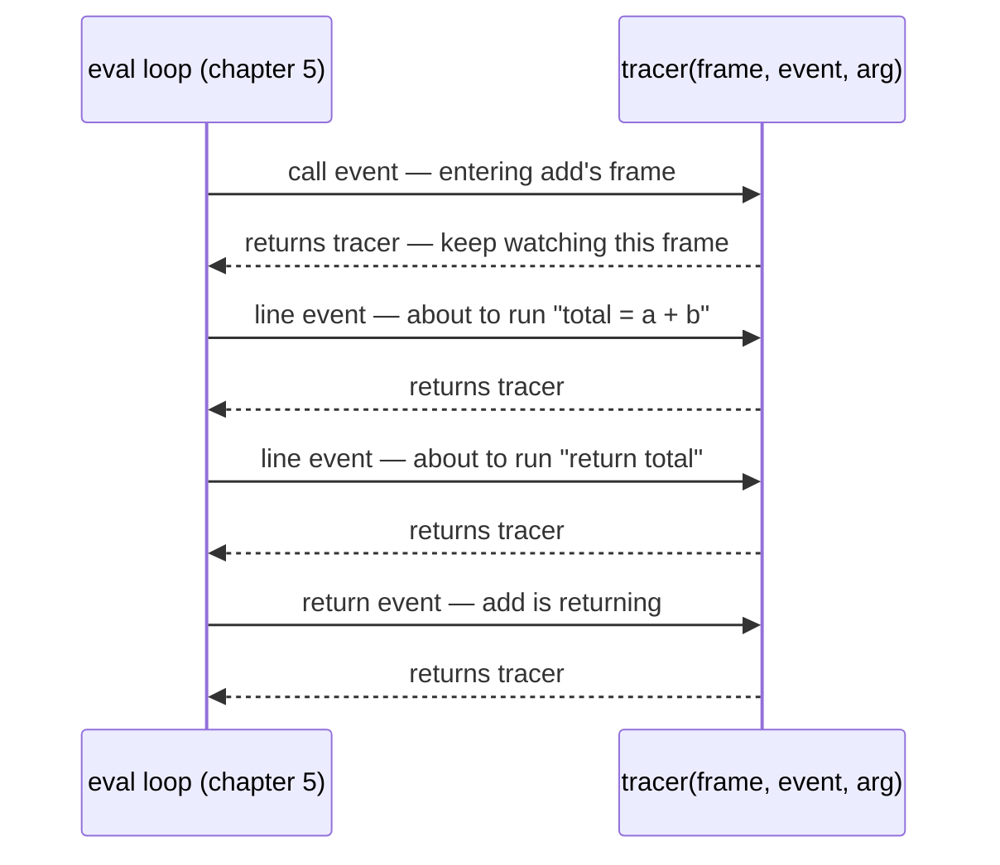
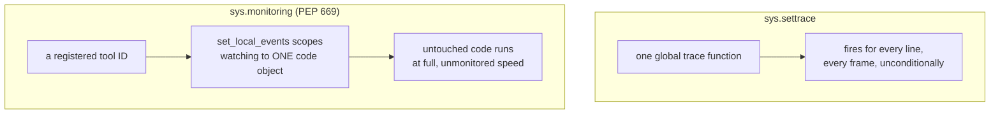
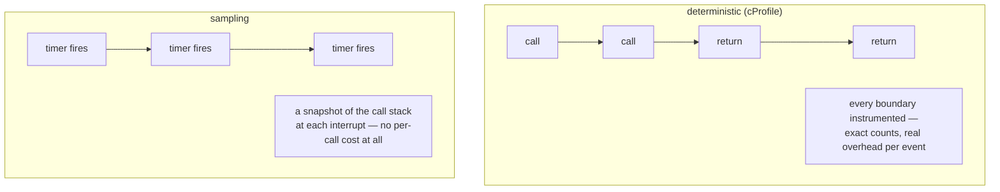

# Tracing a running program — profilers, debuggers, and the event API that replaced `settrace`

*The single hook that lets one piece of Python code watch every line another piece executes, why that hook cost too much to leave running in production, and the per-tool event API Python 3.12 built to fix it.*

**Level:** L4 · **Prerequisites:** [05 bytecode and the runtime](05_bytecode_and_the_runtime.md)
**Covers:** PY-24
**Sources:** Wilson, *Software Design by Example*, ch. "A Debugger," ch. "Performance Profiling" (2026) · PEP 669 (2022) · `sys.settrace`, `sys.monitoring`, and `profile` module documentation, docs.python.org

---

## 1. The problem this solves

Inserting `print(locals())` before a suspicious line is real debugging, and it has a real limit: it only shows what the author thought to ask for, at the one place the author thought to ask. A debugger that can stop at an arbitrary line, on demand, and answer *any* question about the state at that moment — not just the ones printed in advance — needs something more than a well-placed `print`. It needs the interpreter itself to hand control to another piece of code at a chosen point during execution, which sounds like it would require patching CPython's C source — and does not, because Python exposes exactly that hook as an ordinary function any Python program can call.

This is not a small ask of the language. A debugger needs to suspend execution at a point of the *user's* choosing, arbitrarily, without the traced program having written any cooperating code at that point — no `input()` call, no deliberately placed hook, nothing. A profiler needs to observe every function call boundary in a program without that program doing anything special to announce one. Both demands sound, from the outside, like they require the interpreter to be rebuilt around the specific tool that needs them. What actually happens is closer to the opposite: CPython exposes one small, general-purpose seam — a place where control can be handed to arbitrary Python code at a well-defined moment — and every tool this chapter covers, debugger and profiler alike, is built entirely on top of that one seam, in ordinary Python, with no modification to the interpreter itself required.

Chapter 5 already established that the eval loop executes one instruction at a time, in a loop, with a program counter tracking where it is. `sys.settrace` is the interpreter's own admission that this loop can pause, on certain events, and hand a Python callable the frame it was about to continue with — the same frame object chapter 5 already covers, live and inspectable, not a snapshot. Every debugger, coverage tool, and line-level profiler this chapter discusses is built from that one hook, plus ordinary Python code deciding what to do with the events it produces. The chapter's second half is about a real, measured cost that hook has always carried, and the newer, narrower hook Python 3.12 added specifically because that cost had become too high for tools people wanted running by default.

---

## 2. The mechanism, built up

### 2.1 `sys.settrace` hands a callback the running frame on four kinds of event

```python
import sys

def tracer(frame, event, arg):
    print(f"{event}: {frame.f_code.co_name} line {frame.f_lineno}")
    return tracer

def add(a, b):
    total = a + b
    return total

sys.settrace(tracer)
add(2, 3)
sys.settrace(None)
```

```text
call: add line 7
line: add line 8
line: add line 9
return: add line 9
```



`sys.settrace(tracer)` installs `tracer` as the interpreter's **global trace function**; from that point on, entering any Python function fires a `call` event, executing each line fires a `line` event, returning fires a `return` event, and an exception propagating through the frame fires an `exception` event. `tracer` receives the actual frame object — chapter 5's frame, not a copy — on every one of these, which is what makes reading `frame.f_locals` at a `line` event a live look at the running function's current variable state, not a reconstruction after the fact. `sys.settrace(None)` turns tracing back off; section 3.2 covers exactly what happens to the rest of the program if that call is forgotten.

### 2.2 A breakpoint is nothing more than a filter on the `line` event

Everything a "breakpoint at line N" feature needs is already delivered by the mechanism above — deciding when to *act* is ordinary Python conditional logic, not a separate capability:

```python
class MiniDebugger:
    def __init__(self, break_line, commands):
        self.break_line = break_line
        self.commands = iter(commands)     # scripted input, standing in for a human
    def trace(self, frame, event, arg):
        if event == "line" and frame.f_lineno == self.break_line:
            for cmd in self.commands:
                if cmd == "continue":
                    break
                elif cmd.startswith("print "):
                    name = cmd.split()[1]
                    print(f"{name} = {frame.f_locals.get(name)}")
        return self.trace

def compute():
    a = 10
    b = 20
    total = a + b       # line 20 in this listing
    return total

dbg = MiniDebugger(break_line=20, commands=["print a", "print b", "continue"])
sys.settrace(dbg.trace)
print("result:", compute())
sys.settrace(None)
```

```text
a = 10
b = 20
result: 30
```

`compute()` runs to completion exactly once; the debugger's own "pause" is entirely a matter of the `for cmd in self.commands` loop running some extra code before returning `self.trace` and letting execution continue — there is no actual suspension of the interpreter anywhere, only a callback doing more work before it returns. `a` and `b` both already have real values by the time line 20's event fires, because a `line` event fires *before* that line executes but *after* every line above it already has — which is exactly why a breakpoint set on the assignment line can already show every variable that assignment depends on.

### 2.3 Scripting a tool's input is what makes an interactive debugger testable at all

`self.commands = iter(commands)` in the example above is doing double duty worth naming explicitly: in a real interactive debugger, that iterator would be replaced by a loop reading from `input()`, waiting for a human to type `print a` or `continue` at a prompt. Substituting a plain Python iterator over a pre-written list of commands, as done here, is the entire technique for testing an interactive tool without a human present — the debugger's own logic cannot tell the difference between a person typing at a keyboard and a test harness handing it commands one at a time, because both arrive through the exact same `for cmd in self.commands` loop. This is chapter 2's iterator protocol put to a use that has nothing to do with iterating over data — an iterator standing in for a conversation, one exchange at a time, which is precisely what makes a read-eval-print loop testable by ordinary automated means rather than requiring an actual human at a keyboard for every test run.

### 2.4 A trace function's return value controls whether tracing continues for that specific frame

The `return self.trace` (or `return tracer`) at the end of every callback above is not incidental — it is a second, separate contract layered on top of the event dispatch itself:

```python
def tracer(frame, event, arg):
    print(event, frame.f_lineno)
    if event == "call":
        return None       # deliberately not returning tracer here
    return tracer

def add(a, b):
    total = a + b
    return total

sys.settrace(tracer)
add(2, 3)
sys.settrace(None)
```

```text
call 9
```

Only the `call` event ever fires for `add` — no `line` events, no `return` event — because `sys.settrace`'s contract is specifically that a **local** trace function (the value returned from handling a `call` event) is what receives every subsequent event *for that frame*, and returning `None` tells the interpreter this particular frame is not of interest, silencing everything after its `call` event. This is the mechanism section 3.1 turns into a failure mode: forgetting this return-value contract does not raise an error anywhere, it simply produces a debugger that goes silent for a specific function while continuing to work everywhere else, which is a difficult thing to notice precisely because the tool still looks like it is working in general.

### 2.5 `sys.settrace` fires unconditionally, for every line of every frame it is watching — which is exactly what makes it expensive

Nothing in sections 2.1 through 2.4 lets a caller ask "only tell me about line 20" at the interpreter level — every single `line` event in every frame the global trace function is watching fires the callback, and the callback itself decides, in Python, whether to do anything about it. This is simple to reason about and costly to run: a program traced this way pays the cost of a full Python function call on every single line executed, everywhere, whether or not that line is ever actually interesting to the tool doing the tracing. This is the entire reason a `settrace`-based debugger or coverage tool is something a developer turns on deliberately and turns back off — the overhead is real enough that no mainstream tool built this way runs by default in production, and it is precisely the cost the mechanism in section 2.7 was built to remove.

### 2.6 `sys.monitoring` (PEP 669, Python 3.12) lets a tool disable an event at a specific code location, rather than paying for every line everywhere

**PEP 669** added a second, structurally different tracing API specifically to fix section 2.5's cost: instead of one global callback receiving every event from every frame, a tool registers for specific event types under its own **tool ID**, and — the change that actually matters for cost — can restrict those events to one specific code object rather than the whole running program.

```python
import sys

TOOL_ID = sys.monitoring.DEBUGGER_ID
sys.monitoring.use_tool_id(TOOL_ID, "demo-tracer")

def on_line(code, line_number):
    print(f"line event: {code.co_name} line {line_number}")

sys.monitoring.register_callback(TOOL_ID, sys.monitoring.events.LINE, on_line)

def add(a, b):
    total = a + b
    return total

def noisy():
    x = 1
    y = 2
    return x + y

sys.monitoring.set_local_events(TOOL_ID, add.__code__, sys.monitoring.events.LINE)

add(2, 3)
noisy()          # produces no LINE events at all — never registered for this code object

sys.monitoring.set_local_events(TOOL_ID, add.__code__, 0)
sys.monitoring.free_tool_id(TOOL_ID)
```

```text
line event: add line 12
line event: add line 13
```

`noisy()` runs completely and produces nothing, because `set_local_events` scoped `LINE` monitoring to `add`'s code object specifically — a debugger can now watch only the function it actually has a breakpoint in, rather than paying the cost of a callback on every line of every function the whole program happens to run. This is possible because `sys.monitoring` hooks directly into the specializing interpreter's own quickening machinery from chapter 5, rather than inserting a Python-level check on every instruction the way `settrace`'s implementation has to. PEP 669's own rationale, echoed since in tool-vendor benchmarking, reports the resulting overhead as roughly an order of magnitude cheaper than `settrace` for realistic debugger workloads — a large enough gap that it is the reason line-level coverage and debugging tools have begun shipping on `sys.monitoring` by default in environments that previously could not afford to.



`settrace` is still the right place to start learning this mechanism, precisely because its single global callback and its four plain event names make the underlying model easy to see whole. `sys.monitoring`'s per-tool, per-code-object registration is real, additional API surface earning its complexity specifically for the case `settrace` cannot afford: a tool meant to stay attached to a long-running or production process rather than a short debugging session.

### 2.7 Deterministic profiling counts every call; sampling estimates from periodic snapshots

`cProfile` is a **deterministic** profiler: it hooks the same call/return event boundaries `settrace` exposes and records real timing and call-count data for every single function call that occurs, producing an exact count of how many times each function ran and how long each one took.

```python
import cProfile, pstats

def slow():
    total = 0
    for i in range(100_000):
        total += i
    return total

def fast():
    return sum(range(100_000))

pr = cProfile.Profile()
pr.enable()
slow(); fast()
pr.disable()
pstats.Stats(pr).sort_stats("cumulative").print_stats(3)
```

```text
   ncalls  tottime  percall  cumtime  percall filename:lineno(function)
        1    ...      ...      ...      ...   slow
        1    ...      ...      ...      ...   fast
        1    ...      ...      ...      ...   {built-in method builtins.sum}
```

Every row is a real, counted function, with `ncalls` an exact count rather than an estimate — the columns above are shown with the specific timing values omitted deliberately, because those numbers are only meaningful measured live, on a specific machine, and are exactly the kind of figure section 2.8 explains not to trust as a bare, portable fact. A **sampling** profiler takes the opposite trade: rather than instrumenting every call, it interrupts the running program periodically — on a timer, not on an event — and records which function happens to be executing at each interrupt, building up a statistical picture of where time is spent without paying deterministic profiling's per-call overhead at all.



Deterministic profiling is exact but intrusive; sampling is inexact but much closer to free, and the choice between them is a direct trade between precision and how much the act of measuring is allowed to disturb what is being measured. A function that runs for a shorter time than the interval between two timer interrupts can be sampled zero times despite running thousands of times in aggregate — invisible to a sampling profiler in a way it never would be to `cProfile`, which is the concrete shape of "inexact" this trade-off actually costs.

### 2.8 A deterministic profiler's own overhead is not evenly distributed, and its documentation says so directly

`cProfile`'s own documentation names this limitation without hedging: "functions that are called many times, or call many functions, will typically accumulate" timing error from the profiler's own per-event bookkeeping — the delay between an event occurring and the profiler actually reading the clock, and the reverse delay resuming the traced code afterward. This means a function's *ranking* in a profile's output is not purely a fact about that function's real cost; it is partly a fact about how many times the profiler's own overhead was charged against it, which is a genuinely different quantity that happens to look identical in the report. The same documentation adds a second, specific warning: after a profiler calibrates itself to compensate for this overhead, "it will sometimes produce negative numbers" for functions with unusually low call counts — an artifact of the calibration process working as designed, not a bug to chase, and stated as such precisely so a reader does not mistake a documented statistical quirk for a real defect in their code.

### 2.9 A microbenchmark measures a function stripped of the context it normally runs inside

Chapter 5 already covers `timeit`'s own two central pieces of methodology: disabling the garbage collector for comparability, and trusting the minimum of several runs rather than the mean. What belongs here, specifically, is the reason a microbenchmark can report an accurate number for the wrong question: `timeit` runs an isolated snippet, repeatedly, in a tight loop, which means CPU caches stay warm, branch predictors stay trained on the same pattern, and the specializing interpreter from chapter 5 has every opportunity to specialize the snippet's few call sites long before the timing loop's later iterations run — none of which resembles how that same code executes once inside a large, varied real program, where the surrounding code constantly evicts caches, retrains predictors, and touches far more distinct call sites than a ten-line benchmark ever does. A microbenchmark's number is real and reproducible; the mistake is assuming it transfers unchanged to a context that shares none of the isolation that produced it.

---

## 3. Failure modes

### 3.1 Returning the wrong value from a `call` event handler silently stops tracing for that one frame

```python
# Gist: wrong_trace_return.py
import sys

def tracer(frame, event, arg):
    print(event, frame.f_code.co_name)
    if event == "call" and frame.f_code.co_name == "helper":
        return None          # forgot: this silences ALL further events for helper
    return tracer

def helper(x):
    y = x * 2
    return y

def main():
    return helper(5)

sys.settrace(tracer)
main()
sys.settrace(None)
```

```text
call main
line main
call helper
return main
```

`helper`'s own `line` and `return` events never appear at all — only its single `call` event does, and even that is reported by name only because the top-level `tracer` function (still watching `main`) is what prints it, not `helper`'s own local trace function, which was set to `None` and therefore never runs again. Section 2.4 already establishes why: the value returned from a `call` event becomes the local trace function for that frame, and `None` explicitly means "stop watching this frame" — `helper` is entered, does its work, and returns with the debugger completely blind to everything that happened inside it. Nothing raises an exception or prints a warning; the debugger continues to function correctly for every other frame, which is precisely what makes this defect hard to notice — a tool author testing breakpoints in `main` sees them work, and only discovers `helper` is invisible once someone specifically tries to set a breakpoint inside it and finds nothing happens. The fix is to audit every `return` statement inside a trace callback for exactly this contract: returning the trace function itself continues watching a frame, returning anything else — most commonly `None`, reached by falling off the end of a conditional without an explicit final `return` — stops watching it, silently, from that point on.

### 3.2 An un-disabled global trace function keeps taxing every line of every function for the rest of the process

```python
# Gist: forgotten_settrace_none.py
import sys

def tracer(frame, event, arg):
    print(f"traced: {frame.f_code.co_name} {event}")
    return tracer

def instrumented():
    return 1

sys.settrace(tracer)
instrumented()
# sys.settrace(None) — forgotten

def unrelated():
    return 2

print("--- calling unrelated code much later ---")
unrelated()
```

```text
traced: instrumented call
traced: instrumented line
traced: instrumented return
--- calling unrelated code much later ---
traced: unrelated call
traced: unrelated line
traced: unrelated return
```

`unrelated`, defined and called with no apparent connection to the debugging session above it, is traced anyway — because `sys.settrace` sets a genuinely global, process-wide trace function that stays active until something explicitly calls `sys.settrace(None)`, and nothing about finishing one debugging task does that automatically. In a short script this is merely noisy; in a long-running process — a web server, a REPL session left open, a test suite that traces one test and forgets to clean up — every line of every function executed afterward pays section 2.5's full per-line overhead indefinitely, for a debugging session that has long since finished being useful. The fix is structural rather than a reminder to type one more line: wrap tracing in a context manager (`__enter__` calling `sys.settrace(tracer)`, `__exit__` calling `sys.settrace(None)` unconditionally, even on an exception) so that "tracing has ended" is guaranteed by the language's own cleanup mechanism rather than by remembering to write the matching call.

### 3.3 Using `sys.monitoring`'s global event registration instead of `set_local_events` reintroduces the exact cost PEP 669 exists to remove

```python
# Gist: monitoring_without_scoping.py
import sys

TOOL_ID = sys.monitoring.DEBUGGER_ID
sys.monitoring.use_tool_id(TOOL_ID, "unscoped-tracer")

def on_line(code, line_number):
    pass   # a real tool would do something here

sys.monitoring.register_callback(TOOL_ID, sys.monitoring.events.LINE, on_line)
sys.monitoring.set_events(TOOL_ID, sys.monitoring.events.LINE)    # global, not local

def one_function_of_interest():
    x = 1
    return x

def hundreds_of_other_functions():
    y = 2
    return y

one_function_of_interest()
hundreds_of_other_functions()   # pays the same LINE-event cost, for nothing
```

Section 2.6 already shows the correct, scoped alternative — `set_local_events(TOOL_ID, code_object, events.LINE)` — and the mistake here is using `set_events` instead, which is the API's own *global* registration, watching every line of every function in the running program exactly the way `sys.settrace` always has. Nothing about this is a bug in the sense of producing a wrong answer; `on_line` fires correctly for both functions above. It is a missed opportunity with a real performance cost: a tool author who reaches for `sys.monitoring` specifically for its documented, order-of-magnitude cost advantage over `settrace`, and then registers globally instead of scoping to the handful of code objects actually under a breakpoint, has paid to adopt a newer, more complex API while keeping the older API's exact cost profile. The fix is to always scope real usage through `set_local_events` against the specific code objects of interest, reserving `set_events`'s global registration for the rare tool — a full-program coverage collector, for instance — that genuinely needs every line in the process, which is a deliberate design choice rather than the default.

### 3.4 A bug inside the trace callback itself surfaces as an exception from the traced call site, not from the callback

```python
# Gist: buggy_tracer_exception.py
import sys

def buggy_tracer(frame, event, arg):
    stats = {}
    stats[event] += 1        # KeyError — stats is empty, this always fails
    return buggy_tracer

def add(a, b):
    return a + b

sys.settrace(buggy_tracer)
try:
    result = add(2, 3)
except KeyError as e:
    print("KeyError escaped from the traced call:", e)
sys.settrace(None)
print("tracing still active?", sys.gettrace() is not None)
```

```text
KeyError escaped from the traced call: 'call'
tracing still active? False
```

The real bug is entirely inside `buggy_tracer` — `stats[event] += 1` reads from a dictionary that was just created empty, which always raises `KeyError` on its very first use — but the exception a caller actually sees comes out of `add(2, 3)`, the ordinary function call that merely happened to be running while tracing was active. This is a direct consequence of sections 2.1 and 2.2: the trace callback runs *as part of* handling the `call` event for `add`'s own frame, so an exception inside the callback has nowhere else to propagate to except the very call that triggered it. CPython additionally disables tracing automatically the moment a trace function raises — `sys.gettrace()` returning `None` afterward confirms this — which means a bug in a debugging tool does not merely fail loudly once; it silently turns itself off for the rest of the process, and any code relying on that tracing staying active (a coverage collector still expecting to see later events, for instance) will not be told that it stopped. The practical lesson is that a trace callback deserves the same defensive care as code running inside a signal handler: it should be simple enough to be visibly correct, because its own bugs disguise themselves as failures in code that is, in fact, completely innocent.

---

## 4. Trade-offs

| Approach | Use when | Because | Real cost |
| --- | --- | --- | --- |
| **`print` debugging** | A quick, one-off check of a value at a known point | Zero setup, no tool to learn | Only answers questions decided on in advance; requires editing and re-running to ask a new one |
| **`sys.settrace`** | Building or understanding a debugger's event model, or a short, disposable debugging session | Simple, four plain event names, easy to reason about completely | Fires unconditionally for every line of every watched frame — real, broad overhead not meant to run by default |
| **`sys.monitoring` (PEP 669)** | A tool meant to stay attached to a long-running or production process | Per-tool registration and per-code-object scoping (`set_local_events`) keep cost close to zero for untouched code | Newer, more complex API surface than `settrace`; requires explicit scoping to actually realize the cost advantage |
| **`cProfile` (deterministic)** | An exact call count and per-function timing breakdown is needed | Counts and times every real call | Overhead itself distorts results for high-call-count functions, by the profiler's own documented admission |
| **A sampling profiler** | Profiling a production or performance-sensitive workload where deterministic overhead is unacceptable | Periodic interrupts cost far less than instrumenting every call | Statistical, not exact — a function called briefly enough may never be sampled at all |

### When a debugger is the wrong tool entirely

A debugger answers "what is the state at this specific point, right now" — it is the wrong tool for "does this function behave correctly across every input that matters," which is a testing question, not a tracing one. Reaching for a debugging session to manually verify behavior that a unit test could check automatically and permanently trades a few minutes of interactive poking for a check that has to be redone by hand every time the code changes; the debugger is the right tool specifically for the case a test cannot yet be written, because the actual cause of the wrong behavior is not yet understood.

### The case against reaching for `sys.settrace` in new tooling written today

`settrace`'s four-event model remains the clearest way to *learn* what a tracing tool actually does, precisely because its simplicity is total: one global function, four event names, no per-code-object bookkeeping to reason about. That same simplicity is a real liability in anything meant to ship and run against code the author does not control, because section 2.5's unconditional per-line cost is paid in full regardless of whether the tool built on it ever scopes its attention narrowly. The rejected alternative to building new production tooling on `settrace` is `sys.monitoring`, accepting its larger, more explicit API surface — tool IDs to acquire and release, events to register per type, `set_local_events` to scope deliberately — in exchange for the option to pay close to nothing for the code paths a given run of the tool never actually needs to watch. `settrace` is where understanding starts; it is not where a 2026-era debugger or coverage tool should still be built.

### The case against deterministic profiling for anything already running in production

`cProfile`'s overhead is real and, per section 2.8, is not even applied uniformly across the functions it measures — running it against a live production workload risks changing the very timing characteristics it is trying to observe, and risks skewing the ranking of results toward whichever functions happen to be called most often rather than whichever functions are actually the most expensive. The rejected alternative to deterministic profiling here is a sampling-based profiler, accepting statistical imprecision in exchange for overhead low enough to run continuously against real traffic — the right trade specifically once "which functions run" and "how they perform under synthetic load" are no longer close enough substitutes for the real question.

---

## 5. Reference summary

**`sys.settrace` installs a global trace function receiving `call`, `line`, `return`, and `exception` events**, handing it the live frame object chapter 5 already describes — not a snapshot — which is what makes reading `frame.f_locals` at a breakpoint a real look at current state. **A breakpoint is nothing more than a conditional check on the `line` event's line number**; there is no separate "pause" mechanism, only a callback doing more work before returning. **A trace callback's return value is a second contract**: returning the trace function continues watching that frame; returning anything else, most often `None` by accident, silently stops watching it from that point on.

**`sys.settrace` fires unconditionally for every line of every watched frame**, which is the direct source of its overhead and the reason no mainstream tool leaves it running by default. **`sys.monitoring` (PEP 669, Python 3.12) replaces this with per-tool registration and, critically, `set_local_events` scoping to one specific code object** — hooking the specializing interpreter's own quickening machinery from chapter 5 rather than inserting a check on every instruction — reported at roughly an order of magnitude cheaper than `settrace` for realistic debugger workloads. Using the API's global `set_events` instead of scoping to specific code objects reintroduces `settrace`'s own cost profile under the newer API.

**Deterministic profiling (`cProfile`) counts and times every real call; sampling profiling estimates from periodic interrupts.** The former is exact but intrusive, and — by its own documentation's admission — accumulates disproportionate timing error against functions called many times, which can distort a profile's ranking independent of any function's real cost; the latter is statistical but far cheaper, at the cost of possibly missing a function that runs too briefly to be sampled.

**A microbenchmark (`timeit`) measures a snippet stripped of the cache, branch-predictor, and specialization state a real program surrounds it with** — a real, reproducible number answering a narrower question than "how fast is this in production," which is why a benchmark result should never be assumed to transfer unchanged into a much larger, more varied running program.

**A bug inside a trace callback surfaces as an exception from whatever ordinary code was running at the time**, not from the callback itself, and CPython disables tracing automatically the moment a trace function raises — silently, from the point of view of anything downstream still expecting events. Every tool in this chapter is, underneath, the same shape: a hook the eval loop calls at a defined moment, and ordinary Python code deciding, on each call, whether that moment is worth acting on — the four event names of `sys.settrace` and the finer-grained registration of `sys.monitoring` are two different prices for exactly that same idea, chosen according to whether the tool needs to be simple to understand or cheap enough to leave running.

---

← [Python knowledge graph](00_knowledge_graph.md) · [repo index](../README.md)
