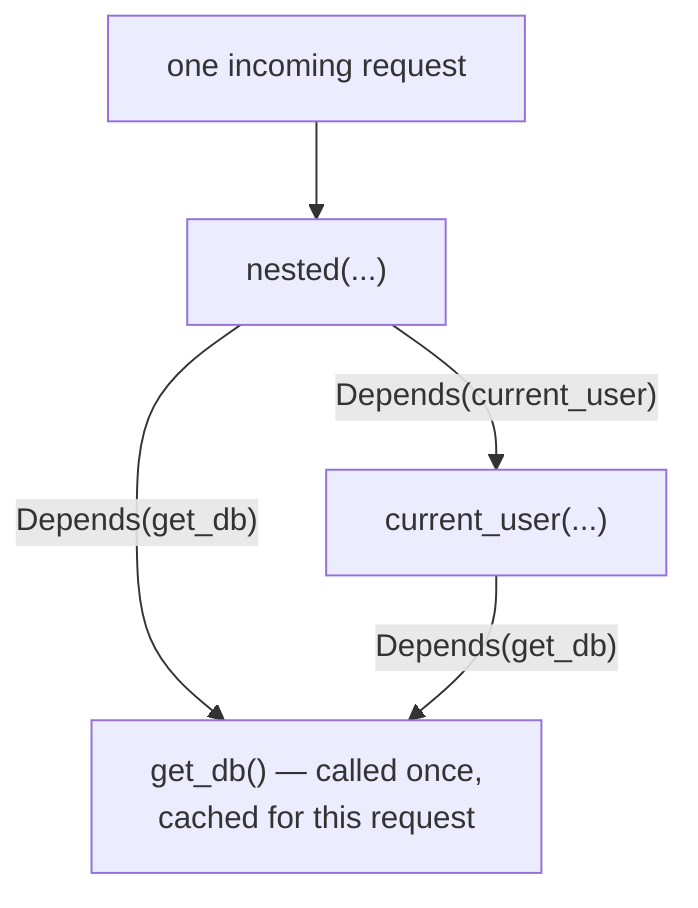
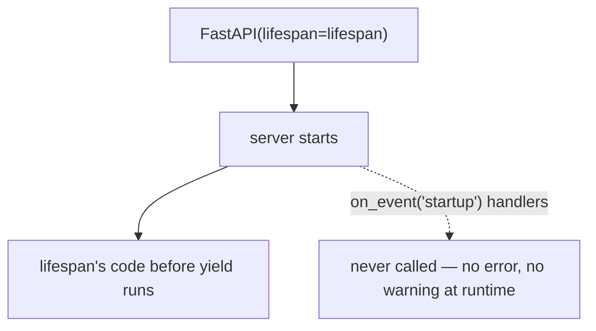

# ASGI request handling and dependency injection — a function signature as a request pipeline

*What `Depends()` actually is, why the same dependency called twice in one request usually runs once, and the single FastAPI upgrade that silently stopped running code millions of deployments still assume runs.*

**Level:** L4 · **Prerequisites:** [02 the special-method protocol and functions as first-class objects](02_the_special_method_protocol.md)
**Covers:** PY-14
**Sources:** Tragura, *Building Python Microservices with FastAPI*, ch.1–3, 9 (2022) · Alheraki, *Mastering FastAPI with Python* (2025) · FastAPI's own lifespan-events documentation

---

## 1. The problem this solves

An HTTP handler almost never needs only what arrived in the request. It typically needs a database connection, the identity of whoever is calling, and a validated, type-checked version of whatever the client sent — none of which is the handler's actual job to construct. Wiring all three by hand, at the top of every single route function, is the kind of repetition that invites the exact bug this pattern exists to prevent: one handler forgetting to check the caller's token, another opening a connection it never closes, a third trusting a request body's shape without validating it first.

This chapter's title names two things — request handling and dependency injection — because a real handler is never just "the function that runs when a route matches." It sits inside a pipeline: a request arrives over ASGI, passes through however many layers of middleware a project has configured, has its declared parameters validated and coerced, has its declared dependencies resolved (some shared with other dependencies in the same request, some deliberately not), runs, and then hands a response back out through the same middleware layers in reverse, possibly with background work still queued behind it. None of these pieces are FastAPI inventions in the sense of needing new language features — every one of them is built from ordinary Python already covered on this shelf: functions as values, context managers, dictionaries used as a per-request cache, decorators wrapping a call. What is genuinely new is the *composition*: a project-specific request pipeline assembled entirely from a function's own signature, without a separate configuration file or a base class hierarchy describing the wiring anywhere.

FastAPI's answer is a direct extension of a fact chapter 2 already establishes: a function is an ordinary object, and a parameter with a default value is not merely a fallback — it is anything the caller decides it should be. `Depends(get_db)` as a parameter default is not "use `get_db` if nothing else is supplied"; it is an instruction to the framework: *before calling this handler, call `get_db`, and pass whatever it returns as this argument*. A plain, ordinary parameter list becomes a request for the framework to assemble a small graph of values before the handler's body ever runs — dependency injection built entirely from function calls and default arguments, with no separate container or configuration file describing the wiring.

---

## 2. The mechanism, built up

### 2.1 A path or query parameter's declared type is not documentation — it is a runtime coercion and validation step

```python
from fastapi import FastAPI

app = FastAPI()

@app.get("/items/{item_id}")
def read_item(item_id: int, q: str | None = None):
    return {"item_id": item_id, "item_id_type": type(item_id).__name__, "q": q}
```

A request to `/items/42` arrives with `item_id` as the string `"42"` — every piece of an HTTP request line is text — and `read_item` receives a genuine Python `int`, not a string that merely looks numeric. FastAPI reads the annotation `item_id: int` and performs the conversion before the function body ever runs, exactly the same annotation chapter 9 already establishes is otherwise inert at runtime, here inspected deliberately by the framework rather than ignored. A request that cannot be coerced — `/items/not-a-number` — never reaches `read_item` at all:

```text
422 {"detail": [{"type": "int_parsing", "loc": ["path", "item_id"],
                 "msg": "Input should be a valid integer, unable to parse string as an integer",
                 "input": "not-a-number"}]}
```

The `422` status and the structured error body are both generated entirely by the framework's own validation layer, which is what makes this a genuinely different guarantee than "the handler will crash with a `ValueError` if given bad input" — the handler is never invoked at all, and the caller receives a specific, machine-readable explanation of exactly which field failed and why.

### 2.2 `Depends()` takes a callable and asks the framework to call it before the handler runs

```python
def get_account_repository():
    return {"connection": "open"}     # stands in for a real database session

def current_account(repo=Depends(get_account_repository)):
    return {"owner": "alexandro", "repo": repo}

@app.get("/account")
def read_account(account=Depends(current_account)):
    return account
```

`Depends(get_account_repository)` names the callable; FastAPI is the one that actually calls it, once the request has arrived, and binds whatever it returns to the parameter carrying the `Depends(...)` default. Nothing here is specific to plain functions — a class is equally usable, because chapter 1 already establishes that calling a class is calling its constructor, and `Depends(SomeClass)` is, mechanically, identical to `Depends(some_function)`: both are callables, and `Depends()` never inspects which kind of callable it received.

### 2.3 Within one request, calling the same dependency twice runs it once

```python
call_count = {"n": 0}

def get_db():
    call_count["n"] += 1
    return f"db-connection-{call_count['n']}"

@app.get("/dup")
def dup_dependency(a=Depends(get_db), b=Depends(get_db)):
    return {"a": a, "b": b, "same": a == b}
```

```text
{"a": "db-connection-1", "b": "db-connection-1", "same": true}
```

`get_db` is named twice in `dup_dependency`'s signature, and `call_count["n"]` only increments once per request. FastAPI builds a **dependency graph** for each incoming request, keyed by the dependency callable itself, and the first time a given callable is resolved during that request, the result is cached against it — every subsequent reference to the same callable, anywhere in that request's dependency tree, reuses the cached value rather than calling it again. This is the mechanism, not a special case: `a` and `b` are the identical string, not two equal-but-separately-constructed ones, which matters directly for anything meant to represent a single shared resource — one database session or one authenticated-user lookup, used consistently everywhere a single request needs it.

### 2.4 Nested dependencies share the same per-request cache their dependents draw from

```python
def current_user(db=Depends(get_db)):
    return f"user-using-{db}"

@app.get("/nested")
def nested(u=Depends(current_user), db=Depends(get_db)):
    return {"user": u, "db": db}
```

```text
{"user": "user-using-db-connection-2", "db": "db-connection-2"}
```

`current_user` itself depends on `get_db`, and `nested` depends on both `current_user` and `get_db` directly — three references to `get_db` across the whole chain, within this one request, and still only one real call. The cache section 2.3 describes is not scoped to a single handler's own parameter list; it spans the entire dependency graph built for one request, which is exactly what makes nested dependencies safe to compose freely: a validator depending on the current user, which itself depends on a database session, never risks opening a second, inconsistent connection just because it reaches the same underlying dependency through a different path in the graph.



### 2.5 `use_cache=False` opts a specific dependency reference out of the per-request cache

```python
@app.get("/nocache")
def nocache(a=Depends(get_db), b=Depends(get_db, use_cache=False)):
    return {"a": a, "b": b, "same": a == b}
```

```text
{"a": "db-1", "b": "db-2", "same": false}
```

`use_cache=False` is scoped to the individual `Depends(...)` call it appears on, not to the underlying callable globally — `a` still benefits from the default caching behavior, while `b` explicitly forces a fresh call. This exists specifically for the case section 4.1 turns into a failure mode: a dependency whose entire purpose is to produce something *new* on every reference — a request-scoped random token, a fresh timestamp — needs this flag, because the framework's default assumption is that calling the same thing twice in one request means the caller wants the same result both times.

### 2.6 A dependency's own required parameters are validated before its body ever runs — even before the endpoint's own logic decides anything

```python
from fastapi import Header, HTTPException, APIRouter

def verify_token(x_token: str = Header(...)):
    if x_token != "secret":
        raise HTTPException(status_code=401, detail="bad token")
    return x_token

router = APIRouter(prefix="/admin", dependencies=[Depends(verify_token)])

@router.get("/stats")
def stats():
    return {"ok": True}
```

Three requests against `/admin/stats` produce three different outcomes, and the distinction between the first two is easy to miss:

```text
no x-token header at all         -> 422  {"detail": [{"type": "missing", "loc": ["header", "x-token"], ...}]}
x-token: wrong                   -> 401  {"detail": "bad token"}
x-token: secret                  -> 200  {"ok": true}
```

A missing header never reaches `verify_token`'s own `if x_token != "secret"` check at all — `Header(...)` with no default declares `x_token` as a *required* parameter of the dependency itself, and FastAPI's parameter-validation layer (the same one section 2.1 already covers) rejects the request with `422` before the dependency function's body executes even once. Only a request that *passes* that structural validation — the header is present, just wrong — ever reaches the `401` the function's own logic raises. A handler author expecting every failure from `verify_token` to arrive as `401` will be surprised by the `422` for the missing-header case, and the fix is simply knowing the two failure sources are different layers: declared-parameter validation happens first, unconditionally, and only a dependency that receives everything it structurally requires ever gets to run its own logic at all.

### 2.7 `dependencies=[Depends(...)]` at the router or path-operation level runs a dependency purely for its side effect, with no parameter to receive its result

`router`'s own `dependencies=[Depends(verify_token)]` in section 2.6 is a different declaration site than every example before it — `verify_token` is never bound to a parameter anywhere in `stats()`'s own signature. This is deliberate: a dependency declared this way runs for every request the router handles, purely to validate, filter, or raise, with its return value discarded entirely. The same `dependencies=[...]` list is available directly on `@app.get(...)` and friends for a single path operation, which is the correct home for a validator that only one specific endpoint needs, while the router-level form is the correct home for a rule that should apply uniformly to every route under one prefix — an authentication check across an entire `/admin` section being the standard case.

### 2.8 Middleware wraps the entire request-response cycle, running code on both sides of the handler

```python
@app.middleware("http")
async def add_timing_header(request, call_next):
    log.append(f"before: {request.url.path}")
    response = await call_next(request)
    log.append(f"after: {request.url.path}")
    response.headers["X-Processed"] = "true"
    return response
```

```text
["before: /notify", "response being sent", "after: /notify", "background: email sent"]
```

`call_next(request)` is where the entire rest of the pipeline runs — every dependency, the handler itself, response construction — and the code before that call executes on the way in, while the code after it executes on the way out, with the actual `Response` object available to inspect or modify (adding a header, here) before it is finally returned. This is ASGI's own request-response model made directly visible: middleware is not a separate concept from the rest of this chapter, it is the same "run code around a call" idea section 2.6 already applies to a single dependency, scoped instead to the entire request.

### 2.9 A background task runs only after the response has already been handed back

The log trace above shows `"response being sent"` before `"background: email sent"` — a task registered via `BackgroundTasks.add_task(...)` inside a handler does not run during that handler's own execution, and does not delay the response at all. It runs afterward, once the response object has already been constructed and control has returned up through every layer of middleware. This is precisely why a background task is the right tool for genuinely fire-and-forget work — sending a notification email, writing an audit log entry — and the wrong tool for anything the caller needs confirmation of, because by the time a background task's own code runs, the response describing success has, in a real deployment, already been sent over the network; nothing that happens inside the task can change what the client was already told.

### 2.10 CORS middleware controls a response header a browser checks — it is not the server refusing a request

```python
from fastapi.middleware.cors import CORSMiddleware

app.add_middleware(
    CORSMiddleware,
    allow_origins=["https://trusted.example.com"],
    allow_methods=["GET"],
)
```

```text
preflight from https://trusted.example.com  -> 200, Access-Control-Allow-Origin: https://trusted.example.com
preflight from https://evil.example.com     -> 400, no Access-Control-Allow-Origin header
actual GET from https://evil.example.com    -> 200 {"ok": true}  — the server still answers it
```

The third line is the one worth pausing on. `CORSMiddleware` does not stop the server from processing a request from an origin that is not in `allow_origins` — the handler runs, and the data goes out over the wire, exactly as it would for any other request. What the middleware controls is a single response header, `Access-Control-Allow-Origin`, and the entire enforcement mechanism lives inside the **browser**, not the server: a browser's own JavaScript running on `https://evil.example.com` will receive the response and then refuse to let the calling script *read* it, because the response is missing permission for that specific origin. A non-browser client — `curl`, another server, this chapter's own test client — is never subject to that restriction at all, because there is no browser-side same-origin policy for it to enforce. CORS is a cooperative safety mechanism between a server and browsers that honor the standard, not an access-control layer the server itself enforces against arbitrary callers; section 4.4 covers what goes wrong when that distinction is missed.

```mermaid
sequenceDiagram
    participant Browser
    participant Server
    Browser->>Server: GET /data, Origin: https://evil.example.com
    Server-->>Browser: 200, body sent, no Access-Control-Allow-Origin
    Note over Browser: response bytes already arrived —<br/>the browser now refuses to let<br/>the page's own JavaScript read them
    Note over Server: had no idea any of this happened;<br/>it answered the request exactly as normal
```

The response genuinely leaves the server and genuinely arrives at the browser in full — CORS never prevents the bytes from being transmitted. What it prevents is the *page's own script* from being handed those bytes afterward, which is a browser-side capability with no equivalent restriction anywhere else a request might originate from.

### 2.11 Session middleware stores state in a signed cookie, round-tripped by the client on every subsequent request

```python
from starlette.middleware.sessions import SessionMiddleware

app.add_middleware(SessionMiddleware, secret_key="a-real-deployment-uses-a-real-secret")

@app.get("/set")
def set_session(request: Request):
    request.session["user"] = "alexandro"
    return {"set": True}

@app.get("/get")
def get_session(request: Request):
    return {"user": request.session.get("user")}
```

A request to `/set` stores `"alexandro"` under the key `"user"` in `request.session` — an ordinary dictionary-like object the middleware maintains — and the middleware serializes and cryptographically signs the entire session dictionary into a cookie attached to the response. The following request to `/get`, carrying that cookie back, has the middleware verify the signature and decode the dictionary before `get_session` ever runs, which is why `request.session.get("user")` on the second call returns `"alexandro"` with no database or server-side storage involved anywhere in this example. The `secret_key` is what makes the signature meaningful: it is what lets the server detect a cookie that has been tampered with client-side, and it is exactly why that key belongs in genuine deployment configuration, never a literal string checked into source control, since anyone who has the key can forge a session claiming to be any user at all.

### 2.12 `lifespan` replaced `on_event`, and setting one silently disables the other rather than raising an error

Every version of FastAPI before release 0.93 managed startup and shutdown work with two separate decorators:

```python
@app.on_event("startup")
def old_startup():
    ...
@app.on_event("shutdown")
def old_shutdown():
    ...
```

The current, and only actively supported, mechanism is a single async context manager passed directly to the `FastAPI()` constructor:

```python
from contextlib import asynccontextmanager

@asynccontextmanager
async def lifespan(app: FastAPI):
    print("startup")          # everything before yield: startup
    yield
    print("shutdown")         # everything after yield: shutdown

app = FastAPI(lifespan=lifespan)
```

`lifespan` is chapter 2's context-manager protocol applied to the whole application's process lifetime rather than one request: the code before `yield` runs once, when the server starts accepting connections, and the code after it runs once, as the server shuts down — a single, ordinary Python construct replacing two separately-named event hooks. `on_event` still exists, still emits a deprecation warning, and — the trap this node's currency correction exists specifically to name — **does nothing at all** the moment an application also sets `lifespan`:



An application migrated chapter by chapter from older documentation — a new `lifespan` added for one piece of startup logic, while an existing `@app.on_event("startup")` handler from an earlier version of the same codebase is left in place, believed to still be running — silently loses whatever that handler used to do, with nothing at request time or startup time indicating anything is wrong. Section 4.2 covers this failure directly; the fix at the mechanism level is simply that `lifespan` is not an addition to `on_event`, it is a replacement for it, and the two are never meant to coexist in one application.

---

## 3. Diagrams

The nested-dependency graph in section 2.4, the CORS browser-enforcement sequence in section 2.10, and the `lifespan`/`on_event` silent-override diagram in section 2.12 are integrated into the mechanism build-up above, as this format requires.

---

## 4. Failure modes

### 4.1 A dependency meant to produce a fresh value every time silently returns the same one twice, because caching is the default

```python
# Gist: accidental_shared_id.py
import itertools
counter = itertools.count(1)

def new_request_id():
    return next(counter)

@app.get("/report")
def report(header_id=Depends(new_request_id), footer_id=Depends(new_request_id)):
    return {"header_id": header_id, "footer_id": footer_id}
```

```text
{"header_id": 1, "footer_id": 1}
```

Both fields should plausibly be two distinct identifiers — a header ID and a footer ID sound like they belong to different things — and section 2.3's caching mechanism gives them the identical value instead, because `new_request_id` is one callable referenced twice, and FastAPI has no way to know this particular dependency was written to be called once per *reference* rather than once per *request*. Nothing raises an error; the response is well-formed and looks entirely plausible unless someone happens to notice the two numbers matching every single time. The fix is section 2.5's own escape hatch — `Depends(new_request_id, use_cache=False)` on every reference meant to produce an independent value — and the broader lesson is that a dependency's author has to decide, explicitly, whether it represents one shared resource per request (the default, and the right choice for a database session or a resolved user) or a value meant to vary per call site, because the framework's default assumption always favors the former.

### 4.2 An `on_event` handler stops running the moment `lifespan` is added, with no error at startup or at request time

```python
# Gist: silently_dead_on_event.py
from contextlib import asynccontextmanager
from fastapi import FastAPI

events = []

@asynccontextmanager
async def lifespan(app: FastAPI):
    events.append("lifespan startup")
    yield
    events.append("lifespan shutdown")

app = FastAPI(lifespan=lifespan)

@app.on_event("startup")
def old_startup():
    events.append("on_event startup")     # this line never runs

@app.get("/")
def root():
    return {"ok": True}
```

```text
['lifespan startup', 'lifespan shutdown']
```

`'on_event startup'` never appears. Section 2.12 already names the exact mechanism: once `lifespan` is supplied to the `FastAPI()` constructor, the framework's own startup sequence stops dispatching to any `on_event` handlers at all — not because they raise, not because they are skipped with a logged warning at request time, but because the code path that used to call them is simply not exercised anymore once the newer mechanism is in charge. The only signal anything changed is a deprecation warning printed once, at import time, easy to miss in a busy startup log and saying nothing about the handler being nonfunctional rather than merely old-fashioned. This is exactly the trap a codebase migrated incrementally falls into: `lifespan` gets added for one new piece of startup logic, an existing `on_event("startup")` handler from before the migration is left in place on the reasonable assumption that "it still works, it's just deprecated," and whatever that handler used to initialize — a cache warm-up, a connection pool, a background scheduler — silently stops happening. The fix is not a workaround; it is consolidating every `on_event` handler's logic into the single `lifespan` function, which is the only form FastAPI actually still executes.

### 4.3 A background task's exception is invisible to the client, because the response was already sent before the task ever raised

Section 2.9 already establishes the ordering: a background task registered inside a handler runs only after the response has been constructed and handed back up through the pipeline. In a real deployment, "handed back" means the response has genuinely been written to the client's socket by the time the task's own code starts running — which means an exception raised inside that task has no response left to attach itself to. The client that made the request already received `{"status": "accepted"}` with a `200`, in good faith, and has no way to learn — from that response, or from any later one, since there is no later response — that the work it was told was queued actually failed. The failure is real, and it is visible only in server-side logs, if the deployment's logging configuration happens to capture an exception raised outside the ordinary request-handling path at all; a background task pattern adopted without also auditing what happens to an exception raised inside one is adopting a failure mode that produces no client-visible signal whatsoever. The fix is architectural rather than a one-line change: anything a caller genuinely needs confirmation of — not merely "accepted for later processing" but "definitely happened" — does not belong in a background task at all; it belongs either in the handler's own synchronous path, or behind a separate, pollable status endpoint the client can check after the fact, precisely because a background task's success or failure is, by design, invisible to whoever triggered it.

### 4.4 Treating `CORSMiddleware`'s `allow_origins` as access control leaves the API fully reachable by anything that is not a browser

```python
# Gist: cors_is_not_auth.py
from fastapi.middleware.cors import CORSMiddleware

app.add_middleware(CORSMiddleware, allow_origins=["https://trusted.example.com"])

@app.get("/internal-stats")
def internal_stats():
    return {"revenue": 4_200_000}     # believed "protected" by the CORS policy above
```

```text
curl https://api.example.com/internal-stats
-> 200 {"revenue": 4200000}
```

`allow_origins` restricted to one trusted domain has no effect whatsoever on a request made with `curl`, a Python `requests` call, another backend service, or any tool that is not a web browser executing JavaScript on a page — section 2.10 already establishes why: the restriction is enforced entirely on the browser side, by browsers that choose to honor the CORS standard, and the server answers every request identically regardless of its `Origin` header, or the complete absence of one. A team that configures a narrow `allow_origins` list and concludes the endpoint is now "only accessible from our own frontend" has confused a browser-cooperation mechanism, designed to protect a logged-in user's browser from a malicious third-party page silently calling APIs on the user's behalf, with server-side authentication and authorization, which CORS was never designed to provide and does not provide. The fix is to treat CORS configuration as entirely orthogonal to access control: an endpoint that must not be publicly readable needs a real authentication dependency (chapter 18's subject on this shelf) regardless of how its `allow_origins` list is configured, and a permissive or even wide-open CORS policy on a properly authenticated endpoint is a much smaller problem than a narrow CORS policy mistaken for the whole security story.

---

## 5. Trade-offs

| Approach | Use when | Because | Real cost |
| --- | --- | --- | --- |
| **A plain function dependency** | The work is stateless — validation, a simple lookup, a transformation | Simplest possible form; no instantiation, easy to test in isolation | No natural place to hold configuration beyond what its own arguments carry |
| **A class dependency** | The dependency needs configuration fixed at construction time, or benefits from `__call__`'s state | `Depends(SomeClass(config))` binds configuration once, outside the request cycle | More ceremony than a function for anything that does not actually need the state |
| **Path-operation-level `dependencies=[...]`** | A validator or check belongs to exactly one endpoint | Scoped precisely; no risk of affecting unrelated routes | Has to be repeated on every endpoint that needs the same check |
| **Router-level `dependencies=[...]`** | The same check must apply uniformly across many related endpoints | Declared once, enforced everywhere under the prefix, impossible to forget on a new route added later | Coarser-grained — everything under the prefix pays the cost, whether or not a specific route actually needed it |
| **A background task** | The work is genuinely fire-and-forget, and the caller needs no confirmation of its outcome | Response returns immediately, without waiting on work irrelevant to the caller's own request | No delivery guarantee visible to the caller at all — failure is silent by construction |
| **Cookie-based sessions** | The state is small, and the same process can verify a signature on every request | No server-side session store to provision or scale | Every request pays the cost of transmitting and verifying the full session payload; a compromised `secret_key` forges any session |
| **A server-side session store (Redis, a database table)** | Session state is large, or must be revocable instantly (forced logout, a compromised token) | The cookie itself carries only an opaque ID; the real data — and the ability to delete it — lives server-side | A stateful dependency the deployment now has to run, monitor, and keep available |

### When not to reach for `Depends()` at all

A value used by exactly one handler, computed from nothing but that handler's own parameters, gains nothing from being extracted into a separate dependency function — it adds an indirection a reader has to follow to see logic that would have been just as clear inline. `Depends()` earns its place specifically once the same logic is shared across two or more handlers, or once a dependency graph's caching behavior (section 2.3) is doing real work — deduplicating a database connection across several nested dependencies in a single request, for instance — neither of which applies to a one-off computation local to a single endpoint.

### The case against putting genuinely important side effects in `lifespan` without also testing them

`lifespan` runs exactly once per process start and once per process stop, which makes it easy to write and never see fail during ordinary development — a local server restarted constantly during iteration exercises the startup path far more than any single production deployment ever will relative to its total uptime. The rejected alternative to testing `lifespan` logic directly is trusting that "it ran fine when I started the server just now" generalizes to "it will run fine in every deployment," which ignores that a `lifespan` function can depend on external state (a database being reachable, a config file being present) that behaves differently in a fresh production environment than on a developer's machine that has been running the same server for days.

---

## 6. Reference summary

**A parameter's declared type on a path or query parameter is a runtime coercion and validation instruction**, not documentation — an unparseable value never reaches the handler at all, and produces a structured `422` response instead. **`Depends(callable)` asks FastAPI to call that callable before the handler runs and bind its return value to the parameter carrying the default** — a plain function and a class are equally valid, because both are simply callables.

**Within one request, referencing the same dependency callable more than once resolves it only once**, cached against the callable itself across the entire dependency graph built for that request — including through nested dependencies that reach the same underlying callable by a different path. **`Depends(callable, use_cache=False)`** opts one specific reference out of that caching, which matters for any dependency deliberately meant to produce a new value on every call rather than one shared value per request.

**A dependency's own required parameters (`Header(...)`, `Query(...)`, and similar) are validated before that dependency's body ever executes** — a missing required header produces `422` from FastAPI's own validation layer, never reaching whatever `401`- or `403`-raising logic the dependency's function body contains for a *present but invalid* value. **`dependencies=[Depends(...)]`, declared at the path-operation or router level, runs a dependency purely for its side effects**, with no parameter anywhere receiving its return value.

**Middleware wraps the entire request-response cycle**: code before `call_next(request)` runs on the way in, code after it runs on the way out, with the actual response object available to inspect or modify before it returns — the same "run code around a call" shape as a single dependency, scoped to the whole request instead. **A background task runs only after the response has already been sent**, which means its success or failure is invisible to the caller by construction — the correct tool for genuinely fire-and-forget work, and the wrong one for anything a client needs confirmed.

**`lifespan`, a single async context manager passed to `FastAPI()`, is the only currently supported startup/shutdown mechanism.** **`@app.on_event("startup")`/`"shutdown"` are deprecated and, critically, silently do nothing once `lifespan` is also set** — no error, no runtime warning beyond one import-time deprecation notice — which makes an application migrated incrementally from `on_event` to `lifespan` a real risk of quietly losing whatever the old handlers used to do.

**CORS is enforced by the browser, not the server**: `CORSMiddleware`'s `allow_origins` controls only whether a response carries the `Access-Control-Allow-Origin` header a compliant browser checks before letting a page's own script read the response — the request still reaches the handler and the response still leaves the server in full, regardless of origin, for any caller that is not itself a browser honoring the standard. It is not a substitute for authentication, and a narrow `allow_origins` list provides no protection at all against a non-browser client. **Session middleware stores state in a signed, client-held cookie**, verified — not merely read — on every subsequent request via a `secret_key` that must never be a value checked into source control, since possessing it is sufficient to forge a session for any user.

---

← [Python knowledge graph](00_knowledge_graph.md) · [repo index](../README.md)
