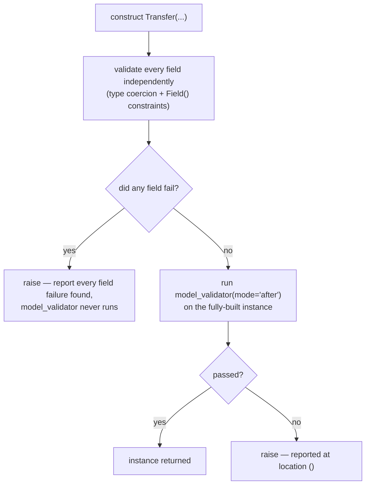
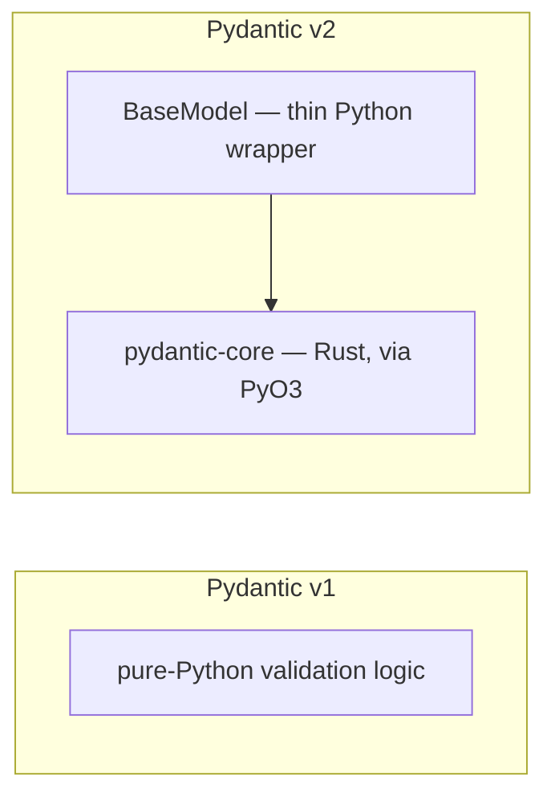

# Pydantic validation — schema as a type hint, and the rewrite that moved it into Rust

*What "lax mode" coercion actually promises, why a model validates only once by default, and the 2.0 rewrite that changed nearly every method name a 2022-era book teaches.*

**Level:** L4 · **Prerequisites:** [09 the gradual type system](09_the_gradual_type_system.md), [10 data classes and pattern matching](10_data_classes_and_pattern_matching.md)
**Covers:** PY-15
**Sources:** Alheraki, *Mastering FastAPI with Python* (2025) · Tragura, *Building Python Microservices with FastAPI* ch.1 (2022) — Pydantic v1 material, cited only as the migration source · Pydantic's own "Introducing Pydantic V2" announcement, pydantic.dev

---

## 1. The problem this solves

Chapter 10's `@dataclass` generates `__init__`, `__repr__`, and `__eq__` from a field list — a genuine convenience, and one that trusts its caller completely. `Account(owner="alexandro", balance=100.0)` accepts whatever it is given; nothing checks that `owner` is really a string or that `balance` is really a number, because a dataclass is built for code the same program already controls, where the caller and the constructor were written by the same team, in the same language, with the same assumptions.

Hand-written validation for that trust gap is a familiar, tedious shape: a chain of `isinstance` checks, a manually constructed error message naming which field was wrong, repeated with small variations across every endpoint that accepts a body of roughly the same shape. It is also easy to get subtly wrong in a way that only surfaces once a client sends exactly the malformed input nobody thought to test — a field present but the wrong type, a required field silently missing because a `.get()` call defaulted it to `None` instead of raising, a numeric field that happens to arrive as a string because a client's JSON serializer represents large integers differently. None of these are exotic; they are the ordinary texture of data arriving from outside a program's own control, and validating them by hand, correctly, for every field of every model, does not scale past a handful of endpoints before the validation code itself becomes as large and as bug-prone as the logic it exists to protect.

A request body arriving over HTTP shares none of the assumptions a dataclass is built for. It is JSON — text, decoded into Python's own dict/list/str/number/bool/`None` vocabulary — sent by a client that might be a careful frontend, a hostile script, or a well-meaning integration written against last year's version of the API. Trusting it the way a dataclass trusts its caller is not a convenience, it is a bug waiting to happen the first time a field is missing, a number arrives as the string `"42"` instead of an integer, or a client sends a field the server never expected. Pydantic is chapter 10's dataclass idea — a type-annotated class body generating real behavior — aimed specifically at this boundary: not internal code trusting internal code, but a schema that actively **coerces and validates** untrusted external data on the way in, and reports, precisely and all at once, everything wrong with it when it does not fit.

---

## 2. The mechanism, built up

### 2.1 A `BaseModel`'s type hints are read at class-definition time and enforced on every construction

```python
from pydantic import BaseModel

class Account(BaseModel):
    owner: str
    balance_cents: int

a = Account(owner="alexandro", balance_cents="500")
print(a)                    # owner='alexandro' balance_cents=500
print(type(a.balance_cents))  # <class 'int'>
```

`balance_cents="500"` — a string — is accepted, and `a.balance_cents` is a genuine `int`, `500`, not the string that was passed in. This is chapter 9's inert annotation put to active use a second way, alongside `@dataclass`: `BaseModel`'s metaclass inspects every annotated field at class-definition time and builds a validator for it, and constructing an instance runs every field through its validator before the object exists at all. The result is not merely "the type hints happen to match" the way an unchecked dataclass leaves them — every field is actively converted and checked, on every single construction, which is the entire mechanism the rest of this chapter elaborates.

### 2.2 Coercion follows one explicit rule: a single, unambiguous, lossless representation, or a validation error

`"500"` becoming `500` above is not blanket leniency — Pydantic's own documentation states the governing rule precisely: data is converted only when the input has "a SINGLE and INTUITIVE representation" in the target type, with no information lost; otherwise validation fails.

```python
class M(BaseModel):
    x: int

M(x="500")     # 500        — a numeric string has one obvious integer meaning
M(x=123)       # 123        — already the right type
```

```python
class Named(BaseModel):
    name: str

Named(name=123)
```

```text
1 validation error for Named
name
  Input should be a valid string [type=string_type, input_value=123, input_type=int]
```

This is the direct, structural contrast with chapter 10's `@dataclass`, worth stating precisely rather than only in passing: a dataclass's generated `__init__` performs a plain assignment for each field, with no type check involved anywhere — `Account(owner=42, balance_cents="not a number")` succeeds without complaint, because chapter 9 already establishes that an unwrapped annotation carries no runtime meaning at all, and `@dataclass` inspects an annotation only to decide whether a name becomes a field, never to validate what is assigned to it. A `BaseModel`'s `__init__` is generated to do the opposite: every field's annotation is compiled into an active check, which is the entire reason a Pydantic model is slower to construct than an equivalent dataclass and also the entire reason it is the correct choice at a boundary a dataclass was never built to guard.

`123` becoming `500` for an `int` field is safe and obvious; `123` becoming `"123"` for a `str` field is refused, in this default ("lax") mode, precisely because turning an integer into a string is not the kind of single, unambiguous conversion the rule permits — a design choice, not an inconsistency, and one worth internalizing rather than treating coercion as "Pydantic converts anything close enough." A separate, stricter mode exists for the case even numeric-string-to-int coercion is unwanted: **strict mode**, built directly into the validation core, accepts only the exact declared type and nothing else. It can be set for an entire model (`ConfigDict(strict=True)`) or, more often, for one specific field via `Field(strict=True)`:

```python
class Strict(BaseModel):
    amount: int = Field(strict=True)

Strict(amount="500")
```

```text
1 validation error for Strict
amount
  Input should be a valid integer [type=int_type, ...]
```

The identical `"500"` that section 2.1's lax-mode `Account` accepted and coerced is rejected outright here — not because `"500"` is somehow a worse input in the abstract, but because this specific field has opted out of the lax-mode rule that would otherwise have accepted it. Strict mode is a per-field or per-model decision, not a global one; a single model can mix strict and lax fields freely, accepting coercion where it is safe and refusing it precisely where a field's own semantics make even an "obvious" conversion the wrong thing to allow silently.

### 2.3 A custom validator runs after the built-in type coercion, as an additional check on an already-typed value

```python
from pydantic import field_validator

class Account(BaseModel):
    owner: str
    balance_cents: int

    @field_validator("balance_cents")
    @classmethod
    def balance_must_be_non_negative(cls, v):
        if v < 0:
            raise ValueError("balance_cents must not be negative")
        return v

Account(owner="x", balance_cents=-5)
```

```text
1 validation error for Account
balance_cents
  Value error, balance_cents must not be negative [type=value_error, input_value=-5, input_type=int]
```

`@field_validator("balance_cents")` runs specifically after Pydantic's own coercion has already turned the input into a real `int` — the function receives `-5` as an integer, never the raw input the constructor was originally called with, which means a validator never has to re-derive type coercion its own field's declared type already guarantees. This is the same layering chapter 15 already establishes for FastAPI's own parameter validation: a structural check (is this the right shape at all) happens first, unconditionally, and a value-level check (is this specific, correctly-typed value acceptable) happens only once the structural check has already passed.

### 2.4 `model_config` changes how a whole model validates, not just one field

```python
from pydantic import ConfigDict

class Strict(BaseModel):
    model_config = ConfigDict(extra="forbid")
    name: str
    age: int

Strict(name="a", age=5, unexpected="field")
```

```text
1 validation error for Strict
unexpected
  Extra inputs are not permitted [type=extra_forbidden, input_value='field', input_type=str]
```

`extra="forbid"` is one of several model-wide settings `ConfigDict` exposes — others control whether assignment after construction re-validates (section 4.2), whether string fields are stripped of whitespace automatically, and more — each affecting every field in the model uniformly rather than one field's individual behavior. Without it, the default is to silently drop any field the schema does not declare, which section 4.1 turns into a concrete failure mode.

### 2.5 Every field is validated independently, and every failure is collected and reported together

```python
class Multi(BaseModel):
    name: str
    age: int
    email: str

Multi(name=123, age="not-a-number", email=None)
```

```text
3 validation errors for Multi
name
  Input should be a valid string [type=string_type, ...]
age
  Input should be a valid integer, unable to parse string as an integer [type=int_parsing, ...]
email
  Input should be a valid string [type=string_type, ...]
```

All three fields are wrong, and all three failures are reported in one exception, each with its own precise location and reason — not merely the first field Pydantic happened to check. This matters directly for the API-boundary use case section 1 motivates: a client that submitted a form with four mistakes learns about all four in one response, rather than fixing one field, resubmitting, and discovering the next failure only on the second round trip. A nested model's errors report their full path, not merely the outer field's name — a missing field inside a nested `Address` model reports as `("address", "country")`, tracing precisely which value, at which depth, was the problem.

### 2.6 `model_dump()` and `model_dump_json()` are the two directions of serialization, not the validation constructor run backward

```python
class Account(BaseModel):
    owner: str
    balance_cents: int

a = Account(owner="alexandro", balance_cents=500)
print(a.model_dump())        # {'owner': 'alexandro', 'balance_cents': 500}
print(a.model_dump_json())    # '{"owner":"alexandro","balance_cents":500}'
```

`model_dump()` produces a plain Python `dict`; `model_dump_json()` produces a JSON string directly, without an intermediate `dict` and a separate `json.dumps` call. Neither one re-runs any validator — validation happens exclusively at construction (and, if configured, at assignment, per section 4.2), and serialization is a pure, one-directional read of whatever values the model already holds.

### 2.7 `Field()` constraints and cross-field `model_validator`s run at two different stages, and a field failure suppresses the later stage entirely

`Field()` attaches constraints directly to a single field's declaration — a numeric range, a string length — checked as part of that field's own validation, alongside the type coercion section 2.2 already covers:

```python
from pydantic import Field, model_validator

class Transfer(BaseModel):
    amount: int = Field(gt=0, le=1_000_000)
    source: str
    destination: str

    @model_validator(mode="after")
    def source_and_destination_must_differ(self):
        if self.source == self.destination:
            raise ValueError("source and destination must differ")
        return self
```

A `model_validator(mode="after")`, unlike a `field_validator`, receives the fully-constructed model rather than one field's value, which is exactly what a check spanning several fields — here, that two different fields are not equal — actually needs. The two run in a fixed order with a real consequence for what a caller sees:

```python
Transfer(amount=-5, source="A", destination="A")
```

```text
1 validation error for Transfer
amount
  Input should be greater than 0 [type=greater_than, ...]
```

```python
Transfer(amount=100, source="A", destination="A")
```

```text
1 validation error for Transfer
  Value error, source and destination must differ [type=value_error, loc=()]
```



The first call has two things wrong with it — a negative `amount` and identical `source`/`destination` — and reports only the `amount` failure. The `mode="after"` model validator never runs at all, because it only executes once every individual field has already passed its own validation; a model with any failing field short-circuits straight to reporting that field-level failure, never reaching a cross-field check that might have found something else. The second call, with a valid `amount`, does reach the model validator, and its error is reported at location `()` — the whole model, rather than any single field, because the problem is a relationship between two fields, not either one individually. A caller fixing errors one round trip at a time should not assume a single validation response is the complete list of everything wrong; it is, precisely, the complete list of everything wrong *that field-level validation was able to see* on that attempt.

### 2.8 A nested model's own validation is part of its parent's validation, automatically

```python
class Address(BaseModel):
    city: str
    country: str

class Account(BaseModel):
    owner: str
    address: Address

Account(owner="alexandro", address={"city": "Port-au-Prince", "country": "Haiti"})
```

A plain `dict` supplied for the `address` field is itself validated and converted into a real `Address` instance as part of constructing `Account` — nothing about nesting requires validating the inner object separately beforehand. This composes exactly the way chapter 10's dataclasses compose structurally, with the addition that every level of nesting is actively checked, not merely typed.

### 2.9 Pydantic v2 replaced its entire validation core with a Rust extension, and reports a large, specifically-attributed speedup over v1

Pydantic 2.0, released June 2023, is a breaking rewrite rather than an incremental release: validation logic moved out of pure Python and into **pydantic-core**, written in Rust using the PyO3 bindings library, with the Python-level `BaseModel` becoming a thin wrapper around it. Pydantic's own "Introducing Pydantic V2" announcement states the resulting performance difference directly: "pydantic V2 is between 4x and 50x faster than pydantic V1.9.1," and, as a representative single figure, "pydantic V2 is about 17x faster than V1 when validating a model containing a range of common fields."



The API surface changed alongside the internals. `@validator` became `@field_validator`; `.dict()` and `.json()` became `.model_dump()` and `.model_dump_json()`; the lax/strict distinction section 2.2 already covers was formalized as an explicit, first-class mode built into the Rust core rather than a set of ad hoc per-type rules. A 2022-era book teaching bare `@validator` and `.dict()` — Tragura's, among this shelf's own sources — is teaching Pydantic v1's surface specifically, and every FastAPI project built on a current release has pinned Pydantic v2 as its default dependency since FastAPI 0.100; code written against that older surface does not merely run slower against a current install, in several cases it does not run as originally written at all.

### 2.10 The v1 surface still runs under v2, as an explicitly time-limited deprecation rather than a silent no-op

```python
from pydantic import validator

class OldStyle(BaseModel):
    balance: int
    @validator("balance")
    def check_balance(cls, v):
        if v < 0:
            raise ValueError("negative")
        return v

OldStyle(balance=100)
```

```text
PydanticDeprecatedSince20: Pydantic V1 style `@validator` validators are deprecated.
You should migrate to Pydantic V2 style `@field_validator` validators...
Deprecated in Pydantic V2.0 to be removed in V3.0.
```

`@validator` still works, and so does `.dict()` — both emit an explicit, named `PydanticDeprecatedSince20` warning, stating plainly which version deprecated them and which version will remove them. This is worth contrasting directly with chapter 15's own currency correction: FastAPI's `on_event` handlers, once `lifespan` is also set, stop running with no error and no runtime signal beyond one import-time notice about the decorator itself being deprecated — nothing tells a reader the handler is now dead code. Pydantic's v1 shims, by contrast, keep working exactly as before while warning loudly on every single use, which is the friendlier of the two migration stories on this shelf, and a useful pair to hold side by side: two frameworks, two different philosophies for retiring an old API, one silent and one not.

### 2.11 Validation belongs at the boundary where untrusted data first enters typed code, not scattered through business logic afterward

FastAPI's own request handling, chapter 15's subject, is what makes this concrete: a `Depends()`-injected parameter typed as a Pydantic model is validated by the framework before the handler body runs, exactly as a plain `int` path parameter is coerced before the handler sees it. By the time application logic executes, the data is no longer merely "probably shaped correctly" — it has been checked, once, at the earliest possible point, and every line of code downstream can treat a validated model's fields as trustworthy without re-checking them. This is the direct payoff of doing validation at the boundary rather than sprinkling `if not isinstance(...)` checks through business logic: the checking happens exactly once, in exactly one place, and the rest of the program is written as though the data was always correct — because, past that one boundary, it has already been proven to be.

---

## 3. Diagrams

The field-versus-model validator staging diagram in section 2.7 and the v1-to-v2 architecture diagram in section 2.9 are integrated into the mechanism build-up above, as this format requires.

---

## 4. Failure modes

### 4.1 An unexpected field is silently dropped rather than rejected, unless `extra="forbid"` is set explicitly

```python
# Gist: silently_dropped_field.py
class Account(BaseModel):
    owner: str
    balance_cents: int

a = Account(owner="alexandro", balance_cents=500, currency="HTG")
print(a)
print(a.model_dump())
```

```text
owner='alexandro' balance_cents=500
{'owner': 'alexandro', 'balance_cents': 500}
```

`currency="HTG"` vanishes without any error, warning, or trace anywhere in the constructed object — Pydantic's default `extra` behavior is to ignore fields the schema does not declare, which is a defensible default for tolerating additive API changes from an upstream service, and a dangerous one for a schema meant to catch a client sending the wrong shape of data entirely. A client that misspells a field name — `ballance_cents` instead of `balance_cents` — receives no error at all under this default: the misspelled field is silently discarded, `balance_cents` is silently missing (or falls back to a default, if one exists), and the resulting model looks completely valid while representing data the client never actually intended to send. The fix is `model_config = ConfigDict(extra="forbid")` on any model meant to reject data it does not fully recognize, which is nearly every model sitting directly at a request boundary — permissive-by-default is the wrong default specifically for the use case this chapter opened with.

### 4.2 Assigning to a field after construction does not re-validate it, unless `validate_assignment=True` is set

```python
# Gist: unvalidated_assignment.py
class Account(BaseModel):
    balance_cents: int

a = Account(balance_cents=500)
a.balance_cents = "not a number at all"
print(a.balance_cents, type(a.balance_cents))
```

```text
not a number at all <class 'str'>
```

Construction validated `balance_cents` correctly; the assignment afterward did not, because Pydantic's validation, by default, runs only at `__init__` time — `model_config = ConfigDict(validate_assignment=True)` is required to make every subsequent assignment pass back through the same field validators construction used. This is a genuine and common misconception: a `BaseModel` looks, and is documented, as a *validated* type, which reads naturally as "this object's fields are always valid," when the accurate claim is narrower — "this object's fields were valid the moment it was built." Code that constructs a model once, validates cleanly, and then mutates a field later based on some other computation can silently reintroduce exactly the kind of invalid state the model was built to prevent, with nothing about the assignment itself signaling that anything went wrong. The fix, for any model whose fields might be reassigned after construction, is `validate_assignment=True`; for a model that should never be mutated at all once built, `model_config = ConfigDict(frozen=True)` is the stronger, more explicit guarantee, refusing the assignment outright rather than merely re-checking it.

### 4.3 A v1-style `@validator` continues to run correctly under v2, which hides how much of a rewrite actually happened underneath it

A team that upgrades a dependency pin from Pydantic v1 to v2 and runs its existing test suite will very often see every test pass — section 2.10 already shows why: the v1 `@validator` decorator, `.dict()`, and `.json()` all continue to function exactly as before, under a deprecation warning easy to filter out of test output entirely. This creates a specific, quiet risk: the *validation logic* keeps working, while the *performance characteristics* the rewrite exists to deliver are only realized by code actually written against the v2-native `@field_validator`/`model_validator` surface, and a codebase that stayed on the deprecated v1 shims captures none of the 4x-to-50x improvement section 2.9's own source reports, despite genuinely running on Pydantic 2.0's Rust core underneath. The tests passing is not evidence the migration is complete; it is evidence only that the compatibility shim is doing its job, which is precisely what a shim is for. The fix is treating "tests still pass after the version bump" and "the codebase has actually migrated to v2 idioms" as two separate claims, verified separately — the first by running the suite, the second by an explicit audit (or the `ast`-based tooling chapter 12 already covers) for every remaining `@validator`, `.dict()`, and `.json()` call still in the codebase.

### 4.4 A single-response validation error is not evidence that fixing the reported field is the only fix needed

```python
# Gist: incomplete_error_picture.py
class Transfer(BaseModel):
    amount: int = Field(gt=0, le=1_000_000)
    source: str
    destination: str

    @model_validator(mode="after")
    def source_and_destination_must_differ(self):
        if self.source == self.destination:
            raise ValueError("source and destination must differ")
        return self

Transfer(amount=-5, source="A", destination="A")
```

```text
1 validation error for Transfer
amount
  Input should be greater than 0 [type=greater_than, ...]
```

Section 2.7 already predicts this exactly: this input has two real problems — a negative amount and an identical source and destination — and the response names only one of them, because the `mode="after"` model validator that would catch the second never runs while any field-level check has already failed. A client (or a developer debugging against the API directly) that fixes `amount` and resubmits, expecting a clean response, instead receives a *second*, previously invisible error about `source`/`destination`, which reads as though the API is inconsistent or the second bug was somehow introduced by the first fix — neither of which is true; the second problem was present from the very first request, simply unreported because the validation pipeline never reached the stage that would have found it. This is not a bug in Pydantic; it is a direct, documented consequence of a validation model where cross-field checks assume every individual field is already well-formed before they run at all, and it is worth stating as a known property of the tool rather than something to design around per-model: an API returning a single validation error has told a caller everything it currently knows, not everything that is currently wrong.

---

## 5. Trade-offs

| Approach | Use when | Because | Real cost |
| --- | --- | --- | --- |
| **`@dataclass` (chapter 10)** | The data is already trusted — internal code passing values to other internal code | No validation overhead; the field list alone documents the shape | Accepts anything of any type at all; offers no protection at a real trust boundary |
| **Pydantic `BaseModel`, lax mode (default)** | Validating and coercing external input — a request body, a config file, an environment variable | Forgiving of harmless type mismatches (a numeric string for an int field) while still catching real shape errors | Coercion rules, while principled, are a real thing to learn — "why did this convert and that didn't" is a legitimate question with a specific, documented answer |
| **Pydantic `BaseModel`, strict mode** | The exact type must be enforced with zero coercion, no exceptions | Removes any ambiguity about what "close enough" means | Rejects perfectly reasonable, harmless inputs (`"42"` for an `int` field) that lax mode would have accepted correctly |
| **`extra="forbid"`** | The schema is the complete, authoritative contract for what a client may send | Catches a misspelled or unexpected field immediately, as a validation error | Breaks on any additive, backward-compatible change from a client that starts sending one more field than the schema currently declares |
| **`validate_assignment=True` / `frozen=True`** | The model's fields must remain valid (or immutable) for its entire lifetime, not merely at construction | Closes the exact gap section 4.2 describes | Real, ongoing revalidation cost on every assignment, or the inability to mutate the object at all |

### When a dataclass is still the right choice over a Pydantic model

Pydantic's validation is not free — every field, on every construction, is genuinely checked, which is the entire value proposition and also a real cost paid on every single instantiation. Internal data structures passed between functions the same codebase controls, never touched by anything outside a trust boundary, gain nothing from that cost and are exactly chapter 10's `@dataclass` case: the shape is documented, the constructor is cheap, and there is no untrusted input anywhere in the picture for validation to be protecting against. Reaching for a Pydantic model out of habit, for data that was never going to be wrong in the first place, pays a real and unnecessary cost for a guarantee nothing in the program actually needed.

### The case against treating every model as if it validated continuously

Section 4.2 already demonstrates the mechanism; the trade-off worth naming explicitly is what a team gives up by relying on the default. A model that is only ever constructed once and read thereafter loses nothing from the default — validate-at-construction is exactly the right cost for that usage. A model held in memory and mutated repeatedly over its lifetime — accumulating state across a long-running background job, for instance — silently drifts away from its own schema's guarantees the moment `validate_assignment` is left at its default `False`, and the rejected alternative to catching this with a design review is discovering it in production, when a field holds a value no code path ever intended it to hold. The fix costs a real, measurable amount of revalidation overhead on every assignment; the omission costs a class of bug that is difficult to trace back to its origin, because the object *looked* validated at the point someone last checked it directly.

### The case against relying on lax-mode coercion at a security-sensitive boundary

Lax mode's coercion rule is principled, and "principled" is not the same as "the coercion is always what the receiving code actually wants." A field meant to hold a role name or a permission level, typed as `str`, will happily accept and coerce numeric-looking input in ways that might not be what an authorization check downstream expects, precisely because coercion here is a type-level decision made once, at the schema, with no visibility into what a specific field's value is later used for. The rejected alternative to trusting lax mode uniformly is strict mode, or an explicit custom validator, on any field whose value feeds directly into an authorization or access-control decision — the small inconvenience of rejecting a technically-coercible value is worth it exactly where a wrong coercion has security consequences rather than merely cosmetic ones.

The same reasoning extends past strings and role names to anything a downstream system will treat as an identifier rather than a quantity — an account number, an order ID — where lax mode's numeric-string-to-int coercion can silently collapse a distinction the application actually cared about. An account number that happens to look numeric (`"00042"`) becoming the integer `42` loses the leading zeros permanently, and a schema that declared the field as `int` for convenience, rather than because the value is genuinely meant to be arithmetic, has quietly discarded information no later step in the pipeline can recover. The general principle worth carrying forward is that a field's declared type should reflect what the value actually *is* — a genuine quantity, versus a string that merely happens to look numeric — rather than being chosen for whichever type coercion is most permissive.

---

## 6. Reference summary

**`BaseModel` reads type hints at class-definition time and validates every field on every construction** — chapter 9's otherwise-inert annotations, put to active use a second way alongside chapter 10's `@dataclass`, this time coercing and checking rather than merely documenting.

**Coercion follows one explicit rule: convert only when the input has a single, unambiguous, lossless representation in the target type** — a numeric string converts cleanly to `int`; an `int` does not convert to `str`, because that direction has no single obvious meaning. **Strict mode**, built into `pydantic-core` directly, accepts only the exact declared type with no coercion at all.

**A `@field_validator` runs after type coercion has already produced a correctly-typed value** — it checks a value's acceptability, never its shape, which coercion has already resolved. **`model_config` (via `ConfigDict`) governs whole-model behavior**: `extra="forbid"` rejects undeclared fields instead of silently dropping them (the default); `validate_assignment=True` re-validates on every later assignment, not merely at construction; `frozen=True` refuses assignment entirely.

**Every field validates independently, and every failure is collected and reported together**, with a precise location — including the full path through nested models — rather than stopping at the first error found. **`model_dump()`/`model_dump_json()` serialize a model's current state and never re-run validation**, which happens exclusively at construction (and, if configured, at assignment).

**Pydantic 2.0 replaced its validation core with `pydantic-core`, written in Rust via PyO3**, reported by Pydantic's own announcement as 4x to 50x faster than v1, roughly 17x for a model with a typical mix of fields. **`@validator` became `@field_validator`; `.dict()`/`.json()` became `.model_dump()`/`.model_dump_json()`.** The v1 forms still run under v2, each emitting an explicit `PydanticDeprecatedSince20` warning naming its planned removal in v3 — a codebase whose tests still pass after upgrading to v2 has not necessarily adopted v2's idioms, only exercised its backward-compatibility shims, which capture none of the reported performance improvement.

**`Field()` attaches constraints to a single field, checked alongside its type coercion; `model_validator(mode="after")` checks relationships across several fields, and runs only once every field has already individually passed.** A model with any failing field reports that failure and never reaches its cross-field checks — a single validation response is a complete account of everything currently known to be wrong, not a guarantee that nothing else is wrong.

**Validation belongs at the boundary where untrusted data first becomes typed data** — checked once, as early as possible (FastAPI's own request handling does this automatically for a `Depends()`-typed parameter), so that every line of code downstream can treat a validated model's fields as already trustworthy rather than re-checking them throughout business logic.

---

← [Python knowledge graph](00_knowledge_graph.md) · [repo index](../README.md)
