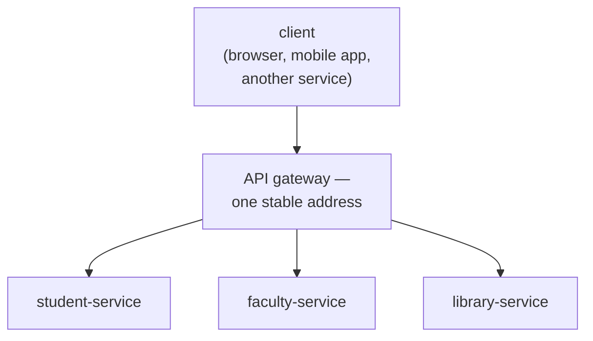
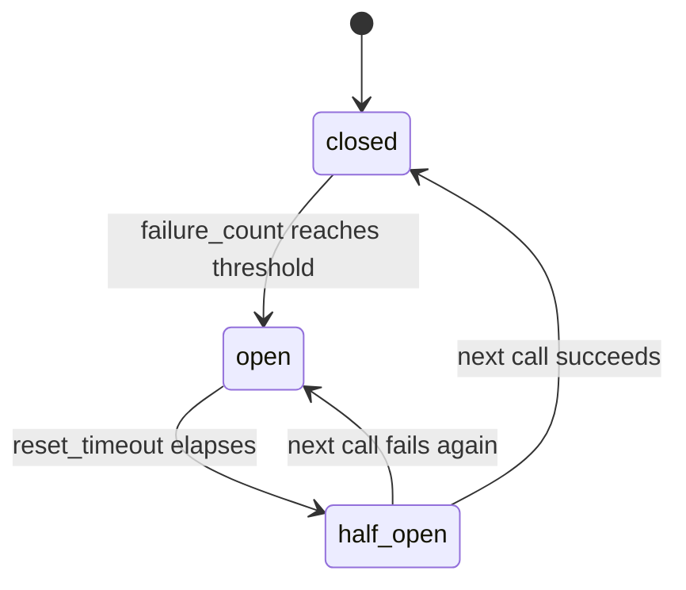
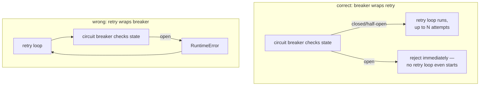

# Microservice decomposition — sub-applications, gateways, and calls that can fail in ways a function call never does

*What `app.mount()` actually composes, why a retry loop and a circuit breaker solve different halves of the same problem, and why the order you nest them in is not a matter of style.*

**Level:** L4 · **Prerequisites:** [15 ASGI request handling and dependency injection](15_asgi_request_handling_and_dependency_injection.md)
**Covers:** PY-18
**Sources:** Tragura, *Building Python Microservices with FastAPI*, ch.4, 11 (2022) · Fowler, *Python Concurrency with asyncio*, ch.10 (2022)

---

## 1. The problem this solves

A single FastAPI application eventually grows past what one deployable, one team, or one release cadence can comfortably own — a student-records module, a faculty module, and a library module inside one university system, each with its own pace of change and its own reasons to scale independently. Splitting them into separate services is the obvious next step, and it introduces a problem a single process never had: a call from one module to another used to be an ordinary function call, resolved instantly, failing only if the code itself had a bug. The same call, once the two modules are separate services talking over a network, can now fail in ways a function call structurally cannot — the network can be slow, the other service can be temporarily overloaded, a single request can hang indefinitely, and the caller has no way to know, from the call site alone, which of these happened or whether trying again is even a good idea.

None of the tools this chapter builds are exotic — a retry loop is an ordinary `for` loop with a `try`/`except`; a circuit breaker is a small stateful object; a gateway is one more ASGI application making outgoing calls of its own. What is genuinely new is the discipline of assuming, by default, that any call crossing a network boundary can fail partially, slowly, or ambiguously, in ways a call staying inside one process's memory space never can — and building every one of those calls to survive that assumption rather than treating it as an edge case to handle later, after the first outage makes it impossible to ignore.

This chapter is about the two, related shapes that problem takes. The first is architectural: once a system is genuinely several services rather than one, something has to decide how a client — a browser, a mobile app, another service — finds and reaches the right one, without every caller needing to know the internal topology of the whole system. The second is defensive: every synchronous call across that topology needs to survive the network being imperfect, which chapter 15's own request-handling material never had to address, because nothing inside a single FastAPI process ever needed to retry itself.

---

## 2. The mechanism, built up

### 2.1 `app.mount()` composes independent ASGI applications under one process, before any network is involved at all

```python
from fastapi import FastAPI

student_app = FastAPI()

@student_app.get("/list")
def list_students():
    return {"students": ["a", "b"]}

main_app = FastAPI()

@main_app.get("/")
def root():
    return {"service": "gateway"}

main_app.mount("/student", student_app)
```

```text
GET /                  -> {"service": "gateway"}
GET /student/list       -> {"students": ["a", "b"]}
```

`student_app` is a genuinely independent `FastAPI` instance — its own router, its own middleware, its own exception handlers — and `main_app.mount("/student", student_app)` does not copy any of that into `main_app`; it delegates every request under `/student` to `student_app`'s own, completely separate ASGI application, entirely within the same Python process. This is the gentlest possible step toward decomposition: the two applications are already structurally independent, testable and runnable on their own (`uvicorn main:student_app` works with no change), while still deploying as one process and requiring no network call at all between them. It is a real, useful intermediate step — a codebase can be organized this way for a long time before any of it needs to become a genuinely separate, independently-deployed service.

### 2.2 An API gateway is one address a client trusts, hiding however many real services actually sit behind it

The moment `student_app`, `faculty_app`, and `library_app` become three separately deployed services rather than three mounted sub-applications, a client needs one thing it did not need before: a single, stable address to call, regardless of which of the three services a given request actually needs. An **API gateway** is exactly that address — a service whose entire job is routing an incoming request to the correct backend service and returning its response, so that no client ever needs to know the real network location of `student_app` versus `faculty_app` directly, or needs to change anything if one of them moves.

```python
GATEWAY_ROUTES = {1: "http://student-service:8001", 2: "http://faculty-service:8002"}

@app.get("/portal/{portal_id}/{path:path}")
async def gateway(portal_id: int, path: str, request: Request):
    base_url = GATEWAY_ROUTES.get(portal_id)
    if base_url is None:
        raise HTTPException(status_code=404, detail="unknown portal")
    async with httpx.AsyncClient() as client:
        upstream = await client.request(request.method, f"{base_url}/{path}")
    return Response(content=upstream.content, status_code=upstream.status_code)
```

This is the same shape chapter 15's own middleware already covers — code that intercepts a request, does something with it, and returns a response — applied at the boundary between a client and an entire system of services rather than between a client and one endpoint. A gateway is also where cross-cutting concerns that would otherwise be duplicated across every backend service naturally belong: authentication (chapter 18's subject) checked once, at the gateway, rather than reimplemented identically in every service behind it, is a common and genuinely useful consolidation this pattern buys.



### 2.3 A backend-for-frontend is a gateway shaped around one specific kind of client, not a single generic front door for all of them

A single, generic gateway assumes every client wants the same shape of response, which is rarely true once a system serves a mobile app, a browser-based dashboard, and another backend service all at once — a mobile client typically wants a smaller, aggregated payload to minimize requests over a slow connection; an internal service-to-service caller typically wants the full, unfiltered data. A **backend-for-frontend (BFF)** is a gateway deliberately narrowed to one specific client's needs — a `mobile-bff` aggregating and trimming several backend calls into one lean response, separate from a `web-bff` that might return a richer payload for a browser dashboard already prepared to render more — rather than one generic gateway trying to serve every client's shape from a single, compromise endpoint.

### 2.4 `httpx` is what makes a service-to-service call — and its failure modes — visible in application code

```python
import httpx

try:
    response = httpx.get("http://unreachable-service:9999/", timeout=0.5)
except httpx.ConnectTimeout:
    print("the network call itself failed before a response ever arrived")
```

```text
the network call itself failed before a response ever arrived
```

`httpx` is the modern, async-capable HTTP client this shelf's material consistently reaches for over the older `requests` library specifically because chapter 15's own asynchronous handlers need an HTTP client that can genuinely `await` a network call rather than blocking the entire event loop while it waits. `ConnectTimeout` here is the first, sharpest reminder that a service call is not a function call: `timeout=0.5` is an explicit, deliberate decision about how long to wait before giving up, a parameter a plain function call never needs because a function call cannot simply hang. Every synchronous inter-service call needs this same deliberate timeout decision, because the alternative — no timeout at all — means one slow or hung downstream service can stall every request that happens to depend on it, indefinitely.

`httpx.AsyncClient()`, like chapter 17's `AsyncSession`, is meant to be reused across many requests rather than constructed fresh for every single call: it holds a connection pool internally, exactly the mechanism chapter 17 already covers for a database engine, and creating a brand-new client per outgoing call discards that pool's entire benefit — every call pays a fresh TCP and, for HTTPS, TLS handshake instead of reusing an already-open connection. The idiomatic pattern in a FastAPI service that regularly calls another service is a single, long-lived `AsyncClient` constructed once at application startup — chapter 15's own `lifespan` context manager is the natural place — and shared across every request through the same `Depends()` mechanism chapter 15 already establishes for a database session.

### 2.5 A retry with exponential backoff turns one transient failure into a problem the caller doesn't have to see

```python
import time

def call_with_retry(func, max_attempts=3, base_delay=0.01):
    for attempt in range(1, max_attempts + 1):
        try:
            return func()
        except ConnectionError:
            if attempt == max_attempts:
                raise
            time.sleep(base_delay * (2 ** (attempt - 1)))
```

```text
attempt 1 failed, retrying in 0.010s
attempt 2 failed, retrying in 0.020s
result: success, total calls: 3
```

A downstream service that is momentarily overloaded — not dead, just briefly unable to keep up — often succeeds on a second or third attempt, and the delay doubling on each retry (`base_delay * 2**(attempt-1)`) exists specifically so that a retrying client backs off rather than adding to the load on a service already struggling: retrying instantly, in a tight loop, is exactly the wrong response to a service that is failing *because* it is overloaded, since it adds more requests at precisely the moment fewer would help it recover. This is the correct tool for a genuinely transient failure and, as section 4.1 covers, the wrong one applied blindly to every kind of failure a call can produce.

### 2.6 A circuit breaker stops calling a service that has already proven it is failing, rather than retrying it forever

```python
class CircuitBreaker:
    def __init__(self, failure_threshold=3, reset_timeout=5):
        self.failure_threshold, self.reset_timeout = failure_threshold, reset_timeout
        self.failure_count, self.state, self.opened_at = 0, "closed", None

    def call(self, func, *args, **kwargs):
        if self.state == "open":
            if time.monotonic() - self.opened_at >= self.reset_timeout:
                self.state = "half-open"
            else:
                raise RuntimeError("circuit open — call rejected without attempting it")
        try:
            result = func(*args, **kwargs)
        except Exception:
            self.failure_count += 1
            if self.failure_count >= self.failure_threshold:
                self.state, self.opened_at = "open", time.monotonic()
            raise
        else:
            self.failure_count, self.state = 0, "closed"
            return result
```

```text
attempt 0: real call made, failed, state=closed
attempt 1: real call made, failed, state=closed
attempt 2: real call made, failed, state=open
attempt 3: circuit open — call rejected without attempting it, state=open
attempt 4: circuit open — call rejected without attempting it, state=open
```



After the third failure, every subsequent call is rejected **immediately**, without ever attempting the real, still-failing operation — the fourth and fifth calls above never touch `flaky_call` at all. This is the structural difference from a retry: a retry assumes the next attempt might succeed; a circuit breaker, once it has seen enough consecutive failures, assumes the opposite, and stops trying entirely for a cooldown period (`reset_timeout`), protecting both the caller (which stops wasting time on doomed calls) and the struggling downstream service (which stops receiving traffic from this caller while it recovers). The `half-open` state is what lets the breaker recover automatically: after the cooldown, exactly one call is allowed through as a test — success closes the circuit again, failure reopens it for another full cooldown.

### 2.7 Retry belongs inside the circuit breaker's protection, never wrapped around it

Combining sections 2.5 and 2.6 has exactly one correct nesting order: the circuit breaker wraps the retry logic, deciding whether to attempt the retry sequence at all, rather than the retry loop wrapping the circuit breaker and retrying every time the breaker rejects a call.



Getting this backwards — a retry loop that treats the circuit breaker's own rejection as just another failure to retry — defeats the breaker's entire purpose: the retry loop keeps calling `cb.call(...)` on every iteration, and every one of those calls is rejected instantly by an already-open breaker, which burns through the retry budget in a tight loop with no delay against a breaker that was specifically built to stop exactly this pattern of repeated, doomed attempts. The correct order lets the breaker's own state be the first, cheap check — open means stop immediately, no retry loop even begins — and only lets the (comparatively expensive, deliberately paced) retry logic run when the breaker itself believes the downstream service is worth attempting at all.

### 2.8 Client-side service discovery removes the need for a caller to know a service's fixed network address

In any deployment where services can be restarted, rescheduled, or scaled up and down — which is the normal case for anything running under a container orchestrator — a service's actual network address is not fixed, which makes hard-coding `http://faculty-service:8002` directly into a caller fragile the moment that address changes. **Service discovery** solves this with a **registry** — a separate service every backend registers itself with on startup, naming its current address — and a caller performs a lookup against the registry (**client-side discovery**) immediately before making a call, rather than assuming a fixed location was ever going to stay accurate. This is the same problem a DNS lookup solves for a website's IP address, applied one layer up, to a system's own internal services rather than the public internet.

### 2.9 Event-driven messaging replaces "wait for a synchronous answer" with "publish, and let whoever cares react later"

Every mechanism from section 2.4 onward assumes a synchronous request-response call — the caller sends a request and blocks (or `await`s) until a response arrives, with timeouts, retries, and circuit breakers all built to manage that wait. **Event-driven messaging** is a structurally different answer to the same coupling problem: a service publishes an event — "an order was placed," "an account was created" — to a message broker, and returns immediately, with no knowledge of, or wait for, whichever other services might be interested; any number of subscribers can react to that event independently, whenever they get to it, entirely decoupled from the publisher's own request-response cycle. This trades an immediate, confirmable answer for looser coupling and better resilience to a subscriber being temporarily unavailable — the publisher's own request never depended on that subscriber succeeding at all — at the real cost of never getting a synchronous answer back, which makes it the wrong choice for anything the original caller genuinely needs a result from before it can proceed.

---

## 3. Diagrams

The gateway topology diagram in section 2.2, the circuit-breaker state diagram in section 2.6, and the retry/breaker nesting-order diagram in section 2.7 are integrated into the mechanism build-up above, as this format requires.

---

## 4. Failure modes

### 4.1 Retrying a request that already succeeded on the server, but whose response was lost, can duplicate the underlying operation

```python
# Gist: unsafe_retry.py
def charge_account(amount):
    response = httpx.post("http://payments-service/charge", json={"amount": amount}, timeout=2.0)
    return response.json()

call_with_retry(lambda: charge_account(100))
```

A `ConnectTimeout` on this call means the client never received a response — it does **not** mean the request never reached the server. If the payments service actually processed the charge and the response was simply lost on the way back (a network blip, a load balancer timing out the connection after the backend already committed), a naive retry resends the identical charge request, and a server with no way to recognize "this is the same request as before" processes it a second time, charging the account twice. Section 2.5's retry logic is correct for a call that is safe to repeat — reading data, or writing to an operation the server itself treats as **idempotent** — and actively dangerous for one that is not. The fix is not removing retries; it is making the underlying operation idempotent in the first place, typically via a client-generated idempotency key sent with the request, which the server checks against previously-processed requests before charging anything a second time — retries then remain perfectly safe, because the server itself recognizes and short-circuits the duplicate, regardless of how many times the client resends it.

### 4.2 A retry loop wrapped around a circuit breaker burns through every retry attempt instantly, without ever backing off

```python
# Gist: retry_wraps_breaker.py
cb = CircuitBreaker(failure_threshold=1, reset_timeout=10)

def call_with_retry_wrong(func, max_attempts=5):
    for attempt in range(max_attempts):
        try:
            return cb.call(func)
        except RuntimeError:
            continue   # circuit open -- but this loops right back and tries again immediately

def always_fails():
    raise ConnectionError("service is down")

call_with_retry_wrong(always_fails)
```

Section 2.7 already names the structural mistake this makes concrete: after the first failure opens the breaker, every remaining retry attempt hits the breaker's own instant `RuntimeError` rejection, and the surrounding `for` loop catches it and immediately tries again with no delay at all — the exponential backoff section 2.5 relies on to actually reduce load on a struggling service never runs, because the breaker's rejection is a different exception, raised before the retry loop's own backoff logic is ever reached. The five attempts complete in effectively zero time, which looks, from a monitoring dashboard, like the call failed fast — a misleading signal, since "failed fast" here means "wasted five attempts checking a breaker that was already known to be open," not "correctly gave up quickly for a good reason." The fix is exactly section 2.7's ordering: the circuit breaker's check must be the outermost decision, made once, before any retry loop begins at all — an open breaker should mean "do not even attempt the retry sequence," not "let the retry sequence keep asking."

### 4.3 A gateway with no timeout of its own inherits the worst-case latency of the slowest service it proxies to

```python
# Gist: gateway_no_timeout.py
@app.get("/portal/{portal_id}/{path:path}")
async def gateway(portal_id: int, path: str, request: Request):
    base_url = GATEWAY_ROUTES[portal_id]
    async with httpx.AsyncClient() as client:      # no timeout configured
        upstream = await client.request(request.method, f"{base_url}/{path}")
    return Response(content=upstream.content, status_code=upstream.status_code)
```

`httpx.AsyncClient()` built with no `timeout` argument uses its own library default rather than failing fast on the gateway's own terms, and a gateway proxying dozens of downstream services has no single correct timeout to inherit from any one of them — a request to a genuinely slow, but otherwise healthy, reporting service and a request to a completely hung service both look identical from the gateway's perspective until one of them actually returns or the default timeout, whatever it happens to be, finally elapses. Every client waiting on the gateway is now waiting on whichever downstream call is slowest, and a single hung backend service can exhaust the gateway's own available connections or worker capacity, degrading requests to every *other* service the gateway proxies to as a side effect — the gateway becomes a single point where one struggling downstream service's problem becomes every client's problem, entirely because nothing at the gateway layer bounded how long it was willing to wait. The fix is an explicit, deliberately chosen timeout at the gateway itself, on every outgoing call, short enough that one slow backend cannot degrade the gateway's ability to serve requests to every other backend it fronts.

### 4.4 A stale registry entry sends traffic to a service instance that has already crashed

```text
1. faculty-service instance A registers itself at startup: 10.0.1.5:8002
2. instance A crashes — no graceful deregistration happens
3. a client performs discovery, receives 10.0.1.5:8002 (still listed)
4. the client's call fails, because nothing is actually listening there anymore
```

A service registry only reflects reality as accurately as whatever mechanism keeps it updated — a registration made once, at startup, with no ongoing signal that the instance is still alive, drifts out of date the instant that instance crashes, is forcibly killed, or loses network connectivity without a clean shutdown. A client performing discovery in that window receives a perfectly valid-looking address for an instance that no longer exists, and the resulting failure looks, from the calling code's own perspective, identical to any other connection failure — nothing about it says "this address was stale," only that the call did not succeed. This is precisely why a production-grade registry pairs registration with a recurring **health check** — a heartbeat the registered instance must keep sending, or a periodic probe the registry itself performs — removing an entry automatically once it stops responding, rather than trusting a one-time registration to stay accurate indefinitely. The fix at the calling code's own layer is the same defense section 2.5 and 2.6 already build: a stale-address failure is, from the caller's side, just another transient failure, and a retry (which, on failing against the dead address, may trigger a fresh discovery lookup returning a now-corrected registry entry) combined with a circuit breaker remains the correct response even when the underlying cause is a stale registration rather than a genuinely overloaded service.

---

## 5. Trade-offs

| Approach | Use when | Because | Real cost |
| --- | --- | --- | --- |
| **Sub-application mounting (`app.mount()`)** | Structural separation is wanted without the operational cost of separate deployments yet | Independent routers/middleware, zero network calls between them, one process to deploy | No independent scaling or independent failure isolation — one process crash takes down everything mounted inside it |
| **A single generic API gateway** | Most clients want roughly the same shape of response | One thing to build and operate | Every client pays for whatever compromise shape serves the average case, none particularly well |
| **A backend-for-frontend per client type** | Genuinely different clients need genuinely different response shapes | Each BFF is optimized for exactly one consumer | More services to build, deploy, and keep consistent with the backends they front |
| **Retry with backoff** | The failure is plausibly transient and the operation is safe to repeat | Recovers automatically from momentary blips with no caller-visible impact | Actively dangerous on a non-idempotent operation (section 4.1); adds latency on every genuine failure before finally giving up |
| **Circuit breaker** | A downstream dependency can fail hard enough that continuing to call it makes things worse | Stops wasted calls immediately once a dependency is known to be failing, and protects it from pointless load while it recovers | A real risk of premature tripping on a dependency that was only briefly, harmlessly slow, cutting it off longer than necessary |
| **Event-driven messaging** | The caller does not need an immediate answer, and decoupling from a subscriber's availability matters | The publisher never blocks on, or depends on, any specific subscriber succeeding | No synchronous answer at all — the wrong choice whenever the original request genuinely needs a result before it can proceed |

### The case against event-driven messaging as a default communication style

Publishing an event and moving on is genuinely appealing once the pattern is understood, and reaching for it as the default way every service talks to every other service trades away something synchronous calls provide for free: a request that fails is *immediately, locally* visible to the caller, while a published event that no subscriber ever successfully processes can fail silently, discovered only much later, if at all, unless the messaging infrastructure itself is instrumented to detect and surface exactly that. The rejected alternative to defaulting to messaging everywhere is reserving it specifically for work that is genuinely allowed to happen later, asynchronously, and reaching for a synchronous call — with its own retry and circuit-breaker protection — for anything the calling code actually needs to know the outcome of before it can correctly proceed. A checkout flow that needs to know immediately whether a payment succeeded has no business publishing an event and hoping; an audit log entry that can be written any time in the next few minutes is exactly what event-driven messaging is for.

### The case against decomposing into separate services before a monolith's actual boundaries are known

Splitting a system into services along boundaries chosen before real usage patterns, real team ownership lines, and real scaling needs are understood tends to produce services that are still tightly coupled in practice — calling each other constantly, deployed in lockstep anyway — while now paying every cost this chapter describes: network latency, retry logic, circuit breakers, service discovery, all defending against failure modes a single process never had. The rejected alternative to decomposing early is section 2.1's own sub-application mounting: real structural separation, cheaply reversible, that reveals where the actual seams in a system are before committing to the operational cost of separate deployments along boundaries that might turn out to be wrong.

---

## 6. Reference summary

**`app.mount()` composes independent ASGI applications within one process** — real structural separation, runnable independently, with zero network calls between the pieces, and a genuinely useful intermediate step before any service is actually deployed separately. **An API gateway is one stable address hiding however many real services sit behind it**, and the natural place for cross-cutting concerns (authentication, chapter 18's subject) to live once rather than duplicated per service; **a backend-for-frontend narrows that same idea to one specific client's needs** rather than serving every client from one generic, compromise shape.

**`httpx` makes a service call's network failure modes — connection timeouts foremost among them — visible and handleable in application code**, in a way a plain function call never required, because a function call cannot hang. **A timeout is a mandatory, deliberate decision on every outgoing call**, never an implicit default, because a gateway or any caller proxying to a downstream service inherits whatever worst-case latency it did not explicitly bound.

**Retry with exponential backoff recovers automatically from a transient failure**, doubling its delay on each attempt specifically so a struggling service receives less pressure, not more, from a client that keeps failing to reach it — and **retrying is dangerous on any operation that is not idempotent**, where a lost response can cause a client to unknowingly repeat an operation the server already completed. **A circuit breaker stops calling a dependency that has already proven it is failing**, rejecting further calls immediately for a cooldown period rather than retrying forever, and recovers automatically via a single, trial `half-open` call once that cooldown elapses. **When combined, the circuit breaker must wrap the retry logic, never the reverse** — retrying around an already-open breaker burns through every attempt instantly, with no backoff, defeating both mechanisms at once.

**Client-side service discovery looks a service's current address up against a registry immediately before each call**, rather than assuming any address stays fixed — the same problem DNS solves for the public internet, one layer inward. **A registry entry is only as accurate as whatever keeps it updated** — a one-time registration with no ongoing health check drifts stale the instant an instance crashes without a graceful shutdown, and a client hitting a stale address sees an ordinary connection failure with nothing distinguishing it from any other transient error, which is exactly why retry and circuit-breaker logic remain the correct response even when the underlying cause is registry staleness rather than genuine overload. **Event-driven messaging replaces a synchronous wait for a response with publishing an event and returning immediately**, decoupling a publisher from any specific subscriber's availability entirely, at the cost of never getting a synchronous answer back — correct for work the original caller does not need a result from, wrong for anything it does.

---

← [Python knowledge graph](00_knowledge_graph.md) · [repo index](../README.md)
