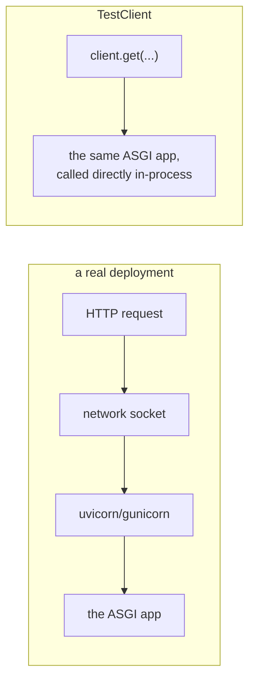
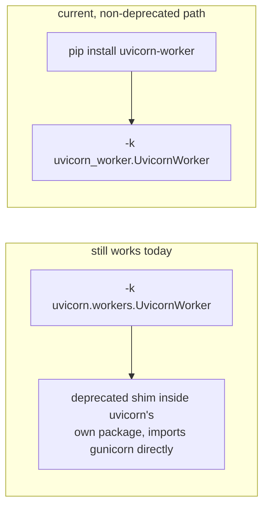
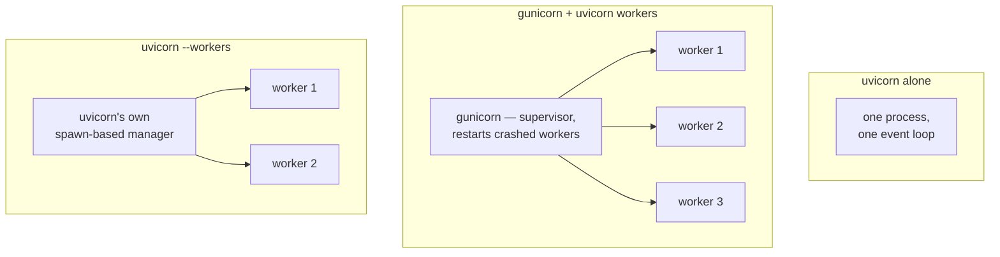

# Testing and deploying a Python web service — dependency overrides, worker topology, and a deprecation hiding inside a familiar command

*How `TestClient` exercises a real ASGI application with no server running at all, why swapping one dependency for a test double is a single dictionary assignment, and the exact warning printed by a `gunicorn` invocation that still appears in current tutorials.*

**Level:** L3 · **Prerequisites:** [15 ASGI request handling and dependency injection](15_asgi_request_handling_and_dependency_injection.md)
**Covers:** PY-19
**Sources:** Tragura, *Building Python Microservices with FastAPI*, ch.9, 11 (2022) · Alheraki, *Mastering FastAPI with Python* (2025)

---

## 1. The problem this solves

Testing a web endpoint sounds, at first, like it needs a running server — start the process, bind a port, send a real HTTP request over a real socket, tear it all down again. That is slow, flaky in exactly the ways networked tests always are, and unnecessary: an ASGI application, chapter 15's own subject, is an ordinary Python callable with a well-defined protocol, and a test client can speak that protocol directly, in-process, with no socket, no port, and no separate server process involved at all. The first half of this chapter is about that mechanism, and about the companion problem it exists to solve — a test exercising a real endpoint inevitably hits real dependencies (chapter 15's `Depends()` graph), and a test that opens a genuine database connection or calls a genuine external service on every run is not a unit test, it is an integration test wearing a faster test's clothing.

Neither half of this chapter introduces a new language mechanism this shelf has not already covered. `TestClient` is chapter 15's ASGI request-handling model, driven directly rather than through a real socket; `dependency_overrides` is chapter 15's own dependency graph, with one entry substituted; a worker process is chapter 4's reference-counted, independently-collected Python process, several of them supervised together; a container image is chapter 8's own import-time reproducibility concern, solved at the level of the entire runtime rather than one module. What is new here is applying all of it to the specific, practical question every one of the preceding chapters eventually has to answer: how does the thing that has been built actually get verified, and then actually get run, reliably, by someone other than the person who wrote it.

The second half is entirely different in kind: once a service is written and tested, something has to actually run it, continuously, under real traffic, surviving a crashed worker without the whole service going down. `uvicorn app:app` on its own is exactly what a developer runs locally and exactly the wrong shape for production traffic — a single process, a single event loop, no supervision if it crashes. Getting from "runs on my machine" to "runs reliably in production" is a specific, well-documented set of decisions about how many processes to run, who supervises them, and how they are packaged — and, as this node's own currency correction shows, decisions where the exact command copied from a still-widely-circulated tutorial now prints a deprecation warning most people never read past.

---

## 2. The mechanism, built up

### 2.1 `TestClient` speaks ASGI directly to the application object — no server, no socket, no port

```python
from fastapi import FastAPI
from fastapi.testclient import TestClient

app = FastAPI()

@app.get("/ping")
def ping():
    return {"pong": True}

client = TestClient(app)
response = client.get("/ping")
print(response.status_code, response.json())
```

```text
200 {'pong': True}
```



`TestClient(app)` never binds a port and never opens a real network socket — it holds a direct reference to `app`, the same ASGI-callable object chapter 15 already establishes a running server would otherwise invoke, and drives it through the ASGI protocol in-process, translating each `client.get(...)` call into exactly the kind of `scope`/`receive`/`send` invocation a real server would perform, without any of the real server's overhead. This is why a test suite built on `TestClient` runs in milliseconds rather than the seconds a real server-startup-and-teardown cycle would cost per test, and why every example throughout chapters 15 through 19 already used exactly this mechanism to verify its own claims — a test client is not a simplified stand-in for the real request-handling path, it *is* the real request-handling path, minus the actual network transport.

### 2.2 `app.dependency_overrides` swaps a real dependency for a test double, without touching the endpoint's own code at all

```python
def get_db():
    raise RuntimeError("a real database connection was attempted during a test")

def get_account(db=Depends(get_db)):
    return {"owner": "real-account"}

@app.get("/account")
def read_account(account=Depends(get_account)):
    return account

def fake_db():
    return "fake-db-connection"

app.dependency_overrides[get_db] = fake_db
response = client.get("/account")
print(response.status_code, response.json())
```

```text
200 {'owner': 'real-account'}
```

`app.dependency_overrides` is a plain dictionary, keyed by the original dependency callable, and chapter 15's own dependency-resolution mechanism checks it before ever calling the real `get_db` — a match in that dictionary is used in place of the real dependency, silently, with no change anywhere to `get_account`'s or `read_account`'s own code. This is exactly what makes an endpoint testable in isolation from the infrastructure its production dependencies would otherwise require: the test replaces `get_db` with `fake_db`, and everything downstream — `get_account`, `read_account`, and any further nested dependency built on top of `get_db` — receives the fake value transparently, unaware anything was substituted at all.

The key `app.dependency_overrides` is checked against is the callable object itself, by identity — chapter 1's own object-model vocabulary — not by name or by the parameter it happens to be bound to. This is why the override has to reference the *exact* `get_db` function object the endpoint's own dependency graph was built from; a second function that merely happens to share the name `get_db`, defined in a test file rather than imported from the application's own module, would never match anything in the dictionary at all, and the real dependency would still run, silently, exactly as if no override had been attempted.

### 2.3 Overrides are scoped to the whole application object, not to a single test — clearing them is the caller's responsibility

```python
app.dependency_overrides.clear()
```

`dependency_overrides` lives on the `FastAPI` application instance itself, which is typically constructed once, at module import time, and shared across an entire test suite's session — an override left in place after the test that needed it finishes remains active for every subsequent test that imports the same `app` object, silently substituting a fake dependency in tests that never asked for one and may be specifically trying to verify the real dependency's behavior. This is precisely why `.clear()` (or a narrower `del app.dependency_overrides[get_db]`) belongs in a test fixture's teardown, run unconditionally after every test — a `pytest` fixture using `yield` to separate setup from teardown, chapter 7's own generator-based resource-management pattern applied here, is the idiomatic way to guarantee the override is removed even if the test itself fails partway through.

### 2.4 `uvicorn` alone is a single process; a real deployment needs more than one

```bash
uvicorn app:app --host 0.0.0.0 --port 8000
```

This is exactly what local development runs, and it is a single OS process holding a single asyncio event loop — every request the service handles is multiplexed onto that one loop, which is precisely what makes an `async def` handler cheap to run concurrently (chapter 15's own model) and precisely why one process is not enough for production: a single process has no supervisor to restart it if it crashes, and cannot use more than one CPU core no matter how many are available, because Python's own concurrency model within one process is cooperative, not parallel, across cores.

### 2.5 `gunicorn -k uvicorn.workers.UvicornWorker` still runs — and now prints a deprecation warning naming its replacement

```bash
gunicorn -w 4 -k uvicorn.workers.UvicornWorker app:app --host 0.0.0.0 --port 8000
```

This exact invocation — copied, largely unchanged, from tutorials written years apart, this node's own sources among them — still works on a current `uvicorn` install, and importing the module it depends on now prints this directly:

```text
DeprecationWarning: The `uvicorn.workers` module is deprecated. Please use `uvicorn-worker`
package instead. For more details, see https://github.com/Kludex/uvicorn-worker.
```

`uvicorn.workers.UvicornWorker` has not been removed — the exact command in a 2022 or 2025 tutorial still runs a service correctly today — but the worker-class implementation itself moved out of `uvicorn`'s own package and into a small, standalone `uvicorn-worker` package, with the code left behind in `uvicorn.workers` reduced to a deprecated shim that imports from `gunicorn` directly and exists purely for backward compatibility. A deployment script or a container image's `CMD` line that still references `uvicorn.workers.UvicornWorker` is not broken, and is not urgent to fix — but it is one dependency change away from breaking outright, the day a future `uvicorn` release actually removes the shim rather than merely warning about it, which is a materially different risk profile than "this still works and always will."





### 2.6 Uvicorn's own `--workers` flag is a separate, `spawn`-based multi-process manager

Gunicorn supervising Uvicorn workers is one path to multiple processes; Uvicorn provides a second, built directly into itself:

```bash
uvicorn app:app --workers 4 --host 0.0.0.0 --port 8000
```

This spawns four independent worker processes without Gunicorn in the picture at all, and it does so using Python's `multiprocessing` module configured for the `spawn` start method — chapter 8's own material on the import system already covers exactly what that implies: a `spawn`-started worker process re-runs the importing module from scratch in a fresh interpreter, rather than inheriting the parent process's already-initialized state the way `fork` does, which is precisely why any import-time side effect (chapter 8's own subject) needs to be safe to run once per worker, not merely once per deployment. This is also, concretely, why `spawn` is the relevant choice on Windows, where `fork` is unavailable as a process-creation mechanism entirely — Uvicorn's own `--workers` flag works uniformly across platforms for exactly this reason, while a Gunicorn-based topology has historically been a Linux-first tool.

### 2.7 The worker-count heuristic is a starting point tied to CPU cores, not a universal constant

```text
workers = 2 * (CPU cores) + 1
```

This formula — cited by name in current deployment guidance and traceable to Gunicorn's own long-standing documentation — is a starting point for a CPU-bound workload, not a guarantee: an I/O-bound service, spending most of its time awaiting a database or another network call rather than computing, can often sustain meaningfully more concurrent work per process than this formula assumes, because each `async def` handler yields the event loop during that wait rather than occupying a worker the whole time. The number that actually matters is not the formula itself but what it is a proxy for — enough worker processes that the service's CPU-bound work is parallelized across the machine's real cores, without so many that memory pressure or context-switching overhead starts costing more than the extra parallelism buys; the formula is a reasonable place to start measuring from, never a substitute for actually measuring under representative load.

### 2.8 A container image freezes the exact runtime a service was tested against, closing the "works on my machine" gap

```dockerfile
FROM python:3.14-slim
WORKDIR /app
COPY requirements.txt .
RUN pip install --no-cache-dir -r requirements.txt
COPY . .
CMD ["uvicorn", "app:app", "--host", "0.0.0.0", "--port", "8000"]
```

A container image bundles the exact Python interpreter version, the exact set of installed dependencies, and the exact application code together into one artifact, built once and run identically wherever it is deployed — which is what actually closes the gap between "passed on the developer's machine" and "passed in CI" and "runs correctly in production," none of which are guaranteed to share the same underlying OS packages, Python patch version, or even CPU architecture otherwise. This is also precisely what makes a container the natural unit a process manager like Kubernetes, or a cloud platform's own container runtime, schedules and restarts — the same image, the same guaranteed-reproducible environment, run as however many replicas the actual load requires, entirely independent of whichever single machine originally built it.

### 2.9 The OpenAPI schema FastAPI generates automatically can be overridden and extended directly

```python
from fastapi.openapi.utils import get_openapi

def custom_openapi():
    if app.openapi_schema:
        return app.openapi_schema
    schema = get_openapi(title="Custom Bank API", version="2.0.0", routes=app.routes)
    schema["info"]["x-custom-field"] = "internal-only"
    app.openapi_schema = schema
    return app.openapi_schema

app.openapi = custom_openapi
```

```text
Custom Bank API 2.0.0
internal-only
```

FastAPI generates its OpenAPI schema automatically from every route's own type annotations and Pydantic models (chapter 16's own mechanism, read directly), and `app.openapi` is itself an ordinary, overridable attribute — replacing it with a function that calls `get_openapi(...)` directly, mutates the result, and caches it onto `app.openapi_schema` is the documented path for anything the automatic generation does not cover on its own: custom metadata fields, vendor extensions (the `x-` prefix above is the OpenAPI specification's own reserved namespace for exactly this), or a title and version pulled from deployment configuration rather than hard-coded at the `FastAPI()` constructor call. The caching check at the top — returning the already-built schema on a second call rather than rebuilding it — matters because `app.openapi()` is invoked on every request to the documentation UI; rebuilding the full schema from scratch on every single request would be wasted, avoidable work for a page that changes only when the deployed code itself changes.

---

## 3. Diagrams

The `TestClient`-versus-real-transport diagram in section 2.1 and the `uvicorn.workers` deprecation path and process-topology comparison, both in section 2.5, are integrated into the mechanism build-up above, as this format requires.

---

## 4. Failure modes

### 4.1 A dependency override left uncleared after one test silently changes the behavior of every test that runs after it

```python
# Gist: leaked_override.py
def test_account_with_fake_db():
    app.dependency_overrides[get_db] = lambda: "fake-db"
    response = client.get("/account")
    assert response.status_code == 200
    # forgot: app.dependency_overrides.clear()

def test_account_rejects_bad_input():
    # this test never touched dependency_overrides directly,
    # and still runs against the fake_db from the PREVIOUS test
    response = client.get("/account?bad=param")
    ...
```

Section 2.3 already names the mechanism: `dependency_overrides` lives on the shared `app` object, not on any individual test, so the first test's override remains active for every test that runs afterward in the same session, entirely invisible in the second test's own source — nothing in `test_account_rejects_bad_input` mentions `get_db` at all, and yet it is running against a fake database connection it never asked for. This is a specific, common instance of **test pollution** — one test's setup leaking into another's execution — and it is unusually hard to debug because the two tests, read independently, both look correct; the bug only manifests as test *order* dependence, where a test passes in isolation and fails (or, worse, passes for the wrong reason) only when run after a specific other test. The fix is the fixture-based teardown section 2.3 already recommends: every test that sets an override does so through a fixture whose teardown unconditionally clears it, guaranteeing cleanup runs even if the test itself raises partway through, rather than trusting each test to remember a manual cleanup call at its own end.

### 4.2 A container image built without pinning exact dependency versions is not actually reproducible, despite looking like it is

```dockerfile
# Gist: unpinned_requirements.dockerfile
FROM python:3.14-slim
RUN pip install fastapi uvicorn sqlalchemy
COPY . .
CMD ["uvicorn", "app:app", "--host", "0.0.0.0"]
```

Section 2.8 already establishes that a container's entire value is freezing an exact, reproducible runtime — and `pip install fastapi uvicorn sqlalchemy`, with no version pins at all, installs whatever the *latest* compatible versions happen to be **at build time**, which is a different, uncontrolled variable on every single rebuild. An image built today and an image built from the identical `Dockerfile` six months from now can silently receive different versions of every one of those libraries, including a breaking change like chapter 16's own Pydantic v1-to-v2 rewrite, with nothing in the build process flagging that anything changed. This defeats the entire premise of containerizing in the first place: the image looks reproducible — same base image, same `Dockerfile`, same source code — while the actual installed dependency graph is whatever happened to be current on the package index the moment `docker build` ran. The fix is pinning exact versions (a `requirements.txt` generated by `pip freeze`, or a lockfile from a tool that manages this directly) and rebuilding only when those pins are deliberately updated, so that "the same `Dockerfile`" and "the same runtime" are actually the same claim rather than two claims that happen to coincide most of the time.

### 4.3 Setting worker count from the `2 * cores + 1` formula alone, with no measurement, can under- or over-provision an I/O-bound service badly

```bash
# Gist: formula_only_workers.sh
# a 4-core machine, following the formula literally with no further thought
gunicorn -w 9 -k uvicorn.workers.UvicornWorker app:app
```

Section 2.7 already names why this can be badly wrong in either direction for a service that spends most of its time awaiting a database or another downstream call rather than computing: nine worker processes, each holding its own full copy of the application's loaded modules, database connection pool (chapter 17's own per-engine pool sizing), and interpreter overhead, can exhaust the host machine's memory or the downstream database's own connection limit — chapter 17's `QueuePool` defaulting to five connections *per engine, per process* means nine worker processes each opening their own pool multiplies that number by nine — long before nine processes' worth of CPU parallelism was ever actually needed for a workload that was never CPU-bound in the first place. The formula is silent about this because it was never designed to account for it; it answers "how many processes saturate the CPU," a question that is close to irrelevant for a service whose bottleneck is somewhere else entirely. The fix is treating the formula as a starting point for measurement, not a final answer: load-testing the actual service under realistic traffic, watching actual CPU utilization, actual memory per worker, and actual downstream connection counts, and adjusting the worker count to what the measured bottleneck actually calls for, which for a genuinely I/O-bound service is very often a number `2 * cores + 1` did not anticipate in either direction.

### 4.4 A `TestClient` used without a `with` block never runs the application's `lifespan`

```python
# Gist: testclient_skips_lifespan.py
from contextlib import asynccontextmanager

events = []

@asynccontextmanager
async def lifespan(app):
    events.append("startup")
    yield
    events.append("shutdown")

app = FastAPI(lifespan=lifespan)

@app.get("/ping")
def ping():
    return {"events_so_far": list(events)}

client = TestClient(app)
response = client.get("/ping")
print(response.json())
```

```text
{'events_so_far': []}
```

Chapter 15 already establishes `lifespan` as an async context manager running its startup code once, before the first request, and its shutdown code once, after the last — and `TestClient`, used as a plain object rather than as a context manager itself, never triggers either half at all. `events_so_far` is empty because `startup` genuinely never ran; the request still succeeds, because `ping` does not itself depend on anything `lifespan` was supposed to set up, which is precisely what makes this trap easy to miss in a small test — a test suite exercising only endpoints that happen not to need whatever `lifespan` initializes will pass cleanly, giving no indication that `lifespan` is being skipped entirely. The fix is using `TestClient` as its own context manager — `with TestClient(app) as client:` — which runs `startup` on entry and `shutdown` on exit, exactly mirroring what a real deployed server does around the requests it serves; any test whose endpoint genuinely depends on `lifespan`-initialized state (a connection pool, a warmed cache) will fail outright without it, but a test exercising an unrelated endpoint will not, which is exactly why this needs to be a settled team convention — always wrap `TestClient` in `with` — rather than a case-by-case judgment call made fresh for every test file.

---

## 5. Trade-offs

| Approach | Use when | Because | Real cost |
| --- | --- | --- | --- |
| **`TestClient` against the real app, dependencies overridden** | Testing a route's own logic, including its dependency graph's wiring | Fast, in-process, no real infrastructure required | Not a substitute for verifying the real dependency (a real database, a real external service) actually behaves as the fake assumes |
| **A genuine integration test against real infrastructure** | Verifying the actual contract with a real database, cache, or external service | Catches drift between what a test double assumes and what the real dependency actually does | Slower, more brittle, and requires the real infrastructure to be available wherever the test runs |
| **Uvicorn alone, one process** | Local development, or a workload genuinely light enough that one process is sufficient | Simplest possible setup, easiest to debug directly | No process supervision, no multi-core parallelism |
| **Gunicorn + Uvicorn workers** | Production, on a platform where Gunicorn's process-supervision model fits the deployment | Battle-tested process management, automatic worker restart on crash | An additional layer and an additional configuration surface beyond Uvicorn alone |
| **Uvicorn's own `--workers` flag** | Production, especially on Windows, or when avoiding an extra dependency on Gunicorn matters | Built directly into Uvicorn, works uniformly across platforms via `spawn` | Less mature process-supervision behavior than Gunicorn's own, accumulated over a longer history |

### The case against skipping integration tests entirely in favor of `dependency_overrides` everywhere

A test suite built entirely from `TestClient` calls against overridden dependencies proves that a route's *logic* is wired correctly against whatever the fake dependency returns — it proves nothing about whether the real dependency actually returns data shaped the way the fake assumes, which is exactly the gap that lets a real database schema change or a real external API's breaking change pass an entire test suite undetected. The rejected alternative to "override everything, always" is a smaller number of genuine integration tests, run less frequently than the fast unit-style suite but run somewhere real, specifically to catch the class of bug that mocking by its nature cannot: the fake and the real thing have quietly diverged.

### The case against treating `TestClient` coverage as equivalent to production readiness

A test suite that exercises every endpoint through `TestClient`, with every dependency overridden and every `lifespan` correctly entered, proves that the application's own routing and business logic behave as written — it says nothing about whether the chosen worker topology, container image, or reverse-proxy configuration actually serves real traffic correctly, because none of those exist inside the `TestClient`'s in-process world at all. The rejected alternative to treating a green test suite as "done" is a deliberate, separate verification step against something closer to the real deployment shape — a container built from the actual `Dockerfile`, run behind the actual process manager, hit with actual concurrent load — specifically because sections 2.4 through 2.7's entire subject matter (process count, supervision, resource limits) is invisible to any test that never leaves a single Python process.

### The case against choosing a worker topology without measuring the actual bottleneck

Section 4.3 already demonstrates the concrete cost; the trade-off worth stating plainly is that CPU-core-based formulas answer a question a large fraction of real web services never actually have — most REST APIs spend the overwhelming majority of their time waiting on a database or a downstream call, not computing, which means the CPU-bound assumption the `2 * cores + 1` heuristic is built on frequently does not describe the actual workload at all. The rejected alternative to trusting the formula outright is load-testing the specific service under realistic traffic and tuning from what is actually observed — memory per worker, actual downstream connection pressure, actual latency under concurrent load — which costs real setup time up front and avoids provisioning a production deployment around a number that was never actually measuring the thing that matters for this particular service.

---

## 6. Reference summary

**`TestClient` drives a real ASGI application directly, in-process, with no server or socket involved** — it is the same request-handling path a running server would use, not a simplified substitute for it. **`app.dependency_overrides` is a plain dictionary, keyed by the original dependency callable**, checked before chapter 15's own dependency resolution ever calls the real one — the mechanism that lets an endpoint's logic be tested in isolation from the real infrastructure its dependencies would otherwise require. **Overrides are scoped to the shared application object, not to any individual test**, and must be cleared explicitly (ideally via a fixture's unconditional teardown) or they silently affect every test that runs afterward in the same session. **`TestClient` only runs the application's `lifespan` when used as its own context manager (`with TestClient(app) as client:`)** — used as a plain object, `startup` and `shutdown` never run at all, which passes silently for any test whose endpoint does not happen to depend on `lifespan`-initialized state.

**A single `uvicorn app:app` process holds one event loop and has no supervisor** — sufficient for local development, insufficient for production traffic on its own. **`gunicorn -k uvicorn.workers.UvicornWorker` still runs correctly today, but the module now emits a `DeprecationWarning`** pointing to the standalone `uvicorn-worker` package the worker-class implementation actually moved into — a currently-working command that is one future release away from breaking outright. **Uvicorn's own `--workers` flag is a separate, `spawn`-based multi-process manager**, built into Uvicorn directly and working uniformly across platforms including Windows, where `fork` is unavailable — and `spawn`'s re-import behavior is exactly chapter 8's own import-side-effects material, applied to worker startup specifically.

**The `2 * cores + 1` worker-count formula is a CPU-bound starting point, not a universal constant** — an I/O-bound service, which describes most ordinary web APIs, can be badly over- or under-provisioned by following it without measuring the actual bottleneck, and each additional worker process multiplies per-process resource costs (a database connection pool among them, chapter 17's own subject) rather than sharing them.

**A container image freezes an exact, reproducible runtime**, closing the gap between "works on one machine" and "works everywhere it is deployed" — but only when dependency versions are actually pinned; an unpinned build looks reproducible while silently installing whatever happens to be current on every rebuild. **FastAPI's OpenAPI schema generation is fully overridable** via `app.openapi`, with the generated schema cached onto `app.openapi_schema` to avoid rebuilding it on every request to the documentation UI.

---

← [Python knowledge graph](00_knowledge_graph.md) · [repo index](../README.md)
