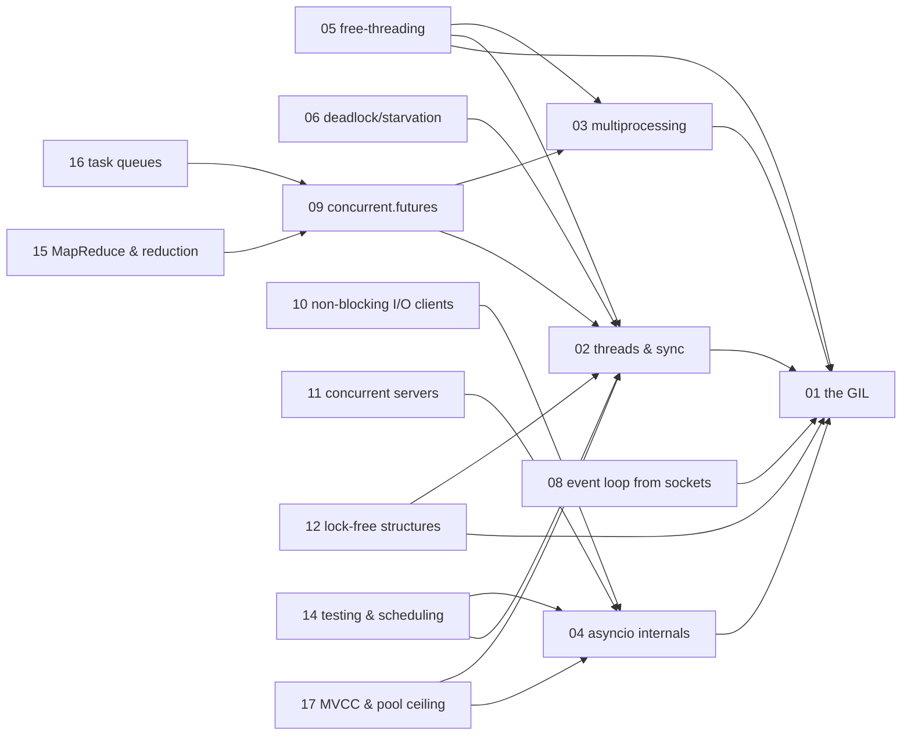

# Concurrency — knowledge graph

*What actually runs at the same time in a Python process, what only appears to, and what it costs
to make either one true — from the GIL through free-threading, process boundaries, asyncio
internals, and the concurrency problems that live one layer down, at the database and the message
broker.*

**Nodes:** 17 · **Books:** 5 · **Currency researched:** 2026-08-06
**Requires:** [`05_python`](../05_python/00_knowledge_graph.md)
**Feeds:** none yet — `07_javascript`, `09_sql`, and `12_bigquery` are not built in this repository

---

## §1 Source audit

| Book | Year | Documents | Verdict |
|---|---|---|---|
| Fowler, *Python Concurrency with asyncio* | 2022 | asyncio built up from sockets: coroutines, tasks, futures, streams, database drivers, thread and process executors, synchronization, queues, subprocesses, ASGI web apps, microservices | The best asyncio-specific source on the shelf. Published five months before Python 3.11 shipped `TaskGroup`/`asyncio.timeout`, so its structured-concurrency chapter is the pre-3.11 idiom |
| Nguyen, *Mastering Concurrency in Python* | 2018 | Amdahl's Law, threads, processes, deadlock/starvation/race conditions, the GIL, lock-free and mutex-free data structures, atomic operations, low-level socket servers, APScheduler, testing concurrent code | Broad theoretical coverage — Amdahl's Law, the four deadlock conditions, the readers-writers problem — not duplicated elsewhere on this shelf. Its GIL chapter predates every free-threading development by five years and its asyncio chapters predate 3.7's mature `async`/`await` |
| Palach, *Parallel Programming with Python* | 2014 | Parallel algorithm design, threading versus multiprocessing, the `pp` (Parallel Python) module, Celery, blocking/non-blocking/asynchronous operations | The oldest book here. The `pp` module chapter is effectively dead — the project has had no meaningful release in years — but the Celery broker/worker/result-backend architecture chapter still describes the current shape accurately |
| Beazley, *An Introduction to Python Concurrency* (slide deck) | 2009 | Threads, the GIL, the check interval, multiprocessing, message passing via `pickle`, an early hand-rolled coroutine/event-loop demonstration | Pre-`asyncio` entirely — `asyncio` arrived via PEP 3156 in Python 3.4 (2014) — and pre-`concurrent.futures`, which arrived via PEP 3148 in Python 3.2 (2011). Its GIL mechanics explanation remains excellent; everything it recommends as the concurrency *approach* is superseded |
| `tpc2010.pdf` (Roscoe-style CSP course notes) | 2010 | CSP process algebra: prefixing, choice, parallel composition, hiding and renaming, buffers and communication, termination, operational and denotational semantics, algebraic semantics, abstraction, deadlock analysis, timed CSP, case studies | Formal theory rather than a Python book; the mathematics has not aged, but its tooling references trail two rewrites of the reference checker |
| Ramalho, *Fluent Python*, 2nd ed. (catalogued under `05_python/_toc`) | 2022 | Chapters 19–21 only: concurrency models and the GIL, `concurrent.futures` executors, asyncio-based asynchronous programming | Cited here for its concurrency-specific chapters even though the book itself sits on the Python subject's shelf, because those three chapters are concurrency content, not language-mechanics content. See `05_python`'s coverage gaps for the reciprocal note |

---

## §2 Node index

| ID | Node | Type | Depth | Currency |
|---|---|---|---|---|
| `CONC-01` | The GIL — what it protects and when it lets go | Mechanism | L5 | `stale-major` |
| `CONC-02` | Threads, races, and synchronisation | Mechanism | L4 | `current` |
| `CONC-03` | Multiprocessing and the process boundary | Mechanism | L4 | `stale-minor` |
| `CONC-04` | asyncio internals | Mechanism | L5 | `stale-minor` |
| `CONC-05` | Free-threading, subinterpreters, and the post-GIL roadmap | Mechanism | L5 | `absent` |
| `CONC-06` | Deadlock, starvation, and livelock as system properties | Model | L4 | `current` |
| `CONC-07` | Amdahl's Law and the limits of parallel speedup | Model | L3 | `current` |
| `CONC-08` | Building an event loop from raw sockets | Mechanism | L4 | `stale-minor` |
| `CONC-09` | `concurrent.futures`: unifying threads and processes | Mechanism | L3 | `current` |
| `CONC-10` | Non-blocking I/O clients: streams, aiohttp, and asyncpg | Mechanism | L4 | `current` |
| `CONC-11` | Building concurrent servers and protocols | Mechanism | L4 | `current` |
| `CONC-12` | Lock-free and scalable concurrent data structures | Structure | L5 | `current` |
| `CONC-13` | CSP: formal models of concurrent processes | Model | L5 | `stale-minor` |
| `CONC-14` | Testing, debugging, and scheduling concurrent applications | Practice | L3 | `current` |
| `CONC-15` | Data-parallel patterns: MapReduce and reduction operators | Algorithm | L3 | `current` |
| `CONC-16` | Distributed task queues and message-driven architectures | Practice | L4 | `stale-minor` |
| `CONC-17` | Concurrency at the data layer: MVCC, isolation, and the connection-pool ceiling | Mechanism | L5 | `absent` |

---

## §3 The graph

All 15 nodes with `requires`/`refines` edges fit one diagram; `CONC-07` and `CONC-13` carry only
`contrasts` edges and are omitted from it accordingly.

---

## §4 Node records

### `CONC-01` · The GIL — what it protects and when it lets go
**Type:** Mechanism · **Depth:** L5
**Covers:** non-atomic reference counts as the reason the lock exists, bytecode-boundary switching, `sys.getswitchinterval`, release around blocking syscalls, explicit release by C extensions (NumPy, Polars, DuckDB) around their compute loops
**Sources:** Ramalho ch.19 (2022, catalogued under `05_python`) · Fowler ch.1 (2022) · Nguyen ch.15 (2018) · Beazley, *An Introduction to Python Concurrency* (2009)
**Edges:** `requires` [`PY-05`] · `contrasts` [`CONC-07`, `GO-08`]
**Currency:** `stale-major`
**Δ current:** Nguyen (2018) and Fowler (2022) both describe the GIL as a fixed, un-removable feature of CPython. PEP 703, accepted by the Steering Council on 24 October 2023, made a free-threaded build real: Python 3.13 (7 October 2024) shipped it experimentally, and PEP 779 promoted it to officially supported status in Python 3.14 (7 October 2025), with single-thread overhead now roughly 5–10%. The written article on this node cites its GIL-enabled default-build figures from the `CONC-GIL` rows of the measurement archive, which remain accurate for that build; the free-threaded alternative and its implications belong to `CONC-05`.
**Article:** [01_the_gil_what_it_protects_and_when_it_lets_go.md](01_the_gil_what_it_protects_and_when_it_lets_go.md)

### `CONC-02` · Threads, races, and synchronisation
**Type:** Mechanism · **Depth:** L4
**Covers:** `Lock`/`RLock`/`Semaphore`/`Event`/`Condition`, `queue.Queue` as the answer that avoids hand-rolled locking, lost updates from non-atomic `+=`, `threading.local` versus `contextvars`, deadlock from inconsistent lock ordering
**Sources:** Fowler ch.7, 11 (2022) · Nguyen ch.3, 4, 14 (2018) · Palach ch.4 (2014) · Beazley, *An Introduction to Python Concurrency* (2009)
**Edges:** `requires` [`CONC-01`] · `contrasts` [`CONC-13`] · `contrasts` [`AND-05`] · `contrasts` [`JAVA-05`]
**Currency:** `current`
**Article:** [02_threads_races_and_synchronisation.md](02_threads_races_and_synchronisation.md)

### `CONC-03` · Multiprocessing and the process boundary
**Type:** Mechanism · **Depth:** L4
**Covers:** `fork`/`spawn`/`forkserver` and platform defaults, the pickling constraint on anything crossing the boundary, `Value`/`Array`/`Manager`/`shared_memory`, the fork-inherits-open-connections hazard, measured scaling across cores
**Sources:** Fowler ch.6 (2022) · Nguyen ch.6, 7 (2018) · Palach ch.5 (2014) · Beazley, *An Introduction to Python Concurrency* (2009)
**Edges:** `requires` [`CONC-01`] · `requires` [`PY-08`]
**Currency:** `stale-minor`
**Δ current:** Every book here treats `fork` as the Linux default and `spawn` as the platform exception (macOS since Python 3.8). Python 3.14 changes that baseline again: on POSIX platforms it switches the default multiprocessing start method from `fork` to `forkserver`, because `fork()` without an immediate `execve()` is unsafe once threads are running — CPython has emitted a `DeprecationWarning` for `os.fork()` in a multithreaded process since Python 3.12, and the standard-library `multiprocessing` documentation itself now flags plain `fork` as the option to avoid rather than the default to expect. An article on this node should teach `forkserver` as the current POSIX default and explain why `fork` earned the deprecation.
**Article:** [03_multiprocessing_and_the_process_boundary.md](03_multiprocessing_and_the_process_boundary.md)

### `CONC-04` · asyncio internals
**Type:** Mechanism · **Depth:** L5
**Covers:** coroutine objects and `.send()`, `Task`/`Future`, the selector-based event loop, `gather` versus `TaskGroup`, cancellation and shielding, `asyncio.timeout`, bounded concurrency with a semaphore, `to_thread`, debug mode, structured concurrency, context variables propagating across `await`
**Sources:** Ramalho ch.21 (2022, catalogued under `05_python`) · Fowler ch.2–4, 14 (2022)
**Edges:** `requires` [`CONC-01`] · `requires` [`PY-07`] · `supersedes` [`CONC-08`] · `contrasts` [`JS-12`] · `contrasts` [`TS-15`] · `contrasts` [`BUS-25`] · `contrasts` [`JAVA-14`]
**Currency:** `stale-minor`
**Δ current:** Fowler's book, published February 2022, covers `gather`, `wait`, and `as_completed` but not `TaskGroup` or `asyncio.timeout`, both added in Python 3.11 (released 7 October 2022) on top of PEP 654's exception groups and `except*` syntax. The written article on this node already treats `TaskGroup` as the primary structured-concurrency form, consistent with that gap; an article written purely from Fowler's chapters would need this correction stated explicitly.
**Article:** [04_asyncio_internals.md](04_asyncio_internals.md)

### `CONC-05` · Free-threading, subinterpreters, and the post-GIL roadmap
**Type:** Mechanism · **Depth:** L5
**Covers:** PEP 703's three-phase rollout, biased reference counting and per-object locks, PEP 683 immortal objects and how their scope narrowed between 3.13 and 3.14, the C-extension ABI break under `Py_GIL_DISABLED`, PEP 734's `concurrent.interpreters` module and `InterpreterPoolExecutor`, the experimental JIT under PEP 744
**Sources:** —
**Edges:** `requires` [`CONC-01`, `CONC-02`, `CONC-03`]
**Currency:** `absent`
**Δ current:** None of the five books on this shelf mentions free-threading, subinterpreters as a public module, or a JIT — `tpc2010.pdf` (2010) predates asyncio itself, Nguyen (2018) predates the entire PEP 703 effort, and Fowler (2022) predates it too. Every fact here comes from the PEPs and the CPython release notes directly: PEP 703 was accepted 24 October 2023, Python 3.13 (7 October 2024) shipped the free-threaded build experimentally, and PEP 779 promoted it to officially supported status in Python 3.14 (7 October 2025) at roughly 5–10% single-threaded overhead. PEP 734's `concurrent.interpreters` landed as a late addition to 3.14's standard library, alongside a new `InterpreterPoolExecutor`. An article on this node has no textbook to lean on and must cite CPython's own documentation and changelog throughout.

### `CONC-06` · Deadlock, starvation, and livelock as system properties
**Type:** Model · **Depth:** L4
**Covers:** the four Coffman conditions, the Dining Philosophers problem, lock ordering as the practical fix, the readers-writers problem in its three classic variants, livelock as a failure distinct from deadlock
**Sources:** Nguyen ch.12, 13 (2018) · Palach ch.1 (2014)
**Edges:** `requires` [`CONC-02`] · `contrasts` [`JAVA-09`]
**Currency:** `current`

### `CONC-07` · Amdahl's Law and the limits of parallel speedup
**Type:** Model · **Depth:** L3
**Covers:** the serial-fraction speedup formula, its relationship to the law of diminishing returns, simulating the curve, deciding whether a workload is worth parallelising at all before writing any concurrent code
**Sources:** Nguyen ch.2 (2018)
**Edges:** `contrasts` [`CONC-01`]
**Currency:** `current`

### `CONC-08` · Building an event loop from raw sockets
**Type:** Mechanism · **Depth:** L4
**Covers:** blocking versus non-blocking sockets, the `selectors` module, a hand-built echo server, transports and protocols as the abstraction `asyncio` itself is built from, generator-based coroutines as the historical predecessor to native `async`/`await` — since removed from the language
**Sources:** Fowler ch.3 (2022) · Nguyen ch.18 (2018) · Beazley, *An Introduction to Python Concurrency* §11 (2009)
**Edges:** `requires` [`CONC-01`] · `requires` [`PY-07`]
**Currency:** `stale-minor`
**Δ current:** All three books build a manual selector-based loop as a teaching device, and Fowler's chapter 3 (2022) still frames it that way deliberately. Beazley's 2009 deck, in contrast, presents essentially this same hand-rolled approach as the production answer, because it predates `asyncio` entirely — `asyncio` was added by PEP 3156 in Python 3.4 (2014), five years after that deck was written. An article on this node should be explicit that the manual loop is pedagogy, not a production pattern, and hand off to `CONC-04` for what actually ships.

### `CONC-09` · `concurrent.futures`: unifying threads and processes
**Type:** Mechanism · **Depth:** L3
**Covers:** `ThreadPoolExecutor` and `ProcessPoolExecutor` behind a common `Executor` interface, `Future` objects, `executor.map` versus `submit`, `as_completed`, exception propagation through a future
**Sources:** Ramalho ch.20 (2022, catalogued under `05_python`) · Palach ch.4, 5 (2014)
**Edges:** `requires` [`CONC-02`, `CONC-03`]
**Currency:** `current`

### `CONC-10` · Non-blocking I/O clients: streams, aiohttp, and asyncpg
**Type:** Mechanism · **Depth:** L4
**Covers:** asyncio streams (`StreamReader`/`StreamWriter`), asynchronous context managers, `aiohttp` client sessions and timeouts, `asyncpg` connection pools, async generators for streaming query result sets, non-blocking subprocess management with `asyncio.create_subprocess_exec`
**Sources:** Fowler ch.4, 5, 8, 13 (2022)
**Edges:** `requires` [`CONC-04`]
**Currency:** `current`

### `CONC-11` · Building concurrent servers and protocols
**Type:** Mechanism · **Depth:** L4
**Covers:** asyncio's transports/protocols layer, graceful shutdown and signal handling, a chat-server case study, ASGI as the async successor to WSGI, WebSocket upgrade inside an ASGI app, alternative event-loop implementations such as `uvloop`
**Sources:** Ramalho ch.21 (2022, catalogued under `05_python`) · Fowler ch.3, 8, 9, 14 (2022) · Nguyen ch.11 (2018)
**Edges:** `requires` [`CONC-04`] · `contrasts` [`HTTP-05`]
**Currency:** `current`

### `CONC-12` · Lock-free and scalable concurrent data structures
**Type:** Structure · **Depth:** L5
**Covers:** why true lock-freedom is not achievable in pure Python, approximate counters as a scalability technique, RCU (read-copy-update) as a pattern, atomic versus non-atomic operations under the GIL
**Sources:** Nguyen ch.16, 17 (2018)
**Edges:** `requires` [`CONC-01`, `CONC-02`]
**Currency:** `current`

### `CONC-13` · CSP: formal models of concurrent processes
**Type:** Model · **Depth:** L5
**Covers:** the process algebra of prefixing, guarded choice and recursion, the traces model and trace refinement, parallel composition (synchronous, alphabetised, interleaved, generalised), hiding and renaming, piping and enslavement, buffers and the alternating-bit protocol, termination and sequential composition, operational and denotational semantics, algebraic semantics, abstraction, deadlock analysis via tree networks and node orderings, timed CSP, and case studies including cache coherency and crypto-protocol analysis
**Sources:** `tpc2010.pdf` (Roscoe-style CSP course notes, 2010)
**Edges:** `contrasts` [`CONC-02`]
**Currency:** `stale-minor`
**Δ current:** The theory itself — traces, failures/divergences, refinement — has not changed; CSP is a mathematical model, not a shipping library. What has moved is tooling: the notes' era of checker (FDR2, retired by the mid-1990s, then the FDR3 rewrite from 2013) has been superseded by FDR4, first released in October 2016 and still the current refinement checker. An article on this node should cite FDR4 for anyone who wants to run the examples rather than an FDR2-era tool the notes may reference.

### `CONC-14` · Testing, debugging, and scheduling concurrent applications
**Type:** Practice · **Depth:** L3
**Covers:** APScheduler's blocking versus background schedulers, unit-testing concurrent code, static analysis for concurrency bugs, debugging techniques specific to interleaved execution
**Sources:** Nguyen ch.19 (2018)
**Edges:** `requires` [`CONC-02`, `CONC-04`] · `contrasts` [`GRPC-11`]
**Currency:** `current`

### `CONC-15` · Data-parallel patterns: MapReduce and reduction operators
**Type:** Algorithm · **Depth:** L3
**Covers:** the properties a reduction operator must satisfy, a MapReduce implementation over the Google Books Ngram dataset built with asyncio, concurrent image processing as a data-parallel case study, choosing a chunk size
**Sources:** Fowler ch.6 (2022) · Nguyen ch.7, 8 (2018)
**Edges:** `requires` [`CONC-09`] · `contrasts` [`BQ-01`] · `contrasts` [`JAVA-13`]
**Currency:** `current`

### `CONC-16` · Distributed task queues and message-driven architectures
**Type:** Practice · **Depth:** L4
**Covers:** Celery's task/broker/worker/result-backend architecture, RabbitMQ as an AMQP broker, Kafka publish/subscribe, delivery semantics and idempotent processing, retry and circuit-breaker patterns at the messaging layer
**Sources:** Palach ch.7 (2014) · Tragura, *Building Python Microservices with FastAPI* ch.8 (2022, catalogued under `05_python`)
**Edges:** `requires` [`CONC-09`] · `composes` [`PY-18`] · `contrasts` [`BUS-21`]
**Currency:** `stale-minor`
**Δ current:** Palach's 2014 chapter on Celery predates the entire 5.x line, and broker practice has shifted since: as of 2025, Redis dominates as the default Celery broker in new deployments, and async-native alternatives such as Taskiq — which supports Redis, RabbitMQ, NATS, and Kafka via plugins, with a release as recent as March 2026 — are gaining ground specifically because they offer first-class `asyncio` integration that Celery's worker model does not. Celery itself remains dominant by installed base, with 5.5.x deployments common through 2025, so an article on this node should teach Celery as the default while naming the async-native alternative explicitly rather than presenting Celery as the only choice.

### `CONC-17` · Concurrency at the data layer: MVCC, isolation, and the connection-pool ceiling
**Type:** Mechanism · **Depth:** L5
**Covers:** multi-version concurrency control and snapshot isolation, why readers never block writers under MVCC, optimistic versus pessimistic locking, `SELECT … FOR UPDATE`, the connection pool — not the event loop — as the real concurrency ceiling of an async service
**Sources:** —
**Edges:** `requires` [`CONC-04`, `CONC-02`] · `contrasts` [`SQL-07`] · `contrasts` [`MDB-12`]
**Currency:** `absent`
**Δ current:** None of the five concurrency books on this shelf treats database-level concurrency control — MVCC, isolation levels, or connection pooling — as a topic; it sits at the intersection of this subject and SQL, and no book here crosses that boundary. This node exists because a senior engineer needs it when reasoning about an async service's real throughput ceiling, not because a book supplies it.

---

## §5 Cross-subject edges

| From | Edge | To | Why |
|---|---|---|---|
| `CONC-01` | `requires` | `PY-05` | The GIL's rationale — non-atomic reference counts, bytecode-boundary switching — only makes sense once bytecode and the eval loop are concrete rather than a rumour |
| `CONC-01` | `contrasts` | `GO-08` | An interpreter lock serialising bytecode execution onto one core against an M:N scheduler multiplexing goroutines across all of them — two opposite answers to running concurrent code in a managed runtime; reciprocal of `GO-08`'s edge into this node |
| `CONC-03` | `requires` | `PY-08` | `spawn` re-imports the target module in the child process, so the module-level side-effect and `__main__`-guard discussion is a hard prerequisite, not background |
| `CONC-04` | `requires` | `PY-07` | A `Task` driving a coroutine via repeated `.send()` calls is the exact mechanism generators already established; asyncio is that mechanism wired to an event loop |
| `CONC-08` | `requires` | `PY-07` | A hand-rolled event loop over generator-based coroutines is literally generator mechanics applied to socket readiness, and cannot be built without them |
| `CONC-16` | `composes` | `PY-18` | Celery, RabbitMQ, and Kafka are the component parts that implement the message-driven half of the microservice architecture patterns `PY-18` describes |
| `CONC-04` | `contrasts` | `JS-12` | The microtask/macrotask event loop and the asyncio event loop are structurally the same idea — a single-threaded scheduler multiplexing suspended continuations — with different queue names and different starvation failure modes; reciprocal of `JS-12`'s edge into this node |
| `CONC-04` | `contrasts` | `TS-15` | TypeScript's promise typing erases entirely at runtime while Python's asyncio types are checked against a real coroutine object at every `await`; the same async/await surface syntax backed by two very different compile-time guarantees |
| `CONC-15` | `contrasts` | `BQ-01` | The MapReduce and reduction-operator patterns this node covers at the single-process level versus Dremel's stage/slot fan-out and shuffle in `BQ-01` |
| `CONC-17` | `contrasts` | `SQL-07` | The connection-pool-ceiling framing this node gives the mechanism from the application-concurrency side versus SQL's own isolation-level and MVCC treatment in `SQL-07` |
| `CONC-17` | `contrasts` | `MDB-12` | The MVCC/connection-pool framing this node gives concurrency at the data layer generally versus oplog-based replication and majority write concern in `MDB-12` |
| `CONC-11` | `contrasts` | `HTTP-05` | Building concurrent servers with asyncio compared against the thread/process-per-connection server model `HTTP-05` describes |
| `CONC-14` | `contrasts` | `GRPC-11` | Testing/scheduling concurrent Python applications compared against testing gRPC services in `GRPC-11` |
| `CONC-16` | `contrasts` | `BUS-21` | Distributed task queues and message-driven architectures generally versus Celery's specific broker/worker/result-backend model in `BUS-21` |
| `CONC-04` | `contrasts` | `BUS-25` | asyncio's own event-loop mechanics versus the async-native task-queue landscape (Dramatiq/arq/Taskiq) contrasted against Celery's pre-fork model in `BUS-25` |
| `CONC-02` | `contrasts` | `AND-05` | General-purpose thread and race-condition mechanics versus Android's Handler/thread/Service model in `AND-05` |
| `CONC-02` | `contrasts` | `JAVA-05` | Java's threads are preemptively OS-scheduled with no interpreter lock; Python's threads are OS-scheduled too but serialised onto one core by the GIL — the same `Thread` vocabulary hides two different concurrency ceilings |
| `CONC-06` | `contrasts` | `JAVA-09` | The same three liveness failures — deadlock, livelock, starvation — recur in both languages, but Java's virtual-thread carrier-pinning starvation mode has no Python analogue |
| `CONC-04` | `contrasts` | `JAVA-14` | Virtual threads let blocking, synchronous-looking code scale by making the runtime cheap to schedule; asyncio gets the same scale by making the code explicitly non-blocking instead — opposite solutions to the same problem |
| `CONC-15` | `contrasts` | `JAVA-13` | MapReduce-style data-parallel reduction and fork/join's recursive divide-and-conquer decomposition are two different shapes for splitting work and combining results |

---

---

---

---

---

---

---

---

---

## §6 Coverage gaps

Node `CONC-17` (MVCC, isolation, and the connection-pool ceiling) is the clearest gap this subject
has. Every book here is about concurrency *inside a Python process*; none treats what happens when
that process talks to a database that is itself doing concurrency control. `09_sql`, not yet built
in this repository, is where isolation levels and the query planner's locking behaviour belong as
primary content — this node should stay a pointer plus the pool-sizing argument until that subject
exists, at which point a `requires` edge from here into it becomes possible.

Node `CONC-16` (distributed task queues) similarly wants a forward connection this repository
cannot yet declare: idempotency and delivery semantics at genuine data-pipeline volume — the
Beam/Dataflow-scale version of the same problem — belongs to `21_dataengineering`, which has no
assigned prefix yet either. The node's `Covers` line stays scoped to what Celery/RabbitMQ/Kafka
demonstrate at the single-service scale.

Node `CONC-06` and node `CONC-13` overlap in subject matter — both describe deadlock — but from
genuinely different angles: `CONC-06` is the practitioner's Coffman-conditions treatment with a
concrete lock-ordering fix, and `CONC-13` is the formal CSP treatment of deadlock in communication
networks. The `contrasts` edge on `CONC-13` records that relationship deliberately rather than
merging them, since collapsing formal semantics into a practitioner's chapter would flatten the
node past the point KG_SPEC §4 allows.

Fowler's chapter 12 (asynchronous queues, including priority and LIFO queue variants) is folded
into `CONC-02`'s `Covers` line rather than given a separate node — it is a variation on
`queue.Queue`, not a distinct mechanism, and elevating it would push this subject past a defensible
granularity. The same is true of Fowler's chapter 9 on `Django` asynchronous views: it is an
application of `CONC-04`'s event-loop material to one more framework and does not introduce a new
mechanism, so it lives in `CONC-04`'s `Covers` line by extension rather than as its own node.
