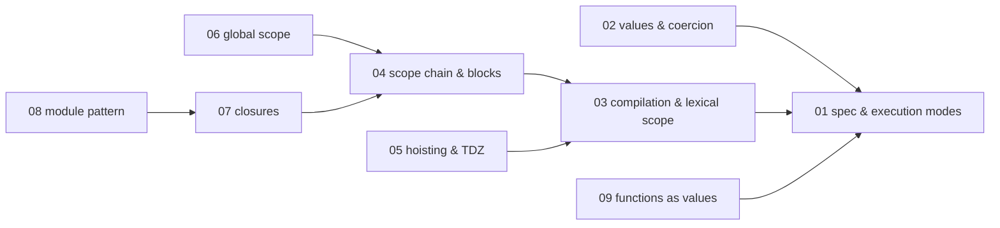
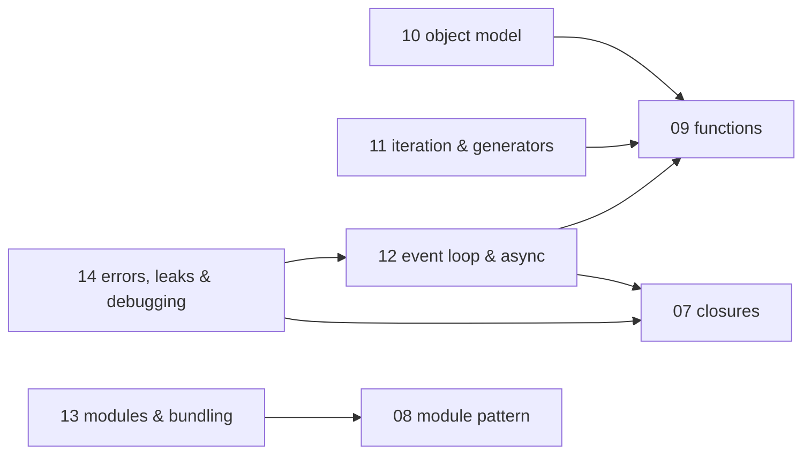
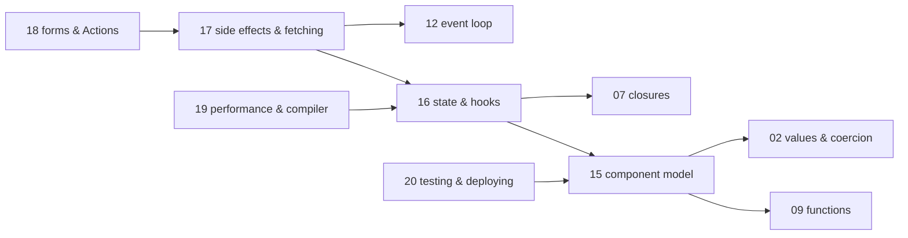
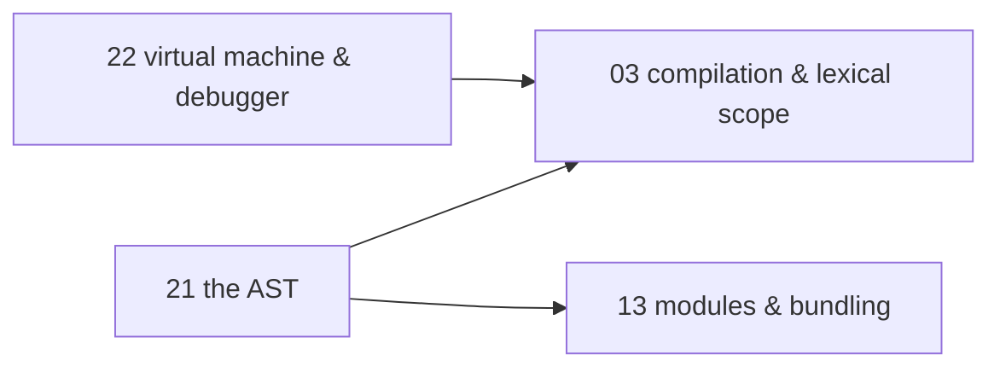

# JavaScript — knowledge graph

*The language runtime — scope, closures, the object model, and the event loop — extended into
React 19 as the framework this repo's fullstack track builds against.*

**Nodes:** 22 · **Books:** 4 · **Currency researched:** 2026-08-06, extended 2026-08-08
**Requires:** none — this is a root topic
**Feeds:** [`08_typescript`](../08_typescript/00_knowledge_graph.md)

---

## §1 Source audit

| Book | Year | Documents | Verdict |
|---|---|---|---|
| Simpson, *You Don't Know JS Yet: Get Started*, 2nd ed. | 2020 | The language survey: values, variables, functions, comparisons, iteration, closures, `this`, prototypes, and the three "pillars" (scope/closures, prototypes, types/coercion) | The right entry point and still accurate on mechanism — hoisting, coercion, prototypal delegation have not changed — but its feature inventory stops at ES2019. Six ECMAScript editions have shipped since |
| Simpson, *You Don't Know JS Yet: Scope & Closures*, 2nd ed. | 2020 | Compile-time versus runtime, lexical scope, the scope chain, shadowing, global scope, hoisting and the TDZ, block scoping, closures and their GC lifecycle, the module pattern (CommonJS and ESM) | The deepest source on this shelf for scope mechanics and closures; the compiler/scope-manager teaching model is engine-agnostic and has not dated. Its ESM chapter predates several years of Node module-resolution changes |
| Wieruch, *The Road to React: The React.js 19 with Hooks in JavaScript Book*, 2025 ed. | 2025 | Components, JSX, props/state, hooks (state, effect, custom, advanced/reducer), controlled components, conditional rendering, data fetching and re-fetching, forms and Actions, styling approaches, performance, TypeScript in React, testing, project structure, deployment | The freshest book in the whole repo and genuinely React-19-branded — it already teaches Vite over the deprecated Create React App and covers Actions-based forms. Its performance chapter (last updated January 2025) necessarily predates the React Compiler's October 2025 stable release |
| Wilson, *Software Design by Example* (JavaScript edition) | 2026 | Twenty-one chapters that each build a small working version of a tool: directory listing and callbacks, promises reconstructed from first principles, a unit-test framework, a file-backup system, data tables measured row-wise against column-wise, a pattern matcher, an expression parser, a page templater, a build manager, a layout engine, a file interpolator, a module loader, a style checker over the AST, a code generator, a documentation generator, a module bundler, a package manager, a register virtual machine, and a tracing debugger | Open-licensed, continuously revised, and its most recent commit at the time of this pass is dated 2026-05-31 — the only source here that is not a fixed printed edition. Unlike its Python twin, every chapter is complete prose; none is a stub. Its decisive contribution to this graph is the asynchronous-programming chapter, which builds promises from scratch and is the dedicated treatment `JS-12` previously recorded as missing from the shelf. Read it for how a mechanism works, not for what V8 does: the promises it builds are a teaching model, not the specification's job queue |

---

## §2 Node index

| ID | Node | Type | Depth | Currency |
|---|---|---|---|---|
| `JS-01` | Language identity, the spec process, and execution modes | Mechanism | L3 | `stale-minor` |
| `JS-02` | Primitive values, types, and coercion | Mechanism | L4 | `stale-minor` |
| `JS-03` | The compilation model and lexical scope | Mechanism | L4 | `current` |
| `JS-04` | The scope chain, shadowing, and block scoping | Mechanism | L4 | `current` |
| `JS-05` | Variable lifecycle: hoisting, the TDZ, and `var`/`let`/`const` | Mechanism | L4 | `current` |
| `JS-06` | Global scope and the `globalThis` unification | Mechanism | L3 | `current` |
| `JS-07` | Closures | Mechanism | L4 | `current` |
| `JS-08` | The module pattern: closures, CommonJS, and ESM | Mechanism | L4 | `current` |
| `JS-09` | Functions as values: declarations, expressions, and arrow forms | Mechanism | L3 | `current` |
| `JS-10` | The object model: the prototype chain, `this`, and class desugaring | Mechanism | L5 | `stale-minor` |
| `JS-11` | Iteration protocols and generators | Mechanism | L4 | `stale-minor` |
| `JS-12` | The event loop, microtasks, and async execution | Mechanism | L5 | `current` |
| `JS-13` | Module systems and the bundling/resolution boundary | Mechanism | L4 | `stale-minor` |
| `JS-14` | Errors, memory leaks, and production debugging | Practice | L4 | `absent` |
| `JS-15` | The React component model: JSX, rendering, and composition | Model | L4 | `current` |
| `JS-16` | State and the render cycle: hooks as an execution mechanism | Mechanism | L4 | `current` |
| `JS-17` | Side effects and data fetching in React | Mechanism | L4 | `stale-minor` |
| `JS-18` | Forms, Actions, and optimistic UI in React 19 | Mechanism | L4 | `current` |
| `JS-19` | React performance: manual memoization versus the compiler | Mechanism | L5 | `stale-major` |
| `JS-20` | Testing and deploying a React application | Practice | L3 | `current` |
| `JS-21` | The abstract syntax tree as a program-analysis surface | Mechanism | L4 | `stale-minor` |
| `JS-22` | Building a virtual machine and a tracing debugger | Mechanism | L5 | `current` |

---

## §3 The graph

### Execution model, scope, and values

### Objects, iteration, and asynchrony

### React: components, state, and delivery

### Programs as data

---

## §4 Node records

### `JS-01` · Language identity, the spec process, and execution modes
**Type:** Mechanism · **Depth:** L3
**Covers:** the yearly TC39 stage process, ECMA-262 as the specification of record, backwards-compatibility as a design constraint ("don't break the web"), transpilation and polyfills as a bridge, script versus module execution mode, strict mode semantics, the parse/compile/execute pipeline at a conceptual level
**Sources:** Simpson, *Get Started* ch.1, ch.2 §"Each File is a Program" (2020)
**Edges:** `composes` [`COMP-15`]
**Currency:** `stale-minor`
**Δ current:** *Get Started* (2020) surveys the language against roughly the ES2019 feature set. Six ECMAScript editions have shipped since: ES2020 (optional chaining, nullish coalescing), ES2022 (top-level await, class private fields via `#`, static initialization blocks), ES2023 (`Array.prototype.findLast`/`toReversed`), ES2024 (`Object.groupBy`/`Map.groupBy`, reaching TC39 stage 4 and shipping June 2024), and ES2025 (a new `Iterator` global with prototype helper methods). The yearly release process the book describes is itself unchanged and still the right mental model; an article on this node should keep that framing and simply refresh the feature inventory to the current edition rather than treat the process as dated.

### `JS-02` · Primitive values, types, and coercion
**Type:** Mechanism · **Depth:** L4
**Covers:** the seven primitive types, boxing, the `==` abstract equality algorithm step by step, `Object.is` and the `NaN`/`-0` edge cases, IEEE-754 consequences for arithmetic and money, `BigInt`, `Symbol`, template literals
**Sources:** Simpson, *Get Started* ch.2 §"Values", §"Comparisons" (2020)
**Edges:** `requires` [`JS-01`]
**Currency:** `stale-minor`
**Δ current:** The abstract equality algorithm itself (ECMA-262 §7.2.13) has not changed since the book's writing, so `==` coercion examples remain accurate verbatim. What the book predates: `Array.prototype.at` (ES2022, negative-index access without `arr[arr.length - 1]`) and `structuredClone` as a global (shipped in Node 17, 2022, and now the standard deep-clone primitive over the older `JSON.parse(JSON.stringify(...))` hack). An article should keep the coercion algorithm as written and add these two as the modern idioms built on top of it.

### `JS-03` · The compilation model and lexical scope
**Type:** Mechanism · **Depth:** L4
**Covers:** the compiler/engine/scope-manager conversation as a teaching model, parsing versus execution as separate phases, "cheating" at lexical scope (`eval`, `with`), the lexical-scope contract
**Sources:** Simpson, *Scope & Closures* ch.1 (2020)
**Edges:** `requires` [`JS-01`]
**Currency:** `current`

### `JS-04` · The scope chain, shadowing, and block scoping
**Type:** Mechanism · **Depth:** L4
**Covers:** the scope-chain lookup walk, illegal shadowing, function-name scope, arrow functions as scope-less forms, "least exposure" as a design principle, block scoping with `let`/`const`, Function-in-Block (FiB) behaviour
**Sources:** Simpson, *Scope & Closures* ch.2, ch.3, ch.6 (2020)
**Edges:** `requires` [`JS-03`]
**Currency:** `current`

### `JS-05` · Variable lifecycle: hoisting, the TDZ, and `var`/`let`/`const`
**Type:** Mechanism · **Depth:** L4
**Covers:** the creation-phase environment record, why nothing actually "moves", `var` initialised to `undefined` versus `let`/`const` recorded-but-uninitialised, re-declaration rules, the temporal dead zone as the window between context creation and declaration execution, the classic `var`-in-a-loop divergence from `let`
**Sources:** Simpson, *Scope & Closures* ch.5 (2020)
**Edges:** `requires` [`JS-03`]
**Currency:** `current`

### `JS-06` · Global scope and the `globalThis` unification
**Type:** Mechanism · **Depth:** L3
**Covers:** why global scope exists at all, the historical split between `window`, `self`, `global`, and `this` across environments, `globalThis` as the unifying reference, globals declared by `var`/function versus `let`/`const` at the top level
**Sources:** Simpson, *Scope & Closures* ch.4 (2020)
**Edges:** `requires` [`JS-04`]
**Currency:** `current`

### `JS-07` · Closures
**Type:** Mechanism · **Depth:** L4
**Covers:** a closure as a function retaining a reference to its environment record rather than a copy of a value, the closure lifecycle and what keeps an environment record alive for GC purposes, closures as a memory-retention source, the stale-closure bug in event handlers and timers
**Sources:** Simpson, *Scope & Closures* ch.7 (2020)
**Edges:** `requires` [`JS-04`] · `contrasts` [`PY-03`]
**Currency:** `current`

### `JS-08` · The module pattern: closures, CommonJS, and ESM
**Type:** Mechanism · **Depth:** L4
**Covers:** encapsulation via closure before any module syntax existed, the classic revealing-module pattern, Node's CommonJS `require`/`module.exports` as synchronous value-copying, ES modules as statically analysable with live bindings, why circular imports behave differently under each system, namespaces built from a function scope, and what a loader must do to let one module load another
**Sources:** Simpson, *Scope & Closures* ch.8 (2020) · Wilson, *Software Design by Example* ch."Module Loader" (2026) — a working `require` built from `eval` and a cache, including the circular-dependency case
**Edges:** `requires` [`JS-07`]
**Currency:** `current`

### `JS-09` · Functions as values: declarations, expressions, and arrow forms
**Type:** Mechanism · **Depth:** L3
**Covers:** function declaration versus function expression and hoisting differences between them, default and rest parameters, IIFEs, named versus anonymous function expressions, arrow-function syntax forms, generator-function syntax as a form (protocol semantics live on `JS-11`), functions passed as callbacks and why an anonymous function is the usual shape at a call site
**Sources:** Simpson, *Get Started* ch.2 §"Functions" (2020) · Wilson, *Software Design by Example* ch."Systems Programming" §§"What is a callback function?", "What are anonymous functions?" (2026)
**Edges:** `requires` [`JS-01`]
**Currency:** `current`

### `JS-10` · The object model: the prototype chain, `this`, and class desugaring
**Type:** Mechanism · **Depth:** L5
**Covers:** `[[Prototype]]` versus `.prototype` versus `__proto__`, the failed-lookup walk to `Object.prototype` and then `null`, the five `this`-binding rules in precedence order, what `class`/`extends`/`super` desugar to, `Object.defineProperty`, `Proxy`/`Reflect`, V8 hidden classes and inline-cache degradation
**Sources:** Simpson, *Get Started* ch.3 §"this Keyword", §"Prototypes" (2020)
**Edges:** `requires` [`JS-09`] · `contrasts` [`PY-01`]
**Currency:** `stale-minor`
**Δ current:** *Get Started* covers prototypal delegation but not the class-body syntax that has grown around it since 2020: public and private (`#`) class fields and static initialisation blocks both shipped in ES2022 (TC39 stage 4, June 2022), and the `accessor` auto-accessor keyword shipped in TypeScript 4.9 (November 2022) tracking a since-advanced TC39 decorators-adjacent proposal. An article on this node should lead with modern class-field syntax as the surface most engineers write today and treat the prototype chain underneath as the mechanism that explains it, rather than the reverse.

### `JS-11` · Iteration protocols and generators
**Type:** Mechanism · **Depth:** L4
**Covers:** the iterable/iterator protocol (`Symbol.iterator`), `for...of` versus `for...in`, generator functions as a suspendable frame implementing the protocol, delegation with `yield*`
**Sources:** Simpson, *Get Started* ch.3 §"Iteration" (2020)
**Edges:** `requires` [`JS-09`] · `contrasts` [`PY-07`]
**Currency:** `stale-minor`
**Δ current:** ECMAScript 2025 (the 16th edition) added a new global `Iterator` object with prototype helper methods — `.map`, `.filter`, `.take`, `.drop`, `.toArray`, and more — letting iterators be composed the way arrays are, without materialising an intermediate array. This is a genuinely new capability layered on top of the same iterator protocol the book describes; *Get Started* (2020) predates it by five editions. An article should teach the protocol as written, then close with the 2025 helper methods as the modern way to consume it.

### `JS-12` · The event loop, microtasks, and async execution
**Article:** [03_the_event_loop_microtasks_and_async.md](03_the_event_loop_microtasks_and_async.md)
**Type:** Mechanism · **Depth:** L5
**Covers:** the call stack, macrotask queue, and microtask queue; `process.nextTick`'s separate higher-priority queue; the promise state machine and what `.then` actually schedules; `async`/`await` desugared to promise scheduling; unhandled-rejection handling per environment; sequential `await` versus `Promise.all`/`allSettled` and bounded concurrency; `AbortController`
**Sources:** WHATWG HTML §8.1 (event loop processing model) · Node.js event-loop and `libuv` documentation · Wilson, *Software Design by Example* ch."Asynchronous Programming" (2026) — the one dedicated chapter on this shelf, which reconstructs the promise state machine from callbacks upward before reaching `async`/`await`
**Edges:** `requires` [`JS-07`, `JS-09`] · `contrasts` [`CONC-04`]
**Currency:** `current`

### `JS-13` · Module systems and the bundling/resolution boundary
**Type:** Mechanism · **Depth:** L4
**Covers:** tree shaking and the `"sideEffects": false` contract, dynamic `import()`, Node module resolution and the `exports` map as an encapsulation boundary, the dual-package hazard, what a bundler does structurally — finding the dependency graph, combining files without name collisions, rewriting cross-file access — source maps, file interpolation as the crude ancestor of bundling, semantic versioning and dependency resolution as a constraint-satisfaction problem
**Sources:** Simpson, *Scope & Closures* ch.8 (2020) · Wilson, *Software Design by Example* ch."Module Bundler", ch."Package Manager", ch."File Interpolator" (2026)
**Edges:** `requires` [`JS-08`]
**Currency:** `stale-minor`
**Δ current:** The book's CommonJS/ESM semantics are unchanged, but the import-time metadata syntax around modules has moved: import assertions (the `assert { type: "json" }` clause, TC39 stage 3 circa 2021) were superseded by import attributes (the `with { type: "json" }` clause), which reached TC39 stage 4 and shipped in Node starting at v20.10/v21 with `assert` deprecated in favour of `with`. Neither syntax existed when the book was written. An article should teach `with`, not `assert`.

### `JS-14` · Errors, memory leaks, and production debugging
**Type:** Practice · **Depth:** L4
**Covers:** custom `Error` subclasses and prototype restoration after `super()`, async stack-trace reconstruction and where it breaks at an `await` boundary, heap-snapshot diffing to find a retainer path, the three common leak shapes (unremoved listeners, uncleared timers, closures pinning large scopes), `--cpu-prof` for finding a synchronous hot function, `EventEmitter` back-pressure
**Sources:** —
**Edges:** `requires` [`JS-07`, `JS-12`] · `contrasts` [`PY-04`]
**Currency:** `absent`
**Δ current:** None of the three surveyed books treats production debugging as a topic — *Get Started* and *Scope & Closures* are language-fundamentals texts, and *The Road to React*'s performance chapter is React-specific rather than covering the V8 heap or CPU profiler generally. This is a real gap in the shelf, not a claim about the mechanism postdating anything: heap-snapshot diffing and `--cpu-prof` both predate every book here. See §6.

### `JS-15` · The React component model: JSX, rendering, and composition
**Type:** Model · **Depth:** L4
**Covers:** JSX as syntax sugar over `React.createElement`, function components, props and children, lists and the `key` prop, controlled components, fragments, reusable components and composition, imperative escape hatches (refs)
**Sources:** Wieruch, *Road to React* §"Fundamentals of React" (2025) · Wilson, *Software Design by Example* ch."Page Templates" (2026) — a template engine that walks a DOM with an environment stack, which is the machinery a JSX runtime hides
**Edges:** `requires` [`JS-09`, `JS-02`]
**Currency:** `current`

### `JS-16` · State and the render cycle: hooks as an execution mechanism
**Type:** Mechanism · **Depth:** L4
**Covers:** `useState` and the render-triggering update queue, lifting state up, controlled inputs as a state/handler pairing, `useReducer` and discriminated action shapes, avoiding impossible states, the stale-closure bug as it appears specifically inside a hook body
**Sources:** Wieruch, *Road to React* §"React State", §"React Advanced State", §"React Impossible States" (2025)
**Edges:** `requires` [`JS-15`, `JS-07`]
**Currency:** `current`

### `JS-17` · Side effects and data fetching in React
**Type:** Mechanism · **Depth:** L4
**Covers:** `useEffect`'s dependency array and cleanup function, custom hooks that extract fetching logic, race conditions in overlapping fetches, memoized fetch functions, third-party HTTP clients, `async`/`await` inside an effect
**Sources:** Wieruch, *Road to React* §"React Side-Effects", §"React Custom Hooks", §"Data Fetching with React", §"Data Re-Fetching in React", §"Third-Party Libraries in React" (2025)
**Edges:** `requires` [`JS-16`, `JS-12`]
**Currency:** `stale-minor`
**Δ current:** The book teaches fetching from inside `useEffect`, which is exactly the pattern the React team's own current documentation steers away from: the react.dev guide "You Might Not Need an Effect" recommends a framework's built-in data layer (Next.js, Remix) or a client-side cache such as TanStack Query for anything beyond a toy fetch, because caching, request deduplication, and network-waterfall avoidance are difficult to get right with a bare effect. An article on this node should keep the `useEffect` walkthrough as the mechanism explanation — it is still exactly how those libraries work underneath — but state plainly that hand-rolled effect fetching is not the recommended production pattern as of the current react.dev guidance.

### `JS-18` · Forms, Actions, and optimistic UI in React 19
**Type:** Mechanism · **Depth:** L4
**Covers:** the `action` prop on `<form>`, Server Actions and client Actions, `useActionState`, `useOptimistic` for showing a provisional result while a transition is pending, the `use` API for reading a promise or context during render
**Sources:** Wieruch, *Road to React* §"Forms in React", §"Forms with Actions" (2025)
**Edges:** `requires` [`JS-17`]
**Currency:** `current`

### `JS-19` · React performance: manual memoization versus the compiler
**Type:** Mechanism · **Depth:** L5
**Covers:** `useMemo`/`useCallback`/`React.memo` and the referential-equality problem they solve, the render-cascade shape that makes memoization necessary at all, profiling with the React DevTools profiler
**Sources:** Wieruch, *Road to React* §"Performance in React (Advanced)" (2025)
**Edges:** `requires` [`JS-16`]
**Currency:** `stale-major`
**Δ current:** The book's own last-updated date is January 30, 2025. The React Compiler reached its 1.0 stable release on October 7–8, 2025 at React Conf, described by the React team as production-ready and battle-tested at Meta, and by 2026 tooling partners (Vite, Next.js, Expo) ship it enabled by default in new projects. The compiler auto-memoizes components and values at build time, which is a substantially different mechanism from the book's manual `useMemo`/`useCallback` discipline — not a syntax change but a different place where the optimisation decision gets made. An article on this node should lead with the compiler as the 2026 default and treat manual memoization as the escape hatch for the cases the compiler opts out of, reversing the book's emphasis.

### `JS-20` · Testing and deploying a React application
**Type:** Practice · **Depth:** L3
**Covers:** component testing strategy, project structure for a growing codebase, the production build step, static hosting deployment, what a test framework does underneath — registration, execution and reporting as three separable concerns
**Sources:** Wieruch, *Road to React* §"Testing in React", §"React Project Structure", §"Deploying a React Application" (2025) · Wilson, *Software Design by Example* ch."Unit Testing" (2026)
**Edges:** `requires` [`JS-15`]
**Currency:** `current`

### `JS-21` · The abstract syntax tree as a program-analysis surface
**Type:** Mechanism · **Depth:** L4
**Covers:** parsing source to an ESTree-shaped AST with Acorn, walking that tree with a visitor and why traversal and action are separated, writing a check that finds what a regular expression cannot, transforming the tree and regenerating source, instrumenting a function by replacing it with a wrapper that counts or times calls, extracting documentation comments and matching them to the declarations they describe, the boundary where static analysis stops and running the program starts
**Sources:** Wilson, *Software Design by Example* ch."Style Checker", ch."Code Generator", ch."Documentation Generator" (2026)
**Edges:** `requires` [`JS-03`, `JS-13`] · `contrasts` [`JS-22`]
**Currency:** `stale-minor`
**Δ current:** The ESTree shape and the Acorn parser the chapters build on are unchanged, and the visitor mechanism they teach is exactly what every JavaScript analysis tool still does internally. Two things around it moved. ESLint v9.0.0 (April 2024) made flat `eslint.config.js` the default configuration format and deprecated `.eslintrc.*`, so a plugin written against the older configuration model no longer loads without setting `ESLINT_USE_FLAT_CONFIG=false`. More significantly, the tools most projects now run are not written in JavaScript at all: Biome and Oxc reimplement parsing and linting in Rust, and Biome specifically produces a concrete syntax tree rather than an abstract one because it also formats. An article should teach the AST as the way to understand and extend analysis, and state plainly that a production linter's speed comes from not being a JavaScript program.

### `JS-22` · Building a virtual machine and a tracing debugger
**Type:** Mechanism · **Depth:** L5
**Covers:** designing an instruction set, assembling symbolic instructions into numbers, the fetch-decode-execute loop, registers as the machine's storage against a stack, addressing memory and storing arrays, what a debugger has to intercept to single-step, breakpoints as a filter on the instruction stream, an interactive read-eval-print loop over a paused machine, and how to test an interactive tool by scripting its input and capturing its output
**Sources:** Wilson, *Software Design by Example* ch."Virtual Machine", ch."Debugger", ch."Parsing Expressions" (2026)
**Edges:** `requires` [`JS-03`] · `contrasts` [`JS-21`]
**Currency:** `current`

---

## §5 Cross-subject edges

| From | Edge | To | Why |
|---|---|---|---|
| `JS-01` | `composes` | `COMP-15` | The language spec and its execution modes are one realisation of "the web stack" node — JS is the scripting layer that node describes alongside HTTP and markup |
| `JS-07` | `contrasts` | `PY-03` | Both closures close over an environment by reference rather than by value; JavaScript exposes the mechanism as `__closure__`-equivalent cells reachable from DevTools, Python's are reachable via `__closure__` cell objects — same idea, different introspection story |
| `JS-10` | `contrasts` | `PY-01` | Prototype-chain delegation versus Python's `__getattribute__`/MRO-based attribute lookup are the two dominant answers to "how does a language resolve `obj.x`" and are best taught against each other |
| `JS-11` | `contrasts` | `PY-07` | Both languages implement the same iterator-protocol idea (`Symbol.iterator`/`next()` versus `__iter__`/`__next__`) with generators as the ergonomic sugar over a hand-written iterator in both |
| `JS-12` | `contrasts` | `CONC-04` | The microtask/macrotask event loop and the asyncio event loop are structurally the same idea — a single-threaded scheduler multiplexing suspended continuations — with different queue names and different starvation failure modes |
| `JS-14` | `contrasts` | `PY-04` | V8's generational, non-deterministic garbage collector versus CPython's deterministic reference counting plus a cyclic collector produce different leak signatures and different debugging tools for what is conceptually the same problem |

---

## §6 Coverage gaps

Nothing in the three surveyed books treats the V8 heap profiler, `--cpu-prof`, or systematic production
debugging (`JS-14`) as a subject — *Get Started* and *Scope & Closures* stop at language fundamentals,
and *The Road to React*'s "Performance in React" chapter is scoped to component re-renders, not the
underlying engine. Chrome DevTools' own heap-snapshot and CPU-profiling documentation would close this,
and the article for `JS-14` should teach the technique by citing that documentation directly: growing a
deliberate leak, diffing two snapshots, and reading the retainer path DevTools reports.

The Road to React's TOC lists "TypeScript in React" as a chapter (p200) but no chapter naming React 19's
`use` hook explicitly, despite the book's React-19 branding. Per KG_SPEC §2, only the TOC was read for
this file, not the chapter prose, so whether `use()` is covered under a different heading (most likely
inside "React Asynchronous Data" or "Explicit Data Fetching") could not be established from the table of
contents alone. `JS-18`'s `Covers:` line includes `use()` on the strength of the React 19 release notes
(react.dev, December 5, 2024) rather than on confirmed book coverage; whoever writes the module for this
node should verify against the book text directly before treating the chapter as a source for it.

Angular is out of scope for this file entirely — it belongs to whichever subject eventually covers
component-framework alternatives to React, which does not yet exist in this repo. `JS-19`'s "TypeScript
in React" TOC entry and any Angular-specific material in the source books are left uncited here.

**One gap recorded in an earlier pass has since closed.** `JS-12` previously carried the note that no
book on this shelf treated the event loop as a dedicated chapter, and cited only the WHATWG and Node
documentation. *Software Design by Example*'s "Asynchronous Programming" chapter is that treatment: it
starts from callbacks, reconstructs the promise state machine, chains operations, and only then
reaches `async`/`await`, which is the same build-up order a module on that node needs. It is now cited
there. Two limits are worth stating rather than discovering later. The chapter builds a teaching model
of a promise, not the specification's job queue, so the microtask-versus-macrotask ordering and
`process.nextTick`'s separate higher-priority queue still have to come from the WHATWG and Node
documentation. And it says nothing about `AbortController` or unhandled-rejection handling, both of
which remain on `JS-12`'s `Covers` line on the strength of the specifications alone.

**Seven of the twenty-one chapters in the JavaScript edition are deliberately uncited**, and each has
a home elsewhere rather than a gap here. "File Backup" and "Pattern Matching" are algorithm and
file-format work. "Build Manager" is a topological sort over a dependency graph, which is `DSA-10`
material written in JavaScript. "Data Tables" measures row-wise against column-wise storage, which is
a memory-layout question this subject has no node for and `09_sql`'s storage material covers properly.
"Layout Engine" builds a box model with sizing, positioning, rendering and wrapping — genuinely
interesting, and genuinely browser-rendering rather than language, so it belongs under `COMP-15`, the
node `JS-01` already `composes`. Adding a layout node here was considered and rejected on that ground:
the subject is the language runtime extended into React, and a node whose real prerequisite sits in
another subject would be misfiled. "Systems Programming" is cited on `JS-09` for its callback sections
only; its directory-traversal and file-copying material is Node standard-library usage rather than
language mechanism. "Conclusion" is a hundred-and-thirty-word closing note with no technical content.

← [repo index](../README.md) · [root graph](../KNOWLEDGE_GRAPH.md) · [writing contract](../AGENTS.md)
