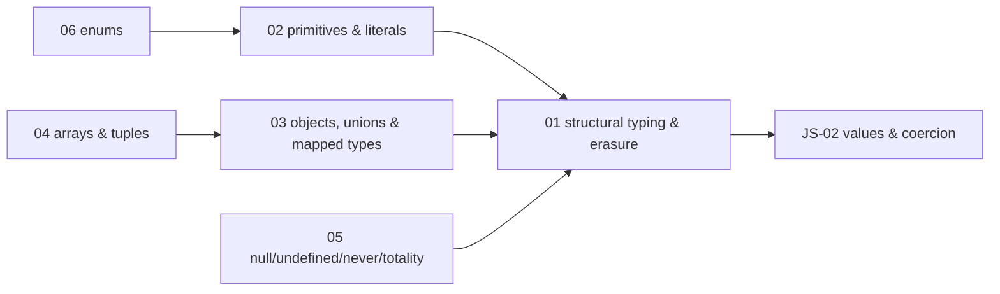
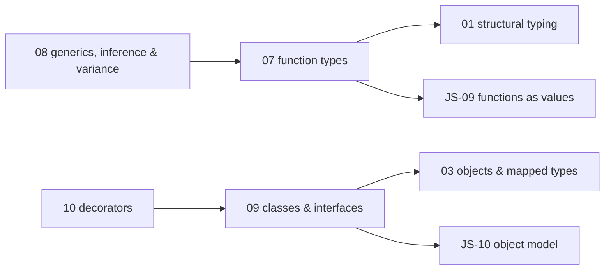
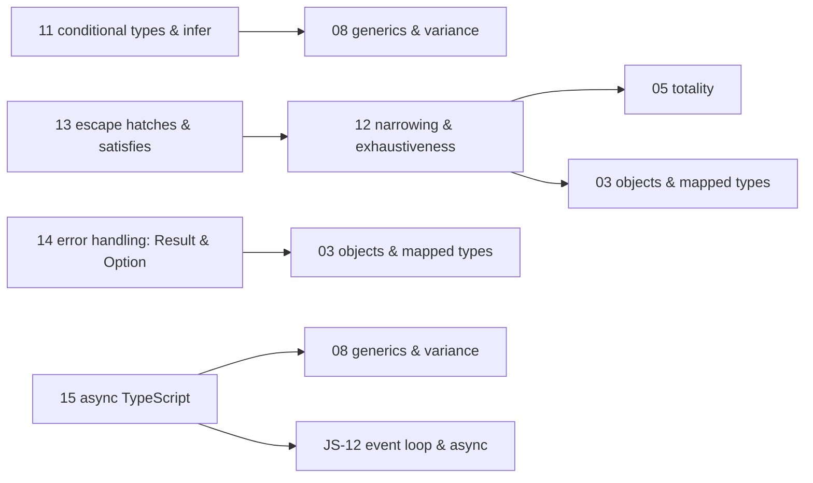
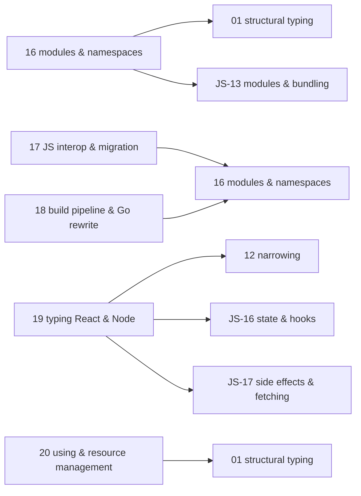

# TypeScript — knowledge graph

*The structural type system layered over JavaScript's object model — erasure, inference, and the
compiler pipeline that turned from a JavaScript program into a Go binary in 2026.*

**Nodes:** 20 · **Books:** 1 · **Currency researched:** 2026-08-06
**Requires:** [`07_javascript`](../07_javascript/00_knowledge_graph.md)
**Feeds:** none yet

---

## §1 Source audit

| Book | Year | Documents | Verdict |
|---|---|---|---|
| Cherny, *Programming TypeScript* | 2019 | The full compiler and type-system surface against TypeScript ~3.x: primitive and object types, generics and polymorphism, classes and interfaces, variance and assignability, conditional types, error handling, async programming, namespaces/modules, JavaScript interop, and the build pipeline | The only book-length TypeScript treatment on this shelf and still the best available exposition of the type-system *mechanics* — variance, assignability, structural typing — because those have not moved. It is now four major versions behind (TypeScript is at 7.0 as of August 2026) and predates every headline feature added since 4.0: variadic tuples, template literal types, `satisfies`, `const` type parameters, standardised decorators, and explicit resource management. Its build-pipeline chapter describes a compiler architecture the current release no longer uses |

---

## §2 Node index

| ID | Node | Type | Depth | Currency |
|---|---|---|---|---|
| `TS-01` | Structural typing and type erasure | Mechanism | L4 | `stale-minor` |
| `TS-02` | The primitive and literal type system | Mechanism | L3 | `current` |
| `TS-03` | Object types, unions, intersections, and mapped types | Structure | L4 | `stale-minor` |
| `TS-04` | Arrays, tuples, and variadic tuple types | Structure | L4 | `stale-minor` |
| `TS-05` | Bottom and empty types: `null`, `undefined`, `void`, `never`, and totality | Mechanism | L4 | `current` |
| `TS-06` | Enums and their alternatives | Structure | L3 | `stale-minor` |
| `TS-07` | Function types: declaration, overloads, and contextual typing | Mechanism | L4 | `current` |
| `TS-08` | Generics, inference, and variance | Mechanism | L5 | `current` |
| `TS-09` | Classes, interfaces, and structural inheritance | Mechanism | L4 | `stale-minor` |
| `TS-10` | Decorators: the legacy flag and the TC39 standard | Mechanism | L4 | `stale-major` |
| `TS-11` | Conditional and mapped types, and the `infer` keyword | Mechanism | L5 | `current` |
| `TS-12` | Type narrowing, guards, and exhaustiveness checking | Mechanism | L4 | `stale-minor` |
| `TS-13` | Escape hatches: assertions and `satisfies` | Mechanism | L4 | `stale-minor` |
| `TS-14` | Error handling patterns: exceptions, Result, and Option | Model | L4 | `current` |
| `TS-15` | Asynchronous TypeScript: promises, `async`/`await`, and typesafe concurrency | Mechanism | L4 | `stale-minor` |
| `TS-16` | Modules, namespaces, and the resolution model | Mechanism | L4 | `stale-major` |
| `TS-17` | Interop with JavaScript: declaration files and gradual migration | Practice | L4 | `current` |
| `TS-18` | The build pipeline: compiler targets, project references, and the Go rewrite | Tool | L4 | `stale-major` |
| `TS-19` | Typing React and Node applications | Practice | L4 | `stale-major` |
| `TS-20` | Explicit resource management with `using` | Mechanism | L4 | `absent` |

---

## §3 The graph

### Type fundamentals

### Functions, generics, and classes

### Narrowing, errors, and async

### Modules, tooling, and the application boundary

---

## §4 Node records

### `TS-01` · Structural typing and type erasure
**Type:** Mechanism · **Depth:** L4
**Covers:** structural versus nominal assignability, why two identically shaped named types are freely interchangeable, `interface` versus `type` alias capability differences, declaration merging, the excess-property check and when it silently does not fire, `tsc` as internal-consistency checking rather than soundness or runtime validation, branded types simulating nominality
**Sources:** Cherny ch.2 §"The Type System", ch.5 §"Classes Are Structurally Typed", ch.6 §"Simulating Nominal Types" (2019)
**Edges:** `requires` [`JS-02`] · `contrasts` [`PY-06`]
**Currency:** `stale-minor`
**Δ current:** Type erasure itself is unchanged as a design principle — `interface` and `type` still emit nothing at runtime. What the book could not anticipate is that erasure is no longer only a `tsc` build-time concept: Node.js added `--experimental-strip-types` in v22.6 (August 2024), and type stripping reached stable status in Node v24.12 and v25.2 (late 2025), meaning plain `.ts` files with erasable syntax run directly under `node` with no build step at all. An article on this node should still open with the erasure argument as written, then close with native runtime stripping as the reason erasure now matters even for people who never touch `tsc` directly.

### `TS-02` · The primitive and literal type system
**Type:** Mechanism · **Depth:** L3
**Covers:** `any`, `unknown`, `boolean`, `number`, `bigint`, `string`, `symbol`, literal types, type widening at mutable declaration sites, `as const` narrowing back to literals
**Sources:** Cherny ch.3 §"The ABCs of Types" (2019)
**Edges:** `requires` [`TS-01`]
**Currency:** `current`

### `TS-03` · Object types, unions, intersections, and mapped types
**Type:** Structure · **Depth:** L4
**Covers:** object type syntax, type aliases, union and intersection types, the `Record` type, mapped types, key remapping with an `as` clause, the companion object pattern, type operators over object types
**Sources:** Cherny ch.3 §"Objects", §"Intermission: Type Aliases, Unions, and Intersections", ch.6 §"Advanced Object Types" (2019)
**Edges:** `requires` [`TS-01`]
**Currency:** `stale-minor`
**Δ current:** Two capabilities the book cannot cover reached general availability afterward: template literal types (TypeScript 4.1, November 2020), which let a string type be built from unions the way a template literal builds a string value, and key remapping in mapped types via an `as` clause in the same 4.1 release, which lets a mapped type rename its keys rather than only transform its values. Both are now common in typing utility libraries and API-shape derivation. An article should introduce mapped types as the book does, then extend into template literal types as the mechanism that makes key remapping expressive.

### `TS-04` · Arrays, tuples, and variadic tuple types
**Type:** Structure · **Depth:** L4
**Covers:** array types, tuple types with fixed length and per-position types, optional tuple elements, labelled tuple elements, spreading a generic tuple type
**Sources:** Cherny ch.3 §"Arrays", §"Tuples" (2019)
**Edges:** `requires` [`TS-03`]
**Currency:** `stale-minor`
**Δ current:** Variadic tuple types shipped in TypeScript 4.0 (August 2020), a year after the book: a spread inside a tuple type can now be generic, and rest elements are allowed anywhere in a tuple rather than only at the end. This is the mechanism behind precisely-typed `Function.prototype.bind`, curry, and concat helpers, none of which the book's tuple chapter could express. An article should present fixed tuples first, exactly as the book does, then build a generic parameter-splitting helper as the payoff for variadic tuples.

### `TS-05` · Bottom and empty types: `null`, `undefined`, `void`, `never`, and totality
**Type:** Mechanism · **Depth:** L4
**Covers:** the distinction between `void` (a function that returns nothing meaningful) and `never` (a function that never returns at all), `null`/`undefined` under `strictNullChecks`, totality as a design goal for functions and switch statements
**Sources:** Cherny ch.3 §"null, undefined, void, and never", ch.6 §"Totality" (2019)
**Edges:** `requires` [`TS-01`]
**Currency:** `current`

### `TS-06` · Enums and their alternatives
**Type:** Structure · **Depth:** L3
**Covers:** numeric and string enums, `const enum` inlining and its cross-package version-coupling pitfall, ambient enums
**Sources:** Cherny ch.3 §"Enums" (2019)
**Edges:** `requires` [`TS-02`]
**Currency:** `stale-minor`
**Δ current:** The enum feature itself has not been removed, but the TypeScript handbook's own current guidance has shifted: the "Const enum pitfalls" section of the official docs and the wider TypeScript team steer new code toward a union of string-literal types, or an `as const` object plus `typeof`/`keyof`, over `enum`. `const enum` in particular is explicitly discouraged for library code because it requires the consuming project to share the same TypeScript version and settings. The book teaches `enum` as an unremarkable default; an article on this node should present the `as const` alternative as the modern recommendation and explain what enums still do that a literal union cannot (a namespace of both a type and a set of runtime values, without a separate object literal).

### `TS-07` · Function types: declaration, overloads, and contextual typing
**Type:** Mechanism · **Depth:** L4
**Covers:** call signatures, optional and default parameters, rest parameters, typing `this` in a function, `call`/`apply`/`bind` signatures, contextual typing from a callback's expected position, overloaded function types
**Sources:** Cherny ch.4 §"Declaring and Invoking Functions" (2019)
**Edges:** `requires` [`TS-01`] · `requires` [`JS-09`]
**Currency:** `current`

### `TS-08` · Generics, inference, and variance
**Article:** [02_generics_inference_and_variance.md](02_generics_inference_and_variance.md)
**Type:** Mechanism · **Depth:** L5
**Covers:** generic function and type-alias declarations, where generics can be declared and when they are bound, inference-site priority, bounded polymorphism with `extends`, generic defaults, `const` type parameters, subtype/supertype relationships, parameter contravariance and return covariance under `strictFunctionTypes`, method bivariance as a deliberate legacy exception, array covariance as a deliberate unsoundness, `satisfies` as the modern way to check without widening
**Sources:** Cherny ch.4 §"Polymorphism", ch.6 §"Relationships Between Types" (2019)
**Edges:** `requires` [`TS-07`]
**Currency:** `current`

### `TS-09` · Classes, interfaces, and structural inheritance
**Type:** Mechanism · **Depth:** L4
**Covers:** class declarations and inheritance, `super`, `this` as a return type, interfaces and declaration merging, implementing an interface versus extending an abstract class, classes as declaring both a value and a type simultaneously, mixins, the factory and builder design patterns, simulating `final` classes
**Sources:** Cherny ch.5 §"Classes and Interfaces" (2019)
**Edges:** `requires` [`TS-03`] · `requires` [`JS-10`]
**Currency:** `stale-minor`
**Δ current:** TypeScript 4.9 (November 2022) added `accessor` auto-accessors as a new class-member kind — a field that compiles to a private backing field plus a generated getter/setter pair — which postdates the book's treatment of getters and setters as something written by hand. The structural-inheritance and mixin material otherwise stands as written.

### `TS-10` · Decorators: the legacy flag and the TC39 standard
**Type:** Mechanism · **Depth:** L4
**Covers:** class, method, accessor, and field decorators; decorator factories; metadata reflection
**Sources:** Cherny ch.5 §"Decorators" (2019)
**Edges:** `requires` [`TS-09`]
**Currency:** `stale-major`
**Δ current:** The book teaches decorators exclusively under the `experimentalDecorators` compiler flag, which predates TC39 standardisation entirely. TypeScript 5.0 (March 2023) shipped support for the TC39 Stage 3 decorators proposal as the new default syntax — decorators no longer require any flag to parse — with a type-checking and emit model different enough that existing `experimentalDecorators` code is not generally compatible with it, and the new form cannot decorate parameters or be combined with `--emitDecoratorMetadata`. `--experimentalDecorators` still exists for legacy code but is not where new code should start. As of 2026 the TC39 proposal remains at Stage 3, not finished — an article should name this precisely rather than call decorators a settled part of the language, and should teach the Stage 3 form as the default with the legacy flag flagged explicitly as legacy.

### `TS-11` · Conditional and mapped types, and the `infer` keyword
**Type:** Mechanism · **Depth:** L5
**Covers:** conditional type syntax, distributive conditional types over a union, `infer` for binding a type variable during matching, the built-in conditional types (`ReturnType`, `Awaited`, and similar) built from the same mechanism
**Sources:** Cherny ch.6 §"Conditional Types" (2019)
**Edges:** `requires` [`TS-08`]
**Currency:** `current`

### `TS-12` · Type narrowing, guards, and exhaustiveness checking
**Type:** Mechanism · **Depth:** L4
**Covers:** control-flow narrowing, discriminated unions on a literal tag, user-defined type predicates (`x is T`) and the trust the compiler places in them, `never` as the exhaustiveness-checking idiom in a `switch` default branch
**Sources:** Cherny ch.6 §"Refinement", §"User-Defined Type Guards" (2019)
**Edges:** `requires` [`TS-05`] · `requires` [`TS-03`]
**Currency:** `stale-minor`
**Δ current:** Narrowing itself has grown more capable since the book: TypeScript 4.4 (August 2021) added control-flow analysis of aliased conditions and discriminants, so narrowing survives being destructured into a local `const` first, which it previously did not; TypeScript 4.9 (November 2022) added narrowing via the `in` operator even for a property not listed on the type at all. Both make narrowing work in places the book's examples would have required a manual type predicate.

### `TS-13` · Escape hatches: assertions and `satisfies`
**Type:** Mechanism · **Depth:** L4
**Covers:** type assertions (`as`) and their limits, non-null assertions (`!`), definite assignment assertions, the trade-off each escape hatch makes between compiler trust and runtime safety
**Sources:** Cherny ch.6 §"Escape Hatches" (2019)
**Edges:** `requires` [`TS-12`]
**Currency:** `stale-minor`
**Δ current:** The `satisfies` operator, TypeScript's fourth escape hatch, shipped in 4.9 (November 15, 2022) and postdates the book entirely: it checks a value's conformance to a type without widening the value's inferred type the way an annotation does, and without discarding checking the way `as` does. An article should present `as`, `!`, and definite assignment exactly as the book frames them — each trading checking for control — then add `satisfies` as the newer hatch that avoids the trade for the specific case of literal-preserving validation.

### `TS-14` · Error handling patterns: exceptions, Result, and Option
**Type:** Model · **Depth:** L4
**Covers:** returning `null` on failure and its caller-forgets-to-check cost, throwing exceptions and what a function's type signature fails to communicate about them, returning an exception value instead of throwing it, the `Option`/`Maybe` type as a total alternative to a nullable return
**Sources:** Cherny ch.7 (2019)
**Edges:** `requires` [`TS-03`]
**Currency:** `current`

### `TS-15` · Asynchronous TypeScript: promises, `async`/`await`, and typesafe concurrency
**Type:** Mechanism · **Depth:** L4
**Covers:** typing callbacks, typing a `Promise<T>` and its rejection channel, `async`/`await` typing, typed event emitters, typesafe Web Workers and Node child-process messaging
**Sources:** Cherny ch.8 (2019)
**Edges:** `requires` [`TS-08`] · `requires` [`JS-12`] · `contrasts` [`CONC-04`]
**Currency:** `stale-minor`
**Δ current:** `Promise.withResolvers()`, a static method returning a promise together with its own `resolve`/`reject` functions without the executor-callback indirection, reached ECMAScript 2024 (TC39 stage 4, completed early 2024) and postdates the book's promise-typing chapter, which still routes every example through `new Promise((resolve, reject) => ...)`. The rest of the chapter's typing approach for callbacks and promises is unaffected.

### `TS-16` · Modules, namespaces, and the resolution model
**Type:** Mechanism · **Depth:** L4
**Covers:** the history of JavaScript module systems, `import`/`export` syntax, dynamic imports, CommonJS and AMD interop, module mode versus script mode, TypeScript namespaces, namespace collisions, declaration merging across namespaces
**Sources:** Cherny ch.10 (2019)
**Edges:** `requires` [`TS-01`] · `requires` [`JS-13`]
**Currency:** `stale-major`
**Δ current:** The book treats namespaces as a normal, live alternative to modules. TypeScript 6.0 (March 23, 2026) hard-deprecated the legacy `module` keyword syntax for namespaces and deprecated `--moduleResolution node` (`node10`) in favour of `nodenext` or `bundler`, with the 6.0 announcement stating outright that "TypeScript 7.0 will not support any of these deprecated options" — and 7.0 (GA July 8, 2026) is the release this repo currently targets. An article on this node should teach ES module `import`/`export` as the only code-organisation mechanism worth writing today, cover namespaces only as a legacy-code reading skill, and use `moduleResolution: "bundler"` or `"nodenext"` in every example rather than the book's implicit `node10`.

### `TS-17` · Interop with JavaScript: declaration files and gradual migration
**Type:** Practice · **Depth:** L4
**Covers:** ambient type, variable, and module declarations, the four-step gradual migration from JavaScript to TypeScript (add `tsc`, optionally typecheck JS, optionally add JSDoc, rename files, turn on `strict`), type lookup for plain JavaScript, consuming a package that ships its own types versus one covered by DefinitelyTyped versus one with neither
**Sources:** Cherny ch.11 (2019)
**Edges:** `requires` [`TS-16`]
**Currency:** `current`

### `TS-18` · The build pipeline: compiler targets, project references, and the Go rewrite
**Type:** Tool · **Depth:** L4
**Covers:** project layout and build artifacts, compile targets, source maps, project references for multi-package builds, triple-slash directives, publishing a package to npm, running TypeScript on the server versus in the browser
**Sources:** Cherny ch.12 (2019)
**Edges:** `requires` [`TS-16`]
**Currency:** `stale-major`
**Δ current:** The book describes `tsc` as a JavaScript program compiling JavaScript-syntax types. That description stopped being true in 2026: TypeScript 6.0 (March 23, 2026) was the last release on the original JavaScript-based compiler, and TypeScript 7.0 (general availability July 8, 2026) replaced it with a from-scratch port to Go, reported by Microsoft as roughly 10x faster on full builds — one benchmark cited a VS Code codebase type-check falling from 125.7 seconds on 6.0 to 10.6 seconds on 7.0. Separately, `target: "es5"` and `--outFile` were deprecated in 6.0 and are gone as accepted options in 7.0. As of the 7.0 release, editor tooling built on the old programmatic API — Vue, Angular templates, Svelte, Astro, MDX, and Volar-based integrations generally — cannot yet run on it, with a stable 7.x API expected in a 7.1 follow-up. An article on this node should treat the Go compiler as the current baseline and the book's "Building Your TypeScript Project" chapter as describing the compiler generation it replaced.

### `TS-19` · Typing React and Node applications
**Type:** Practice · **Depth:** L4
**Covers:** typing props, children, and generic components, hooks typing (`useState` inference, a discriminated-union `useReducer`, the `useRef` overload set), typed event handlers, `@types/node`, per-target `tsconfig` files
**Sources:** Cherny ch.9 (2019)
**Edges:** `requires` [`TS-12`] · `requires` [`JS-16`] · `requires` [`JS-17`]
**Currency:** `stale-major`
**Δ current:** Both frameworks the book's chapter names have moved past recognition. React 19 (December 5, 2024) makes `ref` an ordinary prop on function components, so the book's `forwardRef`-plus-generic-parameter pattern for a typed ref-forwarding component is no longer the default shape — `forwardRef` itself is documented by the React team as slated for future deprecation now that ref-as-prop exists. Angular, covered here as "Angular 6/7", introduced Signals as a new reactivity primitive in v16 (May 3, 2023) and stabilised them in v17 (November 2023), changing the framework's core typing surface (`signal<T>()`, `computed()`) in a way the book's Angular section, built around `@Input`/`@Output` decorators and Zone.js-driven change detection, does not anticipate. An article on this node should be rewritten against current React and, if Angular is kept at all, against its signals-based API rather than the six-year-old decorator-based one.

### `TS-20` · Explicit resource management with `using`
**Type:** Mechanism · **Depth:** L4
**Covers:** the `Symbol.dispose`/`Symbol.asyncDispose` protocol, `using` and `await using` declarations, the `Disposable`/`AsyncDisposable` global types, `DisposableStack`/`AsyncDisposableStack` for composing multiple cleanups, scoped automatic cleanup as an alternative to manual `try`/`finally`
**Sources:** —
**Edges:** `requires` [`TS-01`]
**Currency:** `absent`
**Δ current:** This node postdates the book outright: TypeScript 5.2 (August 24, 2023) shipped support for the then-in-progress ECMAScript Explicit Resource Management proposal, four years after Cherny's 2019 edition. The mechanism gives JavaScript and TypeScript a first-class way to guarantee cleanup — closing a file handle, a database connection, or a network socket — scoped to a block, the same shape as Python's `with` statement or C#'s `using`, and it is the natural target for a `contrasts` edge once a Python resource-management node exists to point at. No book on this shelf documents it; the TypeScript 5.2 release notes and the TC39 proposal repository are the only sources.

---

## §5 Cross-subject edges

| From | Edge | To | Why |
|---|---|---|---|
| `TS-01` | `requires` | `JS-02` | Structural typing describes the shape of JavaScript's runtime values, so the primitive/coercion mechanics of `JS-02` have to already mean something before "shape" is a well-defined idea |
| `TS-01` | `contrasts` | `PY-06` | TypeScript's structural typing and Python's `typing.Protocol` are the same idea — assignability by shape rather than by declared ancestry — arrived at from opposite starting points (an erased type system bolted onto JS versus an optional runtime-checkable system bolted onto Python) |
| `TS-07` | `requires` | `JS-09` | Typing a function signature presupposes the function-value forms (declarations, expressions, arrow functions, rest/default parameters) that `JS-09` establishes |
| `TS-09` | `requires` | `JS-10` | TypeScript's class and interface typing is a type layer over the prototype-based object model `JS-10` describes; `super`, structural class compatibility, and mixins only make sense once the underlying prototype chain does |
| `TS-15` | `requires` | `JS-12` | Typing a promise or an `async` function is meaningless without the event-loop and microtask-scheduling model `JS-12` establishes first |
| `TS-15` | `contrasts` | `CONC-04` | TypeScript's promise/`async`-`await` typing and Python's asyncio typing (`Coroutine`, `Awaitable`) type-check the same underlying single-threaded-scheduler concurrency model through two different gradual type systems |
| `TS-16` | `requires` | `JS-13` | TypeScript's module resolution settings (`nodenext`, `bundler`) configure how `tsc` interprets exactly the CommonJS/ESM/bundler resolution behaviour `JS-13` describes at the JavaScript level; the type layer adds nothing new to resolve, it only has to match it |
| `TS-19` | `requires` | `JS-16` | Typing `useState`/`useReducer` requires knowing what those hooks do at runtime first, which is `JS-16`'s subject |
| `TS-19` | `requires` | `JS-17` | Typing a data-fetching custom hook or an effect's cleanup function requires the side-effect mechanism `JS-17` describes |

---

## §6 Coverage gaps

Cherny's chapter 9 spends roughly half its length on Angular 6/7 (`@Input`/`@Output` decorators,
`NgModule`-based DI). No node in this file cites that material — `TS-19`'s `Covers:` line is scoped to
React and Node, and the Angular content is left uncited pending a decision about whether a
component-framework-comparison subject belongs in this repo at all. If one is added later, Angular's
current Signals-based API (`TS-19`'s `Δ current` line) is the version to write against, not the
decorator-based one the book teaches.

The book's chapter 9 "Typesafe APIs" section and its brief mention of GraphQL code generation have no
home here; that material is closer to `13_http` or a dedicated API-contract subject than to anything in
this file, and both are unbuilt. `TS-19`'s scope stays limited to component and hook typing rather than
reaching for API-contract generation it cannot yet cite a home for.

Appendices A through G (type operators, type utilities, scoped-declaration rules, declaration-file
recipes for CommonJS/UMD/global exports, and the TSX appendix) are reference material rather than
mechanism, in the sense KG_SPEC §4 draws the line — each entry there is a fact that belongs on a
`Covers:` line, not a node of its own. Appendix D's declaration-file recipes for third-party JavaScript
are folded into `TS-17`'s coverage; the TSX appendix (Appendix G) is folded into `TS-19`, since typing
JSX is inseparable from typing the components it appears in.

← [repo index](../README.md) · [root graph](../KNOWLEDGE_GRAPH.md) · [writing contract](../AGENTS.md)
