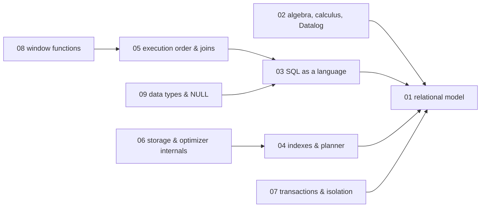
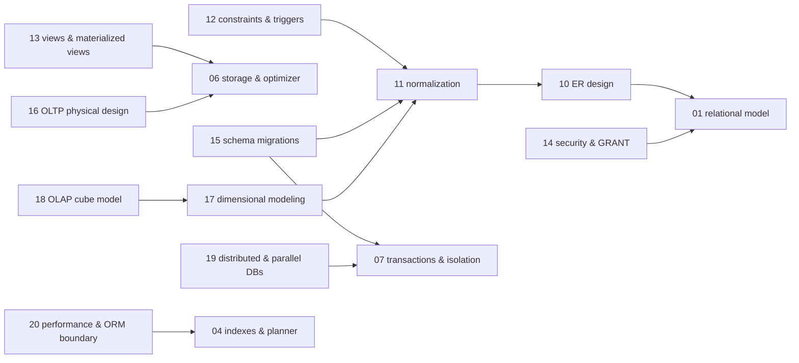

# SQL — knowledge graph

*The relational model from its set-theoretic foundations through the query planner, transaction
isolation, schema design, and the warehouse-adjacent analytics that hand off to BigQuery — at the
depth a database-facing engineer needs, not the depth a DBA certification needs.*

**Nodes:** 20 · **Books:** 6 · **Currency researched:** 2026-08-06
**Requires:** [`03_dsa`](../03_dsa/00_knowledge_graph.md) — B-tree and hash-table mechanics are assumed rather than re-derived
**Feeds:** [`10_mongodb`](../10_mongodb/00_knowledge_graph.md) by contrast, [`12_bigquery`](../12_bigquery/00_knowledge_graph.md) directly

---

## §1 Source audit

| Book | Year | Documents | Verdict |
|---|---|---|---|
| Atzeni, Ceri, Paraboschi & Torlone, *Database Systems: Concepts, Languages and Architectures* (`dbbook.pdf`) | 1999 | Relational model, algebra/calculus/Datalog, SQL, ER and logical design, normalization, transaction technology (concurrency control, buffer management, recovery, physical access structures, query optimization, physical design), distributed architectures, object and active databases, data warehousing and OLAP, databases and the web | Broad and theoretically sound on everything relational; its distributed-databases chapter predates the CAP theorem and its object-database chapter documents a technology category that never reached production adoption |
| Garcia-Molina, Ullman & Widom, *Database Systems: The Complete Book*, 2nd ed. (`ullman_the_complete_book.pdf`) | 2009 | Relational model and design theory (FDs, BCNF, 4NF), ER/UML/ODL modelling, algebraic and Datalog query languages, SQL DML/DDL, constraints and triggers, views and materialized views, indexes, the SQL/host-language interface (JDBC, PSM, CLI), security and GRANT, recursive SQL, object-relational extensions. The book's later chapters on storage, indexing structures, query execution, and distributed/parallel databases are described in the authors' own preface but were not captured by this repository's TOC extraction | The strongest single source on relational theory and the SQL surface on this shelf; current on everything it covers, with a known extraction gap noted in §6 |
| IBM Redbook, *DB2 Best Practices: Physical Database Design for OLTP Environments* (`DB2BP_Physical_Design_OLTP_0412.pdf`) | 2012 | Table space and buffer pool design, data type selection, table partitioning (range, MDC, RCT), indexing guidelines, row/index compression, isolation levels and application deadlocks, capacity management and STMM, HADR and pureScale | Sound on the physical-design levers that transfer across any OLTP engine; its DB2-version-specific command and tuning-parameter detail is fourteen releases behind the current Db2 line |
| Han & Kamber-style chapter, *Data Warehousing and OLAP Technology* (`data warehouse.pdf`) | undated, content indicates pre-2011 | Multidimensional data model, star/snowflake/fact-constellation schemas, three-tier warehouse architecture, cube computation and indexing, OLAP query processing | Clear on the vocabulary and schema patterns, which are unchanged; its ETL-centric, dedicated-server framing predates cloud columnar warehouses |
| Thomsen, *OLAP Solutions: Building Multidimensional Information Systems*, 2nd ed. (`olap-solutions...pdf`) | 2002 | Functional requirements of OLAP, the limitations of spreadsheets and SQL for multidimensional analysis, the LC (linear-composite) model, hypercubes, multidimensional formulas, physical design of OLAP applications, a full worked case study | The deepest theoretical treatment of the multidimensional model on this shelf, built around a proprietary calculation language and dedicated MOLAP servers that the SQL standard's own `CUBE`/`ROLLUP`/`GROUPING SETS` extensions and cloud warehouses have since absorbed into ordinary SQL |
| RDBMS course pack, *PG M.Sc. Information Technology 313/22* (`pg-m-sc-...-rdbms-crc.pdf`) | undated | Fourteen units, extracted only as generic filenames (`Unit 1.pdf` … `Unit 14.pdf`) with no chapter-level headings recoverable from the outline | Its table of contents carries no usable structure; nothing in this graph cites it directly, and any content it holds beyond what the other five books already cover would require opening the PDF, which is out of scope for this pass |

---

## §2 Node index

| ID | Node | Type | Depth | Currency |
|---|---|---|---|---|
| `SQL-01` | The relational model: relations, keys, and integrity constraints | Model | L3 | `current` |
| `SQL-02` | Relational algebra, calculus, and Datalog | Model | L4 | `current` |
| `SQL-03` | SQL as a language: DDL, DML, and the standard's evolving surface | Mechanism | L3 | `stale-minor` |
| `SQL-04` | Indexes and the query planner | Mechanism | L5 | `current` |
| `SQL-05` | Query execution order and join algorithms | Mechanism | L4 | `current` |
| `SQL-06` | Storage structures and cost-based optimization internals | Mechanism | L5 | `current` |
| `SQL-07` | Transactions, isolation levels, and concurrency control | Mechanism | L5 | `stale-minor` |
| `SQL-08` | Window functions and analytical SQL | Mechanism | L5 | `absent` |
| `SQL-09` | Data types, NULL semantics, and correctness pitfalls | Mechanism | L4 | `current` |
| `SQL-10` | Conceptual and logical design: the ER model and its translation to relations | Model | L3 | `stale-minor` |
| `SQL-11` | Schema design and normalization | Model | L5 | `current` |
| `SQL-12` | Constraints, triggers, and active rules | Mechanism | L4 | `stale-minor` |
| `SQL-13` | Views and materialized views | Mechanism | L4 | `current` |
| `SQL-14` | Security: privileges, GRANT/REVOKE, and row-level access control | Mechanism | L4 | `stale-minor` |
| `SQL-15` | Schema evolution and zero-downtime migrations | Practice | L5 | `current` |
| `SQL-16` | OLTP physical database design: table spaces, buffer pools, partitioning, and compression | Practice | L5 | `stale-minor` |
| `SQL-17` | Dimensional modeling and data-warehouse architecture | Structure | L4 | `stale-minor` |
| `SQL-18` | OLAP: the multidimensional model and cube computation | Model | L4 | `stale-major` |
| `SQL-19` | Distributed and parallel databases | Model | L5 | `stale-major` |
| `SQL-20` | Query performance at scale and the ORM boundary | Practice | L4 | `current` |

---

## §3 The graph

### Relational foundations and SQL mechanics

### Design, security, warehousing, and performance

*(`SQL01b`, `SQL04b`, `SQL06b`, `SQL07b` above are the same nodes as in the first diagram,
repeated as anchors so this cluster renders independently — see §4 for the authoritative edges.)*

---

## §4 Node records

### `SQL-01` · The relational model: relations, keys, and integrity constraints
**Type:** Model · **Depth:** L3
**Covers:** attributes, domains, and schemas, tuples and relation instances, superkeys and candidate keys, referential integrity, the set-theoretic basis every relational operation builds on
**Sources:** Atzeni ch.2 (1999) · Ullman ch.2 (2009)
**Edges:** `contrasts` [`AND-11`]
**Currency:** `current`

### `SQL-02` · Relational algebra, calculus, and Datalog
**Type:** Model · **Depth:** L4
**Covers:** selection/projection/join/set operators on bags versus sets, tuple and domain relational calculus, Datalog rules and recursion, the expressiveness boundary between algebra and calculus
**Sources:** Atzeni ch.3 (1999) · Ullman ch.5 (2009)
**Edges:** `requires` [`SQL-01`]
**Currency:** `current`

### `SQL-03` · SQL as a language: DDL, DML, and the standard's evolving surface
**Type:** Mechanism · **Depth:** L3
**Covers:** table/schema/catalog definitions, SELECT and subqueries, set operations, INSERT/UPDATE/DELETE, cursors and the impedance mismatch, embedded SQL and JDBC, recursive CTEs, PSM stored procedures
**Sources:** Atzeni ch.4, §9.3–9.7 (1999) · Ullman ch.6, ch.9, §10.2 (2009)
**Edges:** `requires` [`SQL-01`]
**Currency:** `stale-minor`
**Δ current:** Both books teach SQL as it stood before SQL:2016 and SQL:2023. SQL:2016 (ISO/IEC 9075:2016) added native JSON functions such as `JSON_TABLE` and `JSON_QUERY`, row pattern recognition, and polymorphic table functions; SQL:2023 added SQL/PGQ (Part 16 of the standard, published June 2023), a property-graph query layer over relational tables, neither of which either book — Atzeni from 1999, Ullman's second edition from 2009 — could anticipate. The DML/DDL core both books teach is otherwise unchanged. An article on this node should teach that core as accurate and flag JSON and SQL/PGQ support explicitly as post-2016 additions rather than folding them in as if they had always existed.

### `SQL-04` · Indexes and the query planner
**Article:** [01_indexes_and_the_query_planner.md](01_indexes_and_the_query_planner.md)
**Type:** Mechanism · **Depth:** L5
**Covers:** B-tree structure and descent, `EXPLAIN (ANALYZE, BUFFERS)`, cardinality and selectivity estimation, the leftmost-prefix rule and the skip-scan exception, covering and index-only scans, expression and partial indexes, stale statistics and `ANALYZE`
**Sources:** Atzeni §9.5 (1999) · Ullman §8.3–8.4 (2009) · DB2 Best Practices, "Indexes" (2012)
**Edges:** `requires` [`SQL-01`]
**Currency:** `current`

### `SQL-05` · Query execution order and join algorithms
**Type:** Mechanism · **Depth:** L4
**Covers:** logical evaluation order (`FROM`/`WHERE`/`GROUP BY`/`HAVING`/`SELECT`/`ORDER BY`), nested-loop versus hash versus merge join selection, the `LEFT JOIN` condition-in-`WHERE` bug, semi/anti/lateral joins, the CTE optimisation fence before and after PostgreSQL 12
**Sources:** Ullman §6.2–6.3 (2009) · Atzeni §9.6 (1999)
**Edges:** `requires` [`SQL-03`] · `contrasts` [`MDB-08`]
**Currency:** `current`

### `SQL-06` · Storage structures and cost-based optimization internals
**Type:** Mechanism · **Depth:** L5
**Covers:** heap files and page layout, B+-tree and hash access methods, buffer-pool replacement policy, statistics and histograms, join-order enumeration by dynamic programming, query rewrite
**Sources:** Atzeni §9.3, §9.6 (1999) · Ullman §8.3–8.4 (2009)
**Edges:** `requires` [`SQL-04`] · `contrasts` [`BQ-04`]
**Currency:** `current`

### `SQL-07` · Transactions, isolation levels, and concurrency control
**Type:** Mechanism · **Depth:** L5
**Covers:** ACID properties, the anomaly ladder (dirty read, non-repeatable read, phantom, write skew), two-phase locking and deadlock detection, optimistic versus pessimistic locking, MVCC snapshots, bloat from long-running transactions
**Sources:** Atzeni §9.1–9.2 (1999) · Ullman §6.6 (2009) · DB2 Best Practices, "Query design: isolation levels, application deadlocks" (2012)
**Edges:** `requires` [`SQL-01`] · `contrasts` [`CONC-17`, `RDS-07`] · `contrasts` [`BUS-05`]
**Currency:** `stale-minor`
**Δ current:** All three sources describe classic two-phase-locking serializability and the SQL-92 four-level isolation ladder without a snapshot-based alternative. PostgreSQL's Serializable Snapshot Isolation (SSI), which detects dangerous read-write dependencies without lock-based blocking, shipped in PostgreSQL 9.1 (2011); the current PostgreSQL 17 documentation (postgresql.org/docs/17/transaction-iso.html) still lists Read Committed as the default and Serializable, implemented via SSI, as the strictest level. An article on this node should teach MVCC and SSI as the mechanism a PostgreSQL engineer actually meets, with textbook 2PL taught as the older alternative MySQL's gap-locking approach still resembles.

### `SQL-08` · Window functions and analytical SQL
**Article:** [04_window_functions_and_analytical_sql.md](04_window_functions_and_analytical_sql.md)
**Type:** Mechanism · **Depth:** L5
**Covers:** frame specification and the `ROWS` versus `RANGE` default, `PARTITION BY`/`ORDER BY` semantics, `ROW_NUMBER`/`RANK`/`DENSE_RANK`, `LAG`/`LEAD`, gaps-and-islands, cohort retention with censoring, `GROUPING SETS`/`ROLLUP`/`CUBE`
**Sources:** —
**Edges:** `requires` [`SQL-05`] · `contrasts` [`STAT-21`]
**Currency:** `absent`
**Δ current:** None of this shelf's six books teaches window functions as syntax: Atzeni (1999) predates the SQL:2003 standard that introduced `OVER`/`PARTITION BY` entirely, and the extracted table of contents for Ullman & Widom's second edition (2009) shows no window-function section either, despite the standard existing by then — a gap this graph cannot resolve without opening the PDF. Window functions are core ANSI/ISO SQL:2003, refined in SQL:2011, and are supported with matching semantics in PostgreSQL, MySQL 8+, SQLite 3.25+, and BigQuery, which is why the article already written for this node measures directly against SQLite rather than transcribing any book on this shelf.

### `SQL-09` · Data types, NULL semantics, and correctness pitfalls
**Type:** Mechanism · **Depth:** L4
**Covers:** three-valued logic and `NULL` as unknown, `NOT IN` versus `NOT EXISTS` under `NULL`, `COUNT(*)` versus `COUNT(col)` versus `COUNT(DISTINCT col)`, `NULL` behaviour through `GROUP BY` and joins, `NUMERIC`/`DECIMAL` for money, `TIMESTAMPTZ` versus `TIMESTAMP`
**Sources:** Ullman §6.1.6–6.1.7 (2009) · Atzeni §4.2 (1999)
**Edges:** `requires` [`SQL-03`]
**Currency:** `current`

### `SQL-10` · Conceptual and logical design: the ER model and its translation to relations
**Type:** Model · **Depth:** L3
**Covers:** entity-relationship diagrams, cardinality and participation constraints, weak entity sets, UML class-diagram translation, the ODMG Object Definition Language (ODL) path to relations
**Sources:** Ullman ch.4 (2009) · Atzeni ch.5–ch.7 (1999)
**Edges:** `requires` [`SQL-01`]
**Currency:** `stale-minor`
**Δ current:** Ullman devotes substantial space to ODL, the Object Definition Language defined by the ODMG (Object Data Management Group) standard, as a design path into relations alongside ER and UML. The ODMG's standards work wound down in the early 2000s and no ODL-based object database remains in mainstream production use, while the UML class-diagram path the same chapter covers is the one still practised, typically expressed today as an ER diagram in a schema tool rather than formal ODL. An article on this node should teach ER-to-relational translation and the UML alternative as current and mention ODL only as the historical third path the book documents.

### `SQL-11` · Schema design and normalization
**Type:** Model · **Depth:** L5
**Covers:** functional dependencies and attribute-set closure, Boyce-Codd normal form and lossless-join decomposition, the chase test, third normal form and the synthesis algorithm, multivalued dependencies and fourth normal form, deliberate denormalization for read-heavy reporting
**Sources:** Ullman ch.3 (2009) · Atzeni ch.8 (1999)
**Edges:** `requires` [`SQL-10`] · `contrasts` [`MDB-02`, `BQ-13`]
**Currency:** `current`

### `SQL-12` · Constraints, triggers, and active rules
**Type:** Mechanism · **Depth:** L4
**Covers:** `NOT NULL` and `CHECK` constraints, foreign-key referential actions and deferred checking, assertions, row- versus statement-level trigger timing, event-condition-action active-rule semantics
**Sources:** Ullman ch.7 (2009) · Atzeni ch.12 (1999)
**Edges:** `requires` [`SQL-11`]
**Currency:** `stale-minor`
**Δ current:** Atzeni's active-database chapter documents DB2 and Oracle trigger syntax as they stood in 1999 — DB2 roughly version 5 and Oracle 8. Both vendors have extended the model since: Oracle added compound triggers, which combine `BEFORE`/`AFTER` and row/statement timing in one object, in Oracle Database 11g (2007), and IBM's current Db2 line — at release 12.1.5, generally available 25 June 2026 per IBM's own product announcement — supports `INSTEAD OF` triggers on views and additional trigger-activation clauses the 1999 text cannot show. The event-condition-action mechanism itself is unchanged; only vendor syntax moved. An article on this node should teach the ANSI `CREATE TRIGGER` form Ullman gives as the durable core and treat vendor-specific syntax as illustrative rather than current.

### `SQL-13` · Views and materialized views
**Type:** Mechanism · **Depth:** L4
**Covers:** virtual view declaration and the updatable-view rules, `INSTEAD OF` triggers on views, materialized-view maintenance strategy (immediate versus periodic), automatic query rewriting to substitute a materialized view
**Sources:** Ullman ch.8 (2009) · Atzeni §9.6 (1999)
**Edges:** `requires` [`SQL-06`]
**Currency:** `current`

### `SQL-14` · Security: privileges, GRANT/REVOKE, and row-level access control
**Type:** Mechanism · **Depth:** L4
**Covers:** privilege types and grant diagrams, revocation and its cascading effects, the SQL/host-language authorization model
**Sources:** Ullman §10.1 (2009) · Atzeni §4.5 (1999)
**Edges:** `requires` [`SQL-01`]
**Currency:** `stale-minor`
**Δ current:** Both books describe `GRANT`/`REVOKE` privilege management as the complete authorization model. Neither anticipates row-level security (RLS), which PostgreSQL added in version 9.5 (released January 2016) as `CREATE POLICY` predicates evaluated per row rather than per table; the current PostgreSQL 17 documentation still presents RLS as the mechanism for restricting individual rows to specific roles, layered on top of the `GRANT` model both books already teach correctly. An article on this node should keep `GRANT`/`REVOKE` as the foundation and add RLS as the refinement neither book could describe.

### `SQL-15` · Schema evolution and zero-downtime migrations
**Type:** Practice · **Depth:** L5
**Covers:** the add-nullable/backfill/validate-constraint/flip sequence for a non-nullable column on a large table, `NOT VALID` constraints, `CREATE INDEX CONCURRENTLY`, the lock each naive step would take
**Sources:** DB2 Best Practices, "Database transaction logs" and "Query design" (2012)
**Edges:** `requires` [`SQL-11`, `SQL-07`]
**Currency:** `current`

### `SQL-16` · OLTP physical database design: table spaces, buffer pools, partitioning, and compression
**Type:** Practice · **Depth:** L5
**Covers:** table space design for OLTP workloads, buffer pool sizing against working set, range partitioning and multidimensional clustering (MDC) tables, row and index compression, self-tuning memory management
**Sources:** DB2 Best Practices, full text (2012)
**Edges:** `requires` [`SQL-06`]
**Currency:** `stale-minor`
**Δ current:** The Redbook documents physical-design guidance current to the DB2 9.7/10 line circa 2012, including that era's self-tuning memory manager (STMM) defaults and MDC guidance. IBM's current release is Db2 12.1.5, generally available 25 June 2026 per IBM's own announcement, which added DiskANN vector indexing and native SQL-based AI model invocation the 2012 document cannot mention. The core levers it teaches — table space separation, buffer-pool sizing against working set, range partitioning, and row/index compression — remain the mechanism Db2 uses today. An article on this node should teach the levers as current and flag any specific STMM default or command syntax as needing a check against the 12.1.x manual.

### `SQL-17` · Dimensional modeling and data-warehouse architecture
**Type:** Structure · **Depth:** L4
**Covers:** star, snowflake, and fact-constellation schemas, the three-tier warehouse architecture, ETL back-end tools and the metadata repository, concept hierarchies and measure categorization
**Sources:** data-warehouse chapter, §3.1–3.4 (undated, pre-2011) · Atzeni ch.13 (1999)
**Edges:** `requires` [`SQL-11`] · `contrasts` [`BQ-01`] · `contrasts` [`DE-07`]
**Currency:** `stale-minor`
**Δ current:** Both sources frame the warehouse as a batch-loaded ETL target reached through a dedicated three-tier architecture, with ROLAP and MOLAP servers as the query layer. Cloud columnar warehouses — BigQuery, Snowflake, Redshift — collapse that three-tier separation into a single managed service, and modern practice increasingly loads raw data first and transforms it inside the warehouse with a tool such as dbt, an ELT ordering neither source anticipates. The star/snowflake modelling vocabulary itself is unchanged and is exactly what BigQuery's own documentation still recommends for dimensional modelling. An article on this node should teach the schema patterns as current and the ETL-versus-ELT distinction as the part that moved.

### `SQL-18` · OLAP: the multidimensional model and cube computation
**Type:** Model · **Depth:** L4
**Covers:** data cubes and dimension hierarchies, the LC (linear-composite) multidimensional model, roll-up/drill-down/slice/dice/pivot operations, efficient cube materialization, ROLAP versus MOLAP server architectures
**Sources:** Thomsen, *OLAP Solutions*, 2nd ed., ch.1–ch.8 (2002) · data-warehouse chapter §3.2 (undated)
**Edges:** `requires` [`SQL-17`]
**Currency:** `stale-major`
**Δ current:** Thomsen's book (2002) treats OLAP as a product category served by dedicated MOLAP engines and a proprietary LC calculation language, with cube pre-aggregation as the central performance technique. Standard SQL absorbed most of this: `GROUPING SETS`, `ROLLUP`, and `CUBE` entered the SQL standard as the SQL:1999 OLAP extensions, refined through SQL:2003, and are implemented directly in PostgreSQL, while cloud warehouses compute cube-style rollups on demand over columnar storage rather than through precomputed MOLAP structures — BigQuery's architecture, covered in this repository's `12_bigquery` subject, is the direct successor to the problem this book addresses. An article on this node should teach cube semantics and the roll-up/drill-down vocabulary as still exactly how analysts describe the operations, while treating dedicated MOLAP servers such as Essbase as a specialized niche rather than the default implementation.

### `SQL-19` · Distributed and parallel databases
**Type:** Model · **Depth:** L5
**Covers:** client-server and multi-tier architecture, two-phase commit, data fragmentation and replication, query parallelism (inter-query, intra-query, intra-operation)
**Sources:** Atzeni ch.10 (1999)
**Edges:** `requires` [`SQL-07`]
**Currency:** `stale-major`
**Δ current:** Atzeni's chapter predates the CAP theorem (Brewer's 2000 conjecture, proven by Gilbert & Lynch in 2002) and treats two-phase commit as the mechanism for distributed consistency, with no framework for reasoning about the consistency-availability trade-off under partition. Google's Spanner, described in Google's 2012 OSDI paper, replaced blocking 2PC with TrueTime-ordered, Paxos-replicated transactions to deliver externally consistent distributed transactions at global scale, and the Raft consensus algorithm (Ongaro & Ousterhout, 2014) has since become the dominant mechanism behind distributed SQL systems such as CockroachDB and YugabyteDB. An article on this node should introduce CAP and Paxos/Raft-based consensus as the current framing and teach 2PC as the older mechanism those systems moved past for the general case, while noting that a single PostgreSQL instance's own prepared-transaction feature still uses 2PC exactly as the book describes.

### `SQL-20` · Query performance at scale and the ORM boundary
**Type:** Practice · **Depth:** L4
**Covers:** identifying slow queries by total time, estimated-versus-actual as the diagnostic signal, autovacuum and table bloat, N+1 patterns from lazily loaded ORM relationships, `COPY` versus row-at-a-time `INSERT`, the row-store/column-store boundary
**Sources:** DB2 Best Practices, "Performance and monitoring" (2012)
**Edges:** `requires` [`SQL-04`, `SQL-05`] · `contrasts` [`PY-16`]
**Currency:** `current`

---

## §5 Cross-subject edges

| From | Edge | To | Why |
|---|---|---|---|
| `SQL-05` | `contrasts` | `MDB-08` | Relational join algorithms and their execution order versus `$lookup`'s per-input-document aggregation-pipeline execution — the same join problem with a different cost model |
| `SQL-06` | `contrasts` | `BQ-04` | B-tree/hash row-store internals versus Capacitor's columnar layout — the same storage-structure question with opposite answers |
| `SQL-07` | `contrasts` | `CONC-17` | SQL's own isolation-level and MVCC treatment versus the connection-pool-ceiling framing `CONC-17` gives the same mechanism from the application-concurrency side |
| `SQL-07` | `contrasts` | `RDS-07` | Lock-based/MVCC ACID transactions versus Redis's optimistic `MULTI`/`WATCH`/`EXEC` model, which has no rollback on a runtime error |
| `SQL-11` | `contrasts` | `MDB-02` | Normalization to eliminate update anomalies versus MongoDB's embed-or-reference decision, which optimizes for read-unit boundaries instead |
| `SQL-11` | `contrasts` | `BQ-13` | A normalized relational schema versus `STRUCT`/`ARRAY` denormalization that pre-materializes the one-to-many relationship inside a single row |
| `SQL-17` | `contrasts` | `BQ-01` | The three-tier ETL warehouse architecture both older sources describe versus BigQuery's serverless separation of compute and storage |
| `SQL-20` | `contrasts` | `PY-16` | The database-side view of N+1 and connection behaviour versus the ORM-side view SQLAlchemy 2.0's async session model gives the same failure |
| `SQL-07` | `contrasts` | `BUS-05` | Relational ACID/isolation-level transactions versus Kafka's transactional exactly-once semantics in `BUS-05` |
| `SQL-01` | `contrasts` | `AND-11` | The general relational model versus Android's embedded, single-app SQLite usage in `AND-11`, a lightweight application of it |
| `SQL-17` | `contrasts` | `DE-07` | Dimensional-modeling theory for the warehouse schema versus the book's hand-rolled staging-to-warehouse pipeline that loads into it in `DE-07` |
| `SQL-08` | `contrasts` | `STAT-21` | This node's own window-functions treatment versus DSBDA's advanced-SQL-for-analytics chapter in `STAT-21` |

---

---

---

---

---

## §6 Coverage gaps

Ullman & Widom's *Database Systems: The Complete Book* is the strongest single source on this
shelf, but the machine extraction of its table of contents stops at chapter 10 even though the
book's own preface — visible as loose prose fragments at the top of the extracted file — describes
chapters 13 and 14 on disk storage and index structures (B-trees, hashing), chapters on query
execution and cost-based optimization, chapter 20 on parallel and distributed databases, chapter 21
on information integration, chapter 22 on data mining, and chapter 23 on internet-era database
technology. `SQL-04` and `SQL-06` were built from Atzeni's parallel coverage of storage and
optimization plus the parts of Ullman's chapter 8 the extraction did capture (index selection), so
the mechanism is not missing from this graph, but a direct citation of Ullman's own storage and
optimization chapters would strengthen those two nodes if the PDF's outline is ever re-extracted
with full chapter capture.

The RDBMS course pack's table of contents carried no usable structure — its outline is fourteen
generic filenames with no chapter titles — so nothing in this graph cites it. If that document
turns out to hold content not covered by the other five books, closing that gap requires opening
the PDF directly rather than relying on the outline extraction, which is out of scope for a
TOC-only pass.

`SQL-18` and `SQL-19` are this subject's two `stale-major` nodes, and both point at the same kind
of gap: the shelf's OLAP and distributed-systems material is theoretically sound but was written
before the specific technologies — SQL's own `CUBE`/`ROLLUP` extensions, and CAP-theorem-aware
consensus-based distributed SQL — that now answer the same questions in practice existed. No book
on this shelf covers Raft, Paxos, or Spanner's TrueTime mechanism at all; an article on `SQL-19`
will need to cite the Spanner OSDI paper and the Raft paper directly rather than any book here.

Recursive SQL (Ullman §10.2) and object-relational extensions — user-defined types, nested
relations, and the object-relational model generally (Ullman §10.3–10.4, Atzeni ch.11) — are folded
into `SQL-03`'s and the design nodes' `Covers` lines rather than given their own nodes. Recursive
CTEs are a syntax variant of the query-language mechanics `SQL-03` already covers, and
object-relational extensions describe a product category (Oracle's and Informix's object-relational
features, chiefly) that never displaced the plain relational model for mainstream OLTP work; giving
either a full node would push this subject past a defensible granularity without adding a mechanism
a senior engineer needs independently of the surrounding material.

← [repo index](../README.md) · [root graph](../KNOWLEDGE_GRAPH.md) · [writing contract](../AGENTS.md)
