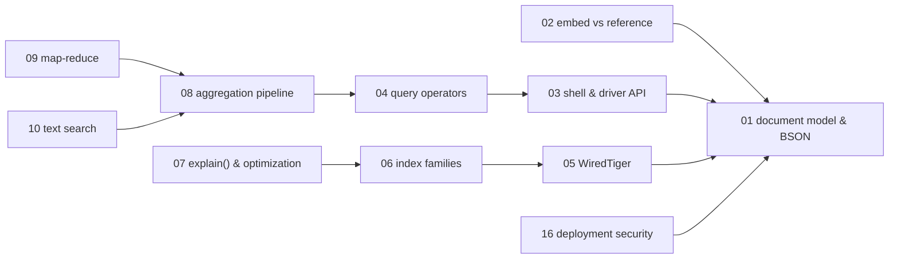
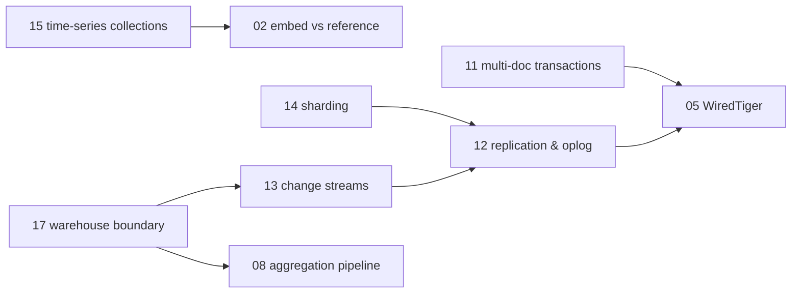

# MongoDB — knowledge graph

*The document model, WiredTiger underneath it, and the replication and sharding topology that
scales it — mapped from a single 2016-era book against a server that has shipped five major
versions since, which makes this the subject where the currency pass does the most work.*

**Nodes:** 17 · **Books:** 1 · **Currency researched:** 2026-08-06
**Requires:** [`09_sql`](../09_sql/00_knowledge_graph.md) — the embed/reference decision and the indexing chapter are both shorter to teach once B-trees and normalization already exist
**Feeds:** [`12_bigquery`](../12_bigquery/00_knowledge_graph.md) directly, via the ingestion boundary

---

## §1 Source audit

| Book | Year | Documents | Verdict |
|---|---|---|---|
| Banker, Bakkum, Verch, Garrett & Hawkins, *MongoDB in Action*, 2nd ed. | 2016 (PDF creation date 2016-03-26) | Document modelling, the shell and drivers, querying, the aggregation framework, updates and atomic operations, indexing and `explain()`, text search, WiredTiger versus the then-default MMAPv1, replication, sharding, deployment and security | Written at the exact moment WiredTiger was displacing MMAPv1 (MongoDB 3.0–3.2), so its storage-engine chapter is a snapshot of a transition rather than a description of a stable state. Everything from MongoDB 4.0 onward — transactions, change streams, time-series collections, ACLs, queryable encryption — postdates it entirely, which is why this subject carries more `absent` and `stale-major` tags than any other in this pass |

Only one book covers this subject in `_toc/`. The node list below is deliberately larger than one
book alone would justify, because — per `KG_SPEC` §4 — "the graph maps the subject, not the
bookshelf," and a decade of MongoDB releases the book cannot describe are exactly the mechanisms a
senior engineer working with a current deployment needs.

---

## §2 Node index

| ID | Node | Type | Depth | Currency |
|---|---|---|---|---|
| `MDB-01` | The document data model and BSON | Structure | L3 | `current` |
| `MDB-02` | Embedding versus referencing: the modelling decision procedure | Model | L5 | `current` |
| `MDB-03` | The shell and driver API surface | Tool | L3 | `stale-major` |
| `MDB-04` | Query operators and query construction | Mechanism | L3 | `current` |
| `MDB-05` | WiredTiger: concurrency, durability, and compression | Mechanism | L5 | `stale-major` |
| `MDB-06` | Index families and index administration | Structure | L4 | `stale-minor` |
| `MDB-07` | Query optimization and `explain()` | Mechanism | L5 | `stale-minor` |
| `MDB-08` | The aggregation pipeline: stages and semantics | Mechanism | L4 | `stale-minor` |
| `MDB-09` | Map-reduce as a superseded aggregation mechanism | Mechanism | L3 | `stale-major` |
| `MDB-10` | Text search: from pattern matching to a dedicated engine | Mechanism | L3 | `stale-minor` |
| `MDB-11` | Multi-document transactions | Mechanism | L5 | `absent` |
| `MDB-12` | Replication: replica sets, the oplog, and elections | Mechanism | L4 | `stale-minor` |
| `MDB-13` | Change streams | Mechanism | L4 | `absent` |
| `MDB-14` | Sharding: chunk distribution and shard-key selection | Mechanism | L5 | `stale-minor` |
| `MDB-15` | Time-series collections | Structure | L4 | `absent` |
| `MDB-16` | Deployment security: authentication, encryption, and queryable encryption | Mechanism | L4 | `stale-major` |
| `MDB-17` | The MongoDB-to-warehouse boundary: schema inference and CDC into an analytical store | Practice | L5 | `absent` |

---

## §3 The graph

### Document model, storage, and query mechanics

### Transactions, replication, sharding, and the analytics boundary

*(`MDB05b`, `MDB02b`, `MDB08b` are the same nodes as in the first diagram, repeated as anchors so
this cluster renders independently — see §4 for the authoritative edges.)*

---

## §4 Node records

### `MDB-01` · The document data model and BSON
**Type:** Structure · **Depth:** L3
**Covers:** BSON types and binary encoding, the 16 MB document size limit, dynamic/schemaless documents, databases/collections/documents as the storage hierarchy
**Sources:** *MongoDB in Action*, 2nd ed., ch.1, ch.4 (2016)
**Currency:** `current`

### `MDB-02` · Embedding versus referencing: the modelling decision procedure
**Type:** Model · **Depth:** L5
**Covers:** embedding when a relationship is bounded by the domain and read as a unit, referencing when growth is unbounded or the child is queried independently, the unbounded-array anti-pattern, the subset/extended-reference/computed/bucket/schema-versioning patterns
**Sources:** *MongoDB in Action*, 2nd ed., ch.4, Appendix B (2016)
**Edges:** `requires` [`MDB-01`] · `contrasts` [`SQL-11`]
**Currency:** `current`

### `MDB-03` · The shell and driver API surface
**Type:** Tool · **Depth:** L3
**Covers:** the interactive shell, insert/query/update/delete verbs, database commands, driver-level object-ID generation
**Sources:** *MongoDB in Action*, 2nd ed., ch.2–ch.3 (2016)
**Edges:** `requires` [`MDB-01`]
**Currency:** `stale-major`
**Δ current:** The book documents the legacy `mongo` shell throughout. MongoDB deprecated `mongo` starting in version 5.0, per the current MongoDB Docs `mongosh` compatibility reference, in favour of `mongosh`, a TypeScript-based, independently versioned shell decoupled from the server; MongoDB Server packages from 6.0 onward no longer bundle the legacy shell, which current OS packaging notes (FreeBSD ports, Arch Linux) confirm is simply absent from 7.0+ distributions. The command surface the book teaches — the insert/query/update/delete verbs themselves — is otherwise accurate. An article on this node should demonstrate every example in `mongosh` and mention the legacy shell only as what a reader may still find referenced in an old tutorial.

### `MDB-04` · Query operators and query construction
**Type:** Mechanism · **Depth:** L3
**Covers:** comparison, logical, element, and array query operators, projection, cursor options (sort/skip/limit)
**Sources:** *MongoDB in Action*, 2nd ed., ch.5 (2016)
**Edges:** `requires` [`MDB-03`]
**Currency:** `current`

### `MDB-05` · WiredTiger: concurrency, durability, and compression
**Type:** Mechanism · **Depth:** L5
**Covers:** document-level concurrency control via MVCC snapshots, checkpoints and the journal, block compression (snappy/zlib/zstd), working set versus available RAM, the page-fault latency cliff
**Sources:** *MongoDB in Action*, 2nd ed., ch.10 (2016)
**Edges:** `requires` [`MDB-01`]
**Currency:** `stale-major`
**Δ current:** The book treats WiredTiger as the new alternative to the then-default MMAPv1 storage engine and spends most of chapter 10 benchmarking one against the other. WiredTiger became the default storage engine in MongoDB 3.2 (2015); MMAPv1 was deprecated in 4.0 and removed entirely in MongoDB 4.2, per MongoDB's own standalone-to-WiredTiger migration documentation, which now assumes a WiredTiger-only deployment. An article on this node should teach WiredTiger as the only storage engine a current deployment runs and reduce the MMAPv1 comparison to a single historical note.

### `MDB-06` · Index families and index administration
**Type:** Structure · **Depth:** L4
**Covers:** single, compound, multikey, partial, sparse, TTL, text, wildcard, and geospatial indexes, background index builds, collation
**Sources:** *MongoDB in Action*, 2nd ed., §8.1–8.2 (2016)
**Edges:** `requires` [`MDB-05`]
**Currency:** `stale-minor`
**Δ current:** The book's index-type catalogue — single, compound, multikey, geospatial, text — is accurate as far as it goes, but wildcard indexes, for indexing unpredictable or dynamically named fields, were added in MongoDB 4.2 (2019), after this book's 2016 publication, and the current MongoDB manual's index-types reference lists them as a standard family alongside the others. An article on this node should add wildcard indexes to the catalogue the book already gives correctly for everything else.

### `MDB-07` · Query optimization and `explain()`
**Type:** Mechanism · **Depth:** L5
**Covers:** the ESR (equality-sort-range) rule for compound-index field ordering, `totalDocsExamined` versus `nReturned` as the diagnostic ratio, plan caching and its invalidation, covered queries, type-sensitivity of index keys
**Sources:** *MongoDB in Action*, 2nd ed., §8.3 (2016)
**Edges:** `requires` [`MDB-06`]
**Currency:** `stale-minor`
**Δ current:** The book's `explain()` walkthrough targets pre-3.0 output. The current `explain("executionStats")` structure — with `totalDocsExamined`, `nReturned`, and a `winningPlan`/`rejectedPlans` split — stabilized around MongoDB 3.0 and is what the current MongoDB manual documents; the diagnostic ratio and the ESR ordering logic the book teaches both still hold exactly as written. An article on this node should reproduce current-format `explain()` output rather than transcribing the book's pre-stabilization field names.

### `MDB-08` · The aggregation pipeline: stages and semantics
**Type:** Mechanism · **Depth:** L4
**Covers:** stage ordering and index eligibility for early `$match`/`$sort`, `$project`/`$group`/`$unwind`/`$facet`, the 100 MB per-stage memory limit and `allowDiskUse`, `$lookup` mechanics and cost, `$merge`/`$out`
**Sources:** *MongoDB in Action*, 2nd ed., ch.6 (2016)
**Edges:** `requires` [`MDB-04`] · `supersedes` [`MDB-09`] · `contrasts` [`SQL-05`]
**Currency:** `stale-minor`
**Δ current:** The book's aggregation chapter (2016) predates several stages now central to pipeline design: `$lookup` for cross-collection joins arrived in MongoDB 3.2, the same release as this book; `$facet` and `$bucket` arrived in 3.4; and `$merge` — which the current manual documents as the flexible replacement output stage for incremental aggregation — arrived in 4.2. The book still teaches `$out`, which remains supported but is the less flexible sibling `$merge` was added to complement. An article on this node should lead with `$lookup` and `$merge` as the current default building blocks.

### `MDB-09` · Map-reduce as a superseded aggregation mechanism
**Type:** Mechanism · **Depth:** L3
**Covers:** the historical map-reduce API, its incremental-processing mode, why the aggregation framework replaced it for nearly every use case
**Sources:** *MongoDB in Action*, 2nd ed., §6.6.2 (2016)
**Currency:** `stale-major`
**Δ current:** MongoDB deprecated map-reduce starting in version 5.0, per the current MongoDB manual's map-reduce reference page, which directs readers to replace map-reduce operations with aggregation pipeline stages such as `$group` and `$merge`, or the `$accumulator`/`$function` operators for custom logic. The book (2016) presents map-reduce as a viable option for custom aggregation logic; it is now the option to actively migrate away from rather than reach for on a new project.

### `MDB-10` · Text search: from pattern matching to a dedicated engine
**Type:** Mechanism · **Depth:** L3
**Covers:** text index creation, language-aware stemming, relevance scoring, the aggregation `$text` stage
**Sources:** *MongoDB in Action*, 2nd ed., ch.9 (2016)
**Edges:** `requires` [`MDB-08`]
**Currency:** `stale-minor`
**Δ current:** The book's text-search chapter documents the built-in `$text` index, which remains supported and is the correct baseline for a self-hosted deployment. Since 2022, Atlas Search — a Lucene-based full-text and vector search layer available only on MongoDB Atlas — has become MongoDB's own recommended path for anything beyond basic stemmed keyword search, per MongoDB's product documentation; it is not available outside Atlas, which keeps the book's `$text` mechanism the correct teaching baseline for a self-managed article while flagging Atlas Search as the managed-service alternative.

### `MDB-11` · Multi-document transactions
**Type:** Mechanism · **Depth:** L5
**Covers:** snapshot-isolated multi-statement transactions, the default 60-second running-transaction limit, why needing transactions frequently signals a modelling mistake rather than a missing feature
**Sources:** —
**Edges:** `requires` [`MDB-05`]
**Currency:** `absent`
**Δ current:** *MongoDB in Action* (2016) predates multi-document ACID transactions entirely; its design advice — make the document the atomic unit, because cross-document atomicity does not exist — was accurate when written but is no longer the complete picture. MongoDB added multi-document transactions on replica sets in version 4.0 (2018) and extended them to sharded clusters in 4.2 (2019), per MongoDB's own product-release announcements, with snapshot isolation and a default 60-second limit on a running transaction. An article on this node has no book on this shelf to draw from and must cite MongoDB's transactions documentation directly, while still teaching the book's modelling advice — reach for transactions rarely — as the reason they exist rather than a reason to skip learning them.

### `MDB-12` · Replication: replica sets, the oplog, and elections
**Type:** Mechanism · **Depth:** L4
**Covers:** replica set roles, oplog-based replication, election mechanics and rollback of unreplicated writes, write concern (`w`/`j`/`wtimeout`), read concern, read preference and staleness, causal consistency
**Sources:** *MongoDB in Action*, 2nd ed., ch.11 (2016)
**Edges:** `requires` [`MDB-05`] · `contrasts` [`CONC-17`, `RDS-06`]
**Currency:** `stale-minor`
**Δ current:** The mechanics — oplog tailing, majority election, rollback of writes that had not replicated at failover — are unchanged in current MongoDB. What moved is the default write-concern guidance: MongoDB changed the default write concern to `w: "majority"` for replica sets in MongoDB 5.0, per MongoDB's release notes, whereas the book's 2016-era discussion assumes the older, weaker default. An article on this node should state the current majority default explicitly rather than let the reader infer it from the book's era.

### `MDB-13` · Change streams
**Type:** Mechanism · **Depth:** L4
**Covers:** oplog-derived change events, resumability via a resume token, filtering with an aggregation pipeline, use as a change-data-capture source into a downstream warehouse
**Sources:** —
**Edges:** `requires` [`MDB-12`] · `contrasts` [`BUS-12`]
**Currency:** `absent`
**Δ current:** *MongoDB in Action* (2016) has no change-streams chapter because the feature did not exist yet. MongoDB added change streams in version 3.6 (2017), per MongoDB's release documentation, as an API for subscribing to real-time data changes without tailing the oplog directly. This is exactly the mechanism that feeds `12_bigquery`'s change-data-capture ingestion path, and an article on this node must be written from MongoDB's current manual rather than any book on this shelf.

### `MDB-14` · Sharding: chunk distribution and shard-key selection
**Type:** Mechanism · **Depth:** L5
**Covers:** shard/`mongos`/config-server roles, range versus hashed sharding, chunk splitting and balancing, shard-key selection on cardinality, frequency, and monotonicity, the hotspot anti-pattern of a monotonically increasing key
**Sources:** *MongoDB in Action*, 2nd ed., ch.12 (2016)
**Edges:** `requires` [`MDB-12`] · `contrasts` [`RDS-13`]
**Currency:** `stale-minor`
**Δ current:** The mechanism the book teaches — cardinality, frequency, and monotonicity as the three axes of shard-key selection, and a monotonic key creating a hot shard — is unchanged and is still exactly what the current MongoDB sharding documentation recommends. What has matured since 2016 is resharding: MongoDB added the ability to change an existing collection's shard key in place via `reshardCollection`, starting in MongoDB 5.0, closing what the book correctly describes in its edition as a one-way door. An article on this node should keep the book's selection criteria and add resharding as the modern escape hatch for a bad initial choice.

### `MDB-15` · Time-series collections
**Type:** Structure · **Depth:** L4
**Covers:** the columnar-optimized storage format for measurement data, automatic bucketing, compression ratio against a hand-rolled bucket-pattern collection
**Sources:** —
**Edges:** `requires` [`MDB-02`]
**Currency:** `absent`
**Δ current:** The bucket pattern in *MongoDB in Action*'s Appendix B is the hand-rolled technique the book teaches for time-series-shaped data, because native support did not exist in 2016. MongoDB added first-class time-series collections in version 5.0 (2021), per MongoDB's release announcement, which automate that same bucketing internally and report 50–90% compression over an equivalent regular collection for numeric measurement data; single-document deletes and limited in-place updates followed in MongoDB 5.1. An article on this node should teach time-series collections as the current default for new schemas and the manual bucket pattern, taught in `MDB-02`, as the technique it replaces — while noting the bucket pattern remains the right tool where a time-series collection's constraints do not fit.

### `MDB-16` · Deployment security: authentication, encryption, and queryable encryption
**Type:** Mechanism · **Depth:** L4
**Covers:** SCRAM and x.509 authentication, network (TLS) encryption, role-based access control, client-side field-level encryption, Queryable Encryption for equality queries against encrypted fields
**Sources:** *MongoDB in Action*, 2nd ed., §13.4 (2016)
**Edges:** `requires` [`MDB-01`]
**Currency:** `stale-major`
**Δ current:** The book's security chapter (2016) covers authentication and TLS but predates any encrypted-query capability. MongoDB added client-side field-level encryption in version 4.2 (2019), and Queryable Encryption — which allows equality queries directly against encrypted fields without decrypting them server-side — reached general availability in MongoDB 7.0, per MongoDB's own Queryable Encryption documentation; range, prefix, suffix, and substring query support followed in public preview with MongoDB 8.2. An article on this node should teach RBAC and TLS as the unchanged baseline and Queryable Encryption as the capability the book's edition could not describe.

### `MDB-17` · The MongoDB-to-warehouse boundary: schema inference and CDC into an analytical store
**Type:** Practice · **Depth:** L5
**Covers:** schema inference from a schemaless source with type drift across writers, flattening or `REPEATED`-column strategies for arrays, choosing a rigid typed sink versus a permissive JSON column
**Sources:** —
**Edges:** `requires` [`MDB-08`, `MDB-13`] · `contrasts` [`BQ-20`]
**Currency:** `absent`
**Δ current:** No book on this shelf addresses moving MongoDB data into an analytical warehouse; the problem sits at the seam between this subject and `12_bigquery` rather than inside a MongoDB-focused book's scope. This node exists because a senior engineer building a MongoDB-to-BigQuery pipeline needs it, not because a source documents it, and an article here should draw on `12_bigquery`'s ingestion nodes and MongoDB's own change-streams documentation together rather than any book catalogued for this subject.

---

## §5 Cross-subject edges

| From | Edge | To | Why |
|---|---|---|---|
| `MDB-02` | `contrasts` | `SQL-11` | The embed/reference decision procedure versus normalization to third normal form — the same modelling problem answered by opposite defaults |
| `MDB-08` | `contrasts` | `SQL-05` | `$lookup`'s per-input-document execution versus relational join algorithms — the aggregation pipeline is a join with a different cost model, not a different concept |
| `MDB-12` | `contrasts` | `CONC-17` | Oplog-based replication and majority write concern versus the MVCC/connection-pool framing `CONC-17` gives concurrency at the data layer generally |
| `MDB-12` | `contrasts` | `RDS-06` | Automatic election-based failover on an oplog versus Redis's asynchronous replication with historically manual promotion |
| `MDB-14` | `contrasts` | `RDS-13` | Cardinality/frequency/monotonicity shard-key selection versus Redis Cluster's fixed 16,384-hash-slot model — both are horizontal partitioning, with different knobs |
| `MDB-17` | `contrasts` | `BQ-20` | The same MongoDB-to-BigQuery seam described from the source side here and from the ingestion side in `12_bigquery` |
| `MDB-13` | `contrasts` | `BUS-12` | MongoDB's native change streams versus Kafka Connect/Streams CDC-based event sourcing in `BUS-12` |

---

---

## §6 Coverage gaps

This subject has exactly one book, and it was written at almost the least convenient possible
moment: mid-transition from MMAPv1 to WiredTiger, three years before multi-document transactions,
five years before time-series collections, and six years before Queryable Encryption's general
availability. Five of this graph's seventeen nodes — `MDB-11`, `MDB-13`, `MDB-15`, and half of
`MDB-16` and `MDB-17` — are tagged `absent` because nothing on this shelf covers them at all; every
one of those nodes will need to be written directly from MongoDB's current manual and release notes
rather than from a book, which is a heavier research burden than any other subject in this pass
carries per node.

Nothing here covers Atlas Search or Atlas Vector Search in any depth beyond the single sentence in
`MDB-10`'s `Δ current` line — both are Atlas-only managed-service features with no analogue in a
self-hosted deployment, and a proper treatment would need Atlas's own documentation plus a running
Atlas cluster to verify behaviour against, which is outside what a TOC-only pass can respons ibly
claim to know responsibly.

`MDB-16`'s Queryable Encryption coverage is necessarily shallow: the mechanism (structured
encryption with equality-searchable ciphertext) is cryptographically involved enough that a full
treatment belongs to a dedicated cryptography-adjacent source this repository does not carry. An
article on that node should scope itself to what a senior application engineer needs — when to
reach for it and what query types it currently supports — rather than attempting the underlying
cryptographic construction.

← [repo index](../README.md) · [root graph](../KNOWLEDGE_GRAPH.md) · [writing contract](../AGENTS.md)
