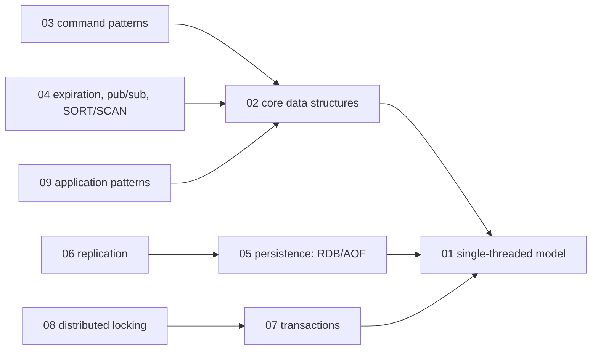
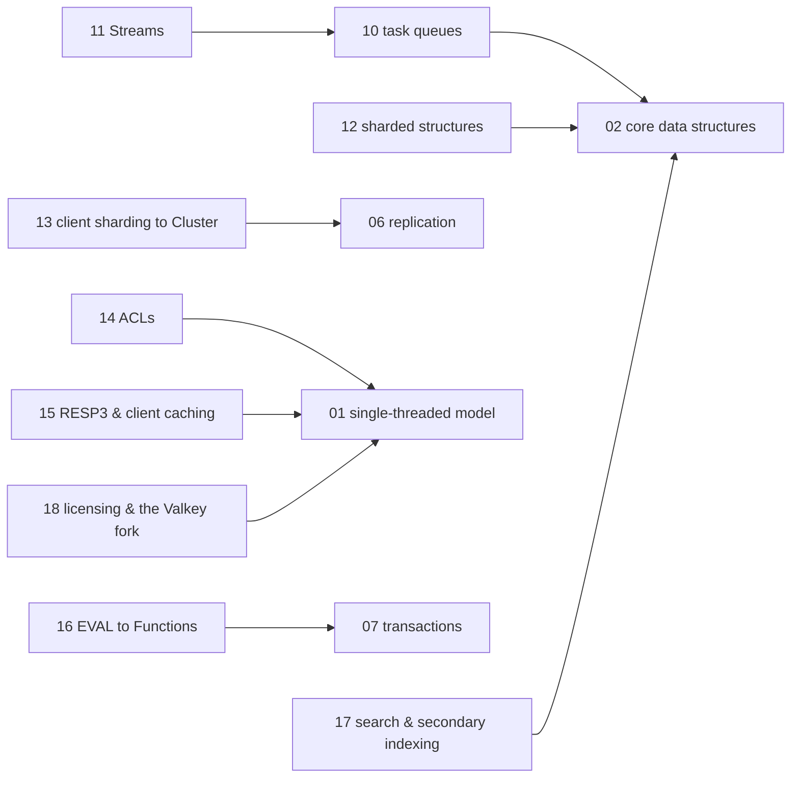

# Redis and caching — knowledge graph

*A single-threaded in-memory data-structure server, mapped from two books written in the
Redis 2.x era against a product now in its 8.x line — one that has shipped Streams, ACLs,
RESP3, Functions, a full Cluster implementation, and, since 2024, three different licenses.*

**Nodes:** 18 · **Books:** 2 · **Currency researched:** 2026-08-06
**Requires:** [`06_concurrency`](../06_concurrency/00_knowledge_graph.md) — the single-threaded execution model is best understood by contrast with OS-level threading
**Feeds:** none yet — this subject does not hand off to `12_bigquery`; its natural downstream is application architecture rather than analytics

---

## §1 Source audit

| Book | Year | Documents | Verdict |
|---|---|---|---|
| Carlson, *Redis in Action* | 2013 | Core data structures and their encodings, command patterns and pipelining, persistence (RDB/AOF), replication, transactions, application-support patterns (logging, counters, autocomplete), distributed locking and semaphores, task queues and pull messaging, search built from sorted sets, a social-network case study, memory optimization, scaling reads/writes and client-side sharding, Lua scripting | The deepest and most application-pattern-rich book on this shelf; everything it builds by hand from primitives — locks, queues, search, sharding — has a native, better-engineered successor in current Redis, which makes this subject unusually rich in `stale-major` and `absent` nodes |
| `redis.pdf`, a concise Redis primer covering the basics through Lua scripting and cluster administration | undated; content indicates circa 2012–2013 (Lua scripting present as a still-new chapter, Redis Cluster discussed ahead of its stable 3.0 release) | Building blocks and core data structures, leveraging data structures (multi-key patterns, pipelining, transactions, the `KEYS` anti-pattern), expiration/pub-sub/`SORT`/`SCAN`, Lua scripting, administration (configuration, authentication, replication, backups, scaling) | A shorter, complementary primer covering the same generation of Redis as Carlson; useful for confirming which mechanics were considered basic at the time, not a source of anything Carlson lacks |

---

## §2 Node index

| ID | Node | Type | Depth | Currency |
|---|---|---|---|---|
| `RDS-01` | The in-memory single-threaded model | Mechanism | L4 | `stale-minor` |
| `RDS-02` | Core data structures: strings, hashes, lists, sets, and sorted sets | Structure | L3 | `stale-minor` |
| `RDS-03` | Command patterns: multi-key operations, pipelining, and round-trip cost | Practice | L3 | `current` |
| `RDS-04` | Expiration, pub/sub, and the `SORT`/`SCAN` commands | Mechanism | L3 | `current` |
| `RDS-05` | Persistence: RDB snapshots and the append-only file | Mechanism | L4 | `stale-minor` |
| `RDS-06` | Replication: master/replica chains and failure handling | Mechanism | L4 | `stale-minor` |
| `RDS-07` | Transactions: `MULTI`/`EXEC`/`WATCH` | Mechanism | L4 | `current` |
| `RDS-08` | Distributed locking and counting semaphores | Algorithm | L5 | `stale-minor` |
| `RDS-09` | Application patterns: counters, autocomplete, and rate limiting | Practice | L3 | `current` |
| `RDS-10` | Task queues and pull messaging | Practice | L4 | `stale-minor` |
| `RDS-11` | Redis Streams and consumer groups | Structure | L5 | `absent` |
| `RDS-12` | Sharded structures and memory optimization | Practice | L4 | `current` |
| `RDS-13` | Scaling reads and writes: client-side sharding to Redis Cluster | Mechanism | L5 | `stale-major` |
| `RDS-14` | Access control: ACLs and authentication | Mechanism | L4 | `absent` |
| `RDS-15` | RESP3 and client-side caching | Protocol | L4 | `absent` |
| `RDS-16` | Server-side scripting: from `EVAL` to Functions | Mechanism | L5 | `stale-major` |
| `RDS-17` | Search and secondary indexing in Redis | Mechanism | L4 | `stale-major` |
| `RDS-18` | Licensing: from BSD through SSPL/RSAL to the AGPL return, and the Valkey fork | Model | L3 | `stale-major` |

---

## §3 The graph

### Core mechanics: threading model, data structures, persistence, transactions

### Queueing, scaling, security, and the current feature surface

*(`RDS02b`, `RDS06b`, `RDS01b`, `RDS07b` are the same nodes as in the first diagram, repeated as
anchors so this cluster renders independently — see §4 for the authoritative edges.)*

---

## §4 Node records

### `RDS-01` · The in-memory single-threaded model
**Type:** Mechanism · **Depth:** L4
**Covers:** single-threaded command execution eliminating lock contention, the event loop, why this makes multi-key operations atomic for free, `io-threads` as the later exception
**Sources:** Carlson ch.1 (2013) · `redis.pdf`, "The Building Blocks" (undated)
**Currency:** `stale-minor`
**Δ current:** Both sources describe a strictly single-threaded server where one thread handles all client commands, networking, and persistence bookkeeping. Redis 6.0 (2020) added optional multi-threaded I/O (`io-threads`) to parallelize socket read/write and protocol parsing while keeping command execution itself single-threaded, per Redis's own release documentation — a throughput addition, not a change to the atomicity guarantee both sources correctly attribute to single-threaded command execution. An article on this node should keep single-threaded execution as the core teaching point and add I/O threading as the scaling refinement neither source could describe.

### `RDS-02` · Core data structures: strings, hashes, lists, sets, and sorted sets
**Type:** Structure · **Depth:** L3
**Covers:** encoding choices per type, the operations each structure makes O(1) or O(log n), sorted sets as a priority-ordered index
**Sources:** Carlson ch.3 (2013) · `redis.pdf`, "The Data Structures" (undated)
**Edges:** `requires` [`RDS-01`]
**Currency:** `stale-minor`
**Δ current:** The mechanism is intact, but Redis changed the internal small-collection encoding since both sources were written: the `ziplist` encoding both describe for small lists, hashes, and sorted sets was replaced by `listpack`, current since Redis 6.2/7.0 per the Redis release notes, because `ziplist`'s cascading-update behaviour made appends to long chains slow. An article on this node should name `listpack` as the current compact encoding and mention `ziplist` only as the format it replaced.

### `RDS-03` · Command patterns: multi-key operations, pipelining, and round-trip cost
**Type:** Practice · **Depth:** L3
**Covers:** pseudo multi-key queries, references and secondary indexes built from core types, pipelining to amortize round-trip latency, the `KEYS` anti-pattern versus `SCAN`
**Sources:** Carlson §3, §4.5 (2013) · `redis.pdf`, "Leveraging Data Structures" (undated)
**Edges:** `requires` [`RDS-02`]
**Currency:** `current`

### `RDS-04` · Expiration, pub/sub, and the `SORT`/`SCAN` commands
**Type:** Mechanism · **Depth:** L3
**Covers:** key expiration and its interplay with eviction, publish/subscribe delivery semantics, the `SORT` command, cursor-based `SCAN` versus the blocking `KEYS`
**Sources:** Carlson §3.7 (2013) · `redis.pdf`, "Beyond The Data Structures" (undated)
**Edges:** `requires` [`RDS-02`]
**Currency:** `current`

### `RDS-05` · Persistence: RDB snapshots and the append-only file
**Type:** Mechanism · **Depth:** L4
**Covers:** point-in-time RDB snapshotting, AOF durability and `fsync` policy, AOF rewriting and compaction, the durability-versus-throughput trade-off between the two
**Sources:** Carlson §4.1 (2013) · `redis.pdf`, "Memory and Persistence" (undated)
**Edges:** `requires` [`RDS-01`]
**Currency:** `stale-minor`
**Δ current:** Both sources teach RDB and AOF as mutually exclusive alternatives to choose between. Redis 4.0 (2017) added a hybrid mode that stores an RDB preamble inside the AOF file (`aof-use-rdb-preamble`), combining RDB's fast reload with AOF's durability, per Redis's documentation, and this hybrid format has been the default since. An article on this node should teach RDB and AOF as complementary, with the hybrid AOF format as the current default rather than a later add-on.

### `RDS-06` · Replication: master/replica chains and failure handling
**Type:** Mechanism · **Depth:** L4
**Covers:** asynchronous replication, replica chaining, disk-write verification, promoting a replica after a master failure
**Sources:** Carlson §4.2–4.3 (2013)
**Edges:** `requires` [`RDS-05`] · `contrasts` [`MDB-12`]
**Currency:** `stale-minor`
**Δ current:** The book teaches manual replica promotion as the failure-recovery mechanism. Redis Sentinel, which automates failure detection, notification, and failover without a human running the promotion by hand, existed in early form when the book was written but has matured substantially through Redis 6 and 7, per Redis's current Sentinel documentation, and is the mechanism a current production deployment relies on rather than the manual procedure the book walks through. An article on this node should teach the manual mechanics as what Sentinel automates, not as the production procedure itself.

### `RDS-07` · Transactions: `MULTI`/`EXEC`/`WATCH`
**Type:** Mechanism · **Depth:** L4
**Covers:** command queuing and atomic execution, optimistic concurrency via `WATCH`, the absence of rollback on a runtime error inside a transaction
**Sources:** Carlson §3.7.2, §4.4 (2013) · `redis.pdf`, "Transactions" (undated)
**Edges:** `requires` [`RDS-01`] · `contrasts` [`SQL-07`]
**Currency:** `current`

### `RDS-08` · Distributed locking and counting semaphores
**Type:** Algorithm · **Depth:** L5
**Covers:** building a lock from `SETNX` and an expiring key, fine-grained and timeout-bearing locks, fair and refreshing counting semaphores, the race conditions a naive implementation misses
**Sources:** Carlson §6.2–6.3 (2013)
**Edges:** `requires` [`RDS-07`]
**Currency:** `stale-minor`
**Δ current:** The book builds a distributed lock from `SETNX` plus a separate `EXPIRE` call, which is not atomic and can leak a lock if the process dies between the two commands. Redis's own `SET key value NX PX milliseconds` form, which sets a value and an expiry atomically in one command, has been the documented recommended pattern for years, and Redis's current locking documentation discusses the Redlock algorithm for locks that must survive a single node's failure — a correctness discussion published after the book and still debated in the distributed-systems community. An article on this node should build the lock from the atomic `SET NX PX` form and treat Redlock as the current, contested extension for multi-node correctness.

### `RDS-09` · Application patterns: counters, autocomplete, and rate limiting
**Type:** Practice · **Depth:** L3
**Covers:** counters and statistics storage, prefix-based autocomplete with sorted sets, sliding-window rate limiting
**Sources:** Carlson §5.2, §6.1 (2013)
**Edges:** `requires` [`RDS-02`]
**Currency:** `current`

### `RDS-10` · Task queues and pull messaging
**Type:** Practice · **Depth:** L4
**Covers:** FIFO queues from `LPUSH`/`BRPOP`, delayed tasks via a sorted set used as a priority timer, pub/sub-based pull messaging as an alternative to a queue
**Sources:** Carlson §6.4–6.5 (2013)
**Edges:** `requires` [`RDS-02`]
**Currency:** `stale-minor`
**Δ current:** The book's queue patterns predate Redis Streams. Redis 5.0, released in late 2018 per Redis's own release blog post, added the Stream data type with consumer groups, delivery acknowledgment, and replay from an arbitrary ID — a durable, log-structured primitive purpose-built for exactly the queueing and pull-messaging problems this chapter solves with lists and pub/sub. An article on this node should teach Streams (`RDS-11`) as the current-generation answer and the `LPUSH`/`BRPOP` pattern as the mechanism it exists to replace wherever consumer-group semantics or replay are needed.

### `RDS-11` · Redis Streams and consumer groups
**Type:** Structure · **Depth:** L5
**Covers:** `XADD`/`XREAD`/`XRANGE`, consumer groups and the pending-entries list, `XACK` and delivery guarantees, replay from an arbitrary stream ID
**Sources:** —
**Edges:** `requires` [`RDS-10`]
**Currency:** `absent`
**Δ current:** Neither book on this shelf covers Streams; both predate Redis 5.0 (2018), where the type was introduced. Streams are the current mechanism Redis's own documentation recommends for durable, replayable, multi-consumer event logs inside Redis, positioned as a lighter-weight alternative to a dedicated broker such as Kafka for moderate-throughput use cases. An article on this node has no book here to draw from and should be written from the current Redis Streams documentation directly.

### `RDS-12` · Sharded structures and memory optimization
**Type:** Practice · **Depth:** L4
**Covers:** sharding a large hash or set across many keys to bound per-key memory, bit-packing, the small-collection encoding thresholds that decide when a structure switches representation
**Sources:** Carlson ch.9 (2013)
**Edges:** `requires` [`RDS-02`]
**Currency:** `current`

### `RDS-13` · Scaling reads and writes: client-side sharding to Redis Cluster
**Type:** Mechanism · **Depth:** L5
**Covers:** manual client-side sharding and its resharding pain, the 16,384 hash-slot model, `MOVED`/`ASK` redirection, the single-hash-slot constraint on multi-key operations and transactions
**Sources:** Carlson ch.10 (2013)
**Edges:** `requires` [`RDS-06`] · `contrasts` [`MDB-14`]
**Currency:** `stale-major`
**Δ current:** Carlson's chapter (2013) predates Redis Cluster's stable release and teaches manual client-side sharding — consistent hashing implemented by the application — as the scaling answer, describing the shape Redis Cluster would later formalize as still forthcoming. Redis Cluster shipped as a stable, production feature in Redis 3.0 (April 2015), and by 2025–2026 is documented as production-mature, handling three to a thousand nodes with built-in resharding via `MOVED`/`ASK` redirection, per current Redis Cluster documentation and independent production guides. An article on this node should teach Redis Cluster as the current mechanism and manual client-side sharding as the historical technique it made unnecessary, while keeping the book's cross-slot operation limitation as still accurate today.

### `RDS-14` · Access control: ACLs and authentication
**Type:** Mechanism · **Depth:** L4
**Covers:** per-user command and key-pattern permissions, least-privilege accounts, migration away from a single shared password
**Sources:** —
**Edges:** `requires` [`RDS-01`]
**Currency:** `absent`
**Δ current:** Both books describe a single shared `requirepass` password as the entire authentication model, because Redis ACLs did not exist yet. Redis 6.0, a landmark release per Redis's own "Diving into Redis 6" announcement, added multi-user ACLs with per-user command and key-pattern restrictions, letting a deployment create narrowly scoped users instead of one shared credential. An article on this node has no book here to draw from and should be written from the current ACL documentation.

### `RDS-15` · RESP3 and client-side caching
**Type:** Protocol · **Depth:** L4
**Covers:** the RESP3 wire protocol's richer typed replies (maps, sets, doubles), server-assisted client-side (tracking-based) caching and its invalidation push messages
**Sources:** —
**Edges:** `requires` [`RDS-01`]
**Currency:** `absent`
**Δ current:** Neither book describes anything past RESP2, the protocol in place when both were written. Redis 6.0 introduced RESP3, giving typed replies that let client libraries map results more directly onto host-language types, together with server-assisted client-side caching that pushes invalidation messages when a tracked key changes, per Redis's release documentation. An article on this node has no book here to draw from and should be written from the current protocol specification and client-side-caching documentation.

### `RDS-16` · Server-side scripting: from `EVAL` to Functions
**Type:** Mechanism · **Depth:** L5
**Covers:** stateless `EVAL`/`EVALSHA` and the SHA1 script cache, atomicity of a script's execution, moving lock/semaphore logic into a script, Redis Functions as a named, versioned, persisted successor
**Sources:** Carlson ch.11 (2013) · `redis.pdf`, "Lua Scripting" (undated)
**Edges:** `requires` [`RDS-07`]
**Currency:** `stale-major`
**Δ current:** Both sources teach `EVAL`/`EVALSHA` as the only server-side scripting mechanism, with scripts identified by an ephemeral SHA1 hash that is lost on restart unless the client reloads it. Redis 7.0 introduced Functions, called via `FCALL`, which are named, versioned libraries persisted in the RDB/AOF files and replicated automatically, and Redis's own tutorial on the feature describes Functions as the preferred approach for new server-side logic. An article on this node should teach `EVAL` as the mechanism that still underlies scripting and Functions as the current, operable way to ship it, since a script that cannot be named, versioned, or shared between other scripts is a maintenance liability Functions was built to remove.

### `RDS-17` · Search and secondary indexing in Redis
**Type:** Mechanism · **Depth:** L4
**Covers:** building a search index from sorted-set intersections by hand, sorting search results, ad-targeting-style multi-criteria filtering
**Sources:** Carlson ch.7 (2013)
**Edges:** `requires` [`RDS-02`]
**Currency:** `stale-major`
**Δ current:** The book builds full-text and multi-criteria search by hand from sorted-set intersections, because Redis had no native indexing module in 2013. RediSearch, bundled as the Redis Query Engine capability in current Redis Stack and Redis 8 distributions, provides native secondary indexing, full-text search, and vector similarity search without hand-built set-intersection logic, per Redis's current product documentation. An article on this node should teach the hand-built technique as conceptually worth understanding and the Query Engine as what a current deployment should actually run.

### `RDS-18` · Licensing: from BSD through SSPL/RSAL to the AGPL return, and the Valkey fork
**Type:** Model · **Depth:** L3
**Covers:** the original BSD 3-clause license both books were written under, the March 2024 move to dual RSALv2/SSPLv1 licensing, the Linux Foundation's Valkey fork of the last BSD-licensed release, Redis 8.0's tri-license including AGPLv3
**Sources:** —
**Edges:** `requires` [`RDS-01`]
**Currency:** `absent`
**Δ current:** Both books were written under Redis's original three-clause BSD license and have no reason to discuss licensing at all. On 20 March 2024, Redis Inc. moved Redis to dual RSALv2/SSPLv1 source-available licensing effective from Redis 7.4, restricting managed-service resale; within a week the Linux Foundation forked the last BSD-licensed release (7.2.4) as Valkey, backed by AWS, Google Cloud, and other major cloud vendors, per Redis's own license page and contemporaneous reporting. On 1 May 2025, Redis 8.0 added AGPLv3, an OSI-approved open-source license, as a third option alongside RSALv2/SSPLv1 — a move credited partly to original author Salvatore Sanfilippo rejoining the company. An article on this node must state which distribution — Redis Inc.'s Redis or the Valkey fork — a given claim applies to, since the two have begun to diverge operationally even though their command surfaces remain nearly identical as of this writing.

---

## §5 Cross-subject edges

| From | Edge | To | Why |
|---|---|---|---|
| `RDS-06` | `contrasts` | `MDB-12` | Asynchronous replication with historically manual promotion versus MongoDB's automatic election-based failover on an oplog |
| `RDS-07` | `contrasts` | `SQL-07` | Optimistic `MULTI`/`WATCH`/`EXEC` with no mid-transaction rollback versus lock-based/MVCC ACID transactions |
| `RDS-13` | `contrasts` | `MDB-14` | A fixed 16,384-hash-slot cluster model versus shard-key selection on cardinality, frequency, and monotonicity — both are horizontal partitioning, with different knobs |

---

## §6 Coverage gaps

Both books on this shelf predate essentially every mechanism a current production Redis deployment
depends on for anything beyond basic caching: Streams (2018), ACLs and RESP3 (2020), Functions
(2022), and the 2024–2025 licensing upheaval are all `absent` or `stale-major` here, which makes
this subject's currency pass the heaviest of the four in this batch relative to its single-digit
book count. Five of eighteen nodes (`RDS-11`, `RDS-14`, `RDS-15`) carry `Sources: —` outright, and
three more (`RDS-13`, `RDS-16`, `RDS-17`) are `stale-major` because the book's hand-built technique
has a native successor the book could not have known about.

Nothing on this shelf covers Redis as a vector database, which current Redis 8.x documentation
markets heavily alongside RediSearch's vector similarity support — that capability postdates both
books by a decade and would need its own node once a source exists to ground it beyond a vendor
blog post.

Nothing here covers RDMA, io_uring-based I/O, or any of the lower-level performance work Redis has
done in its 7.x/8.x releases; both books' persistence and replication chapters describe the
mechanism at the level of RDB/AOF/oplog concepts rather than the kernel-interface layer beneath
them, and that layer is out of scope for an application-facing treatment in any case.

The relationship between Redis and Valkey is evolving in real time as of this pass — `RDS-18`
states the fork's origin and the current tri-license as of Redis 8.0, but a reader building on this
node six months from now should re-verify both projects' current licensing and feature parity
directly rather than trusting this graph's snapshot indefinitely, which is the one node in this
subject where the currency pass itself has the shortest shelf life.

← [repo index](../README.md) · [root graph](../KNOWLEDGE_GRAPH.md) · [writing contract](../AGENTS.md)
