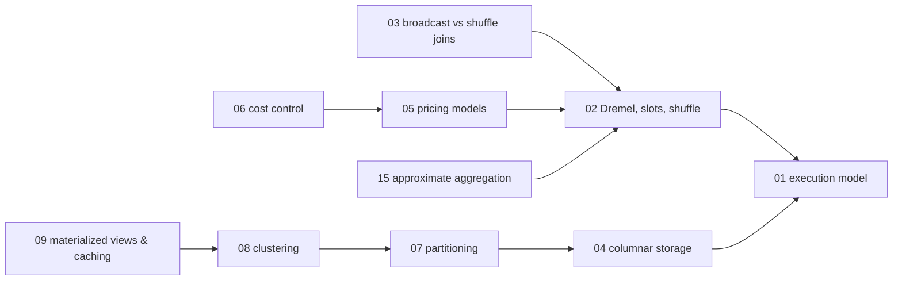
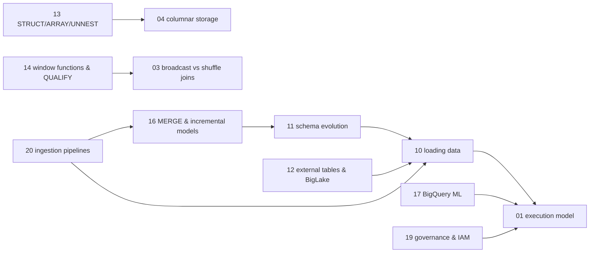

# BigQuery — knowledge graph

*A serverless, distributed SQL engine built on Dremel, mapped from a 2020 book against a pricing
model, storage-governance layer, and ML surface that have all changed materially since — the
terminus of this repository's data-engineering path, receiving from `09_sql` and `10_mongodb`
and feeding nothing further downstream.*

**Nodes:** 20 · **Books:** 1 · **Currency researched:** 2026-08-06
**Requires:** [`09_sql`](../09_sql/00_knowledge_graph.md) — window functions and analytical SQL transfer directly; [`10_mongodb`](../10_mongodb/00_knowledge_graph.md) for the ingestion boundary
**Feeds:** none — this is the terminus of the data-engineering path in this repository

---

## §1 Source audit

| Book | Year | Documents | Verdict |
|---|---|---|---|
| Lakshmanan & Tigani, *Google BigQuery: The Definitive Guide* (`Valliappa+Lakshmanan_...pdf`) | 2020 | BigQuery's architecture and the Dremel execution model, query essentials and data types, loading and federated queries, developing programmatically, performance and cost optimization under flat-rate/on-demand pricing, advanced queries (arrays, structs, window functions, UDFs), BigQuery ML, administration and security | The only full-length book on this shelf, and thorough on everything that has not changed — the Dremel/slot execution model, columnar storage, join mechanics, array/struct modelling. Its pricing chapter is the single most out-of-date section: it predates BigQuery Editions by three years |
| `9789352139217_toc.pdf` | 2020 | An independently extracted table of contents covering the identical chapter structure and page-range pattern as the O'Reilly edition above | Confirmed by direct comparison of section titles and ordering to be a second extraction of the same book, not a distinct source — every node below cites the O'Reilly edition only, since the two TOCs are functionally identical |
| `dokumen.pub_google-bigquery-the-definitive-guide-...9781492044468.epub` | 2020 | The same O'Reilly title again, this time as an EPUB, whose navigation document yields a finer-grained 466-entry contents listing than the PDF outline's 234 | A third copy of one book, not a third book. It appeared in `_toc/` when `extract_toc.py` gained EPUB support and began globbing `*.epub`; its ISBN, 9781492044468, is the electronic ISBN of the same edition cited in the first row. It is recorded here so that the audit row count and the `_toc/` file count agree, and cited nowhere below |

---

## §2 Node index

| ID | Node | Type | Depth | Currency |
|---|---|---|---|---|
| `BQ-01` | Serverless distributed SQL: BigQuery's execution model | Model | L4 | `current` |
| `BQ-02` | The Dremel execution tree, slots, and shuffle | Mechanism | L5 | `current` |
| `BQ-03` | Broadcast versus shuffle joins | Mechanism | L4 | `current` |
| `BQ-04` | Columnar storage: Capacitor and column pruning | Structure | L4 | `current` |
| `BQ-05` | Pricing models: on-demand, Editions, and slot reservations | Model | L4 | `stale-major` |
| `BQ-06` | Cost control: bytes scanned, dry runs, and budget guards | Practice | L4 | `current` |
| `BQ-07` | Partitioning strategy and `require_partition_filter` | Mechanism | L5 | `current` |
| `BQ-08` | Clustering and block pruning | Mechanism | L4 | `current` |
| `BQ-09` | Materialized views, BI Engine, and result caching | Mechanism | L4 | `stale-minor` |
| `BQ-10` | Loading data: batch jobs, the Storage Write API, and streaming inserts | Mechanism | L4 | `stale-major` |
| `BQ-11` | Schema evolution and the `REQUIRED` one-way door | Mechanism | L3 | `current` |
| `BQ-12` | External tables, federated queries, and BigLake | Mechanism | L4 | `stale-major` |
| `BQ-13` | Nested and repeated fields: `STRUCT`, `ARRAY`, and `UNNEST` | Mechanism | L5 | `current` |
| `BQ-14` | Window functions and `QUALIFY` at warehouse scale | Mechanism | L4 | `current` |
| `BQ-15` | Approximate aggregation | Algorithm | L4 | `current` |
| `BQ-16` | Incremental modelling with `MERGE` | Mechanism | L4 | `current` |
| `BQ-17` | BigQuery ML | Mechanism | L4 | `stale-minor` |
| `BQ-18` | Search indexes and the `SEARCH` function | Mechanism | L3 | `absent` |
| `BQ-19` | Governance: IAM, row/column-level security, and data loss prevention | Mechanism | L4 | `current` |
| `BQ-20` | Ingestion pipelines from an external OLTP or document source | Practice | L5 | `stale-minor` |

---

## §3 The graph

### The execution engine and cost model

### Loading, modelling, ML, and governance

*(`BQ01b`, `BQ04b`, `BQ03b` are the same nodes as in the first diagram, repeated as anchors so
this cluster renders independently — see §4 for the authoritative edges.)*

*`BQ-18` carries only an `absent`-tag dependency on columnar storage stated in its record; it is
omitted from this diagram because its sole edge (`requires BQ-04`) is already shown through
`BQ-13`'s identical dependency and adding it would not change the diagram's shape.*

---

## §4 Node records

### `BQ-01` · Serverless distributed SQL: BigQuery's execution model
**Type:** Model · **Depth:** L4
**Covers:** separation of compute and storage, comparison to a traditional RDBMS and to the MapReduce framework, how a query request becomes a job
**Sources:** Lakshmanan & Tigani ch.1, ch.6 "High-Level Architecture" (2020)
**Edges:** `contrasts` [`SQL-17`, `CONC-15`]
**Currency:** `current`

### `BQ-02` · The Dremel execution tree, slots, and shuffle
**Type:** Mechanism · **Depth:** L5
**Covers:** query decomposition into stages, the slot as the unit of parallel execution, reading `INFORMATION_SCHEMA.JOBS` for stage timings, skew detected as max-versus-average slot time within a stage
**Sources:** Lakshmanan & Tigani ch.6 "Query Engine (Dremel)" (2020)
**Edges:** `requires` [`BQ-01`]
**Currency:** `current`

### `BQ-03` · Broadcast versus shuffle joins
**Type:** Mechanism · **Depth:** L4
**Covers:** small-side broadcast to every worker, large-side redistribution by join key, join-key cardinality and skew as the plan driver
**Sources:** Lakshmanan & Tigani §7 "Performing Efficient Joins" (2020)
**Edges:** `requires` [`BQ-02`]
**Currency:** `current`

### `BQ-04` · Columnar storage: Capacitor and column pruning
**Type:** Structure · **Depth:** L4
**Covers:** column-wise on-disk layout, why `SELECT *` is the expensive default, compression on homogeneous columns, choosing an efficient input storage format (Avro/Parquet/ORC)
**Sources:** Lakshmanan & Tigani ch.6 "Storage" (2020)
**Edges:** `requires` [`BQ-01`] · `contrasts` [`SQL-06`]
**Currency:** `current`

### `BQ-05` · Pricing models: on-demand, Editions, and slot reservations
**Type:** Model · **Depth:** L4
**Covers:** bytes-scanned on-demand billing, the crossover point for reserved capacity, autoscaling reservations
**Sources:** Lakshmanan & Tigani §1 "How BigQuery Came About", §7 "Principles of Performance" (2020)
**Edges:** `requires` [`BQ-02`]
**Currency:** `stale-major`
**Δ current:** The book documents flat-rate monthly and annual slot commitments as the reserved-capacity alternative to on-demand pricing. Google announced BigQuery Editions on 29 March 2023, replacing flat-rate reservations with three tiers (Standard, Enterprise, Enterprise Plus) billed by autoscaling slot-time, per Google Cloud's edition and pricing documentation; new flat-rate and flex-slot commitments stopped being sellable on 5 July 2023, the same day on-demand per-terabyte pricing rose roughly 25%. An article on this node must teach Editions as the current reserved-capacity product and describe flat-rate slots only as the superseded predecessor a legacy contract might still be running under.

### `BQ-06` · Cost control: bytes scanned, dry runs, and budget guards
**Type:** Practice · **Depth:** L4
**Covers:** bytes scanned as the only cost metric that matters on demand, `LIMIT` not reducing bytes scanned, `--dry_run` pricing, `maximum_bytes_billed`, cost attribution via job labels
**Sources:** Lakshmanan & Tigani §7 "Controlling Cost", "Measuring and Troubleshooting" (2020)
**Edges:** `requires` [`BQ-05`]
**Currency:** `current`

### `BQ-07` · Partitioning strategy and `require_partition_filter`
**Type:** Mechanism · **Depth:** L5
**Covers:** ingestion-time, column-based, and integer-range partitioning, the roughly 4,000-partition ceiling, `require_partition_filter` as a hard guard against an accidental full scan
**Sources:** Lakshmanan & Tigani §7 "Partitioning Tables to Reduce Scan Size" (2020)
**Edges:** `requires` [`BQ-04`]
**Currency:** `current`

### `BQ-08` · Clustering and block pruning
**Type:** Mechanism · **Depth:** L4
**Covers:** sort-based block skipping within a partition, soft pruning that improves with filter selectivity, re-clustering as new data arrives
**Sources:** Lakshmanan & Tigani §7 "Clustering Tables Based on High-Cardinality Keys" (2020)
**Edges:** `requires` [`BQ-07`]
**Currency:** `current`

### `BQ-09` · Materialized views, BI Engine, and result caching
**Type:** Mechanism · **Depth:** L4
**Covers:** 24-hour free result caching for identical queries, incremental materialized-view maintenance with automatic query substitution, BI Engine's in-memory dashboard layer
**Sources:** Lakshmanan & Tigani §2 "Saving and Sharing" (2020)
**Edges:** `requires` [`BQ-08`]
**Currency:** `stale-minor`
**Δ current:** The book (2020) covers materialized views as a general feature. Materialized views over change-data-capture (CDC) tables — with automatic incremental refresh across streaming UPSERT operations — are a later addition; Google's 2024 BigQuery release notes describe rolling out CDC-compatible materialized views under general availability, along with restrictions specific to CDC-backed base tables the book cannot describe. An article on this node should teach the book's materialized-view mechanics as still accurate and add the CDC-specific restrictions as the later refinement.

### `BQ-10` · Loading data: batch jobs, the Storage Write API, and streaming inserts
**Type:** Mechanism · **Depth:** L4
**Covers:** free batch load jobs as the default ingestion path, the legacy per-row-billed streaming-insert API and its buffer, DML restrictions on buffered rows
**Sources:** Lakshmanan & Tigani ch.4 "Loading Data into BigQuery" (2020)
**Edges:** `requires` [`BQ-01`] · `contrasts` [`DE-12`]
**Currency:** `stale-major`
**Δ current:** The book's ingestion chapter (2020) documents batch loads and the legacy streaming-insert API (`tabledata.insertAll`) as the two paths in, with the streaming buffer's DML restrictions as the operational catch. Google introduced the BigQuery Storage Write API as the recommended streaming path, offering exactly-once semantics per stream at lower cost than legacy streaming inserts, and current Google Cloud documentation positions legacy streaming inserts as the option to avoid for new pipelines. An article on this node should teach load jobs as the free default and the Storage Write API as the current streaming path, keeping legacy streaming inserts only for the buffer-DML restriction the book describes, which still applies to it.

### `BQ-11` · Schema evolution and the `REQUIRED` one-way door
**Type:** Mechanism · **Depth:** L3
**Covers:** adding a `NULLABLE` column and relaxing `REQUIRED` to `NULLABLE` in place, narrowing or renaming as a forced table rewrite
**Sources:** Lakshmanan & Tigani §4 "Specifying a Schema" (2020)
**Edges:** `requires` [`BQ-10`]
**Currency:** `current`

### `BQ-12` · External tables, federated queries, and BigLake
**Type:** Mechanism · **Depth:** L4
**Covers:** querying data in place in Cloud Storage/Bigtable/Sheets without loading, the performance and partitioning trade-off against native tables
**Sources:** Lakshmanan & Tigani ch.4 "Federated Queries and External Data Sources" (2020)
**Edges:** `requires` [`BQ-10`]
**Currency:** `stale-major`
**Δ current:** The book's federated-query chapter (2020) documents external tables over Cloud Storage, Bigtable, and Sheets as the query-in-place mechanism. BigLake, introduced afterward, adds a governance and fine-grained access-control layer over exactly those external sources and makes open table formats such as Apache Iceberg and Parquet first-class BigQuery citizens with performance acceleration plain external tables lack, per Google's own BigLake research publication (2024) and current documentation; BigQuery Omni extends the same model to run analysis against data physically stored in AWS S3 and Azure Blob Storage. An article on this node should teach plain external tables as the book describes them and add BigLake and Omni as the current governed, multi-cloud evolution of the same idea.

### `BQ-13` · Nested and repeated fields: `STRUCT`, `ARRAY`, and `UNNEST`
**Type:** Mechanism · **Depth:** L5
**Covers:** pre-materializing a one-to-many relationship inside a single row, `ARRAY_AGG` construction, `UNNEST` for flattening on read, why this reduces the join count relative to a normalized schema
**Sources:** Lakshmanan & Tigani ch.2 "A Brief Primer on Arrays and Structs", ch.8 "Working with Arrays" (2020)
**Edges:** `requires` [`BQ-04`] · `contrasts` [`SQL-11`]
**Currency:** `current`

### `BQ-14` · Window functions and `QUALIFY` at warehouse scale
**Type:** Mechanism · **Depth:** L4
**Covers:** `ROW_NUMBER`/`RANK` partitioned over billions of rows, `QUALIFY` as a single-pass filter replacing a wrapping subquery, partition-key skew as a shuffle cost
**Sources:** Lakshmanan & Tigani ch.8 "Window Functions" (2020)
**Edges:** `requires` [`BQ-03`]
**Currency:** `current`

### `BQ-15` · Approximate aggregation
**Type:** Algorithm · **Depth:** L4
**Covers:** HyperLogLog++ sketches, the `APPROX_COUNT_DISTINCT` error/cost trade-off, storing and merging sketches incrementally, judging when approximation is defensible
**Sources:** Lakshmanan & Tigani §7 "Using Approximate Aggregation Functions" (2020)
**Edges:** `requires` [`BQ-02`]
**Currency:** `current`

### `BQ-16` · Incremental modelling with `MERGE`
**Type:** Mechanism · **Depth:** L4
**Covers:** `MERGE` on a business key, restricting the source to affected partitions to avoid a full-history scan, table clones/snapshots and time travel
**Sources:** Lakshmanan & Tigani ch.8 "Data Definition Language and Data Manipulation Language" (2020)
**Edges:** `requires` [`BQ-11`]
**Currency:** `current`

### `BQ-17` · BigQuery ML
**Type:** Mechanism · **Depth:** L4
**Covers:** `CREATE MODEL` for regression, classification, and k-means clustering in SQL, hyperparameter tuning, AutoML and TensorFlow integration
**Sources:** Lakshmanan & Tigani ch.9 "Machine Learning in BigQuery" (2020)
**Edges:** `requires` [`BQ-01`]
**Currency:** `stale-minor`
**Δ current:** The book's BigQuery ML chapter (2020) covers regression, classification, k-means, and matrix-factorization recommenders through `CREATE MODEL`. Google has since added `AI.FORECAST` and `AI.DETECT_ANOMALIES`, built on the pre-trained TimesFM foundation model, as generally available time-series forecasting functions callable directly from SQL and Connected Sheets, per Google's current BigQuery ML documentation — a foundation-model-based capability the book's per-dataset `CREATE MODEL` workflow does not anticipate. An article on this node should teach the book's model-training workflow as the still-current path for classic supervised models and add the forecasting functions as the newer, foundation-model alternative for time series specifically.

### `BQ-18` · Search indexes and the `SEARCH` function
**Type:** Mechanism · **Depth:** L3
**Covers:** tokenized indexing over unstructured or semi-structured text columns, the `SEARCH` function's optimizer integration with `=`, `IN`, `LIKE`, and `STARTS_WITH`
**Sources:** —
**Edges:** `requires` [`BQ-04`]
**Currency:** `absent`
**Δ current:** Search indexes and the `SEARCH` function postdate the 2020 book. Google launched them in public preview in April 2022 and general availability in October 2022, then expanded optimizer support to the equality, `IN`, `LIKE`, and `STARTS_WITH` operators in September 2023, per Google Cloud's own product blog posts. An article on this node has no book on this shelf to draw from and should be written from the current BigQuery search documentation directly.

### `BQ-19` · Governance: IAM, row/column-level security, and data loss prevention
**Type:** Mechanism · **Depth:** L4
**Covers:** identity/role/resource IAM model, restricting access to row or column subsets, customer-managed encryption keys (CMEK), audit logging
**Sources:** Lakshmanan & Tigani ch.10 "Administering and Securing BigQuery" (2020)
**Edges:** `requires` [`BQ-01`]
**Currency:** `current`

### `BQ-20` · Ingestion pipelines from an external OLTP or document source
**Type:** Practice · **Depth:** L5
**Covers:** Datastream and the Data Transfer Service for managed sync, CDC sequence numbers for ordering streaming UPSERT operations, deduplication under at-least-once delivery, the schema-inference problem when the upstream source is schemaless
**Sources:** Lakshmanan & Tigani ch.4 "Transfers and Exports" (2020)
**Edges:** `requires` [`BQ-10`, `BQ-16`] · `contrasts` [`MDB-17`]
**Currency:** `stale-minor`
**Δ current:** The book's transfer chapter (2020) covers the Data Transfer Service and Cloud Dataflow as the moving-data-in mechanisms. BigQuery's `_CHANGE_SEQUENCE_NUMBER` construct for ordering streaming UPSERT operations during CDC ingestion is a later addition, in preview per Google's current change-data-capture documentation, addressing exactly the ordering and deduplication problem a schemaless upstream source such as MongoDB creates. This is the node that receives `10_mongodb`'s pipeline-out edge, and an article here should treat the MongoDB-to-BigQuery schema-inference problem as a first-class worked example.

---

## §5 Cross-subject edges

| From | Edge | To | Why |
|---|---|---|---|
| `BQ-01` | `contrasts` | `SQL-17` | Serverless separation of compute and storage versus the three-tier ETL warehouse architecture older sources describe |
| `BQ-01` | `contrasts` | `CONC-15` | Dremel's stage/slot fan-out and shuffle versus the MapReduce and reduction-operator patterns `CONC-15` covers at the single-process level |
| `BQ-04` | `contrasts` | `SQL-06` | Capacitor's columnar layout versus B-tree/hash row-store internals — the same storage-structure question with opposite answers |
| `BQ-13` | `contrasts` | `SQL-11` | `STRUCT`/`ARRAY` denormalization that pre-materializes a one-to-many relationship inside a row versus normalization to eliminate update anomalies |
| `BQ-20` | `contrasts` | `MDB-17` | The same MongoDB-to-BigQuery ingestion seam described from the sink side here and from the source side in `10_mongodb` |
| `BQ-10` | `contrasts` | `DE-12` | BigQuery's own batch/Storage-Write-API/streaming ingestion mechanisms versus Beam's portable pipeline abstraction in `DE-12`, which commonly writes into BigQuery via a managed Dataflow runner |

---

---

## §6 Coverage gaps

This subject has exactly one full-length book, and — unlike MongoDB's shelf — it is only six years
old rather than a decade, which keeps most nodes `current` or `stale-minor`. The two `stale-major`
nodes that exist (`BQ-05` pricing, `BQ-10` ingestion, and `BQ-12` federated/BigLake) share a common
cause: Google restructured BigQuery's commercial and governance surface — Editions pricing (2023),
the Storage Write API's promotion to the recommended streaming path, and BigLake's governance layer
over external tables — in the three years immediately after the book's publication, faster than the
book's underlying execution-engine material (Dremel, slots, columnar storage, join mechanics) has
moved at all.

Nothing here covers BigQuery's vector search and embedding-generation functions in any depth beyond
what `BQ-17`'s `Δ current` line mentions in passing; vector search inside BigQuery is a live,
fast-moving area as of this pass and would need dedicated current documentation to ground a node
properly rather than a single derived sentence.

`BQ-02`'s slot and shuffle treatment is measurable at zero cost through `INFORMATION_SCHEMA.JOBS`
against a public dataset, and `BQ-06`'s bytes-scanned claims are measurable at zero cost through
`bq query --dry_run` — both were flagged as the cheapest genuinely measurable claims in this
subject's now-archived syllabus, and whoever writes the article on either node should cite
BigQuery's own `INFORMATION_SCHEMA.JOBS` and `bq query --dry_run` documentation for those figures
rather than a book; nothing about the currency pass changes that opportunity.

The Beam/Dataflow pipeline material that would complete `BQ-20`'s ingestion story — windowing,
watermarks, triggers, and autoscaling/fusion behaviour on the Dataflow runner specifically — has no
book on this shelf at all; the archived syllabus scoped an entire module to it and that scope is
absorbed here only as the two sentences in `BQ-20`'s `Covers` line about CDC sequencing and
deduplication. A full treatment of Beam's programming model belongs to `21_dataengineering`, which
has no assigned prefix yet in this repository, and `BQ-20` should stay scoped to the BigQuery-side
half of that pipeline until that subject exists.

← [repo index](../README.md) · [root graph](../KNOWLEDGE_GRAPH.md) · [writing contract](../AGENTS.md)
