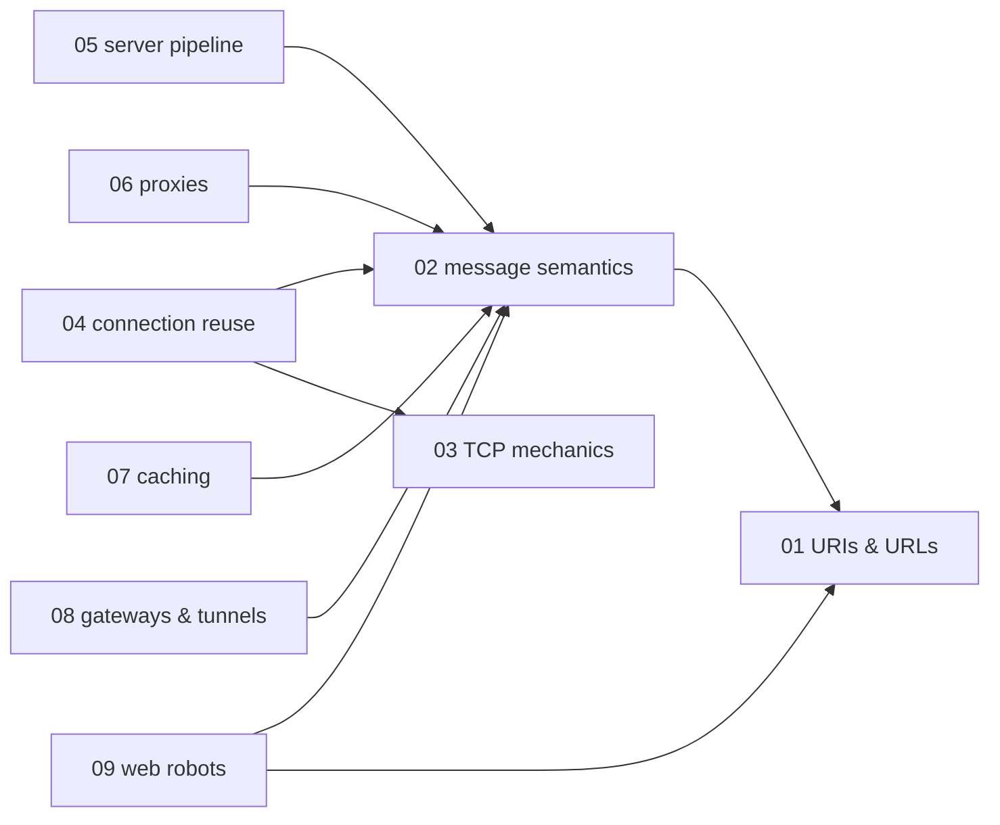
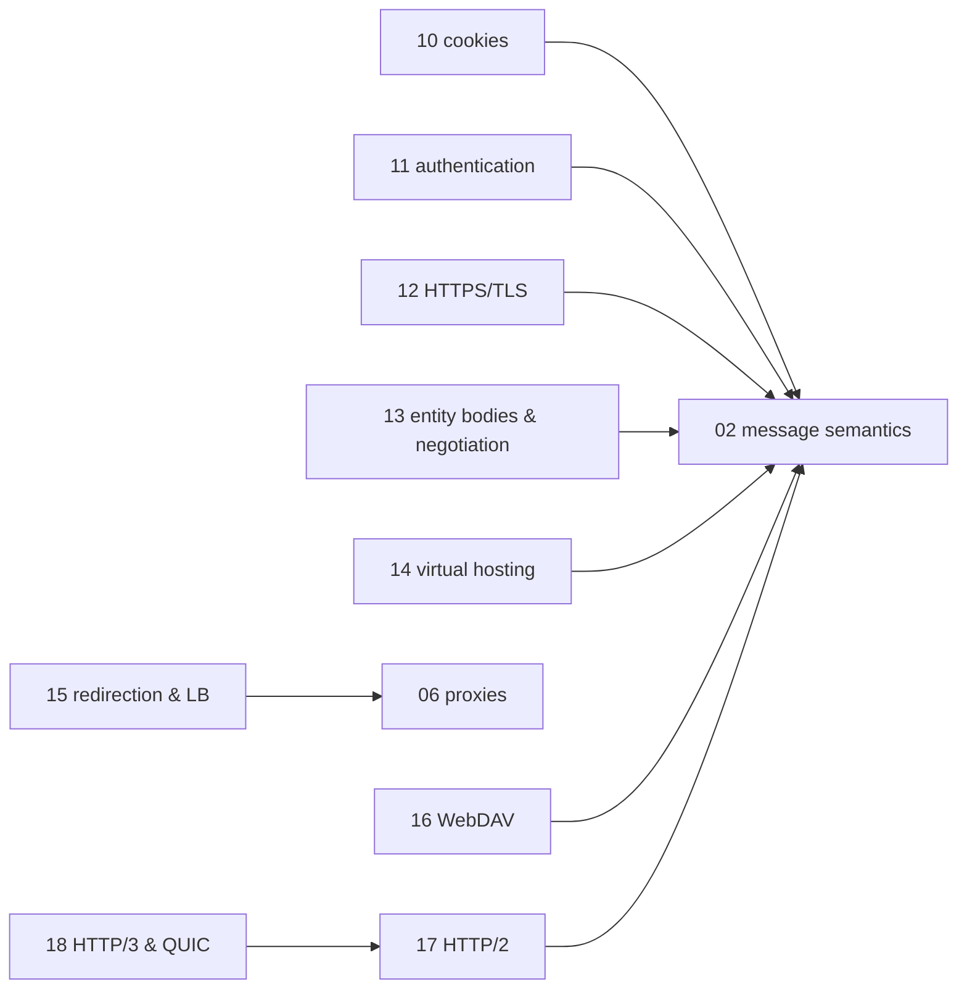

# HTTP — knowledge graph

*The protocol that carries the rest of the web stack: message syntax, connection management,
caching, intermediaries, and the security and identity layers bolted onto it — read against a
2002 book describing a protocol that has since been re-specified twice.*

**Nodes:** 18 · **Books:** 1 · **Currency researched:** 2026-08-06
**Requires:** [`01_computation`](../01_computation/00_knowledge_graph.md)
**Feeds:** [`14_browser_networking`](../14_browser_networking/00_knowledge_graph.md), [`15_websocket`](../15_websocket/00_knowledge_graph.md), [`16_webrtc`](../16_webrtc/00_knowledge_graph.md), [`17_grpc`](../17_grpc/00_knowledge_graph.md)

---

## §1 Source audit

| Book | Year | Documents | Verdict |
|---|---|---|---|
| Totty & Gourley, *HTTP: The Definitive Guide* | 2002 | HTTP/0.9 through 1.1 under RFC 2616, proxies, caching, gateways/tunnels, robots, cookies, Basic/Digest auth, SSL-era HTTPS, entity encoding, i18n, virtual hosting, redirection/load-balancing protocols, WebDAV, MIME reference | Exhaustive and still the clearest exposition of HTTP/1.1 message mechanics and the cache freshness algorithm available on this shelf. It predates HTTP/2 and HTTP/3 entirely, documents authentication and cookie mechanisms since replaced, and its SSL/TLS chapter describes a handshake TLS 1.3 restructured. Every node below states what carries forward and what does not |

---

## §2 Node index

| ID | Node | Type | Depth | Currency |
|---|---|---|---|---|
| `HTTP-01` | URIs, URLs, and resource identification | Structure | L3 | `stale-minor` |
| `HTTP-02` | Request/response message semantics | Protocol | L4 | `stale-major` |
| `HTTP-03` | TCP transport mechanics underlying HTTP | Mechanism | L4 | `stale-minor` |
| `HTTP-04` | Connection reuse: keep-alive, pipelining, and head-of-line blocking | Mechanism | L4 | `stale-major` |
| `HTTP-05` | Web server request-processing pipeline | Mechanism | L3 | `stale-minor` |
| `HTTP-06` | Proxies and web intermediaries | Practice | L4 | `stale-minor` |
| `HTTP-07` | HTTP caching: freshness, validation, and cache-control | Mechanism | L4 | `stale-minor` |
| `HTTP-08` | Gateways, tunnels, and the CONNECT method | Mechanism | L4 | `stale-minor` |
| `HTTP-09` | Web robots, crawling, and robots.txt | Practice | L3 | `stale-minor` |
| `HTTP-10` | Client identification and cookies | Mechanism | L4 | `stale-major` |
| `HTTP-11` | HTTP authentication: challenge/response schemes | Protocol | L4 | `stale-major` |
| `HTTP-12` | HTTPS: TLS integration and certificate trust | Protocol | L5 | `stale-major` |
| `HTTP-13` | Entity bodies: content negotiation, transfer encoding, and internationalization | Mechanism | L4 | `stale-minor` |
| `HTTP-14` | Virtual hosting and the Host header | Mechanism | L3 | `stale-minor` |
| `HTTP-15` | Redirection and load-balancing architectures | Practice | L3 | `stale-major` |
| `HTTP-16` | WebDAV and remote authoring protocols | Protocol | L3 | `stale-major` |
| `HTTP-17` | HTTP/2: binary framing and stream multiplexing | Protocol | L5 | `absent` |
| `HTTP-18` | HTTP/3 and QUIC transport | Protocol | L5 | `absent` |

---

## §3 The graph

Eighteen nodes exceed the 15-node diagram cap, so the graph splits into two clusters. Only
`requires` and `refines` edges are drawn; `supersedes` and `contrasts` relations are described in
the node records and §5 instead.

### Message model and connection management

### Identity, security, hosting, and modern transport

---

## §4 Node records

### `HTTP-01` · URIs, URLs, and resource identification
**Type:** Structure · **Depth:** L3
**Covers:** URI syntax, URL versus URN, scheme/host/port/path/query/fragment, relative reference resolution, percent-encoding, the URL character set
**Sources:** Totty & Gourley ch.2 (2002)
**Currency:** `stale-minor`
**Δ current:** Totty & Gourley cite RFC 2396 (1998) for URI syntax. RFC 3986 (January 2005) obsoleted RFC 2396 and is the current generic URI syntax standard, with RFC 3987 adding Internationalized Resource Identifiers (IRIs) for non-ASCII characters that the book's "shady characters" chapter treats only as a percent-encoding problem. An article on this node should present RFC 3986's syntax as current and treat the book's percent-encoding discussion as still accurate in mechanism, noting that most URLs on the modern web are opaque API identifiers rather than the navigable hierarchical paths the book's examples assume.

### `HTTP-02` · Request/response message semantics
**Type:** Protocol · **Depth:** L4
**Covers:** request and status lines, general/request/response/entity header classification, safe and idempotent methods, extension methods, informational responses, status code classes
**Sources:** Totty & Gourley ch.3 (2002)
**Edges:** `requires` [`HTTP-01`] · `contrasts` [`AND-10`]
**Currency:** `stale-major`
**Δ current:** The book documents HTTP semantics under RFC 2616 (1999). RFC 2616 was obsoleted in 2014 by RFC 7230–7235, which were themselves obsoleted in June 2022 by RFC 9110 (HTTP Semantics), RFC 9111 (Caching), and RFC 9112 (HTTP/1.1 message syntax) — the living definition of HTTP is now split across a version-independent semantics document and per-version wire-format documents, a structure the book's single-RFC model does not anticipate. RFC 9110 also codifies methods and status codes that postdate the book, including PATCH (RFC 5789, 2010), 103 Early Hints (RFC 8297, 2017), 308 Permanent Redirect, 425 Too Early, and 451 Unavailable For Legal Reasons. An article on this node should teach RFC 9110's terminology directly and mention RFC 2616 only as the historical baseline the book worked from.

### `HTTP-03` · TCP transport mechanics underlying HTTP
**Type:** Mechanism · **Depth:** L4
**Covers:** the three-way handshake, TCP segmentation and reassembly, socket-level connection identification, TIME_WAIT accumulation, delayed acknowledgment, Nagle's algorithm and TCP_NODELAY
**Sources:** Totty & Gourley ch.1, ch.4 (2002)
**Edges:** `contrasts` [`COMP-13`]
**Currency:** `stale-minor`
**Δ current:** The book's slow-start and congestion-avoidance discussion assumes the Reno-era algorithms standard in 2002. CUBIC (RFC 8312, 2018) has been the default Linux congestion-control algorithm since kernel 2.6.19 (2006), and BBR, a model-based algorithm Google published in 2016 and deploys widely at YouTube and Google Cloud, represents a different family entirely from the loss-based algorithms the book describes. RFC 6928 (2013) raised the recommended initial congestion window from roughly four segments to ten, shortening the slow-start ramp the book's performance-delay analysis is built around. The three-way handshake and TIME_WAIT mechanics themselves are unchanged. `HTTP-18` declares the `supersedes` edge onto this node, since QUIC replaces this node's transport role for HTTP/3 traffic while TCP remains the substrate for HTTP/1.1 and HTTP/2.

### `HTTP-04` · Connection reuse: keep-alive, pipelining, and head-of-line blocking
**Type:** Mechanism · **Depth:** L4
**Covers:** the HTTP/1.0+ Keep-Alive hack, HTTP/1.1 persistent connections, the Connection header and blind relays, pipelining and its restrictions, the conventional six-connections-per-host limit
**Sources:** Totty & Gourley ch.4 (2002)
**Edges:** `requires` [`HTTP-02`, `HTTP-03`]
**Currency:** `stale-major`
**Δ current:** The book presents pipelining as a working, if fragile, HTTP/1.1 feature. Firefox removed pipelining support in Firefox 54, and Chrome never enabled it by default because of persistent head-of-line blocking and broken intermediary behavior; no shipping browser supports it today. HTTP/2, standardized as RFC 7540 in 2015 and republished as RFC 9113 in June 2022, solved the same problem structurally by multiplexing independent streams over one binary-framed connection, which is also why the book's six-parallel-connections-per-host convention no longer applies to HTTP/2-negotiated origins. An article on this node should present pipelining as a historical dead end and connection reuse's real successor as `HTTP-17`'s multiplexing.

### `HTTP-05` · Web server request-processing pipeline
**Type:** Mechanism · **Depth:** L3
**Covers:** accepting client connections, parsing requests, docroot and virtual-host resource mapping, directory listings, building and sending responses, access logging
**Sources:** Totty & Gourley ch.5 (2002)
**Edges:** `requires` [`HTTP-02`] · `contrasts` [`CONC-11`]
**Currency:** `stale-minor`
**Δ current:** The book's seven-step processing model is still structurally accurate, but its implicit concurrency model — a process or thread per connection, as in Apache's prefork MPM — has been overtaken for high-traffic serving by event-driven, non-blocking architectures. nginx, whose epoll/kqueue-based worker model shipped in 2004, now serves a majority of the busiest sites measured by web-server-share surveys, and the same non-blocking pattern underlies most modern application servers. The request-processing *steps* the book walks through are unaffected; the *concurrency model* around them has moved.

### `HTTP-06` · Proxies and web intermediaries
**Type:** Practice · **Depth:** L4
**Covers:** forward versus reverse proxies, private and shared proxy deployment, PAC files, WPAD autodiscovery, proxy hierarchies, the Via header, TRACE and Max-Forwards, OPTIONS feature discovery
**Sources:** Totty & Gourley ch.6 (2002)
**Edges:** `requires` [`HTTP-02`]
**Currency:** `stale-minor`
**Δ current:** WPAD's DNS- and DHCP-based autodiscovery, which the book presents as a convenience feature, has since become a recognized attack surface — the WPAD name-collision problem lets an attacker on certain network paths serve a malicious proxy configuration — and current guidance favors explicit PAC delivery over managed device profiles rather than open autodiscovery. The book also treats forward and reverse proxying as roughly symmetric use cases; in practice, the intermediary landscape today is dominated by reverse-proxy and CDN deployment far more than by the enterprise forward-proxy patterns the book emphasizes.

### `HTTP-07` · HTTP caching: freshness, validation, and cache-control
**Type:** Mechanism · **Depth:** L4
**Covers:** the expiration model, age computation, conditional GET, ETag and Last-Modified validators, weak versus strong validators, Cache-Control directives, cache topologies
**Sources:** Totty & Gourley ch.7 (2002)
**Edges:** `requires` [`HTTP-02`]
**Currency:** `stale-minor`
**Δ current:** RFC 9111 (June 2022) obsoleted RFC 7234 and restates the freshness and age-calculation algorithm the book derives step by step from RFC 2616; the algorithm itself is materially unchanged. RFC 9111 formally folds in the `must-understand` and `immutable` cache directives and the `stale-while-revalidate`/`stale-if-error` extensions of RFC 5861 (2010), none of which existed when the book was written. An article on this node can teach the book's age-calculation walkthrough directly against RFC 9111's restated algorithm without material correction.

### `HTTP-08` · Gateways, tunnels, and the CONNECT method
**Type:** Mechanism · **Depth:** L4
**Covers:** protocol and resource gateways, CGI, HTTP/HTTPS security gateways, establishing tunnels with CONNECT, SSL tunneling, tunnel authentication
**Sources:** Totty & Gourley ch.8 (2002)
**Edges:** `requires` [`HTTP-02`]
**Currency:** `stale-minor`
**Δ current:** CONNECT-based HTTPS tunneling is unchanged in shape, but the CONNECT method itself has been generalized twice since the book's publication: RFC 8441 (September 2018) defines extended CONNECT to bootstrap other protocols, including WebSocket, over a single HTTP/2 stream, and the MASQUE effort's RFC 9298 (September 2022) defines CONNECT-UDP to proxy arbitrary UDP and IP traffic over HTTP/3. The book's tunnel concept was TCP-specific; the current specification family treats tunneling as protocol-agnostic.

### `HTTP-09` · Web robots, crawling, and robots.txt
**Type:** Practice · **Depth:** L3
**Covers:** crawl frontier management, cycle avoidance, URL canonicalization, the Robots Exclusion Standard, robots META directives, crawler etiquette
**Sources:** Totty & Gourley ch.9 (2002)
**Edges:** `requires` [`HTTP-02`, `HTTP-01`]
**Currency:** `stale-minor`
**Δ current:** The book describes the Robots Exclusion Protocol as a widely honored but informal, unofficial convention. RFC 9309 (September 2022) formalized it, standardizing the `robots.txt` syntax, a 500 KiB parsing size limit, and a roughly 24-hour caching guideline that matches practice search engines had already converged on. The exclusion mechanism itself — user-agent blocks, Disallow/Allow prefix matching — is unchanged.

### `HTTP-10` · Client identification and cookies
**Type:** Mechanism · **Depth:** L4
**Covers:** fat URLs, Version 0 Netscape cookies, Version 1 RFC 2965 Set-Cookie2/Cookie2, cookie domain and path scoping, session tracking
**Sources:** Totty & Gourley ch.11 (2002)
**Edges:** `requires` [`HTTP-02`]
**Currency:** `stale-major`
**Δ current:** The book devotes substantial detail to RFC 2965's Set-Cookie2/Cookie2 header pair, which no major browser ever implemented; RFC 6265 (April 2011) formally obsoleted RFC 2965 and instead standardized the Netscape-style Set-Cookie syntax that was already universal in practice. RFC 6265 is itself being revised as RFC 6265bis to add the SameSite attribute: Chrome 80 (February 2020) made SameSite default to `Lax` for any cookie that omits the attribute, and cookies marked `SameSite=None` must also carry `Secure`. Google's plan to remove third-party cookies from Chrome by 2024 was abandoned in July 2024 in favor of a user-choice control, so third-party cookies remain enabled by default as of this writing, though partitioned cookies (CHIPS) offer an opt-in privacy-preserving alternative the book could not anticipate.

### `HTTP-11` · HTTP authentication: challenge/response schemes
**Type:** Protocol · **Depth:** L4
**Covers:** the WWW-Authenticate/Authorization handshake, security realms, Basic authentication and Base-64 encoding, Digest authentication's nonce and quality-of-protection mechanics, the digest calculation algorithm
**Sources:** Totty & Gourley ch.12–13 (2002)
**Edges:** `requires` [`HTTP-02`]
**Currency:** `stale-major`
**Δ current:** RFC 7616 (September 2015) updated Digest authentication to support SHA-256, but no major browser or API platform adopted Digest as a primary scheme, and it remains close to unused outside legacy SIP/VoIP and printer-management contexts. The dominant authentication pattern today, for both browsers and APIs, is Bearer-token usage under RFC 6750, the companion specification to OAuth 2.0's RFC 6749, carried over TLS rather than negotiated through HTTP's own challenge/response headers. Basic authentication persists mainly for machine-to-machine and internal-tooling contexts where TLS already provides transport security.

### `HTTP-12` · HTTPS: TLS integration and certificate trust
**Type:** Protocol · **Depth:** L5
**Covers:** symmetric and public-key cryptography fundamentals, digital certificates, X.509v3, the SSL/TLS handshake, chain of trust, certificate revocation
**Sources:** Totty & Gourley ch.14 (2002)
**Edges:** `requires` [`HTTP-02`] · `contrasts` [`BNET-04`]
**Currency:** `stale-major`
**Δ current:** The book documents the SSL 3.0/TLS 1.0-era two-round-trip handshake. TLS 1.0 and 1.1 were formally deprecated by RFC 8996 (March 2021) and are refused by default in current browsers. TLS 1.3 (RFC 8446, August 2018) removed the static RSA key exchange and renegotiation the book presents as core mechanisms, collapsed the handshake to one round trip with an optional 0-RTT resumption mode, and moved application-protocol negotiation into the handshake itself via ALPN (RFC 7301) rather than the book's post-connection HTTP Upgrade approach. An article on this node should teach the TLS 1.3 handshake as the current baseline and present the book's SSL walkthrough as the historical shape that motivated the redesign.

### `HTTP-13` · Entity bodies: content negotiation, transfer encoding, and internationalization
**Type:** Mechanism · **Depth:** L4
**Covers:** Content-Length versus chunked Transfer-Encoding, Content-Encoding, multipart types, server-driven and client-driven content negotiation, the Vary header, charset handling, Accept-Language
**Sources:** Totty & Gourley ch.15–17 (2002)
**Edges:** `requires` [`HTTP-02`]
**Currency:** `stale-minor`
**Δ current:** Chunked transfer coding is now specified directly inside RFC 9112 rather than as one of several general Transfer-Encoding codings, since RFC 9112 restricts Transfer-Encoding to `chunked` as the only coding an HTTP/1.1 implementation is required to support. The book's Content-MD5 integrity header was replaced by the Content-Digest and Repr-Digest fields of RFC 9530 (February 2024), which use SHA-256 or SHA-512 rather than MD5. Server-driven content negotiation as the book describes it — Accept-header haggling resolved entirely on the server — has become secondary to client-side logic and device/viewport detection, though Accept-Language and the Vary header remain load-bearing for correctness in caching layers.

### `HTTP-14` · Virtual hosting and the Host header
**Type:** Mechanism · **Depth:** L3
**Covers:** IP-based versus name-based virtual hosting, HTTP/1.1's mandatory Host header, missing or malformed Host handling
**Sources:** Totty & Gourley ch.18 (2002)
**Edges:** `requires` [`HTTP-02`]
**Currency:** `stale-minor`
**Δ current:** Server Name Indication (SNI), added to TLS after the book's publication and now specified as part of RFC 6066, solves a problem the book's Host-header chapter does not address: an HTTPS server cannot read the Host header until after the TLS handshake completes, so without SNI it cannot select the correct certificate for name-based virtual hosting over TLS. SNI is close to universal today, though it leaks the requested hostname in plaintext during the handshake, a gap Encrypted Client Hello — an active IETF draft as of this writing — is designed to close.

### `HTTP-15` · Redirection and load-balancing architectures
**Type:** Practice · **Depth:** L3
**Covers:** HTTP redirects, DNS round robin, anycast addressing, the WCCP/ICP/CARP/HTCP cache-redirection protocol family, PAC-based proxy redirection
**Sources:** Totty & Gourley ch.19 (2002)
**Edges:** `requires` [`HTTP-06`]
**Currency:** `stale-major`
**Δ current:** The cache-mesh protocols the book documents in detail — WCCP, the Internet Cache Protocol, the Cache Array Routing Protocol, and the Hyper Text Caching Protocol — implemented a cooperative-caching peering model that the commercial CDN market displaced rather than adopted. Today's load-balancing and content-routing layer is built from anycast BGP announcements at the network edge, DNS-based global server load balancing, and software L4/L7 load balancers such as Envoy and HAProxy, none of which the book's protocol-specific chapter anticipates. The underlying HTTP redirect status codes (301, 302, 303, 307, 308) are unchanged.

### `HTTP-16` · WebDAV and remote authoring protocols
**Type:** Protocol · **Depth:** L3
**Covers:** WebDAV methods (PROPFIND, PROPPATCH, MKCOL, LOCK/UNLOCK, COPY/MOVE), the opaquelocktoken scheme, FrontPage Server Extensions
**Sources:** Totty & Gourley ch.21 (2002)
**Edges:** `requires` [`HTTP-02`]
**Currency:** `stale-major`
**Δ current:** RFC 4918 (June 2007) superseded the RFC 2518 WebDAV specification the book cites. FrontPage Server Extensions, the proprietary competitor to WebDAV the book documents at length, were discontinued by Microsoft in the years following the book's publication. WebDAV survives mainly as the transport CalDAV (RFC 4791) and CardDAV (RFC 6352) build on for calendar and contact synchronization; general-purpose document collaboration moved to REST/JSON APIs and operational-transform or CRDT-based real-time editing rather than the lock-based authoring model this chapter describes.

### `HTTP-17` · HTTP/2: binary framing and stream multiplexing
**Type:** Protocol · **Depth:** L5
**Covers:** the binary framing layer, streams/messages/frames, request and response multiplexing, HPACK header compression, stream prioritization, server push
**Sources:** — (postdates this book entirely)
**Edges:** `requires` [`HTTP-02`] · `supersedes` [`HTTP-04`]
**Currency:** `absent`
**Δ current:** Totty & Gourley (2002) predates HTTP/2 by thirteen years and could not describe it. HTTP/2 originated as Google's SPDY, was standardized as RFC 7540 in 2015, and was republished with the rest of the HTTP specification family as RFC 9113 in June 2022. Its binary framing layer removes the HTTP-layer head-of-line blocking that motivated pipelining (`HTTP-04`), multiplexing many logical streams over one TCP connection instead of the book's convention of six parallel connections per host. Header compression is specified separately as HPACK (RFC 7541). Chrome removed support for receiving HTTP/2 server push in version 106 (2022) after finding it delivered no consistent net performance gain and was used on only about 1.25% of HTTP/2-serving sites, with 103 Early Hints (RFC 8297) offered as the lower-risk replacement for the same preload use case.

### `HTTP-18` · HTTP/3 and QUIC transport
**Type:** Protocol · **Depth:** L5
**Covers:** QUIC as a UDP-based multiplexed transport, integrated TLS 1.3, per-stream loss recovery, QPACK header compression, 0-RTT connection establishment, connection migration
**Sources:** — (postdates this book entirely)
**Edges:** `requires` [`HTTP-17`] · `supersedes` [`HTTP-03`]
**Currency:** `absent`
**Δ current:** Entirely absent from the 2002 book. QUIC was standardized as RFC 9000 in May 2021, with HTTP/3 following as RFC 9114 in June 2022. QUIC folds the transport handshake and the TLS 1.3 handshake into a single round trip and moves congestion control and loss recovery into per-stream state governed by RFC 9002, removing the transport-layer head-of-line blocking that `HTTP-03`'s single-TCP-connection model cannot avoid. Header compression uses QPACK (RFC 9204), a variant of HPACK designed to tolerate QUIC's out-of-order delivery. As of 2026, major CDNs and browsers ship HTTP/3 by default alongside HTTP/2 and HTTP/1.1 fallback, though adoption is uneven outside the largest origins.

---

## §5 Cross-subject edges

| From | Edge | To | Why |
|---|---|---|---|
| `HTTP-03` | `contrasts` | `COMP-13` | TCP mechanics compared against the general network-layering model |
| `HTTP-05` | `contrasts` | `CONC-11` | Thread/process-per-connection server model compared against building concurrent servers with asyncio |
| `HTTP-12` | `contrasts` | `BNET-04` | HTTP-layer certificate trust compared against the TLS handshake mechanics themselves |
| `BNET-04` | `contrasts` | `HTTP-12` | Reciprocal of the above, declared in `14_browser_networking` |
| `BNET-07` | `requires` | `HTTP-04` | HTTP/1.x browser performance patterns build directly on keep-alive/pipelining mechanics |
| `BNET-08` | `requires` | `HTTP-17` | Browser-performance treatment of HTTP/2 builds on this subject's protocol-mechanics node |
| `BNET-15` | `requires` | `HTTP-18` | QUIC-as-browser-transport builds on this subject's HTTP/3 protocol node |
| `WS-01` | `requires` | `HTTP-02` | The WebSocket handshake is an HTTP Upgrade request and cannot be understood without HTTP message semantics |
| `WS-12` | `requires` | `HTTP-17` | Bootstrapping WebSocket over HTTP/2 (RFC 8441) requires HTTP/2's framing model |
| `WS-13` | `requires` | `HTTP-18` | WebTransport is built directly on HTTP/3's QUIC transport |
| `GRPC-04` | `requires` | `HTTP-17` | gRPC's wire protocol is defined as a mapping onto HTTP/2 frames |
| `HTTP-02` | `contrasts` | `AND-10` | The request/response protocol mechanics this node covers versus an app's HTTP client usage in `AND-10` |

---

---

## §6 Coverage gaps

The book's Internet Internationalization appendix and language-tag reference tables are folded
into `HTTP-13`'s `Covers` line rather than given a dedicated node, since they are reference
tables rather than a distinct mechanism. Nothing here covers HTTP's modern structured field
values (RFC 8941, then RFC 9651 in 2024), which give header values a typed grammar instead of
the book's ad hoc parsing conventions; a short section on `HTTP-02` would need RFC 9651 directly,
since no book on this shelf documents it. Nothing here covers the Fetch metadata request headers
(`Sec-Fetch-*`) or `Client Hints`, both of which postdate every book in this repository and would
need the WHATWG Fetch Standard and the W3C Client Hints specification respectively. The book's
appendix MIME type tables are treated as a lookup reference rather than a node; IANA's registry
is the current source of truth and moves independently of any book. Finally, nothing here covers
HTTP caching's interaction with service workers and the Cache API, which is a browser-platform
concern that belongs to `14_browser_networking` rather than this subject; see that subject's
coverage gaps for the reciprocal note.

---

← [repo index](../README.md) · [root graph](../KNOWLEDGE_GRAPH.md) · [writing contract](../AGENTS.md)
