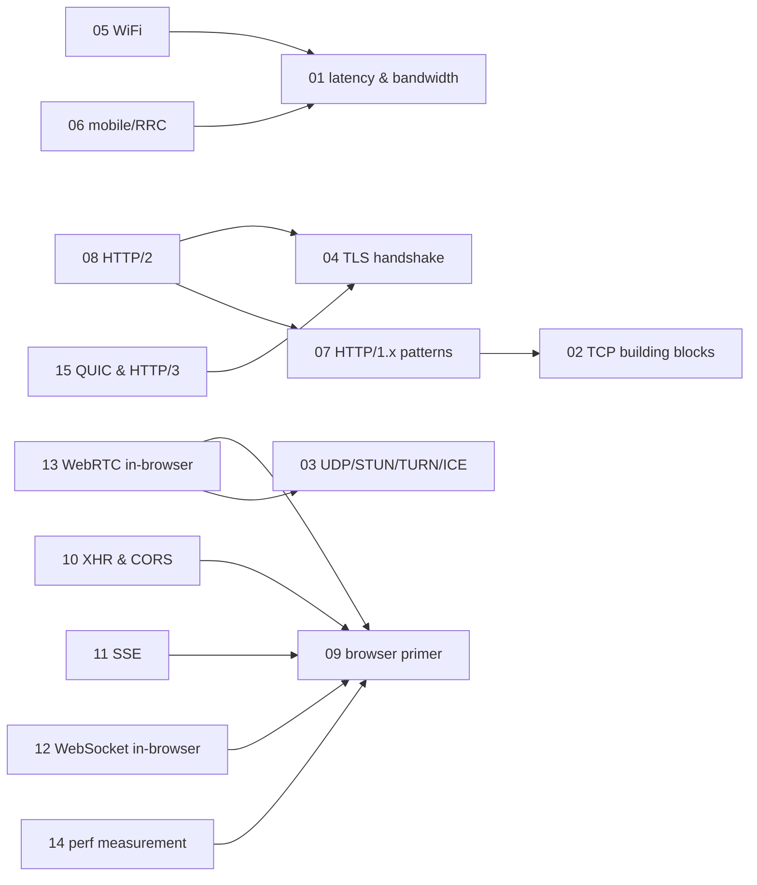

# Browser networking — knowledge graph

*How a browser actually moves bytes: the physics of latency, TCP and UDP as the two transports
underneath everything, TLS, the access-network layer (WiFi and mobile), and the browser-specific
APIs — XHR, SSE, WebSocket, WebRTC — built on top, read against a 2013 book written while HTTP/2
was still SPDY and QUIC did not exist.*

**Nodes:** 15 · **Books:** 1 · **Currency researched:** 2026-08-06
**Requires:** [`13_http`](../13_http/00_knowledge_graph.md), [`01_computation`](../01_computation/00_knowledge_graph.md)
**Feeds:** [`15_websocket`](../15_websocket/00_knowledge_graph.md), [`16_webrtc`](../16_webrtc/00_knowledge_graph.md)

---

## §1 Source audit

| Book | Year | Documents | Verdict |
|---|---|---|---|
| Grigorik, *High Performance Browser Networking* | 2013 | Latency/bandwidth physics, TCP and UDP building blocks, TLS, WiFi and mobile-network performance, HTTP/1.x and HTTP/2 (as an evolving SPDY-lineage draft), web performance measurement, XHR, SSE, WebSocket, and WebRTC | The strongest browser-networking source on this shelf for physical and transport fundamentals, which have aged well. Its TLS chapter predates TLS 1.3, its HTTP/2 chapter documents a pre-final draft, it has no QUIC or HTTP/3 chapter at all, and its mobile-network chapter describes a 3G/4G world several 3GPP generations behind. Every node below states what still holds and what a 2026 article must correct |

---

## §2 Node index

| ID | Node | Type | Depth | Currency |
|---|---|---|---|---|
| `BNET-01` | Latency, bandwidth, and the physics of network performance | Model | L3 | `stale-minor` |
| `BNET-02` | TCP building blocks: handshake, flow control, and congestion avoidance | Mechanism | L4 | `stale-minor` |
| `BNET-03` | UDP and NAT traversal: STUN, TURN, and ICE | Mechanism | L4 | `stale-minor` |
| `BNET-04` | TLS handshake, session resumption, and certificate trust | Protocol | L5 | `stale-major` |
| `BNET-05` | WiFi performance and the 802.11 access model | Mechanism | L3 | `stale-minor` |
| `BNET-06` | Mobile network architecture and the RRC state machine | Mechanism | L4 | `stale-major` |
| `BNET-07` | HTTP/1.x performance patterns and their workarounds | Practice | L4 | `stale-major` |
| `BNET-08` | HTTP/2: SPDY's lineage and the binary framing model | Protocol | L5 | `stale-minor` |
| `BNET-09` | Primer on browser networking and the same-origin sandbox | Model | L3 | `current` |
| `BNET-10` | XMLHttpRequest and Cross-Origin Resource Sharing | Mechanism | L3 | `stale-minor` |
| `BNET-11` | Server-Sent Events and the EventSource API | Mechanism | L3 | `stale-minor` |
| `BNET-12` | The WebSocket protocol and API inside the browser | Protocol | L4 | `stale-minor` |
| `BNET-13` | WebRTC inside the browser: media capture and PeerConnection primer | Protocol | L4 | `stale-major` |
| `BNET-14` | Web performance measurement: synthetic, RUM, and the resource waterfall | Practice | L3 | `stale-minor` |
| `BNET-15` | QUIC and HTTP/3 as the successor transport | Protocol | L5 | `absent` |

---

## §3 The graph

All 15 nodes carry at least one in-subject `requires` edge and fit one diagram.

---

## §4 Node records

### `BNET-01` · Latency, bandwidth, and the physics of network performance
**Type:** Model · **Depth:** L3
**Covers:** propagation, transmission, processing, and queuing delay; last-mile latency; bandwidth at the core versus the network edge
**Sources:** Grigorik ch.1 (2013)
**Currency:** `stale-minor`
**Δ current:** The physical model — speed-of-light-bound propagation delay, the four latency components, and the observation that bandwidth has grown far faster than latency has fallen — has not changed and does not date. The book's specific last-mile latency and access-bandwidth figures do date: they describe a 2013 access-network mix dominated by DSL/cable and pre-LTE mobile, and fiber-to-the-home and 5G deployment since then have shifted the typical last-mile numbers materially in markets where they have rolled out, though the book's own point — that reducing round trips matters more than raw bandwidth for most page loads — is unaffected by which specific figures are current.

### `BNET-02` · TCP building blocks: handshake, flow control, and congestion avoidance
**Type:** Mechanism · **Depth:** L4
**Covers:** the three-way handshake, the flow-control window, slow-start, congestion avoidance, bandwidth-delay product, TCP head-of-line blocking
**Sources:** Grigorik ch.2 (2013)
**Edges:** `contrasts` [`BNET-03`, `BNET-15`]
**Currency:** `stale-minor`
**Δ current:** CUBIC (RFC 8312, 2018) has been the default Linux congestion-control algorithm since kernel 2.6.19 (2006) and BBR, a model-based algorithm Google published in 2016, is now widely deployed at large CDNs — both differ materially from the classic Reno-style slow-start-then-additive-increase model the book's congestion chapter walks through. RFC 6928 (2013) also raised the recommended initial congestion window from roughly four segments to ten, shrinking the slow-start ramp the book's optimization advice targets. The head-of-line blocking property the book identifies as TCP's structural limitation is unchanged and is precisely what `BNET-15`'s QUIC transport addresses.

### `BNET-03` · UDP and NAT traversal: STUN, TURN, and ICE
**Type:** Mechanism · **Depth:** L4
**Covers:** UDP's connectionless "null" service model, NAT connection-state timeouts, the STUN/TURN/ICE toolkit for NAT traversal
**Sources:** Grigorik ch.3 (2013)
**Edges:** `contrasts` [`BNET-02`]
**Currency:** `stale-minor`
**Δ current:** STUN's base specification moved from RFC 5389 to RFC 8489 (February 2020), closing a bid-down attack the earlier version was vulnerable to; ICE itself was updated by RFC 8445 (2018), replacing RFC 5245. The NAT-traversal problem and the three-tool (STUN/TURN/ICE) shape the book describes are unchanged — see `16_webrtc` for the deep application of this mechanism to peer connection establishment.

### `BNET-04` · TLS handshake, session resumption, and certificate trust
**Type:** Protocol · **Depth:** L5
**Covers:** the TLS record protocol, the full and abbreviated handshake, ALPN, SNI, session tickets, OCSP stapling, the certificate chain of trust
**Sources:** Grigorik ch.4 (2013)
**Edges:** `contrasts` [`HTTP-12`]
**Currency:** `stale-major`
**Δ current:** The book documents the pre-TLS-1.3 two-round-trip handshake (TLS 1.2, RFC 5246, 2008) and frames its "optimizing for TLS" advice around minimizing the computational and round-trip cost of that handshake. TLS 1.3 (RFC 8446, August 2018) collapsed the handshake to one round trip, added an optional 0-RTT resumption mode with documented replay-attack caveats the book could not discuss, and removed the static RSA key exchange and renegotiation the book's optimization chapter treats as fixtures. TLS 1.0 and 1.1 were formally deprecated by RFC 8996 (March 2021) and are refused by default in current browsers. An article on this node should lead with TLS 1.3 as the deployed baseline and treat the book's two-round-trip handshake as the historical shape TLS 1.3 was designed to eliminate.

### `BNET-05` · WiFi performance and the 802.11 access model
**Type:** Mechanism · **Depth:** L3
**Covers:** CSMA/CA contention, the evolution of 802.11 standards, WiFi packet-loss characteristics, unmetered-bandwidth optimization advice
**Sources:** Grigorik ch.6 (2013)
**Edges:** `requires` [`BNET-01`] · `contrasts` [`BNET-06`]
**Currency:** `stale-minor`
**Δ current:** WiFi 5 (802.11ac) had not shipped when this chapter was written; WiFi 6/6E (802.11ax, 2019) and WiFi 7 (802.11be, standardized 2024) added OFDMA scheduling, higher-order QAM, and multi-link operation, materially changing the throughput and contention figures the book cites. The underlying CSMA/CA contention model the book explains is intact across all of these generations.

### `BNET-06` · Mobile network architecture and the RRC state machine
**Type:** Mechanism · **Depth:** L4
**Covers:** the 2G-through-4G "brief history of the G's," the Radio Resource Controller state machine, carrier backhaul, packet flow through the carrier network, battery-versus-latency tradeoffs
**Sources:** Grigorik ch.7–8 (2013)
**Edges:** `requires` [`BNET-01`] · `contrasts` [`BNET-05`]
**Currency:** `stale-major`
**Δ current:** The book's carrier architecture and RRC state machine describe 3G and 4G/LTE networks. 5G New Radio, standardized starting with 3GPP Release 15 (2018), replaced much of the RRC state machine with a leaner model and materially lower control-plane latency targets, changing the "anticipate RRC state transitions" guidance the book gives for 3G/4G devices. US carriers completed 3G network shutdown by the end of 2022, so the 3G RRC behavior the book documents in detail is no longer reachable on those networks at all.

### `BNET-07` · HTTP/1.x performance patterns and their workarounds
**Type:** Practice · **Depth:** L4
**Covers:** domain sharding, concatenation and spriting, resource inlining, the benefits of keepalive, pipelining's practical failure
**Sources:** Grigorik ch.9, 11 (2013)
**Edges:** `requires` [`BNET-02`]
**Currency:** `stale-major`
**Δ current:** These are exactly the workarounds HTTP/2 multiplexing made counterproductive: domain sharding defeats a single HTTP/2 connection's multiplexing and header-compression benefits by spreading requests across connections the protocol was designed to consolidate, and asset concatenation and spriting reintroduce cache-invalidation costs that per-resource caching under HTTP/2 avoids. The book itself begins to flag this tension in its "removing 1.x optimizations" material; current guidance treats domain sharding and bundling as anti-patterns on HTTP/2-served origins, which now make up the large majority of web traffic.

### `BNET-08` · HTTP/2: SPDY's lineage and the binary framing model
**Type:** Protocol · **Depth:** L5
**Covers:** SPDY's history and relationship to HTTP/2, the binary framing layer, stream multiplexing, request prioritization, server push, HPACK header compression
**Sources:** Grigorik ch.12 (2013)
**Edges:** `requires` [`BNET-04`, `BNET-07`]
**Currency:** `stale-minor`
**Δ current:** The book documents HTTP/2 while it was still an active IETF draft evolving out of Google's SPDY; it shipped as RFC 7540 in 2015 and was republished with light editorial revision as RFC 9113 in June 2022. The mechanism the book describes — binary framing, one connection per origin, HPACK — matches the final specification closely. Server push, which the book presents as a core feature worth adopting, was disabled by default in Chrome 106 (2022) after data showed only about 1.25% of HTTP/2 sites used it and that its net performance effect was inconsistent to negative.

### `BNET-09` · Primer on browser networking and the same-origin sandbox
**Type:** Model · **Depth:** L3
**Covers:** browser connection management and optimization, network sandboxing, resource and client-state caching, the browser's application-API surface
**Sources:** Grigorik ch.14 (2013)
**Currency:** `current`

### `BNET-10` · XMLHttpRequest and Cross-Origin Resource Sharing
**Type:** Mechanism · **Depth:** L3
**Covers:** XHR download and upload, progress events, streaming with XHR, polling and long-polling as pre-WebSocket real-time patterns
**Sources:** Grigorik ch.15 (2013)
**Edges:** `requires` [`BNET-09`]
**Currency:** `stale-minor`
**Δ current:** The Fetch API, defined by the WHATWG Fetch Standard (a living standard), has become the preferred replacement for XHR in modern application code, offering promise-based requests and streaming responses via `ReadableStream`. CORS itself moved out of its 2014 standalone W3C Recommendation — formally superseded in August 2017 — and into the WHATWG Fetch Standard, which is now the sole normative definition browsers implement; the cross-origin access-control model the book describes is otherwise unchanged.

### `BNET-11` · Server-Sent Events and the EventSource API
**Type:** Mechanism · **Depth:** L3
**Covers:** the EventSource API, the `text/event-stream` protocol, reconnection semantics, SSE use cases versus polling
**Sources:** Grigorik ch.16 (2013)
**Edges:** `requires` [`BNET-09`] · `contrasts` [`BNET-12`]
**Currency:** `stale-minor`
**Δ current:** The book warns that one persistent SSE connection per tab competes for the browser's roughly six-connections-per-origin cap under HTTP/1.1. That constraint is substantially relaxed when the origin is served over HTTP/2 or HTTP/3, since both multiplex many logical streams — including an SSE stream — over a single connection, which removes the specific scaling concern the book raises without changing the EventSource API or wire protocol themselves.

### `BNET-12` · The WebSocket protocol and API inside the browser
**Type:** Protocol · **Depth:** L4
**Covers:** the WS/WSS URL schemes, the browser WebSocket JavaScript API, binary framing, subprotocol negotiation, HTTP Upgrade negotiation
**Sources:** Grigorik ch.17 (2013)
**Edges:** `requires` [`BNET-09`] · `refines` [`WS-01`] · `contrasts` [`BNET-11`]
**Currency:** `stale-minor`
**Δ current:** The book's account of RFC 6455 (2011) is accurate as far as it goes, but it predates two extensions now standard: permessage-deflate compression (RFC 7692, December 2015), which most production WebSocket stacks enable by default, and RFC 8441 (September 2018), which allows a WebSocket connection to be bootstrapped over an existing HTTP/2 connection via extended CONNECT rather than the HTTP/1.1 Upgrade mechanism the book treats as the only option. See `15_websocket` for the full protocol treatment this chapter only summarizes.

### `BNET-13` · WebRTC inside the browser: media capture and PeerConnection primer
**Type:** Protocol · **Depth:** L4
**Covers:** getUserMedia, the RTCPeerConnection API surface, an SDP-based signaling primer, an ICE-gathering overview, a DataChannel introduction
**Sources:** Grigorik ch.18 (2013)
**Edges:** `requires` [`BNET-09`, `BNET-03`] · `refines` [`RTC-01`]
**Currency:** `stale-major`
**Δ current:** This chapter predates the W3C WebRTC 1.0 Recommendation (26 January 2021) by nearly eight years. It documents the callback-based RTCPeerConnection methods that Chrome removed entirely in Chrome 117 (2023) in favor of the promise-based methods the final specification standardizes, and it predates the Unified Plan SDP transition Chrome made default in M72 (January 2019) and stopped honoring the legacy Plan B flag for entirely after a deprecation trial ended on 25 May 2022. See `16_webrtc` for the full current treatment; this node's role is the browser-API entry point, not the protocol depth.

### `BNET-14` · Web performance measurement: synthetic, RUM, and the resource waterfall
**Type:** Practice · **Depth:** L3
**Covers:** navigation timing, resource-waterfall analysis, synthetic versus real-user measurement, browser-optimization touchpoints
**Sources:** Grigorik ch.10 (2013)
**Edges:** `requires` [`BNET-09`]
**Currency:** `stale-minor`
**Δ current:** The Navigation Timing and Resource Timing APIs this chapter leans on for real-user measurement have since been layered over by Google's Core Web Vitals initiative — Largest Contentful Paint, Cumulative Layout Shift, and an interactivity metric — introduced as a search-ranking signal in 2021. The interactivity metric itself changed after the book's era: Google replaced First Input Delay with Interaction to Next Paint (INP) as the third Core Web Vital in March 2024. The book's underlying "speed as a feature" framing anticipates this shift without being able to name it.

### `BNET-15` · QUIC and HTTP/3 as the successor transport
**Type:** Protocol · **Depth:** L5
**Covers:** QUIC's UDP-based multiplexed transport, integrated TLS 1.3, connection migration across network changes, 0-RTT, per-stream loss recovery
**Sources:** — (postdates this book by nearly a decade)
**Edges:** `requires` [`BNET-04`] · `contrasts` [`BNET-02`]
**Currency:** `absent`
**Δ current:** Grigorik's 2013 UDP chapter treats UDP purely as the substrate WebRTC uses for real-time media and cannot anticipate QUIC, standardized as RFC 9000 in May 2021, with HTTP/3 following as RFC 9114 in June 2022. QUIC folds the transport and TLS 1.3 handshakes into a single round trip, moves congestion control and loss recovery into per-stream, user-space state governed by RFC 9002, and adds connection migration across network changes — for example, a WiFi-to-cellular handoff — that `BNET-02`'s TCP model treats as requiring a fresh connection and a full slow-start ramp.

---

## §5 Cross-subject edges

| From | Edge | To | Why |
|---|---|---|---|
| `BNET-04` | `contrasts` | `HTTP-12` | The TLS handshake mechanics themselves compared against HTTP-layer certificate trust |
| `BNET-07` | `requires` | `HTTP-04` | HTTP/1.x browser performance patterns build directly on keep-alive/pipelining mechanics |
| `BNET-08` | `requires` | `HTTP-17` | Browser-performance treatment of HTTP/2 builds on the protocol-mechanics node in `13_http` |
| `BNET-12` | `refines` | `WS-01` | The browser WebSocket chapter is a narrower, API-level treatment of the handshake `15_websocket` covers in full |
| `BNET-13` | `refines` | `RTC-01` | The browser WebRTC chapter is a narrower, API-level treatment of the architecture `16_webrtc` covers in full |
| `BNET-15` | `requires` | `HTTP-18` | QUIC-as-browser-transport builds on `13_http`'s HTTP/3 protocol node |
| `HTTP-12` | `contrasts` | `BNET-04` | Reciprocal of the above, declared in `13_http` |
| `RTC-06` | `requires` | `BNET-03` | Reciprocal mirror: WebRTC's ICE candidate gathering requires this subject's STUN/TURN/ICE node |
| `RTC-08` | `requires` | `BNET-04` | Reciprocal mirror: WebRTC's DTLS-SRTP media security requires this subject's TLS handshake node |
| `GRPC-09` | `requires` | `BNET-04` | Reciprocal mirror: securing gRPC channels requires this subject's TLS handshake node |

---

## §6 Coverage gaps

Nothing in this subject's single book covers the Cache API and Service Worker-mediated network
interception, which is now a load-bearing part of how a modern browser controls its own caching
and offline behavior; that would need the W3C Service Workers specification directly, since no
book on this shelf documents it — see `13_http`'s coverage gaps for the reciprocal note on HTTP
caching's browser-platform half. Nothing here covers HTTP/3's practical adoption curve or QUIC's
interaction with restrictive middleboxes that block UDP, both of which would need current CDN
vendor engineering blogs rather than a stable specification, since the specification says nothing
about deployment friction. The book's wireless chapters stop at LTE; a genuinely current treatment
of 5G's network-slicing and low-latency modes would need 3GPP's own Release 15 through Release 18
documents, which are far denser than anything summarized here and were judged out of scope for a
senior-engineer web-performance module. Finally, nothing here covers WebTransport, since the book
predates it by over a decade and this subject's WebSocket-adjacent API surface is deliberately
left to `15_websocket`, which does cover it directly.

---

← [repo index](../README.md) · [root graph](../KNOWLEDGE_GRAPH.md) · [writing contract](../AGENTS.md)
