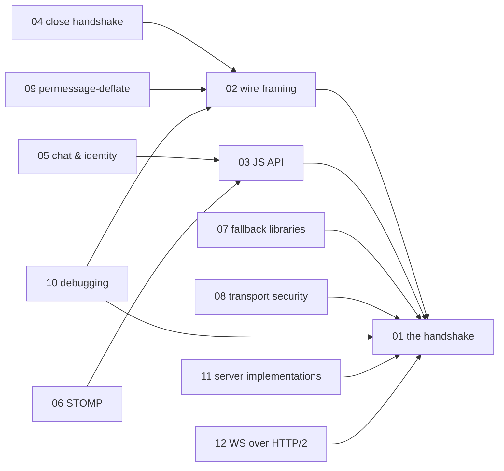

# WebSocket — knowledge graph

*A single TCP connection turned full-duplex: the handshake that gets there, the frame format
that rides on top, the application patterns built from it, and the security model a browser
enforces around it — read against a 2015 book written when WebSocket-versus-fallback-library
was still a live question and permessage-deflate had just shipped.*

**Nodes:** 13 · **Books:** 1 · **Currency researched:** 2026-08-06
**Requires:** [`13_http`](../13_http/00_knowledge_graph.md)
**Feeds:** [`16_webrtc`](../16_webrtc/00_knowledge_graph.md), [`17_grpc`](../17_grpc/00_knowledge_graph.md)

---

## §1 Source audit

| Book | Year | Documents | Verdict |
|---|---|---|---|
| Lombardi, *WebSocket* | 2015 | The handshake and wire framing under RFC 6455, the browser JavaScript API, a bidirectional chat build, STOMP-over-WebSocket messaging, compatibility-fallback libraries (SockJS, Socket.IO, Pusher), transport security and origin-based access control, debugging tools, and a protocol-level chapter on framing and extensions | A solid, still-accurate account of RFC 6455 itself — the frame format and handshake have not changed since. Its compatibility chapter documents a browser-support problem that no longer exists, its tooling references have aged, and it necessarily has nothing on HTTP/2 bootstrapping (RFC 8441, 2018) or WebTransport, both of which postdate it |

---

## §2 Node index

| ID | Node | Type | Depth | Currency |
|---|---|---|---|---|
| `WS-01` | The WebSocket handshake: HTTP Upgrade to full-duplex | Protocol | L4 | `stale-minor` |
| `WS-02` | WebSocket wire framing: opcodes, masking, and fragmentation | Protocol | L4 | `current` |
| `WS-03` | The WebSocket JavaScript API and event model | Mechanism | L3 | `current` |
| `WS-04` | The close handshake and connection lifecycle | Mechanism | L3 | `current` |
| `WS-05` | Building a bidirectional application: chat and identity | Practice | L3 | `stale-minor` |
| `WS-06` | Message-broker protocols over WebSocket: STOMP | Protocol | L3 | `stale-minor` |
| `WS-07` | Compatibility and fallback layers: SockJS, Socket.IO, Pusher | Tool | L3 | `stale-major` |
| `WS-08` | WebSocket transport security: TLS and origin-based access control | Practice | L4 | `stale-minor` |
| `WS-09` | Protocol extensions: permessage-deflate compression | Mechanism | L4 | `stale-minor` |
| `WS-10` | Debugging the handshake and inspecting live frames | Practice | L3 | `stale-minor` |
| `WS-11` | Alternate server implementations and the subprotocol registry | Practice | L3 | `stale-minor` |
| `WS-12` | Bootstrapping WebSocket over HTTP/2 | Protocol | L4 | `absent` |
| `WS-13` | WebTransport as the HTTP/3-native successor | Protocol | L5 | `absent` |

---

## §3 The graph

`WS-13` carries no in-subject `requires`/`refines` edge — its only connections are a `contrasts`
edge to `WS-01` and a cross-subject `requires` on `HTTP-18` — so it is omitted from the diagram
below, following the same convention `06_concurrency` uses for its Amdahl's-Law and CSP nodes.

---

## §4 Node records

### `WS-01` · The WebSocket handshake: HTTP Upgrade to full-duplex
**Type:** Protocol · **Depth:** L4
**Covers:** Sec-WebSocket-Key/Accept, the 101 Switching Protocols response, WS/WSS URL schemes, subprotocol negotiation during the handshake
**Sources:** Lombardi ch.2, 8 (2015)
**Edges:** `requires` [`HTTP-02`] · `contrasts` [`WS-13`, `GRPC-15`]
**Currency:** `stale-minor`
**Δ current:** RFC 6455 (December 2011) is the still-current Internet Standard (STD 90) governing this handshake, and the book's account of it is accurate. It predates RFC 8441 (September 2018), which defines an alternative bootstrapping method — `WS-12` — for negotiating a WebSocket stream inside an existing HTTP/2 connection, since HTTP/2 forbids the connection-specific Upgrade and Connection header fields the RFC 6455 handshake depends on.

### `WS-02` · WebSocket wire framing: opcodes, masking, and fragmentation
**Type:** Protocol · **Depth:** L4
**Covers:** the FIN bit, opcode types, the client-to-server masking requirement, payload length encoding, message fragmentation
**Sources:** Lombardi ch.7–8 (2015)
**Edges:** `requires` [`WS-01`]
**Currency:** `current`

### `WS-03` · The WebSocket JavaScript API and event model
**Type:** Mechanism · **Depth:** L3
**Covers:** open/message/error/close events, the send() and close() methods, readyState, bufferedAmount, binary versus text frame handling
**Sources:** Lombardi ch.2 (2015)
**Edges:** `requires` [`WS-01`]
**Currency:** `current`

### `WS-04` · The close handshake and connection lifecycle
**Type:** Mechanism · **Depth:** L3
**Covers:** close-frame status codes, clean versus abrupt termination, half-close semantics
**Sources:** Lombardi ch.8 (2015)
**Edges:** `requires` [`WS-02`]
**Currency:** `current`

### `WS-05` · Building a bidirectional application: chat and identity
**Type:** Practice · **Depth:** L3
**Covers:** client identity over a connection-oriented transport, broadcasting to connected clients, comparison against long-polling as the pre-WebSocket baseline
**Sources:** Lombardi ch.3 (2015)
**Edges:** `requires` [`WS-03`]
**Currency:** `stale-minor`
**Δ current:** The book motivates WebSocket by contrast with long-polling, which was still a common production pattern in 2015. WebSocket has been supported in every major browser since roughly 2012–2013, per the caniuse compatibility record, so long-polling as a baseline is now largely historical outside constrained enterprise-proxy environments that block the Upgrade handshake; the pedagogical contrast the book draws still clarifies the mechanism even though the practical need for the fallback has receded.

### `WS-06` · Message-broker protocols over WebSocket: STOMP
**Type:** Protocol · **Depth:** L3
**Covers:** the STOMP frame model, connecting to a broker (RabbitMQ) from the browser, the Web-STOMP plugin
**Sources:** Lombardi ch.4 (2015)
**Edges:** `requires` [`WS-03`]
**Currency:** `stale-minor`
**Δ current:** STOMP over WebSocket remains a live pattern — Spring's messaging support and RabbitMQ's Web STOMP plugin are both still shipped and maintained — but MQTT over WebSocket, standardized with a dedicated WebSocket subprotocol name as part of MQTT 5.0 (OASIS, March 2019), has become the more common choice for browser-to-broker messaging in IoT-adjacent stacks; the book does not mention MQTT.

### `WS-07` · Compatibility and fallback layers: SockJS, Socket.IO, Pusher
**Type:** Tool · **Depth:** L3
**Covers:** the SockJS transport-fallback chain, Socket.IO's own framing layered on top of WebSocket, hosted pub/sub as a managed alternative
**Sources:** Lombardi ch.5 (2015)
**Edges:** `requires` [`WS-01`]
**Currency:** `stale-major`
**Δ current:** These libraries existed because WebSocket browser support was inconsistent circa 2011–2013. RFC 6455 has been supported in every major browser since roughly 2012–2013, so the transport-fallback problem SockJS was built to solve has been effectively absent for a decade, and its repository has seen no substantial release since the late 2010s. Socket.IO persists in active use, but chiefly for its own room, namespace, and acknowledgement application layer rather than for the browser-compatibility fallback that motivated its original design.

### `WS-08` · WebSocket transport security: TLS and origin-based access control
**Type:** Practice · **Depth:** L4
**Covers:** wss:// over TLS, the Origin header as the browser-enforced access-control mechanism, clickjacking and framebusting, denial-of-service considerations, mandatory client-to-server frame masking as a cache-poisoning defense
**Sources:** Lombardi ch.6 (2015)
**Edges:** `requires` [`WS-01`] · `contrasts` [`OS-19`]
**Currency:** `stale-minor`
**Δ current:** The Origin-checking mechanism the book describes is unchanged, but X-Frame-Options, which the book cites for framebusting, has been effectively superseded by the Content-Security-Policy `frame-ancestors` directive, part of CSP Level 2 (a W3C Recommendation since 2016), which is more expressive and is what current framebusting guidance leads with.

### `WS-09` · Protocol extensions: permessage-deflate compression
**Type:** Mechanism · **Depth:** L4
**Covers:** extension negotiation during the handshake, per-message compression, context takeover
**Sources:** Lombardi ch.8 (2015, extension negotiation mechanism only)
**Edges:** `requires` [`WS-02`]
**Currency:** `stale-minor`
**Δ current:** The book documents the generic extension-negotiation mechanism in the handshake but does not name permessage-deflate specifically. RFC 7692, the permessage-deflate specification, was published in December 2015, the same year as this book, and there is no evidence the book covers it by name. It is now the dominant compression extension in production — supported by default or via a simple flag in Node's `ws` package and by every major browser's built-in WebSocket implementation.

### `WS-10` · Debugging the handshake and inspecting live frames
**Type:** Practice · **Depth:** L3
**Covers:** reading the handshake exchange, frame inspection with a proxy tool, masked-payload decoding
**Sources:** Lombardi ch.7 (2015)
**Edges:** `requires` [`WS-01`, `WS-02`]
**Currency:** `stale-minor`
**Δ current:** The book's tool of choice, OWASP ZAP, remains maintained, but browser DevTools across Chrome, Firefox, and Safari have shipped native WebSocket frame inspectors directly in the Network panel since roughly 2015–2017, which is now the default first stop for this debugging task rather than a separate proxy tool.

### `WS-11` · Alternate server implementations and the subprotocol registry
**Type:** Practice · **Depth:** L3
**Covers:** the server-side WebSocket library landscape, the IANA WebSocket Subprotocol Name Registry
**Sources:** Lombardi ch.8 (2015)
**Edges:** `requires` [`WS-01`]
**Currency:** `stale-minor`
**Δ current:** The specific server libraries the book surveys, drawn from the 2014–2015 Node.js and Java ecosystem, have substantially turned over. The book's general point — that server implementation choice is orthogonal to the wire protocol, and that subprotocols self-register through IANA — is unchanged.

### `WS-12` · Bootstrapping WebSocket over HTTP/2
**Type:** Protocol · **Depth:** L4
**Covers:** the extended CONNECT method, why HTTP/2 forbids Upgrade and Connection headers, sharing one TCP connection between HTTP/2 and WebSocket streams
**Sources:** — (postdates this book)
**Edges:** `requires` [`WS-01`, `HTTP-17`]
**Currency:** `absent`
**Δ current:** Absent from Lombardi (2015), which assumes HTTP/1.1's Upgrade mechanism throughout. RFC 8441, published September 2018, defines how a WebSocket connection can be bootstrapped over a single stream of an existing HTTP/2 connection using the extended CONNECT method, since HTTP/2 removed the connection-specific header fields the RFC 6455 handshake in the book's ch.8 depends on. Browser support (Chrome, Firefox) shipped in 2021–2022.

### `WS-13` · WebTransport as the HTTP/3-native successor
**Type:** Protocol · **Depth:** L5
**Covers:** multiple streams and datagrams per connection, unreliable and unordered delivery options, the relationship to QUIC
**Sources:** — (postdates this book by roughly a decade)
**Edges:** `requires` [`HTTP-18`] · `contrasts` [`WS-01`]
**Currency:** `absent`
**Δ current:** Absent from Lombardi (2015). WebTransport is a W3C API, currently at Candidate Recommendation status, with the working group's published snapshot committing to remain at that status at least until 30 October 2026, built over the IETF's WebTransport-over-HTTP/3 draft. Unlike a WebSocket connection, a WebTransport session exposes multiple independent bidirectional and unidirectional streams plus unreliable datagrams over one QUIC connection, avoiding the single-stream head-of-line blocking a WebSocket connection has whenever one logical message stalls. As of this writing the underlying IETF draft has not reached RFC status, so WebTransport should be treated as an emerging complement to WebSocket rather than a drop-in replacement.

---

## §5 Cross-subject edges

| From | Edge | To | Why |
|---|---|---|---|
| `WS-01` | `requires` | `HTTP-02` | The WebSocket handshake is an HTTP Upgrade request and cannot be understood without HTTP message semantics |
| `WS-01` | `contrasts` | `GRPC-15` | Reciprocal: gRPC-Web and WebSocket are contrasting approaches to browser-server streaming |
| `WS-08` | `contrasts` | `OS-19` | Browser-enforced Origin/CSP access control compared against OS-level protection fundamentals |
| `WS-12` | `requires` | `HTTP-17` | Bootstrapping WebSocket over HTTP/2 (RFC 8441) requires HTTP/2's framing model |
| `WS-13` | `requires` | `HTTP-18` | WebTransport is built directly on HTTP/3's QUIC transport |
| `BNET-12` | `refines` | `WS-01` | Reciprocal mirror: the browser-API chapter in `14_browser_networking` is a narrower treatment of this node |
| `RTC-07` | `requires` | `WS-01` | Reciprocal mirror: WebRTC's signaling channel typically rides a WebSocket connection |
| `GRPC-15` | `contrasts` | `WS-01` | Reciprocal mirror: gRPC-Web declared from `17_grpc`'s side |

---

## §6 Coverage gaps

Nothing here covers the `ws` and `websockets` library internals at an implementation-source
level; the book stays at the protocol and application-API layer throughout, which matches this
subject's intended depth, but a reader wanting to see a production-grade server implementation's
handling of backpressure and `bufferedAmount` would need to read library source directly rather
than a book. Nothing here covers WebSocket load-balancing and sticky-session concerns in a
multi-node deployment — the book's "deploying WebSocket infrastructure" subsection is thin — and
a proper treatment would need a reverse-proxy vendor's own documentation (nginx, Envoy, or a cloud
load balancer's WebSocket support notes) rather than a stable specification, since sticky-session
behavior is an operational choice, not a protocol requirement. Finally, nothing here covers the
interaction between WebSocket and HTTP/3, beyond noting that RFC 8441-style bootstrapping has no
QUIC equivalent yet; WebTransport (`WS-13`) is the IETF's answer to that gap rather than an
extension of RFC 6455 itself, and the distinction is worth stating plainly rather than blurring.

---

← [repo index](../README.md) · [root graph](../KNOWLEDGE_GRAPH.md) · [writing contract](../AGENTS.md)
