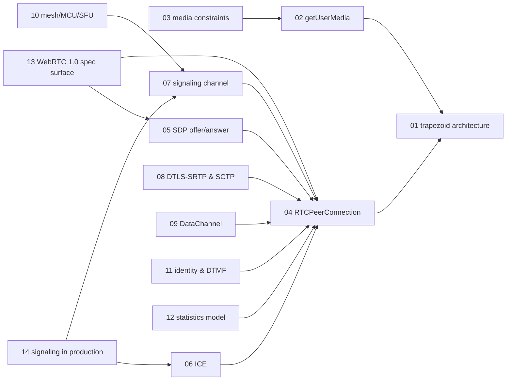

# WebRTC — knowledge graph

*Peer-to-peer audio, video, and data between browsers: media capture, the offer/answer
negotiation model, NAT traversal, secure media delivery, and the signaling channel WebRTC
deliberately leaves unspecified — read against a book written mid-standardization, before the
W3C Recommendation existed and while the callback-based API was still the only one shipping.*

**Nodes:** 14 · **Books:** 1 · **Currency researched:** 2026-08-06
**Requires:** [`14_browser_networking`](../14_browser_networking/00_knowledge_graph.md), [`15_websocket`](../15_websocket/00_knowledge_graph.md)
**Feeds:** none yet — no subject in this repository builds on WebRTC directly

---

## §1 Source audit

| Book | Year | Documents | Verdict |
|---|---|---|---|
| *Real-Time Communication with WebRTC* (O'Reilly) | pre-2021 (undated in TOC; internal references place it mid-standardization) | The trapezoid architecture, getUserMedia and MediaStream, building PeerConnection objects locally and with a signaling server, a full call flow from scratch, conferencing/identity/DTMF/statistics, and an appendix snapshot of the pre-Recommendation WebRTC 1.0 API | Clear on the mechanism WebRTC still uses — offer/answer, ICE, DataChannel — but its API-level chapters and appendix document the callback-based, Plan-B-SDP shape of RTCPeerConnection that shipping browsers have since removed entirely. Every node below states what the January 2021 W3C Recommendation changed |

---

## §2 Node index

| ID | Node | Type | Depth | Currency |
|---|---|---|---|---|
| `RTC-01` | WebRTC architecture: the browser-to-browser trapezoid | Model | L3 | `current` |
| `RTC-02` | Media capture: getUserMedia and the MediaStream model | Mechanism | L3 | `stale-minor` |
| `RTC-03` | Media constraints and constrainable properties | Mechanism | L3 | `stale-major` |
| `RTC-04` | RTCPeerConnection: offer/answer and connection establishment | Protocol | L5 | `stale-major` |
| `RTC-05` | Session Description Protocol and the offer/answer model | Protocol | L4 | `stale-major` |
| `RTC-06` | ICE: candidate gathering and connectivity checks | Mechanism | L4 | `stale-minor` |
| `RTC-07` | The signaling channel: transporting SDP and ICE candidates | Practice | L3 | `current` |
| `RTC-08` | Secure media and data delivery: DTLS-SRTP and SCTP | Mechanism | L5 | `stale-minor` |
| `RTC-09` | DataChannel: reliability, ordering, and message semantics | Mechanism | L4 | `stale-minor` |
| `RTC-10` | Multiparty architectures: mesh, MCU, and SFU topologies | Structure | L4 | `stale-minor` |
| `RTC-11` | Identity, authentication, and DTMF signaling extensions | Mechanism | L3 | `stale-minor` |
| `RTC-12` | The statistics model: getStats() and connection introspection | Mechanism | L3 | `stale-major` |
| `RTC-13` | WebRTC 1.0 as a W3C Recommendation: API surface and conformance | Protocol | L4 | `stale-major` |
| `RTC-14` | Signaling-server design patterns for production deployment | Practice | L3 | `absent` |

---

## §3 The graph

All 14 nodes carry at least one in-subject `requires` edge and fit one diagram.

---

## §4 Node records

### `RTC-01` · WebRTC architecture: the browser-to-browser trapezoid
**Type:** Model · **Depth:** L3
**Covers:** the RTCWEB "trapezoid" topology, the split between the signaling path and the peer-to-peer media path, comparison with traditional SIP/VoIP architectures
**Sources:** book ch.1
**Currency:** `current`

### `RTC-02` · Media capture: getUserMedia and the MediaStream model
**Type:** Mechanism · **Depth:** L3
**Covers:** getUserMedia() constraints, MediaStreamTrack, local media preview, permission prompts
**Sources:** book ch.2
**Edges:** `requires` [`RTC-01`]
**Currency:** `stale-minor`
**Δ current:** The book demonstrates the vendor-prefixed, callback-based `navigator.getUserMedia()` entry point. That form was removed from Chrome in Chrome 64 (2018) after a multi-year deprecation, in favor of the promise-based `navigator.mediaDevices.getUserMedia()` defined by the W3C Media Capture and Streams Recommendation, which is the only form shipping browsers support today.

### `RTC-03` · Media constraints and constrainable properties
**Type:** Mechanism · **Depth:** L3
**Covers:** constraint dictionaries, the current min/max/exact/ideal constraint shape
**Sources:** book ch.2
**Edges:** `requires` [`RTC-02`]
**Currency:** `stale-major`
**Δ current:** The book documents an early, Chrome-only mandatory/optional constraint syntax that was never part of the final standard. The W3C Media Capture and Streams specification standardized the current `min`/`max`/`exact`/`ideal` constraint shape, which shipped across all major browsers well before the specification reached Recommendation status, and the mandatory/optional form the book demonstrates has been removed from shipping browsers for years.

### `RTC-04` · RTCPeerConnection: offer/answer and connection establishment
**Type:** Protocol · **Depth:** L5
**Covers:** createOffer/createAnswer, setLocalDescription/setRemoteDescription, the negotiation state machine
**Sources:** book ch.3, appendix A
**Edges:** `requires` [`RTC-01`]
**Currency:** `stale-major`
**Δ current:** This is the book's most-affected chapter: it documents the callback-based RTCPeerConnection methods (paired success/failure callback arguments) that Chrome removed entirely in Chrome 117 (2023), in favor of the promise-based methods — `createOffer()`, `createAnswer()`, `setLocalDescription()`, and the rest returning Promises — that the W3C WebRTC 1.0 Recommendation, published 26 January 2021, standardizes as the only supported form. An article on this node should teach the promise-based negotiation state machine directly and mention the callback shape only as the historical form the book's examples use.

### `RTC-05` · Session Description Protocol and the offer/answer model
**Type:** Protocol · **Depth:** L4
**Covers:** SDP syntax (m-lines, a-lines), codec negotiation, the offer/answer exchange sequence
**Sources:** book ch.5; cross-reference `BNET-13`
**Edges:** `requires` [`RTC-04`]
**Currency:** `stale-major`
**Δ current:** SDP itself, restated as RFC 8866 (2021) in place of the older RFC 4566, is largely unchanged in syntax. What changed fundamentally is how browsers structure an SDP session: Chrome made Unified Plan the default SDP semantics in M72 (January 2019) and stopped honoring the legacy Plan B `sdpSemantics` flag after a deprecation trial ended on 25 May 2022. A book demonstrating Plan B's one-m-line-per-media-type-with-multiple-SSRCs model no longer matches how any current browser negotiates a multi-track session, which uses one m-line per track under Unified Plan instead.

### `RTC-06` · ICE: candidate gathering and connectivity checks
**Type:** Mechanism · **Depth:** L4
**Covers:** host, server-reflexive, and relay candidates, connectivity-check pairs, trickle ICE incremental candidate delivery
**Sources:** book ch.5; cross-reference `BNET-03` for the STUN/TURN toolkit
**Edges:** `requires` [`RTC-04`, `BNET-03`]
**Currency:** `stale-minor`
**Δ current:** The core ICE mechanism is intact, but ICE itself was updated by RFC 8445 (2018), replacing RFC 5245, and the underlying STUN specification moved to RFC 8489 (2020) from RFC 5389. Trickle ICE, which the book treats as an incremental optimization worth adopting, is now the default and expected behavior in every shipping browser rather than an optional enhancement.

### `RTC-07` · The signaling channel: transporting SDP and ICE candidates
**Type:** Practice · **Depth:** L3
**Covers:** WebRTC's deliberate signaling-transport-agnosticism, building a signaling server, the join/leave/offer/answer message flow
**Sources:** book ch.4–5
**Edges:** `requires` [`RTC-04`, `WS-01`]
**Currency:** `current`

### `RTC-08` · Secure media and data delivery: DTLS-SRTP and SCTP
**Type:** Mechanism · **Depth:** L5
**Covers:** DTLS key establishment, SRTP/SRTCP media encryption, SCTP as the DataChannel's reliable/unreliable transport
**Sources:** cross-reference `BNET-04`, since this book's own coverage is thin per its table of contents
**Edges:** `requires` [`RTC-04`, `BNET-04`]
**Currency:** `stale-minor`
**Δ current:** DTLS 1.2 (RFC 6347, 2012) was the version in production when this book and its era's reference material were written. DTLS 1.3 (RFC 9147, April 2022) is now shipping in both Chromium's BoringSSL and Firefox's NSS, with libwebrtc's default flipping to DTLS 1.3 during 2025, though DTLS 1.2 remains supported for interoperability during the transition.

### `RTC-09` · DataChannel: reliability, ordering, and message semantics
**Type:** Mechanism · **Depth:** L4
**Covers:** channel negotiation (in-band versus out-of-band), ordered/unordered delivery, partial reliability via maxRetransmits/maxPacketLifeTime, message-size limits
**Sources:** book ch.3, appendix A
**Edges:** `requires` [`RTC-04`]
**Currency:** `stale-minor`
**Δ current:** The mechanism is intact, but the SCTP-over-DTLS transport underneath it has been the subject of ongoing IETF exploration into a QUIC-based DataChannel transport intended to reduce head-of-line blocking between unrelated channels. As of this writing that work has not reached RFC status, so SCTP-over-DTLS remains the only shipping transport and the book's description of it is not materially wrong, only potentially incomplete for a forward-looking article.

### `RTC-10` · Multiparty architectures: mesh, MCU, and SFU topologies
**Type:** Structure · **Depth:** L4
**Covers:** full-mesh peer connections, centralized mixing (MCU), selective forwarding (SFU)
**Sources:** book ch.6 ("Conferencing")
**Edges:** `requires` [`RTC-07`]
**Currency:** `stale-minor`
**Δ current:** The book's conferencing chapter is thin, a single short subsection. The selective-forwarding-unit pattern, only nascent when the book was written, has become the dominant production architecture — used by most WebRTC-based conferencing platforms — because it avoids full mesh's per-peer encode fan-out cost and an MCU's transcoding cost, aided by simulcast and, increasingly, scalable-video-coding support in AV1 and VP9 that postdates the book.

### `RTC-11` · Identity, authentication, and DTMF signaling extensions
**Type:** Mechanism · **Depth:** L3
**Covers:** the WebRTC identity/authentication provider extension, peer-to-peer DTMF tone insertion
**Sources:** book ch.6
**Edges:** `requires` [`RTC-04`]
**Currency:** `stale-minor`
**Δ current:** The IdP-based identity mechanism the book surveys as an emerging feature saw limited real-world adoption and limited browser implementation. Most production systems authenticate at the signaling layer — an authenticated WebSocket or HTTPS session, see `RTC-07` and `15_websocket` — rather than through WebRTC's own identity extension, which remains a narrow, rarely-used part of the specification.

### `RTC-12` · The statistics model: getStats() and connection introspection
**Type:** Mechanism · **Depth:** L3
**Covers:** RTCStatsReport, per-candidate-pair and per-track statistics, browser WebRTC internals tooling
**Sources:** book ch.5–6
**Edges:** `requires` [`RTC-04`]
**Currency:** `stale-major`
**Δ current:** The book's callback-based `getStats(id, successCallback)` API and its non-standard, Chrome-specific report format were deprecated starting around Chrome 78 and fully removed by Chrome 117 (2023), migrated in favor of the promise-based, W3C-standardized `getStats()` the WebRTC 1.0 Recommendation defines, which returns a spec-defined `RTCStatsReport` map rather than the old proprietary report shape.

### `RTC-13` · WebRTC 1.0 as a W3C Recommendation: API surface and conformance
**Type:** Protocol · **Depth:** L4
**Covers:** the finalized RTCPeerConnection/RTCDataChannel interfaces, browser conformance testing, what the appendix's pre-Recommendation API snapshot got right and wrong
**Sources:** book appendix A
**Edges:** `requires` [`RTC-04`, `RTC-05`]
**Currency:** `stale-major`
**Δ current:** The appendix is a snapshot of the API mid-standardization. WebRTC 1.0 reached W3C Recommendation status on 26 January 2021, simultaneously with a set of companion IETF RFCs, including JSEP (RFC 8829), which is the point at which the callback-based legacy shapes the appendix documents formally became non-normative in favor of the promise-based, Unified-Plan-default API every current browser ships.

### `RTC-14` · Signaling-server design patterns for production deployment
**Type:** Practice · **Depth:** L3
**Covers:** room and namespace management, presence, renegotiation triggers on track add/remove, TURN credential provisioning
**Sources:** — thin/absent beyond the book's minimal two-party example in ch.4–5
**Edges:** `requires` [`RTC-07`, `RTC-06`]
**Currency:** `absent`
**Δ current:** Absent from the book's demonstration-scale signaling server. Production WebRTC deployments extend the book's bare join/offer/answer flow with authenticated room membership, time-limited TURN credentials issued per RFC 5766's long-term-credential mechanism (commonly paired with a TURN REST API convention many providers implement), and renegotiation triggered by RTCPeerConnection's `negotiationneeded` event to add or remove tracks mid-call — none of which the book's from-scratch example needed to address, because it demonstrates only a two-party, single-negotiation call.

---

## §5 Cross-subject edges

| From | Edge | To | Why |
|---|---|---|---|
| `RTC-06` | `requires` | `BNET-03` | ICE candidate gathering requires the STUN/TURN/ICE mechanism established in `14_browser_networking` |
| `RTC-07` | `requires` | `WS-01` | The signaling channel is conventionally carried over a WebSocket connection |
| `RTC-08` | `requires` | `BNET-04` | DTLS-SRTP media security requires the TLS handshake mechanics established in `14_browser_networking` |
| `BNET-13` | `refines` | `RTC-01` | Reciprocal mirror: `14_browser_networking`'s browser-API chapter is a narrower treatment of this node |

---

## §6 Coverage gaps

Nothing in this book's table of contents covers simulcast or scalable video coding in any depth
— the multiparty chapter is a single subsection — and a genuinely current treatment of SFU
bandwidth adaptation would need the IETF's RTP payload format specifications for AV1 and VP9 SVC
directly, since no book in this repository documents them. Nothing here covers WebRTC's insertable
streams / encoded-transform API, a post-Recommendation addition that lets application code process
encoded media frames directly (used for end-to-end encryption in some conferencing products);
that would need the W3C WebRTC Encoded Transform specification, which postdates every source
consulted here. Nothing here covers WHIP/WHEP, the ingest/egress protocols some streaming
platforms have adopted to bridge WebRTC into traditional broadcast pipelines, since they are
IETF drafts rather than a settled specification as of this writing. Finally, nothing here covers
codec-level detail — Opus, VP8/VP9/AV1, H.264 — since the book treats codec choice as a negotiated
parameter rather than a subject in its own right, and a codec-level module would belong to a media
or signal-processing subject this repository does not currently have.

---

← [repo index](../README.md) · [root graph](../KNOWLEDGE_GRAPH.md) · [writing contract](../AGENTS.md)
