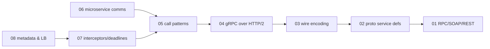
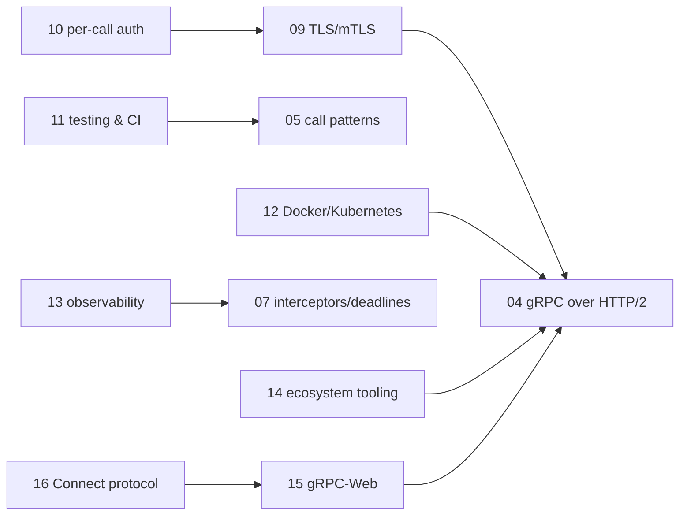

# gRPC — knowledge graph

*A schema-first RPC framework built on Protocol Buffers and HTTP/2 framing: service definition,
the wire encoding, the four call patterns, production concerns (security, deployment,
observability), and the ecosystem that lets non-gRPC clients reach a gRPC service — the most
current book on this shelf, and the one where "nothing changed" is itself a finding worth
stating plainly rather than manufacturing staleness to fit a pattern.*

**Nodes:** 16 · **Books:** 1 · **Currency researched:** 2026-08-06
**Requires:** [`13_http`](../13_http/00_knowledge_graph.md)
**Feeds:** none yet — no subject in this repository builds on gRPC directly

---

## §1 Source audit

| Book | Year | Documents | Verdict |
|---|---|---|---|
| *gRPC: Up and Running* | 2020 | Protocol Buffer service definition, the four RPC patterns, gRPC's HTTP/2 wire mapping, interceptors/deadlines/cancellation, metadata and load balancing, TLS/mTLS and per-call auth (Basic/OAuth2/JWT/Google tokens), testing/deployment/observability, and the ecosystem (gateway, reflection, health checking) | The most current book in this group of five, and it shows: its core protocol chapters need essentially no correction. Its staleness is concentrated in the surrounding ecosystem — proto3-only syntax, pre-xDS load balancing, pre-OpenTelemetry tracing guidance, and no browser chapter at all, which the gRPC-Web and Connect nodes below cover from other sources |

---

## §2 Node index

| ID | Node | Type | Depth | Currency |
|---|---|---|---|---|
| `GRPC-01` | gRPC's place among RPC, SOAP, and REST | Model | L3 | `current` |
| `GRPC-02` | Service definition with Protocol Buffers | Structure | L4 | `stale-minor` |
| `GRPC-03` | Message encoding: Protocol Buffer wire format | Mechanism | L5 | `current` |
| `GRPC-04` | gRPC over HTTP/2: framing and the RPC lifecycle | Protocol | L5 | `current` |
| `GRPC-05` | Communication patterns: unary and streaming RPCs | Mechanism | L4 | `current` |
| `GRPC-06` | Microservice communication using gRPC | Practice | L3 | `current` |
| `GRPC-07` | Interceptors, deadlines, and cancellation | Mechanism | L4 | `current` |
| `GRPC-08` | Metadata, name resolution, and client-side load balancing | Mechanism | L4 | `stale-minor` |
| `GRPC-09` | Securing gRPC channels: TLS and mTLS | Protocol | L4 | `stale-minor` |
| `GRPC-10` | Authenticating gRPC calls: Basic, OAuth 2.0, JWT, and Google tokens | Practice | L4 | `current` |
| `GRPC-11` | Testing, load testing, and CI for gRPC services | Practice | L3 | `current` |
| `GRPC-12` | Deploying gRPC on Docker and Kubernetes | Practice | L3 | `stale-minor` |
| `GRPC-13` | Observability: metrics, logging, and distributed tracing | Practice | L3 | `stale-minor` |
| `GRPC-14` | The gRPC ecosystem: gateway, reflection, and health checking | Tool | L3 | `stale-minor` |
| `GRPC-15` | gRPC-Web: calling gRPC services from the browser | Protocol | L4 | `absent` |
| `GRPC-16` | Connect and gRPC-adjacent RPC protocols | Protocol | L4 | `absent` |

---

## §3 The graph

Sixteen nodes exceed the 15-node diagram cap, so the graph splits into two clusters.

### Wire protocol and communication patterns

### Production operation, security, and browser access

---

## §4 Node records

### `GRPC-01` · gRPC's place among RPC, SOAP, and REST
**Type:** Model · **Depth:** L3
**Covers:** conventional RPC history, SOAP's XML-envelope model, REST's resource orientation, why gRPC emerged, comparison with GraphQL and Thrift
**Sources:** book ch.1 (2020)
**Currency:** `current`

### `GRPC-02` · Service definition with Protocol Buffers
**Type:** Structure · **Depth:** L4
**Covers:** .proto message and service syntax, field numbering and wire compatibility, code generation
**Sources:** book ch.1–2 (2020)
**Edges:** `requires` [`GRPC-01`]
**Currency:** `stale-minor`
**Δ current:** The book's syntax is proto3 as it stood in 2020. Protocol Buffers Editions, announced in June 2023 with edition 2023 as the baseline and edition 2024 as the latest released edition, replace the `syntax = "proto3"` declaration with an `edition = "2023"` or `"2024"` declaration that exposes per-feature defaults instead of the hardcoded proto2/proto3 behavior split. Existing proto3 files remain fully supported and there is no forced migration, so the book's syntax is not wrong, only no longer the forward-looking form new schemas are encouraged to use.

### `GRPC-03` · Message encoding: Protocol Buffer wire format
**Type:** Mechanism · **Depth:** L5
**Covers:** tag-length-value encoding, varint and zigzag encoding, field-number-driven backward compatibility
**Sources:** book ch.4 (2020)
**Edges:** `requires` [`GRPC-02`]
**Currency:** `current`

### `GRPC-04` · gRPC over HTTP/2: framing and the RPC lifecycle
**Type:** Protocol · **Depth:** L5
**Covers:** length-prefixed message framing, the HTTP/2 header/data frame mapping for request and response, trailers carrying the final call status
**Sources:** book ch.4 (2020)
**Edges:** `requires` [`GRPC-03`, `HTTP-17`]
**Currency:** `current`

### `GRPC-05` · Communication patterns: unary and streaming RPCs
**Type:** Mechanism · **Depth:** L4
**Covers:** unary RPC, server-streaming, client-streaming, bidirectional streaming, and the flow-control implications of each
**Sources:** book ch.3 (2020)
**Edges:** `requires` [`GRPC-04`]
**Currency:** `current`

### `GRPC-06` · Microservice communication using gRPC
**Type:** Practice · **Depth:** L3
**Covers:** synchronous inter-service calls, comparison with message-queue-based communication
**Sources:** book ch.3 (2020)
**Edges:** `requires` [`GRPC-05`]
**Currency:** `current`

### `GRPC-07` · Interceptors, deadlines, and cancellation
**Type:** Mechanism · **Depth:** L4
**Covers:** client- and server-side interceptor chains, deadline propagation, cooperative cancellation, error-handling conventions
**Sources:** book ch.5 (2020)
**Edges:** `requires` [`GRPC-05`]
**Currency:** `current`

### `GRPC-08` · Metadata, name resolution, and client-side load balancing
**Type:** Mechanism · **Depth:** L4
**Covers:** custom metadata headers and trailers, the name-resolver plugin interface, client-side load-balancing policies, per-message compression
**Sources:** book ch.5 (2020)
**Edges:** `requires` [`GRPC-07`]
**Currency:** `stale-minor`
**Δ current:** The book's load-balancing chapter predates gRPC's mature xDS-based service-mesh integration. The gRPC xDS API, which lets a gRPC client take load-balancing and routing configuration from an Envoy-compatible control plane such as Istio or Traffic Director, reached general availability across the major language implementations in 2021, giving client-side load balancing a standardized control-plane protocol the 2020 book could only gesture toward as an emerging pattern.

### `GRPC-09` · Securing gRPC channels: TLS and mTLS
**Type:** Protocol · **Depth:** L4
**Covers:** one-way TLS channel authentication, mutual TLS, certificate provisioning
**Sources:** book ch.6 (2020)
**Edges:** `requires` [`GRPC-04`, `BNET-04`]
**Currency:** `stale-minor`
**Δ current:** The TLS/mTLS mechanism itself is unchanged and the book's treatment of it holds. What has shifted is deployment practice: service-mesh sidecars (Envoy, Istio, Linkerd) now commonly automate mTLS certificate issuance and rotation for gRPC channels, a pattern that had not consolidated into standard practice when the book presents channel-credential setup as a manual, per-service task.

### `GRPC-10` · Authenticating gRPC calls: Basic, OAuth 2.0, JWT, and Google tokens
**Type:** Practice · **Depth:** L4
**Covers:** per-call credentials layered over channel security, OAuth 2.0 token attachment, JWT validation, Google's service-account token flow
**Sources:** book ch.6 (2020)
**Edges:** `requires` [`GRPC-09`]
**Currency:** `current`

### `GRPC-11` · Testing, load testing, and CI for gRPC services
**Type:** Practice · **Depth:** L3
**Covers:** server and client test harnesses, load testing gRPC endpoints, continuous integration
**Sources:** book ch.7 (2020)
**Edges:** `requires` [`GRPC-05`] · `contrasts` [`CONC-14`]
**Currency:** `current`

### `GRPC-12` · Deploying gRPC on Docker and Kubernetes
**Type:** Practice · **Depth:** L3
**Covers:** containerizing a gRPC service, Kubernetes Service and health-probe integration, the load-balancer implications of gRPC's long-lived HTTP/2 connections
**Sources:** book ch.7 (2020)
**Edges:** `requires` [`GRPC-04`]
**Currency:** `stale-minor`
**Δ current:** The book's Kubernetes guidance predates gRPC-aware load balancing becoming a well-documented, first-class concern. Because gRPC multiplexes many calls over one long-lived HTTP/2 connection, a plain Kubernetes Service — which load-balances at L4, per-connection — sends every call on a connection to the same pod; the now-standard fix, headless Services with client-side or xDS load balancing, or an L7-aware ingress or mesh proxy, is a lesson the wider ecosystem consolidated around after this book's publication rather than one it could present as settled practice.

### `GRPC-13` · Observability: metrics, logging, and distributed tracing
**Type:** Practice · **Depth:** L3
**Covers:** request and latency metrics, structured logging, trace propagation across RPC boundaries
**Sources:** book ch.7 (2020)
**Edges:** `requires` [`GRPC-07`]
**Currency:** `stale-minor`
**Δ current:** The book's tracing guidance predates the OpenTelemetry project's stabilization. OpenTelemetry's tracing API and SDK reached stable 1.0 status for most languages during 2021–2022 and has since become the de facto standard gRPC's own instrumentation targets, superseding the more fragmented OpenTracing/OpenCensus landscape the book was written against — OpenTracing and OpenCensus formally merged into OpenTelemetry in 2019, just before the book's publication, so its guidance reflects the pre-merger ecosystem.

### `GRPC-14` · The gRPC ecosystem: gateway, reflection, and health checking
**Type:** Tool · **Depth:** L3
**Covers:** grpc-gateway HTTP/JSON transcoding, the Server Reflection protocol, gRPC middleware, the standard health-checking protocol
**Sources:** book ch.8 (2020)
**Edges:** `requires` [`GRPC-04`]
**Currency:** `stale-minor`
**Δ current:** grpc-gateway and the health-checking protocol are stable and largely unchanged, but the Server Reflection protocol has since been formalized under a versioned `grpc.reflection.v1` package rather than only the `v1alpha` package the 2020 book's tooling generation targeted. HTTP/JSON transcoding as a pattern now has a standards-adjacent alternative in the Connect protocol (`GRPC-16`), which serves gRPC, gRPC-Web, and a plain-HTTP/JSON-compatible protocol from a single handler without a separate gateway process.

### `GRPC-15` · gRPC-Web: calling gRPC services from the browser
**Type:** Protocol · **Depth:** L4
**Covers:** the gRPC-Web wire variant, the Envoy/proxy translation layer, unary and server-streaming support versus client-streaming and bidirectional-streaming limitations
**Sources:** — (absent from this book's table of contents, which has no browser chapter)
**Edges:** `requires` [`GRPC-04`] · `contrasts` [`WS-01`]
**Currency:** `absent`
**Δ current:** Absent from the book, which has no browser-specific chapter. gRPC-Web exists because no browser exposes the low-level HTTP/2 trailer and frame control gRPC's wire protocol needs, so it defines a text- or base64-compatible variant that works over ordinary HTTP/1.1 or HTTP/2 fetch/XHR calls and is translated to native gRPC by a proxy; Envoy ships built-in gRPC-Web support and remains the reference proxy, though nginx and Apache APISIX have since added their own modules. As of this writing, gRPC-Web's official client-side and bidirectional-streaming support remains limited, which is the main reason the Connect protocol (`GRPC-16`) has gained adoption as a browser-first alternative that supports streaming without a separate translating proxy.

### `GRPC-16` · Connect and gRPC-adjacent RPC protocols
**Type:** Protocol · **Depth:** L4
**Covers:** the Connect protocol's POST-only wire format, simultaneous gRPC/gRPC-Web/Connect protocol support from one handler, protocol negotiation without a translating proxy
**Sources:** — (absent from this book, which predates the project entirely)
**Edges:** `requires` [`GRPC-15`]
**Currency:** `absent`
**Δ current:** Absent from the 2020 book. Buf released Connect in 2022 as a set of libraries implementing the gRPC and gRPC-Web wire protocols alongside a third, simpler Connect protocol that works natively over HTTP/1.1, HTTP/2, or HTTP/3 without an Envoy-style translating proxy; Connect RPC subsequently joined the Cloud Native Computing Foundation as a sandbox project, a governance step signaling adoption intent beyond a single vendor. Whether Connect displaces the Envoy-gateway pattern this book documents as the standard way to expose gRPC to browsers and plain-HTTP clients is still playing out, but it directly answers the browser-streaming limitation noted on `GRPC-15`.

---

## §5 Cross-subject edges

| From | Edge | To | Why |
|---|---|---|---|
| `GRPC-04` | `requires` | `HTTP-17` | gRPC's wire protocol is defined as a mapping onto HTTP/2 frames |
| `GRPC-09` | `requires` | `BNET-04` | Securing a gRPC channel requires the TLS handshake mechanics established in `14_browser_networking` |
| `GRPC-11` | `contrasts` | `CONC-14` | Testing gRPC services compared against testing/scheduling concurrent Python applications |
| `GRPC-15` | `contrasts` | `WS-01` | gRPC-Web and WebSocket are contrasting approaches to browser-server streaming |
| `WS-01` | `contrasts` | `GRPC-15` | Reciprocal, declared in `15_websocket` |

---

## §6 Coverage gaps

Nothing here covers gRPC's use inside a service mesh at the depth a production platform team
would want — Istio/Linkerd sidecar injection, mTLS rotation automation, and xDS-driven traffic
splitting are each mentioned only as the current state that supersedes the book's manual
approach, not developed as their own mechanism, since that would require a dedicated service-mesh
subject this repository does not have. Nothing here covers Protocol Buffers' `reflect` package
or dynamic message construction, which is a Go/Java-specific implementation concern the book's
own TOC does not raise either. Nothing here covers gRPC in languages other than the book's Go
and Java examples — the wire protocol and framing nodes (`GRPC-03`, `GRPC-04`) are
language-independent and hold regardless, but a Python- or Node-specific gRPC module would need
its own currency check against `grpcio`'s and `@grpc/grpc-js`'s current release notes rather than
this book. Finally, nothing here covers gRPC's interaction with HTTP/3: as of this writing gRPC's
canonical transport remains HTTP/2, and while the Connect protocol (`GRPC-16`) can run over
HTTP/3, gRPC's own core specification has not adopted an HTTP/3 mapping, a gap this graph reports
rather than resolves.

---

← [repo index](../README.md) · [root graph](../KNOWLEDGE_GRAPH.md) · [writing contract](../AGENTS.md)
