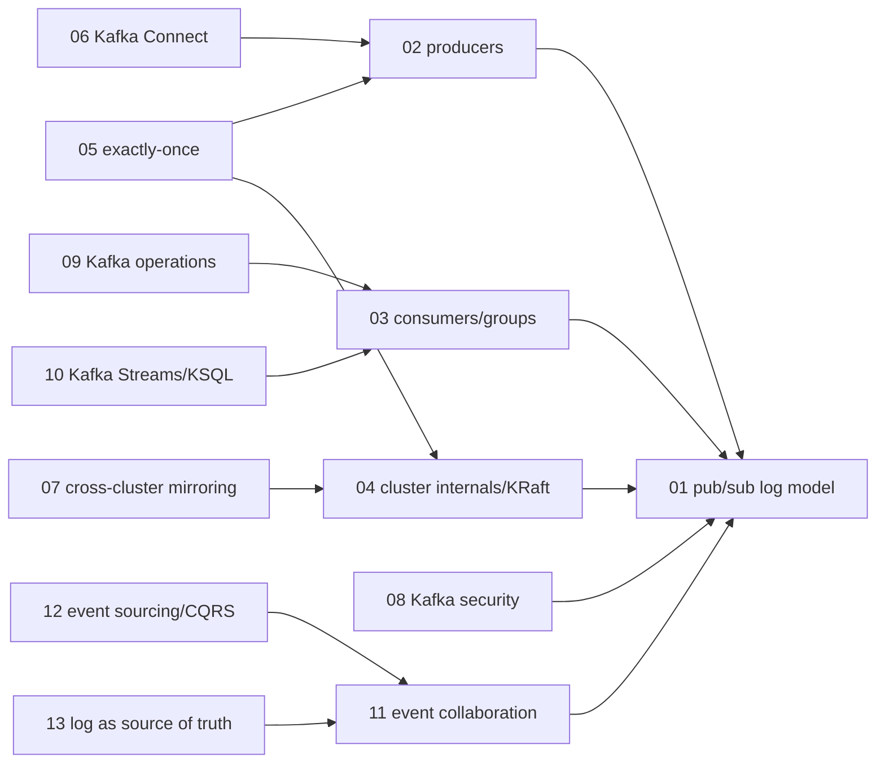
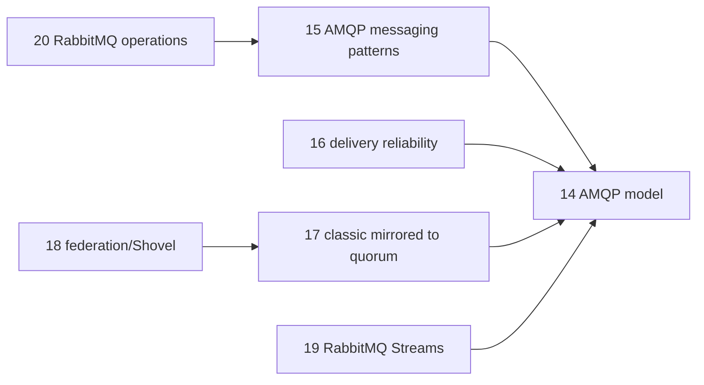
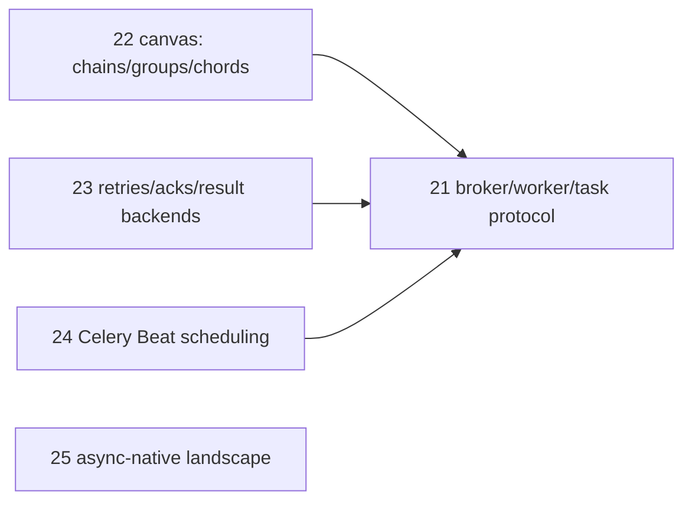

# Event bus and messaging — knowledge graph

*Three paradigms for moving data between services asynchronously: Kafka's replicated,
partitioned commit log; RabbitMQ's broker-mediated AMQP queueing; and Celery's task-queue
orchestration layered on top of a broker. The graph treats each paradigm's mechanism in depth
and marks where the shelf's RabbitMQ coverage in particular has fallen behind the broker's own
roadmap.*

**Nodes:** 25 · **Books:** 6 · **Currency researched:** 2026-08-06
**Requires:** [`06_concurrency`](../06_concurrency/00_knowledge_graph.md), [`02_os`](../02_os/00_knowledge_graph.md)
**Feeds:** `21_dataengineering` — not yet built in this repository; see §6 for the shape of that connection

---

## §1 Source audit

| Book | Year | Documents | Verdict |
|---|---|---|---|
| Shapira, Palino, Sivaram, Petty, *Kafka: The Definitive Guide*, 2nd ed. | 2021 | Producers, consumers, cluster internals, reliability, Connect, MirrorMaker, security, administration, monitoring, Kafka Streams | The authoritative single source for Kafka mechanism at every layer; already names KRaft as an emerging alternative to ZooKeeper and tiered storage as a roadmap item, so its gap is narrower than most books this age — it needs updating on defaults and GA status, not on concepts |
| Stopford, *Designing Event-Driven Systems* | 2018 | Event-driven architecture patterns, event sourcing and CQRS, data-on-the-outside/organizational data sharing, Kafka transactions, schema evolution | The architecture-pattern layer above the Kafka mechanics book; short (166pp) and Kafka-specific in its examples, but its patterns (single-writer principle, event collaboration, lean data) are durable and largely paradigm-independent |
| Ayanoglu, Aytas, Nahum, *Mastering RabbitMQ* | 2016 | AMQP architecture, clustering/HA, plugin development, client programming (Java/Ruby/Python), security | Predates quorum queues (2019) entirely; treats classic mirrored queues and Erlang-based clustering as the HA story, which RabbitMQ 4.0 (2024) no longer supports |
| Roy, *RabbitMQ in Depth* | 2017 | AMQP frame structure, message properties, publisher/consumer performance trade-offs, exchange routing patterns, clustering, federation, protocol bridging (MQTT/STOMP), database integrations | The deepest protocol-level treatment of the three RabbitMQ books and still the best source for AMQP wire mechanics; its HA and clustering chapters share the same classic-mirrored-queue blind spot as the other two |
| Videla & Williams, *RabbitMQ in Action* | 2012 | AMQP fundamentals, messaging patterns, clustering, load balancing, Shovel, management tooling, monitoring, plugin development | The oldest and most operationally hands-on of the three; its clustering chapter predates quorum queues by seven years and its Warrens/Shovel-based failover story is the RabbitMQ HA story of a pre-Raft era |
| Celery documentation (zh-cn translation, readthedocs PDF) | undated | Introduction to Celery, broker configuration | The TOC extraction captured only the opening chapters (Donations, Getting Started, the broker-configuration section); the source PDF runs to roughly 690 pages per its index, so most of Celery's documented surface — Canvas, Beat, result backends, routing, signals — is not visible in the extracted outline. Node coverage below reflects Celery's stable, long-documented public API surface rather than page citations this extraction cannot supply, and that gap is stated plainly rather than papered over |

---

## §2 Node index

| ID | Node | Type | Depth | Currency |
|---|---|---|---|---|
| `BUS-01` | Publish/subscribe messaging and the log abstraction | Mechanism | L4 | `stale-minor` |
| `BUS-02` | Kafka producers: batching, partitioning, and delivery configuration | Mechanism | L4 | `current` |
| `BUS-03` | Kafka consumers and consumer groups | Mechanism | L4 | `current` |
| `BUS-04` | Kafka cluster internals: controller, replication, and metadata management | Mechanism | L5 | `stale-major` |
| `BUS-05` | Reliability guarantees: replication configuration, idempotence, and transactional exactly-once | Mechanism | L5 | `current` |
| `BUS-06` | Kafka Connect and data-pipeline integration | Tool | L4 | `current` |
| `BUS-07` | Cross-cluster replication and multi-datacenter architecture | Practice | L4 | `stale-minor` |
| `BUS-08` | Kafka security: authentication, encryption, and authorization | Practice | L4 | `current` |
| `BUS-09` | Kafka operations: administration, metrics, and SLOs | Practice | L4 | `current` |
| `BUS-10` | Kafka Streams: stateful stream processing and KSQL | Mechanism | L5 | `current` |
| `BUS-11` | Event-driven collaboration: commands, events, and state transfer | Model | L4 | `current` |
| `BUS-12` | Event sourcing and CQRS on a log | Model | L5 | `current` |
| `BUS-13` | The log as shared source of truth: data on the outside and schema evolution | Model | L5 | `current` |
| `BUS-14` | The AMQP 0-9-1 model: exchanges, queues, bindings, and message properties | Protocol | L3 | `current` |
| `BUS-15` | Messaging patterns over AMQP: work queues, pub/sub, and RPC | Practice | L4 | `current` |
| `BUS-16` | Delivery reliability: publisher confirms, acknowledgment, prefetch, and dead-lettering | Mechanism | L4 | `current` |
| `BUS-17` | RabbitMQ high availability: from classic mirrored queues to quorum queues | Mechanism | L5 | `stale-major` |
| `BUS-18` | Federation, Shovel, and cross-cluster distribution | Practice | L4 | `stale-minor` |
| `BUS-19` | RabbitMQ Streams: log-structured queues inside a broker | Mechanism | L4 | `absent` |
| `BUS-20` | RabbitMQ operations: administration, monitoring, plugins, and access control | Practice | L4 | `stale-minor` |
| `BUS-21` | Celery architecture: brokers, workers, and the task protocol | Mechanism | L4 | `current` |
| `BUS-22` | Celery canvas: chains, groups, chords, and workflow composition | Mechanism | L4 | `current` |
| `BUS-23` | Task reliability: retries, acknowledgment, idempotency, and result backends | Mechanism | L4 | `current` |
| `BUS-24` | Periodic task scheduling with Celery Beat | Mechanism | L3 | `current` |
| `BUS-25` | The async-native task queue landscape: Celery versus Dramatiq, arq, and Taskiq | Model | L4 | `absent` |

---

## §3 The graph

Twenty-five nodes exceed the 15-node diagram cap, so the graph splits by paradigm: Kafka and
the event-driven-architecture patterns built on it, RabbitMQ and AMQP, and Celery.

### Kafka: the log, its cluster mechanics, and the architecture patterns built on it

### RabbitMQ: the AMQP model, reliability, and cluster topology

### Celery: task-queue orchestration and its async-native alternatives

---

## §4 Node records

### `BUS-01` · Publish/subscribe messaging and the log abstraction
**Type:** Mechanism · **Depth:** L4
**Covers:** topics and partitions, offsets, brokers and clusters, message batches, disk-based retention versus in-memory queueing, log compaction, why an append-only log gives Kafka both replay and durability that a destructive queue does not
**Sources:** Shapira et al. ch.1 "Meet Kafka" (2021) · Stopford ch.1–4 "Setting the Stage" (2018)
**Edges:** `contrasts` [`BUS-19`]
**Currency:** `stale-minor`
**Δ current:** Both books' description of the log itself — partitioned, ordered within a partition, retained by time or size rather than consumed-and-deleted — is unchanged and remains the correct mental model. What the 2021 book could not anticipate is KIP-932 ("Queues for Kafka"), which ships as an early-access feature in Kafka 4.0.0 (released March 18, 2025) and adds share groups: cooperative, per-record-acknowledged consumption across a topic's partitions that behaves much closer to a destructive queue than to the partition-per-consumer model this node otherwise describes. The Apache Kafka project's own early-access release notes are explicit that share groups' on-wire format and RPCs are still unstable and must not be run in production. An article on this node should teach the log-as-primary-abstraction model as settled and mention share groups as a genuinely new, not-yet-stable consumption mode rather than folding it into partition-based consumption as if it were the same mechanism.

### `BUS-02` · Kafka producers: batching, partitioning, and delivery configuration
**Type:** Mechanism · **Depth:** L4
**Covers:** synchronous versus asynchronous sends, `acks`, `linger.ms` and `batch.size`, `compression.type`, `max.in.flight.requests.per.connection`, idempotent producer configuration, custom and Avro serializers, custom partitioners, headers, interceptors, quotas and throttling
**Sources:** Shapira et al. ch.3 "Kafka Producers: Writing Messages to Kafka" (2021)
**Edges:** `requires` [`BUS-01`]
**Currency:** `current`

### `BUS-03` · Kafka consumers and consumer groups
**Type:** Mechanism · **Depth:** L4
**Covers:** consumer groups and partition rebalancing, static group membership, the poll loop and its thread-safety constraints, `session.timeout.ms`/`max.poll.interval.ms`, automatic versus manual offset commits, rebalance listeners, standalone consumers, custom deserializers
**Sources:** Shapira et al. ch.4 "Kafka Consumers: Reading Data from Kafka" (2021)
**Edges:** `requires` [`BUS-01`]
**Currency:** `current`

### `BUS-04` · Kafka cluster internals: controller, replication, and metadata management
**Type:** Mechanism · **Depth:** L5
**Covers:** cluster membership, the controller's role, leader/follower replication, request processing for produce and fetch, physical storage and file format, indexes, log compaction internals, tiered storage
**Sources:** Shapira et al. ch.6 "Kafka Internals" (2021)
**Edges:** `requires` [`BUS-01`]
**Currency:** `stale-major`
**Δ current:** Shapira et al. (2021) describe "KRaft: Kafka's New Raft-Based Controller" as an emerging alternative available for early testing, and structure the rest of the chapter — and the book's installation chapter — around ZooKeeper as the operational default that every production cluster runs. Apache Kafka 4.0.0, released March 18, 2025, removes ZooKeeper support entirely: KRaft is now the only supported controller and metadata mode, MirrorMaker 1 is also removed, and a cluster must first migrate to a KRaft-mode 3.x release before it can upgrade to 4.0 (Apache Kafka 4.0.0 Release Announcement, kafka.apache.org, March 18, 2025). Tiered storage, which the book's "Physical Storage" section names as a forthcoming feature (KIP-405), reached general availability in Kafka 3.9 (November 2024) after several releases as an early-access flag. An article on this node should teach KRaft as the only mode a new deployment will ever run, present ZooKeeper only as context for reading an older cluster or a pre-4.0 migration path, and treat tiered storage as GA rather than roadmap.

### `BUS-05` · Reliability guarantees: replication configuration, idempotence, and transactional exactly-once
**Type:** Mechanism · **Depth:** L5
**Covers:** replication factor, unclean leader election, minimum in-sync replicas, producer retry configuration, consumer offset-commit discipline for at-least-once processing, the idempotent producer's sequence-number fencing, the transactional producer/consumer API, transactional IDs and fencing, what transactions do not solve
**Sources:** Shapira et al. ch.7 "Reliable Data Delivery", ch.8 "Exactly-Once Semantics" (2021) · Stopford ch.12 "Transactions, but Not as We Know Them" (2018)
**Edges:** `requires` [`BUS-02`, `BUS-04`] · `contrasts` [`SQL-07`]
**Currency:** `current`

### `BUS-06` · Kafka Connect and data-pipeline integration
**Type:** Tool · **Depth:** L4
**Covers:** when to use Connect versus a hand-written producer/consumer, running Connect in standalone and distributed mode, source and sink connector configuration, Single Message Transformations, alternatives to Connect for ingest and ETL
**Sources:** Shapira et al. ch.9 "Building Data Pipelines" (2021)
**Edges:** `requires` [`BUS-02`]
**Currency:** `current`

### `BUS-07` · Cross-cluster replication and multi-datacenter architecture
**Type:** Practice · **Depth:** L4
**Covers:** hub-and-spoke, active-active, active-standby, and stretch-cluster topologies, MirrorMaker configuration and tuning, alternative mirroring tools (uReplicator, Brooklin, Confluent's cross-datacenter tooling)
**Sources:** Shapira et al. ch.10 "Cross-Cluster Data Mirroring" (2021)
**Edges:** `requires` [`BUS-04`]
**Currency:** `stale-minor`
**Δ current:** The book documents MirrorMaker 2, the Connect-based replication engine current at 2021 publication, in depth. Kafka 4.0 (March 2025) removes MirrorMaker 1 entirely as part of its policy of dropping APIs deprecated for at least twelve months; MirrorMaker 2 is unaffected and remains the supported tool, so the chapter's core guidance holds, but any residual MirrorMaker 1 material or comparison in the book should be read as describing a tool that no longer ships.

### `BUS-08` · Kafka security: authentication, encryption, and authorization
**Type:** Practice · **Depth:** L4
**Covers:** security protocols, SSL and SASL authentication, reauthentication, end-to-end encryption, `AclAuthorizer` and custom authorization, audit logging, securing ZooKeeper
**Sources:** Shapira et al. ch.11 "Securing Kafka" (2021)
**Edges:** `requires` [`BUS-01`] · `contrasts` [`BUS-20`]
**Currency:** `current`

### `BUS-09` · Kafka operations: administration, metrics, and SLOs
**Type:** Practice · **Depth:** L4
**Covers:** the AdminClient API, topic and consumer-group administration, dynamic configuration changes, console producer/consumer, partition management and preferred replica election, metric taxonomy, service-level objectives and indicators, under-replicated-partition diagnosis, broker/client/lag monitoring
**Sources:** Shapira et al. ch.5 "Managing Apache Kafka Programmatically", ch.12 "Administering Kafka", ch.13 "Monitoring Kafka" (2021)
**Edges:** `requires` [`BUS-03`]
**Currency:** `current`

### `BUS-10` · Kafka Streams: stateful stream processing and KSQL
**Type:** Mechanism · **Depth:** L5
**Covers:** stream-processing topology, event time versus processing time, local state stores, the stream-table duality, windowing, stream-table and table-table joins, out-of-sequence events and reprocessing, interactive queries, stateless versus stateful streaming approaches, scaling and failure recovery of a topology
**Sources:** Shapira et al. ch.14 "Stream Processing" (2021) · Stopford ch.6 "Processing Events with Stateful Functions", ch.14 "Kafka Streams and KSQL", ch.15 "Building Streaming Services" (2018)
**Edges:** `requires` [`BUS-03`]
**Currency:** `current`

### `BUS-11` · Event-driven collaboration: commands, events, and state transfer
**Type:** Model · **Depth:** L4
**Covers:** the distinction between commands, events, and queries, coupling introduced by message brokers, event notification versus event-carried state transfer, the event collaboration pattern, mixing request- and event-driven protocols
**Sources:** Stopford ch.5 "Events: A Basis for Collaboration" (2018)
**Edges:** `requires` [`BUS-01`]
**Currency:** `current`

### `BUS-12` · Event sourcing and CQRS on a log
**Type:** Model · **Depth:** L5
**Covers:** event sourcing and command sourcing distinguished from CQRS, events as the system's source of truth, materialized and polyglot views, whole-fact versus delta events, implementing CQRS with Kafka Streams state stores and Connect, change data capture as a way to unlock legacy systems
**Sources:** Stopford ch.7 "Event Sourcing, CQRS, and Other Stateful Patterns" (2018)
**Edges:** `requires` [`BUS-11`] · `contrasts` [`MDB-13`]
**Currency:** `current`

### `BUS-13` · The log as shared source of truth: data on the outside and schema evolution
**Type:** Model · **Depth:** L5
**Covers:** the data dichotomy between internal and shared state, the god-service and REST-to-ETL failure modes, event streams as an organization-wide database read inside out, the single-writer principle, eventual consistency and collision handling, lean-data rebuilding of views, schema compatibility and breaking-change management, deleting data from an append-only log, segregating public and private topics
**Sources:** Stopford ch.8–11, ch.13 "Sharing Data and Services Across an Organization", "Event Streams as a Shared Source of Truth", "Lean Data", "Consistency and Concurrency in Event-Driven Systems", "Evolving Schemas and Data over Time" (2018)
**Edges:** `requires` [`BUS-11`]
**Currency:** `current`

### `BUS-14` · The AMQP 0-9-1 model: exchanges, queues, bindings, and message properties
**Type:** Protocol · **Depth:** L3
**Covers:** AMQP as an RPC-style framed transport, connections/channels/virtual hosts, exchange types (direct, fanout, topic, headers), queue declaration and binding, the anatomy of a method/content-header/body frame, message properties (content-type, content-encoding, message-id/correlation-id, timestamp, TTL, delivery-mode, app-id/user-id, reply-to, custom headers, priority)
**Sources:** Ayanoglu et al. ch.3 "Architecture and Messaging" (2016) · Roy ch.1–3 "Foundational RabbitMQ", "How to Speak Rabbit: the AMQ Protocol", "An In-Depth Tour of Message Properties" (2017) · Videla & Williams ch.2 "Understanding Messaging" (2012)
**Currency:** `current`

### `BUS-15` · Messaging patterns over AMQP: work queues, pub/sub, and RPC
**Type:** Practice · **Depth:** L4
**Covers:** simple direct routing, broadcast via fanout, selective routing via topic and headers exchanges, exchange-to-exchange and consistent-hashing routing, fire-and-forget worker patterns, RPC over AMQP with `reply-to` and correlation IDs, MQTT and STOMP protocol bridging
**Sources:** Roy ch.6 "Message Patterns via Exchange Routing" (2017), ch.9 "Using Alternative Protocols" (2017) · Videla & Williams ch.4 "Solving Problems with Rabbit: Coding and Patterns" (2012) · Ayanoglu et al. ch.9–11, client-programming chapters (2016)
**Edges:** `requires` [`BUS-14`]
**Currency:** `current`

### `BUS-16` · Delivery reliability: publisher confirms, acknowledgment, prefetch, and dead-lettering
**Type:** Mechanism · **Depth:** L4
**Covers:** the `mandatory` flag and unroutable messages, publisher confirms as a lightweight alternative to transactions, alternate exchanges, `Basic.Get` versus `Basic.Consume`, no-ack mode, prefetch/QoS-based consumer throttling, `Basic.Reject`/`Basic.Nack`, dead letter exchanges, temporary versus durable queues
**Sources:** Roy ch.4 "Performance Trade-offs in Publishing", ch.5 "Don't Get Messages; Consume Them" (2017) · Videla & Williams §2.7 "Using Publisher Confirms to Verify Delivery" (2012)
**Edges:** `requires` [`BUS-14`]
**Currency:** `current`

### `BUS-17` · RabbitMQ high availability: from classic mirrored queues to quorum queues
**Type:** Mechanism · **Depth:** L5
**Covers:** cluster node types (RAM versus disk), classic queue mirroring and its slave-promotion failure modes, load-balancing across cluster nodes, quorum queues and Raft-based replication, leader election and automatic failover under quorum queues
**Sources:** Ayanoglu et al. ch.4 "Clustering and High Availability" (2016) · Roy ch.7 "Scaling RabbitMQ with Clusters" (2017) · Videla & Williams ch.5 "Clustering and Dealing with Failure", ch.7 "Warrens and Shovels: Failover and Replication" (2012)
**Edges:** `requires` [`BUS-14`]
**Currency:** `stale-major`
**Δ current:** All three RabbitMQ books present classic queue mirroring — declaring a queue as `ha-mode: all` (or the equivalent policy) so a master queue replicates to slave nodes, with a slave promoted on master failure — as the HA mechanism, and the oldest of the three (Videla & Williams, 2012) additionally documents "Warrens" (load-balancer-fronted master/slave pairs) as a clustering alternative that predates official mirroring support. Classic mirroring was deprecated in RabbitMQ 3.9 (2021) and removed outright in RabbitMQ 4.0: classic queues in 4.0 are a non-replicated queue type, and quorum queues — a Raft-based replicated queue type introduced in RabbitMQ 3.8 (2019) — are the only remaining option for a replicated, highly available queue (RabbitMQ team, "RabbitMQ 4.0: New Quorum Queue Features," rabbitmq.com/blog, August 28, 2024; RabbitMQ docs, "Migrate your RabbitMQ Mirrored Classic Queues to Quorum Queues"). None of the three books on this shelf mentions quorum queues at all, since all three predate their 2019 introduction. An article on this node must lead with quorum queues as the only supported HA queue type on any currently maintained RabbitMQ version and present classic mirroring strictly as history relevant to reading a pre-4.0 deployment or planning a migration off one.

### `BUS-18` · Federation, Shovel, and cross-cluster distribution
**Type:** Practice · **Depth:** L4
**Covers:** federated exchanges and federated queues, upstream and upstream-set configuration, bidirectional federation, federation for zero-downtime cluster upgrades, the Shovel plugin for point-to-point long-distance replication
**Sources:** Roy ch.8 "Cross-Cluster Message Distribution" (2017) · Videla & Williams §7.3 "Long-Distance Communication and Replication" (2012)
**Edges:** `requires` [`BUS-17`]
**Currency:** `stale-minor`
**Δ current:** Federation and Shovel remain supported, maintained RabbitMQ plugins and neither mechanism has been replaced; the books' configuration walkthroughs are largely still accurate at the plugin-configuration level. What has shifted around them is the queue type they replicate: a federated or shovelled queue built on the classic-mirrored-queue HA pattern these books also teach (`BUS-17`) no longer has that underlying replication option in RabbitMQ 4.0, so a current deployment pairs Federation or Shovel with quorum queues rather than the mirrored classic queues the books assume as the replicated unit underneath.

### `BUS-19` · RabbitMQ Streams: log-structured queues inside a broker
**Type:** Mechanism · **Depth:** L4
**Covers:** the stream as a persistent, replicated, append-only data structure with non-destructive (offset-based, replayable) consumer semantics, consuming a stream through the regular AMQP 0.9.1 interface versus the dedicated binary stream protocol, super streams as partitioned streams for horizontal scale
**Sources:** —
**Edges:** `requires` [`BUS-14`] · `contrasts` [`BUS-01`]
**Currency:** `absent`
**Δ current:** Absent from all three books on this shelf, whose publication years (2012, 2016, 2017) all predate the feature: RabbitMQ Streams shipped as a new data structure in RabbitMQ 3.9, first documented publicly in mid-2021 ("RabbitMQ Streams Overview," rabbitmq.com/blog, July 13, 2021), with super streams (partitioned streams) following in RabbitMQ 3.11. Streams give RabbitMQ non-destructive, replayable consumption — a queue you can re-read from an earlier offset rather than one that deletes on acknowledgment — which is architecturally the same idea Kafka's partitioned log provides and a genuine paradigm addition inside a broker historically built around destructive queue consumption. An article on this node should present streams as RabbitMQ borrowing the log abstraction for use cases where a classic or quorum queue's delete-on-ack semantics are the wrong fit, not as a replacement for either.

### `BUS-20` · RabbitMQ operations: administration, monitoring, plugins, and access control
**Type:** Practice · **Depth:** L4
**Covers:** CLI (`rabbitmqctl`) and management-plugin/web-console administration, the management REST API, plugin management and custom plugin development in Erlang, third-party monitoring integration (Nagios, Munin, Zabbix), SASL authentication, TLS/SSL configuration, and access-control permissions
**Sources:** Ayanoglu et al. ch.2, ch.5–8 "Configuring RabbitMQ", "Plugins and Plugin Development", "Managing Your RabbitMQ Server", "Monitoring", "Security in RabbitMQ" (2016) · Videla & Williams ch.3, ch.8–12 "Running and Administering Rabbit", "Administering RabbitMQ from the Web", "Controlling Rabbit with the REST API", "Monitoring", "Supercharging and Securing Your Rabbit", "Smart Rabbits: Extending RabbitMQ" (2012)
**Edges:** `requires` [`BUS-15`] · `contrasts` [`BUS-08`]
**Currency:** `stale-minor`
**Δ current:** The CLI, management plugin, and REST API mechanics these books teach remain the same tools in current RabbitMQ releases, so most of this material still applies directly. What has moved is the operational picture the monitoring and administration chapters implicitly assume: with classic mirrored queues gone in 4.0 (`BUS-17`), the health signals an operator watches for — mirror synchronization lag, slave promotion events — no longer exist as such, replaced by quorum-queue-specific signals (Raft leader elections, follower lag) that neither book's monitoring chapter names because quorum queues did not exist when they were written.

### `BUS-21` · Celery architecture: brokers, workers, and the task protocol
**Type:** Mechanism · **Depth:** L4
**Covers:** the application/task/message abstraction, broker abstraction over RabbitMQ/Redis/other transports, the pre-fork worker pool model, task serialization and the message protocol, task routing to queues
**Sources:** Ayanoglu et al. §11 "Python Client Programming" — Celery section (2016) · Celery documentation (zh-cn), "Getting Started" §3.2.1–3.2.2, "Introduction to Celery" and "Brokers" (undated)
**Edges:** `contrasts` [`CONC-16`] · `contrasts` [`BUS-25`]
**Currency:** `current`

### `BUS-22` · Celery canvas: chains, groups, chords, and workflow composition
**Type:** Mechanism · **Depth:** L4
**Covers:** chaining tasks, parallel groups, chords as a group-with-callback, chunking and mapping over iterables, composing primitives into multi-stage workflows
**Sources:** Celery documentation (zh-cn); not visible in this repository's TOC extraction, which captured only the introductory chapters — see §1 audit
**Edges:** `requires` [`BUS-21`]
**Currency:** `current`

### `BUS-23` · Task reliability: retries, acknowledgment, idempotency, and result backends
**Type:** Mechanism · **Depth:** L4
**Covers:** automatic and manual retry with backoff, late acknowledgment versus early acknowledgment and their redelivery implications, designing idempotent tasks, result backend selection and result expiry, task time limits
**Sources:** Celery documentation (zh-cn); not visible in this repository's TOC extraction — see §1 audit
**Edges:** `requires` [`BUS-21`]
**Currency:** `current`

### `BUS-24` · Periodic task scheduling with Celery Beat
**Type:** Mechanism · **Depth:** L3
**Covers:** the Beat scheduler process, crontab-style and interval schedules, running Beat as a singleton against a shared result/broker backend
**Sources:** Ayanoglu et al. §11.4.3 "Scheduling" (2016); further Celery documentation coverage not visible in this repository's TOC extraction — see §1 audit
**Edges:** `requires` [`BUS-21`]
**Currency:** `current`

### `BUS-25` · The async-native task queue landscape: Celery versus Dramatiq, arq, and Taskiq
**Type:** Model · **Depth:** L4
**Covers:** Celery's pre-fork, thread/process-pool concurrency model as the throughput ceiling for I/O-bound tasks, Dramatiq's actor-style model as a near-drop-in Celery replacement, arq's and Taskiq's asyncio-native worker loops, third-party asyncio worker pools for Celery itself (`celery-aio-pool`) and Celery's own experimental `celery-asyncio` project
**Sources:** —
**Edges:** `contrasts` [`BUS-21`] · `contrasts` [`CONC-04`]
**Currency:** `absent`
**Δ current:** No book on this shelf covers any task queue other than Celery, so this node has no source in the directory by construction. As of Celery 5.6.3 (released March 26, 2026, per the project's own changelog at docs.celeryq.dev), Celery's mainline worker model is still pre-fork and does not natively run `async def` tasks on an event loop; asyncio support exists only through out-of-tree pool implementations such as `celery-aio-pool` and an early-stage `celery-asyncio` package (v6.0.0a3, April 2026), not the default worker. Meanwhile Dramatiq, arq, and Taskiq were all designed asyncio-first from their beginning and report substantially higher throughput than Celery specifically on I/O-bound, high-concurrency workloads in third-party 2026 benchmarks, though those benchmark numbers are vendor- or blog-published rather than from a controlled, reproducible source this graph can verify independently. Celery remains the default choice for teams already invested in its mature retry/routing/monitoring ecosystem; an article on this node should teach Celery's architecture as the baseline every reader will meet in an existing codebase while naming the asyncio-native alternatives as the mechanism a greenfield, I/O-bound-heavy service is increasingly likely to reach for instead.

---

## §5 Cross-subject edges

| From | Edge | To | Why |
|---|---|---|---|
| `BUS-05` | `contrasts` | `SQL-07` | Kafka's idempotent-producer-plus-transaction model for exactly-once delivery across partitions, compared with ACID transaction isolation levels and concurrency control in a relational database |
| `BUS-12` | `contrasts` | `MDB-13` | Event sourcing and CQRS built on Kafka Connect/Streams change-data-capture pipelines, compared with MongoDB's native change-stream mechanism for the same turn-mutations-into-events problem |
| `BUS-21` | `contrasts` | `CONC-16` | `06_concurrency`'s single-service-scale treatment of Celery/RabbitMQ/Kafka as one practice node, compared with this subject's full-depth treatment of each paradigm separately |
| `BUS-25` | `contrasts` | `CONC-04` | The asyncio-native task-queue landscape (arq, Taskiq, and Celery's own experimental asyncio pool) is only legible against `06_concurrency`'s treatment of what asyncio's event loop actually schedules |

**Reciprocals needed in `06_concurrency/00_knowledge_graph.md`** (this agent cannot edit that file):
add `**Edges:** `contrasts` [`BUS-21`] · `contrasts` [`BUS-25`]` to the `CONC-16` node record, and add the
corresponding rows to that file's own §5 cross-subject table:
`CONC-16 | contrasts | BUS-21 | Reciprocal, declared in 18_eventbus` and
`CONC-04 | contrasts | BUS-25 | Reciprocal, declared in 18_eventbus`.

---

## §6 Coverage gaps

Nothing here covers Kafka's KIP-932 share groups at mechanism depth — `BUS-01`'s `Δ current`
names the feature and its early-access status, but a full treatment needs the feature to reach
general availability and a stable wire format first, since writing an article against an
unstable RPC surface would teach something the next Kafka release could invalidate. Nothing here
covers Kafka Streams' interactive-queries API or ksqlDB's current standalone-server architecture
in depth; both are mentioned only as `Covers` items on `BUS-10`. Nothing here covers Redis
Streams or Redis as a Celery broker/result-backend at the depth `11_redis_caching` treats Redis
generally — that subject's `RDS-10` (task queues and pull messaging) and `RDS-11` (Redis Streams
and consumer groups) already exist and would be the natural cross-subject edge once this graph's
author confirms their exact scope; declaring an edge without reading that graph would risk
inventing a target this graph did not verify. Nothing here builds the connection to
`21_dataengineering` beyond this paragraph, since that subject has not been assigned a prefix or
built yet: the natural edges would be from `BUS-04`/`BUS-10` (Kafka's log and stream-processing
layer) into whatever node that future subject gives to ingestion pipelines and stream-to-batch
bridging, and from `BUS-06` (Kafka Connect) into that subject's CDC/ELT tooling coverage. Nothing
here covers the Celery documentation's Canvas, Beat, or result-backend chapters at the
book-citation depth this repository's other nodes achieve, because the machine-extracted TOC for
that PDF captured only its opening sections (see §1); a re-extraction of that PDF's outline, or a
targeted reading of the Canvas and Beat chapters specifically, would close that citation gap
without requiring the full 690-page document to be opened.

---

← [repo index](../README.md) · [root graph](../KNOWLEDGE_GRAPH.md) · [writing contract](../AGENTS.md)
