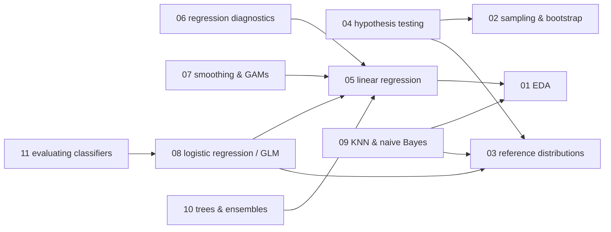
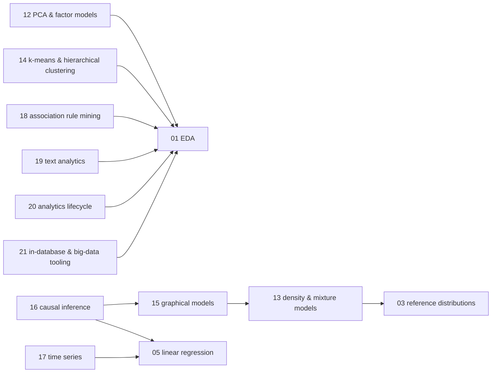

# Data analysis — knowledge graph

*Applied statistical analysis at the depth a working analyst needs: exploratory technique,
inference under resampling, the regression family, supervised and unsupervised learning as
statisticians teach it, causal identification, and the practice of running an analytics project
end to end — read against one graduate statistics text, one industry Big Data-era survey, and
one modern practitioner's handbook.*

**Nodes:** 21 · **Books:** 3 · **Currency researched:** 2026-08-06
**Feeds:** [`20_datascience`](../20_datascience/00_knowledge_graph.md), [`21_dataengineering`](../21_dataengineering/00_knowledge_graph.md)

---

## §1 Source audit

| Book | Year | Documents | Verdict |
|---|---|---|---|
| Shalizi, *Advanced Data Analysis from an Elementary Point of View* | 2016 (Cambridge University Press) | Regression and its generalizations, distributions and latent structure, causal inference, dependent data (time series), appendices on optimization/information theory/missing data | Rigorous, mathematically complete treatment of the regression-through-causal-inference arc; still the strongest text on this shelf for *why* the classical machinery works. Its causal-inference chapters predate the double-machine-learning and causal-forest literature; its model-selection chapter predates the mainstreaming of penalized regression as the default over stepwise selection |
| EMC Education Services, *Data Science and Big Data Analytics* | 2015 (Wiley) | The analytics lifecycle, R-based EDA, clustering, association rules, regression/classification/time-series/text analysis as an industry survey, MapReduce/Hadoop tooling, in-database SQL analytics | Useful as a practitioner-process reference (the discovery-to-operationalize lifecycle, the final-deliverable checklist) and for association-rule mining, which neither other book covers; its Hadoop-ecosystem chapter documents tooling (Pig, Hive-on-MapReduce, Mahout) that the industry has since moved past |
| Bruce & Bruce, *Practical Statistics for Data Scientists* | 2017 (O'Reilly) | EDA, sampling distributions and the bootstrap, hypothesis testing and A/B testing, regression and classification, statistical machine learning (KNN, trees, bagging, boosting), unsupervised learning (PCA, clustering) | The most current and most implementation-minded of the three; its multi-arm-bandit aside already flags the direction experimentation practice has moved since. Holds up well overall — the main gaps are in what has emerged *since* 2017 rather than what it got wrong |

---

## §2 Node index

| ID | Node | Type | Depth | Currency |
|---|---|---|---|---|
| `STAT-01` | Exploratory data analysis: location, variability, and distribution shape | Practice | L3 | `stale-minor` |
| `STAT-02` | Sampling distributions, standard error, and the bootstrap | Mechanism | L4 | `current` |
| `STAT-03` | Reference probability distributions for data analysis | Model | L3 | `current` |
| `STAT-04` | Statistical hypothesis testing and experiment design | Practice | L4 | `stale-minor` |
| `STAT-05` | Simple and multiple linear regression | Model | L4 | `current` |
| `STAT-06` | Regression diagnostics, model evaluation, and cross-validation | Practice | L4 | `stale-minor` |
| `STAT-07` | Nonparametric regression: smoothing, splines, and additive models | Model | L4 | `current` |
| `STAT-08` | Logistic regression and generalized linear models | Model | L4 | `current` |
| `STAT-09` | Classification with distance and probability: KNN and naive Bayes | Algorithm | L3 | `current` |
| `STAT-10` | Decision trees and ensemble methods | Algorithm | L4 | `current` |
| `STAT-11` | Evaluating classifiers under class imbalance | Practice | L4 | `current` |
| `STAT-12` | Dimensionality reduction: PCA and factor models | Algorithm | L4 | `current` |
| `STAT-13` | Density estimation and mixture models | Model | L4 | `current` |
| `STAT-14` | Clustering: k-means and hierarchical methods | Algorithm | L3 | `current` |
| `STAT-15` | Graphical models | Model | L5 | `current` |
| `STAT-16` | Causal inference: graphical models, identification, and estimation | Model | L5 | `stale-minor` |
| `STAT-17` | Time series analysis | Model | L4 | `stale-minor` |
| `STAT-18` | Association rule mining | Algorithm | L3 | `current` |
| `STAT-19` | Text analytics: representation, TF-IDF, and sentiment | Practice | L3 | `stale-major` |
| `STAT-20` | The data-analytics lifecycle and communicating results | Practice | L3 | `current` |
| `STAT-21` | In-database and big-data-scale analytics tooling | Tool | L3 | `stale-major` |

---

## §3 The graph

Twenty-one nodes exceed the diagram cap, so the graph splits into two clusters by `requires` edges
only; `contrasts` relations are listed in the node records and §5 instead.

### Foundations, inference, and the regression family

### Unsupervised structure, causal inference, and applied practice

---

## §4 Node records

### `STAT-01` · Exploratory data analysis: location, variability, and distribution shape
**Type:** Practice · **Depth:** L3
**Covers:** rectangular and nonrectangular data structures, mean/median/trimmed-mean and other robust location estimates, standard deviation/MAD/percentile-based variability, boxplots, frequency tables and histograms, density estimates, exploring binary and categorical data, correlation and scatterplots, hexagonal binning, visualizing multiple variables
**Sources:** Bruce & Bruce ch.1 (2017) · *Data Science & Big Data Analytics* (DSBDA) ch.3 (2015)
**Currency:** `stale-minor`
**Δ current:** Both source books work primarily in R (DSBDA is built entirely around it; Bruce & Bruce's code listings are R-first). Kaggle's 2022 State of Data Science and Machine Learning survey recorded R usage among practitioners falling from roughly 64% to 23% across the years the survey has run, while Python usage climbed over the same period — Python with pandas, matplotlib, and seaborn is now the default EDA toolchain in industry rather than a secondary option. The estimators and diagnostics themselves (robust location measures, percentile-based spread, density estimation) are unchanged; only the language the article should demonstrate them in has shifted.

### `STAT-02` · Sampling distributions, standard error, and the bootstrap
**Type:** Mechanism · **Depth:** L4
**Covers:** random sampling and sample bias, selection bias and regression to the mean, the sampling distribution of a statistic, the Central Limit Theorem, standard error, the bootstrap versus classical resampling, confidence intervals
**Sources:** Bruce & Bruce ch.2 (2017) · Shalizi ch.5–6 (2016)
**Currency:** `current`

### `STAT-03` · Reference probability distributions for data analysis
**Type:** Model · **Depth:** L3
**Covers:** the normal distribution, standard normal and QQ-plots, long-tailed distributions, Student's t, the binomial distribution, chi-square, F, Poisson, exponential, and Weibull distributions
**Sources:** Bruce & Bruce ch.2 (2017)
**Currency:** `current`

### `STAT-04` · Statistical hypothesis testing and experiment design
**Type:** Practice · **Depth:** L4
**Covers:** A/B testing and control groups, the null and alternative hypothesis, p-values and alpha, Type I and Type II errors, permutation tests, t-tests, multiple-testing correction, degrees of freedom, ANOVA and the F-statistic, chi-square tests, multi-arm bandits, power and sample size
**Sources:** Bruce & Bruce ch.3 (2017) · DSBDA ch.3 §3.3 (2015)
**Edges:** `requires` [`STAT-02`, `STAT-03`]
**Currency:** `stale-minor`
**Δ current:** Bruce & Bruce's own multi-arm-bandit section (2017) already presents adaptive allocation as an alternative to the fixed-horizon A/B test both books otherwise assume. The direction practice has moved since is toward letting experimenters monitor results continuously without inflating the false-positive rate — the "peeking problem" Evan Miller documented informally in 2010 and that Johari, Koomen, Pekelis & Walsh formalized with a sequential, always-valid testing procedure in "Peeking at A/B Tests" (KDD 2017). An article on this node should teach the fixed-sample NHST machinery as the foundation and flag sequential/always-valid testing as the answer to a limitation both books' worked examples run into but do not name.

### `STAT-05` · Simple and multiple linear regression
**Type:** Model · **Depth:** L4
**Covers:** the regression equation, least squares, fitted values and residuals, prediction versus explanation, multiple regression, factor and dummy variables, correlated predictors and multicollinearity, confounding, interaction terms
**Sources:** Bruce & Bruce ch.4 (2017) · Shalizi ch.1–2 (2016) · DSBDA ch.6 §6.1 (2015)
**Edges:** `requires` [`STAT-01`]
**Currency:** `current`

### `STAT-06` · Regression diagnostics, model evaluation, and cross-validation
**Type:** Practice · **Depth:** L4
**Covers:** outliers and influential values, heteroskedasticity and correlated errors, partial residual plots, weighted regression, cross-validation, stepwise and other model-selection procedures, specification testing
**Sources:** Bruce & Bruce ch.4 (2017) · Shalizi ch.3, ch.9–10 (2016)
**Edges:** `requires` [`STAT-05`]
**Currency:** `stale-minor`
**Δ current:** Shalizi's model-evaluation and weighting chapters (2016) build variable selection around stepwise procedures and classical specification tests. Regularized regression — ridge, lasso, and elastic net, made practical at scale by Friedman, Hastie & Tibshirani's `glmnet` (2010), which predates the book — is the current default for high-dimensional variable selection precisely because stepwise selection is now well documented to produce unstable, optimistic models. An article on this node should teach cross-validation as the evaluation backbone both books already center and present penalized regression as the selection method current tooling defaults to over stepwise search.

### `STAT-07` · Nonparametric regression: smoothing, splines, and additive models
**Type:** Model · **Depth:** L4
**Covers:** kernel smoothing, splines, generalized additive models, polynomial regression, degrees of freedom in a smoother
**Sources:** Shalizi ch.4, ch.7–8 (2016) · Bruce & Bruce polynomial/spline regression, ch.4 (2017)
**Edges:** `requires` [`STAT-05`]
**Currency:** `current`

### `STAT-08` · Logistic regression and generalized linear models
**Type:** Model · **Depth:** L4
**Covers:** the logit and logistic response function, odds ratios, the GLM family, the GAM extension, assessing model fit, predicted probabilities
**Sources:** Shalizi ch.11–12 (2016) · Bruce & Bruce ch.5 (2017) · DSBDA ch.6 §6.2 (2015)
**Edges:** `requires` [`STAT-05`, `STAT-03`]
**Currency:** `current`

### `STAT-09` · Classification with distance and probability: KNN and naive Bayes
**Type:** Algorithm · **Depth:** L3
**Covers:** distance metrics, one-hot encoding and standardization, choosing k, KNN as a feature engine, the naive Bayes classifier, Bayes' theorem, Laplace smoothing, discriminant analysis
**Sources:** Bruce & Bruce ch.5–6 (2017) · DSBDA ch.7 §7.2 (2015)
**Edges:** `requires` [`STAT-01`, `STAT-03`] · `contrasts` [`DS-14`]
**Currency:** `current`

### `STAT-10` · Decision trees and ensemble methods
**Type:** Algorithm · **Depth:** L4
**Covers:** recursive partitioning, impurity measures, stopping rules, bagging, random forests and variable importance, boosting, XGBoost, regularization against overfitting
**Sources:** Bruce & Bruce ch.6 (2017) · Shalizi ch.13 (2016) · DSBDA ch.7 §7.1 (2015)
**Edges:** `requires` [`STAT-05`]
**Currency:** `current`

### `STAT-11` · Evaluating classifiers under class imbalance
**Type:** Practice · **Depth:** L4
**Covers:** the confusion matrix, precision/recall/specificity, the ROC curve and AUC, lift, the rare-class problem, undersampling and oversampling, synthetic data generation, cost-based classification
**Sources:** Bruce & Bruce ch.5 (2017) · DSBDA ch.7 §7.3–7.4 (2015)
**Edges:** `requires` [`STAT-08`]
**Currency:** `current`

### `STAT-12` · Dimensionality reduction: PCA and factor models
**Type:** Algorithm · **Depth:** L4
**Covers:** principal components, correspondence analysis, factor models, the singular value decomposition as the underlying computation, scaling before reduction
**Sources:** Shalizi ch.15–16 (2016) · Bruce & Bruce ch.7 (2017)
**Edges:** `requires` [`STAT-01`] · `contrasts` [`DS-03`]
**Currency:** `current`

### `STAT-13` · Density estimation and mixture models
**Type:** Model · **Depth:** L4
**Covers:** kernel density estimation, the multivariate normal distribution, mixtures of normals, model-based clustering, selecting the number of mixture components
**Sources:** Shalizi ch.14, ch.17 (2016) · Bruce & Bruce model-based clustering, ch.7 (2017)
**Edges:** `requires` [`STAT-03`] · `contrasts` [`STAT-14`]
**Currency:** `current`

### `STAT-14` · Clustering: k-means and hierarchical methods
**Type:** Algorithm · **Depth:** L3
**Covers:** the k-means algorithm, choosing k, interpreting clusters, hierarchical/agglomerative clustering, dendrograms, dissimilarity measures, Gower's distance for mixed data, scaling categorical variables
**Sources:** Bruce & Bruce ch.7 (2017) · DSBDA ch.4 (2015)
**Edges:** `requires` [`STAT-01`] · `contrasts` [`STAT-13`, `DS-08`]
**Currency:** `current`

### `STAT-15` · Graphical models
**Type:** Model · **Depth:** L5
**Covers:** conditional independence structure, directed and undirected graphical models, factorization of a joint distribution over a graph
**Sources:** Shalizi ch.18 (2016)
**Edges:** `requires` [`STAT-13`] · `contrasts` [`DS-11`]
**Currency:** `current`

### `STAT-16` · Causal inference: graphical models, identification, and estimation
**Type:** Model · **Depth:** L5
**Covers:** graphical causal models, the do-operator and identification, back-door and front-door criteria, estimating causal effects, discovering causal structure from data
**Sources:** Shalizi ch.19–22 (2016)
**Edges:** `requires` [`STAT-15`, `STAT-05`]
**Currency:** `stale-minor`
**Δ current:** Shalizi's causal-inference chapters (2016) are built entirely on Pearl-style graphical causal models and structure discovery. They predate the mainstreaming of double/debiased machine learning — formalized by Chernozhukov, Chetverikov, Demirer et al. in "Double/Debiased Machine Learning for Treatment and Structural Parameters" (*The Econometrics Journal*, 2018) — and of causal forests for heterogeneous treatment-effect estimation (Wager & Athey, *JASA* 2018; Athey, Tibshirani & Wager, *Annals of Statistics* 2019), both of which pair the book's causal-graph identification machinery with flexible machine-learning nuisance-parameter estimation rather than parametric regression. An article on this node should teach the graphical identification framework as the layer that still holds and treat double ML and causal forests as the estimation techniques the book could not have covered.

### `STAT-17` · Time series analysis
**Type:** Model · **Depth:** L4
**Covers:** the Box-Jenkins methodology, the autocorrelation function, autoregressive and moving-average models, ARMA/ARIMA, model building and evaluation, simulation-based inference for dependent data
**Sources:** Shalizi ch.23–24 (2016) · DSBDA ch.8 (2015)
**Edges:** `requires` [`STAT-05`]
**Currency:** `stale-minor`
**Δ current:** ARIMA and the Box-Jenkins methodology remain the correct classical baseline both books teach, and neither is wrong about the mechanism. What has shifted since 2015–2016 is the working default for irregular, multi-seasonal business series: Meta's Prophet, open-sourced in 2017, popularized a decomposition-based approach designed for exactly the messy holiday-and-seasonality data ARIMA handles awkwardly, and gradient-boosted or sequence models are now common for demand forecasting at scale. Neither book anticipates either direction; an article should still teach ARIMA first; the mechanism, not the tooling around it, is what transfers.

### `STAT-18` · Association rule mining
**Type:** Algorithm · **Depth:** L3
**Covers:** frequent itemset generation, the Apriori algorithm, support/confidence/lift, rule generation and evaluation, applications to transactional data
**Sources:** DSBDA ch.5 (2015)
**Edges:** `requires` [`STAT-01`]
**Currency:** `current`

### `STAT-19` · Text analytics: representation, TF-IDF, and sentiment
**Type:** Practice · **Depth:** L3
**Covers:** text collection and cleaning, bag-of-words and TF-IDF representation, topic categorization, dictionary-based sentiment scoring, deriving insight from unstructured text
**Sources:** DSBDA ch.9 (2015)
**Edges:** `requires` [`STAT-01`] · `contrasts` [`DS-10`]
**Currency:** `stale-major`
**Δ current:** DSBDA's text-analysis chapter (2015) is built entirely on TF-IDF/bag-of-words representation and dictionary-based sentiment scoring. The Transformer architecture (Vaswani et al., "Attention Is All You Need," NeurIPS 2017) and the pretrained language models that followed — BERT (2018) and the GPT family from 2018 onward — have since become the default representation for production topic and sentiment work, reducing TF-IDF to a fast, interpretable baseline rather than the state of the art the chapter presents it as. An article on this node should keep TF-IDF as the mechanism worth building from first principles and name contextual embeddings as the current production default it is compared against.

### `STAT-20` · The data-analytics lifecycle and communicating results
**Type:** Practice · **Depth:** L3
**Covers:** the discovery, data-preparation, model-planning, model-building, communicate-results, and operationalize phases; structuring a final deliverable for multiple audiences; the evolution of a graphic and visualization cleanup
**Sources:** DSBDA ch.2, ch.12 (2015)
**Edges:** `requires` [`STAT-01`]
**Currency:** `current`

### `STAT-21` · In-database and big-data-scale analytics tooling
**Type:** Tool · **Depth:** L3
**Covers:** SQL essentials for analytics (joins, set operations, grouping extensions), window functions and ordered aggregates, user-defined aggregates, in-database text analysis, the MapReduce/Hadoop ecosystem (Pig, Hive, HBase, Mahout), NoSQL as an analytic data source
**Sources:** DSBDA ch.10–11 (2015)
**Edges:** `requires` [`STAT-01`] · `contrasts` [`SQL-08`, `DE-11`]
**Currency:** `stale-major`
**Δ current:** The Hadoop-ecosystem tooling this node covers was already showing its age when DSBDA measured currency in 2015. Apache Pig's most recent release, 0.18.0, shipped September 15, 2025, but the project's own release cadence and community size are described as small and slow-moving; Apache Mahout pivoted away from distributed classical ML entirely toward a quantum-computing layer (Qumat, introduced at FOSDEM 2025) rather than continuing as a MapReduce-based ML library. Apache Spark's DataFrame/SQL engine has been the practical successor for the batch workloads this chapter routes through Pig and Hive-on-MapReduce since Spark's own SQL module matured around 2015. An article on this node should teach the SQL and window-function material as current and treat the named Hadoop-ecosystem tools as historical context rather than a live recommendation.

---

## §5 Cross-subject edges

| From | Edge | To | Why |
|---|---|---|---|
| `STAT-09` | `contrasts` | `DS-14` | KNN/naive Bayes classification compared against collaborative-filtering recommenders built on the same distance intuition |
| `STAT-12` | `contrasts` | `DS-03` | Applied-statistics PCA/factor-model framing compared against the linear-algebra SVD framing of the same computation |
| `STAT-14` | `contrasts` | `DS-08` | k-means/hierarchical clustering compared against spectral and approximation-stable clustering |
| `STAT-15` | `contrasts` | `DS-11` | Applied graphical models for latent structure compared against algorithmic graphical-model inference and belief propagation |
| `STAT-19` | `contrasts` | `DS-10` | Applied TF-IDF/sentiment representation compared against generative topic models and n-gram language models over the same text |
| `STAT-21` | `contrasts` | `DE-11` | The Hadoop-ecosystem/in-database analytics this node documents compared against Spark as its practical successor |
| `STAT-21` | `contrasts` | `SQL-08` | DSBDA's advanced-SQL-for-analytics chapter compared against the query-planner subject's own window-functions treatment |
| `DS-05` | `requires` | `STAT-06` | Statistical learning theory's treatment of overfitting and generalization builds on cross-validation and the bias-variance tradeoff established here |
| `DS-06` | `requires` | `STAT-08` | A neural network's output layer and training objective generalize logistic regression, which this subject covers first |
| `DS-15` | `requires` | `STAT-01` | Acquiring, cleaning, and visualizing data in practice presupposes knowing what EDA is for |

---

## §6 Coverage gaps

Nothing in this subject's three books covers modern experimentation infrastructure — sequential/always-valid testing, CUPED variance reduction, or switchback designs for marketplace experiments — beyond the multi-arm-bandit aside in Bruce & Bruce; Johari et al.'s 2017 KDD paper and Deng, Xu, Kohavi & Walker's CUPED paper (KDD 2013) would close that gap directly and are referenced in `STAT-04`'s currency note. Nothing here covers Bayesian hierarchical modeling as a distinct mechanism from the frequentic GLM/mixture-model treatment both Shalizi and Bruce & Bruce give; a text such as Gelman & Hill would be the natural source, and the gap matters most for `STAT-08` and `STAT-13`. Survival analysis is entirely absent from all three books despite being a standard applied-statistics tool for time-to-event data; nothing here would need to be revised to add it, only extended. Finally, `STAT-21`'s coverage of the Hadoop ecosystem has no replacement node describing the current cloud-warehouse-first analytics stack (BigQuery, Snowflake, dbt) from the analyst's-eye view rather than the data engineer's; see `21_dataengineering`'s `DE-13` for the data-engineering side of that same gap.

---

← [repo index](../README.md) · [root graph](../KNOWLEDGE_GRAPH.md) · [writing contract](../AGENTS.md)
