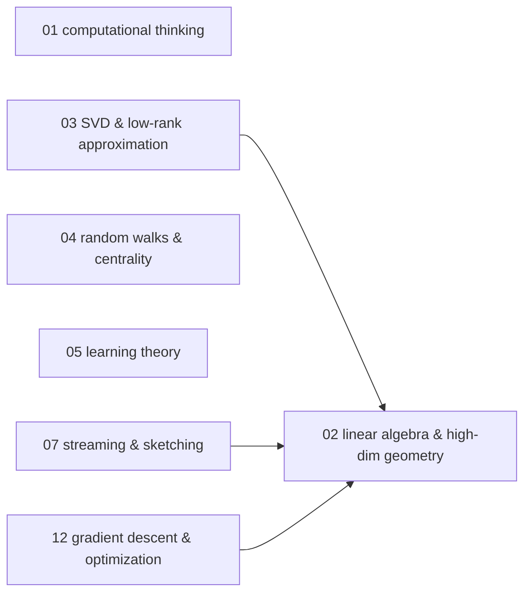
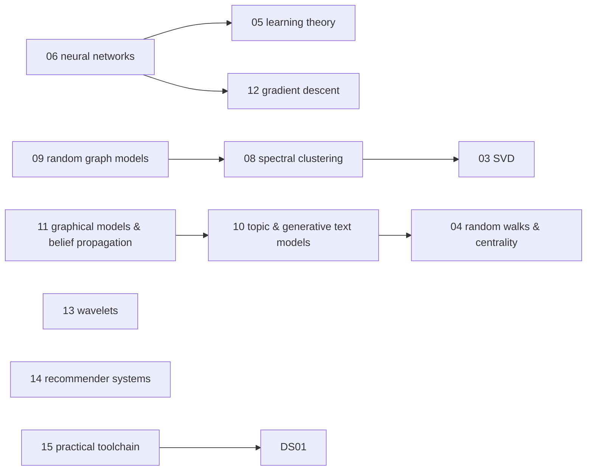

# Data science — knowledge graph

*The mathematical and algorithmic layer beneath applied data analysis: computational thinking
as a pattern language over datasets, the high-dimensional linear algebra that makes modern
machine learning tractable, learning theory, and the generative/graphical models that sit
underneath topic modeling, recommendation, and deep learning — read against a primer on
computational thinking, a mathematically rigorous foundations text, and a practitioner's
from-scratch implementation guide.*

**Nodes:** 15 · **Books:** 3 · **Currency researched:** 2026-08-06
**Requires:** [`19_data_analysis`](../19_data_analysis/00_knowledge_graph.md)
**Feeds:** [`21_dataengineering`](../21_dataengineering/00_knowledge_graph.md)

---

## §1 Source audit

| Book | Year | Documents | Verdict |
|---|---|---|---|
| Venkatesh & Mukund, *Computational Thinking: A Primer for Programmers and Data Scientists* | 2021 | The iterate-filter-accumulate pattern over a dataset, static/dynamic/state-based filtering, pseudocode for procedures, element-to-dataset and element-to-element comparison, generic CS topics (recursion, OOP, functional and concurrent computing) | Its distinctive contribution is the pedagogy of teaching data processing as a pattern language before teaching a specific language; its generic CS chapters (recursion, OOP, concurrency, I/O) duplicate ground `01_computation`, `03_dsa`, `05_python`, and `06_concurrency` already cover more deeply and are not re-nodedhere |
| Blum, Hopcroft & Kannan, *Foundations of Data Science* | 2020 (Cambridge University Press) | High-dimensional geometry, SVD, random walks and Markov chains, statistical learning theory, streaming/sketching algorithms, spectral clustering, random graphs, topic models and graphical models, optimization, wavelets | The most rigorous and most current book on this shelf for the algorithmic mathematics underneath data science; its own scope stops short of the deep-learning-dominant architectures (transformers, diffusion) that emerged in the years immediately around and after its publication |
| Grus, *Data Science from Scratch* | 2019, 2nd edition | Python-based crash course, visualization, linear algebra and statistics, hypothesis testing, gradient descent, acquiring and cleaning data, from-scratch ML (KNN, naive Bayes, regression, trees, neural networks, clustering, NLP, network analysis, recommenders), databases, MapReduce, "not from scratch" tooling | Explicitly a *pedagogical* book — Grus tells the reader outright, in its own closing chapter, that production work uses NumPy/pandas/scikit-learn rather than the pure-Python implementations taught earlier. Its neural-network chapter stops at the perceptron/backprop level and predates the transformer-and-LLM era entirely |

---

## §2 Node index

| ID | Node | Type | Depth | Currency |
|---|---|---|---|---|
| `DS-01` | Computational thinking: iteration, filtering, and the accumulator pattern | Practice | L3 | `current` |
| `DS-02` | Foundational linear algebra and high-dimensional geometry | Model | L4 | `current` |
| `DS-03` | Singular value decomposition and low-rank approximation | Algorithm | L5 | `current` |
| `DS-04` | Random walks, Markov chains, and graph centrality | Model | L4 | `current` |
| `DS-05` | Statistical learning theory: PAC learning, VC-dimension, and generalization | Model | L5 | `current` |
| `DS-06` | Neural networks and the deep-learning transition | Model | L4 | `stale-major` |
| `DS-07` | Streaming algorithms, sketching, and randomized matrix sampling | Algorithm | L5 | `current` |
| `DS-08` | Spectral and approximation-stable clustering | Algorithm | L5 | `current` |
| `DS-09` | Random graph models | Model | L4 | `current` |
| `DS-10` | Topic models and generative text models: NMF, LDA, n-grams, and HMMs | Model | L4 | `current` |
| `DS-11` | Graphical models and belief propagation | Model | L5 | `current` |
| `DS-12` | Optimization foundations: gradient descent and convex/linear programming | Algorithm | L4 | `current` |
| `DS-13` | Wavelets and multiresolution analysis | Structure | L4 | `current` |
| `DS-14` | Recommender systems: popularity and collaborative filtering | Algorithm | L3 | `stale-major` |
| `DS-15` | The practical data-science toolchain: acquiring, cleaning, and visualizing data | Practice | L3 | `stale-minor` |

---

## §3 The graph

### Mathematical foundations

### Applied algorithms and generative models

---

## §4 Node records

### `DS-01` · Computational thinking: iteration, filtering, and the accumulator pattern
**Type:** Practice · **Depth:** L3
**Covers:** iterator flowcharts over a dataset, counting/summing/averaging accumulators, static/dynamic/state-based filtering conditions, element-to-dataset and element-to-element comparison patterns, nested iteration and reducing the number of comparisons, pseudocode for procedures and parameters, bottom-up computing
**Sources:** Venkatesh & Mukund ch.1–10, ch.26 (2021)
**Currency:** `current`

### `DS-02` · Foundational linear algebra and high-dimensional geometry
**Type:** Model · **Depth:** L4
**Covers:** vectors and matrices as a representation layer, the Law of Large Numbers in high dimension, the geometry of the unit ball and volume concentration near its equator, random projection and the Johnson–Lindenstrauss lemma, high-dimensional Gaussians, separating and fitting Gaussians to data
**Sources:** Blum/Hopcroft/Kannan ch.2 (2020) · Grus ch.4 (2019)
**Currency:** `current`

### `DS-03` · Singular value decomposition and low-rank approximation
**Type:** Algorithm · **Depth:** L5
**Covers:** singular vectors, the SVD, best rank-k approximation, the power method, SVD applications (centering data, PCA, clustering mixtures of Gaussians, ranking documents and web pages), the SVD/eigendecomposition relationship
**Sources:** Blum/Hopcroft/Kannan ch.3 (2020)
**Edges:** `requires` [`DS-02`] · `contrasts` [`STAT-12`, `DS-13`]
**Currency:** `current`

### `DS-04` · Random walks, Markov chains, and graph centrality
**Type:** Model · **Depth:** L4
**Covers:** stationary distributions, Markov Chain Monte Carlo (Metropolis-Hastings, Gibbs sampling), random walks on undirected graphs, the electrical-network analogy, the web as a Markov chain, PageRank, betweenness and eigenvector centrality
**Sources:** Blum/Hopcroft/Kannan ch.4 (2020) · Grus ch.21 (2019)
**Edges:** `contrasts` [`DSA-10`]
**Currency:** `current`

### `DS-05` · Statistical learning theory: PAC learning, VC-dimension, and generalization
**Type:** Model · **Depth:** L5
**Covers:** the perceptron algorithm, kernel functions, overfitting and uniform convergence, Occam's razor, regularization as a complexity penalty, online learning and the halving algorithm, VC-dimension and the growth function, strong/weak learning and boosting, modeling, and the bias-variance tradeoff
**Sources:** Blum/Hopcroft/Kannan ch.5 (2020) · Grus ch.11 (2019)
**Edges:** `requires` [`STAT-06`]
**Currency:** `current`

### `DS-06` · Neural networks and the deep-learning transition
**Type:** Model · **Depth:** L4
**Covers:** perceptrons, feed-forward networks, backpropagation, generative adversarial networks, current directions in deep learning (semi-supervised, active, and multi-task learning)
**Sources:** Blum/Hopcroft/Kannan §5.15 (2020) · Grus ch.18 (2019)
**Edges:** `requires` [`DS-05`, `DS-12`, `STAT-08`]
**Currency:** `stale-major`
**Δ current:** Grus's 2nd edition (2019) implements only perceptrons and feed-forward multilayer networks with backpropagation from scratch, and stops there. The Transformer architecture (Vaswani et al., "Attention Is All You Need," NeurIPS 2017) had already been published before that edition but is not covered in it, and the large-language-model era that followed — GPT-3 in 2020, ChatGPT's public release in November 2022 — represents a shift in which architecture dominates deployed systems that neither this book nor Blum/Hopcroft/Kannan's 2020 edition anticipates. An article on this node should present the MLP/backpropagation mechanism from these books as the foundation and explicitly flag that convolutional, recurrent, and especially transformer architectures are the load-bearing designs in current production systems.

### `DS-07` · Streaming algorithms, sketching, and randomized matrix sampling
**Type:** Algorithm · **Depth:** L5
**Covers:** frequency moments of data streams, distinct-element counting, frequent-elements algorithms, the second moment, matrix multiplication and sketching via sampling, document sketching
**Sources:** Blum/Hopcroft/Kannan ch.6 (2020)
**Edges:** `requires` [`DS-02`]
**Currency:** `current`

### `DS-08` · Spectral and approximation-stable clustering
**Type:** Algorithm · **Depth:** L5
**Covers:** spectral clustering and the Laplacian, k-means and k-center clustering, approximation stability, high-density clusters and linkage methods, kernel methods for clustering, community finding and graph partitioning
**Sources:** Blum/Hopcroft/Kannan ch.7 (2020)
**Edges:** `requires` [`DS-03`] · `contrasts` [`STAT-14`]
**Currency:** `current`

### `DS-09` · Random graph models
**Type:** Model · **Depth:** L4
**Covers:** the G(n,p) model and degree distribution, phase transitions, the giant component, cycles and full connectivity, branching processes, CNF-SAT phase transitions, growth models with and without preferential attachment, small-world graphs
**Sources:** Blum/Hopcroft/Kannan ch.8 (2020)
**Edges:** `requires` [`DS-08`]
**Currency:** `current`

### `DS-10` · Topic models and generative text models: NMF, LDA, n-grams, and HMMs
**Type:** Model · **Depth:** L4
**Covers:** nonnegative matrix factorization for topic modeling, the Latent Dirichlet Allocation model, hard versus soft clustering of documents, hidden Markov models, n-gram language models, generative grammars, word clouds
**Sources:** Blum/Hopcroft/Kannan §9.1–9.10 (2020) · Grus ch.20 (2019)
**Edges:** `requires` [`DS-04`] · `contrasts` [`STAT-19`]
**Currency:** `current`

### `DS-11` · Graphical models and belief propagation
**Type:** Model · **Depth:** L5
**Covers:** Bayesian/belief networks, Markov random fields, factor graphs, tree algorithms, message passing in general graphs, belief update on a single loop, maximum weight matching, warning propagation
**Sources:** Blum/Hopcroft/Kannan §9.11–9.21 (2020)
**Edges:** `requires` [`DS-10`] · `contrasts` [`STAT-15`]
**Currency:** `current`

### `DS-12` · Optimization foundations: gradient descent and convex/linear programming
**Type:** Algorithm · **Depth:** L4
**Covers:** estimating and using the gradient, choosing step size, stochastic gradient descent, linear programming and the ellipsoid algorithm, integer and semidefinite programming, compressed sensing and sparse recovery
**Sources:** Blum/Hopcroft/Kannan ch.10 (2020) · Grus ch.8 (2019)
**Edges:** `requires` [`DS-02`]
**Currency:** `current`

### `DS-13` · Wavelets and multiresolution analysis
**Type:** Structure · **Depth:** L4
**Covers:** dilation and the dilation equation, the Haar wavelet, wavelet systems and orthogonality conditions, expressing a function in terms of wavelets, designing a wavelet system
**Sources:** Blum/Hopcroft/Kannan ch.11 (2020)
**Edges:** `contrasts` [`DS-03`]
**Currency:** `current`

### `DS-14` · Recommender systems: popularity and collaborative filtering
**Type:** Algorithm · **Depth:** L3
**Covers:** manual curation, popularity-based recommendation, user-based collaborative filtering, item-based collaborative filtering
**Sources:** Grus ch.22 (2019)
**Edges:** `contrasts` [`STAT-09`]
**Currency:** `stale-major`
**Δ current:** Grus's 2019 treatment covers only classical memory-based collaborative filtering — user-based and item-based neighborhood methods. Matrix-factorization approaches, established in practice well before the book (Koren, Bell & Volinsky's 2009 Netflix Prize-era survey), and, more recently, deep learning-based and sequence-aware session recommenders are the current production default at scale; neighborhood methods remain a reasonable cold-start or small-catalog baseline, which is the frame an article on this node should use rather than presenting them as the current state of the art.

### `DS-15` · The practical data-science toolchain: acquiring, cleaning, and visualizing data
**Type:** Practice · **Depth:** L3
**Covers:** reading/writing delimited files and JSON, scraping HTML, calling web APIs, exploring one/two/many-dimensional data, cleaning and munging, rescaling, basic visualization with a plotting library, the shift from pure-Python "from scratch" implementations to NumPy/pandas/scikit-learn in production
**Sources:** Grus ch.3, ch.9–10, ch.25 (2019)
**Edges:** `requires` [`DS-01`, `STAT-01`]
**Currency:** `stale-minor`
**Δ current:** Grus's 2nd edition (2019) already tells the reader in its closing chapter that production data science is not written "from scratch," pointing to NumPy, pandas, and scikit-learn; the from-scratch implementations earlier in the book are an explicit teaching device, not a claim about practice. What has moved since 2019 is the surrounding toolchain: Polars, whose first stable 1.0 release shipped in 2024, offers a faster DataFrame alternative to pandas for larger-than-memory work, and interactive plotting libraries such as Plotly and Altair have taken a growing share of visualization work that Grus's Matplotlib-only chapter does not anticipate. The book's core teaching point — build the mechanism once by hand so the library call means something — is unaffected by which specific library ends up used.

---

## §5 Cross-subject edges

| From | Edge | To | Why |
|---|---|---|---|
| `DS-03` | `contrasts` | `STAT-12` | SVD/low-rank-approximation framing compared against the applied-statistics PCA/factor-model framing of the same computation |
| `DS-04` | `contrasts` | `DSA-10` | Randomized graph traversal via random walks compared against deterministic graph traversal (BFS/DFS) |
| `DS-05` | `requires` | `STAT-06` | PAC-learning treatment of overfitting and generalization builds on cross-validation and bias-variance, established in `19_data_analysis` |
| `DS-06` | `requires` | `STAT-08` | A neural network's output layer and training objective generalize logistic regression |
| `DS-08` | `contrasts` | `STAT-14` | Spectral/approximation-stable clustering compared against k-means/hierarchical clustering |
| `DS-10` | `contrasts` | `STAT-19` | Generative topic/n-gram text models compared against applied TF-IDF/sentiment representation of the same text |
| `DS-11` | `contrasts` | `STAT-15` | Algorithmic graphical-model inference (belief propagation, factor graphs) compared against the applied graphical-models treatment |
| `DS-14` | `contrasts` | `STAT-09` | Collaborative-filtering recommenders compared against the KNN mechanism they are structurally built on |
| `DS-15` | `requires` | `STAT-01` | Practical data acquisition and cleaning presupposes knowing what EDA is for |
| `DE-10` | `requires` | `DS-07` | Windowed stream-aggregation implementations rely on the approximate/streaming algorithms this subject covers |

*Reciprocals for the `STAT-*` edges above are also recorded in `19_data_analysis`'s §5. The
`DSA-10` reciprocal is not recorded here because `03_dsa` is outside this build's scope; report
that `DSA-10` should carry a matching `contrasts [DS-04]` entry when that subject is next revised.*

---

## §6 Coverage gaps

Nothing here covers the from-scratch Python crash course Grus opens with (ch.2) or his databases/SQL chapter (ch.23); the former belongs to `05_python` and the latter to `09_sql`, and neither needed its own node here since both subjects already cover the mechanism more deeply. Grus's MapReduce chapter (ch.24) is deliberately not given a node in this subject either — `21_dataengineering` is the natural home for that mechanism, and duplicating it here would violate the one-mechanism-one-node rule; see that subject's coverage of MapReduce/Hadoop via its cross-subject note to `19_data_analysis`'s `STAT-21`. Nothing here covers convolutional or recurrent neural architectures specifically, only the perceptron/backpropagation mechanics and the general "deep learning has moved past this" flag on `DS-06`; a current deep-learning text (Goodfellow, Bengio & Courville remains the standard reference, itself now a decade old for the transformer era) would be needed to do that properly. Finally, nothing on this shelf covers reinforcement learning as a distinct mechanism from the online-learning treatment folded into `DS-05`; Sutton & Barto would close that gap.

---

← [repo index](../README.md) · [root graph](../KNOWLEDGE_GRAPH.md) · [writing contract](../AGENTS.md)
