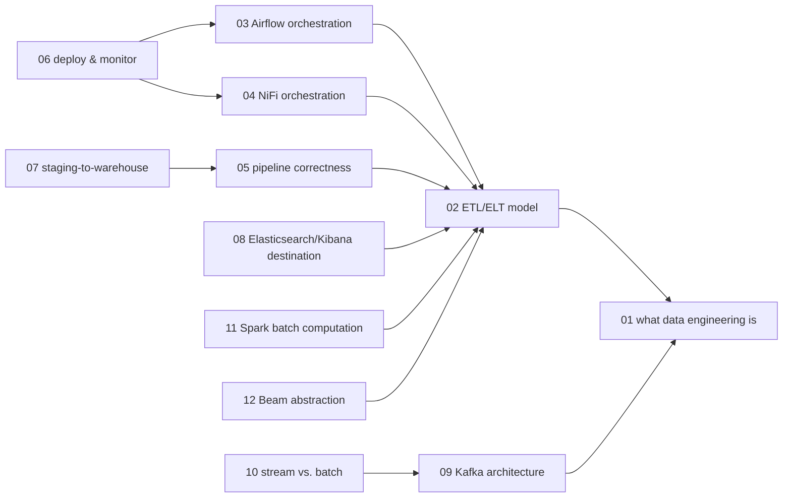

# Data engineering — knowledge graph

*The discipline of moving and transforming data reliably at production scale: the ETL/ELT
pipeline model, batch orchestration, visual dataflow tooling, streaming architectures, and
distributed batch computation — read against one practitioner's Python-and-open-source-tooling
book and one short course slide deck on Apache Beam, both of which sit closer to the edge of
their own currency than any other subject in this repository.*

**Nodes:** 13 · **Books:** 2 · **Currency researched:** 2026-08-06
**Requires:** [`09_sql`](../09_sql/00_knowledge_graph.md)
**Feeds:** [`12_bigquery`](../12_bigquery/00_knowledge_graph.md)

---

## §1 Source audit

| Book | Year | Documents | Verdict |
|---|---|---|---|
| Crickard, *Data Engineering with Python* | 2020 (Packt, October 23) | Pipeline fundamentals (NiFi, Airflow, Elasticsearch, Kibana, PostgreSQL), reading/writing/transforming files, production-pipeline practices (staging, validation, idempotency, atomicity), NiFi Registry version control, monitoring and deployment, Kafka streaming, Apache Spark batch processing, MiNiFi edge streaming | The strongest available source on pipeline *mechanics* — good on the ETL model, orchestration, and production correctness. Every named tool it teaches has had at least one major version change since publication: Airflow 3.0 (2025), NiFi 2.0, Kafka 4.0, Spark 4.x, and Elastic's licensing all moved after this book's single edition. It also never mentions Hadoop/MapReduce at all, already reflecting the 2020-era industry move away from that stack |
| Apache Beam course slide deck | undated (linked to `beam.apache.org/documentation/programming-guide/`) | Eleven title slides: Beam's batch-plus-streaming ("Batch + strEAM") unification thesis and five "Components" slides with no visible body text beyond the titles | Too thin to verify what its own "Components" slides taught beyond their headings; useful only as a pointer to the concept it names. Every specific API claim on this node had to be checked against Beam's current documentation directly rather than against this source |

---

## §2 Node index

| ID | Node | Type | Depth | Currency |
|---|---|---|---|---|
| `DE-01` | What data engineering is: the discipline, tools, and its boundary with data science | Practice | L3 | `current` |
| `DE-02` | The ETL/ELT pipeline model: extract, transform, load | Mechanism | L4 | `current` |
| `DE-03` | Batch orchestration with DAG-based schedulers (Airflow) | Tool | L4 | `stale-major` |
| `DE-04` | Visual dataflow orchestration (NiFi): processors, flowfiles, and the registry | Tool | L4 | `stale-major` |
| `DE-05` | Production pipeline correctness: staging, validation, idempotency, and atomicity | Practice | L5 | `stale-minor` |
| `DE-06` | Deploying and monitoring data pipelines | Practice | L4 | `current` |
| `DE-07` | Building an end-to-end production pipeline: staging to warehouse | Practice | L4 | `current` |
| `DE-08` | Search-and-analytics stores as a pipeline destination (Elasticsearch/Kibana) | Tool | L3 | `stale-major` |
| `DE-09` | The log as the unit of data: Kafka's architecture | Structure | L4 | `stale-major` |
| `DE-10` | Stream processing versus batch processing | Model | L4 | `current` |
| `DE-11` | Distributed batch computation with Apache Spark | Tool | L4 | `stale-minor` |
| `DE-12` | The unified batch/streaming pipeline abstraction (Apache Beam) | Model | L4 | `stale-minor` |
| `DE-13` | The modern data stack: dbt, the lakehouse pattern, and open table formats | Model | L4 | `absent` |

---

## §3 The graph

*`DE-13` (modern data stack) has no `requires`/`refines` edge and is omitted from this diagram;
see its node record for its `contrasts` relation to `DE-07`.*

---

## §4 Node records

### `DE-01` · What data engineering is: the discipline, tools, and its boundary with data science
**Type:** Practice · **Depth:** L3
**Covers:** data-engineer responsibilities and required skills, data engineering versus data science, the four tool categories the field spans (languages, databases, processing engines, pipeline orchestrators)
**Sources:** Crickard ch.1 (2020)
**Currency:** `current`

### `DE-02` · The ETL/ELT pipeline model: extract, transform, load
**Type:** Mechanism · **Depth:** L4
**Covers:** reading/writing CSV and JSON in Python and pandas, building a pipeline as a directed graph of transformations, inserting/extracting relational and document-store data programmatically, cleaning and enriching data with pandas (dropping/creating/modifying columns), the shift from ETL to ELT
**Sources:** Crickard ch.3–5 (2020)
**Edges:** `requires` [`DE-01`] · `contrasts` [`DE-10`]
**Currency:** `current`

### `DE-03` · Batch orchestration with DAG-based schedulers (Airflow)
**Type:** Tool · **Depth:** L4
**Covers:** DAG definition, operators and tasks, scheduling semantics, the Airflow boilerplate, running and backfilling a DAG
**Sources:** Crickard ch.2, ch.4 (2020)
**Edges:** `requires` [`DE-02`]
**Currency:** `stale-major`
**Δ current:** Crickard's book, published October 23, 2020, necessarily documents Airflow 1.x — Airflow 2.0, which shipped that December, introduced the TaskFlow API and a rewritten scheduler that the book could not cover. Airflow 3.0 reached general availability on April 22, 2025, adding a Task Execution API and Task SDK (AIP-72), scheduler-managed backfills (AIP-78), DAG Versioning (AIP-66) so that a running DAG's history stays tied to the code that produced it, a rewritten React-based UI, and a terminology change renaming "datasets" to "assets." An article on this node should teach the DAG-as-dependency-graph concept the book gets right and write its code examples against the current Task SDK rather than the book's classic-operator style.

### `DE-04` · Visual dataflow orchestration (NiFi): processors, flowfiles, and the registry
**Type:** Tool · **Depth:** L4
**Covers:** NiFi processor graphs, flowfile provenance, the NiFi Registry and git-persistence for pipeline version control, the NiFi variable registry, NiFi clustering, MiNiFi at the edge
**Sources:** Crickard ch.2, ch.8, ch.15, Appendix (2020)
**Edges:** `requires` [`DE-02`]
**Currency:** `stale-major`
**Δ current:** NiFi 2.0 raised the minimum Java version from 11 to 17, removed ZooKeeper from the cluster-coordination model the book's Appendix walks through, and added a Python API for writing processors alongside the book's Java-only extension model. More significantly, the NiFi Registry this node's version-control material centers — the book's whole ch.8 — was deprecated following a February 2026 community vote and is planned for removal in NiFi 3.0, with Git-based registry integration taking over that role. As of this research pass the current release is NiFi 2.10.0 (June 2026). An article on this node should teach the flowfile/processor mental model, which is unchanged, and route the versioning walkthrough through Git integration rather than the Registry the book documents.

### `DE-05` · Production pipeline correctness: staging, validation, idempotency, and atomicity
**Type:** Practice · **Depth:** L5
**Covers:** staging data before load, schema and data validation with Great Expectations, idempotent pipeline design, atomic pipeline design, backpressure
**Sources:** Crickard ch.7, ch.10 (2020)
**Edges:** `requires` [`DE-02`]
**Currency:** `stale-minor`
**Δ current:** Great Expectations, the validation tool this node's chapter builds around, has changed stewardship and API surface since 2020: as of May 2026 Fivetran became steward of the open-source GX Core project, which remains Apache 2.0-licensed and free, now at version 1.19.1 (July 2026); the expectation-suite configuration workflow the book walks through has continued to change release over release even as the underlying validation concept — declare what "good data" means, check it before it moves downstream — is unaffected. The staging/idempotency/atomicity principles this node covers do not depend on which validation library implements them.

### `DE-06` · Deploying and monitoring data pipelines
**Type:** Practice · **Depth:** L4
**Covers:** monitoring via a tool's status bar and processor-level metrics, driving orchestration tooling through its REST API, deployment strategies ranging from a single shared instance to multiple versioned registries, finalizing a pipeline for production
**Sources:** Crickard ch.9–10 (2020)
**Edges:** `requires` [`DE-03`, `DE-04`]
**Currency:** `current`

### `DE-07` · Building an end-to-end production pipeline: staging to warehouse
**Type:** Practice · **Depth:** L4
**Covers:** separating test and production environments, populating and scanning a data lake, a staging database, validating staged data before promotion, inserting into a warehouse table
**Sources:** Crickard ch.6, ch.11 (2020)
**Edges:** `requires` [`DE-05`] · `contrasts` [`SQL-17`, `DE-13`]
**Currency:** `current`

### `DE-08` · Search-and-analytics stores as a pipeline destination (Elasticsearch/Kibana)
**Type:** Tool · **Depth:** L3
**Covers:** indexing pipeline output into Elasticsearch, building Kibana visualizations and dashboards from indexed data, the search-engine-as-analytics-sink pattern
**Sources:** Crickard ch.2, ch.4, ch.6 (2020)
**Edges:** `requires` [`DE-02`]
**Currency:** `stale-major`
**Δ current:** Crickard's book uses Elasticsearch and Kibana under the Apache 2.0 license current at the time. With the 7.11 release in January 2021, Elastic relicensed both projects' source to a dual SSPL/Elastic License model in a dispute with AWS over its managed-service offering, removing the Apache 2.0 option entirely; in September 2024 Elastic added the OSI-approved AGPLv3 as a third licensing choice without withdrawing the other two. A pipeline built against this destination today is choosing among three license terms the book's single edition never needed to weigh.

### `DE-09` · The log as the unit of data: Kafka's architecture
**Type:** Structure · **Depth:** L4
**Covers:** the commit-log abstraction, topics and partitions, producers and consumers, a ZooKeeper-coordinated cluster setup, testing a cluster with messages
**Sources:** Crickard ch.12–13 (2020)
**Edges:** `requires` [`DE-01`]
**Currency:** `stale-major`
**Δ current:** The book's cluster-setup chapter coordinates Kafka through ZooKeeper, which was the only supported mode in 2020. KRaft (Kafka Raft), Kafka's own Raft-based metadata layer, reached production readiness in Kafka 3.7 and was refined through 3.9; Apache Kafka 4.0, released March 18, 2025, removed ZooKeeper mode entirely, making KRaft the only way to run a cluster. The commit-log abstraction, topic/partition model, and producer/consumer API this node otherwise covers are unaffected — only the cluster-coordination layer the book's setup chapter walks through has changed.

### `DE-10` · Stream processing versus batch processing
**Type:** Model · **Depth:** L4
**Covers:** differentiating stream semantics from batch semantics, producing and consuming with Python, combining Kafka and NiFi in one pipeline, real-time edge data with MiNiFi
**Sources:** Crickard ch.13, ch.15 (2020)
**Edges:** `requires` [`DE-09`, `DS-07`] · `contrasts` [`DE-02`]
**Currency:** `current`

### `DE-11` · Distributed batch computation with Apache Spark
**Type:** Tool · **Depth:** L4
**Covers:** installing and configuring PySpark, the RDD/DataFrame processing model, using Spark for data-engineering workloads
**Sources:** Crickard ch.14 (2020)
**Edges:** `requires` [`DE-02`] · `contrasts` [`STAT-21`]
**Currency:** `stale-minor`
**Δ current:** Crickard's chapter teaches Spark's 2.x/3.0-era DataFrame API — Spark 3.0 shipped in June 2020, four months before the book. Apache Spark reached version 4.0 in 2025, and the current release as of this research pass is 4.2.0 (July 2026); Spark Connect, a decoupled client/server architecture first shipped in Spark 3.4 (2023), reached near-complete feature parity with classic execution mode in Spark 4.0. The DataFrame-first programming model the book teaches is unchanged; the thin-client deployment architecture Spark Connect enables is not something the book anticipates.

### `DE-12` · The unified batch/streaming pipeline abstraction (Apache Beam)
**Type:** Model · **Depth:** L4
**Covers:** the PCollection/PTransform/Pipeline/Runner abstraction, portability across execution engines, Beam's "Batch + strEAM" unification thesis
**Sources:** Apache Beam course slide deck, undated
**Edges:** `requires` [`DE-02`] · `contrasts` [`BQ-10`]
**Currency:** `stale-minor`
**Δ current:** This subject's own source for Beam is an eleven-slide course outline that names the unification thesis and lists five "Components" slides with no visible body text beyond their titles, so this record cannot verify what those slides actually taught beyond the headings — per this repository's honesty rule, that gap is stated rather than papered over. What is independently checkable is Beam's current state: the Python and Java SDKs are both at version 2.75.0 as of this research pass, and the project ships minor releases on a six-week cadence, so any version-specific API detail the deck might once have shown is very likely superseded regardless of the deck's own age. An article on this node should be written directly against Beam's current programming guide rather than reconstructed from this source.

### `DE-13` · The modern data stack: dbt, the lakehouse pattern, and open table formats
**Type:** Model · **Depth:** L4
**Covers:** transformation-layer tools that compile declarative models to SQL, the lakehouse pattern combining data-lake storage with warehouse-style transactions, open table formats
**Sources:** —
**Edges:** `contrasts` [`DE-07`]
**Currency:** `absent`
**Δ current:** Neither book in this subject covers dbt, the lakehouse architecture, or open table formats. Crickard's 2020 warehouse chapter (`DE-07`) routes staging and validation through hand-written Python and SQL rather than a dedicated transformation-layer tool, and predates the pattern's mainstream adoption. Apache Iceberg and Delta Lake — the latter originated at Databricks — are described by 2024–2025 industry coverage as the de facto standard open table formats underpinning lakehouse architectures that pair data-lake storage with warehouse-style transactions and governance, with 2024 commentary specifically describing broad convergence on Iceberg. dbt plays the transformation-and-testing role this subject's `DE-05` covers with hand-rolled Great Expectations checks instead. This node is declared without page sources because it postdates every book in `_toc/`; an article here would need to be written from current vendor and project documentation directly rather than from either book on this shelf.

---

## §5 Cross-subject edges

| From | Edge | To | Why |
|---|---|---|---|
| `DE-07` | `contrasts` | `SQL-17` | The book's hand-rolled staging-to-warehouse pipeline compared against dimensional-modeling theory for the schema it loads into |
| `DE-10` | `requires` | `DS-07` | Windowed stream-aggregation implementations rely on the approximate/streaming algorithms `20_datascience` covers |
| `DE-11` | `contrasts` | `STAT-21` | Spark as the practical successor to the Hadoop-ecosystem/in-database analytics tooling `19_data_analysis` documents |
| `DE-12` | `contrasts` | `BQ-10` | Beam's portable pipeline abstraction compared against BigQuery's own batch/Storage-Write-API/streaming ingestion mechanisms, which Beam pipelines commonly write into via a managed Dataflow runner |

*Reciprocals for the `DE-10`-to-`DS-07` and `DE-11`-to-`STAT-21` edges are recorded in
`20_datascience`'s and `19_data_analysis`'s §5 respectively, since both of those subjects are
also part of this build.
The `SQL-17` and `BQ-10` edges point outside this build's five subjects; report that `SQL-17`
should carry a matching `contrasts [DE-07]` entry and `BQ-10` a matching `contrasts [DE-12]`
entry when `09_sql` and `12_bigquery` are next revised.*

---

## §6 Coverage gaps

Nothing in this subject's own books covers Kafka's place in a Confluent-style "event bus" the way `18_eventbus` would, since that subject has not been built yet in this repository as of this pass; once it exists, `DE-09` and `DE-10` should each carry a `contrasts` edge into it rather than treating Kafka only as this subject's own streaming source. Nothing here covers infrastructure-as-code for provisioning the tools this subject teaches (Terraform, or cloud-native managed equivalents such as MWAA or Cloud Composer for Airflow); the book deploys everything by hand, which is pedagogically reasonable but leaves a gap between what is taught and what a production team actually runs. Nothing here covers data contracts or schema-registry-enforced compatibility as a discipline distinct from the ad hoc validation `DE-05` covers; Confluent's Schema Registry documentation or a dedicated data-contracts text would close that gap. Finally, `DE-13`'s modern-data-stack node is deliberately thin — it names the pattern and its checkable artefacts but does not attempt the depth an eventual article would need; a current edition of a dbt- or Iceberg-focused book would be the natural source once one is added to this subject's shelf.

---

← [repo index](../README.md) · [root graph](../KNOWLEDGE_GRAPH.md) · [writing contract](../AGENTS.md)
