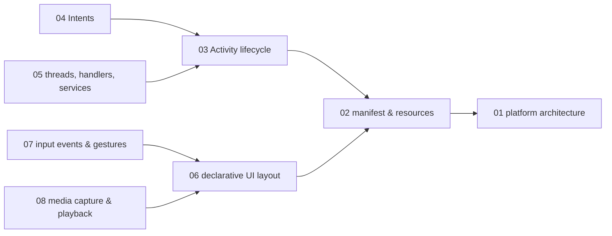
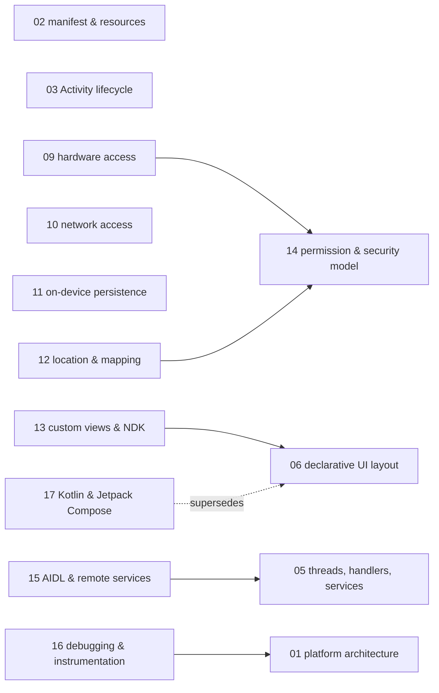

# Android — knowledge graph

*Native Android application development at the platform-mechanism level: the component model
(activities, intents, services), the View-based UI and event system, hardware and storage
access, and the permission/IPC model underneath it — read against a 2011 cookbook that predates
Android Studio, Kotlin, and Jetpack Compose by several years each, so that every node states
plainly what still holds and what the platform has since replaced outright.*

**Nodes:** 17 · **Books:** 1 · **Currency researched:** 2026-08-06
**Requires:** [`01_computation`](../01_computation/00_knowledge_graph.md)
**Feeds:** —

---

## §1 Source audit

| Book | Year | Documents | Verdict |
|---|---|---|---|
| Steele & To, *The Android Developer's Cookbook* | 2011 (Addison-Wesley, 1st edition) | The Android stack and Market, activities/intents and the lifecycle, threads/services/receivers/widgets, View-based UI layout, input events and gestures, multimedia, hardware access (camera/sensors/telephony/Bluetooth), networking (SMS/HTTP/Twitter), on-device storage (preferences/SQLite/content providers), location and Maps, custom views/NDK/security/AIDL/backup/animation, Eclipse-based debugging | Solid on component-model mechanics (the activity lifecycle, intents, services) that changed comparatively little at the API-contract level. Everything toolchain-specific — the Eclipse+ADT project structure, the Debug tooling, the "Android Market" branding — targets a development environment Google replaced in December 2014 and formally deprecated the year after. The book predates Kotlin's existence entirely and predates Jetpack Compose by a decade |

---

## §2 Node index

| ID | Node | Type | Depth | Currency |
|---|---|---|---|---|
| `AND-01` | The Android platform: architecture, versioning, and device fragmentation | Structure | L3 | `stale-major` |
| `AND-02` | The application package: manifest, resources, and project structure | Structure | L3 | `stale-major` |
| `AND-03` | The Activity lifecycle and task/back-stack model | Mechanism | L4 | `stale-minor` |
| `AND-04` | Intents: dispatch and inter-component communication | Mechanism | L4 | `stale-minor` |
| `AND-05` | Background execution: threads, handlers, and services | Mechanism | L4 | `current` |
| `AND-06` | Declarative UI layout: views, view groups, and the resource system | Structure | L3 | `stale-major` |
| `AND-07` | Input handling: events, gestures, and menus | Mechanism | L3 | `current` |
| `AND-08` | Media capture and playback | Mechanism | L3 | `current` |
| `AND-09` | Device hardware access: camera, sensors, telephony, and Bluetooth | Mechanism | L4 | `current` |
| `AND-10` | Network access: HTTP clients and third-party APIs | Mechanism | L3 | `stale-minor` |
| `AND-11` | On-device persistence: preferences, SQLite, and content providers | Structure | L4 | `stale-major` |
| `AND-12` | Location and mapping services | Mechanism | L3 | `current` |
| `AND-13` | Custom views and native (NDK) components | Mechanism | L4 | `current` |
| `AND-14` | The Android permission and security model | Model | L4 | `current` |
| `AND-15` | Inter-process communication: AIDL and remote services | Mechanism | L4 | `current` |
| `AND-16` | Debugging and instrumentation tooling | Tool | L3 | `stale-major` |
| `AND-17` | Kotlin and Jetpack Compose: the current Android language and UI toolkit | Model | L4 | `absent` |

---

## §3 The graph

Seventeen nodes exceed the diagram cap, so the graph splits into two clusters by `requires` and
`supersedes` edges only; `contrasts` relations are listed in the node records and §5 instead.

### Component model and UI

### Hardware, storage, security, and the current toolkit

---

## §4 Node records

### `AND-01` · The Android platform: architecture, versioning, and device fragmentation
**Type:** Structure · **Depth:** L3
**Covers:** the Android software stack, API levels and version fragmentation, device and hardware variation (screens, input methods, sensors), forward-compatibility strategy, distribution and monetization
**Sources:** Steele & To ch.1 (2011)
**Currency:** `stale-major`
**Δ current:** The book documents the Android Market, which Google renamed Google Play on March 6, 2012, folding app, music, movie, and book distribution under one brand. More significantly, the book assumes the Eclipse+ADT development environment that was the only supported toolchain in 2011; Android Studio 1.0 shipped as the official IDE in December 2014, Eclipse ADT was formally deprecated the same month with a final release in December 2015, and Google removed Eclipse-targeted SDK assets from its tooling pipeline by 2017. The platform concepts this node covers — API levels, device fragmentation, forward compatibility — remain accurate in shape; every toolchain-specific instruction elsewhere in the book targets an IDE no longer supported.

### `AND-02` · The application package: manifest, resources, and project structure
**Type:** Structure · **Depth:** L3
**Covers:** the AndroidManifest.xml, the R resource-generation system, package and directory conventions, resource qualifiers for alternate resources
**Sources:** Steele & To ch.2, ch.4 (2011)
**Edges:** `requires` [`AND-01`]
**Currency:** `stale-major`
**Δ current:** The book's project layout is Eclipse-project-specific. Android Studio's Gradle-based module structure — a `build.gradle` file per module, distinct `main`/`test`/`androidTest` source sets — reorganized where these files live and how a project is assembled, without changing the manifest's XML schema or the resource-qualifier mechanism itself. An article on this node should teach the manifest and resource system directly against a current Gradle-based project layout rather than the book's Eclipse structure.

### `AND-03` · The Activity lifecycle and task/back-stack model
**Type:** Mechanism · **Depth:** L4
**Covers:** the onCreate/onPause/onResume callback sequence and the full lifecycle, saving and restoring instance state, launch modes and single-task behavior, configuration changes on screen rotation
**Sources:** Steele & To ch.2 (2011)
**Edges:** `requires` [`AND-02`]
**Currency:** `stale-minor`
**Δ current:** The lifecycle callback sequence this node covers is essentially unchanged since 2011; what has moved is the surrounding API for reacting to it, and that shift is addressed on `AND-04`, whose "launching an activity for a result" recipe is exactly what the current Activity Result API replaced.

### `AND-04` · Intents: dispatch and inter-component communication
**Type:** Mechanism · **Depth:** L4
**Covers:** launching an activity for a result, implicit intent resolution, passing primitive and structured data between components, intent filters
**Sources:** Steele & To ch.2 (2011)
**Edges:** `requires` [`AND-03`]
**Currency:** `stale-minor`
**Δ current:** The book's "Launching an Activity for a Result" recipe uses `startActivityForResult`/`onActivityResult`, which AndroidX's Activity Result APIs — introduced in AndroidX Activity 1.2.0-alpha02 — are now the recommended replacement for. The older pattern required matching a numeric request code by hand across two separate methods and lost pending results if the component was recreated; `registerForActivityResult` replaces both problems with a typed callback registered at the point of launch. Implicit-intent resolution and structured-data passing between components are otherwise unchanged.

### `AND-05` · Background execution: threads, handlers, and services
**Type:** Mechanism · **Depth:** L4
**Covers:** secondary threads and the main-thread UI constraint, Handler-based message passing, thread priority and cancellation, started and bound Services, BroadcastReceivers, App Widgets, user-facing alerts (Toast, dialogs, notifications)
**Sources:** Steele & To ch.3 (2011)
**Edges:** `requires` [`AND-03`] · `contrasts` [`CONC-02`]
**Currency:** `current`

### `AND-06` · Declarative UI layout: views, view groups, and the resource system
**Type:** Structure · **Depth:** L3
**Covers:** the View/ViewGroup hierarchy, layout managers (relative, linear, table), programmatic versus XML layout declaration, text views and form input, buttons/checkboxes/radio buttons/spinners/progress and seek bars
**Sources:** Steele & To ch.4 (2011)
**Edges:** `requires` [`AND-02`, `APPD-05`]
**Currency:** `stale-major`
**Δ current:** This node's imperative, `findViewById`-and-mutate approach to UI is the pattern Jetpack Compose was built to replace; see `AND-17` for the current declarative alternative, which `supersedes` this node as Google's recommended approach rather than merely extending it.

### `AND-07` · Input handling: events, gestures, and menus
**Type:** Mechanism · **Depth:** L3
**Covers:** key-event interception, menu construction in code and XML, touch-event handling, fling-gesture detection, multitouch, the gesture library, 3D/OpenGL-based drawing
**Sources:** Steele & To ch.5 (2011)
**Edges:** `requires` [`AND-06`] · `contrasts` [`APPD-06`]
**Currency:** `current`

### `AND-08` · Media capture and playback
**Type:** Mechanism · **Depth:** L3
**Covers:** image loading and manipulation, audio playback/recording/raw audio manipulation, sound-resource management, video playback
**Sources:** Steele & To ch.6 (2011)
**Edges:** `requires` [`AND-06`]
**Currency:** `current`

### `AND-09` · Device hardware access: camera, sensors, telephony, and Bluetooth
**Type:** Mechanism · **Depth:** L4
**Covers:** camera customization, motion/temperature/light sensors, the TelephonyManager and phone-state listening, Bluetooth discovery/pairing/sockets, device vibration
**Sources:** Steele & To ch.7 (2011)
**Edges:** `requires` [`AND-14`]
**Currency:** `current`

### `AND-10` · Network access: HTTP clients and third-party APIs
**Type:** Mechanism · **Depth:** L3
**Covers:** SMS send/receive, embedding a WebView, issuing HTTP GET/POST from an app, OAuth-based third-party API integration
**Sources:** Steele & To ch.8 (2011)
**Edges:** `contrasts` [`HTTP-02`]
**Currency:** `stale-minor`
**Δ current:** The book issues raw HTTP requests directly against `HttpURLConnection`-era APIs and integrates Twitter's API using the credentials flow current in 2011; both the recommended HTTP client (community libraries such as OkHttp/Retrofit have been the practical default for years) and Twitter's own API terms have changed substantially since. The underlying request/response mechanics this node's HTTP recipes rely on are `13_http`'s concern, not this subject's, hence the `contrasts` rather than `requires` relation.

### `AND-11` · On-device persistence: preferences, SQLite, and content providers
**Type:** Structure · **Depth:** L4
**Covers:** SharedPreferences and the Preferences framework, an embedded SQLite database accessed through a hand-written DAO-style package, a custom ContentProvider implementation, raw file save and load
**Sources:** Steele & To ch.9 (2011)
**Edges:** `contrasts` [`SQL-01`]
**Currency:** `stale-major`
**Δ current:** The book accesses SQLite directly through `SQLiteOpenHelper` and hand-written query strings. Room, part of Android Jetpack, is now Google's recommended persistence layer over raw SQLite access: it verifies `@Query` and `@Entity` annotations at compile time (catching malformed SQL before runtime rather than at the point of failure the book's approach risks), removes most of the DAO boilerplate the book writes by hand, and integrates with coroutines and observable data holders the book's threading model does not use. The relational data model underneath is unchanged; the recommended access layer above it is not.

### `AND-12` · Location and mapping services
**Type:** Mechanism · **Depth:** L3
**Covers:** the LocationManager and provider selection, geocoding and reverse geocoding, integrating Google Maps, map markers and overlays, proximity alerts
**Sources:** Steele & To ch.10 (2011)
**Edges:** `requires` [`AND-14`]
**Currency:** `current`

### `AND-13` · Custom views and native (NDK) components
**Type:** Mechanism · **Depth:** L4
**Covers:** extending View to draw custom UI, the Android NDK and the JNI boundary for native components
**Sources:** Steele & To ch.11 (2011)
**Edges:** `requires` [`AND-06`]
**Currency:** `current`

### `AND-14` · The Android permission and security model
**Type:** Model · **Depth:** L4
**Covers:** declaring and enforcing permissions, protection levels, the sandboxed per-app UID model
**Sources:** Steele & To ch.11 (2011)
**Currency:** `current`

### `AND-15` · Inter-process communication: AIDL and remote services
**Type:** Mechanism · **Depth:** L4
**Covers:** defining a remote interface with AIDL, binding to a remote service, marshaling data across the process boundary
**Sources:** Steele & To ch.11 (2011)
**Edges:** `requires` [`AND-05`] · `contrasts` [`OS-05`]
**Currency:** `current`

### `AND-16` · Debugging and instrumentation tooling
**Type:** Tool · **Depth:** L3
**Covers:** IDE-integrated breakpoint debugging, ADB, Logcat, the Hierarchy Viewer, TraceView, native GDB debugging
**Sources:** Steele & To ch.12 (2011)
**Edges:** `requires` [`AND-01`]
**Currency:** `stale-major`
**Δ current:** ADB and Logcat are still current, but the book's Eclipse-specific tools — its built-in debug configuration, the standalone Hierarchy Viewer, and TraceView — were Eclipse-era instruments Android Studio replaced with its own integrated Profiler (CPU, memory, network, and energy inspection in one view) and Layout Inspector. The command-line primitives (ADB, Logcat) transferred forward unchanged; the graphical tooling built on top of them did not.

### `AND-17` · Kotlin and Jetpack Compose: the current Android language and UI toolkit
**Type:** Model · **Depth:** L4
**Covers:** Kotlin as Google's recommended application language, Jetpack Compose's declarative UI model, state hoisting and recomposition, interoperability with the View-based system this subject's other nodes teach
**Sources:** —
**Edges:** `supersedes` [`AND-06`]
**Currency:** `absent`
**Δ current:** Neither this book's language (Java) nor its UI toolkit (XML-declared Views laid out programmatically or in markup, `AND-06`) reflects current guidance. Google announced Kotlin as its recommended language for Android development at I/O 2019, and Jetpack Compose — a declarative UI toolkit co-developed with JetBrains that works exclusively with Kotlin — reached 1.0 general availability on July 28, 2021; Android's own developer documentation now describes Compose as the recommended standard for new UI, with Google's own sample apps and guides written Compose-first. Compose's recomposition model, in which a function is re-invoked when the state it reads changes, replaces the book's imperative `findViewById`-and-mutate pattern with a different mental model rather than new syntax for the same one. This node is declared without a source in `_toc/` because it postdates the book entirely; an article here would be written from current Android developer documentation.

---

## §5 Cross-subject edges

| From | Edge | To | Why |
|---|---|---|---|
| `AND-05` | `contrasts` | `CONC-02` | Android's Handler/thread/Service model compared against general-purpose thread and race-condition mechanics |
| `AND-06` | `requires` | `APPD-05` | Implementing a screen's declarative layout presupposes a completed prototype from the design process |
| `AND-07` | `contrasts` | `APPD-06` | Android's touch/gesture event handling compared against Apple's tap-target and event-driven interaction design guidance |
| `AND-10` | `contrasts` | `HTTP-02` | An app's HTTP client usage compared against the request/response protocol mechanics it sits on top of |
| `AND-11` | `contrasts` | `SQL-01` | Android's embedded, single-app SQLite usage compared against the general relational model it is a lightweight application of |
| `AND-15` | `contrasts` | `OS-05` | AIDL-based Android IPC compared against general-purpose interprocess communication mechanisms |

*The `APPD-05` and `APPD-06` reciprocals are recorded in `23_app_dev`'s §5, since that subject is
also part of this build. Report that `CONC-02`, `HTTP-02`, `SQL-01`, and `OS-05` should each carry
a matching `contrasts [AND-*]` entry when `06_concurrency`, `13_http`, `09_sql`, and `02_os` are
next revised.*

---

## §6 Coverage gaps

Nothing here covers Android's current architecture guidance — ViewModel, the Repository pattern, unidirectional data flow, or the Navigation component — since none of it existed when this book was written; Android's own Architecture Components documentation, introduced from 2017 onward, would be the source for a properly current treatment, and it would sit naturally alongside `AND-17`. Nothing here covers WorkManager as the current recommendation for deferrable background work, which has displaced much of what `AND-05`'s Service-based examples do for that use case. Nothing here covers app distribution and release management as it works today — Android App Bundles, Play Console staged rollouts, or Play Integrity — since the book's Market-era publishing chapter predates all of it. Finally, this subject has no coverage of Kotlin Multiplatform or Compose Multiplatform, both of which extend the `AND-17` toolkit beyond Android proper; that is arguably out of this subject's scope entirely rather than a gap in it, and is noted here only so the omission is deliberate rather than accidental.

---

← [repo index](../README.md) · [root graph](../KNOWLEDGE_GRAPH.md) · [writing contract](../AGENTS.md)
