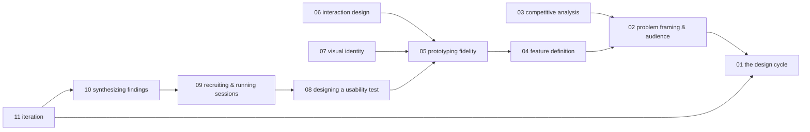

# App design — knowledge graph

*The design methodology underneath building an application, extracted from a workbook rather
than a technical text: problem framing and audience definition, prototyping at increasing
fidelity, usability testing protocol, and the iteration loop that routes findings back to the
phase they belong to — read against Apple's own guided design-cycle curriculum rather than its
slide-by-slide template structure.*

**Nodes:** 12 · **Books:** 1 · **Currency researched:** 2026-08-06
**Requires:** —
**Feeds:** [`22_android`](../22_android/00_knowledge_graph.md)

---

## §1 Source audit

| Book | Year | Documents | Verdict |
|---|---|---|---|
| Apple, *Develop in Swift App Design Workbook* | 2021 (May) | A four-phase design cycle (Define, Prototype, Test, Validate/Iterate); problem framing, audience research, and competitive analysis; screen outlining, grouping, linking, and interface-element addition; visual identity (personality, color, icon); usability-test design, recruiting, and session protocol; synthesizing findings and routing them back into an earlier phase; paired Swift Playgrounds/SwiftUI coding exercises alongside each design phase | This is a design workbook, not a technical reference — its "chapters" are slide-deck exercises and fill-in templates rather than expository prose, so the nodes below extract the design-methodology mechanism underneath the template rather than re-indexing its slide structure. As of this research pass it remains Apple's current published resource at this URL, so its being superseded is not something this record can claim; what has changed is the visual language and tooling ecosystem around it, documented node by node below |

---

## §2 Node index

| ID | Node | Type | Depth | Currency |
|---|---|---|---|---|
| `APPD-01` | The app design cycle: Define, Prototype, Test, Validate, Iterate | Practice | L3 | `current` |
| `APPD-02` | Problem framing and audience definition | Practice | L3 | `current` |
| `APPD-03` | Competitive and comparative analysis | Practice | L3 | `current` |
| `APPD-04` | Feature definition and describing key functions | Practice | L3 | `current` |
| `APPD-05` | Prototyping fidelity: from screen outlines to interactive mockups | Practice | L4 | `stale-minor` |
| `APPD-06` | Interaction design: tap targets and event-driven interface behavior | Practice | L4 | `current` |
| `APPD-07` | Visual identity: personality, color, iconography, and imagery | Practice | L3 | `stale-major` |
| `APPD-08` | Designing a usability test: journeys, scripts, and protocol | Practice | L4 | `current` |
| `APPD-09` | Recruiting and running usability sessions | Practice | L3 | `current` |
| `APPD-10` | Synthesizing usability findings: notes, insights, and conclusions | Practice | L4 | `current` |
| `APPD-11` | Iteration: routing findings back into Define, Prototype, or Test | Practice | L4 | `current` |
| `APPD-12` | Pairing interface code with design: the workbook's Swift/SwiftUI exercises | Practice | L3 | `stale-minor` |

---

## §3 The graph

*`APPD-12` (pairing interface code with design) has no `requires`/`refines` edge and is omitted
from this diagram; see its node record for its `contrasts` relation to `APPD-05`.*

---

## §4 Node records

### `APPD-01` · The app design cycle: Define, Prototype, Test, Validate, Iterate
**Type:** Practice · **Depth:** L3
**Covers:** the four-phase design cycle as a loop rather than a line, the workbook's "go back" mechanism for returning to an earlier phase once new evidence arrives, how the cycle differs from a single linear pass through requirements-then-build-then-ship
**Sources:** Apple, *App Design Workbook*, "App Design Cycle" (2021)
**Currency:** `current`

### `APPD-02` · Problem framing and audience definition
**Type:** Practice · **Depth:** L3
**Covers:** articulating the question a user or organization asks often, exploring who the user is, considering diversity across the intended audience, summarizing the audience's most important concern, analyzing the root causes behind a stated problem
**Sources:** Apple, *App Design Workbook*, "Define" sections (2021)
**Edges:** `requires` [`APPD-01`]
**Currency:** `current`

### `APPD-03` · Competitive and comparative analysis
**Type:** Practice · **Depth:** L3
**Covers:** evaluating existing apps that address a similar problem, articulating how a new app will differ, using what a user likes and dislikes about comparable apps to sharpen scope
**Sources:** Apple, *App Design Workbook*, "Analyse Causes" (2021)
**Edges:** `requires` [`APPD-02`]
**Currency:** `current`

### `APPD-04` · Feature definition and describing key functions
**Type:** Practice · **Depth:** L3
**Covers:** narrowing a broad problem to a specific feature set, describing what each feature does for the user in plain language, naming the data types and relationships a feature implies as a design artifact rather than only a coding step
**Sources:** Apple, *App Design Workbook*, "Define Features" (2021)
**Edges:** `requires` [`APPD-02`]
**Currency:** `current`

### `APPD-05` · Prototyping fidelity: from screen outlines to interactive mockups
**Type:** Practice · **Depth:** L4
**Covers:** outlining screens before building them, grouping and ordering screens, linking screens into a navigable flow, adding interface elements to a prototype, composing and aligning views, the deliberate progression from a rough screen outline to a clickable or interactive mockup
**Sources:** Apple, *App Design Workbook*, "Prototype" sections (2021)
**Edges:** `requires` [`APPD-04`] · `contrasts` [`APPD-12`]
**Currency:** `stale-minor`
**Δ current:** The workbook's own mockup stage uses Keynote (its opening "Keynote Basics" section) before the paired Swift Playgrounds exercises build an interactive version. Industry practice for the mockup stage has consolidated heavily onto Figma since 2021 — 2026 tracking of primary design-tool usage puts Figma's share above 80% among UI/UX designers, up from a 2017 baseline where Sketch led — and SwiftUI's own Xcode Previews, introduced alongside SwiftUI at WWDC 2019, is now a more common bridge from a mockup to running code than a separate Swift Playground. The fidelity ladder itself — outline, then linked screens, then interactive states — is unaffected by which specific tool implements each rung.

### `APPD-06` · Interaction design: tap targets and event-driven interface behavior
**Type:** Practice · **Depth:** L4
**Covers:** sizing and placing controls for reliable touch interaction, event-based programming as a design concern (what visibly happens when a control is tapped), state that changes visibly in response to user action
**Sources:** Apple, *App Design Workbook*, "Tap Targets", "Event-Based Programming" (2021)
**Edges:** `requires` [`APPD-05`] · `contrasts` [`AND-07`]
**Currency:** `current`

### `APPD-07` · Visual identity: personality, color, iconography, and imagery
**Type:** Practice · **Depth:** L3
**Covers:** defining an app's personality, choosing a primary color and icon set, selecting imagery consistent with that personality, applying the identity system across screens
**Sources:** Apple, *App Design Workbook*, "Weight and Balance", "Icon" (2021)
**Edges:** `requires` [`APPD-05`]
**Currency:** `stale-major`
**Δ current:** The workbook's icon/color/imagery guidance predates Apple's most significant visual overhaul since iOS 7: the "Liquid Glass" design language announced at WWDC 2025 and shipped across iOS 26, iPadOS 26, and macOS Tahoe 26, which introduces translucent, refracting materials as a system-wide default and revised icon-composition rules. Apple republished its design resources — including app-icon templates — for iOS 26 following that announcement. An article on this node should teach the workbook's underlying exercise (choose a personality, express it consistently across the app) and treat the specific visual vocabulary in use at any given time as something to check against the current Human Interface Guidelines rather than against this workbook.

### `APPD-08` · Designing a usability test: journeys, scripts, and protocol
**Type:** Practice · **Depth:** L4
**Covers:** defining what a test should reveal, creating representative user journeys, defining a testing process, writing a facilitation script, planning for what happens when a tester gets stuck
**Sources:** Apple, *App Design Workbook*, "Test" sections (2021)
**Edges:** `requires` [`APPD-05`]
**Currency:** `current`

### `APPD-09` · Recruiting and running usability sessions
**Type:** Practice · **Depth:** L3
**Covers:** gathering a representative set of participants, session logistics (participant, date, location), a final check before a session begins, moderating without leading the participant
**Sources:** Apple, *App Design Workbook*, "Gather Users", "Last Check" (2021)
**Edges:** `requires` [`APPD-08`]
**Currency:** `current`

### `APPD-10` · Synthesizing usability findings: notes, insights, and conclusions
**Type:** Practice · **Depth:** L4
**Covers:** gathering raw observation notes, forming key insights from patterns across sessions, drawing conclusions specific enough to act on, tying a conclusion back to the task that was actually tested
**Sources:** Apple, *App Design Workbook*, "Validate" sections (2021)
**Edges:** `requires` [`APPD-09`]
**Currency:** `current`

### `APPD-11` · Iteration: routing findings back into Define, Prototype, or Test
**Type:** Practice · **Depth:** L4
**Covers:** recognizing which phase a finding actually belongs to, revisiting audience or problem framing versus revisiting the prototype versus revisiting the test design itself, the workbook's explicit branching rule for where to return to
**Sources:** Apple, *App Design Workbook*, "Iterate" sections (2021)
**Edges:** `requires` [`APPD-10`, `APPD-01`]
**Currency:** `current`

### `APPD-12` · Pairing interface code with design: the workbook's Swift/SwiftUI exercises
**Type:** Practice · **Depth:** L3
**Covers:** Swift Playgrounds as the bridge from prototype to running code, structs as both a data model and a design-communication artifact, the workbook's choice to teach interface code alongside each design phase rather than after design is complete
**Sources:** Apple, *App Design Workbook*, "Explore Code" sections throughout (2021)
**Edges:** `contrasts` [`APPD-05`]
**Currency:** `stale-minor`
**Δ current:** The workbook already teaches SwiftUI — VStack composition, structs, event-driven button state — rather than UIKit, so its code samples are not stale in the way a storyboard-based tutorial from the same period would be. SwiftUI itself has moved forward since the workbook's 2021 date, most notably gaining the Observation framework's `@Observable` macro at WWDC 2023 (Swift 5.9), which replaced `ObservableObject`/`@Published` as the recommended way to model view state that a view needs to react to. The workbook's simple `@State`-only examples do not need to anticipate that change, but an article on this node should mention it as the current default for anything beyond local view state.

---

## §5 Cross-subject edges

| From | Edge | To | Why |
|---|---|---|---|
| `AND-06` | `requires` | `APPD-05` | Implementing a screen's declarative layout in `22_android` presupposes a completed prototype from this subject's design process |
| `AND-07` | `contrasts` | `APPD-06` | Android's touch/gesture event handling compared against this subject's tap-target and event-driven interaction design guidance |
| `APPD-06` | `contrasts` | `AND-07` | Reciprocal of the above, declared in `APPD-06`'s own node record |

*The first two edges above originate in `22_android`'s node records; they are repeated here per
KG_SPEC §8 since this subject is also part of this build.*

---

## §6 Coverage gaps

Nothing here covers accessibility as a first-class design concern — VoiceOver, Dynamic Type, or contrast requirements — even though Apple's own current Human Interface Guidelines treat it as load-bearing rather than optional; the workbook's audience-diversity exercise (`APPD-02`) gestures at this without naming it directly, and a current HIG accessibility chapter would close the gap properly. Nothing here covers design systems or component libraries as a distinct practice from the workbook's per-app visual-identity exercise (`APPD-07`); Apple's own Figma UI kit, now described as the component baseline for design work built on the HIG, would be the natural current source. Nothing here covers remote or unmoderated usability testing, which the workbook's session-logistics guidance (`APPD-09`) assumes happens in person; that gap matters more now than in 2021 given how much usability research runs asynchronously. Finally, this subject has no coverage of platforms other than Apple's own — the design-cycle mechanism in `APPD-01` through `APPD-11` is platform-agnostic by construction and is declared to feed `22_android` on that basis, but nothing here addresses where Android's Material Design guidance diverges from the Human Interface Guidelines' specific visual and interaction conventions.

---

← [repo index](../README.md) · [root graph](../KNOWLEDGE_GRAPH.md) · [writing contract](../AGENTS.md)
