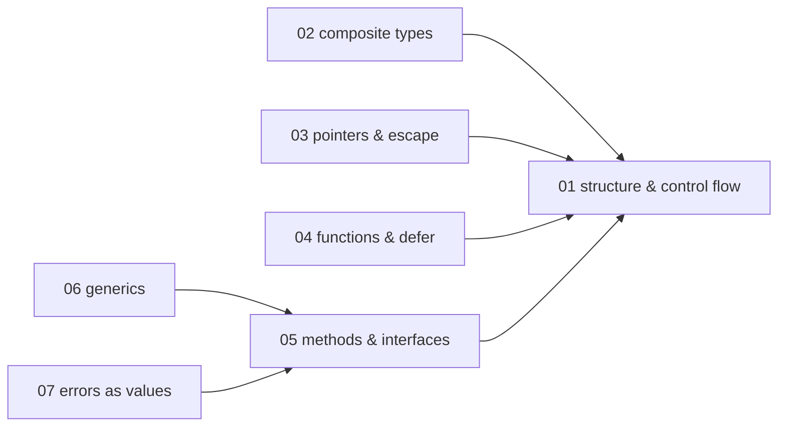
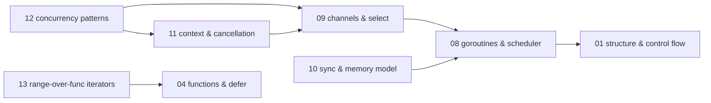
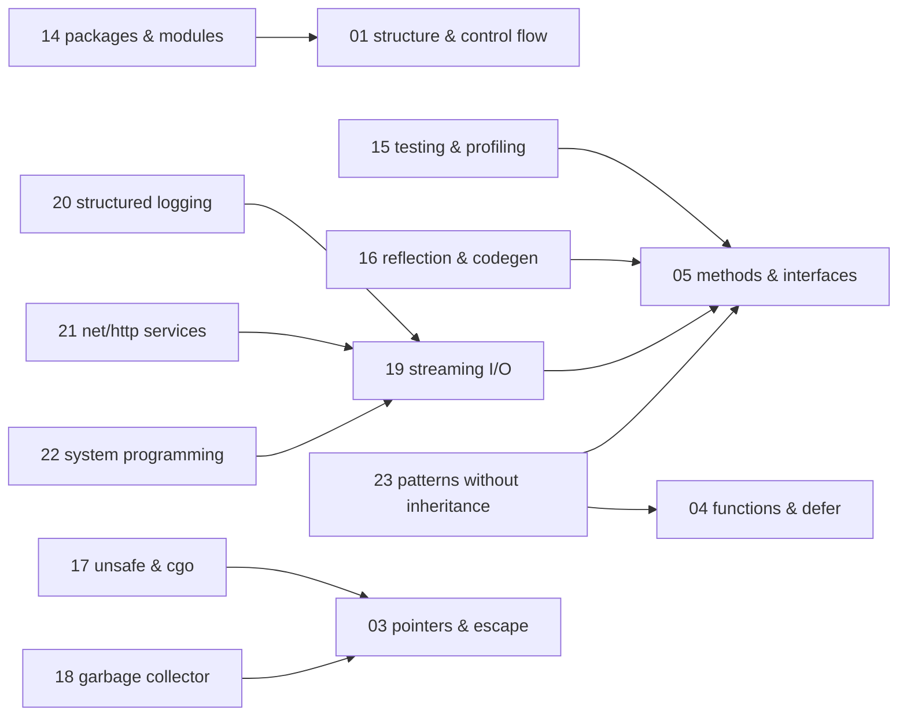

# Go — knowledge graph

*A compiled, garbage-collected language whose distinguishing claims are structural typing through
implicit interface satisfaction, concurrency as a first-class language construct rather than a
library, and a toolchain that treats dependency resolution and build reproducibility as part of the
language definition.*

**Nodes:** 23 · **Books:** 9 · **Currency researched:** 2026-08-08
**Requires:** [`02_os`](../02_os/00_knowledge_graph.md), [`13_http`](../13_http/00_knowledge_graph.md) — the language core requires nothing, but two application nodes do: `GO-22` on the system-call interface and `GO-21` on HTTP message semantics
**Feeds:** none yet — no other subject declares a `requires` edge into a `GO-*` node

---

## §1 Source audit

| Book | Year | Documents | Verdict |
|---|---|---|---|
| Donovan & Kernighan, *The Go Programming Language* | 2015 | The language as of Go 1.5: program structure, basic and composite types, functions, methods, interfaces, goroutines and channels, shared-variable concurrency, packages and the `go` tool, testing, reflection, `unsafe` and cgo | Still the most precise description of the language core on this shelf, and its interface and channel chapters have not dated at all. It predates modules, generics, error wrapping, and context in the standard library, so every chapter touching tooling or error handling is a historical document |
| Kennedy, Ketelsen & Martin, *Go in Action* | 2015 | A working tour: packaging and tooling, array/slice/map internals, the type system and interfaces, goroutines and race conditions, three concurrency patterns, standard-library logging and encoding, testing and benchmarking | Good on slice and map internals and on the runner/pooling/work patterns, which are still the shapes production code takes. Chapter 3 teaches GOPATH and pre-module dependency management and chapter 8 hand-builds a levelled logger; both have been superseded outright |
| Butcher & Farina, *Go in Practice* | 2016 | A recipe book: errors and panics, debugging and testing, HTML and email templates, serving assets and forms, consuming web services, cloud deployment, cross-service communication, reflection and code generation | Useful for the application-shaped problems the language-reference books skip. Its error chapter predates `%w`, `errors.Is` and `errors.As` entirely, and its cloud chapters describe a provider landscape that has turned over completely |
| Contreras, *Go Design Patterns* | 2017 | The Gang of Four catalogue rendered in Go — creational, structural and behavioural patterns — plus an introduction to Go concurrency and the barrier, future, pipeline, worker-pool and publish/subscribe patterns | Sound on the patterns that fall out of interfaces and embedding. Written for a language with no type parameters, so its type-erasing chapters route everything through `interface{}` and now have a type-safe alternative |
| *Go: Design Patterns for Real-World Projects* (Packt learning path) | 2017 | Three books in one: a language primer (source files, declarations, control flow, data types, functions, packages, composite types, methods and interfaces, concurrency, I/O, networked services, testing), the Contreras pattern catalogue again, and eight applied projects from a WebSocket chat server to Go kit microservices and Docker deployment | The primer is a competent second pass over the same ground Donovan covers better. Its value here is the applied module: the project chapters are the only place on this shelf that shows a whole service assembled. Everything it says about tooling and deployment is pre-module and pre-modern-container-runtime |
| Kommadi, *Learn Data Structures and Algorithms with Golang* | 2019 | Classical data structures and algorithms implemented in Go — linear and non-linear structures, homogeneous and heterogeneous structures, dynamic structures, sorting/searching/recursion/hashing, graphs and sparse matrices — plus a chapter on Go memory management, garbage collection and cache management | The algorithms belong to `03_dsa`, not here; what this book contributes to a Go graph is its memory-management chapter and its worked mapping of textbook structures onto slices and maps. Its garbage-collection chapter describes the pre-`GOMEMLIMIT`, pre-Green-Tea collector |
| Guerrieri, *Hands-On System Programming with Go* | 2019 | System programming from the Unix side: protection rings and system calls, POSIX, filesystems and paths, streams, pseudo-terminals, processes and daemons, exit codes and signals, network programming, data encoding, goroutines and channels, `sync` and `atomic`, `context`, concurrency patterns, reflection, cgo | The best source here for the operating-system boundary, and the OS material itself does not date. The Go calls layered over it did: it predates `signal.NotifyContext`, `os.Root`, and the `os/exec` cancellation fields |
| Yellavula, *Hands-On RESTful Web Services with Go*, 2nd ed. | 2020 | Building REST services in Go: `net/http` and routing, middleware and JSON-RPC, four third-party frameworks, MongoDB and PostgreSQL access, protocol buffers and gRPC, API clients, asynchronous API design, GraphQL, microservices, Nginx and Docker deployment, AWS, authentication with JWT and OAuth 2.0 | Broad and the only applied web-services source on this shelf. Two chapters exist only because the standard router could not match on method or path parameters, which stopped being true in Go 1.22; its protocol-buffer, gRPC, MongoDB and GraphQL chapters belong to other subjects |
| Bodner, *Learning Go*, 1st ed. | 2021 | Idiomatic Go at the level a working engineer needs: environment and tooling, types and declarations, composite types, blocks and control structures, functions and closures, pointers and escape analysis, types/methods/interfaces, errors including wrapping, modules and packages, concurrency, standard library, context, testing, reflect/unsafe/cgo, and a preview chapter on generics | The most current book here and the only one that teaches modules and error wrapping correctly. Two things to watch: it is the *first* edition, so its generics chapter is titled "A Look at the Future" and describes a design that changed before shipping — the 2024 second edition covers the real feature — and it predates the Go 1.22 loop-variable change, iterators, and `log/slog` |

---

## §2 Node index

| ID | Node | Type | Depth | Currency |
|---|---|---|---|---|
| `GO-01` | Program structure, declarations, and control flow | Mechanism | L3 | `stale-minor` |
| `GO-02` | Composite types and their memory layout | Structure | L4 | `stale-major` |
| `GO-03` | Pointers, value semantics, and the escape-analysis boundary | Mechanism | L4 | `stale-minor` |
| `GO-04` | Functions, closures, `defer`, panic, and recover | Mechanism | L4 | `stale-major` |
| `GO-05` | Methods, interfaces, and implicit satisfaction | Mechanism | L5 | `stale-minor` |
| `GO-06` | Generics: type parameters, constraints, and inference | Mechanism | L4 | `stale-major` |
| `GO-07` | Errors as values: sentinels, wrapping, and inspection | Mechanism | L4 | `stale-minor` |
| `GO-08` | Goroutines and the runtime scheduler | Mechanism | L5 | `stale-major` |
| `GO-09` | Channels and `select`: CSP in practice | Mechanism | L4 | `current` |
| `GO-10` | Shared-memory synchronisation and the Go memory model | Mechanism | L4 | `stale-minor` |
| `GO-11` | Cancellation, deadlines, and context propagation | Mechanism | L4 | `stale-minor` |
| `GO-12` | Concurrency patterns: pipelines, fan-in/fan-out, and bounded worker pools | Practice | L4 | `stale-minor` |
| `GO-13` | Range-over-func iterators and the iterator protocol | Mechanism | L4 | `absent` |
| `GO-14` | Packages, modules, and the build toolchain | Tool | L4 | `stale-major` |
| `GO-15` | Testing, benchmarking, and profiling | Practice | L4 | `stale-minor` |
| `GO-16` | Reflection, struct tags, and code generation | Mechanism | L4 | `stale-minor` |
| `GO-17` | `unsafe`, cgo, and the C boundary | Mechanism | L5 | `stale-minor` |
| `GO-18` | The garbage collector and memory-limit tuning | Mechanism | L5 | `stale-major` |
| `GO-19` | Streaming I/O and encoding: the `io` interfaces | Mechanism | L4 | `stale-minor` |
| `GO-20` | Structured logging and runtime observability | Practice | L3 | `stale-major` |
| `GO-21` | Building HTTP services: `net/http`, routing, and middleware | Mechanism | L4 | `stale-major` |
| `GO-22` | System programming: processes, signals, and the Unix interface | Mechanism | L4 | `stale-minor` |
| `GO-23` | Design patterns without inheritance | Model | L4 | `stale-major` |

---

## §3 The graph

### The language core

### Concurrency

### Runtime, toolchain, and applications

---

## §4 Node records

### `GO-01` · Program structure, declarations, and control flow
**Type:** Mechanism · **Depth:** L3
**Covers:** package and file organisation, `var` versus short variable declaration, typed and untyped constants, `iota` enumerations, the zero value as a language guarantee, scope and shadowing, `if` with an initialiser, expression and type switches, `for` in its four forms, labels and `goto`, unused variables and unused imports as compile errors, the blank identifier
**Sources:** Donovan & Kernighan ch.2–3 (2015) · Bodner ch.2, ch.4 (2021) · *Design Patterns for Real-World Projects* Module 1 ch.2–4 (2017) · Kennedy ch.2 (2015)
**Currency:** `stale-minor`
**Δ current:** Donovan (2015) and Bodner (2021) both predate `min`, `max` and `clear` becoming predeclared builtins in Go 1.21 (released August 2023), so both write out the two-line helper that returns the smaller of two integers. Bodner's "for, Four Ways" describes the loop variable as one variable reused across every iteration; Go 1.22 (February 2024) changed the specification to scope it per iteration for any module declaring `go 1.22` or later, and the consequences of that are treated on `GO-04`. Declaration and control-flow syntax is otherwise exactly as both books describe it. An article should use the current builtins and show the hand-written helpers only as what older code contains.

### `GO-02` · Composite types and their memory layout
**Type:** Structure · **Depth:** L4
**Covers:** arrays as values versus slices as views, the three-word slice header, `append` growth and the aliasing surprise when two slices share a backing array, full slice expressions, map element non-addressability, struct field alignment and padding, struct embedding, `string`/`[]byte`/`[]rune` conversions and their copies
**Sources:** Donovan & Kernighan ch.4 (2015) · Bodner ch.3, ch.6 (2021) · Kennedy ch.4 (2015) · Kommadi ch.2, ch.4–7 (2019)
**Edges:** `requires` [`GO-01`] · `implements` [`DSA-04`, `DSA-14`]
**Currency:** `stale-major`
**Δ current:** All four books explain the built-in map as an array of buckets holding eight key/value pairs each, chained to overflow buckets when a bucket fills. Go 1.24 (February 2025) replaced that implementation with a Swiss Table design, described in the Go blog post "Faster Go maps with Swiss Tables" and living in the runtime's `internal/runtime/maps`, which stores groups of eight slots behind a control word rather than chaining overflow buckets, and changes both the probing behaviour and the memory profile of a large map. Slice and struct layout are untouched. Separately, the `slices` and `maps` standard-library packages added in Go 1.21 (August 2023) supply the sorting, searching, cloning and comparison helpers all four books write by hand. An article should keep the slice-header exposition verbatim and rewrite any bucket-and-overflow account of maps against the Swiss Table design.

### `GO-03` · Pointers, value semantics, and the escape-analysis boundary
**Type:** Mechanism · **Depth:** L4
**Covers:** Go's call-by-value rule and what a pointer parameter changes about it, pointers as the marker for a mutable parameter, the zero value versus the absence of a value, `new` against a composite literal, escape analysis and why returning a pointer forces a heap allocation, slices as reusable buffers, reading the compiler's decision with `go build -gcflags=-m`
**Sources:** Bodner ch.6 (2021) · Donovan & Kernighan ch.2.3, ch.13.1 (2015) · *Design Patterns for Real-World Projects* Module 1 ch.4 (2017)
**Edges:** `requires` [`GO-01`] · `refines` [`COMP-11`]
**Currency:** `stale-minor`
**Δ current:** Bodner's chapter 6 remains accurate on call-by-value, on pointer receivers and on escape analysis, and the `-gcflags=-m` workflow it describes is unchanged. Two capabilities have been added since. Go 1.24 (February 2025) introduced the `weak` package, giving weak pointers for caches and canonicalisation maps — a kind of reference none of these books has a name for. Go 1.26 (released 10 February 2026) extended the built-in `new` so its operand may be an expression rather than only a type, so allocating and initialising in one step no longer needs the temporary-variable-then-address-of dance the books use. An article should keep the escape-analysis treatment and add both.

### `GO-04` · Functions, closures, `defer`, panic, and recover
**Type:** Mechanism · **Depth:** L4
**Covers:** multiple return values, named result parameters and their interaction with a deferred function, variadic parameters, functions as values and as struct fields, closures over an environment, the LIFO order of deferred calls and when their arguments are evaluated, `panic` as abnormal exit, `recover` working only inside a deferred function, decorating an error on the way out with `defer`
**Sources:** Donovan & Kernighan ch.5 (2015) · Bodner ch.5 (2021) · *Design Patterns for Real-World Projects* Module 1 ch.5 (2017) · Butcher & Farina ch.4 (2016)
**Edges:** `requires` [`GO-01`]
**Currency:** `stale-major`
**Δ current:** Every book here teaches the loop-variable capture bug — a closure or goroutine created inside a `for` body closing over the single loop variable and observing its final value — and every one prescribes the same fix, shadowing with `x := x` at the top of the body. Go 1.22 (February 2024) changed the specification so that loop variables are scoped per iteration, which makes both the bug and the fix obsolete; because the change is gated on the language version, a package whose module still declares `go 1.21` keeps the old semantics, so the two behaviours coexist in one codebase. An article must state which language version its examples assume before it shows a closure inside a loop at all, and should present the shadowing idiom only as what pre-1.22 code looks like.

### `GO-05` · Methods, interfaces, and implicit satisfaction
**Type:** Mechanism · **Depth:** L5
**Covers:** method sets and the pointer-versus-value receiver rule, structural satisfaction with no `implements` declaration, the interface value as a (type, value) pair, the typed-nil trap where a non-nil interface holds a nil pointer, type assertions and type switches, embedding as composition rather than inheritance, "accept interfaces, return structs", implicit interfaces as the dependency-injection mechanism, the empty interface
**Sources:** Donovan & Kernighan ch.6–7 (2015) · Bodner ch.7 (2021) · Kennedy ch.5 (2015) · *Design Patterns for Real-World Projects* Module 1 ch.8 (2017)
**Edges:** `requires` [`GO-01`]
**Currency:** `stale-minor`
**Δ current:** Satisfaction rules, method sets and the typed-nil trap are unchanged, and the (type, value) exposition in Donovan §7.5 is still the clearest on the shelf. Two things moved with Go 1.18 (March 2022). `any` became a predeclared alias for `interface{}`, which every one of these books writes in full throughout, and `gofmt -r` will rewrite it. More substantially, interfaces acquired a second role they did not previously have: as generic constraints they may contain type sets such as `interface{ ~int | ~string }`, a form that is legal only in a constraint position and that none of these books can describe. An article should teach the (type, value) pair as written and separate the constraint role explicitly, cross-referencing `GO-06`.

### `GO-06` · Generics: type parameters, constraints, and inference
**Type:** Mechanism · **Depth:** L4
**Covers:** type parameter lists on functions and on types, constraints as interfaces carrying type sets, `comparable`, approximation elements such as `~int`, call-site type inference, generic data structures, why a method may not introduce its own type parameters, and the cases where an ordinary interface remains the better tool
**Sources:** Bodner ch.15 (2021) — written before the feature shipped, under the title "A Look at the Future"
**Edges:** `requires` [`GO-05`]
**Currency:** `stale-major`
**Δ current:** Bodner's chapter 15 is explicitly a preview of an unreleased design: it uses "type lists" inside constraint interfaces and the `constraints` package as though both were settled. Generics shipped in Go 1.18 (March 2022) with type *sets* rather than type lists, with `constraints` left in `golang.org/x/exp` rather than promoted to the standard library, and with `any` and `comparable` predeclared. Inference was then widened in Go 1.21 (August 2023) to cover generic functions passed as arguments or assigned to variables, and Go 1.24 (February 2025) made type aliases parameterizable. The restriction the chapter flags as an open question — that methods may not declare their own type parameters — was still in force through Go 1.26: proposal golang/go#77273, "spec: generic methods for Go", was opened by Robert Griesemer on 22 January 2026 and carries the `Proposal-Accepted` label against the Go1.27 milestone, but Go 1.27 was unreleased as of this pass, so an article must not present generic methods as available. Write the article against the shipped feature and treat this chapter as a historical document.

### `GO-07` · Errors as values: sentinels, wrapping, and inspection
**Type:** Mechanism · **Depth:** L4
**Covers:** the `error` interface and returning errors as ordinary values, `errors.New` and `fmt.Errorf`, sentinel errors and the coupling they create, custom error types, wrapping with `%w` and the `Unwrap` contract, `errors.Is` against `errors.As`, decorating an error in a deferred function, when a panic is correct instead of an error, obtaining a stack trace
**Sources:** Bodner ch.8 (2021) · Butcher & Farina ch.4 (2016) · Donovan & Kernighan ch.5.4, ch.7.11 (2015)
**Edges:** `requires` [`GO-05`]
**Currency:** `stale-minor`
**Δ current:** Donovan (2015) and Butcher & Farina (2016) predate the wrapping vocabulary entirely — `%w`, `errors.Is` and `errors.As` all arrived in Go 1.13 (September 2019) — so their advice to compare errors with `==` or a bare type assertion is what a linter now objects to. Bodner (2021) covers all three correctly. What postdates Bodner is narrower: Go 1.20 (February 2023) let `fmt.Errorf` take several `%w` verbs and added `errors.Join`, so an error may now wrap a set of errors through `Unwrap() []error`. The other development is a decision rather than a feature, and is worth stating because it settles the question these books leave open: the Go team closed the `?` operator proposal, golang/go#71203, in February 2025, and announced on the Go blog in June 2025, in "[ On | No ] syntactic support for error handling", that it would stop pursuing syntactic error-handling changes and close incoming proposals of that kind. An article can therefore present `if err != nil` as the settled form rather than an interim one.

### `GO-08` · Goroutines and the runtime scheduler
**Type:** Mechanism · **Depth:** L5
**Covers:** the `go` statement, goroutines as runtime-scheduled rather than OS-scheduled, the machine/processor/goroutine model and work stealing, growable stacks that start at a few kilobytes, `GOMAXPROCS`, thread hand-off when a goroutine blocks in a syscall, goroutine leaks and how they present, `runtime/trace` and the goroutine dump emitted on deadlock
**Sources:** Donovan & Kernighan ch.8.1, ch.9.8 (2015) · Kennedy ch.6.1–6.2 (2015) · Guerrieri ch.11 (2019) · Bodner ch.10 (2021)
**Edges:** `requires` [`GO-01`] · `contrasts` [`CONC-01`] · `contrasts` [`JAVA-10`]
**Currency:** `stale-major`
**Δ current:** Donovan and Kennedy, both 2015, describe a purely cooperative scheduler in which a goroutine yields only at a function call, channel operation or system call, and warn that a tight loop containing no calls can starve the scheduler and delay garbage collection. Go 1.14 (February 2020) made goroutines asynchronously preemptible by delivering a `SIGURG` to the thread running them, which removes that failure mode on every platform except the short list its release notes name, and which has the visible side effect that programs see more `EINTR` from slow system calls. The `GOMAXPROCS` default changed again in Go 1.25 (August 2025): on Linux the runtime reads the cgroup CPU bandwidth limit and defaults to it when it is below the logical CPU count, and re-reads it periodically, so the books' rule that `GOMAXPROCS` equals the core count is simply wrong inside a container. An article should lead with asynchronous preemption and the container-aware default.

### `GO-09` · Channels and `select`: CSP in practice
**Type:** Mechanism · **Depth:** L4
**Covers:** unbuffered channels as a rendezvous against buffered channels as a bounded queue, send and receive semantics, closing a channel and the comma-ok receive, ranging over a channel, directional channel types in a signature as a compile-time contract, `select` with a `default` clause for a non-blocking attempt, a nil channel disabling a `select` case, the "share memory by communicating" maxim and the cases where it does not apply
**Sources:** Donovan & Kernighan ch.8.4–8.10 (2015) · Kennedy ch.6.5 (2015) · Guerrieri ch.11 (2019) · Bodner ch.10 (2021)
**Edges:** `requires` [`GO-08`] · `implements` [`CONC-13`] · `contrasts` [`GO-13`]
**Currency:** `current`

### `GO-10` · Shared-memory synchronisation and the Go memory model
**Type:** Mechanism · **Depth:** L4
**Covers:** `sync.Mutex` and `sync.RWMutex`, `sync.WaitGroup`, `sync.Once`, `sync.Map` and the narrow cases where it beats a mutex-guarded map, the `sync/atomic` primitives, the happens-before relation the memory model defines, the race detector and what it costs to run, choosing a mutex over a channel and the reasoning behind that choice
**Sources:** Donovan & Kernighan ch.9.1–9.7 (2015) · Kennedy ch.6.3–6.4 (2015) · Guerrieri ch.12 (2019) · Bodner ch.10 (2021)
**Edges:** `requires` [`GO-08`] · `contrasts` [`JAVA-08`]
**Currency:** `stale-minor`
**Δ current:** The mutex material and the race detector are intact, and `go test -race` works exactly as Donovan §9.6 describes. The memory model document all four books lean on was rewritten in June 2022, alongside Go 1.19, to specify Go's atomics as sequentially consistent and to align the formulation with the C, C++ and Java models — so the books implicitly rely on a normative statement that did not yet exist. Go 1.19 (August 2022) also added typed atomic values such as `atomic.Int64`, `atomic.Bool` and `atomic.Pointer[T]`, which replace the loose `atomic.AddInt64(&x, 1)` calls every book here writes and remove the 64-bit alignment hazard on 32-bit platforms. Go 1.25 (August 2025) added `WaitGroup.Go`, folding the `wg.Add(1)` and `defer wg.Done()` pair into a single call. An article should use the typed atomics and `WaitGroup.Go`, naming the older spellings only as what existing code contains.

### `GO-11` · Cancellation, deadlines, and context propagation
**Type:** Mechanism · **Depth:** L4
**Covers:** `context.Context` as the conventional first parameter, `WithCancel`, `WithTimeout` and `WithDeadline`, selecting on `ctx.Done()`, `ctx.Err()`, honouring cancellation inside a long-running loop of your own, context values as request-scoped data only, how the standard library threads a context through `net/http` and database drivers
**Sources:** Bodner ch.12 (2021) · Guerrieri ch.13 (2019) · Donovan & Kernighan ch.8.9 (2015) — cancellation by broadcast channel, written before the package existed
**Edges:** `requires` [`GO-09`]
**Currency:** `stale-minor`
**Δ current:** Donovan §8.9 predates the package: `context` entered the standard library in Go 1.7 (August 2016), so the chapter's hand-rolled `done` channel is the pattern `context` replaced rather than an alternative to it, and should be presented that way. Bodner (2021) and Guerrieri (2019) cover the package as it then stood, before the cause-carrying constructors: `context.WithCancelCause` arrived in Go 1.20 (February 2023), and `WithDeadlineCause`, `WithTimeoutCause`, `AfterFunc` and `WithoutCancel` in Go 1.21 (August 2023). `context.Cause(ctx)` can therefore now report *why* a tree was cancelled where the books can only report `context.Canceled`, which is the difference between a usable timeout error and an opaque one. An article should teach the cause-carrying forms as the default.

### `GO-12` · Concurrency patterns: pipelines, fan-in/fan-out, and bounded worker pools
**Type:** Practice · **Depth:** L4
**Covers:** generator functions returning a receive-only channel, pipeline stages joined by channels, fanning out to N workers and fanning in through a merge, the done-channel idiom and its replacement by context, worker pools over a bounded queue, the semaphore-as-buffered-channel idiom, the barrier and future patterns, publish/subscribe over channels, `errgroup` for error propagation across a group
**Sources:** Kennedy ch.7 (2015) · Guerrieri ch.14 (2019) · Contreras ch.9–10 (2017) · *Design Patterns for Real-World Projects* Module 2 ch.9–10 (2017)
**Edges:** `requires` [`GO-09`, `GO-11`]
**Currency:** `stale-minor`
**Δ current:** The pattern catalogue is sound and the channel mechanics beneath it have not moved, so these four chapters remain usable as written. Two things around them have changed. `golang.org/x/sync/errgroup` now offers `SetLimit`, which supersedes the hand-rolled semaphore channel all four books use for bounding parallelism and additionally propagates the first error and cancels the group's context, which none of the book pools do — the specific `x/sync` release that introduced `SetLimit` was not established in this pass and should be checked before an article cites a version. The second change is firmer: these patterns were historically untestable except by sleeping, and `testing/synctest` graduated from a `GOEXPERIMENT=synctest` trial in Go 1.24 to general availability in Go 1.25 (August 2025), providing a virtualised clock and a `Wait` that blocks until every goroutine in the bubble is blocked. An article should show the patterns as the books do and then test them with `synctest.Test` rather than with `time.Sleep`.

### `GO-13` · Range-over-func iterators and the iterator protocol
**Type:** Mechanism · **Depth:** L4
**Covers:** ranging over `func(func() bool)`, `func(func(V) bool)` and `func(func(K, V) bool)`, `iter.Seq` and `iter.Seq2`, writing a push iterator over a custom container, early termination through the yield function's boolean result, `slices.All`/`Backward`/`Collect`/`Sorted`, `maps.All`/`Keys`/`Values`, and `iter.Pull` for converting a push iterator into a pull one
**Sources:** —
**Edges:** `requires` [`GO-04`] · `contrasts` [`GO-09`]
**Currency:** `absent`
**Δ current:** No book in this directory postdates the feature; the newest, Bodner's first edition (2021), predates it by three releases. Range-over-function iterators shipped in Go 1.23 (August 2024) along with the new `iter` package, and the same release added the iterator-producing and iterator-consuming functions in `slices` and `maps`. Before them, the idiomatic way to stream a sequence lazily out of a data structure was a goroutine writing to a channel, which is what every book on this shelf teaches, and which costs a goroutine and a channel per traversal and leaks both when the consumer stops early. An article on this node has to be written from the Go 1.23 release notes and the `iter` package documentation, and should open with the channel-generator version precisely because that is what the shelf contains.

### `GO-14` · Packages, modules, and the build toolchain
**Type:** Tool · **Depth:** L4
**Covers:** package naming and the exported-identifier rule, import paths, blank and named imports, `init` ordering, the `go` command's build/run/test/vet subcommands, `go.mod` and `go.sum`, semantic import versioning and the `/v2` path suffix, minimal version selection, the module proxy and checksum database, vendoring, multi-module workspaces with `go.work`, build tags and conditional compilation
**Sources:** Donovan & Kernighan ch.10 (2015) · Kennedy ch.3 (2015) · Bodner ch.1, ch.9 (2021) · Guerrieri ch.3 (2019)
**Edges:** `requires` [`GO-01`]
**Currency:** `stale-major`
**Δ current:** Donovan ch.10 and Kennedy ch.3, both 2015, are written entirely in GOPATH terms — one workspace directory holding `src`, `pkg` and `bin`, import paths resolved out of the filesystem, and third-party dependencies delegated to `godep` or a `vendor/` directory. Modules replaced all of it: introduced in Go 1.11 (August 2018), made the default when Go 1.16 (February 2021) flipped `GO111MODULE` to `on`, with `go get` no longer installing anything in GOPATH mode at all. Bodner (2021) covers modules, `go.mod` and proxy servers correctly but predates three later additions: `go.work` workspaces for editing several modules together (Go 1.18, March 2022), the `toolchain` directive and automatic toolchain switching (Go 1.21, August 2023), and the `tool` directive that records executable dependencies in `go.mod` and retires the `tools.go` blank-import workaround (Go 1.24, February 2025). An article should teach modules from the start and use GOPATH only to explain why module paths look the way they do.

### `GO-15` · Testing, benchmarking, and profiling
**Type:** Practice · **Depth:** L4
**Covers:** `go test` and the `_test.go` convention, table-driven tests, subtests with `t.Run`, `t.Helper` and `t.Cleanup`, coverage measurement, `testing.B` and what a benchmark loop actually measures, `httptest` for handler tests, stubbing through interfaces, build-tagged integration tests, the race detector under test, CPU and heap profiles through `pprof`, example functions as compiled documentation
**Sources:** Donovan & Kernighan ch.11 (2015) · Kennedy ch.9 (2015) · Bodner ch.13 (2021) · Butcher & Farina ch.5 (2016)
**Edges:** `requires` [`GO-05`]
**Currency:** `stale-minor`
**Δ current:** The `go test` model, table-driven tests and example functions are unchanged since 2015, which is why Donovan ch.11 still reads as current. Four additions postdate the whole shelf. Built-in fuzzing through `testing.F` shipped in Go 1.18 (March 2022) and appears in none of these books. Profile-guided optimization became generally available in Go 1.21 (August 2023), which turns a `pprof` profile from a diagnostic artefact into a build input the compiler consumes. Go 1.24 (February 2025) added `testing.B.Loop`, which is now the correct benchmark loop and removes the mis-measurement that the `for i := 0; i < b.N; i++` form invites, and `t.Context`. Go 1.25 (August 2025) added `testing/synctest` for concurrent tests. An article should write its benchmarks with `b.Loop`.

### `GO-16` · Reflection, struct tags, and code generation
**Type:** Mechanism · **Depth:** L4
**Covers:** `reflect.Type` and `reflect.Value`, `Kind` against `Type`, settability and the addressable-value rule, walking a struct recursively, struct field tags as the encoding contract, constructing values at runtime, the cost of a reflective call against a direct one, `go generate` and generated code as the alternative to reflecting at runtime
**Sources:** Donovan & Kernighan ch.12 (2015) · Butcher & Farina ch.11 (2016) · Guerrieri ch.15 (2019) · Bodner ch.14 (2021)
**Edges:** `requires` [`GO-05`]
**Currency:** `stale-minor`
**Δ current:** The `reflect` API these books describe is intact, and struct-tag conventions have not changed. What changed is the argument around it: generics (Go 1.18, March 2022) removed the main justification these chapters give for reaching into `reflect` at all, namely writing one function that works across several types, so an article written now has to justify reflection on the ground generics cannot reach — chiefly encoding and decoding driven by struct tags at runtime. Go 1.22 (February 2024) also added `reflect.TypeFor[T]`, which obtains a `reflect.Type` from a type parameter directly and replaces the `reflect.TypeOf((*T)(nil)).Elem()` incantation the books use. An article should open by narrowing reflection's remaining territory rather than presenting it as the general-purpose tool these chapters assume.

### `GO-17` · `unsafe`, cgo, and the C boundary
**Type:** Mechanism · **Depth:** L5
**Covers:** `unsafe.Sizeof`, `Alignof` and `Offsetof` and what they reveal about struct padding, `unsafe.Pointer` and the legal conversion patterns its documentation enumerates, `uintptr` as a non-pointer and the garbage-collection hazard that follows, cgo's `import "C"` preamble, the C and Go type mappings, passing slices and structs across the boundary, the cgo pointer-passing rules, the per-call cost of crossing
**Sources:** Donovan & Kernighan ch.13 (2015) · Guerrieri ch.16 (2019) · Bodner ch.14 (2021)
**Edges:** `requires` [`GO-03`]
**Currency:** `stale-minor`
**Δ current:** The `unsafe.Pointer` conversion patterns and the cgo pointer-passing rules are unchanged and remain the binding constraint, so Donovan ch.13 is still the right explanation of why they exist. Three conveniences arrived afterwards: `unsafe.Slice` in Go 1.17 (August 2021), and `unsafe.String`, `unsafe.StringData` and `unsafe.SliceData` in Go 1.20 (February 2023), which together replace the `reflect.SliceHeader` and `reflect.StringHeader` casts Donovan and Guerrieri demonstrate — and both of those header types now carry deprecation notices in the `reflect` documentation. On cost, Go 1.26 (February 2026) reduced baseline cgo call overhead by roughly 30% according to its release notes, so any figure quoted from a 2015–2019 book for the price of crossing into C is stale in the pessimistic direction. An article should use the modern `unsafe` helpers and cite the Go 1.26 release notes for cgo overhead rather than quoting a book's now-stale figure.

### `GO-18` · The garbage collector and memory-limit tuning
**Type:** Mechanism · **Depth:** L5
**Covers:** the concurrent tricolour mark-and-sweep collector, write barriers, mark assists, `GOGC` as a heap-growth ratio, `GOMEMLIMIT` as a soft ceiling, allocation reduction as the real tuning lever, `runtime/debug.SetGCPercent` and `SetMemoryLimit`, reading `runtime/metrics` and a heap profile, why resident set size does not fall immediately after a collection
**Sources:** Kommadi ch.11 (2019) · Bodner ch.6 (2021)
**Edges:** `requires` [`GO-03`] · `contrasts` [`PY-04`]
**Currency:** `stale-major`
**Δ current:** Kommadi (2019) and Bodner (2021) both describe a collector with one tuning knob, `GOGC`, and give the standard advice to allocate less. Go 1.19 (August 2022) added `GOMEMLIMIT`, a soft memory limit covering the heap and all other runtime-managed memory, which turns the tuning story from a ratio into a ceiling and is the setting that makes a Go process behave sensibly under a container memory cap. The collector itself was then replaced: the Green Tea design shipped as `GOEXPERIMENT=greenteagc` in Go 1.25 (August 2025), whose release notes state an expected 10–40% reduction in collection overhead for allocation-heavy programs, and became the default in Go 1.26 (February 2026). An article should lead with `GOMEMLIMIT`, describe the collector as Green Tea, and treat the older mark-and-sweep pacing as the background that explains it.

### `GO-19` · Streaming I/O and encoding: the `io` interfaces
**Type:** Mechanism · **Depth:** L4
**Covers:** `io.Reader` and `io.Writer` as single-method interfaces, composition through `TeeReader`, `MultiWriter` and `LimitReader`, `bufio` and why buffering changes the syscall count, `io.Copy` and transfer without an intermediate allocation, path handling and file operations, `encoding/json` marshalling driven by struct tags, streaming decoders over a whole-document unmarshal, `encoding/gob` and `encoding/binary`, text and HTML templates as writers
**Sources:** Donovan & Kernighan ch.4.5–4.6 (2015) · Kennedy ch.8.3–8.4 (2015) · Guerrieri ch.4–5, ch.10 (2019) · Bodner ch.11 (2021) · Butcher & Farina ch.6 (2016)
**Edges:** `requires` [`GO-05`]
**Currency:** `stale-minor`
**Δ current:** The `io.Reader`/`io.Writer` contract is the most stable thing in the standard library and nothing about it has changed, so the composition material in Donovan and Bodner is current as written. The packages around it moved. Go 1.16 (February 2021) added `io/fs` and `embed`, relocated the `io/ioutil` functions into `io` and `os`, and marked the whole `ioutil` package deprecated, so every `ioutil.ReadFile` in these books now has `os.ReadFile` as its preferred spelling. Go 1.24 (February 2025) added `os.Root`, which confines filesystem operations below a directory and is the direct answer to the path-traversal problem Guerrieri's chapter 4 raises and then leaves to manual checking. For JSON specifically, `encoding/json/v2` and the lower-level `encoding/json/jsontext` shipped in Go 1.25 (August 2025) behind `GOEXPERIMENT=jsonv2` and were still experimental as of Go 1.26, so an article should teach v1 and name v2 as what is coming rather than as current practice.

### `GO-20` · Structured logging and runtime observability
**Type:** Practice · **Depth:** L3
**Covers:** `log.Logger` and its destinations, log levels and why the standard library historically had none, the cost of unstructured lines at aggregation time, `log/slog`'s split into `Logger`, `Handler`, `Record` and `Attr`, `TextHandler` against `JSONHandler`, `With` for fixed attributes, groups, level thresholds and changing them at runtime, carrying a logger on a context, exposing runtime state through `runtime/metrics` and `expvar`
**Sources:** Kennedy ch.8.2 (2015) · Butcher & Farina ch.5 (2016)
**Edges:** `requires` [`GO-19`]
**Currency:** `stale-major`
**Δ current:** Kennedy's chapter 8 builds a levelled logger by hand out of several `log.Logger` values, and Butcher & Farina send the reader to third-party packages for anything structured; both were correct advice in 2015 and 2016. `log/slog` entered the standard library in Go 1.21 (August 2023) and addresses precisely the problem both books work around, with a `Handler` interface, key/value attributes, and `TextHandler` and `JSONHandler` implementations. The Go blog's introduction, "Structured Logging with slog", is explicit that displacing third-party loggers was never the goal, so an article should not present the choice as settled either way — but it should be written against `slog` and use the hand-rolled levelled logger only to show what `slog` replaced.

### `GO-21` · Building HTTP services: `net/http`, routing, and middleware
**Type:** Mechanism · **Depth:** L4
**Covers:** `http.Handler` and `HandlerFunc`, `ServeMux` pattern matching and path parameters, middleware as handler decoration and the chaining problem it creates, `http.Server` timeouts and graceful shutdown, `httptest` for handler tests, decoding and encoding JSON bodies, what a third-party router or framework adds over the standard library and what it costs
**Sources:** Yellavula ch.1–4 (2020) · Donovan & Kernighan ch.7.7 (2015) · Guerrieri ch.9 (2019) · Bodner ch.11 (2021) · Butcher & Farina ch.7–8 (2016)
**Edges:** `requires` [`GO-19`] · `requires` [`HTTP-02`] · `contrasts` [`GRPC-01`]
**Currency:** `stale-major`
**Δ current:** Yellavula's chapters 2 and 3 (2020) exist only because the standard `ServeMux` could match neither on method nor on path segments, so the book spends two chapters on `httprouter`, `gorilla/mux`, `go-restful`, Gin and Revel. Go 1.22 (February 2024) added both capabilities to `net/http` directly: a pattern may name a method and wildcard segments, as in `GET /task/{id}`, read back through `Request.PathValue`, with an automatic 405 on a method mismatch and a documented most-specific-wins precedence rule, described in the Go blog post "Routing Enhancements for Go 1.22". That removes the principal reason those chapters give for reaching for a router at all. The book's main router also had an interruption it cannot mention: the Gorilla toolkit was archived in December 2022 and unarchived in July 2023 under new core maintainers, announced on the project's own blog on 17 July 2023. An article should lead with the enhanced `ServeMux` and treat a third-party router as a choice that now needs a stated reason.

### `GO-22` · System programming: processes, signals, and the Unix interface
**Type:** Mechanism · **Depth:** L4
**Covers:** system calls and the split between `syscall` and `golang.org/x/sys`, file descriptors and file modes, `os/exec` and the child-process lifecycle, exit codes, signal handling with `os/signal`, connecting streams through pipes, daemons and long-running services, pseudo-terminals, users, groups and permission bits
**Sources:** Guerrieri ch.1–2, ch.6–8 (2019) · Donovan & Kernighan ch.1 (2015)
**Edges:** `requires` [`GO-19`] · `requires` [`OS-01`]
**Currency:** `stale-minor`
**Δ current:** Guerrieri's material on protection rings, system calls, POSIX and file descriptors is operating-system fact and does not date; this is one of the few chapters on the shelf that can be read as written. The Go surface over it moved in three places. `signal.NotifyContext` (Go 1.16, February 2021) collapses the signal-channel-and-goroutine boilerplate the book writes into a single call returning a cancellable context. `os/exec` gained `Cmd.Cancel` and `Cmd.WaitDelay` in Go 1.20 (February 2023), which close the child-process leak the book's context-cancellation example leaves open. `os.Root` (Go 1.24, February 2025) confines filesystem operations below a directory. An article should keep the syscall exposition intact and modernise only the Go calls layered on it.

### `GO-23` · Design patterns without inheritance
**Type:** Model · **Depth:** L4
**Covers:** composition and embedding in place of an inheritance hierarchy, the functional-options constructor, small interfaces and interface segregation, the creational patterns as Go actually writes them, decorator and adapter over `io.Reader`, strategy and command as plain function values, the observer pattern expressed with channels, and the cases where a pattern is imported overhead rather than a Go design
**Sources:** Contreras ch.2–7 (2017) · *Design Patterns for Real-World Projects* Module 2 ch.2–7 (2017) · Kennedy ch.5.5 (2015)
**Edges:** `requires` [`GO-05`, `GO-04`]
**Currency:** `stale-major`
**Δ current:** Both 2017 books were written for a language with no type parameters, and several of their catalogue entries exist only to work around that absence: the abstract-factory and prototype chapters route every value through `interface{}` and recover the type with an assertion, which generics (Go 1.18, March 2022) replaces with a signature the compiler checks. The structural and behavioural patterns built on interfaces and embedding — decorator, adapter, strategy, command, observer — are unaffected by that change and remain idiomatic exactly as written. An article should keep the interface-based patterns, rewrite the type-erasing ones against generics, and say plainly which of the two categories each pattern falls into.

---

## §5 Cross-subject edges

| From | Edge | To | Why |
|---|---|---|---|
| `GO-02` | `implements` | `DSA-04` | Go's slice is a concrete realisation of the dynamic-array ADT, with a specific growth policy and a specific aliasing hazard that the abstract structure does not have |
| `GO-02` | `implements` | `DSA-14` | The built-in map is a concrete realisation of the hash-table ADT; since Go 1.24 it is specifically a Swiss Table, which is a different collision strategy from the chaining the DSA node describes |
| `GO-03` | `refines` | `COMP-11` | Escape analysis is the narrow, compiler-decided case of the general stack-versus-heap split, and is where a Go programmer meets that split concretely |
| `GO-08` | `contrasts` | `CONC-01` | Two opposite answers to running concurrent code in a managed runtime: an M:N scheduler multiplexing goroutines across every core, against an interpreter lock serialising bytecode execution onto one |
| `GO-09` | `implements` | `CONC-13` | Channels and `select` are the shipped realisation of the CSP process algebra that node treats formally, including its rendezvous semantics on an unbuffered channel |
| `GO-18` | `contrasts` | `PY-04` | A concurrent tricolour mark-and-sweep collector tuned by `GOGC` and `GOMEMLIMIT` against deterministic reference counting plus a generational cycle collector — different pause profiles, different leak signatures, different tuning surfaces |
| `GO-21` | `requires` | `HTTP-02` | `http.Handler` is a direct expression of request/response message semantics; status codes, methods and header handling have to mean something before a handler signature does |
| `GO-21` | `contrasts` | `GRPC-01` | The same service exposed as REST over `net/http` against a schema-first RPC contract — the comparison that node exists to make, seen from the Go implementation side |
| `GO-22` | `requires` | `OS-01` | Guerrieri's whole first section is the system-call interface and the protection ring; the Go wrappers are meaningless without it |
| `GO-08` | `contrasts` | `JAVA-10` | Go's scheduler multiplexes goroutines across a small number of OS threads automatically; Java's Executor framework requires sizing a bounded pool of OS threads against the workload by hand — the sizing question the Executor framework exists to answer largely does not arise in Go |
| `GO-10` | `contrasts` | `JAVA-08` | Two memory models answering the same question — what a compiler and CPU may reorder, and what a lock or channel operation makes visible — with `sync.Mutex`/channel operations on one side and `volatile`/`synchronized`/`VarHandle` on the other |

---

## §6 Coverage gaps

**Nothing on this shelf postdates Go 1.17.** The newest book, Bodner's first edition, was published
in 2021 and its final chapter previews a feature that shipped differently. Nine releases have
landed since, and four of them changed something a book here teaches as settled: generics in 1.18,
`log/slog` in 1.21, per-iteration loop variables in 1.22, and range-over-function iterators in 1.23.
The practical consequence is that `GO-06`, `GO-13` and `GO-20` cannot be written from the shelf at
all, and `GO-04` cannot be written from it safely. The Go release notes, one page per release at
`go.dev/doc/go1.NN`, are the substitute source, and the second edition of *Learning Go* (January
2024) would close most of the gap in one purchase — it covers generics as shipped and postdates
`log/slog`, though it still predates iterators.

**No book here covers profiling or performance work at the depth the subject deserves.** Donovan
ch.11.5 and Bodner ch.13 both introduce `pprof` in a few pages as a testing adjunct, and Kommadi's
memory-management chapter stops at describing the collector. Nothing treats reading a flame graph,
interpreting an escape-analysis dump at scale, or profile-guided optimization, which became
generally available in Go 1.21 and is now a build input rather than a diagnostic. The Go
diagnostics guide and the PGO documentation would close this; a measured module on `GO-18` also
needs a machine with a real allocation-heavy workload to profile, not a toy.

**The REST book carries four chapters that belong to other subjects and are deliberately not cited
here.** Its protocol-buffer and gRPC chapter is `17_grpc` material, its MongoDB chapter is
`10_mongodb`, its PostgreSQL and JSONStore chapter is `09_sql`, and its GraphQL chapter has no
subject in this repository at all — there is no assigned prefix for GraphQL, so that chapter is
named here rather than silently dropped. The same book's AWS, Terraform and API-gateway chapter
describes a 2020 cloud surface and was not used as a source for any node.

**The DSA-in-Go book is cited for two things and excluded from everything else.** Kommadi's
chapters on linear, non-linear, homogeneous, heterogeneous and dynamic structures, and on the
classic sorting and searching algorithms, are `03_dsa` material that happens to be written in Go;
duplicating them as `GO-*` nodes would misfile algorithm content as language content. Only the
memory-management chapter and the Go-specific mapping of arrays, slices and maps are cited, on
`GO-18` and `GO-02` respectively.

**Two mechanisms have no node because they have neither book coverage nor a settled shape.**
The first is Go's build cache and compilation model — why `go build` is fast, what the cache keys
on, and how that interacts with the module graph — which the toolchain documentation covers but no
book here does; it sits on `GO-14`'s `Covers` line rather than earning a node. The second is
generic methods: proposal golang/go#77273 was accepted in January 2026 against the Go1.27
milestone, but the release had not shipped as of this pass, so `GO-06` records the restriction as
current and names the proposal rather than describing a feature nobody can yet run.

**One comparison worth drawing has no edge because the peer node is not a good match.** Go's
`context` tree — cancellation propagating down a tree of derived contexts, with a cause attached —
is the closest thing in this repository to asyncio's task-cancellation model in `CONC-04`, but that
node is scoped to event-loop internals rather than to cancellation as a mechanism, so asserting a
`contrasts` edge between them would overstate the fit. The comparison is recorded here instead.

---

← [repo index](../README.md) · [root graph](../KNOWLEDGE_GRAPH.md) · [writing contract](../AGENTS.md)
